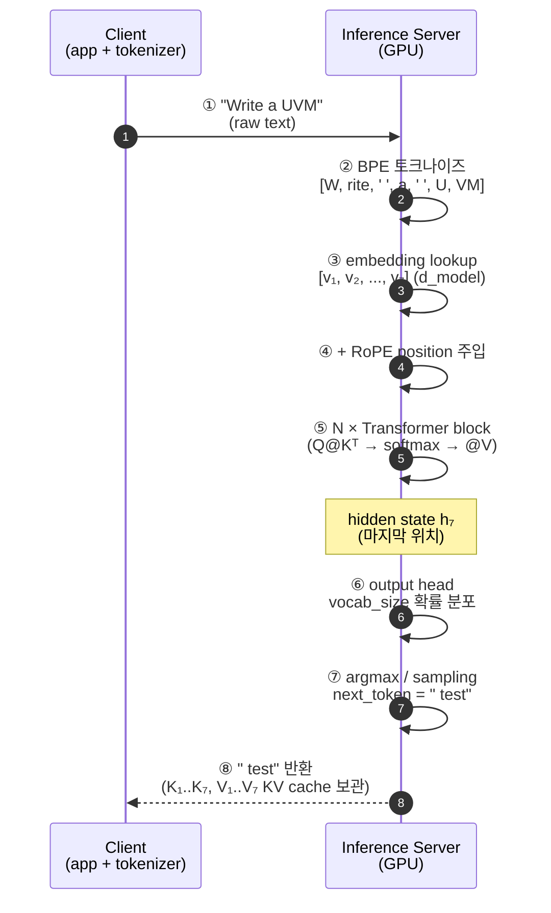

# Module 01 — LLM Fundamentals

<!-- DV-SKOOL-CH-CTX:start -->
<div class="chapter-context" data-cat="applied">
  <a class="chapter-back" href="../">
    <span class="chapter-back-arrow">←</span>
    <span class="chapter-back-icon">🤖</span>
    <span class="chapter-back-text">AI Engineering</span>
  </a>
  <span class="chapter-divider">›</span>
  <span class="chapter-marker">Module 01</span>
</div>
<!-- DV-SKOOL-CH-CTX:end -->

<!-- DV-SKOOL-CH-TOC:start -->
<div class="page-toc">
  <span class="page-toc-label">목차</span>
  <a class="page-toc-link" href="#1-why-care-llm-을-내부-구조로-이해해야-하는-이유">1. Why care?</a>
  <a class="page-toc-link" href="#2-intuition-자기회귀-토큰-생성기-와-한-장-그림">2. Intuition</a>
  <a class="page-toc-link" href="#3-작은-예-write-a-uvm-한-호출의-내부를-step-by-step">3. 작은 예 — 한 호출 내부 추적</a>
  <a class="page-toc-link" href="#4-일반화-transformer-self-attention-그리고-축소-기법들">4. 일반화 — Transformer + 축소 기법</a>
  <a class="page-toc-link" href="#5-디테일-tokenization-rope-flash-attention-moe-quantization-scaling-laws">5. 디테일</a>
  <a class="page-toc-link" href="#6-흔한-오해-와-dv-디버그-체크리스트">6. 흔한 오해 + 디버그</a>
  <a class="page-toc-link" href="#7-핵심-정리-key-takeaways">7. 핵심 정리</a>
</div>
<!-- DV-SKOOL-CH-TOC:end -->

!!! objective "학습 목표"
    이 모듈을 마치면:

    - **Define** Transformer 의 self-attention, position embedding, FFN 의 역할을 정의할 수 있다.
    - **Explain** "다음 토큰 확률 예측" 이 어떻게 임의 길이의 텍스트 생성으로 이어지는지 설명할 수 있다.
    - **Apply** 주어진 시나리오(코드 생성, 요약, 추론) 에 적합한 모델 크기/형태(MoE, Quantization) 를 선택할 수 있다.
    - **Decompose** Context window, KV cache, batch size 가 latency/throughput 에 미치는 영향을 분해할 수 있다.
    - **Evaluate** 제품 상황(클라우드 API vs on-prem) 에 맞는 LLM 배포 전략을 평가할 수 있다.

!!! info "사전 지식"
    - Python · NumPy 기본
    - 신경망의 기본 개념 (forward pass, gradient descent)
    - 토큰 / 임베딩 / softmax 라는 단어를 들어 본 적이 있어야 함

---

## 1. Why care? — LLM 을 "내부 구조" 로 이해해야 하는 이유

### 1.1 시나리오 — "왜 같은 모델인데 API 비용이 _10 배_ 차이?"

당신은 같은 LLaMA-2 13B 모델을 두 사용자에게 서비스합니다:

- **사용자 A**: 500-token 요약 작업. 응답 시간 1 초.
- **사용자 B**: 32K-token long-document QA. 응답 시간 30 초, **GPU 비용 80 배**.

같은 모델인데 왜? **답은 KV cache** — LLaMA-2 13B 의 KV cache 는 _토큰 당 ~1 MB_ 입니다 [Introl 2025]. 32K context 면 **32 GB 의 GPU 메모리** 가 _한 sequence_ 에만. Batch=32 로 운영하면 **1 TB**.

이게 LLM API 의 _가격이 토큰 수에 _제곱_ 비슷하게 늘어나는_ 정확한 이유:

| Context | KV cache | GPU 1 개에서 batch 가능 수 | 토큰당 비용 |
|---------|----------|--------------------------|------------|
| 2K | 2 GB | 16 | $0.001 |
| 8K | 8 GB | 4 | $0.004 |
| 32K | 32 GB | 1 (또는 multi-GPU) | $0.04 |

이 _비용 cliff_ 가 KV cache 의 크기에서 _기계적으로_ 나옵니다. Magic 이 아닙니다.

### 1.2 그래서 이 모듈을 잡아야 한다

이후 모든 모듈 (Prompt / RAG / Agent / Strategy) 은 한 가정에서 출발합니다 — **"LLM 은 magic box 가 아니라 _자기회귀 토큰 생성기_ 다"**. KV cache 메모리가 왜 폭증하는지, context window 가 왜 비싼지, batch 가 왜 throughput 을 결정하는지, MoE 가 왜 "총 파라미터 ≠ 활성 파라미터" 인지 — 모두 이 한 가정의 파생입니다.

이 모듈을 건너뛰면 이후의 prompt/RAG 결정이 "그냥 외워야 하는 best practice" 가 됩니다. 반대로 이 가정을 정확히 잡으면 latency / 비용 / 품질 trade-off 를 만날 때마다 _이유_ 가 보입니다.

!!! question "🤔 잠깐 — KV cache 메모리는 _왜_ 그렇게 크나?"
    LLaMA-2 13B 의 토큰 당 1 MB KV cache. 어디에서 오는 수치인지 _대략_ 계산해보세요.

    힌트: hidden dim ≈ 5120, 40 layers, K + V 각각, 16-bit floats.

    ??? success "정답"
        토큰 당 KV cache = `2 × num_layers × hidden_dim × 2 byte`
        = `2 × 40 × 5120 × 2` = **819 KB ≈ 1 MB**.

        ("2 ×" 는 K 와 V 각각, 마지막 "2 byte" 는 fp16/bf16).

        그래서 _layer 수 + hidden dim + fp16_ 의 곱이 토큰당 메모리. **모델이 커지면 _layer 와 hidden 이 같이 커지므로_ KV cache 가 빠르게 늘어남.**

        이게 GQA / MLA / Flash Attention 같은 _최근 모든 추론 최적화_ 가 "KV 줄이기" 에 집중하는 이유.

---

## 2. Intuition — "자기회귀 토큰 생성기" 와 한 장 그림

!!! tip "💡 한 줄 비유"
    **LLM = 매우 빠른 추론 인턴 — 한 글자(토큰) 씩 "가장 likely 한 다음 글자" 를 결정하는 사람**.<br>
    한 번 호출 = "다음 토큰 1개의 확률 분포 → 샘플링" 의 **반복**. 글이 자연스러운 이유는 attention 으로 이전 컨텍스트 _전체_ 를 매 step 참조하기 때문.

### 한 장 그림 — RNN/LSTM 시대 vs Transformer 시대

```d2
direction: right

RNN: "RNN/LSTM (~2017) — 순차 처리" {
  direction: right
  # unparsed: R1["tok₁"]
  # unparsed: R2["tok₂"]
  # unparsed: R3["tok₃"]
  # unparsed: R4["tokₙ"]
  R1 { style.stroke: "#c0392b"; style.stroke-width: 3 }
  R2 { style.stroke: "#c0392b"; style.stroke-width: 3 }
  R1 -> R2: "hidden state"
  R3 { style.stroke: "#c0392b"; style.stroke-width: 3 }
  R2 -> R3: "hidden state"
  R4 { style.stroke: "#c0392b"; style.stroke-width: 3 }
  R3 -> R4: "..." { style.stroke-dash: 4 }
  # unparsed: RL["vanish/explode gradient<br/>GPU 병렬화 불가<br/>→ 장거리 의존성 손실"]
}
TX: "Transformer (2017~) — 모든 쌍 직접 연결" {
  direction: right
  # unparsed: T1["tok₁"]
  # unparsed: T2["tok₂"]
  # unparsed: T3["tok₃"]
  # unparsed: T4["tokₙ"]
  T1 <-> T2
  T1 <-> T3
  T1 <-> T4
  T2 <-> T3
  T2 <-> T4
  T3 <-> T4
  # unparsed: TL["Q@Kᵀ 한 번에<br/>모든 쌍 점수 계산<br/>→ 완전 병렬 + 장거리 직접 참조"]
}
```

세 개의 빨간 원이 Transformer 에서는 모두 사라지고, 대신 **attention 행렬** 이 토큰 쌍의 관계를 직접 잡습니다.

### 왜 이렇게 설계됐는가 — 두 순진한 시도가 실패한 결과

Transformer 도 _하늘에서 떨어진_ 게 아닙니다. 두 순진한 시도가 _구체적으로 어디서 막혔는지_ 의 결과물입니다.

**시도 1 — "RNN/LSTM 으로 sequence 처리"** (1997-2017)

순차적으로 처리하면 자연스럽다. 결과:
- **Vanishing/exploding gradient**: 100+ 토큰 시퀀스에서 학습 불가능 → BPTT 가 깊은 timestep 의 gradient 를 잃거나 폭주.
- **GPU 병렬화 불가**: `tᵢ₊₁` 계산이 `tᵢ` 결과를 기다림 → GPU 의 수천 코어 활용 못함 → 학습 속도 cap.
- **장거리 의존성 손실**: "100 토큰 전의 그 단어가 지금 토큰을 결정한다" 같은 패턴 학습 어려움.

**시도 2 — "Convolution 으로 local window 처리"** (ByteNet, ConvS2S 등 ~2017)

각 토큰이 _주변 N 개 토큰_ 만 본다. 결과:
- **장거리 의존성 더 손실**: window 밖 토큰을 보려면 layer 를 쌓아야 → 표현력 제한.
- **고정 receptive field**: 동적으로 "이 토큰은 100 토큰 전 그 단어를 봐야" 같은 결정 불가.

**해법 — Attention "모든 쌍 점수 한 번에"**

세 요구가 동시에 풀려야 했습니다:

1. **Gradient 가 깊은 sequence 에도 흐르도록** → attention 의 _직접 path_ (모든 토큰이 다른 모든 토큰을 한 step 으로 봄).
2. **GPU 병렬화 가능** → `Q @ Kᵀ` 의 _큰 행렬곱_ 한 번이 모든 쌍을 계산.
3. **장거리 의존성 직접 학습** → attention weight 가 _어느 쌍이 중요한지_ 를 학습.

이 세 요구의 교집합이 _self-attention_ + _multi-head_ + _residual + LayerNorm_ 의 패키지입니다.

GPU 는 행렬곱에 최적화되어 있습니다. 토큰을 "순차" 로 처리하면 `tᵢ₊₁` 계산이 `tᵢ` 결과를 기다려야 하므로 GPU 병렬화가 막힙니다. Transformer 는 "토큰 쌍의 점수를 한 번의 `Q @ Kᵀ` 행렬곱으로 계산" 하는 자세를 잡아 학습 단계의 병렬화를 풀었습니다. 그 대가로 추론 단계에서는 여전히 한 토큰씩 생성해야 하고, 그래서 KV cache · GQA · Flash Attention 같은 추론 최적화가 모두 필요해진 것입니다.

이 한 줄 — _"학습은 병렬, 추론은 순차"_ — 이 LLM 비용 구조 전체의 출발점입니다.

#### 실패 모드 — 세 축이 빠지면 정확히 무엇이 일어나는가

| 빠진 축 | 시스템 증상 | 측정 가능한 metric |
|--------|------------|------------------|
| **KV cache 없음** (매 토큰마다 전체 시퀀스 재계산) | latency 가 _시퀀스 길이의 제곱_ 으로 증가 | 32K 시퀀스에서 토큰 당 latency 1000× |
| **Multi-head 없음** (single head) | 다양한 관계 (syntax + semantic + position) 동시 표현 못함 | downstream 성능 -5~10% |
| **Position encoding 없음** | 토큰 순서 무관 (bag-of-tokens) | "I love you" vs "you love I" 구분 불가 |

---

## 3. 작은 예 — `"Write a UVM"` 한 호출의 내부를 step-by-step

가장 단순한 시나리오. 사용자 입력 `"Write a UVM"` 을 받아 LLM 이 다음 토큰 하나 (`" test"`) 를 예측해 응답하는 한 사이클을 8단계로 추적합니다.



| Step | 누가 | 무엇을 | 의미 |
|---|---|---|---|
| ① | client | raw text 전송 | HTTP / gRPC / local stdin — 모델은 raw text 그대로 못 받음 |
| ② | tokenizer | BPE 로 sub-word 분할 | `"UVM"` 도 어휘에 없으면 `[U, VM]` 등으로 쪼개짐 |
| ③ | embedding layer | token id → `d_model` 차원 벡터 | `vocab_size × d_model` lookup 행렬 |
| ④ | position 모듈 | 위치 신호 주입 (RoPE: Q/K 회전) | Transformer 는 순서 모름 — 별도 주입 필수 |
| ⑤ | N 개 Transformer block | self-attention + FFN, residual + LayerNorm | LLaMA-70B = 80 layer, GPT-3.5 ≈ 96 layer |
| ⑥ | output head (LM head) | 마지막 hidden → vocab 확률 | 어휘 100K 면 `d_model × 100K` 행렬곱 |
| ⑦ | sampler | greedy / top-p / temperature | 코드 생성은 보통 T=0 (deterministic) |
| ⑧ | server | next_token 반환 + **K,V cache 저장** | 다음 호출에서 step ⑤ 의 K/V 재계산 회피 |

```python
# Step ⑦ 의 단순화 예시 — Greedy 디코딩
import torch
import torch.nn.functional as F

logits = model_forward(input_ids)         # (1, seq_len, vocab_size)
next_token_logits = logits[:, -1, :]      # 마지막 위치만 사용
next_token = torch.argmax(next_token_logits, dim=-1)  # (1,)

# Top-p (nucleus) sampling 의 경우
probs = F.softmax(next_token_logits / temperature, dim=-1)
sorted_probs, sorted_idx = torch.sort(probs, descending=True)
cumulative = torch.cumsum(sorted_probs, dim=-1)
mask = cumulative <= top_p
# mask 된 토큰 중에서만 multinomial sampling
```

!!! note "여기서 잡아야 할 두 가지"
    **(1) "한 번의 호출 = 한 토큰" 이 본질** — 응답이 길수록 step ⑤~⑦ 을 그만큼 반복. 그래서 latency 는 출력 길이에 거의 _선형_ 비례.<br>
    **(2) KV cache 가 메모리 폭주의 주범** — step ⑧ 에서 매 step 마다 K/V 가 누적. context 가 길어지면 KV cache 가 모델 가중치보다 클 수 있음 (§5.4 참조).

---

## 4. 일반화 — Transformer, Self-Attention, 그리고 축소 기법들

### 4.1 Transformer 블록의 골격

```d2
direction: down

IN: "입력: 'The cat sat on the'"
TE: "Token Embedding\n'The' → [0.1, -0.3, ...] (d_model 차원)"
PE: "Positional Encoding\nToken Emb + Position Emb\n(Transformer 는 순서를 모름)"
TB1: "Transformer Block × N (32 / 80 / 128 ...)" {
  direction: down
  MHA: "Multi-Head Self-Attention\n(각 토큰이 다른 모든 토큰 참조)"
  FFN: "Feed-Forward Network (FFN)\n(비선형 변환)"
  RES: "+ Residual Connection + LayerNorm"
  MHA -> FFN
  FFN -> RES
}
OH: "Output Head\n벡터 → 어휘 크기 확률 분포\nargmax → 'mat'"
IN -> TE
TE -> PE
PE -> TB1
TB1 -> OH
```

### 4.2 Self-Attention 의 핵심 수식

```
Attention(Q, K, V) = softmax(QKᵀ / √d_k) × V

Q (Query):  "이 토큰이 알고 싶은 것"
K (Key):    "각 토큰이 제공할 수 있는 정보의 인덱스"
V (Value):  "각 토큰이 실제로 제공하는 정보"
```

이 한 식이 (1) 모든 토큰 쌍의 관련성을 계산하고 (2) 관련성에 비례해 정보를 가중합산합니다. `√d_k` 로 나누는 것은 dot-product 가 너무 커져서 softmax 가 saturate 되는 것을 막는 안전장치.

### 4.3 직관 — 문장 안에서 attention

```
"The cat sat on the mat because it was tired"

"it" 이 참조해야 할 토큰은?
  → "cat"   (높은 Attention Score)
  → "mat"   (낮은 Score — 의미적으로 "it" 은 "cat" 을 지칭)

Attention Score (예시):
  it → cat:    0.65   ← 가장 높음
  it → mat:    0.10
  it → sat:    0.08
  it → tired:  0.12
```

### 4.4 Multi-Head Attention — 한 관점이 아니라 여러 관점

```
Head 1: 문법적 관계 (주어-동사)
Head 2: 의미적 관계 (대명사-선행사)
Head 3: 위치적 관계 (인접 토큰)
...

MultiHead(Q, K, V) = Concat(head_1, ..., head_h) × W_O
head_i = Attention(Q × W_Q_i, K × W_K_i, V × W_V_i)
```

### 4.5 추론 비용을 줄이는 세 갈래

| 축소 기법 | 무엇을 줄임 | 대가 | 위치 |
|---|---|---|---|
| **KV Cache** | 동일 prefix 의 K/V 재계산 | GPU 메모리 ↑ | 추론 시 |
| **GQA / MQA** | KV head 수 (h → g 또는 1) | 미세 품질 손실 | 모델 학습 시 |
| **Quantization** | 가중치/활성치 비트 폭 (FP16 → INT4) | 미세 정확도 손실 | 배포 시 |
| **Flash Attention** | HBM ↔ SRAM IO | (없음, 알고리즘 등가) | 학습/추론 모두 |
| **MoE** | 활성 파라미터 수 (모든 expert ≠ active expert) | 라우팅 오버헤드, 메모리 ↑ | 모델 설계 시 |

이 다섯 축이 §5 의 디테일에 모두 등장합니다.

---

## 5. 디테일 — Tokenization, RoPE, Flash Attention, MoE, Quantization, Scaling Laws

### 5.1 Tokenization — 텍스트를 숫자로

| 방식 | 예시 | 특징 |
|------|------|------|
| Word-level | "playing" → [playing] | 어휘가 매우 커짐, OOV 문제 |
| Character-level | "playing" → [p,l,a,y,i,n,g] | 어휘 작지만 시퀀스 길어짐 |
| **BPE (Byte-Pair Encoding)** | "playing" → [play, ing] | 가장 일반적, 빈도 기반 서브워드 |
| SentencePiece | "playing" → [▁play, ing] | 언어 독립적 BPE |

```
BPE 동작 원리:
1. 초기: 모든 문자를 개별 토큰으로 시작
   "l o w e r" → [l, o, w, e, r]

2. 가장 빈번한 인접 쌍을 병합
   (l, o) → lo    →  [lo, w, e, r]
   (lo, w) → low  →  [low, e, r]
   (e, r) → er    →  [low, er]
   (low, er) → lower → [lower]

3. 설정된 어휘 크기까지 반복
   GPT-4: ~100K 토큰, Claude: ~100K 토큰
```

```
LLM API 비용 = 입력 토큰 수 + 출력 토큰 수

  영어:    ~1 토큰 ≈ 4글자 ≈ 0.75 단어
  한국어:  ~1 토큰 ≈ 1-2글자 (비효율적 → 비용 높음)
  코드:    변수명, 키워드 등 → 영어와 유사

  Context Window = 최대 처리 토큰 수
  GPT-4o: 128K, Claude: 200K, Gemini: 1M+

  DV 적용 시:
  - SystemVerilog 파일 전체를 Context 에 넣을 수 있는가?
  - 대규모 IP 스펙 문서를 처리할 수 있는가?
  → Context 한계 = RAG 가 필요한 이유 중 하나
```

### 5.2 Positional Encoding 발전사

```
Transformer 는 입력 순서를 모른다 (순열 불변):
  "cat sat on mat" 와 "mat on sat cat" 을 동일하게 처리
  → 위치 정보를 별도로 주입해야 함
```

| 세대 | 방식 | 원리 | 한계 |
|------|------|------|------|
| 1세대 | **Sinusoidal** (Transformer 원논문) | sin/cos 함수로 절대 위치 인코딩 | 학습된 위치 관계 표현 불가 |
| 2세대 | **Learned Absolute** (GPT-2, BERT) | 위치 임베딩을 학습 파라미터로 | 학습 길이 초과 시 성능 급락 |
| 3세대 | **RoPE** (Rotary Position Embedding) | Q, K 벡터를 위치에 따라 회전 | 현재 가장 널리 사용 |
| 4세대 | **ALiBi** (Attention with Linear Biases) | Attention Score 에 거리 비례 페널티 | 별도 임베딩 불필요, 외삽 강점 |

```
RoPE (현재 표준 — LLaMA, Claude, GPT-4 계열):

핵심 아이디어:
  Q, K 벡터를 2D 평면에서 위치(m)에 비례하여 회전
  f(q, m) = q × e^(imθ)  (복소수 회전)

  → 두 토큰의 Attention Score 가 "상대 위치 (m-n)" 에만 의존
  → 절대 위치가 아닌 상대 위치를 자연스럽게 인코딩

왜 강력한가:
  1. 상대 위치 인코딩 → "3번째 뒤의 토큰" 이라는 관계를 직접 표현
  2. 외삽 가능 → 학습 시 4K 토큰이어도 추론 시 더 긴 시퀀스 처리 가능
     (NTK-aware scaling, YaRN 등으로 Context 확장)
  3. 구현 간결 → Q, K 에만 적용, V 는 그대로

DV 적용 관점:
  긴 SystemVerilog 파일(수천 줄) 을 처리할 때 위치 외삽이 중요
  → RoPE 기반 모델이 긴 코드 파일에서 더 안정적
```

### 5.3 Attention 복잡도와 Flash Attention

```
Self-Attention 연산량:
  Q × Kᵀ = (n × d) × (d × n) = n × n 행렬

  n = 시퀀스 길이일 때:
    n = 4K   →   16M 연산
    n = 32K  → 1,024M 연산  (64배 증가)
    n = 128K → 16,384M 연산 (1024배 증가)

  메모리도 O(n²): Attention Score 행렬 전체를 메모리에 유지해야 함
  → Context Window 가 길어질수록 비용이 제곱으로 증가
  → 이것이 긴 Context 처리의 근본적 병목
```

```
Flash Attention (Tri Dao, 2022):

핵심: Attention 연산을 타일(tile) 단위로 분할하여 GPU SRAM 에서 처리

기존:
  전체 QKᵀ 행렬(O(n²)) 을 GPU HBM 에 저장 → 느린 메모리 접근

Flash Attention:
  블록 단위로 Q, K, V 를 SRAM 에 로드 → 부분 Attention 계산 → 결합
  → IO 복잡도 O(n²d / M) (M = SRAM 크기)
  → 실측 2-4x 속도 향상, 메모리 O(n) 으로 감소

  결과:
  - 같은 GPU 에서 더 긴 시퀀스 처리 가능
  - 현재 거의 모든 LLM 학습/추론에 사용
  - Flash Attention 2/3 으로 지속 최적화
```

```
MQA / GQA (Attention Head 최적화):

Multi-Head Attention (MHA):
  Head 수 = h일 때, 각 Head마다 별도 Q, K, V
  KV Cache 크기: h × n × d_k  → 메모리 부담

Multi-Query Attention (MQA):
  Q는 h개 Head, K/V는 1개만 공유
  KV Cache: 1 × n × d_k  → h배 절약
  단점: 품질 약간 하락

Grouped-Query Attention (GQA) — 현재 표준:
  Q는 h개 Head, K/V는 g개 그룹으로 공유 (1 < g < h)
  예: h=32, g=8 → 4개 Q Head 가 1개 KV 그룹 공유
  KV Cache: g × n × d_k  → MHA 대비 h/g배 절약

  LLaMA 2 70B: GQA 사용 (h=64, g=8)
  → MHA 대비 KV Cache 8배 절약, 품질 거의 동일

  +--------+--------+--------+
  |  MHA   |  GQA   |  MQA   |
  | Q K V  | Q K V  | Q K V  |
  | Q K V  | Q     | Q      |
  | Q K V  | Q K V  | Q      |
  | Q K V  | Q      | Q      |
  +--------+--------+--------+
  KV: h개   KV: g개  KV: 1개
```

### 5.4 KV Cache — 추론 속도의 핵심

```
Autoregressive 생성에서의 비효율:

  Step 1: "Write"           → Q,K,V 계산 → "a"
  Step 2: "Write a"         → Q,K,V 전부 재계산 → "UVM"
  Step 3: "Write a UVM"     → Q,K,V 전부 재계산 → "test"

  → 이전 토큰의 K, V 를 매번 다시 계산 = 낭비

KV Cache:
  Step 1: K₁,V₁ 계산 → 캐시 저장 → "a"
  Step 2: K₂,V₂만 새로 계산 → 캐시에 추가 → "UVM"
  Step 3: K₃,V₃만 새로 계산 → 캐시에 추가 → "test"

  → 새 토큰의 Q 만 전체 KV 캐시와 Attention → O(n) per step
  → KV Cache 없이는 O(n²) per step
```

```
KV Cache 메모리 계산:

KV Cache 크기 = 2 × n_layers × n_kv_heads × seq_len × d_head × dtype_bytes

예: LLaMA 2 70B (GQA)
  n_layers = 80, n_kv_heads = 8, d_head = 128, FP16 (2 bytes)
  seq_len = 4096일 때:
  = 2 × 80 × 8 × 4096 × 128 × 2 = ~1.3 GB per request

  seq_len = 128K일 때:
  = 2 × 80 × 8 × 131072 × 128 × 2 = ~41 GB per request
  → Context 가 길어지면 KV Cache 가 모델 가중치보다 클 수 있음

DV 관점:
  긴 SystemVerilog 파일을 Context 에 넣을 때 KV Cache 메모리가 급증
  → 필요한 부분만 RAG 로 검색하여 주입하는 것이 효율적인 이유
```

### 5.5 MoE (Mixture of Experts) 아키텍처

기존 (Dense Model): 모든 입력이 모든 파라미터를 통과 → 파라미터 수 = 연산량 (비례).
MoE: 입력마다 일부 Expert 만 활성화 (Sparse Activation) → 총 파라미터는 크지만 토큰당 연산량은 적음.

```d2
direction: down

# unparsed: IN["입력 토큰"]
# unparsed: R["Router (Gate Network)<br/>어떤 Expert 를 선택할지 결정<br/>Top-K (보통 K=2)"]
# unparsed: E1["Expert 1<br/>(FFN)"]
# unparsed: E2["Expert 2<br/>(FFN)"]
# unparsed: E3["Expert 3<br/>(FFN)"]
# unparsed: E4["..."]
# unparsed: E8["Expert 8<br/>(FFN)"]
# unparsed: OUT["Weighted Sum → 출력"]
IN -> R
R -> E1: "선택 안 됨" { style.stroke-dash: 4 }
E2 { style.stroke: "#27ae60"; style.stroke-width: 3 }
R -> E2
E3 { style.stroke: "#27ae60"; style.stroke-width: 3 }
R -> E3
R -> E4: "선택 안 됨" { style.stroke-dash: 4 }
R -> E8: "선택 안 됨" { style.stroke-dash: 4 }
E2 -> OUT
E3 -> OUT
```

→ 8개 Expert 중 2개만 활성화 = 파라미터 8x, 연산 ~2x.

| 모델 | 총 파라미터 | 활성 파라미터 | Expert 수 | Top-K |
|------|-----------|-------------|----------|-------|
| Mixtral 8x7B | 46.7B | 12.9B | 8 | 2 |
| Mixtral 8x22B | 176B | 39B | 8 | 2 |
| GPT-4 (추정) | ~1.8T | ~220B | 16 | 2 |
| DeepSeek-V2 | 236B | 21B | 160 | 6 |

```
트레이드오프:
  장점: 적은 연산으로 큰 모델의 성능 → 추론 비용 대비 고품질
  단점: 총 파라미터가 크므로 GPU 메모리 많이 필요 (로딩)
       Expert 간 불균형 (load balancing) 문제
       학습 불안정성

DV 관점:
  로컬 배포 시 MoE 모델(Mixtral) 은 Dense 모델 대비
  적은 연산으로 높은 성능 → DV 파이프라인 통합에 유리
```

### 5.6 Quantization — 모델 경량화

```
원래 모델: FP32 (32-bit 부동소수점)
  7B 모델 = 7 × 10⁹ × 4 bytes = 28 GB

양자화:
  FP32 → FP16 → INT8 → INT4
  정밀도를 낮춰 모델 크기와 연산량 감소

  7B 모델 메모리:
  FP32: 28 GB
  FP16: 14 GB  ← 학습 표준
  INT8:  7 GB  ← 추론 최적화
  INT4:  3.5 GB ← 소비자 GPU에서 실행 가능
```

| 방법 | 원리 | 정밀도 손실 | 속도 |
|------|------|-----------|------|
| **RTN** (Round-to-Nearest) | 단순 반올림 | 높음 | 즉시 |
| **GPTQ** | 레이어별 최적 양자화 | 낮음 | 수 시간 |
| **AWQ** (Activation-aware) | 중요 가중치 보존 | 매우 낮음 | 수 시간 |
| **GGUF** (llama.cpp) | CPU 추론 최적화 포맷 | 낮음 | 즉시 |

```
DV 적용 시:
  - 사내 서버(GPU 제한): INT4/INT8 양자화 모델로 배포
  - 예: Llama 3 70B INT4 → ~35GB → A100 1장에서 실행 가능
  - 코드 생성 품질: INT4 에서도 FP16 대비 95%+ 유지
  - 보안 + 성능 균형의 현실적 해법
```

### 5.7 Scaling Laws — 모델 크기와 성능의 관계

```
Chinchilla Scaling Law (2022):

최적 학습 조건:
  모델 파라미터 수(N) 와 학습 토큰 수(D) 를 동시에 늘려야 함
  최적 비율: D ≈ 20 × N

  예: 70B 모델 → 최소 1.4T 토큰으로 학습해야 최적
      7B 모델 → 최소 140B 토큰

이전 접근 (GPT-3): 큰 모델 + 적은 데이터
Chinchilla 접근: 적절한 모델 + 충분한 데이터
  → 같은 연산 예산으로 더 좋은 성능

결과:
  Chinchilla 70B > Gopher 280B (4배 작지만 더 우수)
  → 이후 LLaMA, Mistral 등 "효율적 학습" 트렌드
```

```
Emergent Abilities (창발 능력):

모델 크기가 특정 임계점을 넘으면 갑자기 나타나는 능력:

  ~10B: 기본 언어 이해, 간단한 코드
  ~50B: CoT 추론, 복잡한 코드 생성
  ~100B+: 수학 추론, 멀티스텝 계획, 도구 사용

  DV 적용 시:
  - SystemVerilog 코드 생성 → ~50B+ 모델에서 의미 있는 품질
  - UVM 패턴 이해 + 적용 → ~70B+ 권장
  - 작은 모델은 RAG/Few-shot 으로 보완 필수
```

### 5.8 LLM 의 학습 단계

```
Phase 1: Pre-training (사전 학습)
  - 대규모 텍스트 코퍼스 (수 TB)
  - Next Token Prediction (자기지도 학습)
  - 수천 GPU × 수 주~수 개월
  - 결과: 언어의 일반적 패턴 학습
  - 비용: 수백만~수천만 달러

Phase 2: SFT (Supervised Fine-Tuning)
  - 사람이 작성한 고품질 (질문, 답변) 쌍
  - 수만~수십만 예시
  - 결과: 지시 따르기(Instruction Following) 능력

Phase 3: RLHF / DPO (Human Alignment)
  - 사람이 선호하는 출력을 학습
  - 안전성, 유용성, 정확성 강화
  - 결과: 실용적인 AI 어시스턴트
```

### 5.9 추론 (Inference) 디코딩 전략

```
Autoregressive Generation:

입력: "Write a UVM"

Step 1: "Write a UVM" → P(next) → " test"
Step 2: "Write a UVM test" → P(next) → "bench"
Step 3: "Write a UVM testbench" → P(next) → " for"
...

한 번에 하나의 토큰만 생성 → 순차적 (병렬화 불가)
→ 이것이 LLM 추론이 느린 근본 이유
```

| 전략 | 동작 | 특징 |
|------|------|------|
| Greedy | 매 step 최고 확률 토큰 선택 | 빠르지만 단조로운 출력 |
| Top-k | 확률 상위 k개 중 샘플링 | 다양성 + 품질 균형 |
| Top-p (Nucleus) | 누적 확률 p 이내에서 샘플링 | 동적 후보 크기 |
| Temperature | 확률 분포를 sharp/flat 조절 | T<1: 보수적, T>1: 창의적 |

```
Temperature 효과:

  T = 0.0: 항상 같은 출력 (Greedy 와 동일) → 코드 생성, 정확성 필요 시
  T = 0.3: 약간의 변동 → 일반적 코드/분석
  T = 0.7: 적당한 다양성 → 문서 생성
  T = 1.0: 원래 분포 → 창의적 작문

  DV 적용 시: T = 0.0~0.3 권장 (코드 정확성 중요)
```

### 5.10 핵심 파라미터 정리

| 파라미터 | 의미 | 대표값 |
|---------|------|--------|
| d_model | 토큰 임베딩 차원 | 4096~12288 |
| n_layers | Transformer Block 수 | 32~128 |
| n_heads | Attention Head 수 | 32~128 |
| d_ff | FFN 히든 차원 | 4 × d_model |
| vocab_size | 어휘 크기 | 32K~128K |
| context_length | 최대 입력 토큰 수 | 4K~1M+ |
| params | 총 파라미터 수 | 7B~405B+ |

---

## 6. 흔한 오해 와 DV 디버그 체크리스트

### 흔한 오해

!!! danger "❓ 오해 1 — 'LLM 은 답을 안다'"
    **실제**: LLM 은 학습된 분포에서 _다음 토큰 확률_ 을 매기는 패턴 매칭기. lookup 이 아니라 generate 입니다. 따라서 학습 데이터에 없는 사실을 "그럴듯하게" 만들어 내는 hallucination 이 본질적으로 발생합니다.<br>
    **왜 헷갈리는가**: 답이 자주 정확해서 "외워서 알고 있다" 는 인상을 줌. + 마케팅 문구 ("AI 가 알고 있다").

!!! danger "❓ 오해 2 — '모델이 크면 다 해결된다'"
    **실제**: Frontier 모델조차 hallucination, context 한계, KV cache 폭주로 실패. **"task 분해 + RAG 품질 + Agent guard"** 가 모델 크기보다 ROI 가 높은 경우가 많습니다.<br>
    **왜 헷갈리는가**: 매년 모델 크기 뉴스만 보고 "크기 = 능력" 으로 단순화.

!!! danger "❓ 오해 3 — 'Context window 는 길수록 좋다'"
    **실제**: 길이의 _제곱_ 으로 attention 비용이 증가하고, KV cache 가 모델 가중치보다 커질 수도 있습니다. 또한 긴 context 의 중간 정보는 "lost in the middle" 현상으로 무시되기 쉽습니다.<br>
    **왜 헷갈리는가**: spec sheet 에 "200K context" 같은 숫자만 보임.

!!! danger "❓ 오해 4 — 'MoE = 더 큰 모델이라 더 비싸다'"
    **실제**: MoE 는 _총_ 파라미터는 크지만 _활성_ 파라미터만 연산. Mixtral 8x7B 는 47B 가중치를 가지지만 토큰당 13B 만 활성. 다만 GPU 메모리에는 47B 전체가 올라가야 함.<br>
    **왜 헷갈리는가**: "총 파라미터" 만 보고 비용을 계산.

!!! danger "❓ 오해 5 — 'Quantization 은 정확도가 무조건 떨어진다'"
    **실제**: AWQ / GPTQ 같은 현대 양자화는 INT4 에서도 FP16 대비 95%+ 정확도를 유지. _어떤_ 양자화를 쓰느냐가 결정적이고, RTN 같은 단순 양자화만 가지고 일반화하면 안 됩니다.

### DV 디버그 체크리스트 (LLM 추론을 직접 운용할 때 자주 보는 실패)

| 증상 | 1차 의심 | 어디 보나 |
|---|---|---|
| time-to-first-token 이 길이에 _제곱_ 비례 | KV cache 비활성화 (`use_cache=False`) | 추론 서버 설정, 응답의 `cached_tokens` 카운트 |
| OOM (Out of Memory) at long context | KV cache 가 모델 가중치보다 커짐 | `n_layers × n_kv_heads × seq_len × d_head × 2` 계산 |
| 같은 prompt 인데 답이 매번 다름 | Temperature > 0 또는 seed 미고정 | `temperature`, `seed`, `top_p` 파라미터 |
| 응답이 한 글자씩 끊겨 나옴 | streaming 모드 + tokenizer encoding 문제 | tokenizer 가 multi-byte (한글) 를 한 token 단위로 가르고 있는지 |
| 한국어 응답이 영어보다 _훨씬_ 비쌈 | tokenizer 가 한국어를 1-2 글자씩 자름 | tiktoken/BPE 로 직접 토큰 수 측정 |
| INT4 양자화 후 출력 이상 | RTN 단순 양자화 사용 | AWQ/GPTQ/GGUF 로 교체 후 평가 |
| 긴 prompt 의 _중간_ 정보를 무시 | "lost in the middle" 현상 | 중요한 지시는 prompt 의 시작/끝에 배치 |
| MoE 모델인데 추론 throughput 이 dense 보다 낮음 | router 가 expert 사이를 자주 뜀 + GPU 간 통신 | Top-K, expert 분포, batch size 점검 |

---

## 7. 핵심 정리 (Key Takeaways)

- **LLM = 자기회귀 토큰 생성기** — 한 호출 = 한 토큰. 응답 길이가 곧 latency.
- **Transformer = Self-Attention + Position + FFN** — 모든 토큰 쌍을 한 번의 행렬곱으로.
- **추론 비용의 주범은 KV cache** — context 길이의 제곱으로 메모리 폭증. GQA · Flash Attention · MoE · Quantization 이 이를 감쇄하는 네 갈래.
- **모델 크기보다 task 설계** — 큰 모델로도 prompt/RAG/agent 를 잘못 짜면 망한다.
- **DV 관점**: 보안 (로컬 INT4) + 비용 (KV cache) + 정확성 (T=0, 검증 파이프라인) 의 세 축이 항상 함께.

!!! warning "실무 주의점 — KV Cache 미활성화 시 추론 지연 폭증"
    **현상**: 동일 프롬프트를 반복 호출하거나 스트리밍 응답 중에 KV Cache 가 비활성화되면, 매 토큰 생성마다 전체 컨텍스트를 재계산해 latency 가 수십 배 증가한다.

    **원인**: 추론 서버 설정에서 `use_cache=False` 가 디버그 목적으로 설정된 채 운영에 배포되거나, 배치 크기가 급증할 때 캐시 메모리 부족으로 자동 비활성화되는 경우가 있다.

    **점검 포인트**: 추론 서버 응답 헤더 또는 로그에서 `cached_tokens` 카운트가 0 인지 확인. `time-to-first-token` 이 `total_tokens × generation_time` 에 비례하면 KV Cache 미작동 의심. 배포 설정 파일의 `max_cache_size` 항목이 모델 레이어 수 × batch × context 에 충분한지 검토.

### 7.1 자가 점검 — 이 모듈을 진짜로 이해했는지

!!! question "🤔 Q1 — KV cache 비용 계산 (Bloom: Analyze)"
    LLaMA-2 70B 모델 (80 layers, hidden 8192, fp16) 의 _8K context_ 한 sequence 의 KV cache 메모리는?
    그리고 _batch 32_ 라면? GPU 1 개 (H100 80GB) 에서 _batch 가능 수_ 는?

    ??? success "정답"
        - 토큰당: `2 × 80 × 8192 × 2 byte` ≈ 2.6 MB.
        - 8K seq: 2.6 × 8192 ≈ **21 GB**.
        - Batch 32: 21 × 32 ≈ **672 GB** → H100 80 GB 한 개로 불가능. _Multi-GPU 또는 batch 축소_ 필요.
        - H100 80GB 의 KV 가용량 (모델 130GB 의 대부분이 weight, ~40GB 만 KV): batch ≈ **1~2**.

        이게 _70B 모델의 long-context 서비스가 비싼 정확한 이유_. PagedAttention / MLA 같은 최적화가 _이 cap 을 push out_ 함.

!!! question "🤔 Q2 — Greedy vs Sampling 선택 (Bloom: Apply)"
    당신은 LLM 으로 SystemVerilog 모듈을 생성한다. T=0 (greedy) 와 T=0.7 (sampling) 중 _어느 것_ 을 _왜_ 선택해야 하나?

    ??? success "정답"
        **T=0 (greedy)**. 이유:
        - SV 코드는 _문법적 정확성_ 이 결정적 — T=0.7 면 `always_ff` 가 `always` 로 됐다거나 미세한 흔들림이 _컴파일 에러_ 가 됨.
        - 또한 _재현 가능성_ 이 중요 — 같은 prompt 가 같은 결과를 내야 디버그 가능.
        - 단점: 다양성 0 — 한 시도 실패하면 _다른 시도_ 도 동일 결과. 그래서 _다양성 필요할 때만_ T=0.3~0.5 권장.

!!! question "🤔 Q3 — Context window 확장 trade-off (Bloom: Evaluate)"
    당신은 4K → 32K context 로 확장하고 싶다. 두 가지 옵션:
    - **(a)** Retraining 으로 32K 학습.
    - **(b)** RoPE 기반 외삽 (YaRN / NTK-aware).

    두 옵션의 trade-off 를 3 차원으로 비교하시오.

    ??? success "정답"
        | 차원 | (a) 32K Retrain | (b) RoPE 외삽 |
        |------|----------------|--------------|
        | 비용 | _매우 큼_ (수 주의 GPU 학습) | 0 (코드 한 줄) |
        | 성능 | 32K 에서 최적 | 32K 에서 성능 _저하 가능_ (8K 학습 기반) |
        | 안정성 | 검증된 | _hallucination_ 증가 가능 |

        실무: (b) 로 시작 → 성능 부족 시 (a) 로 escalate.

### 7.2 출처

**Internal (Confluence)**
- `Understanding LLMs: A Comprehensive Overview from Training to Inference` (id=910786585)
- `Literature Reviews: LLM Infrastructure and Systems` (id=958005272)
- `MoE` (id=964100206)
- `LLM | Inference` (id=996769852)
- `Cache basic` (id=941817928)

**External**
- *KV Caching Explained* — Hugging Face blog, 2025
- *KV Cache Optimization* — Introl Blog, 2025 (LLaMA-2 70B 토큰당 ~2.6 MB)
- *KV Cache Optimization via Multi-Head Latent Attention* — PyImageSearch, 2025 (8× MLA 축소)
- *Attention is All You Need* — Vaswani et al., 2017 (Transformer 원논문)
- *RoFormer: Enhanced Transformer with Rotary Position Embedding* — Su et al., 2021 (RoPE)
- *FlashAttention* — Dao et al., NeurIPS 2022

---

## 다음 모듈

→ [Module 02 — Prompt Engineering & In-Context Learning](02_prompt_engineering.md): 같은 모델로도 결과를 바꾸는 입력 설계 기법.

[퀴즈 풀어보기 →](quiz/01_llm_fundamentals_quiz.md)


--8<-- "abbreviations.md"
