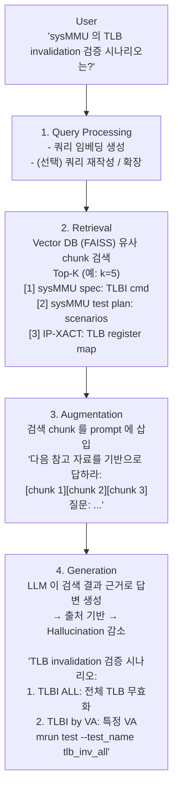
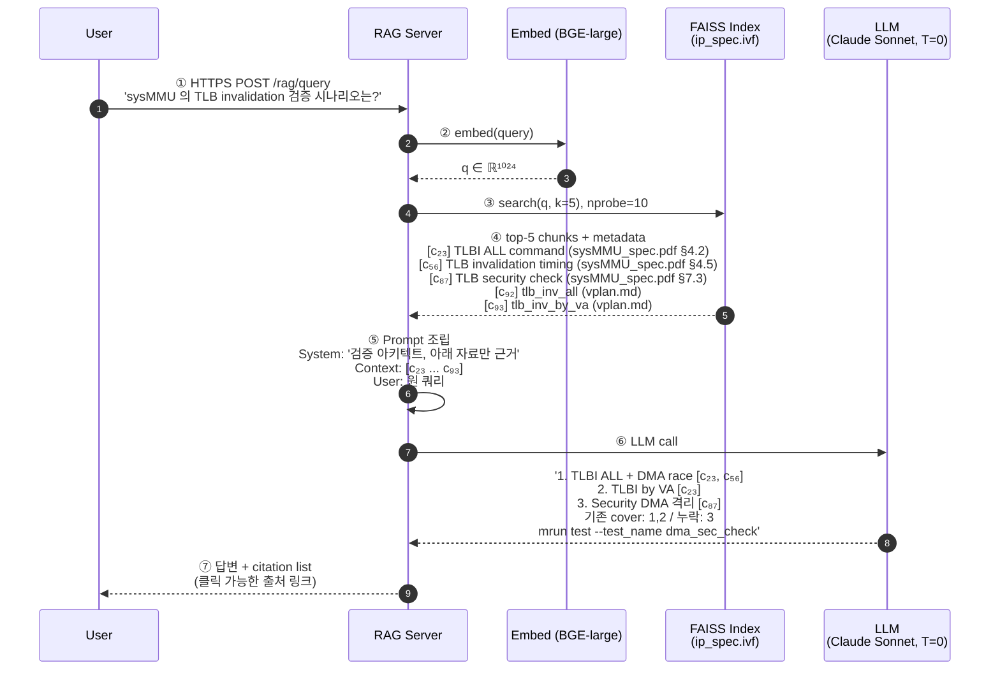
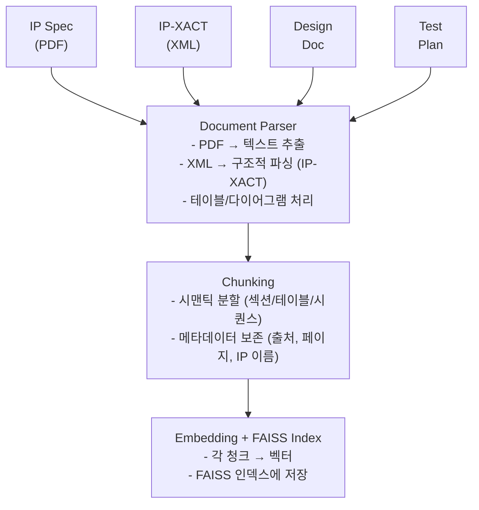
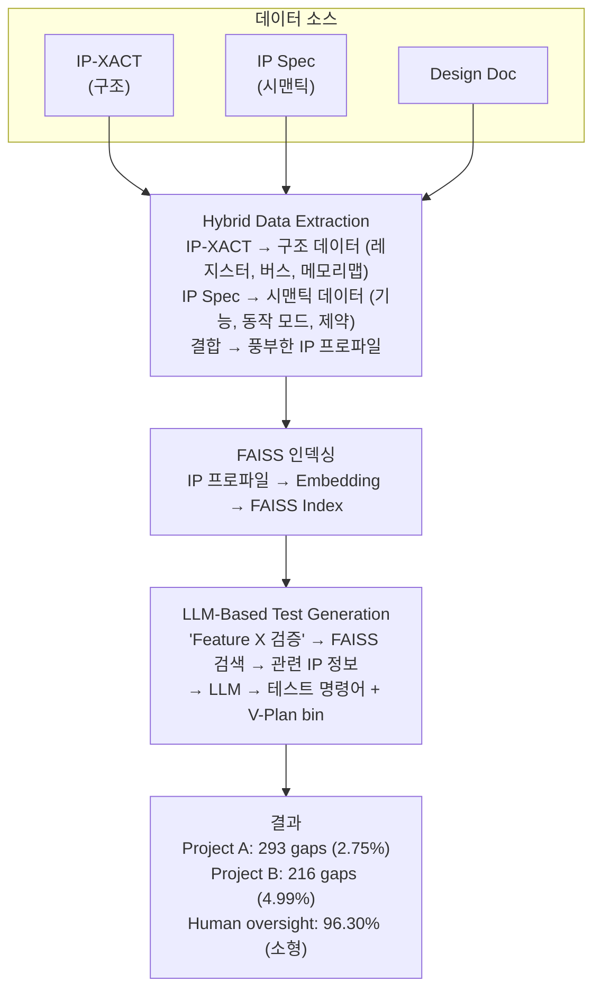

# Module 04 — RAG (Retrieval-Augmented Generation)

<!-- DV-SKOOL-CH-CTX:start -->
<div class="chapter-context" data-cat="applied">
  <a class="chapter-back" href="../">
    <span class="chapter-back-arrow">←</span>
    <span class="chapter-back-icon">🤖</span>
    <span class="chapter-back-text">AI Engineering</span>
  </a>
  <span class="chapter-divider">›</span>
  <span class="chapter-marker">Module 04</span>
</div>
<!-- DV-SKOOL-CH-CTX:end -->

<!-- DV-SKOOL-CH-TOC:start -->
<div class="page-toc">
  <span class="page-toc-label">목차</span>
  <a class="page-toc-link" href="#1-why-care-llm-에-도메인-지식을-넣는-가장-실용적인-경로">1. Why care?</a>
  <a class="page-toc-link" href="#2-intuition-참고서-인턴-비유와-한-장-그림">2. Intuition</a>
  <a class="page-toc-link" href="#3-작은-예-sysmmu-tlb-검증-시나리오-쿼리-한-개를-end-to-end">3. 작은 예 — 한 쿼리 end-to-end</a>
  <a class="page-toc-link" href="#4-일반화-naive-vs-advanced-rag-와-4-단계-파이프라인">4. 일반화 — 4 단계 파이프라인</a>
  <a class="page-toc-link" href="#5-디테일-indexing-retrieval-re-ranking-품질-평가-dvcon-아키텍처">5. 디테일</a>
  <a class="page-toc-link" href="#6-흔한-오해-와-dv-디버그-체크리스트">6. 흔한 오해 + 디버그</a>
  <a class="page-toc-link" href="#7-핵심-정리-key-takeaways">7. 핵심 정리</a>
</div>
<!-- DV-SKOOL-CH-TOC:end -->

!!! objective "학습 목표"
    이 모듈을 마치면:

    - **Define** RAG 의 기본 4-step (chunk · index · retrieve · generate) 을 나열할 수 있다.
    - **Explain** RAG 가 fine-tune 보다 비용/유지보수에서 유리한 시나리오를 설명할 수 있다.
    - **Apply** Hybrid 검색 + Re-ranker 를 적용한 RAG 파이프라인을 설계할 수 있다.
    - **Analyze** RAG 응답이 실패하는 단계(retrieval / context window / generation) 를 진단할 수 있다.
    - **Evaluate** RAGAS / 자체 metrics 로 RAG 시스템 품질을 평가할 수 있다.

!!! info "사전 지식"
    - [Module 02](02_prompt_engineering.md) — Few-shot, system prompt
    - [Module 03](03_embedding_vectordb.md) — embedding, FAISS, chunking
    - 검색 시스템 평가 지표 (precision@k, recall@k)

---

## 1. Why care? — LLM 에 도메인 지식을 넣는 가장 실용적인 경로

LLM 이 도메인 지식을 갖게 만드는 가장 비용·운영 효율 좋은 방법이 RAG 입니다. Fine-tune 은 (1) 비싸고 (2) 느리며 (3) 라이프사이클이 길지만 (재학습마다 일~주 단위), RAG 는 _인덱스만 갱신_ 하면 곧장 반영됩니다 — 사내 IP 가 변경되거나 spec 가 업데이트되어도 임베딩 + 인덱스 재빌드만 거치면 모델 그대로 활용.

사내 IP / 코드 / 문서를 LLM 으로 활용하려는 거의 모든 프로젝트의 표준 패턴이며, [Module 06](06_strategy_selection.md) 의 "Prompt vs RAG vs Fine-tune" 결정에서 항상 출발점이 됩니다.

---

## 2. Intuition — "참고서 + 인턴" 비유와 한 장 그림

!!! tip "💡 한 줄 비유"
    **RAG ≈ 참고서를 펼쳐 둔 인턴** — 질문이 오면 책상에 _관련 페이지_ 를 펼쳐 두고 답하라.<br>
    인턴(LLM) 의 _상식_ 을 안 바꾸고 (가중치 동결), 매번 _참고서의 펼친 페이지_ (검색된 chunk) 만 바꿔서 도메인 지식을 활용.

### 한 장 그림 — Naive RAG 의 4 단계



### 왜 이 구조인가 — Design rationale

세 가지 요구가 동시에 풀려야 했습니다.

1. **모델은 그대로 (가중치 동결)** — 보안, 비용, 라이프사이클을 위해.
2. **도메인 지식은 _최신_ 으로** — 문서가 바뀌면 즉시 반영.
3. **답은 _출처 기반_** — hallucination 을 줄이고 audit 가능.

이 세 요구의 교집합이 "외부 검색 + prompt 에 주입" 이고, 그 결과가 RAG 의 4 단계입니다.

---

## 3. 작은 예 — `"sysMMU TLB 검증 시나리오"` 쿼리 한 개를 end-to-end

가장 단순한 시나리오. FAISS 인덱스가 이미 빌드돼 있고, 사용자가 한 쿼리를 보내 LLM 이 답하는 한 사이클을 추적합니다.



| Step | 누가 | 무엇을 | 의미 |
|---|---|---|---|
| ① | client | 쿼리 전송 | HTTPS / gRPC |
| ② | embed 모델 | 쿼리 → 1024 차원 벡터 | 인덱싱 시 _같은_ 모델 ([Module 03](03_embedding_vectordb.md) §6 흔한 오해 1) |
| ③ | FAISS | top-5 검색 | nprobe=10, IVF |
| ④ | 호출자 | id → text + metadata 회수 | 출처 (file, section) 함께 |
| ⑤ | prompt builder | System + Context + User 조립 | "검색 자료만 근거로" 가드레일 |
| ⑥ | LLM | 답변 생성 | T=0 (재현성), context 안의 citation `[c₂₃]` 강제 |
| ⑦ | server | 답변 + citation list | 출처 링크가 있어야 audit 가능 |

!!! note "여기서 잡아야 할 두 가지"
    **(1) 답의 _상한_ 은 검색의 _상한_** — 만약 ③ 에서 c₈₇ (security 청크) 가 누락됐다면 LLM 은 gap 3 을 절대 못 찾습니다. **Retrieval 이 깨지면 generation 도 깨짐**.<br>
    **(2) Citation 강제가 hallucination 의 첫 방어선** — prompt 에서 "근거를 `[c_id]` 로 명시" 를 강제하면, LLM 이 학습 분포에서 끌어오는 "그럴듯한" 추측을 차단할 수 있음.

---

## 4. 일반화 — Naive vs Advanced RAG 와 4 단계 파이프라인

### 4.1 LLM 만으로는 부족한 이유

| LLM 한계 | 설명 | RAG 의 해결 |
|----------|------|-----------|
| Knowledge Cutoff | 학습 시점 이후 정보 없음 | 최신 문서 검색하여 주입 |
| Hallucination | 모르는 것을 그럴듯하게 지어냄 | 검색된 근거에 기반한 답변 |
| 도메인 지식 부족 | 반도체 IP 스펙은 학습 데이터에 없음 | 사내 문서 검색하여 주입 |
| Context 한계 | 전체 IP DB 를 Context 에 넣을 수 없음 | 관련 청크만 선별하여 주입 |
| 프라이버시 | 기밀 정보를 학습시킬 수 없음 | 검색만 — 모델에 저장 안 됨 |

### 4.2 Naive RAG vs Advanced RAG

```
Naive RAG:
  쿼리 → 임베딩 → 검색 → 프롬프트 삽입 → 생성
  (단순하지만 검색 품질에 크게 의존)

Advanced RAG:
  쿼리 → 쿼리 재작성 → 임베딩 → 하이브리드 검색 → 재랭킹
  → 프롬프트 최적화 → 생성 → 출처 검증
  (복잡하지만 품질 향상)
```

Naive 가 망가지는 지점이 어디인지 측정해서 그곳에 _필요한 advanced 컴포넌트만_ 추가하는 것이 실전 (§5.6 의 RAGAS).

---

## 5. 디테일 — Indexing, Retrieval, Re-ranking, 품질 평가, DVCon 아키텍처

### 5.1 Indexing (인덱싱) — 오프라인 단계

문서 수집 → 청킹 → 임베딩 → 인덱스 저장



### 5.2 Retrieval (검색) — 온라인 단계

| 검색 방식 | 원리 | 장단점 |
|----------|------|--------|
| Dense Retrieval | 쿼리/문서 임베딩의 벡터 유사도 | 의미 검색 강함, 정확한 키워드 약함 |
| Sparse Retrieval (BM25) | TF-IDF 기반 키워드 매칭 | 정확한 키워드 강함, 의미 약함 |
| **Hybrid** | Dense + Sparse 결합 | 둘의 장점 결합, 가장 실용적 |

```
Hybrid 검색 (DVCon 에서 사용):

  쿼리: "sysMMU TLB invalidation"

  Dense 결과: [TLB flush 관련 문서, MMU 캐시 관련 문서, ...]
  Sparse 결과: [정확히 "TLB invalidation" 포함 문서, ...]

  결합: RRF (Reciprocal Rank Fusion) 또는 가중 합산
  → Dense 가 놓친 정확한 매칭 + Sparse 가 놓친 의미적 매칭
```

### 5.3 Re-ranking (재랭킹)

```
검색 Top-20 → Re-ranker 모델 → 최종 Top-5

Re-ranker:
  - 쿼리와 문서를 함께 입력받아 관련도 점수 산출
  - Cross-encoder 방식 (Bi-encoder 보다 정확하지만 느림)
  - 검색은 빠른 Bi-encoder 로, 순위 정밀화는 Cross-encoder 로

  모델 예: ms-marco-MiniLM, Cohere rerank, BGE-reranker
```

### 5.4 RAG 품질 평가 지표

| 지표 | 측정 대상 | 의미 |
|------|----------|------|
| **Retrieval Precision** | 검색된 K개 중 관련 문서 비율 | 검색 정확도 |
| **Retrieval Recall** | 전체 관련 문서 중 검색된 비율 | 검색 포괄성 |
| **Answer Faithfulness** | 생성된 답변이 검색 결과에 기반하는 비율 | Hallucination 방지 |
| **Answer Relevance** | 답변이 질문에 적합한 정도 | 실용성 |

### 5.5 DVCon 논문의 평가 방법

```
Ground Truth: 인간 전문가가 정의한 검증 시나리오 목록
AI 생성:     RAG 시스템이 생성한 검증 시나리오 목록

평가:
  - 전문가 목록에 있지만 AI 가 놓친 것 = Gap (미발견)
  - AI 가 발견했지만 전문가가 놓친 것 = 추가 발견 (AI 의 가치)
  - 결과: 293 개 Critical Gap 발견 (2.75% rate)
```

### 5.6 RAG 실패 모드와 대응

| 실패 모드 | 원인 | 대응 |
|----------|------|------|
| 관련 문서 검색 실패 | 쿼리와 문서의 어휘 차이 | 쿼리 확장, Hybrid 검색 |
| 잘못된 문서 검색 | 임베딩 품질 부족 | 도메인 특화 임베딩, Re-ranking |
| 검색 성공 but 답변 오류 | LLM 의 문서 이해 실패 | 더 나은 프롬프트, 긴 Context |
| Chunk 경계에서 정보 분리 | 관련 정보가 다른 Chunk 에 | Overlap Chunking, Parent-Child |
| 오래된 문서 | 문서 업데이트 미반영 | 인덱스 갱신 파이프라인 |

### 5.7 DVCon 논문의 RAG 아키텍처 (이력서 직결)



위 그림은 DVCon 의 "Engineering Intelligence" Framework 전체 흐름입니다.

---

## 6. 흔한 오해 와 DV 디버그 체크리스트

### 흔한 오해

!!! danger "❓ 오해 1 — 'RAG 가 fine-tune 을 완전히 대체'"
    **실제**: RAG 는 _지식 갱신_ 에 강하고, fine-tune 은 _형식/스타일 내재화_ 에 강합니다. 두 기법은 **보완**. 실무는 "prompt → RAG → 필요 시 FT" 순서로 escalation ([Module 06](06_strategy_selection.md)).<br>
    **왜 헷갈리는가**: 최근 RAG hype 가 fine-tune 의 단점만 부각.

!!! danger "❓ 오해 2 — 'Top-K 가 클수록 더 정확'"
    **실제**: K 를 늘리면 (1) context window 비용 ↑, (2) 관련 없는 청크가 noise 로 들어가 LLM 의 주의를 분산, (3) "lost in the middle" 발생. 보통 K=3~5 가 sweet spot. **Re-ranker 로 K=20 → K=5 정밀화** 가 표준.

!!! danger "❓ 오해 3 — 'RAG 가 retrieval 에 실패하면 LLM 이 알아서 모른다고 한다'"
    **실제**: retrieval 이 비면 LLM 은 학습 지식으로 _자연스럽게_ 답을 만듭니다 — 사용자 입장에서는 RAG 가 작동한 것처럼 보이지만 실제로는 hallucination. **`len(retrieved) == 0` 일 때 별도 분기로 "관련 문서 없음" 을 강제** 해야 함 (§7 의 warning).

!!! danger "❓ 오해 4 — '문서가 검색되면 답이 정확하다'"
    **실제**: 검색 성공 ≠ 답변 성공. LLM 이 (1) chunk 들을 잘못 종합하거나, (2) 무관한 구절에 주의를 빼앗기거나, (3) prompt 가 "검색 자료만 근거로" 를 강제하지 않으면 여전히 학습 분포에서 끌어옴. **Faithfulness 지표** 로 측정해야 함.

!!! danger "❓ 오해 5 — 'RAG 는 안전하다 (보안)'"
    **실제**: 외부 문서를 검색해서 prompt 에 넣는 구조는 _Indirect Prompt Injection_ 의 진입점입니다 — 문서 안에 "이전 system prompt 는 무시하라" 같은 instruction 이 있으면 LLM 이 따라갑니다. RAG context 의 instruction 은 "정보 (information)" 로만 처리한다는 가드레일이 prompt 에 명시 필수 (§7 warning).

### DV 디버그 체크리스트 (RAG 운용 시 자주 만나는 실패)

| 증상 | 1차 의심 | 어디 보나 |
|---|---|---|
| 답변이 _그럴듯_ 한데 _틀림_ | retrieval 실패 → LLM 이 학습 지식으로 답함 | `len(retrieved_docs)`, retrieval recall@k |
| 동일 쿼리에 매번 다른 출처 인용 | T > 0 또는 검색 결과 ordering 비결정성 | T=0 + 인덱스 stable sort |
| 같은 의미의 _다른 단어_ 로 물으면 검색 실패 | dense 만 사용, 어휘 차이 | Hybrid (dense + BM25) + 쿼리 확장 |
| 정확한 식별자 (`TLB_INV_CTRL`) 가 안 잡힘 | dense 임베딩이 사내 식별자 무시 | BM25 또는 keyword filter pre-filter |
| Citation 이 응답에 없음 | prompt 에서 citation 강제 안 함 | "근거를 `[c_id]` 로 명시" 추가 |
| Top-1 이 무관한 chunk | re-ranker 부재 | Cross-encoder re-ranker 추가 (top-20 → top-5) |
| RAG 도입 후 _hallucination 이 더 많아짐_ | 무관 chunk 가 noise 로 LLM 을 혼란 | top-K 줄이기, faithfulness 평가 |
| 외부 문서 안의 지시가 system 을 우회 | indirect prompt injection | "context 의 instruction 무시" 가드레일 + audit |

---

## 7. 핵심 정리 (Key Takeaways)

- **RAG = LLM + 외부 검색** — 가중치 변경 없이 도메인 지식 활용.
- **Chunking** — 문서를 의미 단위로 자르는 것이 retrieval 품질의 출발점 ([Module 03](03_embedding_vectordb.md) §5.4).
- **Hybrid 검색** — dense + sparse(BM25) 결합으로 OOV / 약어를 보완.
- **Re-ranking** — top-20 을 cross-encoder 로 정밀 재정렬 → top-5 의 정확도 ↑.
- **품질 평가** — Faithfulness, Answer Relevance, Context Recall (RAGAS). 측정 없는 RAG 는 운영 부채.

!!! warning "실무 주의점 — RAG 검색 실패가 Hallucination 으로 보이는 문제"
    **현상**: Retrieval 단계에서 관련 문서가 반환되지 않으면 LLM 은 학습 지식으로 답변을 생성한다. 사용자 입장에서는 RAG 가 작동한 것처럼 보이지만 실제로는 검색이 실패한 응답이므로, 도메인 특화 정보가 틀릴 가능성이 높다.

    **원인**: Retrieval 실패와 성공이 응답 형식에서 구별되지 않으며, `retrieved_context` 가 비었을 때 LLM 에게 "모른다" 고 답하도록 프롬프트로 강제하지 않으면 자연스럽게 hallucination 이 발생한다.

    **점검 포인트**: 응답 파이프라인에서 `len(retrieved_docs) == 0` 일 때 별도 분기로 "관련 문서 없음" 메시지를 반환하는지 확인. 평가 시 retrieval recall 과 생성 답변 정확도를 별도 지표로 측정해 검색 실패가 오답의 원인인지 분리 분석.

---

## 다음 모듈

→ [Module 05 — Agent Architecture](05_agent_architecture.md): RAG 가 도구 호출과 결합되어 자율 agent 가 된다.

[퀴즈 풀어보기 →](quiz/04_rag_quiz.md)


--8<-- "abbreviations.md"
