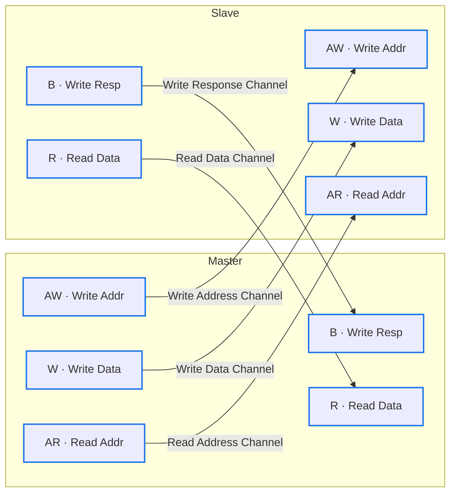
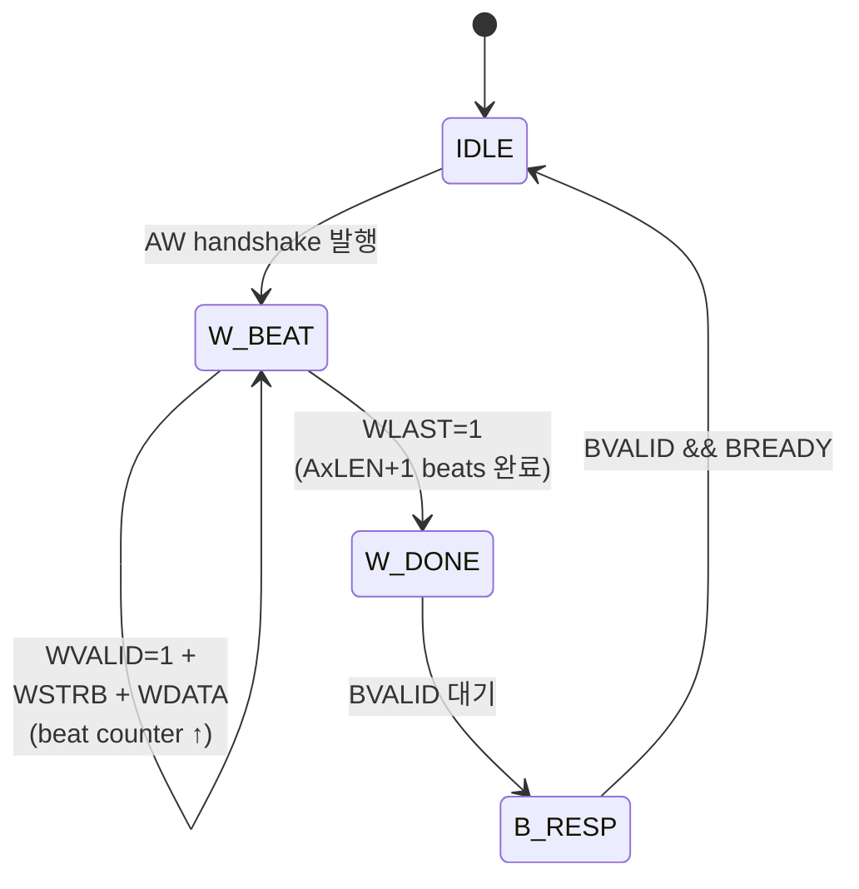

# Module 02 — AXI (Advanced eXtensible Interface)

<!-- DV-SKOOL-CH-CTX:start -->
<div class="chapter-context" data-cat="core">
  <a class="chapter-back" href="../">
    <span class="chapter-back-arrow">←</span>
    <span class="chapter-back-icon">🔄</span>
    <span class="chapter-back-text">AMBA Protocols</span>
  </a>
  <span class="chapter-divider">›</span>
  <span class="chapter-marker">Module 02</span>
</div>
<!-- DV-SKOOL-CH-CTX:end -->

<!-- DV-SKOOL-CH-TOC:start -->
<div class="page-toc">
  <span class="page-toc-label">목차</span>
  <a class="page-toc-link" href="#1-why-care-이-모듈이-왜-필요한가">1. Why care?</a>
  <a class="page-toc-link" href="#2-intuition-비유와-한-장-그림">2. Intuition</a>
  <a class="page-toc-link" href="#3-작은-예-axi-read-한-번을-cycle-단위로-따라가기">3. 작은 예 — AXI Read 추적</a>
  <a class="page-toc-link" href="#4-일반화-5채널-handshake-burst-id-ordering">4. 일반화 — 5채널 + Ordering</a>
  <a class="page-toc-link" href="#5-디테일-신호-burst-wstrb-exclusive-cache-prot-qos">5. 디테일</a>
  <a class="page-toc-link" href="#6-흔한-오해-와-dv-디버그-체크리스트">6. 흔한 오해 + 디버그 체크리스트</a>
  <a class="page-toc-link" href="#7-핵심-정리-key-takeaways">7. 핵심 정리</a>
</div>
<!-- DV-SKOOL-CH-TOC:end -->

!!! objective "학습 목표"
    이 모듈을 마치면:

    - **Diagram** AXI 의 5채널 구조 (AW/W/B/AR/R) 와 각 채널의 독립성을 화이트보드로 그릴 수 있다.
    - **Implement** VALID/READY 핸드셰이크의 3가지 패턴 (VALID-first, READY-first, 동시) 과 데드락 방지 규칙을 코드로 구현할 수 있다.
    - **Trace** AR → R 채널의 read transaction 1 회를 ARVALID/ARREADY/ARADDR / RVALID/RREADY/RDATA timeline 으로 cycle 단위 추적할 수 있다.
    - **Apply** Burst (FIXED/INCR/WRAP), Outstanding, ID 기반 Out-of-Order 트래픽 시나리오를 검증 시퀀스로 작성할 수 있다.
    - **Analyze** WSTRB / AxCACHE / AxPROT / AxQOS / Exclusive Access 의 의미와 검증 영향을 분석할 수 있다.
    - **Distinguish** AXI3 와 AXI4 의 핵심 차이 (WID 제거, AxLEN 확장, QoS/REGION) 를 식별할 수 있다.

!!! info "사전 지식"
    - [Module 01 — APB & AHB](01_apb_ahb.md) (handshake / wait state / pipeline 개념)
    - SystemVerilog interface, modport 기본
    - FIFO 와 outstanding transaction 개념

---

## 1. Why care? — 이 모듈이 왜 필요한가

**AXI 는 현대 SoC 의 사실상 표준** 입니다. NoC 기반 인터커넥트, 메모리 컨트롤러, GPU/CPU 트랜잭션, 가속기 IP 연결 — 모두 AXI 로 흐릅니다. 검증에서 AXI 를 깊이 이해하지 못하면 timing, throughput, OoO 시나리오에서 silent bug 를 놓치기 쉽습니다.

특히 두 가지가 AXI 검증의 중심 위험 영역입니다 — **VALID/READY 데드락** 과 **outstanding 응답 매칭**. 또한 Module 01 에서 AHB 가 풀지 못한 두 한계 (1) read/write 동시 진행 불가, (2) 응답 대기로 인한 throughput 저하 — 가 AXI 의 5채널 분리 + Outstanding/OoO 로 해결되는 과정을 추적하면, 이후 AXI-Stream / CHI / ACE 의 진화 방향이 자연스럽게 보입니다.

---

## 2. Intuition — 비유와 한 장 그림

!!! tip "💡 한 줄 비유 — AXI 5-Channel ≈ 5개 독립 차선 고속도로"
    **AR / R / AW / W / B** 가 각각 _독립된 차선_. Read 와 Write 가 따로, 그리고 각각 address/data/response 가 따로 흐른다. 차선이 막혀도 다른 차선이 영향받지 않아 throughput 이 극대화. AHB 가 1 차선 양방향 도로였다면, AXI 는 5 차선의 분리된 고속도로.

### 한 장 그림 — AXI 5채널 구조



각 채널이 독립 → Read와 Write 동시 가능 = Full-Duplex. 한 채널의 stall (`xVALID && !xREADY`) 이 다른 채널을 막지 않음.

### 왜 이렇게 설계됐는가 — Design rationale

AHB 가 가졌던 세 가지 throughput 병목을 한 번에 풀어야 했습니다.

1. **Read/Write 가 같은 버스를 공유** → AXI: AR/R 과 AW/W/B 채널 분리 = full-duplex.
2. **응답을 기다려야 다음 요청** → AXI: Outstanding (응답 전에 다음 요청 발행 가능).
3. **느린 slave 하나가 전체 큐를 막음** → AXI: ID 기반 OoO (다른 ID 는 순서 무관).

여기에 한 가지 핵심 원칙 — **모든 채널이 동일한 VALID/READY 핸드셰이크를 사용** — 이 추가됩니다. 이로써 channel 마다 다른 프로토콜을 외울 필요가 없고, scoreboard / monitor 코드가 채널별로 _같은 패턴_ 으로 작성됩니다. 이 "한 핸드셰이크로 통일" 이 AXI 의 또 다른 발명입니다.

---

## 3. 작은 예 — AXI Read 한 번을 cycle 단위로 따라가기

가장 단순한 시나리오. Master 가 AXI4 single-beat Read 를 발행 — **`ARID=3, ARADDR=0x40, ARLEN=0 (1 beat), ARSIZE=2 (4-byte)`**. Slave 는 1 cycle delay 후 응답.

### Cycle-by-cycle timeline (AR + R 채널)

```
   cycle :        T1     T2     T3     T4     T5     T6     T7
   ACLK    : ─┐ ┌──┐  ┌──┐  ┌──┐  ┌──┐  ┌──┐  ┌──┐  ┌──
                └─┘   └─┘   └─┘   └─┘   └─┘   └─┘   └─┘
   ─── AR channel (Master → Slave) ────────────────────────
   ARVALID :          ┌─────────────┐
                      └ T2 부터 1, T3 끝에서 deassert
   ARREADY :  ────────────────┐     ────────  (T3 에서 1)
                              └─────┘
                                    ▲
                          T3 rising edge: ARVALID && ARREADY → AR transfer 완료
   ARID    :          ┤     0x3      ├
   ARADDR  :          ┤    0x40      ├
   ARLEN   :          ┤    0x00      ├
   ARSIZE  :          ┤    0x2       ├
   ARBURST :          ┤   INCR       ├

   ─── R channel (Slave → Master) ─────────────────────────
   RVALID  :  ───────────────────────┐         ┌──────  (T5 에서 1)
                                     └─────────┘
   RREADY  :  ──────────────────────────┐    ┌────  (T5 부터 1, master 가 미리)
                                          └────┘
                                          ▲
                          T5 rising edge: RVALID && RREADY → R transfer 완료
   RID     :                          ┤   0x3   ├
   RDATA   :                          ┤0xCAFEBABE├
   RRESP   :                          ┤  OKAY   ├
   RLAST   :                          ┤    1    ├   (single-beat 이므로 즉시 LAST)
```

### 단계별 의미

| Step | Cycle | 채널 | 누가 | 무엇을 | 왜 |
|---|---|---|---|---|---|
| ① | T1 | — | bus | ARVALID=0, RVALID=0 (idle) | 직전 transaction 종료 |
| ② | T2 | AR | master | ARVALID=1, ARID/ARADDR/ARLEN/ARSIZE/ARBURST 동시 발행 | "이 read 를 처리해 다오" |
| ③ | T2 | AR | slave | ARREADY=0 (1 cycle 지연) | slave 가 backlog 처리 중 |
| ④ | T3 | AR | slave | ARREADY=1 발행 | "주소 받았다" |
| ⑤ | T3 (rising) | AR | bus | ARVALID && ARREADY → AR transfer **완료** | master 가 ARVALID 내릴 수 있음 |
| ⑥ | T3~T4 | — | slave | 내부에서 read data fetch | memory access latency |
| ⑦ | T4 | R | master | RREADY=1 미리 올림 (READY-first) | "데이터 오면 즉시 받겠다" |
| ⑧ | T5 | R | slave | RVALID=1, RID=0x3, RDATA=0xCAFEBABE, RRESP=OKAY, RLAST=1 발행 | response data 준비됨 |
| ⑨ | T5 (rising) | R | bus | RVALID && RREADY → R transfer **완료** | RID 가 ARID 와 매칭됨을 확인 |
| ⑩ | T6 | — | bus | 모두 deassert, idle | 다음 transaction 대기 |

### 코드로 보면

```systemverilog
// AXI master 의 read sequence (의사코드)
task automatic axi_read(input [31:0] addr, input [3:0] id);
  // AR phase
  @(posedge ACLK);
  ARVALID <= 1'b1;
  ARID    <= id;
  ARADDR  <= addr;
  ARLEN   <= 8'h00;     // 1-beat
  ARSIZE  <= 3'b010;    // 4-byte
  ARBURST <= 2'b01;     // INCR
  do @(posedge ACLK); while (!ARREADY);
  ARVALID <= 1'b0;      // ARVALID && ARREADY 본 cycle 다음 deassert

  // R phase — RREADY 는 항상 1 로 두는 단순한 master
  RREADY  <= 1'b1;
  do @(posedge ACLK); while (!(RVALID && (RID==id) && RLAST));
  $info("read data = %h, resp = %s", RDATA, RRESP);
endtask
```

!!! note "여기서 잡아야 할 두 가지"
    **(1) AR 과 R 은 _독립 채널_ 이라 서로 다른 cycle 에 핸드셰이크가 일어난다.** AR 이 T3 에 완료되어도 R 은 T5 까지 안 올 수 있고, 그 사이 master 는 다른 transaction 의 AR 을 발행해도 됩니다 (Outstanding). 이게 AHB 와의 본질적 차이.<br>
    **(2) RID 가 ARID 와 같아야 같은 transaction 의 응답** — multiple outstanding 일 때 master 는 RID 로 어느 transaction 의 응답인지 식별합니다. 같은 ID 는 in-order, 다른 ID 는 OoO 가능.

---

## 4. 일반화 — 5채널 + Handshake + Burst + ID Ordering

### 4.1 VALID/READY 핸드셰이크 — 모든 채널 공통 규칙

```
전송이 발생하는 조건: VALID && READY 동시에 HIGH인 클럭 엣지

Case 1: VALID first
  VALID ──────┐           ┌──
              └───────────┘
  READY ─────────────┐    ┌──
                     └────┘
                     ↑ 전송 발생

Case 2: READY first
  VALID ─────────┐        ┌──
                 └────────┘
  READY ──────┐            ┌──
              └────────────┘
              ↑ 전송 발생 (VALID 올라올 때)

Case 3: 동시
  VALID ──────┐       ┌──
              └───────┘
  READY ──────┐       ┌──
              └───────┘
              ↑ 전송 발생

핵심 규칙:
  1. VALID를 올린 후에는 READY가 올 때까지 내리면 안 됨
  2. READY는 자유롭게 올리고 내릴 수 있음
  3. VALID을 올리기 전에 READY를 기다리면 안 됨 (데드락 방지)
     → Source는 READY와 무관하게 VALID을 assert해야 함
```

### 4.2 데드락 방지 규칙

```
절대 금지:
  Master: "READY가 올 때까지 VALID 안 올리겠다"
  Slave:  "VALID가 올 때까지 READY 안 올리겠다"
  → 양쪽 다 대기 → 데드락!

AXI 규칙:
  Source(VALID 주인)는 Destination(READY 주인)을 기다리지 않고
  데이터가 준비되면 VALID을 올려야 한다.

  Destination은 VALID을 기다려도 되고, 미리 READY를 올려도 된다.
```

### 4.3 ID 기반 Ordering 의 일반 모델

```
   같은 ID  : in-order   (예: ID=0 의 응답은 발행 순서대로)
   다른 ID  : OoO 허용   (예: ID=1 의 응답이 ID=0 보다 먼저 와도 무방)

   AR(ID=0, A=0x100) → AR(ID=1, A=0x200) → AR(ID=0, A=0x300)
                                         ▼
   가능한 R 순서:
     R(ID=1, ...) → R(ID=0, A=0x100) → R(ID=0, A=0x300)   ← ID=1 먼저
     R(ID=0, A=0x100) → R(ID=1, ...) → R(ID=0, A=0x300)
     R(ID=0, A=0x100) → R(ID=0, A=0x300) → R(ID=1, ...)   ← ID=1 마지막

   불가능:
     R(ID=0, A=0x300) 가 R(ID=0, A=0x100) 보다 먼저 ← 같은 ID in-order 위반
```

### 4.4 Burst FSM — 1개 transaction 안에서 multiple beat



---

## 5. 디테일 — 신호, Burst, WSTRB, Exclusive, Cache/Prot/QoS

### 5.1 5채널 핵심 신호

| 채널 | 핵심 신호 | 역할 |
|------|----------|------|
| **AW** | AWADDR, AWLEN, AWSIZE, AWBURST, AWID, AWVALID/AWREADY | Write 주소+제어 |
| **W** | WDATA, WSTRB, WLAST, WVALID/WREADY | Write 데이터 |
| **B** | BRESP, BID, BVALID/BREADY | Write 응답 |
| **AR** | ARADDR, ARLEN, ARSIZE, ARBURST, ARID, ARVALID/ARREADY | Read 주소+제어 |
| **R** | RDATA, RRESP, RLAST, RID, RVALID/RREADY | Read 데이터+응답 |

### 5.2 Burst 전송 — 파라미터와 타입

| 신호 | 의미 |
|------|------|
| AxLEN[7:0] | Burst 길이 = AxLEN + 1 (1~256 beats) |
| AxSIZE[2:0] | Beat 크기: 2^AxSIZE bytes (1/2/4/8/16/32/64/128 bytes) |
| AxBURST[1:0] | Burst 타입: FIXED/INCR/WRAP |

```
FIXED (2'b00):
  모든 beat가 같은 주소 → FIFO 접근에 사용
  A, A, A, A

INCR (2'b01):
  주소가 beat마다 증가 → 가장 일반적
  A, A+4, A+8, A+12  (32-bit 기준)

WRAP (2'b10):
  주소가 증가하다가 경계에서 랩 → 캐시 라인 로드에 사용
  예: 주소 0x0C, 4-beat WRAP → 0x0C, 0x00, 0x04, 0x08
  (0x10 경계에서 랩)
```

### 5.3 Outstanding & Out-of-Order

```
AHB: 요청1 → 응답1 → 요청2 → 응답2 (순차, 대기)
AXI: 요청1 → 요청2 → 요청3 → 응답1 → 응답2 → 응답3 (파이프라인)

  AR → AR → AR → ...
              R ← R ← R ← ...

  응답을 기다리지 않고 다음 요청 발행 → 대역폭 극대화
  Outstanding 깊이: 동시에 발행 가능한 미완료 트랜잭션 수
```

```
ID 기반 순서 관리:

  ID=0: 요청 A → 요청 B → 응답 A → 응답 B (같은 ID는 순서 보장)
  ID=1: 요청 C → 응답 C (ID=1은 독립)

  다른 ID 간: 순서 보장 없음 (Out-of-Order 허용)
  같은 ID 간: 순서 보장

  → Slave가 빠른 응답부터 반환 → 느린 Slave가 전체를 블로킹하지 않음
```

### 5.4 WSTRB (Write Strobe) — 바이트 단위 쓰기 제어

```
WSTRB[N-1:0]에서 N = (데이터 버스 폭 / 8)

예: 32-bit 데이터 버스 → WSTRB[3:0]
    64-bit 데이터 버스 → WSTRB[7:0]
    128-bit 데이터 버스 → WSTRB[15:0]

각 WSTRB 비트가 1이면 해당 바이트 레인이 유효 (Slave가 저장해야 함)
각 WSTRB 비트가 0이면 해당 바이트는 무시

32-bit 버스 예시:
  WDATA = 0xAABBCCDD

  WSTRB = 4'b1111 → [AA][BB][CC][DD] 모두 쓰기 (Word Write)
  WSTRB = 4'b0011 → [--][--][CC][DD] 하위 2바이트만 (Half-word Write)
  WSTRB = 4'b0001 → [--][--][--][DD] 최하위 바이트만 (Byte Write)
  WSTRB = 4'b1100 → [AA][BB][--][--] 상위 2바이트만
  WSTRB = 4'b0100 → [--][BB][--][--] Byte 2만 (비정렬 접근)

  바이트 레인 매핑:
  WSTRB[0] → WDATA[7:0]   (Byte 0, 주소 offset +0)
  WSTRB[1] → WDATA[15:8]  (Byte 1, 주소 offset +1)
  WSTRB[2] → WDATA[23:16] (Byte 2, 주소 offset +2)
  WSTRB[3] → WDATA[31:24] (Byte 3, 주소 offset +3)
```

> **DV 포인트**: WSTRB=0 인 바이트 위치의 메모리 값이 변경되지 않는지 반드시 검증. 가장 흔한 버그: WSTRB 무시하고 전체 word 를 덮어쓰는 Slave.

### 5.5 Exclusive Access (AxLOCK + EXOKAY)

멀티 프로세서 시스템에서 atomic Read-Modify-Write 를 구현하는 메커니즘.

```
사용 시나리오: 뮤텍스, 세마포어, atomic counter 등

동작 플로우:
  1. Master A: Exclusive Read  (ARLOCK=1, ARADDR=0x100) → 데이터 읽기 + 모니터 등록
  2. Master A: Exclusive Write (AWLOCK=1, AWADDR=0x100, WDATA=new_value)
  3. Slave 응답:
     - BRESP=EXOKAY (2'b01): 성공 — 아무도 이 주소를 건드리지 않았음 → 쓰기 완료
     - BRESP=OKAY   (2'b00): 실패 — 다른 Master가 중간에 이 주소에 Write → 쓰기 무시

Exclusive Monitor:
  ┌─────────────────────────────────────────────┐
  │ Interconnect / Slave 내부에 Exclusive Monitor │
  │                                               │
  │ Exclusive Read 시:                            │
  │   Monitor에 {Master ID, Address} 등록         │
  │                                               │
  │ Exclusive Write 시:                           │
  │   Monitor에 해당 {ID, Addr} 있으면 → EXOKAY  │
  │   없거나 다른 Master가 Write했으면 → OKAY     │
  │                                               │
  │ 어떤 Master든 해당 주소에 Write하면:          │
  │   Monitor에서 해당 주소 항목 제거             │
  └─────────────────────────────────────────────┘

AXI3: AxLOCK[1:0] = 2'b01 (Exclusive), 2'b10 (Locked — 버스 독점, 비권장)
AXI4: AxLOCK[0]   = 1'b1  (Exclusive만, Locked 제거)
```

> **면접 포인트**: "Exclusive Access 와 Locked Access 의 차이?"
> → Locked 는 버스 전체를 독점하여 다른 Master 차단 (성능 저하). Exclusive 는 Monitor 기반으로 버스를 차단하지 않고 낙관적 동시성 제어. AXI4 에서 Locked 는 제거됨.

### 5.6 Narrow Transfer

데이터 버스 폭보다 작은 크기의 전송. WSTRB 로 유효 바이트를 표시.

```
예: 64-bit(8-byte) 데이터 버스에서 32-bit(4-byte) 전송

AWADDR = 0x00, AWSIZE = 3'b010 (4 bytes), AWLEN = 3 (4 beats), AWBURST = INCR

Beat 0: ADDR=0x00 → WSTRB=8'b0000_1111 (하위 4바이트)
Beat 1: ADDR=0x04 → WSTRB=8'b1111_0000 (상위 4바이트)
Beat 2: ADDR=0x08 → WSTRB=8'b0000_1111 (하위 4바이트)
Beat 3: ADDR=0x0C → WSTRB=8'b1111_0000 (상위 4바이트)

  64-bit 데이터 버스:
  |  Byte7  |  Byte6  |  Byte5  |  Byte4  |  Byte3  |  Byte2  |  Byte1  |  Byte0  |

  Beat 0: [  ----   ][  ----   ][  ----   ][  ----   ][ DATA3  ][ DATA2  ][ DATA1  ][ DATA0  ]
  Beat 1: [ DATA7  ][ DATA6  ][ DATA5  ][ DATA4  ][  ----   ][  ----   ][  ----   ][  ----   ]

→ WSTRB 비트가 beat마다 이동하면서 유효 바이트 레인을 가리킴
→ Slave는 반드시 WSTRB을 확인해야 정확한 바이트에 쓸 수 있음
```

> **DV 포인트**: Narrow Transfer 에서 WSTRB 패턴이 올바르게 이동하는지, Slave 가 WSTRB=0 인 바이트를 건드리지 않는지 검증.

### 5.7 추가 제어 신호 — AxCACHE / AxPROT / AxQOS

#### AxCACHE[3:0] — 메모리 속성

| 비트 | AXI4 이름 | 의미 |
|------|----------|------|
| [0] | Bufferable | 1이면 Interconnect 가 Write 를 버퍼링 가능 (응답을 먼저 반환) |
| [1] | Modifiable | 1이면 Interconnect 가 전송을 분할/병합/캐싱 가능 |
| [2] | Read-Allocate | 1이면 Read miss 시 캐시에 할당 |
| [3] | Write-Allocate | 1이면 Write miss 시 캐시에 할당 |

```
흔한 조합:
  4'b0000 — Device, Non-bufferable: MMIO 레지스터 (순서/사이드이펙트 보장 필수)
  4'b0011 — Normal, Non-cacheable, Bufferable: DMA 버퍼
  4'b1111 — Write-Back, Read/Write Allocate: 일반 메모리 (최고 성능)

→ Device 메모리에 Modifiable=1을 쓰면 Interconnect가 전송을 재정렬할 수 있어 위험!
```

#### AxPROT[2:0] — 접근 보호

| 비트 | 의미 |
|------|------|
| [0] | 0=Unprivileged, 1=Privileged |
| [1] | 0=Secure, 1=Non-Secure |
| [2] | 0=Data, 1=Instruction |

> APB4 PPROT, AHB HPROT 과 동일 개념. TrustZone 에서 Secure/Non-Secure 영역 분리에 사용.

#### AxQOS[3:0] — Quality of Service (AXI4 추가)

```
0x0 = 최저 우선순위, 0xF = 최고 우선순위
Interconnect 가 QoS 값을 기반으로 중재 (arbitration) 우선순위 결정

예: CPU 의 실시간 트래픽 (QoS=0xF) > DMA 의 백그라운드 전송 (QoS=0x0)
→ Interconnect 에서 높은 QoS 트랜잭션이 먼저 통과
```

### 5.8 AXI3 vs AXI4 핵심 차이

| 항목 | AXI3 | AXI4 |
|------|------|------|
| Burst 길이 | AxLEN[3:0] → 최대 16 beats | AxLEN[7:0] → **최대 256 beats** |
| Write Interleaving | 지원 (WID 신호) | **제거** (WID 삭제) |
| Locked Access | AxLOCK[1:0], LOCKED 지원 | AxLOCK[0], **Exclusive 만** |
| QoS | 없음 | **AxQOS[3:0] 추가** |
| Region | 없음 | **AxREGION[3:0] 추가** |
| AWUSER/ARUSER | 없음 | **User 사이드밴드 추가** |

```
Write Interleaving (AXI3 에서 존재, AXI4 에서 제거):

AXI3 허용:
  AW(ID=0) → AW(ID=1) → W(ID=0,beat0) → W(ID=1,beat0) → W(ID=0,beat1) → W(ID=1,beat1)
  → 서로 다른 ID 의 Write Data 가 인터리브됨 (WID 로 구분)

AXI4:
  AW(ID=0) → AW(ID=1) → W(beat0,beat1) → W(beat0,beat1)
  → Write Data 는 AW 순서대로 완전히 전송 후 다음 트랜잭션
  → WID 신호 불필요 → 제거

제거 이유: Interconnect 설계 복잡도 ↑↑ 대비 실질 성능 이득 미미.
           대부분의 Slave 가 interleaving 을 지원하지 않아 결국 재정렬 필요.
```

### 5.9 AXI Ordering 규칙 요약

| 규칙 | 설명 |
|------|------|
| 같은 ID, 같은 채널 | 순서 보장 |
| 같은 ID, Write | AW→W→B 순서 보장 |
| 같은 ID, Read | AR→R 순서 보장 |
| 다른 ID | 순서 보장 **없음** |
| Write→Read (같은 ID) | 순서 보장 없음 (별도 채널) |
| W는 AW 없이 불가 | AW 가 먼저 (또는 동시) |
| WLAST | 마지막 Write beat 표시 필수 |
| RLAST | 마지막 Read beat 표시 필수 |

### 5.10 AXI 응답 코드

| RESP | 이름 | 의미 |
|------|------|------|
| 2'b00 | OKAY | 정상 완료 |
| 2'b01 | EXOKAY | Exclusive Access 성공 |
| 2'b10 | SLVERR | Slave 에러 (주소 유효하지만 처리 불가) |
| 2'b11 | DECERR | Decode 에러 (해당 Slave 없음) |

### 5.11 DV 핵심 검증 포인트

| 항목 | 시나리오 |
|------|---------|
| 핸드셰이크 | VALID/READY 모든 타이밍 조합 (V first, R first, 동시) |
| 데드락 | VALID 이 READY 를 기다리지 않는지 |
| Burst | INCR/WRAP/FIXED 주소 계산 정확 |
| Outstanding | 복수 미완료 트랜잭션 + 정확한 ID 매칭 |
| Out-of-Order | 다른 ID 응답 순서 변경 → 데이터 정합 |
| WSTRB | 바이트 마스크 정확 (부분 쓰기) |
| WLAST/RLAST | 정확한 위치에서 LAST 신호 |
| Error 응답 | SLVERR/DECERR 시 정상 처리 |

### 5.12 Q&A

**Q: AXI 가 AHB 보다 고성능인 핵심 이유는?**
> "세 가지: (1) 5 채널 독립 — Read/Write 가 동시 가능 (Full-Duplex). AHB 는 하나의 버스를 공유. (2) Outstanding — 응답을 기다리지 않고 다음 요청 발행 가능. AHB 는 순차. (3) Out-of-Order — ID 별로 독립 처리하여 느린 Slave 가 전체를 블로킹하지 않음. 이 세 가지가 대역폭을 수 배~수십 배 향상시킨다."

**Q: AXI 데드락은 어떻게 발생하는가?**
> "Master 가 READY 를 기다린 후 VALID 을 올리고, Slave 가 VALID 을 기다린 후 READY 를 올리면 양쪽이 무한 대기한다. AXI 프로토콜은 이를 방지하기 위해 'Source 는 Destination 의 READY 를 기다리지 않고 VALID 을 assert 해야 한다' 는 규칙을 명시한다. DV 에서는 이 의존성을 검증하는 것이 핵심 프로토콜 체크 항목이다."

**Q: AXI3 에서 AXI4 로 바뀌며 Write Interleaving 이 제거된 이유는?**
> "Write Interleaving 은 서로 다른 ID 의 Write Data 를 섞어 보내는 기능인데, 이를 지원하려면 Interconnect 와 Slave 모두에서 WID 기반 재정렬 버퍼가 필요하다. 실제로 대부분의 Slave IP 가 interleaving 을 지원하지 않았고, Interconnect 에서 결국 재정렬해야 해서 성능 이득이 미미했다. 복잡도 대비 이득이 없어 AXI4 에서 WID 와 함께 제거되었다."

**Q: AxCACHE 의 Bufferable 과 Modifiable 차이는?**
> "Bufferable 은 Interconnect 가 Write 응답을 Slave 도달 전에 미리 반환할 수 있다는 의미 (버퍼링). Modifiable 은 더 강력하여 Interconnect 가 전송을 분할, 병합, 캐싱할 수 있다. Device 레지스터 (MMIO) 에는 둘 다 0 이어야 한다 — 사이드이펙트가 있는 접근은 정확히 1 회, 원래 크기대로 Slave 에 도달해야 하므로."

### 5.13 연습문제

#### 문제 1: WSTRB 계산

**문제**: 64-bit (8-byte) 데이터 버스에서, 주소 0x03 에 2-byte (half-word) Write 를 할 때 WSTRB[7:0] 값은?

**사고 과정**:
1. 주소 0x03 의 버스 내 offset = 0x03 % 8 = 3
2. Half-word = 2 bytes → byte 3, byte 4 에 해당
3. WSTRB 의 bit 3 과 bit 4 를 1 로 설정

**Dry Run**:
```
64-bit 버스의 바이트 레인:
  Byte:   | 7 | 6 | 5 | 4 | 3 | 2 | 1 | 0 |
  WSTRB:  | 0 | 0 | 0 | 1 | 1 | 0 | 0 | 0 |

답: WSTRB = 8'b0001_1000 = 0x18
```

#### 문제 2: Outstanding + Out-of-Order 시나리오 추적

**문제**: AXI Master 가 다음 순서로 Read 요청을 발행한다. Slave 의 응답이 ID=1 이 먼저 도착한다면, Master 가 받는 응답 순서는?

```
요청 순서: AR(ID=0, ADDR=0x100) → AR(ID=1, ADDR=0x200) → AR(ID=0, ADDR=0x300)
```

**사고 과정**:
1. 같은 ID 간에는 순서 보장: ID=0 의 0x100 응답이 0x300 응답보다 먼저 와야 함
2. 다른 ID 간에는 순서 보장 없음: ID=1 은 ID=0 과 독립
3. Slave 가 ID=1 을 먼저 반환 가능

**Dry Run**:
```
가능한 응답 순서 (모두 유효):
  ① R(ID=1, 0x200) → R(ID=0, 0x100) → R(ID=0, 0x300)  ← ID=1 먼저
  ② R(ID=0, 0x100) → R(ID=1, 0x200) → R(ID=0, 0x300)  ← 발행 순서대로
  ③ R(ID=0, 0x100) → R(ID=0, 0x300) → R(ID=1, 0x200)  ← ID=1 마지막

불가능한 순서:
  ✗ R(ID=0, 0x300) → R(ID=0, 0x100) → ...  ← 같은 ID=0 내 순서 위반!

핵심: ID=0 끼리는 0x100 → 0x300 순서 고정. ID=1 은 어디에든 끼어들 수 있음.
```

#### 문제 3: Exclusive Access 성공/실패 판단

**문제**: Master A 와 Master B 가 동시에 주소 0x80 에 접근한다. 다음 시퀀스에서 각 Master 의 Exclusive Write 결과는?

```
T1: Master A → Exclusive Read  (ADDR=0x80)
T2: Master B → Exclusive Read  (ADDR=0x80)
T3: Master A → Exclusive Write (ADDR=0x80, DATA=0x11)
T4: Master B → Exclusive Write (ADDR=0x80, DATA=0x22)
```

**Dry Run**:
```
T1: Monitor에 {A, 0x80} 등록
T2: Monitor에 {B, 0x80} 등록 (A 항목도 유지 — 주소 같지만 ID 다름)
T3: Master A의 Exclusive Write
    → Monitor에 {A, 0x80} 있음 → BRESP = EXOKAY (성공!)
    → 메모리에 0x11 쓰기 완료
    → 0x80 주소에 대한 다른 항목({B, 0x80}) 무효화
T4: Master B의 Exclusive Write
    → Monitor에 {B, 0x80} 이미 무효화됨 → BRESP = OKAY (실패!)
    → 메모리에 쓰기 안 함 (0x80은 여전히 0x11)

결론: Master A 성공(EXOKAY), Master B 실패(OKAY).
Master B는 OKAY를 받으면 다시 Exclusive Read부터 재시도해야 함 (CAS 루프).
```

#### 퀴즈 (모듈 본문 연습용)

1. AXI Write 에서 WSTRB 이 모두 0 인 beat 는 어떤 의미인가?
   <details><summary>정답</summary>해당 beat 에서 어떤 바이트도 쓰지 않음. 유효한 전송이지만 실질적 쓰기가 없음. Burst 중 특정 beat 를 skip 하고 싶을 때 사용 가능.</details>

2. AXI4 에서 WID 신호가 없는 이유는?
   <details><summary>정답</summary>Write Interleaving 이 제거되었기 때문. AXI4 는 AW 순서대로 W 데이터가 와야 하므로 WID 로 구분할 필요 없음.</details>

3. AxCACHE=4'b0000 인 트랜잭션을 Interconnect 가 두 개로 분할할 수 있는가?
   <details><summary>정답</summary>불가. Modifiable=0 이면 Interconnect 가 전송을 수정 (분할/병합/재정렬) 할 수 없음. Device 레지스터 접근에 필수적인 속성.</details>

4. Exclusive Read 없이 Exclusive Write 만 보내면?
   <details><summary>정답</summary>Monitor 에 해당 {ID, Address} 항목이 없으므로 항상 OKAY (실패) 응답. Exclusive 는 반드시 Read → Write 쌍으로 사용해야 함.</details>

5. AXI4 INCR burst 에서 AxLEN=0xFF 이면 총 전송 바이트 수는? (AxSIZE=3'b011, 8 bytes)
   <details><summary>정답</summary>(0xFF + 1) × 8 = 256 × 8 = 2048 bytes = 2KB. AXI4 에서 단일 burst 로 전송 가능한 최대량.</details>

---

## 6. 흔한 오해 와 DV 디버그 체크리스트

### 흔한 오해

!!! danger "❓ 오해 1 — 'AxLEN 이 곧 beat 수다'"
    **실제**: AxLEN = (beat 수 − 1). 4-beat = AxLEN=3, 16-beat = AxLEN=15. AXI3 는 4-bit (max 16-beat), AXI4 INCR 만 8-bit (max 256). 즉 0 부터 시작하는 N-1 인코딩.<br>
    **왜 헷갈리는가**: 다른 프로토콜 (CHI, AHB) 은 직접 beat 수를 인코딩 — AXI 만 -1 인코딩이라 처음 만나면 off-by-one.

!!! danger "❓ 오해 2 — 'VALID 이 올라간 후 READY 가 안 와도 데이터를 다른 값으로 갱신해도 된다'"
    **실제**: VALID=1 이고 아직 READY=0 이면 _모든 channel payload 를 hold_ 해야 합니다. 새 데이터로 갱신하려면 READY=1 인 cycle 을 기다려야 함. 시뮬은 우연히 통과해도 실제 SoC 에서 random fail.<br>
    **왜 헷갈리는가**: VALID 가 단순 "데이터 있음" 신호로 보여서, 다른 데이터로 자유 변경 가능해 보임.

!!! danger "❓ 오해 3 — 'WSTRB=4'b1111 만 valid write 다'"
    **실제**: WSTRB 의 어느 패턴이든 (전부 0 포함) valid 한 transfer 입니다. 단 slave 는 1 인 byte lane 만 메모리에 반영. WSTRB=0 인 byte 를 slave 가 덮어쓰면 가장 흔한 partial-write 버그.<br>
    **왜 헷갈리는가**: word-aligned write 가 일반적이라 항상 4'b1111 만 봄.

!!! danger "❓ 오해 4 — '다른 ID 끼리도 in-order 로 와야 안전'"
    **실제**: 다른 ID 끼리는 OoO 가 _spec 상 허용_. master 는 RID/BID 로 응답을 매칭해야 합니다. Scoreboard 가 발행 순서를 가정하면 OoO trace 에서 false-fail.<br>
    **왜 헷갈리는가**: AHB 출신 검증인의 직관 (단일 채널 in-order).

!!! danger "❓ 오해 5 — 'Locked Access 와 Exclusive Access 는 같다'"
    **실제**: Locked 는 버스 전체를 독점하여 다른 master 차단 (성능 저하, AXI4 에서 제거). Exclusive 는 Monitor 기반의 낙관적 동시성 제어 — 버스를 차단하지 않음.<br>
    **왜 헷갈리는가**: 이름이 비슷하고 둘 다 atomic 의 도구라.

### DV 디버그 체크리스트

#### Handshake / Deadlock

| 증상 | 1차 의심 | 어디 보나 |
|---|---|---|
| Sim hang (어느 channel 도 핸드셰이크 진행 안 됨) | VALID 가 READY 를 기다림 (deadlock) | RTL 의 VALID 발행 코드에 READY 의존성이 있는지 |
| VALID 가 1 cycle 만 떴다 사라짐 | READY 도착 전 VALID 내림 | SVA: `(VALID && !READY) |=> VALID` |
| Channel 에서 같은 transaction 이 두 번 latch 됨 | VALID 와 payload 가 동기 안 됨 | VALID rising edge 기준 payload 의 stability |

#### Burst / WLAST / RLAST

| 증상 | 1차 의심 | 어디 보나 |
|---|---|---|
| Slave 가 burst 끝났다고 인지 안 함 | WLAST/RLAST 가 마지막 beat 가 아닌 곳 | beat counter 가 AxLEN 과 일치하는 cycle 의 LAST |
| 4-beat 인데 5-beat 처럼 동작 | AxLEN 인코딩 off-by-one | RTL 의 `axlen=N` 이 `(N-1)` 인지 직접 확인 |
| WRAP burst 가 경계 안에서 안 wrap | wrap_boundary 계산 오류 | `(addr / total_bytes) × total_bytes` 와 RTL 식 비교 |

#### WSTRB / Narrow

| 증상 | 1차 의심 | 어디 보나 |
|---|---|---|
| 32-bit register 의 다른 byte 가 0 으로 깨짐 | slave 가 WSTRB=0 byte 도 덮어씀 | RTL 의 byte-write enable 신호 path |
| Narrow transfer 가 wrong byte lane | AxSIZE 와 WSTRB pattern 불일치 | SVA: `AxSIZE=2 → set bit 가 정확히 4 개` |
| Read 의 byte lane 에 garbage | slave 가 RDATA 의 unused lane 을 zero-fill 안 함 | spec 은 unused lane 의 값을 don't-care 로 정의 — master 가 mask 후 사용 |

#### Outstanding / OoO

| 증상 | 1차 의심 | 어디 보나 |
|---|---|---|
| 같은 ID 의 응답이 다른 순서로 옴 | slave 의 ID-별 in-order 큐 미구현 | per-ID 큐의 dequeue 순서 |
| Scoreboard 가 OoO trace 에서 fail | scoreboard 가 발행 순서로 비교 | per-ID 매칭 큐로 전환 |
| Outstanding 깊이 over → hang | master 가 unbounded 발행 | master 의 outstanding counter |

#### Exclusive

| 증상 | 1차 의심 | 어디 보나 |
|---|---|---|
| 항상 OKAY 만 옴 (EXOKAY 안 옴) | Slave 의 Exclusive Monitor 미구현 | Monitor RTL 존재 여부 |
| EXOKAY 이후에도 매번 retry | spec 위반 — write 했어도 실패 처리 | BRESP 디코딩 |

---

## 7. 핵심 정리 (Key Takeaways)

- **5 채널 분리 = full-duplex 의 본질**: Read 와 Write 동시 진행 가능. 각 채널이 독립적이라 throughput 극대화.
- **VALID/READY 데드락 방지 규칙**: VALID 는 READY 를 기다리지 않고 올라가야 한다. Source 가 "READY 올 때까지 VALID 안 올림" 은 절대 금지.
- **Burst 인코딩 함정**: AxLEN 은 N-1 (16-beat = 15). AXI4 INCR 최대 256-beat, FIXED/WRAP 은 16-beat 제한.
- **OoO 는 ID 기반**: 같은 ID 내에서는 in-order, ID 간 OoO. Scoreboard 도 per-ID 큐로 매칭.
- **WSTRB 는 byte-level write 제어**: AXI write 에서 WSTRB 무시 = 의도와 다른 바이트 덮어쓰기.
- **AxCACHE/AxPROT 는 변조 가능성 표시**: Modifiable=0 이면 Interconnect 분할/병합/재정렬 금지. Device 레지스터에 필수.
- **AXI4 vs AXI3**: AXI4 는 WID 제거 (write interleaving 폐지), AxLEN 확장 (256), QoS/REGION 추가.

!!! warning "실무 주의점 — WSTRB 와 narrow transfer"
    **현상**: 32-bit 만 쓰려고 했는데 64-bit register 의 다른 byte 가 0 으로 덮어쓰여 register 가 깨진다. 또는 WSTRB 가 all-1 로 default 라 partial write 가 무시된 채 전체 word 가 기록된다.

    **원인**: AXI 의 byte-lane 동작은 `WSTRB[i]==1` 인 byte 만 유효하다. master 가 narrow transfer 를 하면서 WSTRB 를 정확히 set 하지 않으면, slave 는 spec 상 어느 byte 가 valid 인지 알 길이 없어 default 값 (0 또는 그대로) 으로 기록한다. 또 AxSIZE 와 WSTRB pattern 이 일치하지 않으면 IP-vendor 간 해석이 갈린다.

    **점검 포인트**: 모든 write transaction 에 대해 `AxSIZE`, `AxADDR[low_bits]`, `WSTRB` 의 일관성을 SVA 로 검증 (`AxSIZE=2 (4B) → WSTRB 의 set bit 가 정확히 4 개 이며 byte address 정렬에 맞는지`). slave 의 partial-write 동작은 IP doc 으로 확정 후 monitor 에서 동일 동작 확인.

---

## 다음 단계

- 📝 [**Module 02 퀴즈**](quiz/02_axi_quiz.md) — 5 문항으로 이해도 점검
- ➡️ [**Module 03 — AXI-Stream**](03_axi_stream.md) — 주소 없는 패킷 전송 모델

<div class="chapter-nav">
  <a class="nav-prev" href="../01_apb_ahb/">
    <div class="nav-label">◀ 이전</div>
    <div class="nav-title">APB & AHB</div>
  </a>
  <a class="nav-next" href="../03_axi_stream/">
    <div class="nav-label">다음 ▶</div>
    <div class="nav-title">AXI-Stream</div>
  </a>
</div>


--8<-- "abbreviations.md"
--8<-- "_inc/topic_abbr.md"
