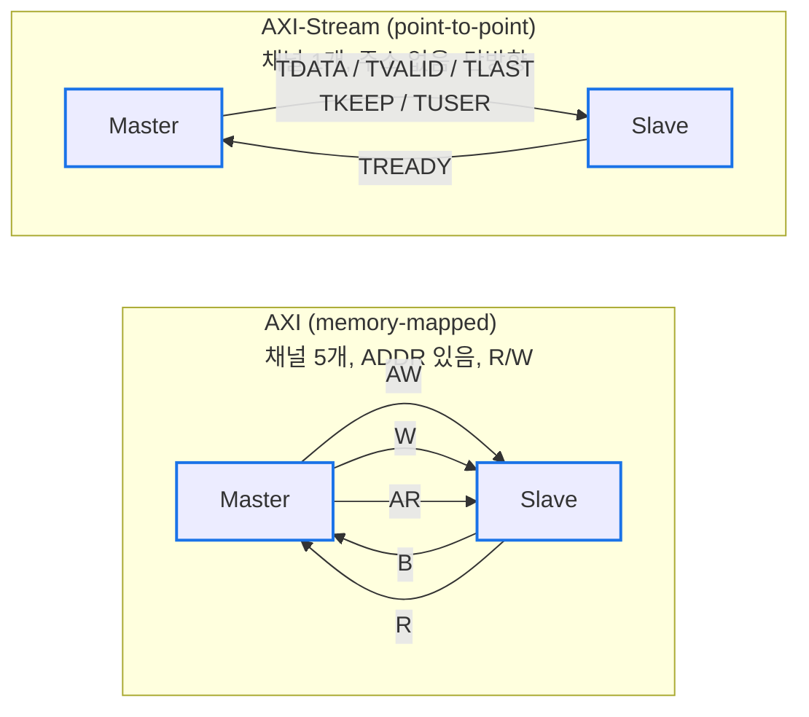
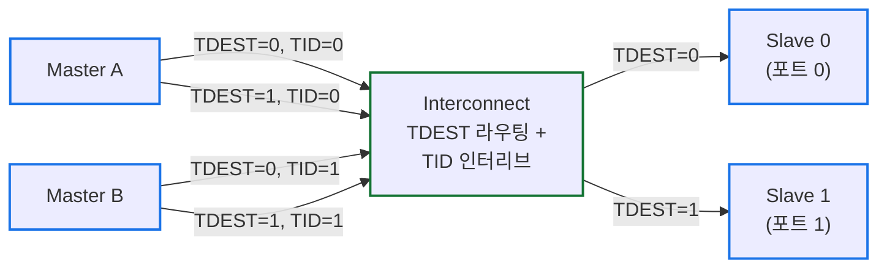

# Module 03 — AXI-Stream

<!-- DV-SKOOL-CH-CTX:start -->
<div class="chapter-context" data-cat="core">
  <a class="chapter-back" href="../">
    <span class="chapter-back-arrow">←</span>
    <span class="chapter-back-icon">🔄</span>
    <span class="chapter-back-text">AMBA Protocols</span>
  </a>
  <span class="chapter-divider">›</span>
  <span class="chapter-marker">Module 03</span>
</div>
<!-- DV-SKOOL-CH-CTX:end -->

<!-- DV-SKOOL-CH-TOC:start -->
<div class="page-toc">
  <span class="page-toc-label">목차</span>
  <a class="page-toc-link" href="#1-why-care-이-모듈이-왜-필요한가">1. Why care?</a>
  <a class="page-toc-link" href="#2-intuition-비유와-한-장-그림">2. Intuition</a>
  <a class="page-toc-link" href="#3-작은-예-100-byte-패킷-한-개를-512-bit-stream-에서-2-beat-로-cycle-단위-추적">3. 작은 예 — 2-beat 패킷 추적</a>
  <a class="page-toc-link" href="#4-일반화-handshake-tlast-tkeep-routing">4. 일반화 — Handshake + TLAST + Routing</a>
  <a class="page-toc-link" href="#5-디테일-신호-byte-유형-stream-유형-실무">5. 디테일</a>
  <a class="page-toc-link" href="#6-흔한-오해-와-dv-디버그-체크리스트">6. 흔한 오해 + 디버그 체크리스트</a>
  <a class="page-toc-link" href="#7-핵심-정리-key-takeaways">7. 핵심 정리</a>
</div>
<!-- DV-SKOOL-CH-TOC:end -->

!!! objective "학습 목표"
    이 모듈을 마치면:

    - **Distinguish** AXI (memory-mapped) 와 AXI-Stream (점대점 단방향 스트림) 의 본질적 차이를 설명할 수 있다.
    - **Trace** 100-byte 패킷이 512-bit AXI-Stream 에서 2 beat 로 전송되는 과정을 cycle 단위로 추적할 수 있다.
    - **Apply** TUSER / TKEEP / TLAST 를 활용해 패킷/프레임 경계를 정확히 표시하는 시퀀스를 작성할 수 있다.
    - **Implement** Master/Slave AXI-Stream 인터페이스의 핸드셰이크 + 데이터 hold 규칙을 코드로 구현할 수 있다.
    - **Decide** AXI-Stream 이 적절한 시나리오 (DSP, AI accelerator, network packet) vs AXI memory-mapped 가 적절한 시나리오를 구분할 수 있다.

!!! info "사전 지식"
    - [Module 02 — AXI](02_axi.md) (VALID/READY 핸드셰이크)
    - 패킷 / 프레임 / 스트림 같은 데이터 형태에 대한 일반 지식

---

## 1. Why care? — 이 모듈이 왜 필요한가

**AXI-Stream 은 데이터 패스의 공용어** 입니다. AI 가속기의 weight/activation 흐름, DSP filter chain, 네트워크 IP 의 packet 흐름이 모두 AXI-Stream 으로 이동합니다. memory-mapped 와 다른 사고방식이 필요 — **주소가 없는 대신 TLAST 로 데이터의 경계를 표시** 합니다.

이 모듈을 건너뛰면 "AXI 패밀리" 라는 이름에 끌려 burst/outstanding/OoO 가 그대로 적용된다고 오해하기 쉽습니다. 반대로 _주소 없는 단방향 스트림_ 모델을 한 번 손으로 그려 보면, TKEEP 으로 unaligned data 를 표현하는 패턴, packet 중간에 데이터를 stall 할 때의 신호 hold 규칙 같은 검증의 함정이 분명히 보입니다. 또한 AI 가속기 / 네트워크 IP 검증 시 _custom thin VIP_ 의 설계 이유도 자연스럽게 도출됩니다.

---

## 2. Intuition — 비유와 한 장 그림

!!! tip "💡 한 줄 비유 — AXI-Stream ≈ 방송 streaming (점-대-점, 단방향, 무주소)"
    주소도 read/write 도 없고 그냥 _보낸다_. TVALID/TREADY 의 핸드셰이크와 TLAST 가 패킷 경계만 잡아 주는 가장 단순한 형태. AXI 의 5 채널이 아니라 _data channel 1 개_ + 핸드셰이크.

### 한 장 그림 — AXI 와 AXI-Stream 의 골격 차이



- AXI: `transaction = (AW,W) → B` 또는 `AR → R`. memory read/write.
- AXI-Stream: `packet = TLAST 까지의 beat 들`. packet streaming.

### 왜 이렇게 설계됐는가 — Design rationale

데이터 패스 (가속기, DSP, 네트워크) 의 요구는 memory-mapped 와 본질적으로 다릅니다.

1. **주소가 무의미** — AI weight stream, video frame, ethernet packet 은 _순서대로 흘러갈 뿐_ 저장 위치를 매 beat 마다 정할 필요가 없습니다.
2. **단방향 + full-throughput 가 핵심** — read/write 같은 양방향 의미가 없고 매 cycle 새 beat 가 source 에서 sink 로 흐르는 게 목표.
3. **다양한 시나리오에 fit** — Ethernet frame, DSP sample, virtual channel, multi-stream interleaving 등.

이 세 요구의 답이 (1) 주소를 빼고, (2) 단방향 1 채널만 두고, (3) AXI 의 _VALID/READY 핸드셰이크는 그대로 재사용_ 한 AXI-Stream 입니다. 핸드셰이크가 같다는 점이 중요합니다 — VIP / monitor / scoreboard 의 패턴이 AXI 와 동일하게 작성됩니다.

---

## 3. 작은 예 — 100-byte 패킷 한 개를 512-bit Stream 에서 2 beat 로 cycle 단위 추적

가장 단순한 시나리오. **TDATA 폭 = 512-bit (64-byte)**, 100-byte Ethernet payload 를 한 packet 으로 전송. Slave 는 beat 1 직후 1 cycle 동안 TREADY=0 으로 backpressure 를 건다.

### Cycle-by-cycle timeline

```
   beat 0: 64 byte 모두 유효
   beat 1: 36 byte 만 유효 + TLAST=1 (총 100 byte)

   cycle :        T1     T2      T3      T4      T5
   ACLK    : ─┐ ┌──┐  ┌──┐  ┌──┐  ┌──┐  ┌──┐  ┌──
                └─┘   └─┘   └─┘   └─┘   └─┘
   TVALID  :          ┌──────────────────────────┐
                      └ T2 부터 1, T5 끝에서 deassert
   TREADY  :          ┌──────┐         ┌─────────  (T3 = 0 = stall)
                      └      └─────────┘
   TDATA   :          ┤ beat0 ├─┤ beat0 hold ├─┤ beat1 ├─
                      (64 byte) (stall 동안 hold) (last beat)
   TKEEP   :          ┤0xFFFFFFFFFFFFFFFF├──hold──┤0x0000000FFFFFFFFFF├
                      (64 bit, 모두 1)            (하위 36 bit 만 1)
   TLAST   :          ┤      0           ├──hold──┤      1            ├
   TUSER   :          ┤      0           ├──hold──┤   (FCS good = 0)  ├
                      ▲                         ▲
                T2 rising edge:           T5 rising edge:
                beat 0 transfer 완료      beat 1 transfer 완료 (TLAST=1)
```

### 단계별 의미

| Step | Cycle | 누가 | 무엇을 | 왜 |
|---|---|---|---|---|
| ① | T1 | bus | TVALID=0 (idle) | 이전 packet 종료 |
| ② | T2 | master | TVALID=1, TDATA(beat0), TKEEP=64'hFFFFFFFFFFFFFFFF, TLAST=0 발행 | 첫 beat (전체 byte 유효) |
| ③ | T2 | slave | TREADY=1 | "받을 준비 됨" |
| ④ | T2 (rising) | bus | TVALID && TREADY → beat 0 **transfer 완료** | 64 byte 가 sink 에 latch |
| ⑤ | T3 | master | TDATA 를 beat 1 로 갱신, TKEEP=64'h0000000FFFFFFFFFF, TLAST=1, TVALID=1 hold | 마지막 beat 발행 시도 |
| ⑥ | T3 | slave | TREADY=0 (backpressure) | "잠깐 못 받음" — 내부 buffer full 등 |
| ⑦ | T3 | master | TVALID=1 + 모든 payload (TDATA, TKEEP, TLAST, TUSER) hold | spec invariant — TREADY=1 까지 신호 변경 금지 |
| ⑧ | T4 | slave | TREADY=0 유지 | stall 1 cycle 더 |
| ⑨ | T5 | slave | TREADY=1 발행 | 받을 준비 다시 됨 |
| ⑩ | T5 (rising) | bus | TVALID && TREADY → beat 1 **transfer 완료** (TLAST=1 이므로 packet 종료) | sink 가 packet 의 끝을 인지 + TKEEP 으로 36 byte 만 추출 |
| ⑪ | T6+ | bus | TVALID=0, idle | 다음 packet 대기 |

### TKEEP 검산

```
beat 0 의 TKEEP 의 1-bit 개수 = 64
beat 1 의 TKEEP 의 1-bit 개수 = 36
                                ─────
total                         = 100 byte ✓ (Ethernet payload 100 byte 와 일치)
```

```systemverilog
// AXI-Stream master 의 의사 SystemVerilog (synth-friendly)
typedef struct packed { logic [511:0] data; logic [63:0] keep; logic last; } beat_t;
beat_t  beats[2];
int     beat_idx;

always_ff @(posedge ACLK or negedge ARESETn) begin
  if (!ARESETn) begin TVALID <= 0; beat_idx <= 0; end
  else if (start_packet) begin
    TVALID <= 1; beat_idx <= 0;
    {TDATA, TKEEP, TLAST} <= {beats[0].data, beats[0].keep, beats[0].last};
  end
  else if (TVALID && TREADY) begin
    if (TLAST) begin TVALID <= 0; end
    else begin
      beat_idx <= beat_idx + 1;
      {TDATA, TKEEP, TLAST} <= {beats[beat_idx+1].data, beats[beat_idx+1].keep, beats[beat_idx+1].last};
    end
  end
  // TREADY=0 인 동안은 모든 신호가 자동 hold (else if 가 안 잡혀서 register 가 갱신 안 됨)
end
```

!!! note "여기서 잡아야 할 두 가지"
    **(1) TLAST=1 의 위치가 곧 패킷 경계** — sink 는 TLAST 를 본 cycle 까지를 한 packet 으로 모읍니다. TLAST 누락 = packet 경계 상실 = 다음 packet 과 합쳐져 sink 가 잘못된 길이로 처리.<br>
    **(2) TREADY=0 동안 TDATA / TKEEP / TLAST / TUSER 모두 hold** — AXI-Stream 의 invariant. master 의 출력 register 가 `TREADY || !TVALID` 조건으로만 갱신되도록 구현해야 안전.

---

## 4. 일반화 — Handshake + TLAST + TKEEP + Routing

### 4.1 핸드셰이크는 AXI 와 동일

```
전송 조건: TVALID && TREADY 동시 HIGH

  TCLK:   ─┐ ┌─┐ ┌─┐ ┌─┐ ┌─
            └─┘ └─┘ └─┘ └─┘

  TVALID: ────┐           ┌──
              └───────────┘

  TREADY: ─────────┐      ┌──
                   └──────┘
                   ↑ 전송!

규칙 (AXI와 동일):
  1. TVALID 올린 후 TREADY까지 유지
  2. TREADY는 자유롭게 toggle 가능
  3. Master는 TREADY를 기다리지 않고 TVALID assert 가능해야 함
```

### 4.2 단일 beat / 멀티 beat / 백프레셔의 일반 형태

```
단일 beat 패킷:
TCLK:   ─┐ ┌─
          └─┘
TDATA:  ─┤ D0 ├─
TVALID: ──┘    └──
TREADY: ──┘    └──
TLAST:  ──┘    └──  ← 첫 beat이자 마지막 beat
TKEEP:  ──┤0xFF├──  ← 전체 유효 (또는 부분)


멀티 beat 패킷:
TCLK:   ─┐ ┌─┐ ┌─┐ ┌─┐ ┌─
          └─┘ └─┘ └─┘ └─┘

TDATA:  ─┤D0├─┤D1├─┤D2├─┤D3├─
TVALID: ───────────────────────
TREADY: ───────────────────────
TLAST:  ─────────────────┘ └──  ← D3에서 LAST
TKEEP:  ─┤FF├─┤FF├─┤FF├─┤0F├─  ← D3는 하위 4바이트만 유효


백프레셔 (TREADY toggle):
TDATA:  ─┤D0├─┤D1├──────┤D2├─┤D3├─
TVALID: ───────────────────────────
TREADY: ──┘ └──┘ └──────┘ └──────  ← Slave가 D1 후 READY 내림
                  ↑ stall           ← Master는 D2를 유지하며 대기
                        ↑ READY 복귀 → 전송 재개
```

### 4.3 Stream 유형 분기 — Byte vs Continuous

| 유형 | TLAST 사용 | TKEEP 사용 | 특징 |
|------|-----------|-----------|------|
| **Byte Stream** | Yes | 마지막 beat 만 | 패킷/프레임 기반. TLAST 로 경계 표시. 마지막 beat 에서 TKEEP 으로 부분 유효 표시 |
| **Continuous Stream** | No | No (항상 전체 유효) | 연속 데이터 흐름. 패킷 개념 없음. 오디오/비디오 샘플 스트리밍 |
| **Continuous + Position** | No | Yes (항상) | TKEEP/TSTRB 으로 유효 바이트 표시하며 연속 전송 |

```
Byte Stream (TOE → DCMAC, Ethernet 패킷):
  [DATA][DATA][DATA][DATA+TLAST+TKEEP=0x3F]  ← 패킷 끝, 마지막 6바이트만 유효
  [DATA][DATA][DATA+TLAST+TKEEP=0xFF]         ← 다음 패킷 끝

Continuous Stream (오디오 DAC):
  [SAMPLE][SAMPLE][SAMPLE][SAMPLE]...  ← TLAST 없음, 끝없이 흐름
```

### 4.4 TID/TDEST 기반 multi-stream

- **TID**: 스트림 식별 — "이 데이터가 어떤 스트림에 속하는가?"
- **TDEST**: 라우팅 목적지 — "이 데이터가 어디로 가야 하는가?"



- `TDEST=0` 인 패킷 → Slave 0 으로 라우팅
- `TDEST=1` 인 패킷 → Slave 1 로 라우팅
- `TID=0` (Master A) 와 `TID=1` (Master B) 의 패킷이 같은 Slave 로 갈 때 → TID 로 서로 다른 스트림을 식별/분리

---

## 5. 디테일 — 신호, Byte 유형, Stream 유형, 실무

### 5.1 AXI vs AXI-Stream 핵심 차이

| 항목 | AXI (Full) | AXI-Stream |
|------|-----------|------------|
| 주소 | 있음 (ADDR) | **없음** |
| 방향 | 양방향 (R+W) | **단방향** (TX 또는 RX) |
| 채널 | 5개 (AW/W/B/AR/R) | **1개** (데이터만) |
| 용도 | 메모리 R/W, 레지스터 | 패킷/프레임/샘플 스트리밍 |
| 프레임 경계 | Burst Length 로 | **TLAST** 로 |
| 대표 사용처 | CPU↔MC, DMA | **TOE↔DCMAC**, 비디오, DSP |

### 5.2 AXI-Stream 신호 일람

| 신호 | 방향 (Master→Slave) | 역할 |
|------|-------------------|------|
| **TDATA** [N-1:0] | M→S | 데이터 (8/16/32/64/128/256/512-bit) |
| **TVALID** | M→S | 데이터 유효 |
| **TREADY** | S→M | Slave 수신 준비 |
| **TLAST** | M→S | 패킷/프레임의 마지막 beat |
| **TKEEP** [N/8-1:0] | M→S | 바이트 유효 마스크 (마지막 beat 에서 부분 유효) |
| TSTRB [N/8-1:0] | M→S | NULL/Position byte 구분 (선택) |
| TID | M→S | 스트림 식별자 (멀티 스트림) |
| TDEST | M→S | 라우팅 목적지 |
| TUSER | M→S | 사이드밴드 정보 (FCS 결과, 에러 등) |

#### 필수 vs 선택

```
필수: TDATA, TVALID, TREADY
거의 필수: TLAST, TKEEP
선택: TSTRB, TID, TDEST, TUSER

MangoBoost TOE↔DCMAC:
  TDATA(512-bit), TVALID, TREADY, TLAST, TKEEP(64-bit), TUSER
  → TUSER에 FCS 결과(good/bad) 전달
```

### 5.3 TKEEP vs TSTRB 상세 — 바이트 유형 분류

AXI-Stream 은 바이트를 3 가지 유형으로 분류한다. TKEEP 과 TSTRB 의 조합으로 결정:

| TKEEP | TSTRB | 바이트 유형 | 의미 |
|-------|-------|-----------|------|
| 1 | 1 | **Data byte** | 유효한 데이터. 반드시 전달/처리 |
| 1 | 0 | **Position byte** | 데이터는 아니지만 위치 (상대적 순서) 가 의미 있음 |
| 0 | 0 | **Null byte** | 무의미. 제거 가능 (패딩) |
| 0 | 1 | **(Reserved)** | 사용 금지 |

```
예시: 10-byte 데이터를 16-byte(128-bit) 버스로 전송

Beat 0 (첫 번째이자 마지막):
  TDATA:  [XX][XX][XX][XX][XX][XX][ D9][ D8][ D7][ D6][ D5][ D4][ D3][ D2][ D1][ D0]
  TKEEP:    0    0    0    0    0    0    1    1    1    1    1    1    1    1    1    1
  TSTRB:    0    0    0    0    0    0    1    1    1    1    1    1    1    1    1    1
  유형:   Null Null Null Null Null Null Data Data Data Data Data Data Data Data Data Data

TSTRB을 사용하지 않는 경우 (대부분의 구현):
  → TKEEP만으로 유효/무효 판단
  → TSTRB = TKEEP 또는 TSTRB 신호 없음 (tied to TKEEP)
  → Position byte 개념이 불필요하면 TSTRB 생략 가능

Position byte 사용 예:
  비디오 프레임에서 라인의 특정 위치에 빈 픽셀을 삽입해야 할 때
  → TKEEP=1, TSTRB=0으로 "이 위치에 바이트가 있지만 데이터는 아님"을 표시
```

> **면접 포인트**: "TKEEP 과 TSTRB 차이?" → TKEEP=1 은 "이 바이트 위치가 의미 있음", TSTRB=1 은 "이 위치에 실제 데이터가 있음". 대부분의 네트워크/DMA 응용에서는 TSTRB 을 사용하지 않고 TKEEP 만 사용.

### 5.4 AXI-Stream 실무 적용

#### TOE ↔ DCMAC (512-bit)

```
TOE (Master) → DCMAC (Slave):
  TDATA[511:0]: Ethernet Payload (Dst MAC부터)
  TVALID/TREADY: 핸드셰이크
  TLAST: Ethernet 프레임 마지막 beat
  TKEEP[63:0]: 마지막 beat의 유효 바이트
  TUSER: 없음 (TX 방향)

DCMAC (Master) → TOE (Slave):
  TDATA[511:0]: 수신 Ethernet Payload
  TVALID/TREADY: 핸드셰이크
  TLAST: 프레임 마지막 beat
  TKEEP[63:0]: 유효 바이트
  TUSER: FCS good/bad, 에러 플래그
```

#### MMU Translation 인터페이스

```
Request (Master → MMU):
  TDATA: VA + 제어 정보
  TVALID/TREADY

Response (MMU → Master):
  TDATA: PA + 상태 (Hit/Miss/Fault)
  TVALID/TREADY
```

#### TID / TDEST 를 이용한 멀티스트림 라우팅

```
실무 예시 (네트워크):
  TOE에서 여러 TCP 세션의 패킷을 동시 전송:
  TID = TCP session ID (0~N)
  TDEST = 출력 포트 번호 (NIC port 0, 1, ...)
  → Interconnect가 TDEST로 올바른 DCMAC 포트에 전달
  → 수신 측에서 TID로 세션별 데이터를 분리
```

> **DV 포인트**: TID/TDEST 기반 라우팅에서 (1) 올바른 Slave 에 도착하는지, (2) 서로 다른 TID 의 패킷이 섞이지 않는지, (3) 같은 TID 내 패킷 순서가 보존되는지 검증.

### 5.5 Custom "Thin" VIP 설계 (이력서 직결)

```
상용 VIP 문제: 모든 AXI-S 기능 구현 → 메모리 폭발

Custom Thin VIP:
  처리하는 신호: TDATA, TVALID, TREADY (핵심 3개)
  + TLAST, TKEEP (프레임 경계)
  나머지 (TID, TDEST, TSTRB 등): 무시 또는 단순 전달

  메모리 최적화:
  - Transaction 히스토리: 고정 크기 Sliding Window
  - 내부 큐: Bounded Queue (상한 설정)
  - 프로토콜 체커: 필수 규칙만 (VALID 유지, TLAST 정확성)

  → 메모리 수 GB → 수십 MB, 0% 크래시율
```

### 5.6 DV 핵심 검증 포인트

| 항목 | 시나리오 | 확인 사항 |
|------|---------|----------|
| 핸드셰이크 | TVALID/TREADY 모든 조합 | 데드락 없음, 데이터 손실 없음 |
| TLAST | 매 패킷 마지막에 정확히 | 프레임 경계 정확 |
| TKEEP | 마지막 beat 부분 유효 | 유효 바이트만 처리 |
| 백프레셔 | TREADY 빈번 toggle | 데이터 유지, 순서 보존 |
| 연속 패킷 | Back-to-back (TLAST → 즉시 다음 TVALID) | IFG 없이 연속 가능 |
| 빈 패킷 | TLAST + 0 데이터? | 프로토콜 정의에 따라 |
| TUSER | 사이드밴드 정보 전파 | FCS 결과 등 정확 반영 |

### 5.7 Q&A

**Q: AXI-Stream 이 AXI 와 다른 핵심 점은?**
> "주소가 없다는 것이 근본적 차이다. AXI 는 메모리 맵 접근 (특정 주소 R/W) 이고, AXI-Stream 은 연속 데이터 스트리밍 (패킷, 프레임) 이다. AXI-Stream 은 채널이 1 개 (단방향), TLAST 로 패킷 경계를 표시하고, 주소 대신 TID/TDEST 로 스트림을 식별한다. 핸드셰이크 (VALID/READY) 는 동일하다."

**Q: Custom Thin VIP 에서 왜 TDATA/TVALID/TREADY 만 처리했나?**
> "MMU 검증의 목적은 주소 변환 정확성과 성능이지, AXI-S 프로토콜의 모든 기능을 검증하는 것이 아니었다. TDATA (변환 요청/응답), TVALID/TREADY (핸드셰이크) 가 기능 검증의 핵심 경로이다. TID, TDEST, TSTRB 는 이 DUT 에서 사용하지 않거나 단순 전달이므로 생략하여 메모리를 절약했다. 프로토콜 준수 자체는 별도 환경에서 확인한다."

**Q: TKEEP 과 TSTRB 의 차이를 설명하라.**
> "TKEEP 은 바이트가 스트림의 일부인지 (위치가 의미 있는지), TSTRB 은 그 바이트가 실제 데이터인지를 나타낸다. TKEEP=1/TSTRB=1 은 data byte, TKEEP=1/TSTRB=0 은 position byte (위치만 의미), TKEEP=0/TSTRB=0 은 null byte (제거 가능). 대부분의 네트워크/DMA 응용에서는 TSTRB 없이 TKEEP 만 사용한다."

**Q: AXI-Stream 에서 패킷 사이에 gap (idle cycle) 이 반드시 필요한가?**
> "아니다. Back-to-back 전송이 가능하다. TLAST=1 인 beat 직후 다음 cycle 에서 바로 TVALID=1 로 새 패킷을 시작할 수 있다. IFG (Inter-Frame Gap) 는 프로토콜 요구사항이 아니다. 다만 Slave 가 TREADY 를 내려 자연스러운 gap 이 생길 수 있다."

### 5.8 연습문제

#### 문제 1: TKEEP 계산

**문제**: 512-bit (64-byte) AXI-Stream 버스에서 100-byte 패킷을 전송할 때, 각 beat 의 TKEEP[63:0] 값과 TLAST 를 구하라.

**사고 과정**:
1. 1 beat = 64 bytes. 100 bytes → ceil(100/64) = 2 beats 필요
2. Beat 0: 64 bytes 전체 유효 → TKEEP = 모두 1
3. Beat 1: 100 - 64 = 36 bytes 유효 → 하위 36 바이트만 1

**Dry Run**:
```
Beat 0:
  TDATA: [byte63 ... byte0]  ← 64바이트 모두 유효
  TKEEP: 64'hFFFF_FFFF_FFFF_FFFF  (64비트 모두 1)
  TLAST: 0

Beat 1:
  TDATA: [XX...XX | byte99 ... byte64]  ← 하위 36바이트만 유효
  TKEEP: 64'h0000_000F_FFFF_FFFF  (하위 36비트 = 1, 상위 28비트 = 0)
  TLAST: 1  ← 패킷 마지막

검산: TKEEP의 1 비트 개수 = 64 + 36 = 100 바이트 ✓
```

#### 문제 2: 백프레셔 시나리오 추적

**문제**: Master 가 4-beat 패킷 (D0~D3) 을 전송하는데, Slave 가 D1 수신 후 2 cycle 동안 TREADY=0 으로 내린다. 각 cycle 의 TDATA, TVALID, TREADY, 전송 여부를 추적하라.

**사고 과정**:
1. 전송 = TVALID && TREADY 동시 1 인 cycle
2. TREADY=0 이면 Master 는 현재 TDATA 를 유지해야 함 (TVALID 유지)
3. TREADY 복귀 후 전송 재개

**Dry Run**:
```
Cycle | TDATA | TVALID | TREADY | 전송? | 설명
------|-------|--------|--------|-------|----
  1   |  D0   |   1    |   1    |  ✓   | D0 전송
  2   |  D1   |   1    |   1    |  ✓   | D1 전송
  3   |  D2   |   1    |   0    |  ✗   | Slave가 TREADY 내림 → stall
  4   |  D2   |   1    |   0    |  ✗   | stall 유지, D2 변하지 않음!
  5   |  D2   |   1    |   1    |  ✓   | TREADY 복귀 → D2 전송
  6   |  D3   |   1    |   1    |  ✓   | D3 전송 (TLAST=1)

핵심: Cycle 3~4에서 TDATA=D2, TVALID=1 유지.
      데이터 손실 없음, 순서 보존.
      총 소요: 6 cycles (stall 없으면 4 cycles)
```

#### 문제 3: TID/TDEST 라우팅

**문제**: 2 개 Master (A, B) 가 2 개 Slave (S0, S1) 에 패킷을 보낸다. 다음 전송에서 각 패킷이 어디로 라우팅되는지 판단하라.

```
Master A: 패킷 P1 (TID=0, TDEST=1), 패킷 P2 (TID=0, TDEST=0)
Master B: 패킷 P3 (TID=1, TDEST=0), 패킷 P4 (TID=1, TDEST=1)
```

**Dry Run**:
```
TDEST 기반 라우팅:
  P1 (TDEST=1) → Slave 1
  P2 (TDEST=0) → Slave 0
  P3 (TDEST=0) → Slave 0
  P4 (TDEST=1) → Slave 1

Slave 0이 받는 패킷: P2(TID=0), P3(TID=1) → TID로 Master 구분 가능
Slave 1이 받는 패킷: P1(TID=0), P4(TID=1) → TID로 Master 구분 가능

같은 TID 내 순서 보장:
  TID=0: P1(S1), P2(S0) — 서로 다른 Slave이므로 순서 관계 없음
  TID=1: P3(S0), P4(S1) — 서로 다른 Slave이므로 순서 관계 없음
  만약 P2, P3 모두 S0에 도착 → TID가 다르므로 인터리브 가능
```

#### 퀴즈 (모듈 본문 연습용)

1. TKEEP=1, TSTRB=0 인 바이트의 유형 이름은?
   <details><summary>정답</summary>Position byte. 바이트 위치는 의미 있지만 실제 데이터는 아님.</details>

2. TLAST 없이 연속 전송되는 AXI-Stream 데이터 유형은?
   <details><summary>정답</summary>Continuous Stream. 오디오/비디오 샘플 등 패킷 개념 없이 연속 흐르는 데이터.</details>

3. 512-bit AXI-Stream 에서 1500-byte Ethernet 프레임은 몇 beat 필요한가?
   <details><summary>정답</summary>ceil(1500 / 64) = 24 beats. 마지막 beat 에서 TKEEP 으로 1500 - 23×64 = 28 바이트 유효 표시.</details>

4. Master 가 TVALID=1 상태에서 Slave 의 TREADY=0 때문에 stall 중이다. Master 가 TDATA 를 바꿔도 되는가?
   <details><summary>정답</summary>안 된다. TVALID=1 인 동안 TDATA, TLAST, TKEEP 등 모든 신호를 유지해야 함. TREADY=1 이 되어 전송이 완료된 후에야 변경 가능.</details>

5. TID 와 TDEST 가 모두 있을 때, 라우팅에 사용되는 것은?
   <details><summary>정답</summary>TDEST. TID 는 스트림 식별 (같은 출력 포트에서 스트림을 구분), TDEST 는 물리적 라우팅 목적지 결정.</details>

---

## 6. 흔한 오해 와 DV 디버그 체크리스트

### 흔한 오해

!!! danger "❓ 오해 1 — 'AXI-Stream 도 burst 가 있다'"
    **실제**: Stream 은 burst 가 없다 — 매 beat 가 독립. TLAST 가 "패킷의 마지막 beat" 를 표시하는 것이 burst 와 가장 가까운 개념. 따라서 AxLEN 같은 길이 파라미터가 없고, 패킷 길이는 source 가 흐르는 대로 결정합니다.<br>
    **왜 헷갈리는가**: AXI 패밀리라는 이름 때문에 AXI4 의 burst 개념이 그대로 적용된다고 가정하기 쉬움.

!!! danger "❓ 오해 2 — 'TVALID hold 중에 TDATA 만 바꾸는 건 괜찮다'"
    **실제**: TVALID=1 이면 TREADY=1 이 될 때까지 _TDATA 뿐 아니라 TKEEP/TSTRB/TLAST/TID/TDEST/TUSER 모두 hold_. 한 신호라도 바뀌면 receiver 가 어느 cycle 의 값을 sample 할지 미정의.<br>
    **왜 헷갈리는가**: VALID 가 단순 "데이터 있음" 으로만 보여서, payload 의 일부만 갱신해도 된다고 착각.

!!! danger "❓ 오해 3 — 'TKEEP 의 1 패턴은 항상 LSB 부터 연속이다'"
    **실제**: spec 상 TKEEP 은 "어느 byte lane 이 valid 한가" 의 표시일 뿐, _LSB-contiguous_ 의무는 없습니다 (단 대부분의 구현은 마지막 beat 에서 LSB-contiguous 패턴만 허용 — 사내 정책 확인 필수). 가운데에 0 이 있는 sparse pattern 을 허용하는 IP 도 있음.<br>
    **왜 헷갈리는가**: Ethernet/DMA 같은 전형적 byte-stream 만 보면 LSB-contiguous 가 자연스러워서.

!!! danger "❓ 오해 4 — 'packet 사이에 IFG (idle cycle) 이 필요하다'"
    **실제**: AXI-Stream 자체는 IFG 의무가 없습니다 — TLAST=1 다음 cycle 에 바로 TVALID=1 로 새 packet 시작 가능 (back-to-back). IFG 는 Ethernet PHY 의 의무지 stream 레이어의 의무가 아닙니다.<br>
    **왜 헷갈리는가**: Ethernet 의 IFG 와 stream 레이어를 혼동.

!!! danger "❓ 오해 5 — 'TID 가 있으면 OoO 가 가능하다'"
    **실제**: AXI-Stream 은 OoO 개념이 없습니다 — TID 는 단순 _스트림 구분자_ 일 뿐, AXI 의 ID 처럼 reorder 를 허용하지 않습니다. 같은 TID 내 packet 의 순서, 한 packet 내 beat 의 순서는 모두 보장.<br>
    **왜 헷갈리는가**: AXI 의 ID 의미를 그대로 가져옴.

### DV 디버그 체크리스트

#### Handshake / Hold

| 증상 | 1차 의심 | 어디 보나 |
|---|---|---|
| Sim hang | TVALID 가 TREADY 를 기다림 (deadlock) | RTL 의 TVALID 발행 코드에 TREADY 의존성 |
| 같은 beat 가 두 번 sample | TVALID hold 중 payload 변경 | SVA: `(TVALID && !TREADY) |=> $stable({TDATA,TKEEP,TSTRB,TLAST,TID,TDEST,TUSER})` |
| TVALID 가 1 cycle 만 떴다 사라짐 | TREADY 도착 전 TVALID 내림 | TVALID 가 TREADY=1 cycle 까지 hold 되는지 |

#### TLAST / Packet Boundary

| 증상 | 1차 의심 | 어디 보나 |
|---|---|---|
| Sink 가 두 packet 을 하나로 인지 | TLAST 누락 | 마지막 beat 의 TLAST=1 직접 체크 |
| Packet 길이가 spec 보다 짧음 | TLAST 가 너무 일찍 1 | beat counter vs 의도된 packet 길이 |
| Back-to-back packet 이 일부 손실 | TLAST 직후 다음 TVALID 의 timing | TLAST=1 cycle 과 다음 TVALID=1 cycle 분리 확인 |

#### TKEEP / Byte Lane

| 증상 | 1차 의심 | 어디 보나 |
|---|---|---|
| 마지막 beat 에서 garbage byte 가 들어감 | TKEEP=0 byte lane 을 sink 가 처리 | sink RTL 의 byte mask path |
| 100-byte packet 이 64-byte 로 잘림 | 마지막 beat 의 TKEEP 패턴 오류 | 1-bit 개수 합계 = packet length 검산 |
| Sparse TKEEP 에서 IP 가 fail | sparse pattern 미지원 IP | IP doc 에 LSB-contiguous 만 지원 명시 여부 |

#### TID / TDEST / Routing

| 증상 | 1차 의심 | 어디 보나 |
|---|---|---|
| Packet 이 wrong slave 에 도착 | TDEST 잘못 또는 interconnect routing | TDEST 디코드 표 vs interconnect config |
| 같은 TID packet 이 reorder | 중간 IP 가 OoO 발생 | 각 IP 가 in-order 보장 spec 인지 |
| 다른 TID packet 이 섞이지 않아야 하는데 섞임 | sink 가 TID 무시 | sink 의 packet assembly logic |

---

## 7. 핵심 정리 (Key Takeaways)

- **주소 없는 단방향 스트림**: AXI-Stream 은 점대점. memory-mapped 모델 아니므로 read/write 구분도 없음.
- **핸드셰이크는 AXI 와 동일**: TVALID/TREADY 규칙도 동일 — VALID 는 READY 기다리지 않고 올린다.
- **TLAST 가 패킷 경계**: 프레임/패킷의 마지막 beat 에서 1. 없으면 단일 무한 스트림.
- **TKEEP 으로 unaligned 표현**: 마지막 beat 에서 일부 바이트만 유효할 때 비트 위치별 마스크.
- **TVALID=1 동안 데이터 유지 의무**: TREADY=0 stall 중 TDATA/TLAST/TKEEP 변경 금지 — 가장 흔한 protocol 위반.
- **TID vs TDEST**: TID = 스트림 구분 (virtual channel), TDEST = 물리 라우팅 목적지.

!!! warning "실무 주의점 — TVALID hold 중 TKEEP/TUSER 변경"
    **현상**: 같은 beat 의 처음과 끝에서 TKEEP/TLAST/TUSER 값이 달라져 packet 이 잘리거나 sideband flag 가 잘못된 beat 에 부착된다. 시뮬레이션은 우연히 통과하지만 게이트 sim 또는 실제 칩에서 random fail.

    **원인**: AXI-Stream 의 invariant: TVALID=1 이면 TREADY=1 이 될 때까지 모든 신호 (TDATA, TKEEP, TSTRB, TLAST, TID, TDEST, TUSER) 를 hold 해야 한다. 송신 FSM 이 TREADY 와 무관하게 다음 beat 데이터를 미리 update 하면 위반.

    **점검 포인트**: SVA 로 `(TVALID && !TREADY) |=> $stable({TDATA, TKEEP, TSTRB, TLAST, TID, TDEST, TUSER})` 검증. monitor 에서 같은 transaction 을 두 번 sample 해 비교. RTL 의 데이터 source FF 가 `TREADY || !TVALID` 조건으로만 update 되는지 확인.

---

## 다음 단계

- 📝 [**Module 03 퀴즈**](quiz/03_axi_stream_quiz.md)
- ➡️ [**Module 04 — Quick Reference Card**](04_quick_reference_card.md)

<div class="chapter-nav">
  <a class="nav-prev" href="../02_axi/">
    <div class="nav-label">◀ 이전</div>
    <div class="nav-title">AXI (Advanced eXtensible Interface)</div>
  </a>
  <a class="nav-next" href="../04_quick_reference_card/">
    <div class="nav-label">다음 ▶</div>
    <div class="nav-title">AMBA Protocols — Quick Reference Card</div>
  </a>
</div>


--8<-- "abbreviations.md"
--8<-- "_inc/topic_abbr.md"
