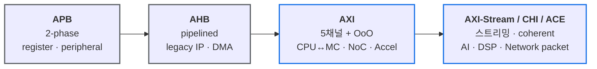

# Module 04 — Quick Reference Card

<!-- DV-SKOOL-CH-CTX:start -->
<div class="chapter-context" data-cat="core">
  <a class="chapter-back" href="../">
    <span class="chapter-back-arrow">←</span>
    <span class="chapter-back-icon">🔄</span>
    <span class="chapter-back-text">AMBA Protocols</span>
  </a>
  <span class="chapter-divider">›</span>
  <span class="chapter-marker chapter-quickref-marker">★ Quick Reference</span>
</div>
<!-- DV-SKOOL-CH-CTX:end -->

<!-- DV-SKOOL-CH-TOC:start -->
<div class="page-toc">
  <span class="page-toc-label">목차</span>
  <a class="page-toc-link" href="#1-why-care-이-카드는-언제-펴는가">1. Why care?</a>
  <a class="page-toc-link" href="#2-intuition-비유와-한-장-그림">2. Intuition</a>
  <a class="page-toc-link" href="#3-작은-예-axi-incr4-write-cycle-단위로-읽기">3. 작은 예 — AXI INCR4 빠르게 읽기</a>
  <a class="page-toc-link" href="#4-일반화-protocol-비교-와-handshake-요약">4. 일반화</a>
  <a class="page-toc-link" href="#5-디테일-신호-버전-pitfall-사용처">5. 디테일</a>
  <a class="page-toc-link" href="#6-이-카드를-언제-봐야-하나-와-흔한-오해">6. 이 카드를 봐야 할 때 + 흔한 오해</a>
  <a class="page-toc-link" href="#7-핵심-정리-key-takeaways">7. 핵심 정리</a>
</div>
<!-- DV-SKOOL-CH-TOC:end -->

!!! objective "사용 목적 (Recall-oriented)"
    참조용 치트시트. 정독용이 아니라 면접/코드 리뷰/디버그 중에 빠르게 확인하는 용도.

    **이 페이지에서 빠르게 떠올릴 수 있어야 하는 것:**

    - **Recall** APB / AHB / AXI / AXI-Stream 핵심 차이
    - **Recall** 핸드셰이크 데드락 방지 규칙
    - **Recall** AXI 5채널 신호 매핑
    - **Identify** 이 카드를 _언제_ 펴야 하는지 (5가지 trigger)
    - **Apply** AxLEN/wrap_boundary/WSTRB 인코딩을 즉석 계산

!!! info "사전 지식"
    - [Module 01-03](01_apb_ahb.md) 학습 완료 후 이 카드를 보면 효과 극대화

---

## 1. Why care? — 이 카드는 언제 펴는가

이 카드는 처음부터 끝까지 읽는 목적이 아닙니다 — _질문이 생긴 순간_ 에 펴서 한 항목만 보고 닫는 카드입니다. 다음 다섯 trigger 중 하나라도 맞으면 이 카드를 펴세요.

1. **면접 도중 protocol 비교 질문** — "AXI vs AHB 가 다른 점?" → §5.1 비교 테이블 + §6 면접 빈출 답변
2. **코드 리뷰 중 burst 인코딩 의심** — `AxLEN=4` 가 4-beat 인지 5-beat 인지? → §3 worked example + §6 오해 1
3. **디버그 중 wait state 동작 확인** — APB PREADY=0 동안 master 가 PADDR 바꿔도 되나? → §6 디버그 체크리스트
4. **VIP 작성 중 신호 누락 확인** — AXI-Stream 의 _필수_ 신호는? → §5.5 AXI-Stream 핵심 신호
5. **새 IP 통합 시 protocol 위치 결정** — 이 IP 는 APB 가 맞나 AHB 가 맞나? → §5.6 SoC 내 위치

이 카드를 모듈 1~3 의 _내용 요약_ 으로 보지 마세요 — _빠른 lookup index_ 로 보세요.

---

## 2. Intuition — 비유와 한 장 그림

!!! tip "💡 한 줄 비유 — AMBA family ≈ 도시 도로망"
    **APB** = 골목길 (느린 register 접근, 게이트 작음)<br>
    **AHB** = 일반 도로 (중속, 파이프라인 있는 단일 채널)<br>
    **AXI** = 고속도로 5 차선 (full-duplex, OoO, outstanding)<br>
    **AXI-Stream** = 인터컴 (점-대-점, 주소 없음, 패킷 streaming)<br>
    한 SoC 안에 여러 도로가 _공존_ 하며 각자 적합한 곳에 배치된다. 한 가지로 통일이 아니라 도메인별 fit-for-purpose.

### 한 장 그림 — AMBA family 와 SoC 내 위치



> 한 줄 요약: APB(레지스터) → AHB(중간, 파이프라인) → AXI(고성능, 5채널, OoO) → AXI-S(스트리밍, 주소 없음). 왼쪽이 저속 / 게이트 작은 쪽, 오른쪽이 고속 / 처리량 큰 쪽.

### 왜 이렇게 구분됐는가 — Design rationale

같은 SoC 안에 4 가지 protocol 이 _공존_ 하는 이유:

1. **APB 면적 비용** — UART/timer 같은 register 한두 개에 AXI 를 붙이면 IP 자체보다 인터페이스가 큽니다.
2. **AHB 의 호환성** — 레거시 IP 와 단순 DMA 에는 AXI 의 5 채널이 과한 설계.
3. **AXI 의 throughput** — CPU/MC/accelerator 에는 full-duplex + OoO + outstanding 이 필수.
4. **AXI-Stream 의 무주소** — 데이터 패스 (network packet, video frame, AI weight) 에는 주소가 무의미하고, _연속 흐름 + 경계 표시_ 만 필요.

각 protocol 은 _다른 protocol 을 대체하지 않습니다_ — 도메인별로 공존합니다.

---

## 3. 작은 예 — AXI INCR4 Write 를 cycle 단위로 읽기

가장 자주 펴는 카드 항목 중 하나 — **"AxLEN 인코딩 + WRAP boundary 계산"** 입니다. 이 카드를 펴면 다음 worked example 1 개로 즉석 검산할 수 있습니다.

### Scenario

- AXI4 Write
- Master → Slave
- `AWID=0x5, AWADDR=0x100, AWLEN=0x3 (4-beat), AWSIZE=0x2 (4-byte/beat), AWBURST=INCR (2'b01)`
- WSTRB = `4'b1111` (full word every beat)

### Cycle-by-cycle table

```
   cycle :    T1     T2     T3     T4     T5     T6
   ACLK    : ─┐ ┌──┐  ┌──┐  ┌──┐  ┌──┐  ┌──┐  ┌──
                └─┘   └─┘   └─┘   └─┘   └─┘
   ─── AW channel ────────────────────────────────
   AWVALID :       ┌────┐
   AWREADY :       ┌────┐
                        ▲ T2 rising: AW transfer 완료
   AWADDR  :       ┤0x100├
   AWLEN   :       ┤  3  ├
   AWBURST :       ┤INCR ├

   ─── W  channel ────────────────────────────────
   WVALID  :              ┌─────────────────────┐
   WREADY  :              ┌─────────────────────┐
   WDATA   :              ┤D0├─┤D1├─┤D2├─┤D3├──
   WSTRB   :              ┤F ├─┤F ├─┤F ├─┤F ├──
   WLAST   :              ─────────────────┘ └──   (D3 에서만 1)
                                              ▲ T6: W 마지막 beat 완료

   ─── B  channel ────────────────────────────────
   BVALID  :                                       ┌─
   BREADY  :                                       ┌─
   BID     :                                       ┤0x5├
   BRESP   :                                       ┤OKAY├
```

### 4 beat 의 주소 시퀀스 검산표

| Beat | AxLEN 잔여 | ADDR 계산 | 실제 ADDR | 의미 |
|------|-----------|----------|-----------|------|
| 0 | 3 | start = 0x100 | **0x100** | first beat |
| 1 | 2 | 0x100 + (1 << AxSIZE) = 0x100 + 4 | **0x104** | INCR |
| 2 | 1 | 0x104 + 4 | **0x108** | INCR |
| 3 | 0 | 0x108 + 4 | **0x10C** | last (WLAST=1) |

### 같은 시나리오를 WRAP 으로 바꾸면

```
   AxBURST = WRAP, AWADDR = 0x10C, AxLEN=3, AxSIZE=2
   total_bytes  = (AxLEN+1) × (1<<AxSIZE) = 4 × 4 = 16 (0x10)
   wrap_lower   = (AWADDR / total_bytes) × total_bytes = 0x100
   wrap_upper   = wrap_lower + total_bytes              = 0x110

   순서: 0x10C → 0x110 (== upper, wrap) → 0x100 → 0x104 → 0x108
   ⇒ beat0=0x10C, beat1=0x100, beat2=0x104, beat3=0x108
```

### 표에서 즉석으로 봐야 할 핵심 식

```
   beat 수      = AxLEN + 1
   beat byte    = 1 << AxSIZE
   total bytes  = beat 수 × beat byte = (AxLEN + 1) × (1 << AxSIZE)
   WRAP lower   = (start_addr / total_bytes) × total_bytes
   WRAP upper   = WRAP lower + total_bytes
   AXI3 max LEN = 0xF  (16-beat),    AXI4 INCR max LEN = 0xFF (256-beat)
```

!!! note "여기서 잡아야 할 두 가지"
    **(1) AxLEN 은 N-1 인코딩** — 4-beat = AxLEN=3, 16-beat = AxLEN=15. 이 카드를 펴는 가장 흔한 이유 중 하나가 이 off-by-one 검산.<br>
    **(2) WRAP boundary 는 (start_addr / total_bytes) × total_bytes** — start_addr 와 total_bytes (= (AxLEN+1) × (1<<AxSIZE)) 만 알면 즉석에서 lower/upper 가 계산됩니다.

---

## 4. 일반화 — Protocol 비교 와 Handshake 요약

### 4.1 한줄 요약

```
APB(레지스터) → AHB(중간, 파이프라인) → AXI(고성능, 5채널, OOO) → AXI-S(스트리밍, 주소 없음)
```

### 4.2 프로토콜 비교 테이블

| 항목 | APB | AHB | AXI | AXI-Stream |
|------|-----|-----|-----|------------|
| 복잡도 | 최저 | 중간 | 높음 | 중간 |
| 주소 | 있음 | 있음 | 있음 | **없음** |
| 방향 | 양방향 | 양방향 | 양방향 | **단방향** |
| 채널 | 1 | 1 | **5** (AW/W/B/AR/R) | **1** |
| 파이프라인 | 없음 | 있음 | 있음+Outstanding | 있음 |
| Burst | 없음 | 4/8/16 | 1~256 | 무한 (TLAST 까지) |
| OOO | 없음 | 없음 | **ID 기반** | 없음 |
| 핸드셰이크 | PSEL+PENABLE | HTRANS+HREADY | **VALID/READY** | **VALID/READY** |
| 대역폭 | 낮음 | 중간 | 높음 | 높음 |
| 용도 | Config/Reg | Legacy, DMA | CPU↔MC, IP | 패킷/프레임 |

### 4.3 핸드셰이크 빠른 참조

```
APB:  PSEL=1 → PENABLE=1 → PREADY=1 → 완료

AHB:  HTRANS=NONSEQ → HREADY=1 → 완료 (파이프라인: 주소+데이터 겹침)

AXI:  xVALID && xREADY → 전송 (5채널 각각 독립)
      규칙: VALID 올린 후 READY까지 유지, VALID은 READY 기다리지 않음

AXI-S: TVALID && TREADY → 전송 (AXI와 동일 규칙)
       TLAST로 패킷 끝 표시
```

---

## 5. 디테일 — 신호, 버전, Pitfall, 사용처

### 5.1 AXI 5채널 빠른 참조

```
Write: AW(주소) → W(데이터, WLAST) → B(응답)
Read:  AR(주소) → R(데이터, RLAST)

Outstanding: 응답 안 기다리고 다음 요청 발행 가능
OOO: 다른 ID는 순서 무관, 같은 ID는 순서 보장
Burst: INCR(증가), WRAP(랩핑), FIXED(고정)
RESP: OKAY / EXOKAY / SLVERR / DECERR
```

### 5.2 AXI-Stream 핵심 신호

```
필수: TDATA + TVALID + TREADY
패킷: + TLAST + TKEEP
사이드밴드: + TUSER (FCS good/bad 등)
라우팅: + TID + TDEST (멀티 스트림)
```

### 5.3 면접 골든 룰

1. **APB 존재 이유**: "게이트 비용 — 수십 개 저속 Slave 에 AXI 붙이면 면적 낭비"
2. **AHB 파이프라인**: "주소/데이터 1 cycle 겹침 — Wait State 중 유지 주의"
3. **AXI 3 대 특징**: "5 채널 독립 + Outstanding + OOO = 고성능의 핵심"
4. **VALID/READY 규칙**: "VALID 은 READY 를 기다리지 않음 — 데드락 방지의 근본"
5. **AXI-S 차이**: "주소 없음 + 단방향 + TLAST 로 패킷 경계"
6. **Custom VIP**: "TDATA/TVALID/TREADY 핵심 경로만 → 메모리 수십배 절약"

### 5.4 이력서 연결 — 프로토콜별 사용처

```
APB:  BootROM → OTP 레지스터, 보안 설정 레지스터
      UFS HCI → Configuration 레지스터

AHB:  UFS HCI → Host Controller 레지스터 인터페이스

AXI:  MC ← CPU/DMA 메모리 접근 (AXI/ACE)
      MMU → 주소 변환 요청/응답

AXI-Stream:
      TOE ↔ DCMAC → 패킷 스트리밍 (512-bit)
      MMU → Translation 요청/응답
      Custom "Thin" VIP → tdata/tvalid/tready 핵심 경로
```

### 5.5 SoC 내 AMBA 프로토콜 위치

```d2
direction: down

SOC: SoC {
  CPU: CPU { style.stroke: "#1a73e8"; style.stroke-width: 2 }
  IC: Interconnect { style.stroke: "#1a73e8"; style.stroke-width: 2 }
  MC: MC { style.stroke: "#1a73e8"; style.stroke-width: 2 }
  DRAM: DRAM { style.stroke: "#1a73e8"; style.stroke-width: 2 }
  AXIBR: AXI Bridge { style.stroke: "#137333"; style.stroke-width: 2 }
  AHBBR: AHB Bridge { style.stroke: "#137333"; style.stroke-width: 2 }
  OTP: "APB · OTP" { style.stroke: "#5f6368"; style.stroke-width: 2 }
  TMR: "APB · Timer" { style.stroke: "#5f6368"; style.stroke-width: 2 }
  UART: "APB · UART" { style.stroke: "#5f6368"; style.stroke-width: 2 }
  TOE: TOE { style.stroke: "#1a73e8"; style.stroke-width: 2 }
  DCMAC: DCMAC { style.stroke: "#1a73e8"; style.stroke-width: 2 }
  PHY: PHY
  NET: Network { shape: circle }

  CPU -> IC: "AXI / ACE"
  IC -> MC: "AXI"
  MC -> DRAM
  IC -> AXIBR -> AHBBR
  AHBBR -> OTP
  AHBBR -> TMR
  AHBBR -> UART
  TOE -> DCMAC: "AXI-Stream"
  DCMAC -> PHY -> NET
}
```

### 5.6 프로토콜 버전 빠른 참조

| 프로토콜 | 버전 | 핵심 변화 |
|---------|------|----------|
| APB | v2→v3 | +PREADY, +PSLVERR (wait/error 지원) |
| APB | v3→v4 | +PPROT, +PSTRB (보안+바이트 쓰기) |
| APB | v4→v5 | +PWAKEUP, +xUSER (저전력+사이드밴드) |
| AXI | v3→v4 | Burst 256, -WID/-Locked, +QoS/+Region/+User |
| AXI | v4→v5 | +Atomic Ops, +Trace, +Poison |
| AXI-S | v4 도입 | AXI4 와 함께 신규 정의 |

### 5.7 흔한 프로토콜 위반 버그 — DV Pitfall 목록

#### APB

| 버그 | 증상 | 원인 |
|------|------|------|
| PSEL 없이 PENABLE 상승 | 프로토콜 위반 | FSM 에서 Setup phase 건너뜀 |
| PREADY 무시 | Wait state 중 데이터 손실 | Master 가 PREADY 체크 안 함 |
| PSTRB 무시 (APB4) | 전체 word 덮어쓰기 | Slave 가 byte strobe 미구현 |

#### AHB

| 버그 | 증상 | 원인 |
|------|------|------|
| Wait 중 주소 변경 | 데이터-주소 불일치 | HREADY=0 일 때 HADDR 갱신하는 버그 |
| 1-cycle 에러 응답 | Master 가 다음 전송 취소 못함 | HRESP 2-cycle 프로토콜 미준수 |
| WRAP 주소 계산 오류 | 잘못된 캐시 라인 로드 | Wrap boundary 정렬 계산 실수 |
| BUSY 후 SEQ 미발행 | Burst 미완료 | Burst 중 BUSY 삽입 후 재개 누락 |

#### AXI

| 버그 | 증상 | 원인 |
|------|------|------|
| VALID 이 READY 의존 | **데드락** | Source 가 READY 를 기다린 후 VALID assert |
| VALID 중간에 내림 | 데이터 손실 | VALID 올린 후 READY 전에 deassert |
| WLAST 위치 오류 | Burst 길이 불일치 | AxLEN+1 beat 전에/후에 WLAST |
| WSTRB 무시 | 부분 쓰기 오류 | Slave 가 전체 word 쓰기 |
| OOO 순서 위반 | 같은 ID 데이터 뒤바뀜 | 같은 ID 내 응답 순서 미보장 |
| W 데이터가 AW 보다 선행 (AXI4) | 프로토콜 위반 | AW 없이 W 발행 |
| Exclusive Monitor 누락 | EXOKAY 불가 | Monitor 없이 항상 OKAY 반환 |

#### AXI-Stream

| 버그 | 증상 | 원인 |
|------|------|------|
| TVALID 이 TREADY 의존 | **데드락** | AXI 와 동일한 규칙 위반 |
| TLAST 누락 | 패킷 경계 상실 | 마지막 beat 에서 TLAST=0 |
| stall 중 TDATA 변경 | 데이터 손실/변조 | TREADY=0 중 Master 가 데이터 바꿈 |
| TKEEP 불일치 | 유효 바이트 오류 | 마지막 beat TKEEP 과 실제 데이터 불일치 |
| Back-to-back 간 gap 강제 | 성능 저하 | TLAST 후 불필요한 idle cycle 삽입 |

### 5.8 면접 빈출 비교 질문 — 한줄 답변

| 질문 | 한줄 답변 |
|------|----------|
| APB vs AXI 가장 큰 차이? | 파이프라인/Outstanding/OOO 유무 — 대역폭이 수십배 차이 |
| AXI vs AXI-Stream? | 주소 유무 — AXI 는 메모리 맵, AXI-S 는 스트리밍 (주소 없음) |
| AHB 가 아직 쓰이는 이유? | 레거시 IP 호환 + AXI 보다 게이트 작음 + 중간 성능 충분한 용도 |
| VALID/READY 에서 누가 먼저? | Source(VALID) 는 상관없이 올려야 하고, Dest(READY) 는 VALID 기다려도 됨 |
| AXI4 에서 WID 가 사라진 이유? | Write Interleaving 제거 → WID 불필요 (복잡도 대비 이득 미미) |
| WSTRB 전부 0 이면? | 유효 전송이나 실질 쓰기 없음 — Burst 중 beat skip 용 |
| TKEEP 과 WSTRB 차이? | 동일 개념 (바이트 마스크) but TKEEP 은 AXI-Stream, WSTRB 은 AXI Write |

---

## 6. 이 카드를 봐야 할 때 + 흔한 오해

### 6.1 이 카드를 봐야 하는 5 가지 trigger

| Trigger | 어디를 펴나 |
|---|---|
| 면접 도중 "AXI vs AHB?" | §4.2 비교 테이블, §5.8 한줄 답변 |
| 코드 리뷰 — `AxLEN=4` 가 4-beat? 5-beat? | §3 worked example, §6 오해 1 |
| 디버그 — wait state 중 신호 변경 가능? | §5.7 DV Pitfall, Module 01/02/03 의 §6 |
| VIP 작성 — AXI-Stream 필수 신호? | §5.2 |
| 새 IP 통합 — APB? AHB? AXI? | §5.5 SoC 내 위치, §4.2 비교 |

이 5 가지가 아니면 이 카드를 펴지 마세요 — 본 모듈 (01~03) 로 돌아가는 게 맞습니다.

### 6.2 흔한 오해

!!! danger "❓ 오해 1 — 'AMBA = AXI 다'"
    **실제**: AMBA 는 ARM 의 bus 표준 family — APB(저속), AHB(중속), AXI(고속), AXI-Stream(streaming), CHI(coherent), 등 여러 표준 포함. 한 SoC 안에 3~4 개가 _공존_.<br>
    **왜 헷갈리는가**: 현대 SoC 의 main interconnect 가 AXI 가 많아 AMBA = AXI 로 자주 혼동.

!!! danger "❓ 오해 2 — 'Burst 길이 인코딩이 모두 같다'"
    **실제**: AXI4 의 `AxLEN` 은 `(beat 수 − 1)` 인코딩. 4-beat = `AxLEN=3`, 16-beat = `AxLEN=15`. AXI3 는 4-bit (16-beat 한계), AXI4 INCR 만 8-bit (256-beat). FIXED/WRAP 은 여전히 16-beat 제한. AHB 의 HBURST 와 AXI 의 AxLEN 은 _다른 인코딩_ 임을 늘 의식해야 함.<br>
    **왜 헷갈리는가**: "burst 길이" 라는 단어가 같아 동일 인코딩 가정.

!!! danger "❓ 오해 3 — 'Quick Reference 만 보면 충분하다'"
    **실제**: 이 카드는 _index_ 입니다. 처음 학습은 Module 01-03 의 §3 worked example + §6 디버그 체크리스트를 한 번씩 손으로 그려야 효력이 생깁니다. 이 카드만 보면 _이름_ 은 외워도 _상황_ 에서 매핑이 안 됩니다.<br>
    **왜 헷갈리는가**: "치트시트" 라는 단어가 학습 단축의 환상을 줌.

!!! danger "❓ 오해 4 — 'TKEEP 과 WSTRB 가 다른 개념'"
    **실제**: 동일한 byte-mask 개념. 단지 TKEEP 은 AXI-Stream 의 _data byte_ 표시, WSTRB 은 AXI Write 의 _byte enable_. 이름이 다를 뿐 byte lane 의 0/1 mask 라는 본질은 같음.<br>
    **왜 헷갈리는가**: 두 protocol 의 신호 목록을 따로 외우면 별 개념으로 인식.

!!! danger "❓ 오해 5 — 'VALID 와 READY 중 누가 먼저인지가 protocol 마다 다르다'"
    **실제**: AXI / AXI-Stream 모두 _Source 가 Destination 의 READY 를 기다리지 않고 VALID 를 올려야_ 한다는 동일 규칙. APB 의 PSEL→PENABLE→PREADY 순서와는 별개 개념. 핸드셰이크 order 룰은 AXI family 안에서는 일관됩니다.<br>
    **왜 헷갈리는가**: APB 의 phase 순서를 AXI 에 그대로 가져옴.

### 6.3 디버그 체크리스트 — "이 카드를 펴는 순간 마주칠 첫 의문들"

| 증상 / 의문 | 1차 확인 | 어디 보나 |
|---|---|---|
| 4-beat 가 5-beat 처럼 동작 | AxLEN 인코딩 (N-1) | §3 worked example, §6 오해 2 |
| WRAP burst 가 경계 안 가고 넘어감 | wrap_lower / wrap_upper 계산 | §3 식 4 줄 |
| Sim hang | VALID 가 READY 를 기다리는지 | §4.3 핸드셰이크 규칙, §5.7 AXI 데드락 |
| WSTRB 가 0 인 byte 가 0 으로 깨짐 | slave 의 byte-mask path | §5.7 AXI WSTRB 무시 |
| TLAST 누락으로 packet 합쳐짐 | sink 의 packet 경계 인식 | §5.7 AXI-Stream TLAST |
| 새 IP 가 어느 protocol 인지 모름 | SoC 위치 + IP 도메인 | §5.5 SoC 내 위치 |
| Wait state 중 신호 갱신해도 되나 | hold invariant | §5.7 APB Wait, AHB Wait |

---

## 7. 핵심 정리 (Key Takeaways)

- **APB / AHB / AXI / AXI-Stream 는 _공존_** — 같은 SoC 안에서 도메인별 fit-for-purpose.
- **AXI family 의 핸드셰이크 규칙은 동일** — Source 가 Destination 의 READY 를 기다리지 않는다.
- **AxLEN 은 N-1 인코딩** — 4-beat = AxLEN=3. 가장 자주 헷갈리는 인코딩.
- **TKEEP ≈ WSTRB** — 둘 다 byte mask. protocol 만 다름.
- **이 카드는 index 다** — 처음 학습은 Module 01-03 의 §3 worked example 으로.

!!! warning "실무 주의점 — Burst 길이 인코딩 off-by-one"
    **현상**: 4-beat burst 를 보내려고 `AxLEN=4` 로 설정했는데 slave 가 5 beat 를 기대하거나 reverse 로 8-beat burst 가 7-beat 로 잘린다. 또는 `AxSIZE` 가 데이터 폭과 안 맞아 alignment 가 깨진다.

    **원인**: AXI4 의 `AxLEN` 은 `(beat 수 − 1)` 인코딩이다. 즉 4-beat = `AxLEN=3`, 16-beat = `AxLEN=15`. AXI3 는 4-bit 라서 16-beat 가 한계, AXI4 INCR 만 8-bit (256-beat). FIXED/WRAP 은 여전히 16-beat 제한.

    **점검 포인트**: master 에서 `AxLEN` 계산 코드가 `beat_count − 1` 인지 확인. WRAP burst 는 `wrap_boundary = (start_addr / total_bytes) × total_bytes` 이고 `total_bytes = (AxLEN+1) × (1<<AxSIZE)`. monitor / scoreboard 에서 expected beat 수와 실제 수신 beat 수를 매 transaction 별로 비교.

### 7.1 자가 점검

!!! question "🤔 Q1 — 카드 즉답 (Bloom: Apply)"
    "AXI 4-beat WRAP, 데이터 폭 32-bit. 주소 0x40 부터 시작. 어디로 wrap?"
    ??? success "정답"
        카드의 §3 검산표 직접 적용:
        - `total_bytes = (AxLEN+1) × (1<<AxSIZE) = 4 × 4 = 16 B`.
        - `wrap_boundary = (0x40 / 16) × 16 = 0x40`.
        - Beats: 0x40 → 0x44 → 0x48 → 0x4C → (wrap) → 0x40.
        - 검증 포인트: monitor 가 `0x4C` 다음에 `0x50` 받으면 wrap 오류.

!!! question "🤔 Q2 — Protocol 선택 trade-off (Bloom: Evaluate)"
    "Register interface 에 AXI 안 쓰고 APB 쓰는 이유" — 카드의 §5.4 + §5.5 로 답하라.
    ??? success "정답"
        APB 가 fit-for-purpose:
        - **신호 수**: APB ~6 신호 vs AXI ~50+ 신호 → register block 수십 개에 AXI = silicon 낭비.
        - **bandwidth 불필요**: register 는 trans 가 가끔 (config) → AXI 의 burst/outstanding 가치 없음.
        - **검증 단순**: APB 의 trans-by-trans 핸드셰이크 → SVA 작성 ~10 분 vs AXI ~수일.
        - 안티패턴: 모든 인터페이스를 AXI 로 통일 → 면적 + 검증 시간 폭증.

### 7.2 출처

**Internal (Confluence)**
- `AMBA Protocol Selection` — APB/AHB/AXI 매트릭스
- `AXI Burst Encoding` — AxLEN/AxSIZE 검증 사례

**External**
- ARM *AMBA AXI and ACE Protocol Specification* (IHI 0022)
- ARM *AMBA APB Protocol Specification* (IHI 0024)
- ARM *AMBA 4 AXI4-Stream Protocol Specification* (IHI 0051)

---

## 코스 마무리

3 개 모듈 + Quick Ref 를 완료했습니다. 다음을 권장합니다:

1. **퀴즈 풀어보기** — [퀴즈 인덱스](quiz/index.md)
2. **글로서리 스캔** — 모르는 용어 점검: [용어집](glossary.md)
3. **실전 적용** — 본인의 검증 환경에서 VALID/READY 데드락 패턴 검사
4. **다음 토픽** — UVM 위에 AMBA 를 올린 [UVM 코스](../../uvm/), 또는 메모리 서브시스템 [MMU](../../mmu/) / [DRAM](../../dram_ddr/)

<div class="chapter-nav">
  <a class="nav-prev" href="../03_axi_stream/">
    <div class="nav-label">◀ 이전</div>
    <div class="nav-title">AXI-Stream</div>
  </a>
  <a class="nav-next" href="../quiz/">
    <div class="nav-label">다음 ▶</div>
    <div class="nav-title">퀴즈로 이동</div>
  </a>
</div>


--8<-- "abbreviations.md"
--8<-- "_inc/topic_abbr.md"
