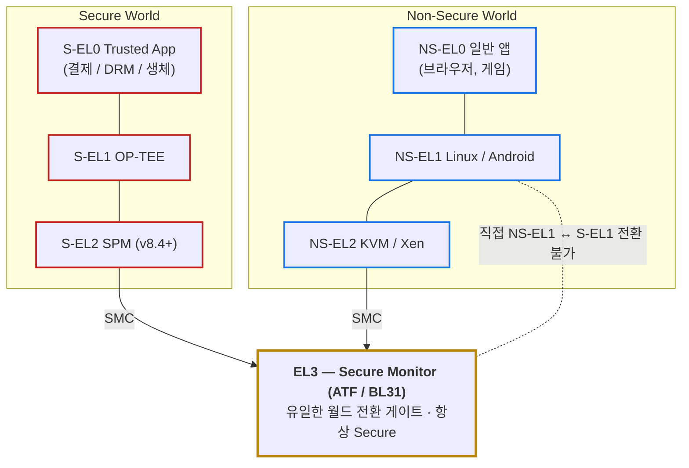
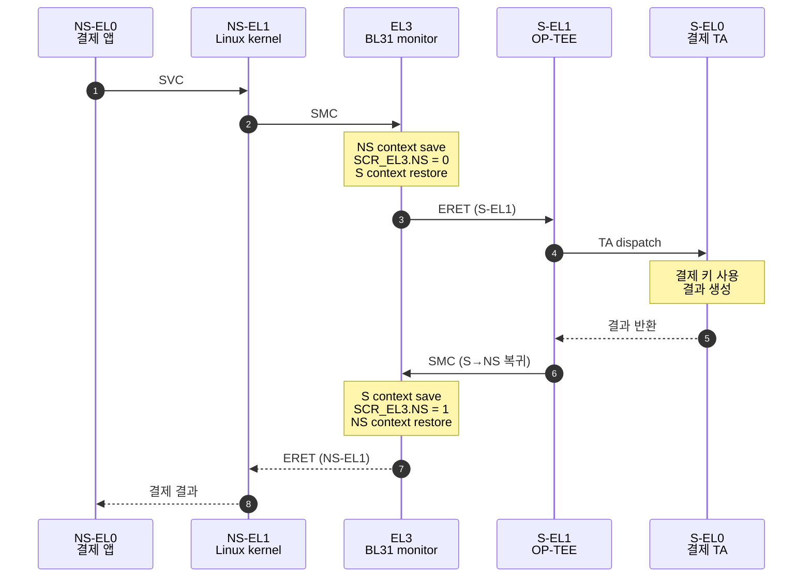
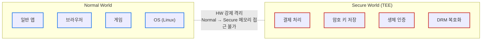
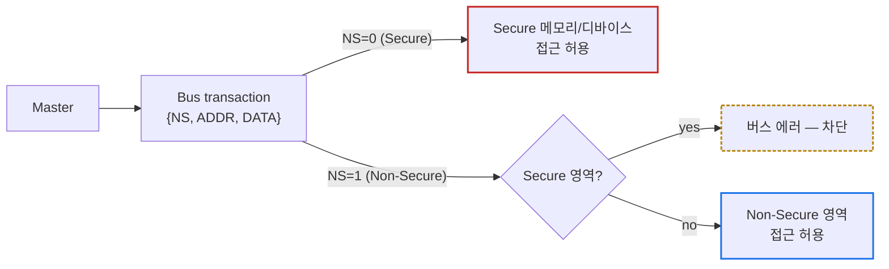

# Module 01 — Exception Level & TrustZone

<!-- DV-SKOOL-CH-CTX:start -->
<div class="chapter-context" data-cat="soc">
  <a class="chapter-back" href="../">
    <span class="chapter-back-arrow">←</span>
    <span class="chapter-back-icon">🛡️</span>
    <span class="chapter-back-text">ARM Security</span>
  </a>
  <span class="chapter-divider">›</span>
  <span class="chapter-marker">Module 01</span>
</div>
<!-- DV-SKOOL-CH-CTX:end -->

<!-- DV-SKOOL-CH-TOC:start -->
<div class="page-toc">
  <span class="page-toc-label">목차</span>
  <a class="page-toc-link" href="#1-why-care-이-모듈이-왜-필요한가">1. Why care?</a>
  <a class="page-toc-link" href="#2-intuition-비유와-한-장-그림">2. Intuition</a>
  <a class="page-toc-link" href="#3-작은-예-결제-앱이-tee-에-진입할-때-el-월드가-바뀌는-한-사이클">3. 작은 예 — NS-EL0 결제 → S-EL0 TA</a>
  <a class="page-toc-link" href="#4-일반화-두-축-수직-el-수평-ns-과-8-mode-매트릭스">4. 일반화 — 두 축 + 8 mode</a>
  <a class="page-toc-link" href="#5-디테일-el-별-책임-scr_el3-vbar-stage-2-secure-el2">5. 디테일</a>
  <a class="page-toc-link" href="#6-흔한-오해-와-dv-디버그-체크리스트">6. 흔한 오해 + DV 디버그 체크리스트</a>
  <a class="page-toc-link" href="#7-핵심-정리-key-takeaways">7. 핵심 정리</a>
</div>
<!-- DV-SKOOL-CH-TOC:end -->

!!! objective "학습 목표"
    이 모듈을 마치면:

    - **Diagram** ARMv8 의 4-level Exception Level (EL0/EL1/EL2/EL3) 과 각 level 의 책임을 그림으로 그릴 수 있다.
    - **Distinguish** TrustZone 의 Secure/Non-Secure World (수평 분리) 와 EL 의 권한 계층 (수직 분리) 을 구분할 수 있다.
    - **Apply** NS (Non-Secure) bit 가 메모리/레지스터 access 에 미치는 영향을 적용할 수 있다.
    - **Identify** Secure World 만 access 가능한 자원 (OTP, Secure DRAM, Secure GIC) 과 그 차단 메커니즘을 식별할 수 있다.
    - **Trace** NS-EL0 결제 앱이 S-EL0 Trusted App 까지 진입하는 6 단계 EL 전환 경로를 추적할 수 있다.

!!! info "사전 지식"
    - ARMv8 ISA 기본 (PSTATE, system register, ERET)
    - 권한 / 가상 메모리 / 인터럽트의 일반 개념
    - (선행 권장) 어떤 OS kernel 의 syscall 진입/탈출 흐름

---

## 1. Why care? — 이 모듈이 왜 필요한가

### 1.1 시나리오 — 스마트폰의 결제와 게임이 _같은 CPU_ 에서?

당신은 스마트폰을 사용합니다. 동시에:
- **게임 앱** (실시간 fps 60, 화면 그리기, 인터넷 통신).
- **결제 모듈** (지문 인증, 카드 정보, 암호화 키).

같은 CPU 에서 돌아갑니다. 그런데 _결제 모듈의 비밀키_ 가 _게임 앱_ 에서 읽히면 안 됩니다 — 해킹된 게임이 결제키를 훔쳐가는 _재앙_.

**가장 순진한 해법: 다른 CPU 쓰기** — 비용 ↑, 면적 ↑, 통신 비용 ↑.

ARM 의 해법: **TrustZone** — _같은 CPU 안에 두 세계_:
- **Non-Secure World**: Android, 게임, 일반 앱.
- **Secure World**: 결제 모듈, 지문 인증, DRM, 암호화 키.

두 세계는 _서로 격리_ — Non-Secure 에서 Secure 메모리를 _읽지조차 못함_. 단 _Secure Monitor (EL3)_ 라는 _한 게이트_ 를 통해 전환 가능.

| 자원 | NS 세계가 접근 가능? | S 세계가 접근 가능? |
|------|---------------------|---------------------|
| NS 메모리 | ✓ | ✓ (필요 시) |
| S 메모리 | ✗ (TZASC 차단) | ✓ |
| NS register | ✓ | ✓ |
| S register | ✗ (TZPC 차단) | ✓ |

**핵심 메커니즘**: AXI bus 의 _NS bit_ — 모든 transaction 에 "이게 NS 인가 S 인가" 표시. Slave 가 _자기 영역과 안 맞으면_ 거부.

이후 모든 ARM Security 모듈은 한 가정에서 출발합니다 — **"같은 SoC 안에서 두 종류의 SW 가, 서로 메모리·레지스터·인터럽트를 보지 못한 채 공존한다"**. SCR_EL3.NS 가 왜 EL3 에서만 바뀌는지, BootROM 이 왜 EL3 에서 시작하는지, TZASC/TZPC/SMMU/GIC 가 왜 NS bit 를 따라가는지 — 전부 이 한 가정의 파생입니다.

이 모듈을 건너뛰면 이후의 모든 spec/레지스터/검증 결정이 "그냥 외워야 하는 규칙" 으로 보입니다. 반대로 EL × NS 라는 **두 축의 매트릭스** 를 정확히 잡고 나면, 새 register 를 만날 때마다 _"이건 어느 칸의 보호 자원인가"_ 처럼 위치가 보입니다.

!!! question "🤔 잠깐 — _왜_ EL3 에서만 NS bit 변경?"
    SCR_EL3.NS 라는 _한 비트_ 가 _세계 전환_ 결정. 왜 다른 EL 은 못 바꾸나?

    ??? success "정답"
        **권한 단조성**.

        만약 EL1 (Linux 커널) 이 NS bit 를 바꿀 수 있으면 → Linux 커널이 _스스로_ S 세계로 진입 → S 메모리 read → _격리_ 가 의미 없어짐.

        EL3 (Secure Monitor) 가 _유일한 NS bit 변경 권한_ 을 가짐으로써:
        - NS world 의 어떤 code 도 S 자원에 _직접_ 접근 불가.
        - 진입은 _SMC instruction_ 으로 EL3 호출 → EL3 가 _권한 검증 후_ NS bit 변경.

        이게 ARM 의 _Single Gate_ 패턴 — 보안 모델의 _공리_. 게이트 하나만 잘 지키면 _모든 격리_ 가 성립.

---

## 2. Intuition — 비유와 한 장 그림

!!! tip "💡 한 줄 비유"
    **Exception Level + TrustZone** ≈ _건물의 권한 등급 (EL) × 보안/일반 출입증 (NS bit)_.<br>
    EL 은 **층** (B1 lobby = EL0, 1F = EL1, ... 옥상 = EL3), NS bit 는 **출입증 색깔** (파란색 = Non-Secure, 빨간색 = Secure). 같은 층이라도 출입증 색이 다르면 다른 방. 옥상 (EL3) 은 항상 빨간 출입증 전용 — 거기서만 NS bit 를 다른 색으로 바꿔주는 게이트가 열립니다.

### 한 장 그림 — EL × NS 매트릭스 + 단일 게이트 EL3



### 왜 이렇게 설계됐는가 — Design rationale

세 가지 요구가 동시에 풀려야 했습니다.

1. **OS 가 해킹돼도 결제 키/생체 데이터는 살아 있어야 한다** → 두 개의 격리된 실행 환경 (S/NS World).
2. **격리가 SW 신뢰 (위변조된 OS 가 자기 권한을 정직하게 보고하길 기대) 가 아니라 HW 강제여야 한다** → 모든 버스 transaction 에 **NS bit** 가 함께 흐르고, downstream filter 가 거부.
3. **그러나 둘이 가끔은 통신해야 한다** (앱이 결제 요청 → TEE 응답) → **단일 게이트 (EL3)** 만 NS bit 를 바꿀 수 있게 하고, 그 게이트의 코드 (BL31) 를 가장 작게 검증.

이 세 요구의 교집합이 곧 EL × NS 매트릭스 + EL3 단일 게이트 + NS bit 의 HW 전파입니다. 이 디자인은 이후 SCR_EL3, VBAR_ELn, TZPC/TZASC, GIC group, cache NS tag — 즉 ARM Security 의 거의 모든 어휘를 결정합니다.

---

## 3. 작은 예 — 결제 앱이 TEE 에 진입할 때 EL/월드가 바뀌는 한 사이클

가장 단순한 시나리오. 사용자가 결제 버튼을 누르면, 앱 (NS-EL0) 이 OS (NS-EL1) 의 syscall 을 거쳐 EL3 monitor 를 경유해 OP-TEE (S-EL1) 의 결제 TA (S-EL0) 까지 도달하고, 결과가 역순으로 반환됩니다.



| Step | 누가 | 무엇을 | 의미 |
|---|---|---|---|
| ① | NS-EL0 앱 | 결제 SDK 호출 | EL0 에서는 SMC 사용 불가 — 반드시 syscall 경유 |
| ② | NS-EL1 kernel | `SVC` → kernel 진입 → optee_driver 가 `SMC #0` 발행 | 일반 syscall 과 SMC 의 분업 |
| ③ | HW | SMC trap → `VBAR_EL3 + 0x400` (Lower EL, AArch64, Sync) 점프 | Lower EL exception entry |
| ④ | EL3 (BL31) | NS GPR/FP/sysreg context save → `SCR_EL3.NS = 0` → S context restore → `ERET` | 월드 전환의 **유일한 지점** |
| ⑤ | S-EL1 OP-TEE | TA dispatcher 가 결제 TA 를 찾아 호출 | TEE OS 의 책임 |
| ⑥ | S-EL0 결제 TA | 결제 키 사용 → 처리 결과 생성 | EL0 격리 — TA 끼리도 메모리 분리 |
| ⑦ | S-EL0 → S-EL1 | 결과 반환, OP-TEE 가 정리 | TA 종료 |
| ⑧ | S-EL1 | 다시 `SMC` 로 BL31 진입 (S→NS 복귀 요청) | EL3 가 양방향 게이트 |
| ⑨ | EL3 | S context save → `SCR_EL3.NS = 1` → NS context restore → `ERET` | NS 복귀 |
| ⑩ | NS-EL1 | optee_driver 가 결과를 user buffer 로 복사 → `ERET` | syscall 응답 |
| ⑪ | NS-EL0 | 결제 성공 UI 표시 | 사용자 관점은 함수 호출 1번 |

```c
// Step ② 의 NS-EL1 kernel 측 핵심 — 이 한 번의 SMC 가 ③~⑨ 를 트리거
register uint64_t x0 asm("x0") = SMC_FID_OPTEE_CALL_WITH_ARG;
register uint64_t x1 asm("x1") = (uintptr_t)&optee_msg_arg;
asm volatile("smc #0" : "+r"(x0), "+r"(x1));
/* x0 returns: OPTEE_SMC_RETURN_OK / RPC / etc. */
```

!!! note "여기서 잡아야 할 두 가지"
    **(1) 월드 전환은 EL3 강제 — NS-EL1 → S-EL1 직행 경로는 아키텍처적으로 존재하지 않습니다.** SMC trap → BL31 → ERET 이 유일한 통로. <br>
    **(2) 권한 상승 (EL0 → EL1 → EL3) 은 항상 Exception 으로만 발생** — SW 가 임의로 PSTATE.EL 을 올려 쓸 수 없습니다. 이게 보안 모델의 뼈대.

---

## 4. 일반화 — 두 축 (수직 EL, 수평 NS) 과 8 mode 매트릭스

### 4.1 두 축의 정의

!!! note "정의 (ISO 11179)"
    - **Exception Level (EL)**: ARMv8 PE (Processing Element) 의 권한 계층 (`EL0` < `EL1` < `EL2` < `EL3`) 으로, 각 level 이 system register / 메모리 매핑 / 명령어 사용 권한 범위를 결정한다.
    - **Security State (NS bit)**: PE 의 1-bit 상태로, 현재 instruction 이 Secure World 에서 실행되는지 (`NS=0`) Non-Secure World 에서 실행되는지 (`NS=1`) 를 표시하며, 모든 outgoing bus transaction 의 보안 attribute 로 전파된다.

```d2
direction: right

V: "EL — 수직 (권한)" {
  direction: down
  E3: "EL3 — Secure Monitor"
  E2: "EL2 — Hypervisor"
  E1: "EL1 — OS kernel"
  E0: "EL0 — Application"
  E3 -- E2
  E2 -- E1
  E1 -- E0
}
H: "NS — 수평 (월드)" {
  direction: down
  NS0: "NS=0 · Secure (TEE)"
  NS1: "NS=1 · Non-Secure (Rich OS)"
}
```

핵심: 두 축은 **독립** 입니다. EL3 만 항상 NS=0 으로 고정되고 (전환 게이트), 나머지 EL 은 (S, NS) 둘 다 가능. 그래서 표면상 4 × 2 = 8 mode 가 존재합니다.

### 4.2 8 mode 매트릭스와 사용 시점

| | Non-Secure (NS=1) | Secure (NS=0) |
|---|---|---|
| **EL0** | NS-EL0 일반 앱 | S-EL0 Trusted App (TA) |
| **EL1** | NS-EL1 Linux / Android | S-EL1 OP-TEE / Trusty / Knox |
| **EL2** | NS-EL2 KVM / Xen / Hyper-V | S-EL2 SPM (Hafnium, ARMv8.4+) |
| **EL3** | (존재하지 않음) | EL3 Secure Monitor (BL31) |

- **EL3 는 항상 Secure** — NS=1 EL3 라는 mode 는 아키텍처적으로 정의되지 않습니다 (그래서 8 - 1 = 7 mode 가 실용적으로 존재).
- **NS-EL2 ↔ S-EL2 의 비대칭** — Secure EL2 는 ARMv8.4-A 이전에는 없었고, 추가된 후에도 SPM (Secure Partition Manager) 의 자리만 차지합니다.

### 4.3 EL 전환의 일반 규칙

| 방향 | 규칙 |
|---|---|
| **상향** (낮은 EL → 높은 EL) | Exception 으로만 가능 — SVC (EL0→EL1) / HVC (EL1→EL2) / SMC (any→EL3) / IRQ·FIQ·Abort (설정에 따라). HW 자동: PSTATE→SPSR_ELn, PC→ELR_ELn, PC = VBAR_ELn + offset. |
| **하향** (높은 EL → 낮은 EL) | ERET 으로만 가능. SPSR_ELn.M 가 복귀 EL 을 결정, ELR_ELn 이 복귀 PC. 항상 같은 EL 또는 더 낮은 EL 로만 복귀 (상승 ERET 금지). |

이 규칙이 **"권한 상승은 HW 가 통제, SW 가 임의로 올릴 수 없다"** 라는 모델의 본질입니다. 이후 모든 모듈에서 이 규칙은 변하지 않고 반복됩니다.

---

## 5. 디테일 — EL 별 책임, SCR_EL3, VBAR, Stage 2, Secure EL2

### 5.1 Exception Level (EL0 ~ EL3)

```d2
direction: down

EL3: "**EL3 — Secure Monitor**\nATF/BL31, BootROM/BL1\n최고 권한 · 월드 전환 관리\nSMC 로 진입 · 항상 Secure"
EL2: "**EL2 — Hypervisor**\nVM 관리\nS-EL2 (ARMv8.4+) · NS-EL2 (KVM)"
EL1: "**EL1 — OS Kernel**\nS-EL1: TEE OS (OP-TEE, Trusty)\nNS-EL1: Linux, Android"
EL0: "**EL0 — Application**\nS-EL0: Trusted App (결제, DRM, 생체)\nNS-EL0: 일반 앱"
EL3 -> EL2
EL2 -> EL1
EL1 -> EL0
```

#### 각 EL 의 핵심 역할

| EL | 대표 SW | 핵심 권한 | Secure Boot 연결 |
|---|---------|----------|-----------------|
| **EL3** | ATF (BL31), **BootROM (BL1)** | 모든 시스템 레지스터 접근, 보안 상태 전환 | BL1 이 EL3 에서 실행 — 최초 신뢰점 |
| **EL2** | Hypervisor (KVM) | Stage 2 Translation, VM 격리 | BL33 (U-Boot) 이 EL2 로 진입 가능 |
| **S-EL1** | OP-TEE, Trusty | Secure 메모리/디바이스 접근 | BL32 가 S-EL1 에서 실행 |
| **NS-EL1** | Linux, Android | 일반 커널 | OS 가 NS-EL1 에서 실행 |
| **S-EL0** | Trusted App | TEE 내 앱 격리 | 결제, DRM, 생체인증 |
| **NS-EL0** | 일반 앱 | 최소 권한 | 사용자 앱 |

### 5.2 TrustZone — Secure / Non-Secure 분리

#### 왜 두 개의 "월드" 가 필요한가?

문제: 일반 OS 가 해킹되면 OS 커널 권한 탈취 → 모든 메모리/디바이스 접근 → 결제 정보, 암호 키, 생체 데이터 노출.



→ OS 가 해킹되어도 Secure World 의 키/데이터는 안전.

#### TrustZone 의 HW 격리 메커니즘

모든 버스 트랜잭션에 NS (Non-Secure) 비트 추가:



- NS 비트는 HW 가 강제 — SW 로 조작 불가능.
- EL3 (Secure Monitor) 만 NS 비트를 변경할 수 있음.

### 5.3 SCR_EL3 (Secure Configuration Register)

```
EL3에서 제어하는 핵심 보안 레지스터:

  SCR_EL3.NS  (bit[0]): 0=Secure, 1=Non-Secure
    → EL3가 하위 EL의 보안 상태를 결정

  SCR_EL3.IRQ (bit[1]): IRQ를 EL3로 라우팅
  SCR_EL3.FIQ (bit[2]): FIQ를 EL3로 라우팅
  SCR_EL3.SMD (bit[7]): SMC 명령 비활성화
  SCR_EL3.HCE (bit[8]): EL2 활성화
  SCR_EL3.RW  (bit[10]): 하위 EL의 AArch64/32 선택

  BootROM (EL3)이 SCR_EL3를 설정하여 보안 정책을 결정
  → BL2로 점프할 때 NS=0 (Secure) 유지
  → BL33으로 점프할 때 NS=1 (Non-Secure) 전환
```

### 5.4 EL 전환 명령어 요약

```
상향 전환 (Lower EL → Higher EL): Exception 발생
  EL0 → EL1:  SVC (Supervisor Call)    — 시스템 콜
  EL1 → EL2:  HVC (Hypervisor Call)    — Hypervisor 서비스 요청
  Any → EL3:  SMC (Secure Monitor Call) — 보안 서비스 / 월드 전환

  그 외 Exception:
    IRQ/FIQ:  GIC 설정에 따라 EL1/EL2/EL3로 라우팅
    Data Abort, Instruction Abort:  현재 EL 또는 상위 EL
    SError:  비동기 에러 → 설정에 따라 EL3까지 가능

하향 전환 (Higher EL → Lower EL): ERET 명령
  ERET:  Exception Return
    → SPSR_ELn에서 복귀할 EL과 PSTATE 복원
    → ELR_ELn에서 복귀 주소(PC) 복원
    → 항상 같은 EL이거나 더 낮은 EL로만 복귀 가능

주의: SW가 임의로 EL을 올릴 수 없음 — 반드시 Exception 경유
      → 이것이 보안의 핵심: 권한 상승은 HW가 통제
```

### 5.5 Exception 발생 시 HW 가 자동으로 하는 일

```
Exception 발생 (예: SMC 실행):
  ┌──────────────────────────────────────────────────┐
  │ 1. PSTATE → SPSR_EL3 (현재 프로세서 상태 저장)    │
  │ 2. 복귀 주소 → ELR_EL3 (돌아올 PC 저장)           │
  │ 3. PSTATE 변경:                                   │
  │    - PSTATE.EL = EL3 (EL 상승)                    │
  │    - PSTATE.SP = 1 (SP_EL3 사용)                  │
  │    - PSTATE.DAIF = 1111 (인터럽트 마스킹)          │
  │ 4. PC = VBAR_EL3 + offset (벡터 테이블로 점프)     │
  └──────────────────────────────────────────────────┘

ERET 실행 (복귀):
  ┌──────────────────────────────────────────────────┐
  │ 1. SPSR_EL3 → PSTATE (상태 복원, EL 포함)         │
  │ 2. ELR_EL3 → PC (복귀 주소로 점프)                │
  │ → 자동으로 하위 EL로 복귀됨                        │
  └──────────────────────────────────────────────────┘

핵심: SPSR/ELR은 해당 EL에서만 접근 가능
  → EL1은 SPSR_EL1만, EL3는 SPSR_EL3만
  → 하위 EL이 상위 EL의 복귀 상태를 조작할 수 없음
```

### 5.6 Exception Vector Table (VBAR_ELn)

```
각 EL은 자신만의 벡터 테이블을 가짐:
  VBAR_EL1: EL1의 벡터 테이블 기준 주소
  VBAR_EL2: EL2의 벡터 테이블 기준 주소
  VBAR_EL3: EL3의 벡터 테이블 기준 주소

벡터 테이블 구조 (각 엔트리 = 128 bytes = 32 명령어):
  ┌────────────┬────────┬────────┬────────┬────────┐
  │            │ Sync   │ IRQ    │ FIQ    │ SError │
  ├────────────┼────────┼────────┼────────┼────────┤
  │ Current EL │ +0x000 │ +0x080 │ +0x100 │ +0x180 │
  │  SP_EL0    │        │        │        │        │
  ├────────────┼────────┼────────┼────────┼────────┤
  │ Current EL │ +0x200 │ +0x280 │ +0x300 │ +0x380 │
  │  SP_ELx    │        │        │        │        │
  ├────────────┼────────┼────────┼────────┼────────┤
  │ Lower EL   │ +0x400 │ +0x480 │ +0x500 │ +0x580 │
  │  AArch64   │        │        │        │        │
  ├────────────┼────────┼────────┼────────┼────────┤
  │ Lower EL   │ +0x600 │ +0x680 │ +0x700 │ +0x780 │
  │  AArch32   │        │        │        │        │
  └────────────┴────────┴────────┴────────┴────────┘

  예: NS-EL1에서 SMC 실행 → EL3 진입
    → VBAR_EL3 + 0x400 (Lower EL, AArch64, Sync)
    → 여기에 ATF의 SMC 핸들러 코드가 위치

  예: EL0에서 SVC 실행 → EL1 진입
    → VBAR_EL1 + 0x400 (Lower EL, AArch64, Sync)
    → 여기에 OS의 시스템 콜 핸들러가 위치

  BootROM은 VBAR_EL3을 설정하여 EL3 벡터를 등록
```

### 5.7 EL 별 메모리 번역 체계 (Translation Regime)

```
+-------+-------------------+--------------------------------------+
| EL    | 레지스터           | 용도                                  |
+-------+-------------------+--------------------------------------+
| EL0/1 | TTBR0_EL1         | 유저 공간 (하위 주소, 앱별 매핑)       |
|       | TTBR1_EL1         | 커널 공간 (상위 주소, 공유)            |
|       | TCR_EL1           | 번역 제어 (granule, 범위 등)          |
+-------+-------------------+--------------------------------------+
| EL2   | TTBR0_EL2         | Hypervisor 자체 매핑                  |
|       | VTTBR_EL2         | Stage 2 번역 (VM의 IPA→PA)           |
|       | VTCR_EL2          | Stage 2 번역 제어                    |
+-------+-------------------+--------------------------------------+
| EL3   | TTBR0_EL3         | Secure Monitor 매핑                  |
|       | TCR_EL3           | EL3 번역 제어                        |
+-------+-------------------+--------------------------------------+
```

#### Stage 1 vs Stage 2 Translation (EL2 의 핵심)

```d2
direction: right

BM: "EL2 없을 때 (베어메탈)" {
  direction: right
  VA1: "VA\n(가상 주소)"
  PA1: "PA\n(물리 주소)"
  VA1 -> PA1: "Stage 1"
}
VZ: "EL2 있을 때 (가상화)" {
  direction: right
  VA2: "VA"
  IPA: "IPA\n(중간 물리 주소)"
  PA2: "PA"
  VA2 -> IPA: "Stage 1\nGuest OS (EL1) 관리"
  IPA -> PA2: "Stage 2\nHypervisor (EL2) 관리"
}
```

- **Stage 1**: Guest OS (EL1) 가 관리 — VM 내부 매핑.
- **Stage 2**: Hypervisor (EL2) 가 관리 — VM 간 격리.
- **왜 2 단계인가**: Guest OS 는 자신이 물리 메모리를 직접 관리한다고 "착각" → 실제로는 Hypervisor 가 Stage 2 로 물리 메모리를 격리 → VM-A 가 VM-B 의 메모리에 접근 불가 (Stage 2 가 차단). 이것이 VM 탈출 (VM Escape) 공격을 막는 HW 기반 방어.
- **TrustZone 과의 결합**: Stage 2 테이블에도 NS 속성 존재 → Hypervisor 가 VM 에 Secure 메모리를 매핑하는 것 자체를 차단. EL2 도 NS 상태이면 Secure PA 매핑 불가.

### 5.8 EL3 가 항상 Secure 인 이유

EL3 = Secure Monitor = 보안 월드 전환의 유일한 게이트.

```d2
direction: right

NSEL1: "NS-EL1 (Linux)"
EL3M: "EL3 (Secure Monitor)"
SEL1: "S-EL1 (OP-TEE)"
NSEL1 -> EL3M: "SMC 호출 (결제 요청)"
EL3M -> SEL1: "ERET → Secure"
SEL1 -> EL3M: "결제 처리 후\nSMC 반환"
EL3M -> NSEL1: "ERET → Non-Secure"
```

만약 EL3 가 Non-Secure 가 될 수 있다면 Normal World 에서 EL3 를 장악 → 보안 전환 조작 → TrustZone 전체 무력화. 따라서 EL3 는 항상 Secure — ARM 아키텍처 수준에서 강제.

### 5.9 Secure EL2 (ARMv8.4+) — Secure 가상화

```
ARMv8.4 이전:
  Secure World에는 Hypervisor 없음
  → Secure OS (S-EL1)가 하나만 존재
  → 복수의 TEE를 격리할 수 없음
  → 하나의 TEE가 전체 Secure 메모리 접근 가능 → 보안 위험

ARMv8.4+: Secure EL2 추가 → Secure Hypervisor 가 복수의 Secure Partition (SP) 을 격리 → FF-A (Firmware Framework for Arm) 표준으로 통신.

```d2
direction: down

SW: "Secure side" {
  SP0: "SP0 (TEE)"
  SP1: "SP1 (DRM)"
  SP2: "SP2 (...)"
  SEL2: "**S-EL2**\nSecure Partition Manager"
  SP0 -> SEL2
  SP1 -> SEL2
  SP2 -> SEL2
}
NW: "Non-Secure side" {
  VM: "NS-VM (Linux)"
  NSEL2: "**NS-EL2**\nKVM"
  VM -> NSEL2
}
EL3M: "**EL3 — Secure Monitor**"
SEL2 -> EL3M
NSEL2 -> EL3M
```

#### FF-A (Firmware Framework for Arm) — Secure Partition 통신 표준

```
문제: SP끼리, 또는 Normal World↔SP 간 통신 방법이 필요
  기존: SMC로 EL3 경유 → 오버헤드 크고, 표준 없음

FF-A 해결:
  표준화된 메시지 전달 인터페이스
  → 메시지 기반 통신 (Direct / Indirect)
  → 메모리 공유 프로토콜 (Lend, Share, Donate)
  → Partition Discovery (어떤 SP가 존재하는지 조회)

  통신 유형:
    Direct Message:  호출자 → SPM → 대상 SP (동기, 즉시 응답)
    Indirect Message: Shared Memory에 메시지 저장 → 알림 (비동기)

  메모리 공유:
    FFA_MEM_SHARE: 메모리를 양쪽에서 접근 가능 (공유)
    FFA_MEM_LEND:  메모리를 빌려줌 (빌려준 쪽은 접근 불가)
    FFA_MEM_DONATE: 메모리 소유권 완전 이전

SPM (Secure Partition Manager):
  S-EL2에서 실행되는 Secure Hypervisor
  → 각 SP를 S-EL0 또는 S-EL1에서 격리 실행
  → Stage 2 Translation으로 SP 간 메모리 격리
  → Reference 구현: Hafnium (Google 오픈소스)

  Hafnium 역할:
    - SP 로드 및 초기화
    - FF-A 메시지 라우팅
    - SP 간 메모리 격리 (Stage 2)
    - SP 스케줄링
```

### 5.10 전환 흐름 종합 예시 — 실제 결제 경로

```d2
direction: down

NSEL0: "NS-EL0 (앱)"
NSEL1: "NS-EL1 (Linux Kernel)\noptee_driver"
EL3F: "EL3 (ATF / BL31) — VBAR_EL3 + 0x400\n① NS context save\n② SCR_EL3.NS = 0\n③ S context restore\n④ ERET → S-EL1"
SEL1: "S-EL1 (OP-TEE)\n결제 TA 호출"
SEL0: "S-EL0 (결제 Trusted App)\n결제 처리"
BACK: "S-EL1 → EL3 → NS-EL1 → NS-EL0\n(역순 복귀)"
NSEL0 -> NSEL1: "SVC #0"
NSEL1 -> EL3F: "SMC #0"
EL3F -> SEL1
SEL1 -> SEL0
SEL0 -> BACK
```

총 EL 전환: 6 회 (상향 3 + 하향 3).

---

## 6. 흔한 오해 와 DV 디버그 체크리스트

### 흔한 오해

!!! danger "❓ 오해 1 — 'TrustZone 켜면 자동으로 안전'"
    **실제**: TrustZone 은 _분리된 실행 환경_ 인프라일 뿐, 그 위 SW (TEE OS, BL31, TA) 와 정책 (TZASC region 설정, TZPC slave 분류, GIC group 할당) 이 정확해야 안전합니다. 단순 enable 만으로는 misconfiguration 가능 — 한 region 의 NS bit 가 잘못 설정되면 곧장 탈취 경로가 열립니다.<br>
    **왜 헷갈리는가**: "기능 켜짐 = 안전" 이라는 직관. 실제 보안은 boot 단계에서 secure-only 자원의 lock-down 정확성에 의존.

!!! danger "❓ 오해 2 — 'EL 은 SW 가 자유롭게 올릴 수 있다'"
    **실제**: 권한 상승은 **반드시 Exception 으로만** 가능합니다. SW 가 PSTATE.EL 을 직접 쓰려고 하면 UNDEFINED 또는 무시. SVC/HVC/SMC/IRQ/FIQ/Abort 만이 상향 트리거이고, 하향은 ERET 만이 가능. 이 비대칭이 보안 모델의 본질입니다.<br>
    **왜 헷갈리는가**: 일반 ISA 의 "mode bit 를 set" 같은 직관 때문에.

!!! danger "❓ 오해 3 — 'NS-EL1 → S-EL1 직행 가능'"
    **실제**: 두 EL 사이에 직접 전이 명령은 없습니다. 반드시 EL3 (SMC → BL31 → ERET) 경유. 이게 단일 게이트 디자인의 핵심.<br>
    **왜 헷갈리는가**: "같은 EL 레벨이니 옆으로만 가면 될 것 같다" 는 추론.

!!! danger "❓ 오해 4 — 'EL3 가 항상 활성화되어 있다'"
    **실제**: 일부 SoC (저가형 Cortex-A 또는 R-class) 는 EL3 를 implement 하지 않습니다 (`ID_AA64PFR0_EL1.EL3 = 0`). 그 경우 secure ↔ non-secure 전환 자체가 없거나 EL2 가 monitor 역할을 대신합니다. 검증 시 우리 SoC 의 EL3 implementation 여부를 먼저 확인.<br>
    **왜 헷갈리는가**: 표준 spec 의 "EL3 가 monitor" 표현 때문에.

!!! danger "❓ 오해 5 — 'NS bit 는 SW 가 임의로 set 가능'"
    **실제**: NS bit 는 SCR_EL3.NS 가 source-of-truth 이고, 오직 EL3 에서만 write 가능합니다. NS-EL1 이나 EL2 에서 SCR_EL3 에 write 시도 → trap (또는 silently ignored). 그래서 이 bit 가 HW 격리의 출발점.<br>
    **왜 헷갈리는가**: "그냥 register 1 bit" 라는 인상.

### DV 디버그 체크리스트 (이 모듈 내용으로 마주칠 첫 실패들)

| 증상 | 1차 의심 | 어디 보나 |
|---|---|---|
| NS world 가 secure DRAM read 했는데 BusError 가 안 나옴 | SCR_EL3.NS bit 가 outgoing transaction attribute (`AxPROT[1]`/`AxNSE`) 로 전파 안 됨 | master IF 의 NS attribute 와 SCR_EL3.NS 의 cycle-by-cycle 일치 SVA |
| SMC 후 secure GPR 잔여 값이 NS world 에 보임 | BL31 의 context save/restore 가 NEON/FP/SVE 누락 | BL31 context 코드 + post-ERET register dump |
| `SVC` 가 EL3 까지 올라감 | trap routing (`HCR_EL2.IMO/AMO`, `SCR_EL3.IRQ/FIQ`) 잘못 | exception entry 의 VBAR base 와 offset 0x000 vs 0x400 |
| EL2 에서 ERET 했는데 EL3 로 점프 | SPSR_EL2.M 잘못 (EL3h 로 set 됨) | SPSR.M 디코드 + ERET 직전 dump |
| Stage2 가 비활성인데 VM 격리 실패 | VTTBR_EL2/VTCR_EL2 미설정 → identity mapping | VTCR_EL2.T0SZ/SL0 와 VTTBR_EL2 가 valid S2 table 가리키는지 |
| OTP register 가 NS world 에서 읽힘 | TZPC slave 분류 누락 | BL1 boot trace + TZPC region 설정 |
| 같은 PA 인데 S/NS 가 같은 캐시 라인 | cache NS tag 가 비활성 또는 line invalidate 누락 | cache controller 의 NS tag bit + write-back 정책 |
| ERET 후 IRQ mask 풀림 | SPSR.DAIF 잘못 복원 | ERET 직전 SPSR 의 DAIF field |

이 체크리스트는 이후 모듈에서 더 정교한 형태로 다시 나옵니다. 지금 단계에서는 "ARM Security 실패 = (SCR_EL3 | SPSR | VBAR | TZPC | TZASC | NS attribute) 중 하나" 만 기억하세요.

---

!!! warning "실무 주의점 — SCR_EL3.NS 비트 전파 누락"
    **현상**: NS world 에서 secure-only 메모리/레지스터를 read 했는데 BusError 없이 정상 데이터가 반환된다.

    **원인**: EL3 진입/탈출 시 SCR_EL3.NS 비트가 트랜잭션 어트리뷰트로 버스에 정확히 전파되지 않아, downstream filter (TZASC/TZPC) 가 NS 트랜잭션을 secure 로 오인한다.

    **점검 포인트**: AxPROT[1]/AxNSE 등 NS 어트리뷰트가 모든 master IF 에서 SCR_EL3.NS 와 일치하는지 SVA 로 강제하고, NS world coverage 시 secure resource read 가 차단되는지 확인.

## 7. 핵심 정리 (Key Takeaways)

- **두 축의 보안**: 수직 (Exception Level: EL0 user → EL1 kernel → EL2 hypervisor → EL3 secure monitor) + 수평 (Secure World vs Non-Secure World).
- **EL3 = 단일 게이트**: 가장 privileged + 항상 Secure + 월드 전환의 유일한 통로. ARM Trusted Firmware BL31 이 여기서 동작.
- **NS bit**: PSTATE 의 1-bit 상태이자 모든 outgoing bus transaction 의 attribute. EL3 만 변경 가능, HW 가 모든 downstream 에 강제 전파.
- **권한 상승은 Exception 으로만**: SVC/HVC/SMC/IRQ — SW 가 PSTATE.EL 을 임의로 set 불가. 하향은 ERET 으로만.
- **8 mode 매트릭스 (실용 7 mode)**: EL0~3 × S/NS, 단 EL3 는 항상 Secure. 검증 시 각 mode 에서 어떤 자원이 visible/accessible 한지 그림으로 그려두면 분석이 빠릅니다.

!!! warning "실무 주의점"
    - "TrustZone 켜짐 = 안전" 이 아니라 _TZASC/TZPC/GIC/SMMU 의 boot-time 설정 정확성_ 이 곧 안전입니다.
    - SCR_EL3.NS 변경은 EL3 의 _명시적 write_ 시점만 일어나야 합니다 — write 직후 한 cycle 안에 모든 master IF 가 새 NS 를 반영하는지 SVA 로 강제하세요.
    - EL3 미구현 SoC 에서는 여기 모듈의 모든 "EL3" 자리를 EL2 또는 monitor-less 모델로 재해석해야 합니다.

### 7.1 자가 점검

!!! question "🤔 Q1 — World 전환 추적 (Bloom: Analyze)"
    NS-EL0 의 게임 앱이 결제 모듈 호출. 어떤 _exception 시퀀스_ 로 전환?

    ??? success "정답"
        1. NS-EL0 → `SVC` → NS-EL1 (게임이 시스템 콜 통해 결제 모듈 호출 요청).
        2. NS-EL1 → `SMC` → **EL3** (Secure Monitor).
        3. EL3 가 SCR_EL3.NS = 0 으로 변경 + S-EL1 으로 `ERET`.
        4. S-EL1 (OP-TEE) 가 결제 처리.
        5. S-EL1 → `SMC` → EL3.
        6. EL3 가 NS=1 으로 복원 + NS-EL1 으로 ERET.

        총 _6 단계_. 각 단계가 _exception_ 으로 명시적 전환 — _임의 전환 불가_.

!!! question "🤔 Q2 — NS bit 전파 검증 (Bloom: Apply)"
    당신은 SoC verifier. SCR_EL3.NS 가 _AXI bus 의 AxPROT[1]_ 으로 전파됨. 검증 시나리오?

    ??? success "정답"
        - **Positive**: EL3 가 NS=1 write → 다음 cycle 의 AxPROT[1] = 1 인지.
        - **Negative**: NS=0 (Secure) 인 상태에서 NS 메모리에 write 시도 → TZASC 가 차단하는지.
        - **Cross-check**: 모든 master (CPU, DMA, GPU) 의 AxPROT[1] 이 _동일_ 한지 (race 없는지).

        SVA: `assert property (rose(SCR_EL3.NS) |=> AxPROT[1] == 1)`.

### 7.2 출처

**Internal (Confluence)**
- `ARM Base System Architecture (BSA)` (id=712278023)
- `ARM Server Base System Architecture (SBSA)` (id=755073043)
- `Identity & Access control` (id=998899872)

**External**
- ARM, *Architecture Reference Manual for A-profile (ARM DDI 0487)*
- ARM, *TrustZone for ARMv8-A* whitepaper
- ARM Trusted Firmware (TF-A) docs, 2024

---

## 다음 모듈

→ [Module 02 — 월드 전환 & SoC 보안 인프라](02_world_switch_soc_infra.md): SCR_EL3.NS 가 실제로 어떻게 모든 SoC 컴포넌트 (TZPC, TZASC, GIC, SMMU, cache) 에 전파되는지, BL31 이 SMC handler 에서 무엇을 하는지.

[퀴즈 풀어보기 →](quiz/01_exception_level_trustzone_quiz.md)

<div class="chapter-nav">
  <a class="nav-prev" href="../">
    <div class="nav-label">◀ 이전</div>
    <div class="nav-title">코스 홈</div>
  </a>
  <a class="nav-next" href="../02_world_switch_soc_infra/">
    <div class="nav-label">다음 ▶</div>
    <div class="nav-title">보안 상태 전환 & SoC 보안 인프라</div>
  </a>
</div>


--8<-- "abbreviations.md"
