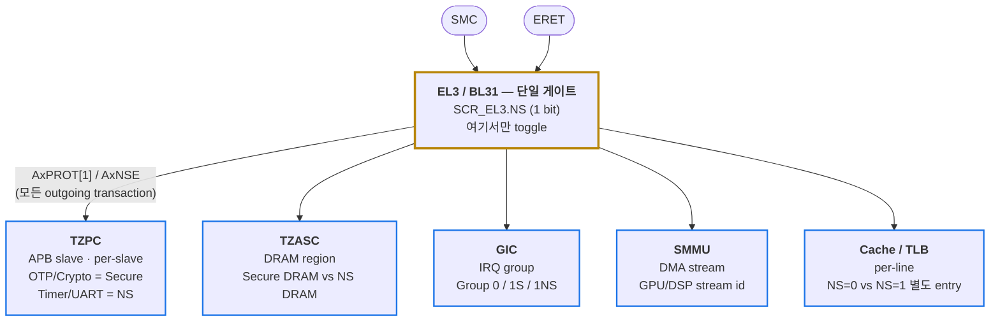
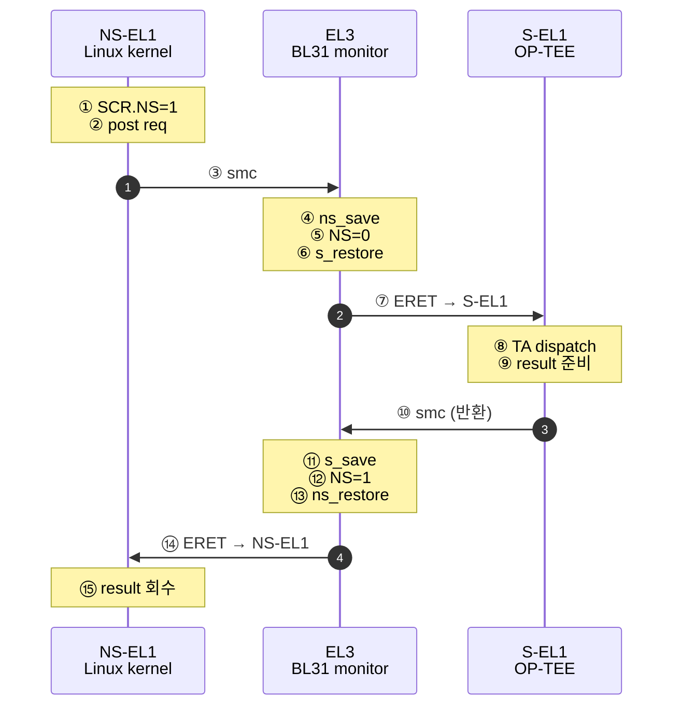
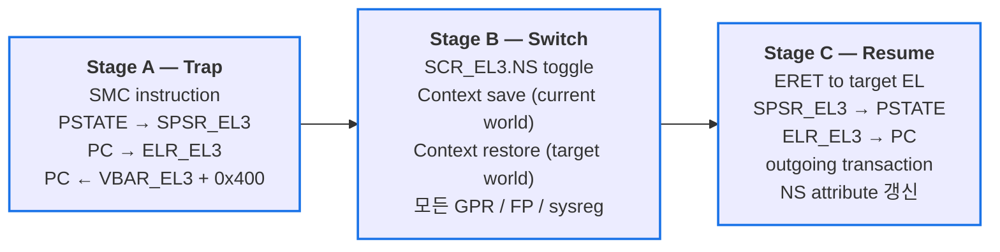
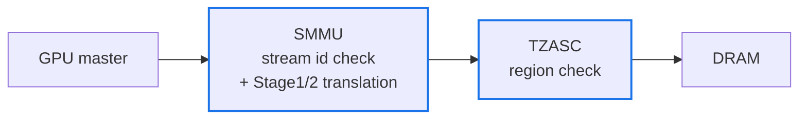
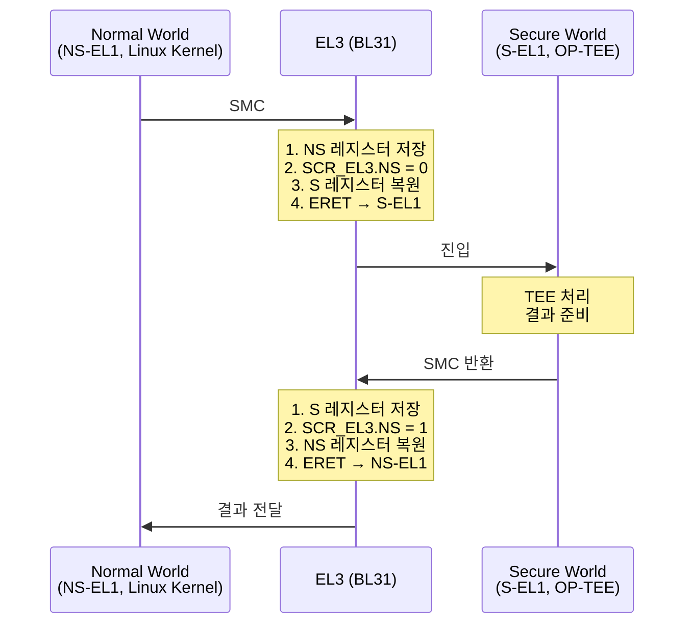
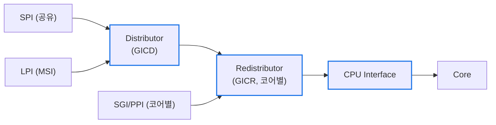
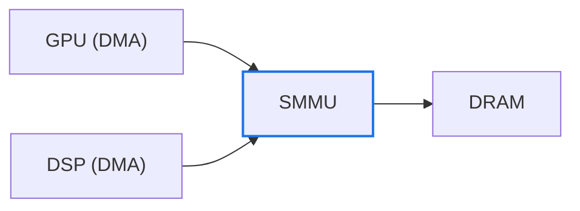
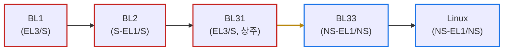

# Module 02 — World Switch & SoC Security Infra

<!-- DV-SKOOL-CH-CTX:start -->
<div class="chapter-context" data-cat="soc">
  <a class="chapter-back" href="../">
    <span class="chapter-back-arrow">←</span>
    <span class="chapter-back-icon">🛡️</span>
    <span class="chapter-back-text">ARM Security</span>
  </a>
  <span class="chapter-divider">›</span>
  <span class="chapter-marker">Module 02</span>
</div>
<!-- DV-SKOOL-CH-CTX:end -->

<!-- DV-SKOOL-CH-TOC:start -->
<div class="page-toc">
  <span class="page-toc-label">목차</span>
  <a class="page-toc-link" href="#1-why-care-이-모듈이-왜-필요한가">1. Why care?</a>
  <a class="page-toc-link" href="#2-intuition-비유와-한-장-그림">2. Intuition</a>
  <a class="page-toc-link" href="#3-작은-예-ns-el1-에서-smc-한-번이-bl31-에서-월드를-바꾸는-한-사이클">3. 작은 예 — SMC 한 번의 월드 전환</a>
  <a class="page-toc-link" href="#4-일반화-월드-전환의-3-단계-와-soc-보안-인프라-5-축">4. 일반화 — 3 단계 + 5 축</a>
  <a class="page-toc-link" href="#5-디테일-tzpc-tzasc-gic-smmu-cache-shared-memory">5. 디테일</a>
  <a class="page-toc-link" href="#6-흔한-오해-와-dv-디버그-체크리스트">6. 흔한 오해 + DV 디버그 체크리스트</a>
  <a class="page-toc-link" href="#7-핵심-정리-key-takeaways">7. 핵심 정리</a>
</div>
<!-- DV-SKOOL-CH-TOC:end -->

!!! objective "학습 목표"
    이 모듈을 마치면:

    - **Trace** SMC instruction → EL3 secure monitor → world switch 흐름을 GPR/SPSR/SCR 단위로 추적할 수 있다.
    - **Apply** TZPC, TZASC, GIC 의 secure / non-secure 분할 설정을 부팅 시점에 적용할 수 있다.
    - **Implement** BL31 의 context save/restore 흐름 (world 전환 시 register 격리) 을 구현 관점에서 분해할 수 있다.
    - **Identify** SoC peripheral 의 보안 인프라 적용 위치 (DRAM = TZASC, APB = TZPC, DMA = SMMU, IRQ = GIC) 를 식별할 수 있다.
    - **Distinguish** TZASC (영역 단위) 와 SMMU (디바이스 단위) 의 다층 방어 역할을 구분할 수 있다.

!!! info "사전 지식"
    - [Module 01 — Exception Level & TrustZone](01_exception_level_trustzone.md)
    - GIC (Generic Interrupt Controller) 기본 구조
    - AXI 의 `AxPROT[1]` (NS attribute) 개념

---

## 1. Why care? — 이 모듈이 왜 필요한가

Module 01 에서 _"NS bit 가 모든 transaction 에 함께 흐른다"_ 라고 했지만, **누가 그 bit 를 set 하고, 어느 컴포넌트가 그 bit 를 보고 차단하는지** 는 아직 안 봤습니다. 이 모듈이 그 답입니다 — BL31 의 SMC handler 가 SCR_EL3.NS 를 toggle 하면, downstream 에서 TZPC (peripheral), TZASC (DRAM), GIC (interrupt), SMMU (DMA), cache (NS tag) 가 각자 다른 단위로 같은 NS bit 를 _존중_ 합니다.

이 모듈을 건너뛰면 디버그 시 _"NS world 에서 secure 자원이 노출되는데 어디서 새는지 모르겠다"_ 가 됩니다. 반대로 5 축 (TZPC/TZASC/GIC/SMMU/cache) 을 정확히 잡으면, 첫 실패 신호만 보고도 어느 컴포넌트가 누락됐는지 즉시 좁힐 수 있습니다.

---

## 2. Intuition — 비유와 한 장 그림

!!! tip "💡 한 줄 비유"
    **World switch + SoC 보안 인프라** ≈ _공항의 입국 게이트 + 다층 보안 검색대_.<br>
    **SMC** = 입국 신청서 제출. **BL31** = 출입국 심사관 (소지품 = register 를 압수보관/돌려주고 NS bit = 출입증 색깔을 바꿈). **TZPC/TZASC/GIC/SMMU/cache** = 면세점·게이트·수하물·짐꾼·라운지 별로 따로 있는 X-ray 기기들 — 각자 NS bit 를 다른 단위 (peripheral, DRAM region, IRQ, DMA stream, cache line) 로 검사.

### 한 장 그림 — SCR_EL3.NS 가 5 축으로 전파되는 모습



### 왜 이렇게 설계됐는가 — Design rationale

세 가지 요구가 동시에 풀려야 했습니다.

1. **NS bit 의 source 는 단 하나여야 한다** — 여러 곳에서 set 가능하면 일관성이 깨짐 → SCR_EL3.NS 가 유일한 source-of-truth, EL3 만 write.
2. **그러나 보호의 _세밀도_ 는 자원 종류마다 다르다** — DRAM 은 GB 단위, peripheral 은 slave 1 개 단위, IRQ 는 1 개 단위, DMA 는 stream id 단위, cache 는 line 단위 → 각자 다른 controller 가 같은 NS bit 를 _자기 단위로 해석_.
3. **월드 전환은 비싸지만 정확해야 한다** — register 한 개라도 누락되면 secure state 누설 → BL31 의 context save/restore 가 GPR/FP/SVE/sysreg 까지 빠짐없이 처리.

이 세 요구의 교집합이 "EL3 single-source NS bit + 5 축의 SoC 인프라 + BL31 의 정확한 context handling" 입니다.

---

## 3. 작은 예 — NS-EL1 에서 SMC 한 번이 BL31 에서 월드를 바꾸는 한 사이클

가장 단순한 시나리오. NS-EL1 Linux kernel 의 OP-TEE driver 가 `SMC #0` 을 발행해 S-EL1 OP-TEE 에 진입했다가 돌아옵니다. 사이에 BL31 이 두 번 (NS→S, S→NS) 호출되며, 각 호출마다 GPR + sysreg 컨텍스트를 정확히 swap 합니다.



| Step | 누가 | 무엇을 | 의미 |
|---|---|---|---|
| ① | NS-EL1 | 현재 SCR_EL3.NS=1 인 상태 (BL31 이 이전에 NS 로 set) | 정상 NS world 실행 중 |
| ② | NS-EL1 | OP-TEE message buffer 작성, X0 = function id | SMCCC 규약 |
| ③ | NS-EL1 | `smc #0` 실행 | HW 가 즉시 trap to EL3 |
| ④ | EL3 (BL31) | NS context save: x0~x30, SP_EL1, ELR_EL1, SPSR_EL1, **NEON/FP/SVE**, TPIDR_EL*, sysreg | 누락 시 secure state 누설 |
| ⑤ | EL3 | `MSR SCR_EL3, x?` 로 NS bit 0 set | 이 cycle 부터 outgoing AxPROT[1]=0 |
| ⑥ | EL3 | 이전에 보관한 S context (있으면) restore — 첫 진입이면 OP-TEE entry 로 set | 양방향 swap |
| ⑦ | EL3 | SPSR_EL3 ← S-EL1h, ELR_EL3 ← OP-TEE entry → `ERET` | S-EL1 진입 |
| ⑧ | S-EL1 | TA function id 디코드 → 결제 TA 호출 | TEE OS 동작 |
| ⑨ | S-EL1 | TA 결과 반환 → message buffer 업데이트 | |
| ⑩ | S-EL1 | `smc` 로 BL31 재진입 (이번엔 S→NS 요청) | 양방향 게이트 |
| ⑪ | EL3 | S context save | secure register 보호 |
| ⑫ | EL3 | `SCR_EL3.NS = 1` set | 이 cycle 부터 다시 NS attribute |
| ⑬ | EL3 | NS context restore (Step ④ 의 역작업) | |
| ⑭ | EL3 | `ERET` → NS-EL1 | smc 다음 instruction 으로 |
| ⑮ | NS-EL1 | x0 ~ X3 의 반환 코드 회수, message buffer 읽기 | application path |

```c
// Step ③ 의 NS-EL1 측. 이 한 줄의 SMC 가 ④~⑭ 를 모두 트리거.
register uint64_t x0 asm("x0") = OPTEE_SMC_CALL_WITH_ARG;
register uint64_t x1 asm("x1") = (uintptr_t)&msg_arg;
asm volatile("smc #0"
             : "+r"(x0), "+r"(x1)
             :
             : "x2","x3","x4","x5","x6","x7", "memory");
/* x0 ← OPTEE_SMC_RETURN_OK / RPC code */
```

!!! note "여기서 잡아야 할 두 가지"
    **(1) BL31 이 GPR 만 save 하면 부족** — NEON/FP/SVE/TPIDR_EL*/PMU 등 _모든_ 휘발 레지스터가 secure state 일 수 있고, NS world 가 ERET 후 그 잔여 값을 읽어낼 수 있습니다. 사내 실무 주의점 (이 모듈 §6 참조).<br>
    **(2) SCR_EL3.NS 를 set 하는 cycle 과 outgoing transaction 이 새 NS 로 보이는 cycle 이 정확히 일치해야** — 한 cycle 어긋나면 _찰나의 secure transaction 이 NS attribute 로 나가는 race_ 가 생깁니다.

---

## 4. 일반화 — 월드 전환의 3 단계 와 SoC 보안 인프라 5 축

### 4.1 월드 전환의 3 단계



| Stage | 핵심 register | 누락 시 결과 |
|---|---|---|
| A. Trap | VBAR_EL3, SPSR_EL3, ELR_EL3 | 잘못된 handler 진입 → 시스템 hang |
| B. Switch | SCR_EL3.NS, x0~x30, NEON/FP/SVE, TPIDR_*, sysreg context | secure state 누설 / 잔여 값 노출 |
| C. Resume | SPSR_EL3.M, ELR_EL3, AxPROT 전파 | 잘못된 EL 복귀 / NS attribute race |

### 4.2 SoC 보안 인프라 5 축

| 축 | 보호 단위 | 분류 기준 |
|---|---|---|
| **TZPC** | APB peripheral | slave 별 secure / NS |
| **TZASC** | DRAM region | address range 별 secure / NS |
| **GIC** | interrupt | Group 0 / 1S / 1NS 별 라우팅 |
| **SMMU** | DMA stream | stream id 별 page table + secure |
| **Cache** | cache line | NS tag 로 같은 PA 도 별도 line |

각 축은 **같은 NS bit 를 자기 단위로 해석** 합니다. 보호 단위가 다른 5 축이 동시에 작동해야 완전한 격리가 되며, 한 축의 누락이 곧 보안 구멍입니다.

### 4.3 TZASC vs SMMU — 다층 방어

- **TZASC** = "어느 PA 가 secure 인가?" (모든 master 공통)
- **SMMU** = "어느 master 가 어느 PA 에 가도 되는가?"



둘 다 통과해야 access 성공 — 한쪽만 잘못 설정돼도 다른 쪽이 차단.

이 다층 모델이 _"한 컴포넌트 misconfig 가 곧 탈취" 가 되지 않게_ 하는 핵심 디자인입니다.

---

## 5. 디테일 — TZPC, TZASC, GIC, SMMU, Cache, Shared Memory

### 5.1 SMC (Secure Monitor Call) — 월드 전환 흐름



#### SMC 호출 규약 (SMCCC)

```
ARM SMC Calling Convention:

  입력:
    X0: Function ID (어떤 서비스 요청인지)
    X1~X7: 파라미터

  Function ID 분류:
    [31]:    0=Fast Call(즉시 반환), 1=Yielding Call(비동기)
    [30]:    0=SMC32, 1=SMC64
    [29:24]: Service Range
              0x00~0x01: ARM Architecture
              0x02~0x0F: SiP (Silicon Provider) — 삼성, 퀄컴 등
              0x30~0x31: Trusted OS
              0x32~0x3F: Trusted App
    [15:0]:  Function Number

  반환:
    X0: 상태/결과
    X1~X3: 반환 데이터

  예: PSCI (Power State Coordination Interface)
    SMC #0, X0=0xC4000003 (CPU_ON) → EL3가 코어 전원 관리
```

### 5.2 TZPC (TrustZone Protection Controller)

APB 주변장치를 Secure / Non-Secure 로 분류:


| Slave | 분류 |
|---|---|
| Slave 0 (OTP) | Secure Only — NS 접근 차단 |
| Slave 1 (Timer) | Non-Secure OK — 양쪽 접근 가능 |
| Slave 2 (Crypto) | Secure Only — NS 접근 차단 |
| Slave 3 (UART) | Non-Secure OK |

- BootROM (EL3) 이 TZPC 를 초기 설정.
- OTP, Crypto Engine 은 Secure 에서만 접근 가능.
- Normal World 에서 OTP 접근 시도 → 버스 에러.

### 5.3 TZASC (TrustZone Address Space Controller)

```
DRAM 영역을 Secure/Non-Secure로 분할:

  DRAM 물리 주소 공간:
  +------------------------------------------+
  | 0x0000_0000 ~ 0x3FFF_FFFF: Secure DRAM   | ← TEE OS, 암호 키
  | (NS 접근 차단)                            |
  +------------------------------------------+
  | 0x4000_0000 ~ 0xFFFF_FFFF: NS DRAM       | ← Linux, 일반 앱
  | (양쪽 접근 가능)                           |
  +------------------------------------------+

  TZASC 레지스터로 영역별 보안 속성 설정:
    Region 0: Base=0x0, Size=1GB, Security=Secure
    Region 1: Base=0x4000_0000, Size=3GB, Security=Non-Secure

  → NS Master(DMA, GPU)가 Secure DRAM 접근 → TZASC가 차단
```

### 5.4 GIC (Generic Interrupt Controller) 보안

인터럽트도 Secure / Non-Secure 분류:

- IRQ 0~31 (SGI/PPI): 코어별 · IRQ 32~1019 (SPI): 공유

각 IRQ 의 Group 설정:

| Group | 의미 | 라우팅 |
|---|---|---|
| Group 0 (Secure, FIQ) | Secure | EL3 |
| Group 1 Secure | Secure | S-EL1 |
| Group 1 Non-Secure | Non-Secure | NS-EL1 |

**보안 의미**:

- Crypto Engine 완료 인터럽트 → Group 0 (Secure) → Normal World 에서 가로채거나 마스킹 불가.
- Timer 인터럽트 → Group 1 NS → 일반 OS 가 처리.

#### GICv3 구조 상세 (ARMv8 표준)

GICv3 = Distributor + Redistributor + CPU Interface.



**Distributor (GICD)**:

- SPI / LPI 의 Group (0 / 1S / 1NS) 설정.
- 우선순위, 라우팅 대상 코어 설정.
- NS 에서 Secure 인터럽트의 Group / Priority 변경 불가.
- GICD_CTLR 로 전체 인터럽트 Enable / Disable.

**Redistributor (GICR)**:

- 코어별 하나씩 존재.
- SGI / PPI 관리 (코어 로컬 인터럽트).
- LPI pending 테이블 관리.

**CPU Interface**:

- GICv3 부터 System Register 로 접근 (Memory-mapped 아님).
- `ICC_SRE_ELn` — System Register Enable.
- `ICC_IAR1_EL1` — 인터럽트 Acknowledge.
- `ICC_EOIR1_EL1` — End of Interrupt.
- `ICC_PMR_EL1` — Priority Mask.

**Affinity Routing (MPIDR 기반)**:

- GICv3 는 MPIDR (Affinity 0~3) 로 코어를 식별.
- `GICD_IROUTERn` 레지스터로 SPI 의 대상 코어 지정.
- 1:N (특정 코어) 또는 Any-of-N (아무 코어) 라우팅.

**보안 분리**:

- Group 0 — Secure (FIQ) → EL3.
- Group 1S — Secure (IRQ) → S-EL1.
- Group 1NS — Non-Secure (IRQ) → NS-EL1.
- NS 에서 Group 0 / 1S 인터럽트의 설정 변경 / 마스킹 불가.
- Secure 인터럽트는 Normal World 실행 중에도 선점 (preempt) 가능.

### 5.5 SMMU (System MMU) — DMA 접근 제어

문제: TZASC 는 물리 주소 기반으로 DRAM 을 보호하지만, DMA Master (GPU, DSP, 주변장치) 는 주소 변환이 필요할 수 있고 디바이스별 세밀한 접근 제어가 필요.

SMMU 해결: 디바이스의 DMA 트랜잭션에 주소 변환 + 접근 제어 적용.



**동작 원리**:

1. DMA Master 가 트랜잭션 발행 (VA 또는 IOVA).
2. SMMU 가 Stream ID 로 디바이스 식별 (Stream ID = 어떤 Master 가 보냈는지, HW 적으로 결정).
3. Stream ID → Context 매핑: 각 디바이스 (Stream) 에 독립된 페이지 테이블 할당.
4. Stage 1: IOVA → IPA (디바이스 드라이버가 설정) / Stage 2: IPA → PA (Hypervisor 가 설정).
5. 접근 권한 검사: R/W/X + Secure / Non-Secure.

**보안 역할**:

- NS DMA Master → Secure DRAM 접근 시도 → SMMU 가 차단 (Fault).
- 디바이스별 격리: GPU 는 자기 할당 메모리만 접근 가능.
- VM 격리: VM-A 의 디바이스가 VM-B 메모리 접근 불가.

**TZASC vs SMMU 비교**:

| | TZASC | SMMU |
|---|---|---|
| 보호 단위 | 물리 주소 영역 | 디바이스 (Stream) 별 |
| 변환 | 없음 (PA 기반) | VA / IOVA → PA 변환 |
| 세밀도 | 영역 (Region) 단위 | 페이지 (4KB) 단위 |
| 디바이스 | 모든 Master 공통 | Master 별 개별 정책 |
| 구현 | 메모리 컨트롤러 | 버스 중간에 위치 |

→ 둘 다 필요: TZASC 가 큰 영역 보호, SMMU 가 디바이스별 세밀 제어.

### 5.6 Cache / TLB 의 NS-bit 태깅

```
문제: CPU 캐시와 TLB는 Secure/Non-Secure 접근을 모두 캐싱.
     같은 물리 주소라도 S와 NS에서 다른 데이터를 가질 수 있음.
     → 구분하지 않으면 NS에서 Secure 데이터가 캐시 히트될 수 있음!

해결: 캐시 라인과 TLB 엔트리에 NS 비트를 태깅

  캐시 라인 구조:
    +----+------+------+------+
    | NS | TAG  | DATA | 상태 |
    +----+------+------+------+
    |  0 | 0x80 | key  | Valid|  ← Secure 접근의 캐시 라인
    |  1 | 0x80 | junk | Valid|  ← NS 접근의 캐시 라인 (같은 주소!)
    +----+------+------+------+

    → PA가 같아도 NS=0과 NS=1은 별도 캐시 엔트리
    → NS 접근은 NS=1 태그 라인만 히트
    → Secure 데이터가 NS 캐시 히트에 노출되지 않음

  TLB 엔트리:
    +----+------+------+------+--------+
    | NS | VA   | PA   | 속성 | VMID   |
    +----+------+------+------+--------+
    → 월드 전환 시 TLB flush 불필요 (NS 태그로 자동 분리)
    → 성능 이점: 월드 전환이 빈번해도 TLB 미스 최소화

  보안 의미:
    1. 캐시 사이드 채널 공격 완화:
       → NS에서 Secure 캐시 라인 접근 자체가 불가
       → Prime+Probe 공격의 난이도 증가
    2. 캐시 일관성 보장:
       → Secure World가 키를 변경해도 NS 캐시에 영향 없음
       → 역방향도 마찬가지: NS 공격자가 Secure 캐시 오염 불가
    3. 월드 전환 성능:
       → TLB/캐시 flush 없이 전환 가능 → SMC 오버헤드 감소

  주의: 완전한 방어는 아님
    → Spectre 계열 공격: 투기적 실행(speculative execution)으로
      NS에서 Secure 캐시 타이밍 차이를 관측 가능
    → 추가 HW 완화 필요 (speculation barrier 등)
```

### 5.7 월드 간 통신 메커니즘

Secure World 와 Normal World 는 격리되어 있지만 통신이 필요 (예: 일반 앱이 Secure World 의 암호 서비스를 사용해야 할 때).

**방법 1 — SMC 레지스터 전달 (소량 데이터)**

- X0~X7 레지스터로 파라미터 전달 (최대 8 × 64 bit = 64 bytes).
- 간단한 요청 / 응답에 적합.

**방법 2 — Shared Memory (대량 데이터)**

- 특정 메모리 영역을 양쪽에서 접근 가능하도록 설정.
- TZASC 에서 해당 영역을 "NS-accessible" + "S-accessible" 로 설정.
- 또는 Secure World 가 일시적으로 NS 메모리를 읽기.

DRAM 레이아웃 (개념):

| Secure DRAM (S-only) | Shared Buffer (양쪽 접근) | NS DRAM (NS-only) |
|---|---|---|

주의:

- Shared Memory 는 양쪽에서 접근 가능하므로 민감 데이터 금지.
- 무결성 검증 필요 (NS 가 Shared Buffer 를 변조할 수 있음).
- TOCTOU 공격 주의: Secure 가 검증 후 NS 가 변조.

**방법 3 — MHU (Message Handling Unit)**

- 전용 HW 메일박스.
- 한쪽이 메시지를 쓰면 상대방에게 인터럽트 발생.
- 레지스터 기반 — 메모리 공유 없이 통신 가능.


**방법 4 — FF-A (ARMv8.4+)**

- 표준화된 메시지 + 메모리 공유 프로토콜.
- SPM (S-EL2) 이 라우팅 관리.
- 기존 SMC + Shared Memory 의 표준화 버전.
- 상세는 Module 01 Secure EL2 / FF-A 섹션 참조.

### 5.8 Secure Boot 에서 보안 레벨 변화 (요약)

상세는 Module 03 참조.



핵심 전환점은 BL31 → BL33 의 `SCR_EL3.NS = 0 → 1`.

**SoC 인프라 관점에서의 의미**: BL1 (EL3) 이 TZPC / TZASC / GIC / SMMU 보안 설정을 완료한 후, BL31 → BL33 전환 시 `SCR_EL3.NS = 1` 로 변경. 이 시점부터 위에서 설정한 모든 보안 인프라가 실제로 "작동":

- NS Master 의 Secure 메모리 접근 → TZASC 차단.
- NS 에서 OTP / Crypto 접근 → TZPC 차단.
- NS DMA → SMMU 차단.
- NS 에서 Secure 인터럽트 마스킹 → GIC 차단.

---

## 6. 흔한 오해 와 DV 디버그 체크리스트

### 흔한 오해

!!! danger "❓ 오해 1 — 'World switch 는 단순 instruction 한 번'"
    **실제**: SMC instruction 은 한 번이지만 BL31 monitor 가 GPR (x0~x30) + FP/NEON/SVE + system register (TPIDR_EL*, vector base, debug regs 등) 까지 모두 save/restore 해야 합니다. 잘못하면 secure state 의 잔여 값이 NS world 로 흘러갑니다.<br>
    **왜 헷갈리는가**: "SMC = call 1번 = 단순" 이라는 직관. 실제로는 context save 의 _완전성_ 이 critical.

!!! danger "❓ 오해 2 — 'TZASC 만 있으면 충분'"
    **실제**: TZASC 는 PA 기반의 region 보호이고, 모든 master 에게 _공통_ 으로 적용됩니다. 그러나 GPU/DSP 같은 DMA master 는 자기만의 IOVA → PA 매핑이 있고, 디바이스별 격리가 필요할 수 있습니다 → SMMU 가 stream id 단위로 따로 통제. TZASC + SMMU 가 다층 방어.<br>
    **왜 헷갈리는가**: "DRAM 보호 = TZASC" 라는 한 줄 요약 때문에.

!!! danger "❓ 오해 3 — 'NS world 의 SMC 로 SCR_EL3.NS 를 직접 set 가능'"
    **실제**: SCR_EL3 는 EL3 에서만 read/write 가능. NS world 에서 SMC 를 호출해도 BL31 의 _코드_ 가 NS bit 를 결정합니다. NS world 가 BL31 코드를 우회해 직접 SCR_EL3 를 쓸 수 없습니다.<br>
    **왜 헷갈리는가**: "내가 SMC 부른 건데 내가 결정 못 해?" 라는 직관.

!!! danger "❓ 오해 4 — 'Shared Memory 면 안전한 통신'"
    **실제**: Shared Memory 는 TOCTOU (Time-of-Check-Time-of-Use) 공격에 취약합니다. Secure 가 데이터를 검증한 _직후_ NS 가 그 데이터를 변조하면, secure code 가 의도하지 않은 값으로 동작합니다. 방어: copy-then-validate, bounce buffer, FF-A memory lending.<br>
    **왜 헷갈리는가**: "공유 메모리 = 단순 buffer" 라는 인상.

!!! danger "❓ 오해 5 — 'Cache NS tag 가 Spectre 도 막아준다'"
    **실제**: NS tag 는 _직접_ 캐시 hit 를 차단합니다. 그러나 Spectre 처럼 _투기적 실행_ 으로 secure cache line 이 임시로 채워지고 그 _타이밍_ 을 NS 에서 관측하는 공격은 별도의 mitigation (CSV2, speculation barrier, constant-time code) 이 필요.<br>
    **왜 헷갈리는가**: "캐시 격리 = 사이드 채널 차단" 이라는 단순화.

### DV 디버그 체크리스트 (이 모듈 내용으로 마주칠 첫 실패들)

| 증상 | 1차 의심 | 어디 보나 |
|---|---|---|
| 악성 GPU DMA 가 secure DRAM 까지 도달 | SMMU stream id → context table 매핑 누락 | SMMU TLB dump + stream id 분류 |
| NS world 가 OTP fuse 를 read 가능 | TZPC slave 분류 누락 또는 mirror register 가 secure-only 미설정 | BL1 boot trace + TZPC slave register |
| 해킹된 OS 가 crypto IRQ 를 mask | GIC group 설정 (Group 0 should be EL3 only) | GICD_IGROUPRn + secure write protection |
| NS world 가 secure DRAM 부분 접근 가능 | TZASC region 경계 (Base/Size) misconfig | TZASC region register 와 access map 비교 |
| SMC 후 secure GPR 값이 NS 에 노출 | BL31 의 NEON/FP/SVE 누락 | BL31 context save list + post-ERET register dump |
| 같은 PA 가 S/NS 에서 같은 cache line | cache controller NS tag 비활성 | cache line tag dump + NS bit 위치 |
| Shared buffer 의 ptr 변조로 secure 메모리 read | secure 측 input sanitization 누락 | TA 의 pointer validation 코드 |
| SCR_EL3.NS toggle 후 한 cycle 동안 attribute mismatch | NS bit 의 outgoing AxPROT 전파 latency | master IF NS attribute SVA — set cycle 과 propagation cycle 일치 |
| 멀티코어 동시 SMC 시 일부 core 만 전환 | per-CPU context buffer 공유 race | BL31 의 spinlock + per-CPU context array |

---

!!! warning "실무 주의점 — SMC 후 register save/restore 부족으로 secure state 누설"
    **현상**: NS world 가 secure key/credential 의 일부를 GPR/SIMD 레지스터에서 읽어낸다.

    **원인**: SMC 호출 후 BL31 이 GPR x0~x30 만 save 하고 NEON/FP/SVE/sysreg 일부를 누락해, 이전 secure context 의 잔여 값이 NS world ERET 후에도 그대로 남는다.

    **점검 포인트**: world switch 진입/탈출 시 SIMD/FP, TPIDR_EL*, vector regs 까지 모두 zeroize 또는 save/restore 하는지 BL31 context 코드와 register dump 로 확인.

## 7. 핵심 정리 (Key Takeaways)

- **World switch = EL3 강제**: SMC instruction → EL3 trap → BL31 이 context save → SCR_EL3.NS toggle → context restore → ERET. 양방향 모두 EL3 경유.
- **Context 의 완전성**: GPR + FP/NEON/SVE + sysreg + per-EL register 까지 모두 save/restore. 누락은 곧 secure state 누설.
- **5 축의 SoC 인프라**: TZPC (peripheral) / TZASC (DRAM) / GIC (IRQ) / SMMU (DMA) / cache (NS tag). 각자 다른 단위로 같은 NS bit 를 해석.
- **TZASC + SMMU = 다층 방어**: TZASC 는 region 단위, SMMU 는 stream + page 단위. 둘 다 통과해야 access 성공.
- **검증의 핵심 invariant**: (1) NS=1 master 의 secure 자원 access 는 모두 차단 (2) NS bit 의 set cycle 과 outgoing attribute cycle 이 정확히 일치 (3) BL31 의 context save list 가 전체 register set 을 cover.

!!! warning "실무 주의점"
    - BL31 의 context list 가 ARM revision 마다 (NEON, SVE, MTE, MPAM 등 추가) 늘어납니다 — 새 ISA extension 추가 시 _BL31 context 코드 업데이트_ 가 필수 체크 항목.
    - 멀티코어 SMC 동시성: per-CPU context buffer 와 spinlock 정확성이 검증 대상.
    - Shared Memory 통신은 항상 _copy-then-validate_ — NS 측 buffer 를 secure 측에서 한 번에 복사한 후 검증/사용.

---

## 다음 모듈

→ [Module 02A — Secure Enclave & TEE Hierarchy](02a_secure_enclave_and_tee_hierarchy.md): TrustZone 의 한계 (cache 부채널, Trusted OS 취약점) 를 어떻게 별도 processor + 전용 RAM 으로 보완하는가, 그리고 둘이 _상호 불신_ 관계로 공존하는 모델.

[퀴즈 풀어보기 →](quiz/02_world_switch_soc_infra_quiz.md)

<div class="chapter-nav">
  <a class="nav-prev" href="../01_exception_level_trustzone/">
    <div class="nav-label">◀ 이전</div>
    <div class="nav-title">Exception Level & TrustZone</div>
  </a>
  <a class="nav-next" href="../02a_secure_enclave_and_tee_hierarchy/">
    <div class="nav-label">다음 ▶</div>
    <div class="nav-title">Unit 2A: Secure Enclave & TEE 계층 구조</div>
  </a>
</div>


--8<-- "abbreviations.md"
