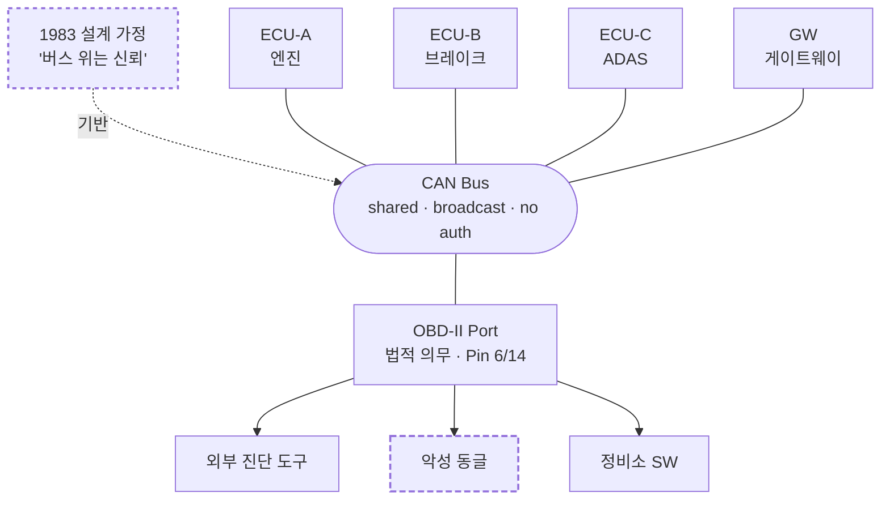
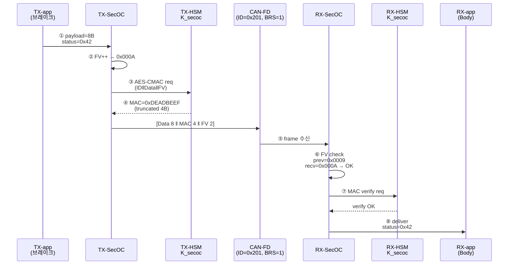
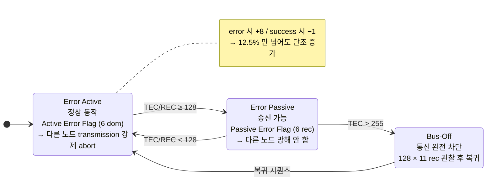
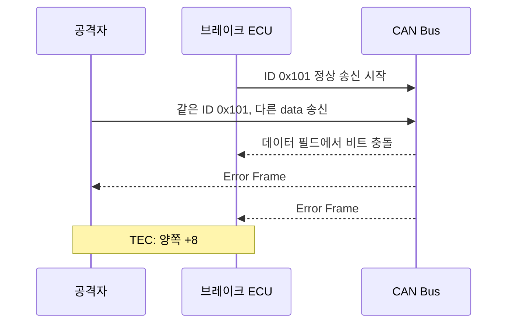
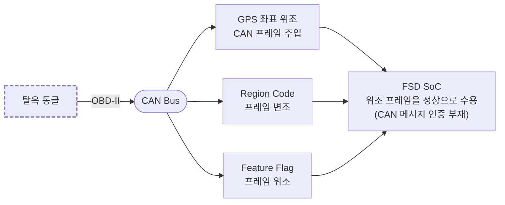
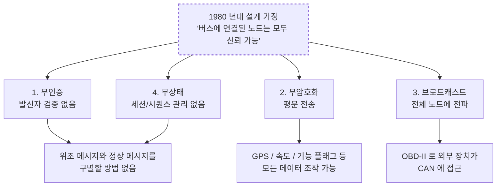

# Module 01 — CAN Bus Fundamentals

<!-- DV-SKOOL-CH-CTX:start -->
<div class="chapter-context" data-cat="soc">
  <a class="chapter-back" href="../">
    <span class="chapter-back-arrow">←</span>
    <span class="chapter-back-icon">🚗</span>
    <span class="chapter-back-text">Automotive Cybersec</span>
  </a>
  <span class="chapter-divider">›</span>
  <span class="chapter-marker">Module 01</span>
</div>
<!-- DV-SKOOL-CH-CTX:end -->

<!-- DV-SKOOL-CH-TOC:start -->
<div class="page-toc">
  <span class="page-toc-label">목차</span>
  <a class="page-toc-link" href="#1-why-care-이-모듈이-왜-필요한가">1. Why care?</a>
  <a class="page-toc-link" href="#2-intuition-비유와-한-장-그림">2. Intuition</a>
  <a class="page-toc-link" href="#3-작은-예-secoc-적용-can-fd-1-프레임-인증-사이클">3. 작은 예 — SecOC 1 프레임 인증 사이클</a>
  <a class="page-toc-link" href="#4-일반화-can-프레임-arbitration-error-counter">4. 일반화 — Frame · Arbitration · Error Counter</a>
  <a class="page-toc-link" href="#5-디테일-진화-비교-bus-off-obd-ii-ethernet-비교">5. 디테일</a>
  <a class="page-toc-link" href="#6-흔한-오해-와-dv-디버그-체크리스트">6. 흔한 오해 + DV 디버그 체크리스트</a>
  <a class="page-toc-link" href="#7-핵심-정리-key-takeaways">7. 핵심 정리</a>
</div>
<!-- DV-SKOOL-CH-TOC:end -->

!!! objective "학습 목표"
    이 모듈을 마치면:

    - **Diagram** CAN bus topology와 standard frame (SOF/ID/RTR/DLC/Data/CRC/ACK/EOF) 구조를 그릴 수 있다.
    - **Identify** CAN 의 네 가지 구조적 결함 (no auth / no encryption / broadcast / no state) 을 식별할 수 있다.
    - **Distinguish** CAN 2.0 / CAN-FD / CAN-XL 의 payload, BR, 보안 내장 여부를 구분할 수 있다.
    - **Trace** Bus-Off attack 한 사이클에서 TEC/REC 가 어떻게 비대칭 증가하여 victim ECU 를 격리하는지 추적할 수 있다.
    - **Apply** SecOC 의 Truncated MAC + Freshness Value 를 CAN-FD 64 B payload 위에 구성할 수 있다.

!!! info "사전 지식"
    - 직렬 통신 기본 (UART, differential signaling)
    - 자동차 ECU 와 OBD-II 포트의 일반 개념
    - AES / HMAC / MAC 등 대칭키 암호의 기본 직관

---

## 1. Why care? — 이 모듈이 왜 필요한가

### 1.1 시나리오 — 2015 Jeep Cherokee 해킹

2015 년, Charlie Miller 와 Chris Valasek 가 **달리는 Jeep Cherokee 를 원격으로 해킹**. 그들은:

1. **Uconnect 인포테인먼트 시스템** 의 cellular modem 으로 진입 (인터넷에서 직접).
2. 인포테인먼트 칩의 ARM CPU 의 _firmware_ 를 다시 flash.
3. 인포테인먼트가 CAN bus 의 _gateway_ 역할 → **CAN bus 에 임의 메시지 송신 가능**.
4. CAN 으로 _스티어링 / 브레이크 / 가속_ 메시지 위조 → 차량 _원격 조종_.

Chrysler 가 **140만 대 리콜** — 차량 사이버보안의 분수령.

**왜 가능했나?** **CAN bus 는 1983 년 폐쇄 네트워크 가정으로 설계** — 모든 메시지가:
- **인증 없음**: 누가 보냈는지 _표시조차_ 없음. 모든 ECU 가 _임의 메시지 ID_ 보낼 수 있음.
- **암호화 없음**: 평문 그대로.
- **세션 없음**: replay attack 가능.

이 모든 게 _"버스에 꽂힌 모든 ECU 는 신뢰 가능"_ 가정 위에서 안전. 그 가정이 _OBD-II port + 인포테인먼트 + 텔레매틱스 + V2X_ 로 깨지자 모든 보안 가정이 무너짐.

이후 모든 차량 보안 모듈은 한 사실에서 출발합니다 — **"CAN bus 는 1983 년 폐쇄 네트워크 가정으로 설계되었고, 인증 / 암호화 / 세션 / 발신자 식별이 모두 없다"**. 이 한 가정이 깨지는 순간 (OBD-II / 텔레매틱스 / V2X) 부터 차량 내부 통신은 _기본적으로 모든 메시지가 위조 가능_ 한 채널이 됩니다.

이 모듈을 건너뛰면 이후 SecOC, HSM, Gateway, Tesla FSD 탈옥이 _"왜 이런 보안 계층을 추가해야 하는가"_ 를 잃은 채 단순 외워야 할 박스로 보이게 됩니다. 반대로 CAN 의 결함을 정확히 잡으면 다음 모듈의 모든 보안 메커니즘이 **이 결함의 어느 면을 보강하는가** 로 자연스럽게 이어집니다.

!!! question "🤔 잠깐 — CAN bus 를 _완전히 교체_ 못 하나?"
    Ethernet 으로 가면 표준 IT 보안 (TLS, IPsec) 적용 가능. _왜 자동차는 아직 CAN_?

    ??? success "정답"
        **레거시 + 안전성 + 비용**.

        - **레거시**: 한 차에 _수십 ECU_, 모두 CAN 인터페이스. 한 번에 바꿀 수 없음.
        - **안전성 인증**: ISO 26262 의 ASIL-D (Automotive Safety Integrity Level) 인증된 CAN MAC IP 가 _수십 년 검증됨_. Ethernet 의 같은 인증은 _신생_.
        - **결정성**: CAN 은 _priority-based arbitration_ 으로 _하드 실시간_ 보장 (가장 높은 priority 메시지가 즉시). 일반 Ethernet 은 _ best-effort_.
        - **비용**: CAN transceiver = $0.5, Ethernet PHY = $5-10. 100 ECU 면 _수백 USD_ 차이.

        해법: **Ethernet + CAN 공존** — backbone 은 Ethernet, edge 는 CAN. 그래서 _CAN 보안_ 이 _아직 critical_.

---

## 2. Intuition — 비유와 한 장 그림

!!! tip "💡 한 줄 비유"
    **CAN Bus** ≈ **1980 년대 사내 인터컴**. 모두 같은 회선에 연결돼 있고, 누가 마이크를 잡았는지 표시되지 않으며, 회선 자체에 자물쇠가 없음. _버스에 꽂힌 사람은 모두 신뢰_ 한다는 가정 위에서만 안전합니다 — 외부인이 인터콤 잭에 접근하는 순간 (OBD-II) 가정이 깨집니다.

### 한 장 그림 — CAN Bus 와 외부 진입점



ECU 4 대가 동일한 wired-AND 버스를 공유하고, **OBD-II 포트가 그 버스에 직결** 됩니다. 외부 장치가 어떤 ID 로도 메시지를 송신할 수 있고, 모든 ECU 가 그 메시지를 수신·처리합니다 — 발신자가 누군지 _구별할 방법이 프로토콜 내부에 없음_.

### 왜 이렇게 설계됐는가 — Design rationale

1983 년 자동차 ECU 는 5–10 개, 외부 연결 없음, 위협 모델에 "차량 해킹" 이 존재하지 않았습니다. 설계 목표는 **(a) 배선 비용 절감, (b) 실시간 결정성, (c) 노이즈 내성**. 인증 / 암호화는 (1) ECU 연산 부담 ↑, (2) latency ↑, (3) 8-byte payload 압박 — 셋 다 위 목표와 정면 충돌. 그래서 _합리적으로 빠진 것_ 이지, 빠뜨린 것이 아닙니다.

→ 즉 CAN 보안 결함은 _설계 결함_ 이 아니라 **설계 가정의 변화** 입니다. OBD-II (1996) → 텔레매틱스 (2000s) → V2X (2010s) 가 폐쇄 가정을 단계적으로 무너뜨렸고, 그 차이를 메우는 것이 SecOC / HSM / Gateway 입니다.

---

## 3. 작은 예 — SecOC 적용 CAN-FD 1 프레임 인증 사이클

가장 단순한 시나리오. 노드 **TX-ECU** 가 brake-status 메시지를 노드 **RX-ECU** 에게 SecOC 로 인증해서 전송합니다. CAN-FD 64 B payload 한 프레임.



| Step | 누가 | 무엇을 | 왜 |
|---|---|---|---|
| ① | TX app | 8 B brake-status payload 생성 | 어플리케이션 layer |
| ② | TX SecOC | Freshness Value (counter) 1 증가 → `0x000A` | replay 방어 — 같은 payload 라도 FV 가 매번 다름 |
| ③ | TX SecOC | HSM 에 `Cmac(K_secoc, ID‖Data‖FV)` 요청 | 키는 HSM 외부로 절대 안 나감 |
| ④ | HSM | 16 B CMAC 계산 → 상위 4 B 만 truncated MAC 으로 반환 | 64 B CAN-FD payload 안에 들어가야 함 |
| ⑤ | CAN-FD bus | `[Data 8 ‖ MAC 4 ‖ FV 2]` = 14 B payload 송신 | 64 B 중 14 B 사용, 나머지는 0 padding |
| ⑥ | RX SecOC | 수신 FV 가 _이전 FV 보다 큰지_ 그리고 _허용 window 안인지_ 검사 | replay (옛 FV) / 미래 jump (sync 깨짐) 모두 차단 |
| ⑦ | RX SecOC | HSM 에 `Cmac_verify(K_secoc, ID‖Data‖FV, MAC)` 요청 | 4 B truncated 비교, mismatch 면 폐기 |
| ⑧ | RX app | 인증 통과 후 brake-status=0x42 수신 | end-to-end 인증된 메시지 |

```c
// Step ③ 의 전형적 SecOC TX path (의사 코드, AUTOSAR 스타일)
SecOC_FreshnessValue_t fv = SecOC_GetFreshness(secoc_id);  // 카운터 증가
uint8_t  data_to_auth[16];
memcpy(data_to_auth + 0,  &can_id,  4);
memcpy(data_to_auth + 4,  payload,  8);
memcpy(data_to_auth + 12, &fv,      2);

uint8_t mac_full[16];
Csm_MacGenerate(K_SECOC_HANDLE, data_to_auth, 14, mac_full);  // → HSM
uint8_t mac_trunc[4];
memcpy(mac_trunc, mac_full, 4);                                // 32-bit truncation

// Secured PDU = data ‖ trunc_mac ‖ fv
PduR_CanIfTransmit(secured_pdu);
```

!!! note "여기서 잡아야 할 두 가지"
    **(1) MAC 키는 HSM 밖으로 절대 안 나간다** — TX/RX 양쪽 모두 _연산 결과_ 만 받는다. 이것이 SecOC 가 단순 SW HMAC 과 다른 이유 (Module 02 의 HSM 으로 연결).<br>
    **(2) FV 가 없으면 MAC 만으로는 의미가 없다** — replay 가 그대로 통과. 따라서 SecOC = MAC + FV 의 _쌍_ 이며, FV 동기화 실패가 가장 흔한 첫 시뮬 실패 원인.

---

## 4. 일반화 — CAN Frame · Arbitration · Error Counter

### 4.1 Standard CAN (CAN 2.0A) 프레임 — 보안 필드의 부재

```
+-----+----+-----+---+------+------+-----+-----+----+-----+
| SOF | ID | RTR |IDE| DLC  | Data | CRC | ACK | EOF| IFS |
| 1b  |11b | 1b  |1b | 4b   |0-8B  | 15b | 2b  | 7b | 3b  |
+-----+----+-----+---+------+------+-----+-----+----+-----+
        ^                     ^
        |                     |
   Arbitration ID         Payload
   (우선순위 결정)        (실제 데이터)

※ 보안 필드 없음 — 발신자 ID, MAC, FV, 암호화 키 ID, 어느 것도 없음
```

| 필드 | 보안 관점 의미 |
|---|---|
| **Arbitration ID (11b)** | 발신자 식별 X — _메시지 우선순위만_ 결정. 누구든 같은 ID 로 송신 가능. |
| **Data (0–8 B)** | 평문. 모든 노드가 read 가능. |
| **CRC (15b)** | 전송 오류 검출. 악의적 변조 탐지 X (공격자도 정상 CRC 계산 가능). |
| **ACK** | 수신 확인만 — _누가 보냈는지_ 와 무관. |

→ **네 가지 구조적 결함** 이 여기서 출발: (1) 무인증, (2) 무암호화, (3) 브로드캐스트, (4) 무상태 (세션 없음 → replay 무방비).

### 4.2 Arbitration — wired-AND 와 dominant/recessive

CAN 은 _비파괴적 우선순위 중재_ 를 사용합니다.

- Dominant `0` > Recessive `1` (wired-AND).
- 모든 노드가 자신이 보낸 비트와 bus 값을 비교 → 불일치 (1 보냈는데 0 관측) 시 즉시 송신 포기.
- 결과: **낮은 ID = 높은 우선순위** + 충돌 없는 결정적 중재.

```
ECU-A: ID=0x100=000_1000_0000   ECU-B: ID=0x130=000_1001_0011_0000
                                ECU-C: ID=0x200=000_1010_0000_0000

bit    A   B   C   bus     판정
10     0   0   0    0      모두 진행
 9     0   0   1    0      C 패배 (1 송신, bus=0)
 8     0   0   -    0      A,B 진행
 ...
 4     0   1   -    0      B 패배
 ...                       → A 승리
```

**보안 함의**: 공격자가 ID = `0x000` 으로 송신하면 항상 우선순위 승리 → DoS via 우선순위 하이재킹.

### 4.3 Error State Machine — Bus-Off attack 의 기반

각 ECU 는 **TEC** (Transmit Error Counter), **REC** (Receive Error Counter) 두 카운터를 유지하고 세 상태를 오갑니다.



**핵심 비대칭**: error 시 +8, success 시 -1 → **에러 비율이 12.5 % 만 넘어도 카운터 단조 증가**. 이 비대칭이 Bus-Off attack 의 수학적 기반입니다.

---

## 5. 디테일 — 진화 / 비교 / Bus-Off / OBD-II / Ethernet 비교

### 5.1 CAN 탄생 배경

| 항목 | 내용 |
|---|---|
| **설계 시기** | 1983 년 (Robert Bosch GmbH) |
| **표준화** | ISO 11898 (1993) |
| **원래 목적** | ECU 간 저비용·내잡음 통신 — 배선 수 감소 |
| **설계 가정** | 물리적으로 폐쇄된 네트워크, 모든 노드는 신뢰 가능 |
| **보안 고려** | **없음** — 1980 년대 위협 모델에 차량 해킹 부재 |

### 5.2 CAN 프로토콜 진화 — 2.0 / FD / XL

| | CAN 2.0 | CAN-FD | CAN-XL |
|--|---------|--------|--------|
| **최대 속도** | 1 Mbps | 8 Mbps (data phase) | 20 Mbps |
| **Payload** | 8 B | 64 B | 2048 B |
| **ID 비트** | 11 / 29 | 11 / 29 | 11 / 29 |
| **보안** | ❌ 없음 | ❌ 없음 | ✅ CANsec (Layer 2) |
| **인증** | ❌ | ❌ (SecOC 로 상위 계층 추가) | ✅ (프로토콜 내장) |
| **암호화** | ❌ | ❌ | ✅ (AES-GCM / AES-CCM) |
| **표준** | ISO 11898-1 | ISO 11898-1:2015 | CiA 610-3 |

### 5.3 CAN-FD 프레임 — payload 확장으로 SecOC 가 가능해진 지점

```
CAN-FD 프레임:
+-----+----+-----+---+-----+------+--------+-----+-----+
| SOF | ID | ... |BRS| DLC | Data |  CRC   | ACK | EOF |
|     |    |     |   |     | 0-64B| 17/21b |     |     |
+-----+----+-----+---+-----+------+--------+-----+-----+
                   ^
                   |
          Bit Rate Switch — data phase 속도 증가
          → 64 B payload 안에 SecOC 의 [Data | MAC | FV] 패킹 가능
```

**CAN-FD + SecOC**: 64 B 중 일부를 truncated MAC (4–8 B) + FV (2–4 B) 에 할당. 단, SecOC 는 _프로토콜이 아닌 어플리케이션 레벨 추가_ — 모든 ECU 가 SecOC 를 지원해야만 의미가 있습니다.

### 5.4 CAN-XL CANsec — 프로토콜 레벨 보안

```
CAN-XL 프레임 (CANsec 활성):
+-----+----+------+----------------------------+------+-----+
| SOF | ID | HDR  |    Encrypted Data           | AUTH | EOF |
|     |    |      |    + Integrity Tag           | TAG  |     |
+-----+----+------+----------------------------+------+-----+
                    ^                            ^
                    |                            |
              AES-GCM/CCM 암호화             인증 태그
              → 도청 불가                    → 위조 불가

CANsec = CAN-XL 의 Layer 2 보안
  - AES-128 / 256 GCM 또는 AES-CCM
  - 프레임 단위 암호화 + 인증
  - Freshness Value 로 replay 방어
  - 키 관리: HSM + 초기 키 교환
```

### 5.5 Error Counter 변화 규칙

| 이벤트 | TEC 변화 | REC 변화 |
|---|---|---|
| 송신 에러 감지 | **+8** | — |
| 수신 에러 감지 | — | **+1** |
| 수신 에러 (첫 감지자, Active Error Flag 송출) | — | **+8** |
| 성공적 송/수신 | **−1** | **−1** |
| Bus-Off 복귀 | 0 으로 리셋 | 0 으로 리셋 |

### 5.6 Bus-Off attack 시나리오 (dry-run)

**공격 목표**: 브레이크 ECU(ID `0x101`) 을 Bus-Off 로 만들기

**Step 1 — 타겟 프레임 식별**: 브레이크 ECU 가 ID `0x101` 로 주기적(20 ms) 송신함을 sniffing 으로 확인.

**Step 2 — 동시 송신으로 비트 충돌 유발**:



**Step 3 — 비대칭 누적**:

- 공격자: 충돌 후 곧바로 정상 프레임 성공 송신 → TEC −1
- 브레이크 ECU: 재시도 → 공격자가 또 충돌 → TEC +8

반복 32 회 후:

- 공격자 TEC: ~32 (안정)
- 브레이크 ECU TEC: 256 → **Bus-Off**

**Step 4 — 결과**: 브레이크 ECU 가 CAN Bus 에서 격리. 차량은 브레이크 상태 메시지를 수신할 수 없음 → 안전 임계 기능 상실.

→ CAN 자체에 이 공격에 대한 프로토콜 레벨 방어 **없음**. Gateway 의 Rate Limiting + IDS 의 error-frame burst 모니터링이 필수 보강.

### 5.7 Arbitration 의 보안 함의 표

| 문제 | 설명 |
|---|---|
| **우선순위 하이재킹** | 공격자가 ID = `0x000` 으로 송신 → 모든 정상 ECU 를 항상 이김 |
| **DoS via 중재** | 최고 우선순위 ID 를 burst 송신 → 다른 ECU 는 영원히 중재 패배 |
| **ID 충돌 → Bus-Off** | 정상 ECU 와 같은 ID 로 다른 데이터 송신 → 비트 충돌 → error frame → §5.6 |

### 5.8 OBD-II — 공격의 물리적 진입점

```
운전석 하단 (법적 의무 장착)
        │
+-------v-------+
|  OBD-II Port  |  ← 16 핀 커넥터 (SAE J1962)
|               |
|  Pin 6:  CAN-H |  ← CAN Bus 직결
|  Pin 14: CAN-L |
|  Pin 16: +12V  |
|  Pin 4/5: GND  |
+----------------+
        │
        ▼
   CAN Bus 전체에 접근 가능
```

| 원래 목적 | 보안 문제 |
|---|---|
| 배기가스 진단 (미국 EPA, 1996~) | **인증 없이** CAN Bus 물리 접근 가능 |
| 정비소 고장 진단 | 읽기 + **쓰기 (injection) 도** 가능 |
| 차량 검사 | 방화벽/게이트웨이 없는 차량은 전체 도메인 접근 |

#### Tesla FSD 탈옥에서의 역할 (Module 03 미리보기)



### 5.9 구조적 취약점 요약 — 한 장



### 5.10 Automotive Ethernet 과의 비교

| | CAN / CAN-FD | Automotive Ethernet |
|--|---|---|
| **토폴로지** | 버스 (브로드캐스트) | 스위치 기반 (유니캐스트) |
| **속도** | 1–8 Mbps | 100 Mbps – 10 Gbps |
| **보안** | 프로토콜 자체 없음 | MACsec (802.1AE), TLS |
| **격리** | 물리적 격리 어려움 | VLAN, 스위치 ACL |
| **용도** | ECU 제어, 센서 | ADAS, 카메라, 인포테인먼트 |
| **비용** | 매우 저렴 | 상대적으로 높음 |

→ CAN 은 사라지지 않습니다 — 수십 년 레거시, 낮은 비용, 실시간 결정성. 보안은 **SoC 레벨 (HSM + SecOC + Gateway)** 에서 추가하는 것이 현실적 접근.

---

## 6. 흔한 오해 와 DV 디버그 체크리스트

### 흔한 오해

!!! danger "❓ 오해 1 — 'CAN 에 암호화만 추가하면 보안 끝'"
    **실제**: 암호화 ≠ 인증. CAN 에 빠진 핵심은 _누가 보냈는지_ 검증 (= 인증) 입니다. 암호화는 **기밀성** (도청 방지), 인증은 **무결성/신원** (위조 방지) — 두 목표가 다릅니다. SecOC 는 _인증을 추가_ 하고, 암호화는 옵션. <br>
    **왜 헷갈리는가**: "crypto = security" 라는 단순화. CIA (Confidentiality / Integrity / Availability) 를 별개로 사고해야 합니다.

!!! danger "❓ 오해 2 — 'Arbitration ID 가 발신자를 식별한다'"
    **실제**: Arbitration ID 는 _메시지의 우선순위_ 를 결정할 뿐, 발신자 식별과 무관합니다. 누구든 같은 ID 로 송신 가능 — 그래서 spoofing 이 trivial 합니다. <br>
    **왜 헷갈리는가**: "ID = identifier" 라는 영어 단어 직관. CAN 에서 ID 는 _메시지 ID_ 이지 _노드 ID_ 가 아닙니다.

!!! danger "❓ 오해 3 — 'CAN-FD 가 보안 문제를 해결한다'"
    **실제**: CAN-FD 는 _대역폭_ 을 해결했지 _보안_ 을 해결하지 않습니다. 64 B payload 가 SecOC MAC 의 _공간을 마련_ 했을 뿐이고, SecOC 자체는 별도 어플리케이션 레벨 적용이 필요합니다. 모든 ECU 가 SecOC 를 지원하지 않으면 보안 체인이 끊깁니다 (Module 02 의 레거시 혼재 시나리오). <br>
    **왜 헷갈리는가**: 마케팅이 "CAN-FD = 차세대 + 안전" 으로 묶어서 제시.

!!! danger "❓ 오해 4 — 'Bus-Off 는 단순 fault, attack 이 아니다'"
    **실제**: Bus-Off 는 _정상적 fault recovery_ 메커니즘이지만, **TEC +8 / −1 비대칭** 을 악용하면 의도적 attack vector 가 됩니다. §5.6 의 시나리오 — 공격자는 success +1 / error +8 비율을 12.5 % 만 넘기면 victim 만 선택적으로 격리 가능. <br>
    **왜 헷갈리는가**: 표준 spec 이 "이건 fault 처리 메커니즘" 이라고만 기술.

!!! danger "❓ 오해 5 — 'CAN 보안은 OEM 의 무관심이다'"
    **실제**: 1983 년 설계 시점에 위협 모델이 달랐습니다 (폐쇄 네트워크). _설계 결함_ 이 아니라 _가정의 변화_ — OBD-II / 텔레매틱스 / V2X 가 가정을 무너뜨린 것. 책임은 _가정 변화에 맞춰 보안 layer 를 추가하지 못한_ OEM·Tier1 에 있지, CAN 자체의 결함이 아닙니다. <br>
    **왜 헷갈리는가**: 결과 (탈옥 발생) 만 보고 "처음부터 안전 무시" 로 단순화.

### DV 디버그 체크리스트 (CAN/SecOC 초기 시뮬에서 자주 보는 실패)

| 증상 | 1차 의심 | 어디 보나 |
|---|---|---|
| 정상 frame 인데 RX 가 거부 (SecOC) | FV mismatch (TX 가 +1, RX 도 +1, 그런데 prev 가 안 갱신됨) | RX SecOC 의 prev_FV 갱신 logic, NVM 저장 시점 |
| MAC verify 실패가 _모든_ 메시지 | 키 mismatch (TX/RX 가 다른 key handle) | HSM key slot ID, SecOC config 의 Csm key reference |
| RX 가 _첫 부팅 직후만_ 거부 | Cold-start FV 미동기 | Freshness Manager 부팅 순서, sync broadcast 도착 전에 frame 수신했나 |
| Frame 이 wire 에 안 나타남 | Arbitration loss → 지속 retry → TEC 증가 | 같은 ID 충돌, 더 높은 우선순위 burst |
| Victim ECU 가 갑자기 통신 두절 | Bus-Off (TEC > 255) | error frame burst 직전 패턴, TEC trace |
| OBD scan tool 은 답하는데 SecOC ECU 는 무응답 | Gateway whitelist 가 0x7DF/0x7Ex 만 허용 | Gateway 라우팅 표, OBD 도메인 격리 정책 |
| 동일 ID 가 2 개 source 에서 송신 | Spoofing 또는 듀얼 redundant 설계 | DBC 의 sender 매핑, sniff 로 시간차 확인 |
| Truncated MAC collision 의심 | 4 B MAC = 2^32 — brute force 가능성 | MAC 길이 정책, FV 동시 사용 여부 |

이 체크리스트는 Module 02 의 SecOC 실패 패턴, Module 04 의 IDS 룰 설계로 직접 이어집니다.

---

## 7. 핵심 정리 (Key Takeaways)

- **CAN = 1983 broadcast 직렬 버스**, 4 가지 구조적 결함 (무인증 / 무암호화 / 브로드캐스트 / 무상태) — 이후 모든 차량 보안 layer 의 출발점.
- **Frame**: SOF + ID + DLC + Data (0–8 B) + CRC + ACK + EOF — _보안 필드 없음_. ID 는 발신자가 아닌 _메시지 우선순위_.
- **진화**: CAN 2.0 (8 B) → CAN-FD (64 B, SecOC 가능) → CAN-XL (CANsec 내장).
- **SecOC**: AUTOSAR layer — `Data | Truncated MAC (4–8 B) | FV (2–4 B)`. HSM 키 + Freshness 가 _쌍_ 으로 동작해야 의미 있음.
- **Bus-Off attack**: TEC +8/−1 비대칭이 만든 attack vector. 프로토콜 레벨 방어 없음 → IDS + Rate Limiting 으로 보강.
- **OBD-II = 합법적 진입점** — 법적 의무 장착이라 막을 수 없음. Gateway 격리가 유일한 현실적 통제.

!!! warning "실무 주의점 — OBD-II 포트는 항상 열려있다"
    **현상**: OBD-II 포트에 진단 장비를 연결하면 SecOC 가 적용된 ECU 조차 raw CAN 메시지를 그대로 수신하며, 임의 ID 로 메시지를 주입할 수 있다.

    **원인**: OBD-II 는 법적 의무로 항상 접근 가능해야 하므로, Gateway 가 진단 포트 트래픽을 화이트리스트에서 예외 처리하는 구현이 흔하다.

    **점검 포인트**: Gateway 화이트리스트에서 `0x7DF` (OBD broadcast), `0x7E0~0x7EF` (ECU 진단 주소) 범위가 내부 도메인으로 무조건 포워딩되는지 확인. 진단 세션 활성화 없이 기능 제어 메시지 (예: 조향, 제동) 가 통과되면 즉시 차단 규칙 추가 필요.

### 7.1 자가 점검

!!! question "🤔 Q1 — CAN 4 결함 매핑 (Bloom: Analyze)"
    SecOC 가 CAN 4 결함 (무인증/무암호화/브로드캐스트/무상태) 중 _어느 것_ 을 _어떻게_ 보강하는가?

    ??? success "정답"
        - **무인증**: SecOC 의 MAC (truncated 4-8 B) 으로 _발신자 인증_. HSM 키 보유한 ECU 만 valid MAC 생성.
        - **무상태**: Freshness Value (FV, 2-4 B counter) 로 _replay 방지_ — 같은 메시지 재전송 시 FV 가 outdated → 거부.
        - **무암호화**: 보강 _안 됨_. SecOC 은 _인증_ 만, _기밀_ 은 아님. 메시지 내용은 여전히 평문.
        - **브로드캐스트**: 보강 _안 됨_. CANsec (CAN-XL) 이 다룸.

        즉 SecOC = 인증 + replay 만. 다른 결함은 _상위 layer_ (gateway, IDS) 가 보강.

!!! question "🤔 Q2 — Bus-off attack 방어 (Bloom: Apply)"
    Attacker 가 _victim ECU_ 의 메시지를 _의도적 error_ 로 만들어 TEC 폭주시킴 → victim 이 bus-off → 도로에서 _브레이크 ECU 차단_. 어떻게 방어?

    ??? success "정답"
        Protocol 레벨 _불가능_ — CAN spec 의 _기본 동작_.

        해법:
        - **IDS (Intrusion Detection System)**: error frame 의 _패턴_ (특정 ID 만 fail) 감지 → 알람.
        - **Rate Limiting**: error frame 의 burst 가 _threshold_ 넘으면 게이트웨이가 차단.
        - **Redundancy**: critical ECU (브레이크) 는 _2 개 ECU_ + 다른 bus → 한 쪽 bus-off 되도 운영.
        - **CAN-FD/XL**: 새로운 spec 에서 _bus-off 방어_ 메커니즘 (예: error confinement 개선).

### 7.2 출처

**Internal (Confluence)**
- (CAN 관련 사내 문서 — 없으면 ISO 11898)

**External**
- ISO 11898 *Road vehicles — Controller area network*
- ISO/SAE 21434 *Road vehicles — Cybersecurity engineering*
- AUTOSAR *Specification of Secure Onboard Communication* (SecOC)
- *Remote Exploitation of an Unaltered Passenger Vehicle* — Miller & Valasek, BlackHat 2015 (Jeep 해킹)
- *Surviving the Sec0C: Bus-Off Attack* — Cho et al., 2016

---

## 다음 모듈

→ [Module 02 — Automotive SoC Security](02_automotive_soc_security.md): CAN 의 결함 위에 HSM / SecOC / Gateway / IDS / TEE 가 어떻게 layer 로 쌓이는지.

[퀴즈 풀어보기 →](quiz/01_can_bus_fundamentals_quiz.md)

<div class="chapter-nav">
  <a class="nav-prev" href="../">
    <div class="nav-label">◀ 이전</div>
    <div class="nav-title">코스 홈</div>
  </a>
  <a class="nav-next" href="../02_automotive_soc_security/">
    <div class="nav-label">다음 ▶</div>
    <div class="nav-title">Automotive SoC Security (차량 SoC 보안 아키텍처)</div>
  </a>
</div>


--8<-- "abbreviations.md"
