# Module 02 — Automotive SoC Security

<!-- DV-SKOOL-CH-CTX:start -->
<div class="chapter-context" data-cat="soc">
  <a class="chapter-back" href="../">
    <span class="chapter-back-arrow">←</span>
    <span class="chapter-back-icon">🚗</span>
    <span class="chapter-back-text">Automotive Cybersec</span>
  </a>
  <span class="chapter-divider">›</span>
  <span class="chapter-marker">Module 02</span>
</div>
<!-- DV-SKOOL-CH-CTX:end -->

<!-- DV-SKOOL-CH-TOC:start -->
<div class="page-toc">
  <span class="page-toc-label">목차</span>
  <a class="page-toc-link" href="#1-why-care-이-모듈이-왜-필요한가">1. Why care?</a>
  <a class="page-toc-link" href="#2-intuition-비유와-한-장-그림">2. Intuition</a>
  <a class="page-toc-link" href="#3-작은-예-hsm-키-주입-1-사이클-factory-provisioning">3. 작은 예 — HSM 키 주입 1 사이클</a>
  <a class="page-toc-link" href="#4-일반화-5-layer-방어-스택과-구성-요소">4. 일반화 — 5-Layer 방어 스택</a>
  <a class="page-toc-link" href="#5-디테일-hsm-secoc-gateway-tee-autosar-stack">5. 디테일</a>
  <a class="page-toc-link" href="#6-흔한-오해-와-dv-디버그-체크리스트">6. 흔한 오해 + DV 디버그 체크리스트</a>
  <a class="page-toc-link" href="#7-핵심-정리-key-takeaways">7. 핵심 정리</a>
</div>
<!-- DV-SKOOL-CH-TOC:end -->

!!! objective "학습 목표"
    이 모듈을 마치면:

    - **Define** HSM / SecOC / Secure Gateway / TEE / IDS 의 역할과 차이를 정의할 수 있다.
    - **Explain** CAN 자체로는 안전하지 않고 SoC 레벨 다층 방어가 왜 필수인지 설명할 수 있다.
    - **Apply** HSM 키 계층 (Root → Master → Session) 을 ECU 부팅 / 런타임 / 폐기 라이프사이클에 적용할 수 있다.
    - **Analyze** SecOC 의 MAC + FV 메커니즘이 막아주는 공격과 막지 못하는 공격을 분석할 수 있다.
    - **Evaluate** Central Gateway vs Zonal Architecture 의 장단점을 평가하고 자기 시스템에 매핑할 수 있다.

!!! info "사전 지식"
    - [Module 01 — CAN Bus Fundamentals](01_can_bus_fundamentals.md) (CAN 4 결함, SecOC 1 사이클)
    - Secure Boot, Root of Trust, AES / HMAC / CMAC 의 기본 직관
    - ECU 와 Gateway 가 차량 네트워크에서 어떤 역할을 하는지에 대한 큰 그림

---

## 1. Why care? — 이 모듈이 왜 필요한가

CAN 자체는 보안 빈 깡통입니다 (Module 01). 그래서 _모든 보안 메커니즘은 SoC + ECU + Gateway 레벨의 추가 layer 로_ 구현됩니다 — HSM 이 키를 보호하지 못하거나 SecOC 가 빠지면 한 노드 침해가 곧 차량 전체 침해. 이 모듈은 **"프로토콜 위에 어떤 보안 스택을 올려야 하는가"** 의 아키텍처 사고를 다루며, Module 03 (Tesla 사례 — _이 스택 중 한 layer 가 빠졌을 때 무엇이 무너지는가_) 의 직접 전제입니다.

이 모듈을 건너뛰면 Tesla 탈옥 분석이 _"Tesla 가 보안을 안 한 이야기"_ 로 단순화됩니다. 반대로 5-layer 스택을 잡고 가면, 탈옥 사례가 _"L1 (Boot) 과 L5 (Cloud) 는 강했지만 L2 (Communication) 가 비어 있었던 결과"_ 로 정확히 분해됩니다.

---

## 2. Intuition — 비유와 한 장 그림

!!! tip "💡 한 줄 비유"
    **차량 SoC 보안 스택** ≈ **4 단 케이크**. 각 layer 가 다른 attack 을 차단 — HSM = 키 봉인 (금고), SecOC = 메시지 인장 (송장), Gateway = 도메인 분리 (벽), IDS = 이상 감시 (CCTV). 한 layer 만으로는 부족 — 금고만 있고 벽이 없으면 누구나 들어와 금고 옆에 앉을 수 있습니다.

### 한 장 그림 — 5-Layer + Cloud

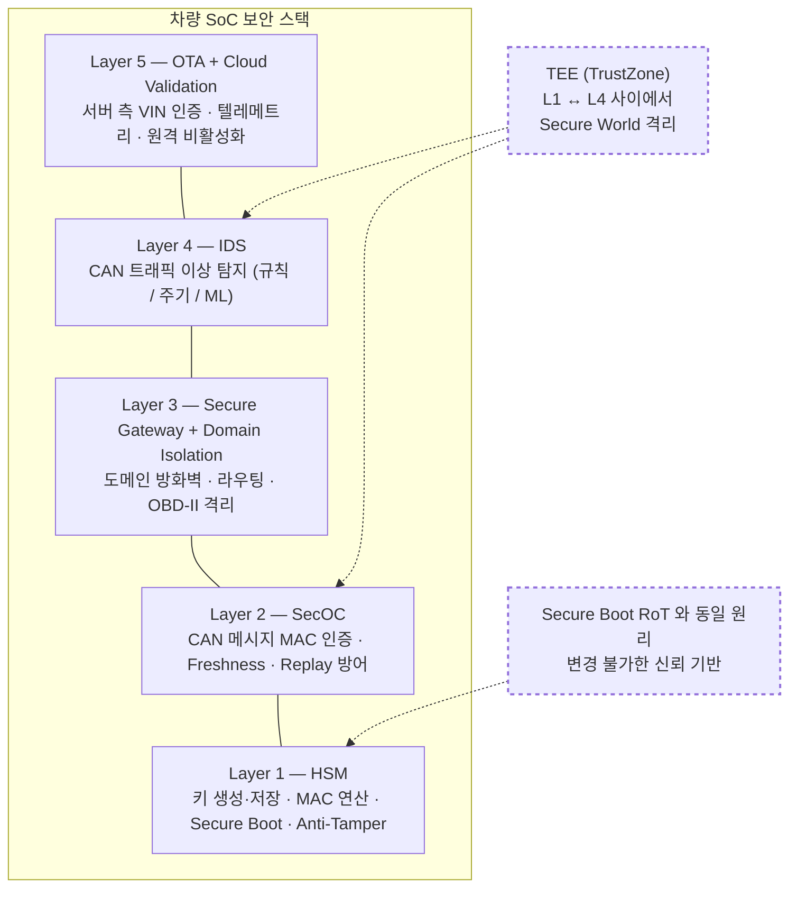

### 왜 이렇게 설계됐는가 — Design rationale

세 가지 요구가 동시에 풀려야 합니다.

1. **키는 SW 가 절대 만질 수 없어야** → HSM (격리된 코어 + Secure Key Store).
2. **모든 메시지는 origin 검증되어야** → SecOC (HSM 키로 MAC + FV).
3. **한 도메인이 침해돼도 다른 도메인은 안전해야** → Gateway (도메인 격리 + 화이트리스트).

이 셋이 **Secure Boot 의 (RoT + Chain of Trust + JTAG Lock) 의 통신 버전** 입니다. 부팅 체인이 BL1→BL2→BL3 모든 단계 서명 검증을 요구하듯, 통신 체인은 _모든 노드가 SecOC 에 참여_ 해야 의미가 있습니다.

---

## 3. 작은 예 — HSM 키 주입 1 사이클 (Factory Provisioning)

가장 단순한 시나리오. 새 ECU 가 OEM 공장 라인에 들어와 HSM 에 SecOC 마스터 키 `K_master` 가 주입되는 한 사이클을 끝까지 따라갑니다.

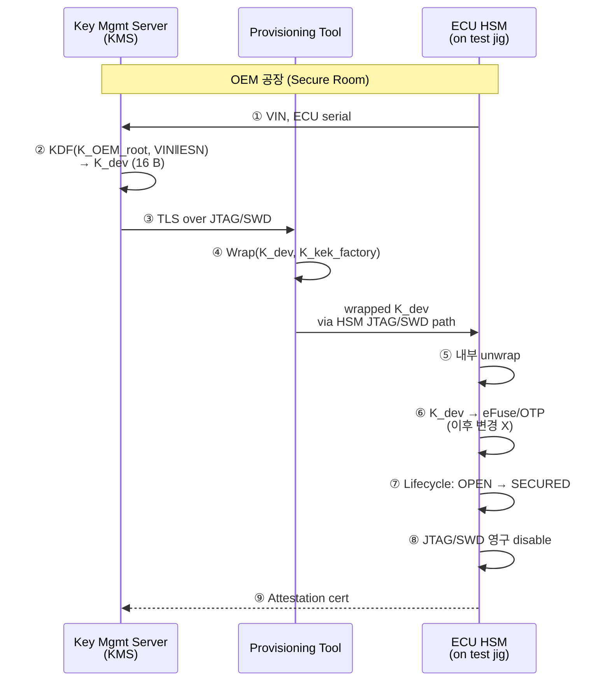

| Step | 누가 | 무엇을 | 왜 (보안 의미) |
|---|---|---|---|
| ① | KMS | ECU 의 VIN + Serial 수신 | 디바이스별 _고유_ 키 파생을 위함 |
| ② | KMS | `KDF(K_OEM_root, VIN ‖ ESN)` → `K_dev` 파생 | 한 디바이스 키 유출이 fleet 전체로 확산 안 됨 |
| ③ | KMS ↔ Tool | TLS over JTAG channel | 공장 내부 도청 방어 |
| ④ | Provisioning Tool | `K_dev` 를 `K_kek_factory` 로 wrap | 평문 키가 절대 wire 에 안 흐름 |
| ⑤ | HSM | 내부에서 unwrap (HSM 만 `K_kek_factory` 보유) | _Application Core 가 평문 K_dev 를 한 번도 보지 않음_ |
| ⑥ | HSM | `K_dev` 를 eFuse/OTP slot 에 burn | 이후 read 불가, write 불가 |
| ⑦ | HSM lifecycle | `OPEN → SECURED` 상태 전이 | 이후 외부 디버그 접근 거부 |
| ⑧ | Provisioning Tool | JTAG/SWD 핀을 eFuse 로 영구 disable | 출고 후 물리 접근으로도 키 추출 불가 |
| ⑨ | HSM → KMS | Attestation certificate 발급 | 클라우드 측에서 이 ECU 를 신뢰할 수 있는지 검증용 |

```c
// Step ⑥ 의 의사 코드 (HSM 내부)
hsm_status_t hsm_burn_efuse_key(uint8_t slot,
                                const uint8_t *wrapped_key,
                                size_t len) {
    if (lifecycle_state != HSM_LC_OPEN)        return HSM_E_LC;
    uint8_t plain[16];
    if (aes_unwrap(K_KEK_FACTORY, wrapped_key, len, plain) != OK)
        return HSM_E_WRAP;
    // 단 한 번만 — eFuse 는 OTP
    if (efuse_program(slot, plain, 16) != OK)  return HSM_E_EFUSE;
    // 평문 즉시 zeroize
    secure_memzero(plain, 16);
    return HSM_OK;
}
// 주의: plain 은 stack 에 잠시도 머무르지 않게, secure_memzero 후 함수 리턴
```

!!! note "여기서 잡아야 할 두 가지"
    **(1) 평문 키는 HSM 안에서만 존재한다** — KMS → wire → HSM 전 구간에서 _wrapped_ 형태. Application Core 도, JTAG dump 도, 평문 키를 한 번도 못 봅니다. 이것이 "HSM 이 있으면 SW 만으로는 키를 못 뽑는다" 의 정확한 의미.<br>
    **(2) Lifecycle 전이 (`OPEN → SECURED`) 와 JTAG fuse 가 함께 일어나야 한다** — 둘 중 하나만 하면 빈틈이 생깁니다. SECURED 인데 JTAG 살아 있으면 fault injection 으로 lifecycle 다운그레이드 가능, 반대도 마찬가지.

---

## 4. 일반화 — 5-Layer 방어 스택과 구성 요소

### 4.1 Layer 매핑 — 무엇이 어떤 attack 을 차단하는가

| Layer | 컴포넌트 | 차단 대상 attack | 한계 |
|---|---|---|---|
| **L1 Platform** | HSM, Secure Boot, Anti-Tamper | SW 키 추출, FW 위변조 | 물리 fault injection 은 별도 |
| **L2 Communication** | SecOC (CAN), MACsec (Eth) | CAN injection, replay, spoofing | 모든 노드가 참여해야 의미 |
| **L3 Network** | Gateway, Firewall, Rate Limit | 도메인 침투, DoS, OBD spillover | bypass 라우팅 발견 시 무력 |
| **L4 IDS** | 규칙 / 주기 / ML | 0-day, logic abuse, anomaly | 탐지일 뿐 차단 아님 |
| **L5 Cloud / OTA** | Code-sign, VIN bind, Telemetry | OTA hijack, fleet 위변조 | 오프라인 시 무력 |

### 4.2 HSM ↔ Secure Boot — 같은 원리의 두 화신

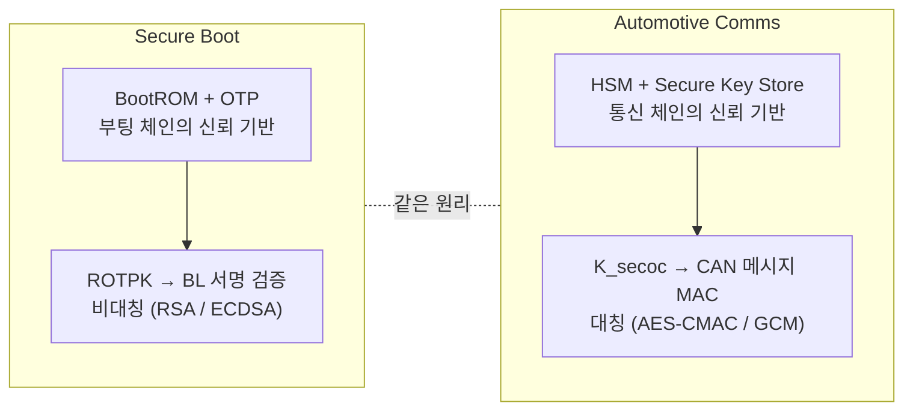

→ 부팅 체인이 BL1→BL2→BL3 모든 단계 검증을 요구하듯, 통신 체인 (SecOC) 도 _모든 노드가 동일 root 에서 파생된 키로 인증_ 해야 의미가 있습니다.

### 4.3 5-Layer 의 기본 데이터 흐름

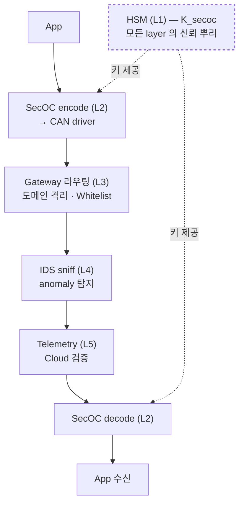

---

## 5. 디테일 — HSM / SecOC / Gateway / TEE / AUTOSAR Stack

### 5.1 HSM 구조

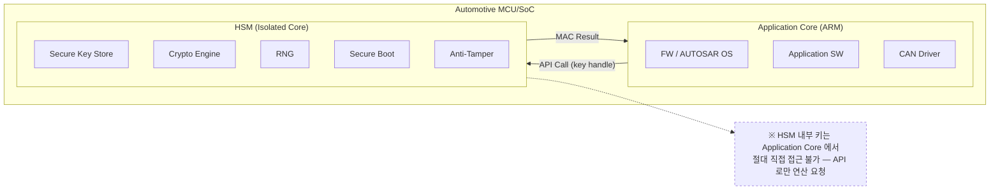

### 5.2 주요 Automotive HSM 칩 (시장 매핑)

| 벤더 | 제품군 | HSM 이름 | 특징 |
|---|---|---|---|
| **Infineon** | AURIX TC4x | HSM4 | SHE 2.0 호환, AES-128/256, ECC, Secure Debug |
| **NXP** | S32K3, S32G | HSE (Hardware Security Engine) | PKCS#11 인터페이스, 키 관리 내장 |
| **ST** | Stellar | HSM + SHE | EVITA Full 준수, 하드웨어 격리 |
| **Renesas** | RH850 / U2x | ICU-M (HSM) | ISO 21434 준수, 키 래더 |

### 5.3 HSM 키 프로비저닝 라이프사이클 — 4 phase

§3 의 작은 예가 phase 1 의 한 사이클이었습니다. 전체 라이프사이클은 4 phase:

**Phase 1 — 제조 시 키 주입 (Factory Provisioning)**: `KMS → KDF → wrapped key → HSM → eFuse/OTP burn`

- Device Unique Key, SecOC MAC Key, Secure Boot Key, Cert
- 주입 후 JTAG eFuse 로 영구 disable

**Phase 2 — 차량 출고 후 키 활성화**: `OEM 서버 ← TLS → 차량 TCU → HSM`

- VIN + ECU ID 로 활성화 토큰 요청
- HSM 이 토큰 검증 후 SecOC 키 활성화

**Phase 3 — 런타임 키 로테이션** (주기: 수천~수만 km 또는 시간 기반): `K_n → KDF (HSM 내부) 또는 OTA → K_{n+1}`

- 모든 ECU 동기 전환 명령
- Freshness Counter 리셋
- K_n 즉시 zeroize

**Phase 4 — 키 폐기 / 갱신**

- ECU 교체: 새 ECU 에 키 재주입 (정비소 보안 인증 필요)
- 키 유출 의심: OTA 긴급 로테이션
- 차량 폐차: HSM 키 영구 삭제 (Zeroization)

| 단계 | 보안 위협 | 대응 |
|---|---|---|
| 제조 시 | 키 주입 과정 도청/유출 | Secure Room + HSM 직접 통신 |
| 출고 후 | OTA 키 전송 가로채기 | TLS + 키 wrap |
| 런타임 | 키 로테이션 중 불일치 | 동기화 프로토콜 + 이전 키 grace period |
| 폐기 시 | 폐차 ECU 에서 키 추출 | Zeroization + Anti-Tamper |

### 5.4 SHE vs EVITA — 두 표준

| | SHE | EVITA Full |
|--|---|---|
| **키 슬롯** | 11 개 고정 | 가변 (수십~수백) |
| **알고리즘** | AES-128-CMAC only | AES, RSA, ECC, SHA |
| **비대칭키** | ❌ | ✅ |
| **용도** | 기본 CAN 인증 | 게이트웨이, ADAS, V2X |
| **비용** | 저렴 (수 mm² 추가) | 상대적으로 높음 |

### 5.5 SecOC — AUTOSAR CAN 메시지 인증

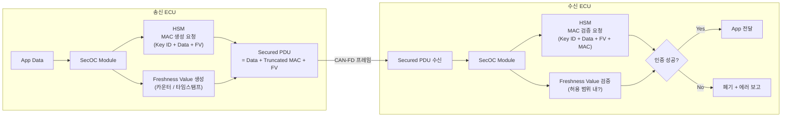

### 5.6 SecOC PDU 구조 + Truncated MAC 선택

```
기존 CAN 프레임 (8 B payload):
+------------------+
| Application Data |
| (8 bytes)        |
+------------------+
→ 인증 없음, 누구든 위조 가능

SecOC 적용 CAN-FD 프레임 (64 B payload):
+------------------+----------------+-----------+
| Application Data | Truncated MAC  | Freshness |
| (48-56 bytes)    | (4-8 bytes)    | (2-4 bytes)|
+------------------+----------------+-----------+
→ MAC: HSM 이 대칭키로 생성, 키 없이는 위조 불가
→ Freshness: 재전송 공격 (replay) 방어
```

| MAC 크기 | 보안 강도 | CAN-FD 데이터 여유 | 선택 이유 |
|---|---|---|---|
| 16 B (Full CMAC) | 2^128 | 48 B payload | 이론적 최대 — 대역폭 비효율 |
| **8 B (Truncated)** | **2^64** | **56 B payload** | **AUTOSAR 권장 — 보안 + 합리적 대역폭** |
| 4 B | 2^32 | 60 B payload | 최소 — 저위험 메시지용 |

### 5.7 Freshness Value 관리 방식

| 방식 | 동작 | 장점 | 단점 |
|---|---|---|---|
| **카운터 기반** | 송/수신 양쪽이 카운터 증가 | 간단, 동기화 용이 | 전원 Off 시 복구 필요 |
| **타임스탬프 기반** | 글로벌 시간 참조 | replay 윈도우 명확 | 시간 동기화 인프라 필요 |
| **Freshness Manager** | AUTOSAR FVM 이 중앙 관리 | 유연한 정책 | 복잡도 증가 |

### 5.8 SecOC 의 한계 — 4 가지 엣지 케이스

#### Edge case 1: Cold Start Problem

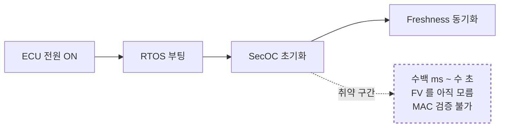

**대응 옵션:**

- **A) Authentication Build-Up** — 처음 N 개 메시지 인증 없이 수용 → 편의 O, 보안 X
- **B) Strict Mode** — 인증 전 모든 메시지 폐기 → 보안 O, 기능 X (안전 임계 메시지도 폐기)
- **C) FM 우선 부팅** — Freshness Manager ECU 가 최우선 부팅 후 sync 메시지 배포 → 현실적 타협, 단 FM 이 SPOF

#### Edge case 2: 키 로테이션 중 통신 중단

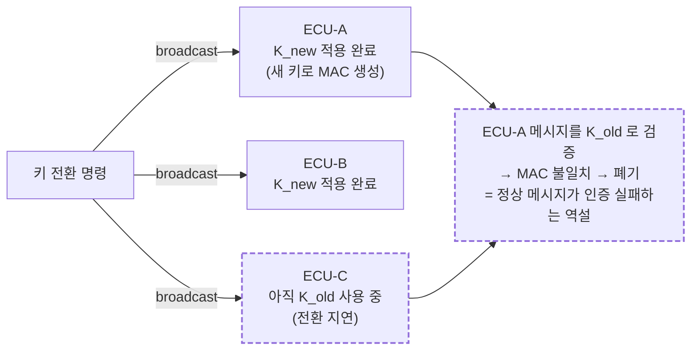

**대응 — Grace Period:**

- 전환 후 일정 시간 `K_old` 와 `K_new` 모두 유효
- 양쪽 키로 검증 시도 → 하나라도 성공하면 수용
- 트레이드오프: `K_old` 가 유출되면 grace period 동안 위험

#### Edge case 3: Mixed Network — 레거시 ECU 혼재

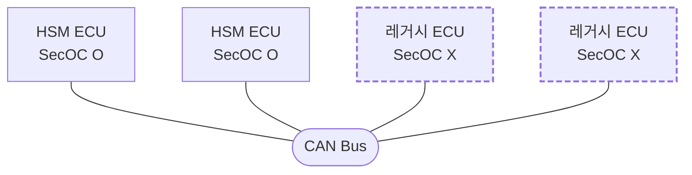

**문제:**

1. 레거시 ECU 는 MAC 필드를 데이터로 오인 → 오동작
2. 레거시 ECU 의 메시지는 MAC 없음 → 위조 구별 불가
3. SecOC 적용 범위가 부분적 → 체인의 가장 약한 고리

**대응:**

- Gateway 에서 도메인 분리 (SecOC / 레거시)
- Gateway 가 레거시 도메인 메시지의 MAC 을 대신 생성/검증 (Proxy SecOC)
- 장기적: 레거시 ECU 교체 (단, 차량 수명 15–20 년)

#### Edge case 4: Truncated MAC 의 보안 강도 한계

| 시나리오 | MAC 크기 | Brute-force | 위험 |
|---|---|---|---|
| 4 B MAC | 2^32 | 고속 CAN: ~43 억 frame ≈ 수 시간 | ★★★ 위험 |
| 8 B MAC | 2^64 | 현실적 불가능 | ★ 안전 |
| FV 없이 4 B | 2^32 | Replay 로 우회 가능 | ★★★★ 매우 위험 |

→ AUTOSAR 권장은 8 B MAC. 대역폭 압박으로 4 B 선택 시 _반드시_ FV 와 함께.

### 5.9 Tesla FSD 탈옥에 SecOC 가 있었다면? (Module 03 미리보기)


**결론**: SecOC 만으로도 탈옥 동글의 위조 프레임을 완전 차단할 수 있다.

### 5.10 Secure Gateway — 도메인 격리

#### Flat → Domain 진화

**기존 Flat CAN (Tesla 초기)**:

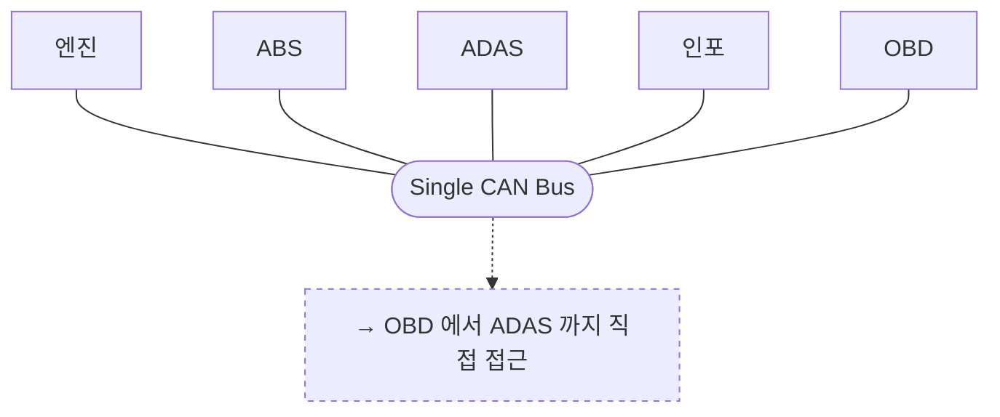

**현대적 Domain Gateway**:

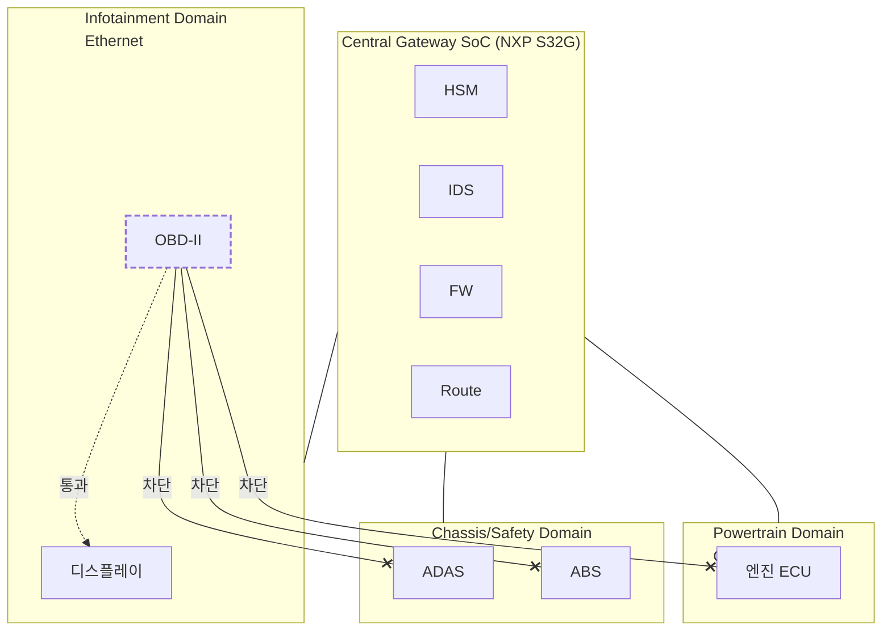

→ OBD-II 는 Infotainment 까지만, Chassis/Safety 도메인 접근 차단.

#### Gateway 보안 기능

| 기능 | 설명 |
|---|---|
| **도메인 격리** | Powertrain / Chassis / Body / Infotainment 물리 분리 |
| **메시지 라우팅 규칙** | 화이트리스트 — 허용된 메시지만 도메인 간 전달 |
| **Rate Limiting** | 비정상 송신 빈도 탐지·차단 (Bus-Off attack 보강) |
| **프로토콜 변환** | CAN ↔ CAN-FD ↔ Ethernet 간 보안 정책 유지 |
| **OBD-II 격리** | 진단 포트를 별도 도메인에 배치, Safety 접근 차단 |
| **SecOC 검증** | 도메인 경계에서 MAC 검증 후 전달 (Proxy SecOC) |

### 5.11 TEE — TrustZone in Automotive

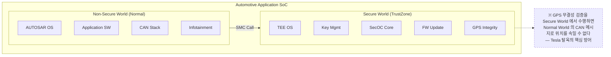

#### GPS 무결성 검증 — TEE 기반 접근

| 방법 | 구현 레벨 | 설명 |
|---|---|---|
| **다중 소스 교차검증** | TEE 내부 | GPS + IMU + Wheel Speed + Camera VO 를 Secure World 에서 융합 |
| **Authenticated GNSS** | SoC + 안테나 | Galileo OSNMA — 위성 신호 자체에 서명, SoC 가 검증 |
| **CAN 독립 경로** | SoC 하드웨어 | GPS 수신기 → SoC 직결 (CAN 미경유) |
| **Geofence 서버 검증** | Cloud | 위치 정보 서버 이중 확인 — 오프라인 시 미동작 |

### 5.12 AUTOSAR 보안 스택 전체 구조

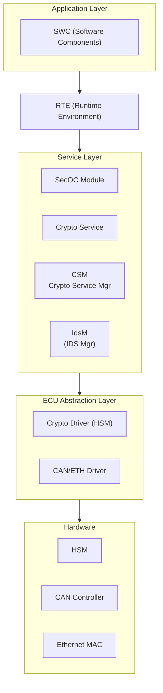

`SecOC → CSM → Crypto Driver → HSM` 하드웨어 — 메시지 인증 요청이 하드웨어 RoT 까지 내려가는 체인.

---

## 6. 흔한 오해 와 DV 디버그 체크리스트

### 흔한 오해

!!! danger "❓ 오해 1 — 'HSM 만 있으면 차량은 안전하다'"
    **실제**: HSM 은 _SW 만으로는 키를 못 뽑게_ 하는 도구일 뿐입니다. (1) 적용 범위가 좁으면 (예: Tesla SCS 는 boot 만, CAN 미적용) 무력 — Module 03 의 정확한 시나리오. (2) HSM API 를 호출하는 SW 가 취약하면 정당한 MAC 생성을 공격자가 할 수도 있음. (3) 물리 fault injection / SCA 는 HSM 자체를 우회. <br>
    **왜 헷갈리는가**: "hardware = secure" 의 마케팅 단순화.

!!! danger "❓ 오해 2 — 'MAC 만 추가하면 SecOC 끝'"
    **실제**: SecOC = MAC + Freshness Value 의 _쌍_. FV 없이 MAC 만 있으면 _replay attack_ 이 그대로 통과합니다 (공격자가 정상 frame 녹화 후 재전송, MAC 은 여전히 유효). FV 가 없거나 동기 깨지면 SecOC 는 사실상 무력. <br>
    **왜 헷갈리는가**: 표준 문서가 MAC 의 암호 기술적 디테일에 무게를 둬서 FV 가 부수적으로 보임.

!!! danger "❓ 오해 3 — 'IDS 가 있으면 SecOC 는 필요 없다'"
    **실제**: IDS 는 _탐지_ 도구이지 _차단_ 도구가 아닙니다. anomaly 가 발견된 _후에_ 알람을 올릴 뿐, 그 사이에 injection 된 메시지는 이미 ECU 가 처리해버린 상태. SecOC = 결정론적 차단, IDS = 휴리스틱 탐지 — 역할이 다르고 _둘 다_ 필요. <br>
    **왜 헷갈리는가**: IDS 가 "지능적" 이고 SecOC 가 "단순" 해 보여서 IDS 가 상위 호환으로 오해.

!!! danger "❓ 오해 4 — 'Gateway 만 있으면 도메인은 안전하다'"
    **실제**: Gateway 는 _도메인 경계_ 만 보호합니다. 같은 도메인 내부 (예: Chassis 도메인 안의 ABS ↔ EPS) 에서는 Gateway 가 안 보입니다 — 도메인 내부도 SecOC 가 필요. 또한 Gateway 자신의 펌웨어가 컴프로마이즈되면 모든 정책이 무력 (Jeep 2015 의 정확한 시나리오). <br>
    **왜 헷갈리는가**: "방화벽 = 안전" 의 IT 직관.

!!! danger "❓ 오해 5 — 'SecOC = 암호화'"
    **실제**: SecOC 는 _인증만_ 추가합니다 (MAC). payload 자체는 평문. CAN-XL 의 CANsec 이 _암호화 + 인증_ 을 함께 제공하는 것과 다릅니다. SecOC 위에 CAN 메시지를 뜨면 데이터는 여전히 sniffer 로 보임 — 다만 _위조는 못함_. <br>
    **왜 헷갈리는가**: "SecOC = security = 모든 보안" 의 단순화.

### DV 디버그 체크리스트 (HSM/SecOC/Gateway 통합 시뮬에서 자주 보는 실패)

| 증상 | 1차 의심 | 어디 보나 |
|---|---|---|
| Provisioning 후 첫 부팅에서 HSM API 가 `LC_INVALID` 반환 | Lifecycle 전이가 SECURED 까지 안 감 | `hsm_get_lifecycle()` 결과, Phase 1 Step ⑦ 실행 여부 |
| MAC verify 가 _간헐적_ 으로 실패 | FV race — TX 가 +1 했는데 RX 가 그 직전 frame 를 늦게 처리 | FV window 크기, prev_FV 갱신 시점, NVM flush latency |
| 키 로테이션 후 50 % 메시지 폐기 | Grace period 미적용 | K_old / K_new 동시 보유 여부, `dual_key_window_ms` 설정 |
| Gateway 가 cross-domain 메시지를 그냥 통과 | 화이트리스트 누락 — default-allow | Gateway routing table, default policy = DENY 인지 |
| OBD scan tool 만 통신 OK, 다른 진단 ID 거부 | 0x7DF 만 허용, 0x7E0~0x7EF 누락 | Gateway whitelist 의 OBD ID 범위 |
| TEE 호출 (SMC) 이 hang | Secure World 가 Secure RAM 외부 access 시 abort | TZASC 영역 설정, SMC handler 의 buffer 검증 |
| IDS 가 _모든_ frame 을 alert | 룰 기반 IDS 의 baseline 학습 미완료 | 학습 phase 로그, threshold 설정 |
| 레거시 ECU 가 SecOC 도메인 frame 수신 후 멈춤 | MAC/FV 필드를 데이터로 오인 → 잘못된 actuator 명령 | DBC 의 SecOC 적용 ID 매핑, Proxy SecOC 위치 |

---

## 7. 핵심 정리 (Key Takeaways)

- **5-Layer 스택**: HSM (L1) / SecOC (L2) / Gateway (L3) / IDS (L4) / Cloud OTA (L5). 한 layer 만으로는 부족.
- **HSM = 차량 RoT** — Secure Boot 키, SecOC 세션 키, OTA 서명 키 모두 HSM 에서 봉인. 평문 키는 HSM 밖으로 나오지 않음.
- **SecOC = MAC + Freshness 의 쌍** — MAC 만으로는 replay 무방비. FV 동기화가 가장 흔한 실패 지점.
- **Gateway = 도메인 격리 + Whitelist + Proxy SecOC** — Tesla flat CAN 의 정확한 반대.
- **TEE = Secure World 격리** — GPS 무결성 / 키 관리를 Normal World 의 CAN 위조로부터 보호.
- **레거시 호환 ↔ 보안 트레이드오프** — Proxy SecOC + 도메인 분리로 점진 마이그레이션.

!!! warning "실무 주의점 — SecOC 미지원 레거시 ECU 와 혼재 시 보안 구멍"
    **현상**: SecOC 가 적용된 신형 ECU 와 미지원 레거시 ECU 가 같은 CAN 버스에 공존하면, 레거시 ECU 는 MAC 없이 메시지를 송신하므로 공격자가 해당 ID 를 spoofing 해도 탐지되지 않는다.

    **원인**: SecOC 는 수신 ECU 가 MAC 검증을 하지 않으면 all-or-nothing 보호가 깨진다. 레거시 ECU 교체 일정이 차량 수명 (15–20 년) 보다 짧지 않아 혼재 기간이 길어진다.

    **점검 포인트**: 네트워크 매트릭스에서 SecOC 미적용 송신자 ID 목록을 추출하고, Gateway 의 Rate Limiter 가 해당 ID 에 대한 burst 주입 (동일 ID 연속 송신) 을 차단하는지 `candump` 로그로 확인.

---

## 다음 모듈

→ [Module 03 — Tesla FSD Case Study](03_tesla_fsd_case_study.md): 이 5-Layer 중 _L2 (SecOC) 가 비어 있을 때_ 무엇이 무너지는지의 실제 사례.

[퀴즈 풀어보기 →](quiz/02_automotive_soc_security_quiz.md)

<div class="chapter-nav">
  <a class="nav-prev" href="../01_can_bus_fundamentals/">
    <div class="nav-label">◀ 이전</div>
    <div class="nav-title">CAN Bus Fundamentals (차량 내부 통신의 구조와 한계)</div>
  </a>
  <a class="nav-next" href="../03_tesla_fsd_case_study/">
    <div class="nav-label">다음 ▶</div>
    <div class="nav-title">Tesla FSD Case Study (탈옥 사례 분석)</div>
  </a>
</div>


--8<-- "abbreviations.md"
