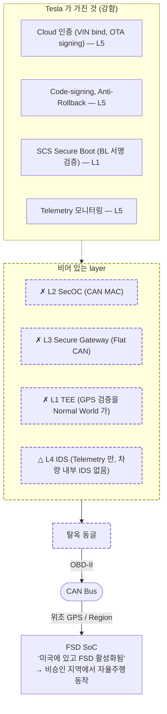
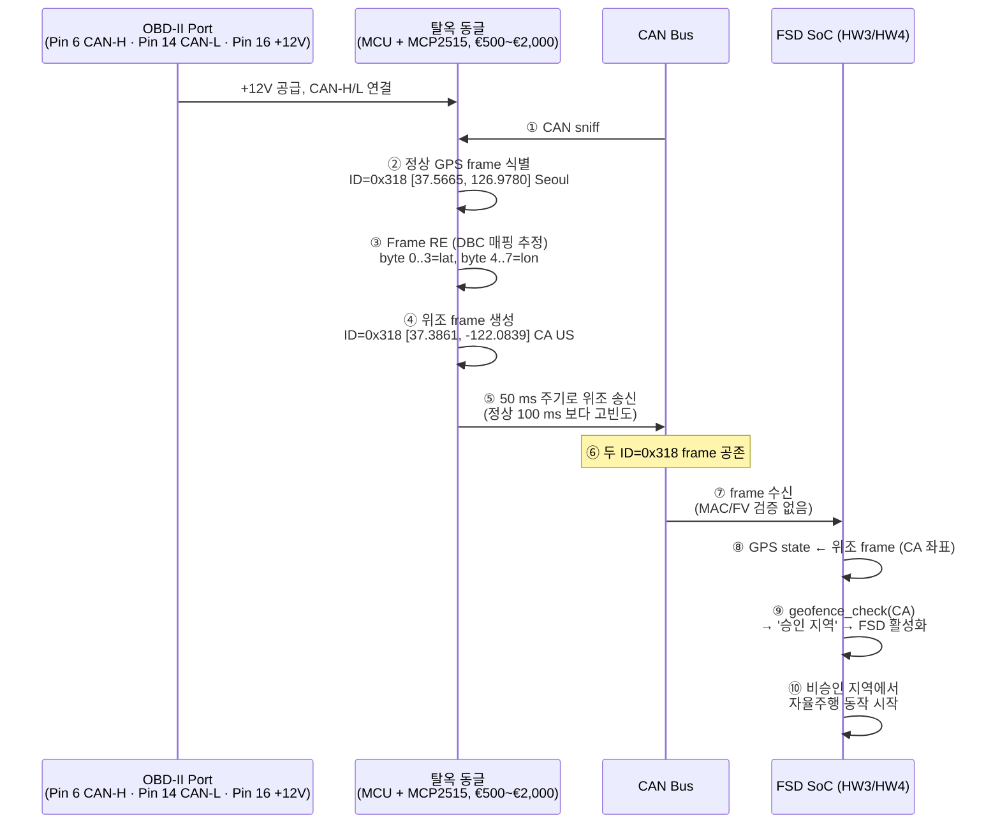
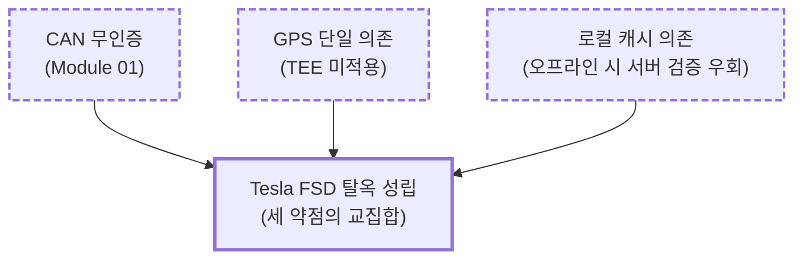
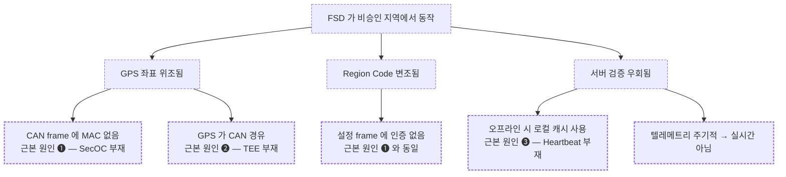
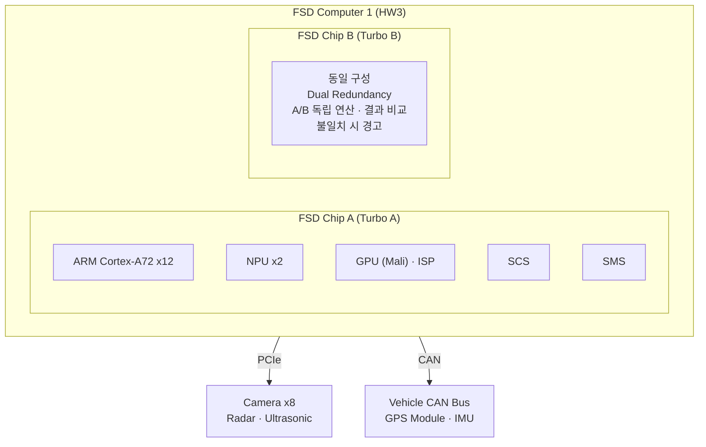
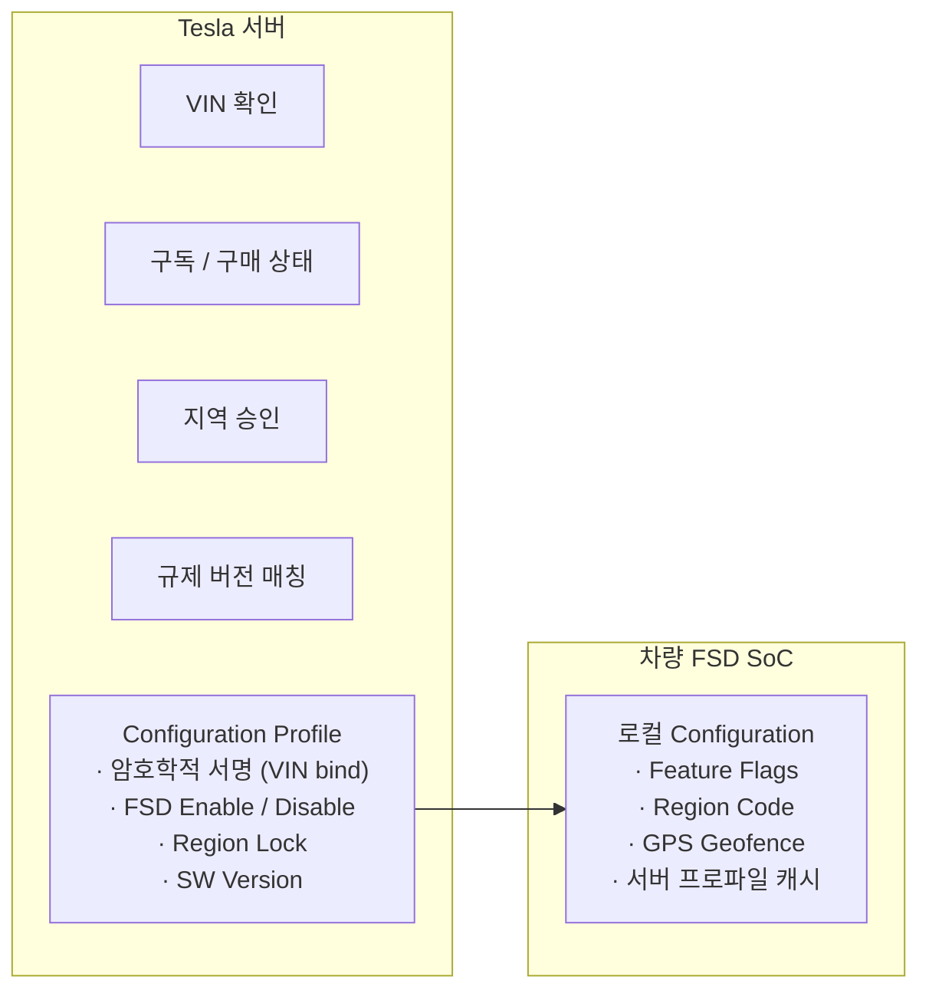
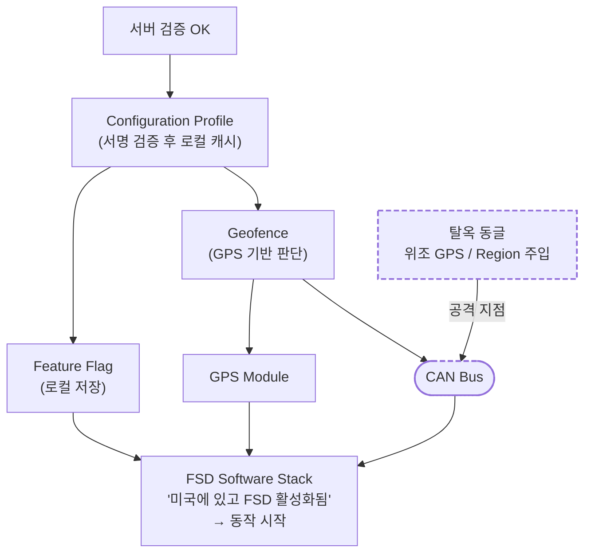
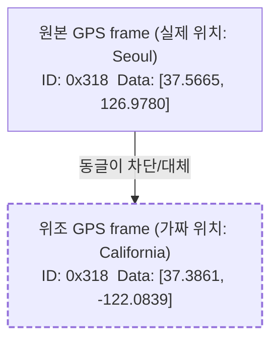

# Module 03 — Tesla FSD Case Study

<!-- DV-SKOOL-CH-CTX:start -->
<div class="chapter-context" data-cat="soc">
  <a class="chapter-back" href="../">
    <span class="chapter-back-arrow">←</span>
    <span class="chapter-back-icon">🚗</span>
    <span class="chapter-back-text">Automotive Cybersec</span>
  </a>
  <span class="chapter-divider">›</span>
  <span class="chapter-marker">Module 03</span>
</div>
<!-- DV-SKOOL-CH-CTX:end -->

<!-- DV-SKOOL-CH-TOC:start -->
<div class="page-toc">
  <span class="page-toc-label">목차</span>
  <a class="page-toc-link" href="#1-why-care-이-모듈이-왜-필요한가">1. Why care?</a>
  <a class="page-toc-link" href="#2-intuition-비유와-한-장-그림">2. Intuition</a>
  <a class="page-toc-link" href="#3-작은-예-fsd-탈옥-1-주입-사이클-can-injection">3. 작은 예 — 탈옥 1 주입 사이클</a>
  <a class="page-toc-link" href="#4-일반화-3-약점-교집합-과-root-cause-tree">4. 일반화 — 3 약점 교집합</a>
  <a class="page-toc-link" href="#5-디테일-타임라인-역사적-사례-hw-아키텍처-tesla-대응">5. 디테일</a>
  <a class="page-toc-link" href="#6-흔한-오해-와-dv-디버그-체크리스트">6. 흔한 오해 + DV 디버그 체크리스트</a>
  <a class="page-toc-link" href="#7-핵심-정리-key-takeaways">7. 핵심 정리</a>
</div>
<!-- DV-SKOOL-CH-TOC:end -->

!!! objective "학습 목표"
    이 모듈을 마치면:

    - **Recall** 2023–2026 Tesla FSD 탈옥 체인의 단계 (sniff / RE / inject / region 변조 / 지속 주입) 를 나열할 수 있다.
    - **Explain** "SoC 에 SCS (보안 칩) 가 있어도 CAN 인증이 없으면 무력화" 되는 이유를 설명할 수 있다.
    - **Decompose** 탈옥 체인의 각 단계를 ① 기술적 결함 ② 정책적 결함 ③ 아키텍처 결함으로 분해할 수 있다.
    - **Justify** TARA 관점에서 same 사건이 SecOC + TEE 적용 OEM 에서 재현 가능한지 평가할 수 있다.
    - **Apply** Threat-modeling 시 Tesla 사례의 5 단계를 자기 프로젝트의 ECU 에 적용할 수 있다.

!!! info "사전 지식"
    - [Module 01](01_can_bus_fundamentals.md) (CAN 무인증, OBD-II 진입점, Bus-Off)
    - [Module 02](02_automotive_soc_security.md) (HSM, SecOC, Gateway, TEE — _없을 때_ 무엇이 깨지는지 알려면 _있을 때_ 모습을 알아야)
    - Bug bounty / responsible disclosure 일반 상식
    - 차량 OTA 흐름 (서버 → 차량 → 인증 → 적용) 의 큰 그림

---

## 1. Why care? — 이 모듈이 왜 필요한가

### 1.1 시나리오 — _$10K 짜리 FSD 옵션_ 을 _$0_ 으로 해킹

2023 년 Berlin TU 의 연구팀이 **Tesla Model 3 의 FSD (Full Self-Driving) 옵션을 무료 활성화** 하는 방법 발표.

Tesla 의 보안 스택은 _업계 최고 수준_:
- **L1 (Boot)**: SCS (Secure Computing Stack), Boot ROM, 신뢰 chain 완벽.
- **L5 (Cloud)**: OTA 인증, signing, 강한 PKI.

그런데:
- **L2 (Communication)**: CAN bus 위 메시지 _인증 없음_ — SecOC 미적용.

연구팀은:
1. 차량에 OBD-II 진입 (법적 허용).
2. CAN bus 에 _임의 메시지 ID 0x???_ 송신 → Region 변경 (US → CN).
3. 다른 ID 송신 → FSD feature flag 켜기.
4. FSD SoC 가 _보안 layer 통과 검증 없이_ 수용 → **무료 FSD 활성화**.

_L1, L5 가 강해도 L2 가 비어 있으면_ — _금고 옆에 누구나 앉을 수 있음_.

이론으로 배운 보안 메커니즘이 실제 어디에서 깨지는지 가장 빠르게 배우는 방법은 **공개된 케이스 스터디 분석** 입니다. Tesla FSD 사례는 _"비싼 보안 IP (SCS) 를 넣었는데도 한 줄 잘못된 가정 (CAN = 신뢰) 때문에 무력화"_ 된 대표 예시입니다.

Module 02 의 5-Layer 스택을 _Tesla 가 어디까지 가지고 있었고 어디가 비어 있었는지_ 로 정확히 매핑하면, 학습자는 **"동일 사건이 우리 ECU 에서 가능한가?"** 를 던지는 사고 패턴을 얻습니다. 이것이 ISO 21434 의 TARA 그 자체이고, Module 04 의 attack surface 분석으로 직접 이어집니다.

!!! question "🤔 잠깐 — Tesla 가 _왜_ SecOC 안 적용했을까?"
    Tesla 는 _보안에 적극적_ — Boot, Cloud 다 강함. 왜 CAN 만 약점이었을까?

    ??? success "정답"
        **레거시 + 성능 + 비용** trade-off 추정 (Tesla 비공개):

        - **레거시**: 초기 Tesla 모델이 _전통 자동차 CAN_ 기반 설계 (2008-2012). 그 시절 SecOC 미보편.
        - **Latency**: SecOC 의 MAC 계산 + 검증 = _100~300 µs_ 추가. 차량 _제어 critical_ 메시지에 부담.
        - **CPU 부담**: 모든 ECU 가 _MAC 계산 + verify_ → SoC 부담 ↑.
        - **호환성**: SecOC 적용 시 _기존 진단 도구_ 와 호환성 깨질 수 있음.

        교훈: **보안 결정은 _historical reason_ 으로 종종 미적용**. 새 모델은 SecOC 적용 (Model Y/S 의 최신 firmware). 하지만 _레거시 모델_ 은 여전히 노출.

---

## 2. Intuition — 비유와 한 장 그림

!!! tip "💡 한 줄 비유"
    **Tesla FSD 탈옥** ≈ **금고는 강한데 문은 열려 있는 집**. SCS 가 boot / Cloud 인증은 _업계 최고_ 수준으로 보호했지만, CAN 통신은 미적용 — 외부에서 OBD-II 로 위조 GPS·Region·Feature 프레임을 주입하면 FSD SoC 가 그것을 정상 신호로 수용. 강한 금고가 있어도 문이 열려 있으면 도둑이 _금고 옆_ 까지 걸어 들어옵니다.

### 한 장 그림 — Tesla 가 가진 것 vs 빠진 것



### 왜 이 일이 발생했는가 — Architecture rationale (추론)

Tesla 의 설계 가정 (추론):

1. **자체 SW 스택** (AUTOSAR 미채택) → SecOC 에코시스템 _밖_ 에 있음.
2. **중앙집중 아키텍처** (모든 ECU 자체 설계) → "내부 통신은 신뢰" 가정.
3. **서버 기반 검증의 강점** 을 _차량 내부 보안의 약점_ 이 보상한다고 판단.

세 가정 모두 _합리적으로 보였지만_, OBD-II 라는 _법적 의무 진입점_ 앞에서 무너졌습니다. Module 02 의 표현을 빌리면 — "Secure Boot 의 BootROM 만 강력하고 OTP 가 비어 있는 구조" 와 같습니다.

---

## 3. 작은 예 — FSD 탈옥 1 주입 사이클 (CAN injection)

가장 단순한 한 사이클. €500 동글이 OBD-II 로 연결되어 _GPS CAN 프레임 한 개_ 를 위조 주입하는 과정.



| Step | 누가 | 무엇을 | 의미 |
|---|---|---|---|
| ① | 동글 | OBD-II 에 꽂아 +12V 로 동작, 모든 CAN frame sniff | _물리 접근 1 회_ 만 필요 |
| ② | 동글 | GPS 좌표를 운반하는 ID 식별 | DBC 가 reverse 됐거나 패턴 분석으로 추정 |
| ③ | 동글 | byte 매핑 분석 | DBC 의 일부 정보가 OEM 수리 매뉴얼에서 누출된 사례 있음 |
| ④ | 동글 | 위조 frame 생성 (CRC 만 정상 계산) | _MAC 가 없으니 추가 검증 없음_ |
| ⑤ | 동글 | 정상보다 높은 빈도로 송신 | 마지막 수신값을 덮어쓰기 위함 |
| ⑥ | CAN Bus | 두 ID 0x318 frame 공존 | CAN 은 ID 충돌 시 비파괴 중재만 — _발신자 검증 없음_ |
| ⑦ | FSD SoC | CAN driver 가 frame 수신 | SecOC 미적용이므로 무조건 통과 |
| ⑧ | FSD SoC | GPS state 갱신 | 마지막 수신값으로 덮어쓰기 |
| ⑨ | FSD SoC | geofence_check | 위조 좌표 (CA) 통과 |
| ⑩ | FSD | 비승인 지역에서 자율주행 동작 | 비즈니스 모델 자체가 무너지는 결과 |

```c
// Step ⑧ 의 추정 의사 코드 (FSD CAN handler — SecOC 미적용 가정)
void can_rx_handler(can_frame_t *f) {
    if (f->id == 0x318) {       // GPS frame
        // !!! MAC 검증 없음, FV 검증 없음
        gps_state.lat = decode_f32(f->data + 0);
        gps_state.lon = decode_f32(f->data + 4);
        gps_state.last_update_ms = now_ms();
    }
    // ... 다른 ID 처리
}

// SecOC 가 있었다면 추가됐을 코드 (Module 02 의 §5.5)
void can_rx_handler_secoc(can_frame_t *f) {
    if (f->id == 0x318) {
        secoc_pdu_t *pdu = (secoc_pdu_t *)f->data;
        if (!secoc_verify_freshness(0x318, pdu->fv))
            return;  // replay 차단
        if (!hsm_cmac_verify(K_SECOC_GPS, pdu->data, 8,
                             pdu->fv, pdu->mac, 4))
            return;  // ★ 여기서 위조 frame 폐기
        gps_state.lat = decode_f32(pdu->data + 0);
        gps_state.lon = decode_f32(pdu->data + 4);
    }
}
```

!!! note "여기서 잡아야 할 두 가지"
    **(1) 단 한 줄 — `hsm_cmac_verify` — 가 빠져서 10 만 대 fleet 이 탈옥됐다.** 이것이 "L2 SecOC 가 비어 있을 때" 의 정확한 비용. <br>
    **(2) GPS 가 _CAN 을 경유_ 한다는 것 자체가 아키텍처 결함.** GPS 수신기가 SoC 에 직결되거나 TEE 안에서 multi-source fusion 됐다면, CAN injection 으로 위조 불가.

---

## 4. 일반화 — 3 약점 교집합 과 Root Cause Tree

### 4.1 세 약점이 _동시에_ 존재해야 탈옥이 성립



세 약점 중 _어느 하나라도_ 방어됐다면 공격 난이도는 _차원이 다른 수준_ 으로 상승했을 것입니다.

| 약점 | 대응 방어 (Module 02 layer) |
|---|---|
| ❶ CAN 무인증 (GPS frame 위조 가능) | **L2 SecOC** — HSM 키로 MAC + FV |
| ❷ GPS 단일 소스 의존 | **L1 TEE** — Secure World 에서 GPS + IMU + WheelSpeed + CellTower 융합 |
| ❸ 로컬 캐시 의존 (오프라인 우회) | **L5 Cloud + Heartbeat** — 주기 검증 실패 시 기능 비활성화 |

### 4.2 Root Cause Tree



### 4.3 같은 사건이 _다른 OEM_ 에서 가능한가? — TARA

| Layer | Tesla | BMW/Mercedes (최신) | 현대/기아 (최신) |
|---|---|---|---|
| **CAN 인증 (L2)** | ❌ | ✅ SecOC (부분) | ✅ SecOC (신차) |
| **Gateway (L3)** | △ Flat | ✅ Central GW | ✅ ccGW |
| **HSM (L1)** | SCS (Boot) | EVITA Full | SHE → HSE 전환 중 |
| **OBD 격리 (L3)** | ❌ | ✅ | ✅ |
| **IDS (L4)** | Telemetry | ✅ 차량 내 IDS | ✅ |
| **OTA 보안 (L5)** | ✅ 업계 최고 | ✅ | ✅ |

**아이러니**: Tesla 는 OTA / 클라우드 보안에서 업계 선도. _차량 내부 통신 보안_ 에서는 전통 OEM 보다 뒤처짐.

---

## 5. 디테일 — 타임라인, 역사적 사례, HW 아키텍처, Tesla 대응

### 5.1 사건 타임라인

| 시기 | 사건 |
|---|---|
| **2019.04** | HW3 (FSD Computer 1) 양산 — SCS 로 Secure Boot 적용, CAN 인증 미적용 |
| **2020** | HW3 MCU 탈옥 (보안 연구자) — voltage glitching 으로 Secure Boot 우회 |
| **2023** | HW4 (FSD Computer 2) 양산 — 7 nm, 여전히 CAN 인증 미적용 |
| **2024.H1** | Pwn2Own Automotive 2024 — Tesla 인포테인먼트 다수 취약점 |
| **2024.H2** | FSD 탈옥 동글 첫 등장 — 동유럽 / 중국 지하 시장 |
| **2025.Q1** | 탈옥 규모 확대 — 온라인 판매 증가, 비승인 지역 중심 |
| **2025.Q2** | Tesla 텔레메트리로 대규모 탐지 — GPS vs Cell Tower 불일치 패턴 |
| **2025.H2** | Pwn2Own Automotive 2025 — FSD SoC 추가 취약점, Fault Injection 시연 |
| **2026.Q1** | Tesla 원격 비활성화 — 10 만+ 대 동시 FSD 차단, VIN 블랙리스트 |
| **2026.Q1** | 각국 규제 대응 — 한국 자동차관리법 집행 강화 (2 년 징역 / 2 천만 원) |
| **2026.Q2** | 업계 파급 — SecOC 의무화 논의 가속, ISO 21434 구현 가이드라인 강화 |

**핵심 교훈**: SCS (Secure Boot + Cloud Auth) 는 2019 년부터 있었지만, _CAN 통신 인증_ 을 적용하지 않은 아키텍처 판단이 5 년 후 10 만 대 규모 보안 사고로 이어짐.

### 5.2 역사적 차량 해킹 사례 — FSD 탈옥과 비교

#### Jeep Cherokee 원격 해킹 (2015)


| 항목 | Jeep Cherokee (2015) | Tesla FSD (2025–26) |
|---|---|---|
| **진입점** | Cellular (원격, 물리 접근 불필요) | OBD-II (물리 접근 필요) |
| **핵심 취약점** | 게이트웨이 FW 리플래시 무인증 | CAN 메시지 무인증 |
| **영향** | 조향/브레이크 물리 제어 → **안전 위협** | 기능 잠금 우회 → **매출 손실** |
| **규모** | 140 만 대 리콜 | 10 만+ 대 원격 비활성화 |
| **근본 원인** | 도메인 미격리 + FW 서명 없음 | CAN 인증 없음 + GPS 단일 의존 |
| **산업 영향** | 차량 보안 연구 폭발적 증가 | SecOC 의무화 논의 가속 |

#### BMW ConnectedDrive (2015)

**공격** (ADAC, 독일자동차클럽 발견):

- ConnectedDrive 가 HTTP (비암호화) 통신
- MITM 으로 차량 도어 원격 잠금 해제
- 220 만 대 영향

**교훈**: 차량-서버 간 통신에도 TLS 필수.

→ Tesla FSD 비교: Tesla 는 서버 통신 보안 강력 (TLS + 서명), 그러나 차량 내부 CAN 통신은 무방비.

#### Tesla Model S Key Fob 클론 (2018)

**공격** (KU Leuven 연구팀):

- Tesla Model S 키폭이 DST40 암호화 사용 (40-bit, 취약)
- Proximity Reader ($600) + Raspberry Pi 로 키폭 신호 캡처
- 1.6 초 만에 키 복제 → 차량 탈취

**교훈**:

- 약한 암호 알고리즘 (DST40) 은 시간이 지나면 반드시 깨짐
- Tesla 대응: AES-128 키폭 교체 + PIN to Drive

→ FSD 비교: SCS 의 AES 는 강력하지만, CAN 통신에 미적용.

#### 사례들의 공통 패턴

**반복되는 3 패턴**:

1. **"여기는 안전" 가정의 붕괴**
    - CAN: "폐쇄 네트워크" → OBD-II 로 개방
    - Jeep: "인포테인먼트는 격리됨" → CAN 게이트웨이 직접 접근
    - Tesla FSD: "서버 인증이면 충분" → CAN 우회
2. **가장 약한 고리에서 깨짐**
    - Jeep: 게이트웨이 FW 서명 부재
    - BMW: HTTP 통신
    - Tesla FSD: CAN 무인증
3. **사후 대응 비용 ≫ 사전 설계 비용**
    - Jeep: 140 만 대 리콜 비용 ≫ 게이트웨이 서명 구현 비용
    - Tesla: $118M+/년 매출 손실 ≫ $10–30/대 SecOC 비용

### 5.3 Tesla FSD 하드웨어 아키텍처

#### HW3 (FSD Computer 1, 2019~)



- **SCS** (Security Subsystem) — Secure Boot (BL 서명 검증), FMP Key (Firmware Protection), Weight Encryption Key (모델 보호), Board Credentials (Cloud 인증)
- **SMS** (Safety Management System) — Watchdog, ECC, 오류 복구

#### HW3 vs HW4 비교

| 항목 | HW3 | HW4 |
|---|---|---|
| 공정 | Samsung 14 nm | Samsung 7 nm |
| NPU | 2 개 (칩당 1) | 2 개 (성능 3–5×) |
| 카메라 입력 | 8 대 (1.2 MP) | 최대 11 대 (5 MP) |
| Ethernet | 미지원 | 지원 (고속 카메라) |
| 보안 | SCS (Secure Boot + Cloud Auth) | SCS 강화 + Anti-Tamper |
| **CAN 인증** | **❌ 미적용** | **❌ 여전히 미적용** |

### 5.4 FSD 기능 활성화 메커니즘 — 정상 vs 공격 지점

#### 정상 활성화 흐름



#### 취약점 발생 지점



### 5.5 탈옥 기법 상세 — 5 단계

**Step 1 — CAN Bus sniffing**

- 정상 동작 시 GPS 관련 CAN frame 캡처
- Arbitration ID, DLC, Data 패턴 분석
- Region Code 전달 frame 식별

**Step 2 — Frame 역공학**

- GPS 좌표 인코딩 분석
- Feature Flag / Region Code frame 구조 분석
- DBC 파일 (CAN Database) 참조 또는 RE

**Step 3 — 위조 frame 주입**



**Step 4 — Region Code 변조**

- 차량 설정의 지역 코드를 US 로 위조
- FSD SW 가 "승인된 시장" 으로 판단

**Step 5 — 지속 주입**

- 동글이 상시 동작, 위조 frame 반복 송신
- 정상 GPS ECU 보다 _높은 빈도_ 로 송신
- FSD SoC 는 _최신 수신값_ 사용 → 위조 값 채택

### 5.6 Tesla 의 사후 대응 (2026 Q1)

| 대응 | 방법 | 효과 | 한계 |
|---|---|---|---|
| **원격 비활성화** | OTA 로 FSD 차단 | 즉각, 10 만+ 대 동시 처리 | _사후 대응_ — 이미 수개월 운행 |
| **텔레메트리 탐지** | GPS 궤적 vs 셀 타워 / IP 위치 불일치 | 높은 탐지율 | 인터넷 미연결 시 탐지 지연 |
| **영구 FSD 차단** | VIN 블랙리스트, 보증 거부 | 강력한 억제 | 합법 중고차 구매자 피해 가능 |
| **법적 대응** | 각국 규제 협력 | 판매자 처벌 | 오픈소스 도구 근절 어려움 |

### 5.7 "했어야 했던 것" vs "한 것"

| 방어 수단 | Tesla 가 한 것 | 했어야 한 것 |
|---|---|---|
| **Secure Boot** | ✅ SCS 로 FW 서명 검증 | ✅ (이미 적용) |
| **Cloud Auth** | ✅ VIN 기반 서버 검증 | ✅ (이미 적용) |
| **CAN 메시지 인증 (L2)** | ❌ 미적용 | ✅ SecOC + HSM |
| **도메인 격리 (L3)** | ❌ Flat CAN | ✅ Secure Gateway |
| **GPS 무결성 (TEE)** | ❌ CAN 경유 GPS 신뢰 | ✅ TEE 다중 소스 검증 |
| **OBD-II 격리** | ❌ 전체 CAN 접근 | ✅ 진단 도메인 분리 |
| **IDS** | △ 텔레메트리 기반 | ✅ 실시간 CAN IDS |

### 5.8 비용 분석 — SecOC 도입 vs 탈옥 피해

| 항목 | 추정 비용 |
|---|---|
| HSM 탑재 ECU 추가 비용 | $1–5 / ECU (대량 생산) |
| SecOC 펌웨어 개발 | 일회성 엔지니어링 비용 |
| 키 관리 인프라 | 서버 인프라 + PKI |
| **합계 (차량당)** | **$10–30 추정** |
| | |
| FSD 탈옥 피해 (10 만 대) | $99/월 × 12 개월 × 100,000 = **$118 M+/년 매출 손실** |
| 브랜드 / 규제 리스크 | 정량화 불가 — 자율주행 신뢰도 훼손 |

---

## 6. 흔한 오해 와 DV 디버그 체크리스트

### 흔한 오해

!!! danger "❓ 오해 1 — 'Tesla 는 보안에 신경 안 썼다'"
    **실제**: Tesla 의 _서버 보안 / boot 보안 / OTA 서명_ 은 업계 최고 수준입니다. 문제는 _"내부 CAN = 신뢰"_ 라는 _아키텍처 가정의 실패_. **의도 부재가 아니라 가정 오류** 입니다. <br>
    **왜 헷갈리는가**: 결과 (탈옥 발생) 만 보고 "처음부터 보안 무시" 로 단순화. 실제는 design assumption 의 잘못.

!!! danger "❓ 오해 2 — 'SCS 가 있으면 CAN 도 자동으로 안전'"
    **실제**: SCS 는 _Secure Boot + Cloud Auth_ 만 적용된 보안 IP 입니다. 같은 하드웨어가 SecOC 도 할 수 있지만 _Tesla 는 CAN 통신에 적용하지 않음_. 즉 **HW 가 있는 것 ≠ 사용된 것**. <br>
    **왜 헷갈리는가**: "SCS 라는 보안 칩이 있다 = 모든 보안 OK" 의 단순화.

!!! danger "❓ 오해 3 — 'GPS spoofing 은 RF 위조가 본질'"
    **실제**: Tesla FSD 탈옥은 _RF GPS spoofing_ 이 아니라 _CAN 내부 frame 위조_ 입니다. GPS 수신기와 SoC 사이에 CAN 이 끼어 있고, 그 CAN 이 무인증이라 _수신기 출력을 동글이 대체_. 즉 GPS 안테나는 정상, 신호 위조는 _차량 내부에서_ 발생. <br>
    **왜 헷갈리는가**: "GPS spoofing" 이라는 용어가 RF 공격을 자연스럽게 떠올림.

!!! danger "❓ 오해 4 — 'Feature Flag 는 보안 기능이다'"
    **실제**: Feature Flag 는 _UX 편의_ 목적의 정책 변수입니다. 서명 검증이나 HSM 봉인 없이 평문 NVM 에 저장되는 경우가 많고, _공격자가 변조 가능_. **정책 ≠ 보안 경계**. <br>
    **왜 헷갈리는가**: "FSD 비활성화 = 안전" 라는 결과 중심 사고.

!!! danger "❓ 오해 5 — 'Telemetry 만 있으면 IDS 역할 충분'"
    **실제**: Telemetry 는 _서버 측 사후 분석_ 에 가깝습니다. 차량 내부의 _실시간 CAN IDS_ 와는 다릅니다 — 인터넷 미연결 / 산악 지역 / 지하 주차장에서는 Telemetry 가 끊기고, 그 동안 공격이 진행 중입니다. <br>
    **왜 헷갈리는가**: "데이터 수집 = 모니터링 = IDS" 의 단순화.

### DV 디버그 체크리스트 (Tesla 사례를 자기 ECU 에 매핑할 때)

| 증상 / 자가진단 질문 | 1차 의심 | 어디 보나 |
|---|---|---|
| 외부 동글이 OBD-II 로 GPS frame 을 위조 주입 가능한가? | L2 SecOC 부재 | DBC 의 GPS ID 가 SecOC 적용 목록에 있나, RX side 의 MAC verify call |
| GPS 좌표 한 ID 로 단일 의존하는가? | L1 TEE 부재 | sensor fusion 코드가 Normal World 인지, multi-source plausibility 체크 유무 |
| 오프라인 시 로컬 캐시로 기능이 동작하는가? | L5 Heartbeat 부재 | "마지막 서버 검증 후 N 시간 경과" 시 fallback 정책 |
| Region / Feature Flag 가 평문 NVM 에 저장되는가? | L1 Secure Boot Measurement 미포함 | NVM dump → 서명 검증 영역 vs 실제 저장 영역 |
| 진단 ID (0x7DF, 0x7E0..0x7EF) 가 모든 도메인에 도달하는가? | L3 OBD 격리 부재 | Gateway routing table |
| 동일 ID 가 _두 source_ 에서 송신 시 어떻게 처리하는가? | spoofing 탐지 부재 | RX handler 의 source 검증 (불가능 — SecOC 가 답) |
| 실시간 CAN IDS 가 있는가? | L4 IDS 부재 (Tesla 의 정확한 패턴) | 차량 내 IDS 컴포넌트 존재 여부, telemetry 와 분리 |
| Feature 활성화 결정이 로컬 플래그만으로 일어나는가? | L5 Heartbeat 부재 | 활성화 코드 경로 trace, 서버 재검증 빈도 |

이 8 개 질문에 _하나라도_ "예" 가 있으면 Tesla 사례의 일부 재현 가능성이 있는 ECU 입니다.

---

## 7. 핵심 정리 (Key Takeaways)

- **외부 방어 ≠ 내부 방어** — Secure Boot 로 부팅 체인을 지켜도 CAN 인증이 없으면 OBD-II 한 번에 무력.
- **3 약점 교집합** — CAN 무인증 ❶ + GPS 단일 의존 ❷ + 로컬 캐시 ❸. 셋 중 하나만 깨도 공격 난이도 차원이 다름.
- **Feature Flag = 정책일 뿐 보안 경계가 아님** — 서명·봉인 없는 플래그를 신뢰하면 차량이 곧 정책 결정자가 됨.
- **자체 SW 스택의 함정** — AUTOSAR / SecOC 에코시스템 밖이면 같은 기능을 자체 구현해야 하며, 누락 위험 큼.
- **케이스 스터디 = TARA 의 출발점** — 공개된 익스플로잇 체인은 자체 ECU 가정을 검증하는 가장 빠른 도구.
- **비용 비대칭** — SecOC $10–30/대 ≪ FSD 탈옥 $118 M+/년 매출 손실.

!!! warning "실무 주의점 — Feature Flag 로 보안 기능을 제어하면 안 된다"
    **현상**: FSD 활성화 여부를 차량 로컬 플래그로 판단하면, 공격자가 해당 플래그 값을 변조해 구매하지 않은 기능을 무료로 활성화하거나, 반대로 인가되지 않은 자율 주행 모드를 강제 진입시킬 수 있다.

    **원인**: Feature Flag 는 UX 편의 목적으로 설계되었으며, 서명 검증이나 HSM 봉인 없이 플래시 메모리에 평문 저장되는 경우가 많다.

    **점검 포인트**: Feature 활성 여부를 결정하는 NVM 주소를 특정하고, 해당 값이 Secure Boot 검증 범위 (Measurement) 안에 포함되는지 확인. 외부 서버 재검증 없이 로컬 플래그만으로 안전 기능이 전환되는 코드 경로가 있으면 즉시 수정 대상.

### 7.1 자가 점검

!!! question "🤔 Q1 — Tesla 의 5 layer 분석 (Bloom: Analyze)"
    Tesla 가 _L1 Boot 강함_, _L5 Cloud 강함_. 그런데 _L2 Communication 약함_. 왜?

    ??? success "정답"
        가능한 원인 (Tesla 비공개):
        - **레거시 design**: 2008-2012 model 의 CAN bus 기반, SecOC 미보편 시절.
        - **Latency 비용**: SecOC MAC 검증이 _100~300 µs_ 추가, 일부 control 경로에 부담.
        - **호환성**: 외부 diagnostic tool 과 호환.

        교훈: _historical 결정_ 이 _현재 보안 hole_ 로 남음. 새 design 에 _retrofit_ 어려움.

!!! question "🤔 Q2 — Feature flag 검증 (Bloom: Apply)"
    FSD feature flag 를 _NVM_ 에 저장. 어떻게 _spoofing 방어_?

    ??? success "정답"
        - **서명 + HSM 봉인**: NVM flag 가 _서명_ 되고, HSM 이 _verify_. Random NVM write 무효.
        - **Server 재검증**: 차량이 _주기적_ Tesla server 에 _feature 인증_ 재검증.
        - **Secure boot measurement**: NVM flag 가 _boot measurement_ 에 포함 → 변경 시 boot fail.

        세 가지 모두 적용 = defense in depth.

!!! question "🤔 Q3 — 비용 비대칭 추정 (Bloom: Evaluate)"
    SecOC retrofit _$10-30/대_, FSD 탈옥 _$118M+/년 매출 손실_. 왜 _즉시 retrofit_ 안 함?

    ??? success "정답"
        - **레거시 차량 retrofit 불가**: 출시된 차량은 _firmware update_ 만, hardware 한계.
        - **인증 / regulation**: 차량 보안 변경은 _ISO 26262 인증_ 재취득 필요 — 비용/시간 큼.
        - **신모델 적용**: 신차에 적용 _현재 진행 중_.
        - **위험 평가**: 일부 OEM 은 _ROI 계산_ — 탈옥 빈도 vs retrofit 비용.

        교훈: _보안 retrofit_ 은 _design 시점_ 보다 _수십 배 비쌈_.

### 7.2 출처

**External**
- 학술 / industry 발표: FSD jailbreak research (2023)
- Berlin TU 차량 보안 연구 그룹
- Tesla cybersecurity disclosure (limited public)

---

## 다음 모듈

→ [Module 04 — Attack Surface & Defense](04_attack_surface_and_defense.md): Tesla 사례를 일반화 — 차량의 _전체 attack surface_ (물리 / 무선 / 공급망) 와 각 layer 에 매핑된 방어 계층.

[퀴즈 풀어보기 →](quiz/03_tesla_fsd_case_study_quiz.md)

<div class="chapter-nav">
  <a class="nav-prev" href="../02_automotive_soc_security/">
    <div class="nav-label">◀ 이전</div>
    <div class="nav-title">Automotive SoC Security (차량 SoC 보안 아키텍처)</div>
  </a>
  <a class="nav-next" href="../04_attack_surface_and_defense/">
    <div class="nav-label">다음 ▶</div>
    <div class="nav-title">Attack Surface & Defense (공격 표면과 방어 계층)</div>
  </a>
</div>


--8<-- "abbreviations.md"
