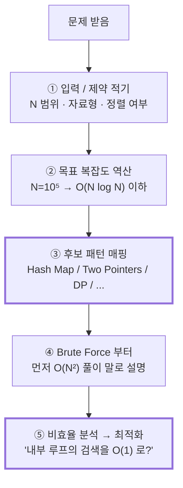

# Module 01 — Big-O Complexity & Pattern Thinking

<!-- DV-SKOOL-CH-CTX:start -->
<div class="chapter-context" data-cat="applied">
  <a class="chapter-back" href="../">
    <span class="chapter-back-arrow">←</span>
    <span class="chapter-back-icon">📐</span>
    <span class="chapter-back-text">BigTech Algorithm</span>
  </a>
  <span class="chapter-divider">›</span>
  <span class="chapter-marker">Module 01</span>
</div>
<!-- DV-SKOOL-CH-CTX:end -->

<!-- DV-SKOOL-CH-TOC:start -->
<div class="page-toc">
  <span class="page-toc-label">목차</span>
  <a class="page-toc-link" href="#1-why-care-이-모듈이-왜-필요한가">1. Why care?</a>
  <a class="page-toc-link" href="#2-intuition-비유와-한-장-그림">2. Intuition</a>
  <a class="page-toc-link" href="#3-작은-예-binary-search-로-9-찾기-3-step-에-끝나는-이유">3. 작은 예 — Binary Search</a>
  <a class="page-toc-link" href="#4-일반화-big-o-패턴-사고법">4. 일반화</a>
  <a class="page-toc-link" href="#5-디테일-표-코드-공간-복잡도">5. 디테일</a>
  <a class="page-toc-link" href="#6-흔한-오해-와-디버그-체크리스트">6. 흔한 오해 + 디버그</a>
  <a class="page-toc-link" href="#7-핵심-정리-key-takeaways">7. 핵심 정리</a>
</div>
<!-- DV-SKOOL-CH-TOC:end -->

!!! objective "학습 목표"
    이 모듈을 마치면:

    - **Define** O(1), O(log N), O(N), O(N log N), O(N²), O(2ⁿ) 의 의미와 대표 알고리즘을 매핑할 수 있다.
    - **Explain** Time/Space complexity 가 입력 크기 N 의 함수로 어떻게 증가하는지 설명할 수 있다.
    - **Apply** 주어진 코드 한 함수의 worst-case 시간/공간 복잡도를 손으로 계산할 수 있다.
    - **Analyze** "패턴 사고법" 의 5단계(입력→제약→패턴 매핑→복잡도→코드) 를 새 문제에 적용할 수 있다.
    - **Evaluate** 두 풀이의 복잡도/가독성/엣지케이스 trade-off 를 비교 평가할 수 있다.

!!! info "사전 지식"
    - 배열 / 반복문 / 함수 호출 같은 기초 프로그래밍 개념
    - 로그·지수의 기본 직관 (`log₂ 1024 = 10`)

---

## 1. Why care? — 이 모듈이 왜 필요한가

### 1.1 시나리오 — _2 초 시간 제한_ 에 _N=10⁶_

당신은 코딩 인터뷰. 문제:
- _N = 10⁶_ 입력.
- _2 초_ 시간 제한.

당신의 풀이:
- O(N²) → 10¹² 연산 → C++ 으로 _~1000 초_. **불가능**.
- O(N log N) → 약 2 × 10⁷ 연산 → _~0.02 초_. **OK**.
- O(N) → 10⁶ 연산 → _~0.001 초_. **OK**.

**입력 크기 보고 _목표 복잡도_ 30 초 안에 결정** = 풀이의 절반.

대략적 가이드 (C++ 기준, 1 초 = ~10⁸ 연산):

| N 범위 | 최대 허용 복잡도 | 가능 패턴 |
|--------|----------------|----------|
| 10⁹ | O(log N) | Binary search |
| 10⁸ | O(N) | Hash map, two pointers |
| 10⁶ | O(N log N) | Sort + binary search |
| 10⁴ | O(N²) | DP, nested loop |
| 500 | O(N³) | Floyd-Warshall |
| 20 | O(2^N) | Bitmask, brute force |

빅테크 코딩 인터뷰의 핵심 평가 기준은 **올바른 복잡도 + 올바른 패턴 선택** 입니다. 입력 크기를 보고 "n=10⁵ 면 O(n²) 은 불가, O(n log n) 안에 풀려야 한다 → 정렬 + 이진 탐색 후보" 라고 30 초 안에 매핑할 수 있으면 풀이의 절반은 끝난 것입니다.

이 모듈을 건너뛰면 이후 모든 모듈의 "이 문제는 이 패턴" 이라는 매핑이 _그냥 외워야 하는 룰_ 이 됩니다. 반대로 Big-O 직관이 잡히면, 이후 Hash Map / Two Pointers / DP 가 등장할 때 "왜 이 패턴이 이 N 범위에서 필요한가" 를 _이유_ 와 함께 받아들일 수 있습니다.

!!! question "🤔 잠깐 — _O(N) 두 개_ vs _O(N²) 한 개_?"
    한 풀이: O(N) + O(N) (두 단계 순차). 다른: O(N²) (nested).
    어느 것이 더 빠른가?

    ??? success "정답"
        **항상 O(N) + O(N) = O(N)** 가 빠름.

        - O(N) + O(N) → 합쳐도 O(N). 예: 100만 N → 200만 연산.
        - O(N²) → N² 연산. 예: 100만 N → 1조 연산. **50만 배 차이**.

        Big-O 의 _덧셈_ 은 _max_ 로 흡수 (상수 무시) — 두 단계 _순차_ 는 큰 것만 봄.
        Big-O 의 _곱셈_ 은 _nested_ — 더 큰 차수로 폭주.

        이게 _nested loop 회피_ 가 알고리즘 최적화의 _첫 단계_ 인 이유.

---

## 2. Intuition — 비유와 한 장 그림

!!! tip "💡 한 줄 비유"
    **Big-O** ≈ **운동 능력 측정 — 짐 무게(N) 가 늘 때 시간이 어떻게 늘어나는가**.<br>
    O(1) = 무게 무관, O(log N) = 무게가 두 배 되어도 한 번 더 들면 됨, O(N) = 무게에 비례, O(N²) = 무게의 제곱. N 이 작을 땐 차이가 안 보이지만 N=10⁶ 가 되면 우주의 시간 vs 1 초.

### 한 장 그림 — N 이 커질 때 곡선의 분화

```
   time
    │                          O(2ⁿ)
    │                         /
    │                       /  O(n²)
    │                     /   /
    │                   /   /
    │                 /   /        O(n log n)
    │               /   /        /
    │             /   /        /     O(n)
    │           /   /        /     /
    │         /   /        /    /
    │      /  /         /   /
    │  ──/──/──────/──/──────────────── O(log n)
    │_/_____________________________________ O(1)
    └────────────────────────────────── N
       (N=10)  (N=10³)   (N=10⁶)
```

세로축은 연산 횟수, 가로축은 입력 크기. **N 이 작을 땐 모든 곡선이 모여 있고**, **N 이 커질수록 부채꼴로 벌어집니다**. 면접 입력이 보통 N=10⁴~10⁶ 라서 O(n²) 와 O(n log n) 의 거리가 _1000 배 이상_ 으로 벌어집니다.

### 왜 이렇게 설계됐는가 — Design rationale

알고리즘 분석은 _상수와 하위 항을 무시_ 해서 "스케일이 커질 때의 행동" 만 봅니다. 작은 N 에서 빠른 풀이 (e.g. O(n²) with small constant) 는 N=10 에서 좋아 보일 수 있지만, 실제 인터뷰/프로덕션 입력 (N=10⁶) 에서는 **TLE (Time Limit Exceeded)** 가 발생합니다. 그래서 모든 분석은 **worst-case asymptotic** 을 기본으로 보며, 평균/best 는 _보너스 정보_ 로만 다룹니다.

---

## 3. 작은 예 — Binary Search 로 `9` 찾기, 3-step 에 끝나는 이유

가장 단순한 시나리오. **정렬된 배열** `nums = [1, 3, 5, 7, 9, 11, 13]` (n=7) 에서 `target = 9` 의 인덱스를 찾기.

### 단계별 추적

```
   index:  0    1    2    3    4    5    6
   value:  1    3    5    7    9   11   13
                              ▲
                         target = 9 (정답 인덱스 = 4)

   ┌─ Step 1 ────────────────────────────────────────────┐
   │  left=0, right=6, mid=(0+6)/2=3                      │
   │  nums[3]=7 < 9  →  왼쪽 절반 통째 폐기               │
   │  → left=4, right=6                                    │
   └──────────────────────────────────────────────────────┘
            ─ ─ ─ ─ ─ │ ▲ ▲ ▲ ▲       ← 검색 공간 7→3
   ┌─ Step 2 ────────────────────────────────────────────┐
   │  left=4, right=6, mid=(4+6)/2=5                      │
   │  nums[5]=11 > 9 →  오른쪽 절반 폐기                  │
   │  → left=4, right=4                                    │
   └──────────────────────────────────────────────────────┘
                       ▲ ─ ─                ← 검색 공간 3→1
   ┌─ Step 3 ────────────────────────────────────────────┐
   │  left=4, right=4, mid=4                              │
   │  nums[4]=9 == 9  →  Found! return 4                  │
   └──────────────────────────────────────────────────────┘
```

### 단계별 의미

| Step | 누가 | 무엇을 | 왜 |
|------|------|--------|-----|
| ① | search loop | `mid = left + (right-left)/2 = 3` 계산 | overflow-safe 한 mid 식 |
| ② | comparator | `nums[3]=7` 과 `9` 비교 | 정렬돼 있으니 한 번 비교로 절반 확정 |
| ③ | range update | `7 < 9` → `left = mid+1 = 4` | 왼쪽 절반(4 개) 통째 폐기 |
| ④ | search loop | `mid = (4+6)/2 = 5` 계산 | 검색 공간 3 |
| ⑤ | comparator | `nums[5]=11` 과 `9` 비교 | `11 > 9` → 오른쪽 절반 폐기 |
| ⑥ | range update | `right = mid-1 = 4` | 검색 공간 1 |
| ⑦ | comparator | `nums[4]=9` 과 `9` 비교 | 일치 → return 4 |

```python
# 위 trace 의 실제 코드. mid 식을 "left + (right-left)/2" 로 적는 이유는 §6 참조.
def binary_search(nums, target):
    left, right = 0, len(nums) - 1
    while left <= right:
        mid = left + (right - left) // 2
        if   nums[mid] == target: return mid
        elif nums[mid] <  target: left  = mid + 1
        else:                     right = mid - 1
    return -1
```

!!! note "여기서 잡아야 할 두 가지"
    **(1) 매 step 마다 검색 공간이 정확히 절반씩 줄어든다** — n=7 → 3 → 1 → 0. 그래서 step 수는 `⌈log₂(n+1)⌉`, n=10⁶ 라도 20 step 이면 끝. 이게 O(log N) 의 본질.<br>
    **(2) "정렬됨" 이라는 입력 조건이 절반 폐기를 가능하게 한다** — 정렬 안 된 배열에선 절반 어디에 답이 있을지 알 수 없어 O(N) 으로 떨어집니다. 즉 _복잡도는 입력의 구조에 의존_ 합니다.

---

## 4. 일반화 — Big-O 와 패턴 사고법

### 4.1 Big-O 가 측정하는 두 축

| 축 | 무엇을 보는가 | 답해야 할 질문 |
|---|---|---|
| **Time complexity** | 입력 N 이 늘 때 _연산 횟수_ 가 어떻게 증가하는가 | "N=10⁶ 일 때 timeout 인가?" |
| **Space complexity** | 입력 N 이 늘 때 _추가 메모리_ 가 어떻게 증가하는가 | "재귀 stack 까지 합쳐 OOM 나는가?" |

면접관이 "복잡도 분석해 주세요" 라 하면 **두 축을 모두** 답해야 합니다.

### 4.2 패턴 사고법 — 5 단계 표준 절차



### 4.3 입력 크기 → 허용 복잡도 (역산표)

| n | 허용 복잡도 | 대표 패턴 |
|---|---|---|
| ≤ 20 | O(2ⁿ) | Backtracking, 완전 탐색 |
| ≤ 1,000 | O(n²) | Brute Force OK |
| ≤ 100,000 | O(n log n) | Sort + Binary Search, Heap |
| ≤ 1,000,000 | O(n) | Hash Map, Two Pointers, Sliding Window |
| ≤ 10⁹ | O(log n) 또는 수학 | 이분탐색 위 parametric, 닫힌 식 |

**면접 팁**: 문제의 입력 크기를 _먼저_ 확인하라. n=10⁵ 이면 O(n²) 은 불가 → 후보를 O(n log n) / O(n) 으로 좁힌 뒤 코딩 시작.

---

## 5. 디테일 — 표, 코드, 공간 복잡도

### 5.1 Big-O 빠른 참조

| 복잡도 | 이름 | 예시 | n=10⁶ 일 때 |
|---|---|---|---|
| O(1) | 상수 | 배열 인덱스 접근 | 1 연산 |
| O(log n) | 로그 | Binary Search | ~20 연산 |
| O(n) | 선형 | 단일 루프 | 10⁶ 연산 |
| O(n log n) | 선형 로그 | Merge Sort | ~2×10⁷ 연산 |
| O(n²) | 이차 | 이중 루프 ← **최적화 대상** | 10¹² 연산 (TLE) |
| O(2ⁿ) | 지수 | 모든 부분집합 ← **피해야 함** | 천문학적 |

### 5.2 Brute Force → 최적화 사고법

```
1단계: Brute Force (무식한 방법)
   "이 문제를 가장 단순하게 푸는 방법은?"
   → 대부분 이중 루프 O(n²)

2단계: 비효율 분석
   "어디서 반복 작업을 하고 있는가?"
   → "내부 루프에서 매번 처음부터 검색하고 있다"

3단계: 패턴 적용
   "이 반복 검색을 제거할 수 있는가?"
   → Hash Map 으로 O(1) 검색 → 전체 O(n)

예시: Two Sum
   Brute: 모든 쌍 확인 → O(n²)
   분석:  내부 루프가 "complement 존재?" 검색
   최적화: Hash Map 에 저장 → exists() O(1) → 전체 O(n)
```

### 5.3 공간 복잡도 (Space Complexity)

```
시간 복잡도: 연산 횟수가 입력 크기에 따라 어떻게 증가하는가?
공간 복잡도: 추가로 사용하는 메모리가 입력 크기에 따라 어떻게 증가하는가?
            (입력 자체는 제외하고, "추가" 메모리만 카운트)
```

| 공간 복잡도 | 의미 | 예시 |
|---|---|---|
| O(1) | 변수 몇 개 | Two Pointers, 변수 swap |
| O(n) | 입력 크기만큼 | Hash Map, DP 배열 |
| O(h) | 트리 높이만큼 | DFS 재귀 (h = height) |
| O(n²) | 2차원 배열 | 2D DP 테이블 |

#### 패턴별 공간 정리

```
O(1) 공간 패턴: Two Pointers, Binary Search, 공간 최적화 DP
O(n) 공간 패턴: Hash Map, Stack, 일반 DP, BFS 큐
O(h) 공간 패턴: DFS 재귀 (h = 트리 높이, 최악 O(n))

면접 팁: "공간 복잡도도 O(1) 로 줄일 수 있습니다" 는 보너스
   - DP 에서 배열 대신 변수 2개 (Module 06 참조)
   - Two Pointers 는 Hash Map 대신 O(1) 공간 (정렬 가능 시)
```

#### Trade-off Dry Run

```
문제: 배열에서 합이 target 인 두 수 찾기

방법 1: Hash Map → 시간 O(n), 공간 O(n)
   추가 메모리: seen[int] 연관 배열 → 최악 n 개 저장

방법 2: 정렬 + Two Pointers → 시간 O(n log n), 공간 O(1)
   추가 메모리: left, right 변수 2개

면접에서 비교를 언급하면:
   "Hash Map 은 O(n) 시간 / O(n) 공간.
    정렬이 가능하다면 Two Pointers 로 O(n log n) 시간 / O(1) 공간 도 가능합니다.
    시간과 공간의 trade-off 입니다."
```

### 5.4 Dry Run 으로 시간 복잡도 비교 (코드 `01_big_o.sv` 참조)

#### O(n) — 단일 루프

```
sum_array([2, 7, 11, 15]):
   i=0: total = 0 + 2 = 2
   i=1: total = 2 + 7 = 9
   i=2: total = 9 + 11 = 20
   i=3: total = 20 + 15 = 35
   return 35   ← O(n) 시간, O(1) 공간 (변수 total 만 사용)
```

#### O(n²) — 이중 루프

```
find_pair_brute([2,7,11,15], target=9):
   i=0, j=1: 2+7=9 == 9 → Found! [0, 1]
   → O(n²) 시간 (최악 n(n-1)/2 번 비교), O(1) 공간
   → Hash Map 으로 O(n) 시간, O(n) 공간 변환 가능 (Module 02)
```

#### O(log n) — 반씩 줄이기 (§3 의 일반화)

```
binary_search_simple([1, 3, 5, 7, 9, 11, 13], target=9):
   반복 1: mid=3, nums[3]=7 < 9  → left=4
   반복 2: mid=5, nums[5]=11 > 9 → right=4
   반복 3: mid=4, nums[4]=9 == 9 → Found!
   → 7 개 원소에서 3 번에 찾음, O(log n)

왜 O(log n) 인가?
   n=7   → 3번 (2³=8 ≥ 7)
   n=100 → 7번 (2⁷=128 ≥ 100)
   n=10⁶ → 20번 (2²⁰=1,048,576 ≥ 10⁶)
   매번 절반 제거 → log₂(n) 번이면 충분
```

### 5.5 SystemVerilog 예제 코드

원본 파일: `01_big_o.sv`

```systemverilog
// =============================================================
// Unit 1: Why Patterns? + Big-O Complexity
// =============================================================
// Key Insight: 87% of interview questions use only 10-12 patterns.
//   - Don't memorize 500 problems. Master 10 patterns.
//   - Always start with brute force, then optimize.
//   - Interviewers evaluate THINKING PROCESS, not just the answer.
//
// Big-O Quick Reference:
//   O(1)       - constant    : array index access
//   O(log n)   - logarithmic : binary search
//   O(n)       - linear      : single loop
//   O(n log n) - linearithmic: efficient sort
//   O(n^2)     - quadratic   : nested loops  <-- optimize this!
//   O(2^n)     - exponential : all subsets    <-- avoid!
//
// Space Complexity (interview asks BOTH time and space!):
//   O(1) space : Two Pointers, Binary Search, optimized DP
//   O(n) space : Hash Map, Stack, DP array, BFS queue
//   O(h) space : DFS recursion (h = tree height, worst O(n))
// =============================================================

module unit1_big_o;

  // ---------------------------------------------------------
  // O(n) time, O(1) space - Single loop
  // ---------------------------------------------------------
  function automatic int sum_array(int nums[]);
    int total = 0;
    foreach (nums[i])
      total += nums[i];
    return total;
  endfunction

  // ---------------------------------------------------------
  // O(n^2) time, O(1) space - Nested loop: slow, needs optimization
  // The inner loop searches "does complement exist?" every time
  // -> This repeated search is what we optimize with Hash Map
  // ---------------------------------------------------------
  function automatic void find_pair_brute(int nums[], int target);
    for (int i = 0; i < nums.size(); i++)
      for (int j = i + 1; j < nums.size(); j++)
        if (nums[i] + nums[j] == target) begin
          $display("Brute: Found [%0d, %0d] = %0d + %0d", i, j, nums[i], nums[j]);
          return;
        end
    $display("Brute: Not found");
  endfunction

  // ---------------------------------------------------------
  // O(log n) time, O(1) space - Halving each time
  // Every iteration eliminates half the search space
  // n=1,000,000 -> only ~20 comparisons needed
  // ---------------------------------------------------------
  function automatic int binary_search_simple(int nums[], int target);
    int left  = 0;
    int right = nums.size() - 1;

    while (left <= right) begin
      int mid = left + (right - left) / 2;  // overflow-safe

      if (nums[mid] == target)
        return mid;
      else if (nums[mid] < target)
        left = mid + 1;   // discard left half
      else
        right = mid - 1;  // discard right half
    end
    return -1;
  endfunction

  // ---------------------------------------------------------
  // O(n) time, O(n) space - Uses hash map (extra memory)
  // Compare: brute force is O(n^2) time O(1) space
  //          hash map is   O(n)   time O(n) space <- trade-off!
  // ---------------------------------------------------------
  function automatic void find_pair_hashmap(int nums[], int target);
    int seen[int];

    for (int i = 0; i < nums.size(); i++) begin
      int complement = target - nums[i];
      if (seen.exists(complement)) begin
        $display("HashMap: Found [%0d, %0d] = %0d + %0d",
                 seen[complement], i, nums[complement], nums[i]);
        return;
      end
      seen[nums[i]] = i;
    end
    $display("HashMap: Not found");
  endfunction

  // ---------------------------------------------------------
  // Test: compare all complexities on the same problem
  // ---------------------------------------------------------
  initial begin
    int arr[] = '{2, 7, 11, 15};

    $display("=== O(n) : sum_array ===");
    $display("sum = %0d", sum_array(arr));  // 35

    $display("");
    $display("=== O(n^2) vs O(n) : find pair sum=9 ===");
    find_pair_brute(arr, 9);    // O(n^2) time, O(1) space
    find_pair_hashmap(arr, 9);  // O(n)   time, O(n) space

    $display("");
    $display("=== O(log n) : binary search ===");
    int sorted[] = '{1, 3, 5, 7, 9, 11, 13};
    $display("search  9: index=%0d", binary_search_simple(sorted, 9));   // 4
    $display("search  6: index=%0d", binary_search_simple(sorted, 6));   // -1
    $display("search  1: index=%0d", binary_search_simple(sorted, 1));   // 0
    $display("search 13: index=%0d", binary_search_simple(sorted, 13));  // 6
  end

endmodule
```

---

## 6. 흔한 오해 와 디버그 체크리스트

### 흔한 오해

!!! danger "❓ 오해 1 — 'O(1) = 무조건 빠름'"
    **실제**: O(1) 이라도 그 _상수_ 가 클 수 있습니다. 예: hash map insert 의 hash 계산 + collision 처리. N 이 작으면 O(N) 단순 배열이 더 빠를 수도 있고, 캐시 친화성까지 고려하면 더 그렇습니다.<br>
    **왜 헷갈리는가**: "상수 = 작음" 이라는 직관 + 학교에서 O(1) > O(N) 만 강조한 학습 패턴.

!!! danger "❓ 오해 2 — 'amortized O(1) = single-call O(1)'"
    **실제**: `vector::push_back` 의 amortized O(1) 은 _N 번 호출의 평균_ 입니다. 한 번의 worst-case 는 재할당이 일어날 때 O(N). 면접관이 "한 번 호출의 worst-case 는?" 이라 되물으면 답이 막힙니다.<br>
    **왜 헷갈리는가**: 평균과 최악을 분리해서 보지 않음 + 표가 amortized 만 적어서.

!!! danger "❓ 오해 3 — 'Big-O 만 보면 항상 옳은 선택을 할 수 있다'"
    **실제**: N 이 작으면 _상수와 캐시_ 가 지배합니다. N=20 의 O(n²) 는 N=20 의 O(n log n) 보다 빠를 수 있어요. 면접 답안에서는 worst-case Big-O 가 기준이지만, 실제 시스템에서는 "이 N 범위에서 어떤 게 빠른가" 를 _측정_ 해야 합니다.<br>
    **왜 헷갈리는가**: 교재가 N→∞ 의 점근적 행동만 강조.

!!! danger "❓ 오해 4 — 'Best/Average/Worst 가 같다'"
    **실제**: Quicksort 의 평균은 O(N log N), 최악은 O(N²) (이미 정렬된 입력 + 첫 원소 pivot). 면접에서 "복잡도?" 라고 물으면 _기본은 worst-case_ 이며, average/best 는 _별도로_ 명시해야 합니다.<br>
    **왜 헷갈리는가**: "이 알고리즘 = O(N log N)" 처럼 한 줄로 외운 결과.

### 흔한 함정 표 (pure-algorithm chapter — 디버그 체크리스트 대신)

| 증상 | 원인 | 수정 |
|---|---|---|
| 작은 입력은 통과, 큰 입력에서 TLE | Brute Force O(n²) 를 그대로 제출 | n 크기로 목표 복잡도 역산 → 패턴 교체 |
| 시간 복잡도는 맞는데 OOM | 공간 복잡도 분석 누락 | DFS 재귀 stack, DP 2D 배열 등 _추가_ 메모리 점검 |
| 한 함수 내부에서 N 번 sort | sort 호출의 O(N log N) 를 N 번 호출 → O(N² log N) | sort 를 루프 밖으로, 또는 자료구조 (heap) 로 |
| 이중 루프 인데 분석은 O(N) | 내부 루프의 변수 범위 무시 | 내부 변수 i..N 합산 = O(N²/2) = O(N²) |
| Recursive 함수 분석에서 깊이 1 만 봄 | 재귀 호출 트리 전체를 못 봄 | 호출 트리 그려서 각 레벨 work + 깊이 합산 (Master theorem) |
| Hash map 평균 O(1) 만 적음 | worst-case O(N) 의 collision 시나리오 누락 | 평균/최악 분리 명시. 외부 입력 시 randomized hash |
| `mid = (left+right)/2` 가 통과 | int overflow 발견 못 함 | `mid = left + (right-left)/2` 로 작성 |
| amortized 와 worst-case 혼동 | 자료구조 표가 amortized 만 적힘 | "single-call worst-case" 별도 칸 추가 |

---

## 7. 핵심 정리 (Key Takeaways)

- **상수항 / 하위 항 무시** — N 이 커질수록 highest-order term 만 살아남는다.
- **N 의 크기로 패턴이 정해진다** — N≤20 → 백트래킹, N≤10³ → O(N²), N≤10⁵ → O(N log N), N≤10⁶ → O(N), N≤10⁹ → O(log N) 또는 수학.
- **Best / Average / Worst 는 다르다** — 면접 기본은 worst-case.
- **공간 복잡도** 도 동일 분석 — 재귀 호출 stack 도 공간이다.
- **패턴 사고법 5 단계** 로 30 초 안에 후보 알고리즘 군을 좁힌다.

!!! warning "실무 주의점"
    - **Amortized vs Worst-case 혼동**: `vector::push_back` 을 N 번 호출하면 amortized O(N) 이지만 single-call worst-case 는 재할당 시점에 O(N). 면접 기본은 worst-case 기준으로 합산.
    - **상수 무시의 함정**: N 이 작으면 상수가 큰 O(log N) 보다 단순 O(N) 이 빠를 수 있다. Big-O 는 _점근적_ 비교 도구이지 _절대적_ 비교가 아님.
    - **공간을 잊지 말기** — 시간만 답하면 면접관이 다시 물어봅니다.

### 7.1 자가 점검

!!! question "🤔 Q1 — 패턴 매핑 (Bloom: Apply)"
    문제: "정렬된 배열에서 두 수의 합이 K 가 되는 pair 찾기". N=10⁶. 어떤 패턴?

    ??? success "정답"
        **Two pointers** (O(N)) 또는 **Binary search** (O(N log N)).

        - **Two pointers** (best): left=0, right=N-1. sum < K → left++, sum > K → right--. _O(N)_.
        - **Binary search**: 각 원소마다 보완값 binary search. _O(N log N)_.
        - **Hash map**: _O(N)_ but _정렬됨_ 의 정보 낭비.
        - **Nested loop**: _O(N²)_ → 10⁶ 에서 _불가능_.

        N=10⁶ + 정렬됨 → two pointers 가 _첫 선택_.

!!! question "🤔 Q2 — Space-time trade-off (Bloom: Evaluate)"
    당신은 frequency 카운팅 문제. Hash map (O(N) time + O(N) space) vs Sort (O(N log N) time + O(1) space). 어느 것?

    ??? success "정답"
        **상황 따라**:
        - **N 작음 + 메모리 충분**: Hash map (단순, 빠름).
        - **N 매우 큼 + 메모리 제한**: Sort (in-place 가능, O(1) extra).
        - **불변 데이터**: Hash map (반복 query 빠름).
        - **한 번만 처리**: Sort (memory 절약).

        면접에서: 보통 _hash map_ 이 _짧고 명확_ 한 답. 단 _follow-up_: "메모리 제한이라면?" → sort 답변 준비.

---

## 다음 모듈

→ [Module 02 — Array & Hash Map](02_array_hashmap_explained.md): O(N²) Brute Force 를 hash map 으로 O(N) 으로 떨어뜨리는 가장 빈번한 패턴.

[퀴즈 풀어보기 →](quiz/01_big_o_explained_quiz.md)

<div class="chapter-nav">
  <a class="nav-prev" href="../">
    <div class="nav-label">◀ 이전</div>
    <div class="nav-title">코스 홈</div>
  </a>
  <a class="nav-next" href="../02_array_hashmap_explained/">
    <div class="nav-label">다음 ▶</div>
    <div class="nav-title">Array & Hash Map (연관 배열)</div>
  </a>
</div>


--8<-- "abbreviations.md"
