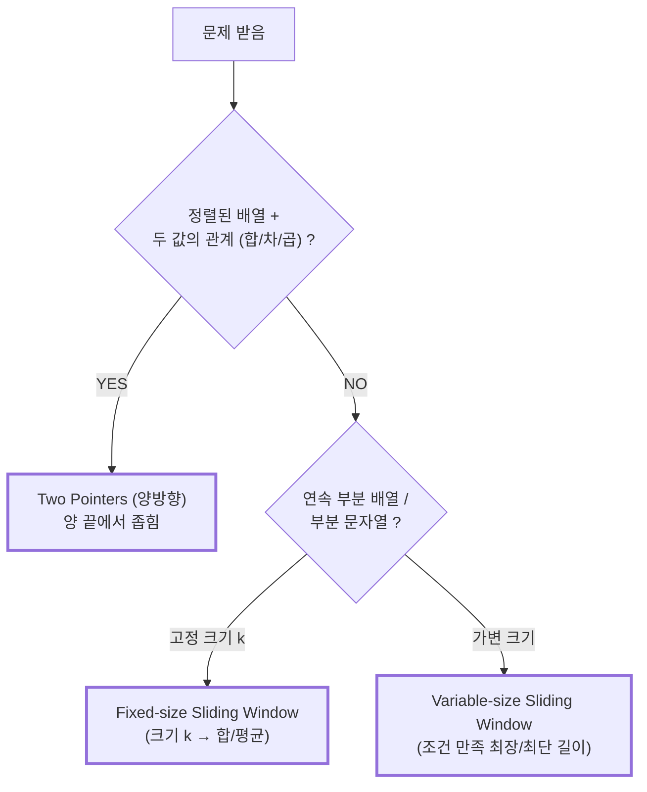

# Module 03 — Two Pointers & Sliding Window

<!-- DV-SKOOL-CH-CTX:start -->
<div class="chapter-context" data-cat="applied">
  <a class="chapter-back" href="../">
    <span class="chapter-back-arrow">←</span>
    <span class="chapter-back-icon">📐</span>
    <span class="chapter-back-text">BigTech Algorithm</span>
  </a>
  <span class="chapter-divider">›</span>
  <span class="chapter-marker">Module 03</span>
</div>
<!-- DV-SKOOL-CH-CTX:end -->

<!-- DV-SKOOL-CH-TOC:start -->
<div class="page-toc">
  <span class="page-toc-label">목차</span>
  <a class="page-toc-link" href="#1-why-care-이-모듈이-왜-필요한가">1. Why care?</a>
  <a class="page-toc-link" href="#2-intuition-비유와-한-장-그림">2. Intuition</a>
  <a class="page-toc-link" href="#3-작은-예-정렬된-배열에서-target10의-쌍-찾기">3. 작은 예 — Two Pointers 추적</a>
  <a class="page-toc-link" href="#4-일반화-언제-tp-언제-sw">4. 일반화</a>
  <a class="page-toc-link" href="#5-디테일-fixed-variable-window-코드-invariants">5. 디테일</a>
  <a class="page-toc-link" href="#6-흔한-오해-와-디버그-체크리스트">6. 흔한 오해 + 디버그</a>
  <a class="page-toc-link" href="#7-핵심-정리-key-takeaways">7. 핵심 정리</a>
</div>
<!-- DV-SKOOL-CH-TOC:end -->

!!! objective "학습 목표"
    이 모듈을 마치면:

    - **Distinguish** Two Pointers (TP) 와 Sliding Window (SW) 의 정의를 명확히 구분할 수 있다.
    - **Explain** 정렬된 배열에서 Two Pointers 가 O(N) 으로 가능한 이유를 설명할 수 있다.
    - **Apply** "최대 부분 합", "중복 없는 가장 긴 부분 문자열", "정렬된 배열 짝 찾기" 같은 전형 문제를 풀 수 있다.
    - **Analyze** Window 의 expand / shrink 조건을 invariant 로 명세할 수 있다.
    - **Evaluate** Two Pointers vs Hash Map vs Sorting 의 trade-off 를 비교 평가할 수 있다.

!!! info "사전 지식"
    - Module 01–02 (Big-O, Hash Map)
    - 배열 인덱스 조작에 대한 자신감, 부등호의 invariant 직관

---

## 1. Why care? — 이 모듈이 왜 필요한가

### 1.1 시나리오 — _O(1) 공간_ 의 가치

당신은 면접에서 hash map (O(N) space) 으로 문제 풀었음. 면접관:

> "**O(1) space 로 풀 수 있나요?**"

이 후속 질문에 _답하지 못하면_ — Hash Map _solution 만 외운_ 인상. 답하면 — _패턴 사고_ 가 깊다는 인상.

**Two Pointers** 가 답인 경우 30%:
- 배열이 _정렬됨_.
- 두 위치 (start, end) 만 추적 → O(1) extra space.
- 한 pointer 이동 = O(1), 전체 N 번 이동 = O(N) 시간.

**Sliding Window** 의 가치 (연속 부분 배열 문제):
- "K-길이 부분 배열" → _하나씩 옮겨_, 새 element 추가 / 빠진 element 제거.
- _다시 합산 X_, O(1) per step → 전체 O(N).

Two Pointers / Sliding Window 는 **추가 메모리 없이** O(N) 으로 풀리는 강력한 도구입니다. Hash Map 풀이의 30% 는 정렬만 가능하면 Two Pointers 로 _O(1) 공간_ 에 다시 풀 수 있고, "연속 부분 배열 / 부분 문자열" 류 문제는 거의 모두 Sliding Window 로 일반화됩니다.

이 모듈을 건너뛰면 면접에서 "메모리 O(1) 풀이도 가능한가요?" 라는 후속 질문에 막힙니다. 반대로 invariant 로 Window 를 _글로 적는_ 습관이 잡히면, 이후 Stack / DP 의 상태 정의에도 같은 사고방식을 그대로 사용할 수 있습니다.

!!! question "🤔 잠깐 — Two pointers 의 _수렴 보장_?"
    left=0, right=N-1. 둘이 _영원히_ 안 만날 수도? 어떤 _불변식_ 이 수렴 보장?

    ??? success "정답"
        **각 step 마다 한 pointer 가 _다른 pointer 방향으로_ 움직임**.

        - sum < K → left++ (오른쪽으로).
        - sum > K → right-- (왼쪽으로).
        - 둘 다 안 움직이면 _stuck_ → 무한 루프.

        Invariant: `(right - left)` 가 _strictly 감소_. N step 이면 left == right 도달 → 종료.

        면접 답변 시 명시: "_매 step 마다 window size 줄어드므로 N step 안에 종료_".

---

## 2. Intuition — 비유와 한 장 그림

!!! tip "💡 한 줄 비유"
    **Two Pointers** ≈ **양 끝에서 좁혀가는 사진 trim** — 위/아래 가장자리부터 안으로 좁히며 _남길 영역_ 을 결정.<br>
    **Sliding Window** ≈ **신축 가능한 봉투** — 오른쪽 끝을 늘려 새 원소를 넣고, 조건을 어기면 왼쪽 끝을 안으로 당겨 가장 작은/큰 _유효_ 봉투를 유지.

### 한 장 그림 — 두 패턴의 포인터 움직임

```
   Two Pointers (양방향 좁힘)            Sliding Window (단방향 expand/shrink)
   ─────────────────────────────          ──────────────────────────────────
   index:  0  1  2  3  4  5  6            index:  0  1  2  3  4  5  6  7
                                                                              
   nums:  [1  3  5  7  9 11 13]           s:    [a  b  c  a  b  c  b  b]
            ▲                 ▲                   ▲           ▲           
           left            right                  left       right        
                                                                          
   조건: 합이 너무 크면 right--         조건: 윈도우 안에 중복 발견 →    
         합이 너무 작으면 left++              left = (중복 다음 위치)   
                                                                          
   움직임:                                움직임:                         
     left  ────►                            left  ──────►                 
                ◄──── right                       right ──────►           
                                                                          
   경계 조건: left < right                경계 조건: right < n             
   (서로 만나면 끝)                         (배열 끝까지 expand)            
```

### 왜 이렇게 설계됐는가 — Design rationale

**Two Pointers** 는 _정렬된 입력의 monotonic 성질_ 에 의존합니다. "합이 target 보다 크다 → right 를 줄이는 게 옳다" 는 _정렬_ 덕분에 보장됩니다. 정렬이 깨지면 패턴이 무너집니다.

**Sliding Window** 는 _연속성 + invariant_ 에 의존합니다. 오른쪽으로 한 칸 늘릴 때마다 invariant 가 깨질 수 있고, 그러면 왼쪽을 _더 이상 깨지지 않을 때까지_ 당깁니다. left 는 _절대 후퇴하지 않아_ 총 비용이 O(N) (left 와 right 각각 최대 N 번 이동).

두 패턴 모두 **공간 O(1) 또는 O(k)** (k = window 안 distinct 종류 수) 만 사용. Hash Map 의 O(N) 메모리 대비 압도적 이점.

---

## 3. 작은 예 — 정렬된 배열에서 target=10 의 쌍 찾기

가장 단순한 시나리오. **`nums = [1, 3, 5, 7, 11]`** (정렬됨), **`target = 10`** 인 두 인덱스 쌍 찾기.

### 단계별 추적

```
   index:  0    1    2    3    4
   value:  1    3    5    7   11
            ▲                   ▲
           left                right
                  
   ┌─ Step 1 ──────────────────────────────────────────────┐
   │  left=0, right=4 → nums[0]+nums[4] = 1+11 = 12        │
   │  12 > target(10) → right-- (큰 쪽을 줄여야)            │
   └────────────────────────────────────────────────────────┘
   index:  0    1    2    3    4
            ▲              ▲
           left            right

   ┌─ Step 2 ──────────────────────────────────────────────┐
   │  left=0, right=3 → 1+7 = 8                             │
   │  8 < target(10) → left++ (작은 쪽을 키워야)            │
   └────────────────────────────────────────────────────────┘
   index:  0    1    2    3    4
                 ▲         ▲
                left      right

   ┌─ Step 3 ──────────────────────────────────────────────┐
   │  left=1, right=3 → 3+7 = 10                            │
   │  10 == target → Found! [1, 3]   ⭐                     │
   └────────────────────────────────────────────────────────┘
```

### 단계별 의미

| Step | 누가 | 무엇을 | 왜 |
|------|------|--------|-----|
| ① | init | `left=0, right=n-1=4` | 양 끝에서 시작 |
| ② | sum | `nums[0]+nums[4]=12` | 가장 큰 값 + 가장 작은 값 |
| ③ | compare | `12 > 10` → 합이 큼 | 정렬돼 있으니 right 를 줄이면 합이 줄어듦 |
| ④ | move | `right--` (4→3) | _큰 쪽을_ 작게 |
| ⑤ | sum | `1+7=8` | |
| ⑥ | compare | `8 < 10` → 합이 작음 | left 를 늘리면 합이 커짐 |
| ⑦ | move | `left++` (0→1) | _작은 쪽을_ 크게 |
| ⑧ | sum | `3+7=10` 일치 | return [1, 3] |

```python
def two_sum_sorted(nums, target):
    left, right = 0, len(nums) - 1
    while left < right:                        # 서로 만나면 종료
        s = nums[left] + nums[right]
        if   s == target: return [left, right]
        elif s <  target: left  += 1           # 더 큰 합 필요
        else:             right -= 1           # 더 작은 합 필요
    return []
```

!!! note "여기서 잡아야 할 두 가지"
    **(1) 매 step 마다 _하나의 포인터만_ 움직인다** — 둘 다 움직이면 정답을 건너뛸 수 있습니다. 어느 쪽을 움직일지는 _합이 target 과 어떻게 다른지_ 가 결정.<br>
    **(2) 정렬된 입력이라는 invariant 가 진짜 핵심** — 정렬이 깨지면 "오른쪽 끝이 가장 큰 값" 이 보장되지 않아 결정이 무너집니다. 정렬이 안 되어 있다면 _Hash Map 으로 가야_ 합니다 (Module 02).

---

## 4. 일반화 — 언제 TP, 언제 SW?

### 4.1 신호 매핑



### 4.2 키워드 → 패턴

| 문제의 키워드 | 후보 패턴 |
|---|---|
| "정렬됨 + 두 값 합" | Two Pointers (양 끝) |
| "정렬됨 + 두 값 차" | Two Pointers (같은 방향) |
| "연속 부분 / 길이 k" | Fixed-size Sliding Window |
| "가장 긴 / 가장 짧은 부분" | Variable-size Sliding Window |
| "K-개 distinct" | Variable Sliding Window + count map |

### 4.3 Window Invariant 명세 — 모든 SW 의 핵심

```
   가변 Sliding Window 템플릿:

   left = 0
   for right in range(n):
       window 에 s[right] 추가              ← expand
       while (window 조건 위반):
           window 에서 s[left] 제거
           left++                            ← shrink
       max_len = max(max_len, right-left+1) ← record
```

핵심: "window 조건" 을 _글로 명세_ 하고 (예: "윈도우 안에 중복 문자가 없다") 그 invariant 를 _깨지지 않게 유지_ 하는 것이 코드의 전부입니다.

---

## 5. 디테일 — Fixed/Variable Window, 코드, Invariants

### 5.1 Two Pointers — 두 가지 사용법

#### (a) 양 끝에서 좁히기 (정렬된 배열의 짝 찾기)

```
조건: 정렬된 배열 + 두 값의 관계(합, 차)를 찾는 문제
방법: 양 끝에서 시작, 조건에 따라 한쪽을 이동
복잡도: O(n) 시간, O(1) 공간

패턴 인식:
   "정렬된 배열에서 두 수의 합이 X 인 쌍" → Two Pointers
   "정렬된 배열에서 차이가 K 인 쌍" → Two Pointers (같은 방향)
```

#### (b) 같은 방향 (차이 찾기)

```
nums = [1, 3, 5, 7, 11], diff = 6

   first=0, second=1: 3-1=2 < 6 → second++ (차이 부족)
   first=0, second=2: 5-1=4 < 6 → second++
   first=0, second=3: 7-1=6 == 6 → Found!

주의: while 조건은 "배열 범위 체크" (second < nums.size())
      포인터 비교 (first < second) 가 아님!
```

### 5.2 Fixed-size Sliding Window — Dry Run

```
문제: 크기 k=3 인 연속 부분 배열의 최대 합
nums = [2, 1, 5, 1, 3, 2]

Brute Force O(nk): 매번 k 개 원소 합산
   [2,1,5]=8, [1,5,1]=7, [5,1,3]=9, [1,3,2]=6 → 최대 9

Sliding Window O(n): 새 원소 추가 + 오래된 원소 제거
   초기 윈도우: [2,1,5] sum=8, max=8

   i=3: +nums[3] -nums[0] = +1-2 → sum=7, max=8
        윈도우: [1,5,1]

   i=4: +nums[4] -nums[1] = +3-1 → sum=9, max=9
        윈도우: [5,1,3]

   i=5: +nums[5] -nums[2] = +2-5 → sum=6, max=9
        윈도우: [1,3,2]

   답: 9   (O(n), 매 step 에서 정확히 2 번의 연산)
```

### 5.3 Longest Substring Without Repeating Characters (LeetCode #3) — 완전 Dry Run

```
문제: 중복 없는 가장 긴 부분 문자열의 길이
s = "abcabcbb"

사고 과정:
   1. "연속 부분 문자열" + "가장 긴" → 가변 Sliding Window
   2. 조건 위반 = "윈도우 안에 중복 문자가 있음"
   3. Hash Map 으로 각 문자의 마지막 위치를 추적

Dry Run (seen = 문자의 마지막 인덱스):
   left=0

   right=0: s[0]='a'
     seen 에 'a' 없음 → seen['a']=0
     윈도우 "a", 길이=1, max=1

   right=1: s[1]='b'
     seen 에 'b' 없음 → seen['b']=1
     윈도우 "ab", 길이=2, max=2

   right=2: s[2]='c'
     seen 에 'c' 없음 → seen['c']=2
     윈도우 "abc", 길이=3, max=3

   right=3: s[3]='a'
     seen 에 'a' 있음! seen['a']=0 ≥ left(0)
     → left = 0 + 1 = 1   (중복 'a' 다음으로 이동)
     → seen['a']=3
     윈도우 "bca", 길이=3, max=3

   right=4: s[4]='b'
     seen['b']=1 ≥ left(1) → left=2 → seen['b']=4
     윈도우 "cab", 길이=3, max=3

   right=5: s[5]='c'
     seen['c']=2 ≥ left(2) → left=3 → seen['c']=5
     윈도우 "abc", 길이=3, max=3

   right=6: s[6]='b'
     seen['b']=4 ≥ left(3) → left=5 → seen['b']=6
     윈도우 "cb", 길이=2, max=3

   right=7: s[7]='b'
     seen['b']=6 ≥ left(5) → left=7 → seen['b']=7
     윈도우 "b", 길이=1, max=3

   답: 3

핵심 포인트:
   - seen[char] >= left 체크가 중요 — 윈도우 밖의 오래된 기록은 무시
   - left 는 항상 전진만 함 (후퇴하면 이미 제거한 문자를 다시 포함하게 됨)
```

### 5.4 가변 Window — 다른 활용

```
"합이 target 이상인 가장 짧은 부분 배열" (Minimum Size Subarray Sum #209)
   → 조건 위반 = "합 < target" → right 확장
   → 조건 만족 = "합 >= target" → left 축소하며 최소 길이 갱신

"최대 k 개의 서로 다른 문자를 포함하는 가장 긴 부분 문자열"
   → 조건 위반 = "서로 다른 문자 > k" → left 축소
```

### 5.5 면접 답안 — Two Pointers vs Hash Map 선택

```
정렬 가능 + 두 값 관계 → Two Pointers (O(1) 공간)
정렬 불가 + 두 값 관계 → Hash Map (O(n) 공간)

면접에서: "정렬 가능한가요?" 질문으로 어떤 패턴을 쓸지 결정
```

**Sliding Window 키워드:** "연속", "부분 배열", "부분 문자열", "최대/최소 길이"

### 5.6 SystemVerilog 예제 코드

원본 파일: `03_two_pointers_sliding_window.sv`

```systemverilog
// =============================================================
// Unit 3: Two Pointers & Sliding Window
// =============================================================
// Two Pointers:
//   - Sorted array + find pair relationship -> Two Pointers
//   - Two pointers move based on condition (too big/too small)
//   - O(n) time, O(1) space
//   - IMPORTANT: while condition = ARRAY BOUNDS CHECK, not pointer comparison
//
// Sliding Window:
//   - "Continuous subarray/substring" -> Sliding Window
//   - Fixed window: add new, remove old
//   - Variable window: expand right, shrink left
//   - O(n) time
// =============================================================

module unit3_tp_sw;

  // ---------------------------------------------------------
  // Two Sum (sorted array): two pointers from both ends
  // ---------------------------------------------------------
  function automatic void two_sum_sorted(int nums[], int target);
    int left  = 0;
    int right = nums.size() - 1;

    while (left < right) begin
      int sum = nums[left] + nums[right];

      if (sum == target) begin
        $display("Found: [%0d, %0d]", left, right);
        return;
      end
      else if (sum < target)
        left++;      // need bigger sum -> move left forward
      else
        right--;     // need smaller sum -> move right backward
    end
    $display("Not found");
  endfunction

  // ---------------------------------------------------------
  // Find Diff: two pointers both starting from left
  // IMPORTANT: while checks ARRAY BOUNDS, not pointer relation
  // ---------------------------------------------------------
  function automatic bit has_diff(int nums[], int diff);
    int first  = 0;
    int second = 1;

    while (second < nums.size()) begin       // bounds check!
      if (first == second) begin             // same element guard
        second++;
        continue;
      end

      int result = nums[second] - nums[first];

      if (result == diff)
        return 1;
      else if (result > diff)
        first++;
      else
        second++;
    end
    return 0;
  endfunction

  // ---------------------------------------------------------
  // Max Subarray Sum (fixed window size k): Sliding Window
  // Instead of recalculating k elements each time,
  // add the new element and remove the old one -> O(n)
  // ---------------------------------------------------------
  function automatic int max_sum_window(int nums[], int k);
    int window_sum = 0;
    int max_val;

    // First window
    for (int i = 0; i < k; i++)
      window_sum += nums[i];
    max_val = window_sum;

    // Slide: +new -old
    for (int i = k; i < nums.size(); i++) begin
      window_sum += nums[i];         // new element enters
      window_sum -= nums[i - k];     // old element leaves
      if (window_sum > max_val)
        max_val = window_sum;
    end
    return max_val;
  endfunction

  // ---------------------------------------------------------
  // Longest Substring Without Repeating Characters (LeetCode #3)
  // Variable Sliding Window: expand right, shrink left on violation
  //   - seen[char] tracks last index of each character
  //   - When duplicate found IN window (seen[c] >= left):
  //     move left past the duplicate
  // ---------------------------------------------------------
  function automatic int longest_unique_substr(string s);
    int seen[byte];   // {character: last_index}
    int left    = 0;
    int max_len = 0;

    for (int right = 0; right < s.len(); right++) begin
      byte c = s[right];

      // If char was seen and is inside current window
      if (seen.exists(c) && seen[c] >= left)
        left = seen[c] + 1;  // shrink: move past duplicate

      seen[c] = right;       // update last seen position

      if (right - left + 1 > max_len)
        max_len = right - left + 1;
    end
    return max_len;
  endfunction

  // ---------------------------------------------------------
  // Test
  // ---------------------------------------------------------
  initial begin
    int sorted[] = '{1, 3, 5, 7, 11};
    two_sum_sorted(sorted, 12);      // Expected: Found: [0, 4]

    $display("has_diff(7): %0b", has_diff(sorted, 7));  // Expected: 1
    $display("has_diff(6): %0b", has_diff(sorted, 6));  // Expected: 0

    int arr[] = '{2, 1, 5, 1, 3, 2};
    $display("max_sum(k=3): %0d", max_sum_window(arr, 3)); // Expected: 9

    $display("longest(abcabcbb): %0d", longest_unique_substr("abcabcbb")); // 3
    $display("longest(bbbbb): %0d",    longest_unique_substr("bbbbb"));    // 1
    $display("longest(pwwkew): %0d",   longest_unique_substr("pwwkew"));   // 3
  end

endmodule
```

---

## 6. 흔한 오해 와 디버그 체크리스트

### 흔한 오해

!!! danger "❓ 오해 1 — 'Two Pointers 와 Sliding Window 는 같은 패턴'"
    **실제**: Two Pointers = _양방향 좁힘_ (대개 정렬된 입력), Sliding Window = _invariant 유지하며 expand/shrink_. 입력 조건 (정렬 vs 연속), 포인터 움직임 (반대 vs 같은 방향), 종료 조건 (만나면 vs 끝까지) 가 모두 다름.<br>
    **왜 헷갈리는가**: 둘 다 "포인터 두 개" 사용 → 시각적 유사성 때문에 같은 것으로 묶임.

!!! danger "❓ 오해 2 — 'left 는 후퇴할 수 있다'"
    **실제**: Sliding Window 의 **left 는 절대 후퇴하지 않습니다**. 만약 후퇴하면 이미 제거한 문자를 다시 포함하게 되고, O(N²) 으로 떨어집니다. left/right 가 각각 N 번씩 전진해 총 2N 회 이동, 그래서 O(N).<br>
    **왜 헷갈리는가**: "최적해를 놓치지 않으려면 되돌아가야 한다" 는 brute-force 직관.

!!! danger "❓ 오해 3 — 'while (lo < hi) 와 while (lo <= hi) 는 같다'"
    **실제**: `lo < hi` 는 _서로 다른 두 인덱스_ 를 보장 (두 점이 만나면 종료), `lo <= hi` 는 _자기 자신과의 짝_ 을 허용. Two Sum sorted 에서 `[a, a]` 같은 동일 원소 두 번 사용을 허용할지에 따라 _문제의 의미_ 가 갈립니다.<br>
    **왜 헷갈리는가**: invariant 를 글로 적지 않으면 매번 흔들림.

!!! danger "❓ 오해 4 — 'Sliding Window 는 항상 더 빠르다'"
    **실제**: window 안에서 _max/min_ 같은 추가 query 가 필요하면 deque (monotonic) 같은 보조 자료구조가 필요해집니다. Hash Map + Sliding Window + Monotonic Deque 가 같이 등장하는 문제 (Sliding Window Maximum #239) 는 단순 SW 보다 어렵습니다.<br>
    **왜 헷갈리는가**: "O(N) 이면 이미 최적" 이라는 가정.

### 디버그 체크리스트

| 증상 | 1차 의심 | 어디 보나 |
|---|---|---|
| Two Sum sorted 가 같은 인덱스를 두 번 더함 | `while (lo <= hi)` 인지 `lo < hi` 인지 | 문제 제약 ("같은 원소 두 번 가능?") 와 부등호 일치 여부 |
| Two Pointers 풀이가 답을 건너뜀 | 매 step 에 _둘 다_ 움직임 (한 쪽만 움직여야) | if/elif/else 의 어느 분기에서 누가 ++/-- 하는지 |
| Sliding Window 가 O(N²) 로 떨어짐 | left 가 후퇴하거나, inner while 이 무한루프 | left 의 값이 단조증가하는지 (printf 로 확인) |
| Longest Unique Substring 이 윈도우 밖 기록을 답에 사용 | `seen[c] >= left` 체크 누락 | 모든 hash hit 후 _현재 윈도우 안인지_ 검증 |
| Fixed window 의 첫 윈도우 합산이 빠짐 | 초기화 루프 (`for i in 0..k`) 누락 | 첫 k 개 합산 후 max 시드 |
| `has_diff` 가 무한 루프 | while 조건이 `first<second` 인데 둘 다 같은 방향 진행 | 종료 조건은 _배열 경계_ (`second<n`) 여야 함 |
| 음수 값 포함 시 답이 틀림 | "정렬 = 양수 가정" 이 무의식 | invariant 다시 적기 — 정렬이면 음수도 OK |
| Variable SW 가 빈 윈도우 (`left>right`) 인 채로 계산 | shrink 가 _일찍_ left 를 너무 당김 | 답 갱신을 expand _이후_ shrink _이후_ 에 두었는지 |

---

## 7. 핵심 정리 (Key Takeaways)

- **Two Pointers** — 보통 정렬된 배열 / 양 끝에서 좁혀가는 구조. 정렬 invariant 가 결정의 근거.
- **Sliding Window** — 부분 배열/문자열의 invariant 유지 (window expand → 조건 위반 → shrink).
- **Window 조건의 명세** — invariant 를 _글로_ 적어 보면 버그가 줄어든다.
- **메모리 ↓** — hash map 풀이 대비 공간을 거의 쓰지 않는다 (O(1) ~ O(k)).
- **정렬 비용 고려** — 입력이 정렬 가능하면 O(N log N) + O(N) 이 hash map 의 O(N) 보다 종종 깔끔.

!!! warning "실무 주의점"
    - **Off-by-one** 의 주범 = `lo<hi` vs `lo<=hi` 의 의미 차이. 매 문제에 invariant 한 줄 적기.
    - **Left 후퇴 금지** — sliding window 에서 left 가 후퇴하면 O(N²) 함정.
    - **양/음수 혼합 입력** — 정렬 + 부호 혼합이면 abs/sign 고려해 invariant 재검증.

### 7.1 자가 점검

!!! question "🤔 Q1 — Longest substring without repeat (Bloom: Apply)"
    "abcabcbb" 의 최장 unique substring. Sliding window 알고리즘?

    ??? success "정답"
        ```python
        seen = {}  # char → index
        left = 0
        max_len = 0
        for right, ch in enumerate(s):
            if ch in seen and seen[ch] >= left:
                left = seen[ch] + 1
            seen[ch] = right
            max_len = max(max_len, right - left + 1)
        ```
        O(N). 답: "abc" 길이 **3**.

        Window 가 expand (right++) / shrink (left jump) 만 — left 절대 후퇴 안 함.

!!! question "🤔 Q2 — Sorted array two sum (Bloom: Analyze)"
    정렬된 배열. Two pointers vs binary search 효율?

    ??? success "정답"
        - **Two pointers**: O(N) — 각 element 가 _최대 한 번_ visit.
        - **Binary search**: O(N log N) — 각 element 마다 complement binary search.

        Two pointers 우월. 단 _정렬 안 됨_ + 정렬해야 한다면 O(N log N), 그 후 two pointers 도 가능. Hash map (O(N) + O(N) space) 와 비교.

### 7.2 출처

**External**
- *Introduction to Algorithms* — CLRS
- *Cracking the Coding Interview* — Gayle Laakmann McDowell

---

## 다음 모듈

→ [Module 04 — Stack & Binary Search](04_stack_binary_search_explained.md): 정렬된 배열의 다른 활용 + "최근에 본 것" 문제의 표준 도구.

[퀴즈 풀어보기 →](quiz/03_two_pointers_sliding_window_explained_quiz.md)

<div class="chapter-nav">
  <a class="nav-prev" href="../02_array_hashmap_explained/">
    <div class="nav-label">◀ 이전</div>
    <div class="nav-title">Array & Hash Map (연관 배열)</div>
  </a>
  <a class="nav-next" href="../04_stack_binary_search_explained/">
    <div class="nav-label">다음 ▶</div>
    <div class="nav-title">Stack & Binary Search</div>
  </a>
</div>


--8<-- "abbreviations.md"
