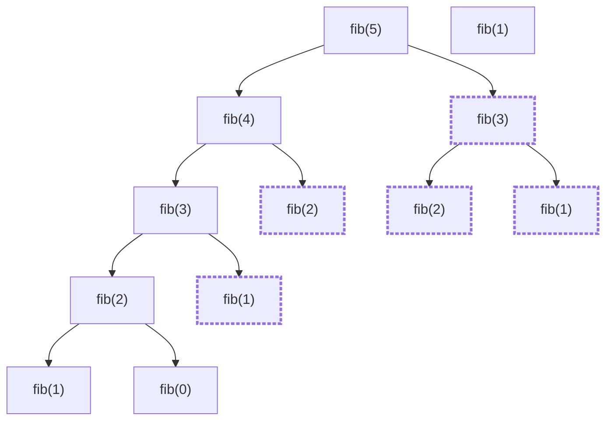

# Module 06 — Dynamic Programming

<!-- DV-SKOOL-CH-CTX:start -->
<div class="chapter-context" data-cat="applied">
  <a class="chapter-back" href="../">
    <span class="chapter-back-arrow">←</span>
    <span class="chapter-back-icon">📐</span>
    <span class="chapter-back-text">BigTech Algorithm</span>
  </a>
  <span class="chapter-divider">›</span>
  <span class="chapter-marker">Module 06</span>
</div>
<!-- DV-SKOOL-CH-CTX:end -->

<!-- DV-SKOOL-CH-TOC:start -->
<div class="page-toc">
  <span class="page-toc-label">목차</span>
  <a class="page-toc-link" href="#1-why-care-이-모듈이-왜-필요한가">1. Why care?</a>
  <a class="page-toc-link" href="#2-intuition-비유와-한-장-그림">2. Intuition</a>
  <a class="page-toc-link" href="#3-작은-예-climbing-stairs-n5-bottom-up-한-셀씩-채우기">3. 작은 예 — Climbing Stairs (n=5)</a>
  <a class="page-toc-link" href="#4-일반화-dp-3-단계-공식과-state-설계">4. 일반화</a>
  <a class="page-toc-link" href="#5-디테일-구현-방식-house-robber-공간-최적화-코드">5. 디테일</a>
  <a class="page-toc-link" href="#6-흔한-오해-와-디버그-체크리스트">6. 흔한 오해 + 디버그</a>
  <a class="page-toc-link" href="#7-핵심-정리-key-takeaways">7. 핵심 정리</a>
</div>
<!-- DV-SKOOL-CH-TOC:end -->

!!! objective "학습 목표"
    이 모듈을 마치면:

    - **Define** DP 의 두 조건(Optimal Substructure, Overlapping Subproblems) 을 정의할 수 있다.
    - **Explain** Top-down (memoization) 과 Bottom-up (tabulation) 을 비교 설명할 수 있다.
    - **Apply** 1D DP (Climbing Stairs, House Robber), 2D DP (LCS, Edit Distance) 를 구현할 수 있다.
    - **Analyze** DP 의 state 정의가 잘못된 경우의 증상(중복 / 무한 / 답 누락) 을 진단할 수 있다.
    - **Evaluate** 같은 문제에 DP / Greedy / DFS+memo 의 trade-off 를 평가할 수 있다.

!!! info "사전 지식"
    - Module 01–05
    - 재귀 + memoization 한 번이라도 작성한 경험, 점화식의 의미

---

## 1. Why care? — 이 모듈이 왜 필요한가

### 1.1 시나리오 — Exponential → Polynomial

문제: "_N 개 동전_ 으로 _금액 K_ 만들기. 최소 동전 수?"

**Brute force (재귀)**: 각 동전을 _사용/불사용_ 결정. **O(2^N)**. N=30 이면 10⁹ → 1초.

**DP**: `dp[k] = 금액 k 만드는 최소 동전 수`. 점화식: `dp[k] = min(dp[k - c] + 1) for c in coins`. **O(N × K)**.

N=30, K=10⁴ → 3×10⁵ 연산 → 즉시.

**DP 의 가치**: _overlapping subproblems_ + _optimal substructure_ → exponential 을 polynomial 로.

**5 단계 풀이 표준**:
1. **State**: 무엇을 dp[i] 가 나타내는가?
2. **Recurrence**: dp[i] 가 dp[j<i] 들로 어떻게 표현되는가?
3. **Base case**: dp[0] 또는 가장 작은 case.
4. **Iteration order**: bottom-up (반복문) 또는 top-down (memoization).
5. **Space optimization**: dp[i] 가 _최근 k 개_ 만 보면 → O(1) space.

DP 는 면접관이 _reasoning depth_ 를 가장 좋아하는 패턴입니다. **상태 정의 → 점화식 → 베이스 케이스 → 구현 → 최적화** 의 5 단계 표준 풀이를 만들 수 있으면 거의 모든 DP 문제를 풀 수 있고, 이 표준은 운영 코드(parsing, scoring, scheduling) 에도 그대로 등장합니다.

이 모듈을 건너뛰면 "경우의 수 / 최대-최소 / 가능한가?" 류 문제에서 _exponential brute force_ 를 그대로 제출하게 됩니다. 반대로 _state 한 줄 정의_ 와 _점화식 한 줄_ 을 _코드 작성 전_ 에 적는 습관이 잡히면, DP 문제가 _얼개_ 와 _세부 구현_ 으로 깔끔하게 분리되어 빨라집니다.

!!! question "🤔 잠깐 — DP _vs Greedy_?"
    어떤 문제는 _greedy_ (각 step _최선_ 선택) 로도 풀림. 언제 DP 가 필요하고 언제 greedy 면 충분?

    ??? success "정답"
        **Greedy** 는 _현재 결정이 미래에 영향 없는_ 경우 (또는 _exchange argument_ 가능).

        - Coin change (US 동전: 25, 10, 5, 1): _greedy 통함_.
        - Coin change (random 동전: 1, 3, 4): _greedy 실패_ (예: 6 = 3+3 인데 greedy 는 4+1+1). _DP 필요_.

        결정 방법: 작은 example 으로 _greedy 가 실패_ 하는지 시도. 실패하면 DP.

        면접 답변: _두 접근 모두 시도_. Greedy 가 _증명_ 가능하면 채택 (간단), 안 되면 DP.

---

## 2. Intuition — 비유와 한 장 그림

!!! tip "💡 한 줄 비유"
    **DP** ≈ **수학 문제 풀 때 "이미 푼 부분 문제" 를 메모해 두기** — 같은 부분 문제를 두 번 계산하지 않고, 표(또는 해시) 에서 꺼내 쓴다.<br>
    Brute force 의 _exponential 재계산_ 이, DP 에서는 _polynomial 한 번씩_ 으로 줄어든다 (subproblem 수 × subproblem 당 work).

### 한 장 그림 — Brute force vs Memoization vs Tabulation

**Brute Force (재귀, 중복 계산) — O(2ⁿ)**



→ `fib(3)`, `fib(2)` 가 **여러 번 재계산** (점선 표시) → 시간 O(2ⁿ).

**Top-down DP (memoization) — O(N)**

```
cache = {}
fib(5):
   cache 에 있나? NO → 계산 → cache 에 저장
fib(4):
   cache 에 있나? YES → return
→ 각 fib(i) 가 _단 한 번_ 계산 → 시간 O(N)
```

**Bottom-up DP (tabulation) — O(N) 시간, 공간 O(N) → O(1) 가능**

```
dp:  [0]  [1]  [?]  [?]  [?]  [?]
      ▲    ▲                       ← base
      │    │
for i = 2..n:
   dp[i] = dp[i-1] + dp[i-2]
→ 작은 답부터 큰 답으로
```

### 왜 이렇게 설계됐는가 — Design rationale

DP 가 적용되려면 두 조건이 필요합니다:

1. **Optimal Substructure** — 큰 답이 작은 답들의 _결정론적_ 조합. (`dp[i] = f(dp[i-1], dp[i-2], ...)`)
2. **Overlapping Subproblems** — 같은 작은 문제가 _여러 번_ 등장. (없으면 단순 재귀로 충분)

이 두 조건이 모두 갖춰질 때만 "메모 → 한 번씩 계산" 의 이득이 발생합니다. _둘 중 하나만_ 있으면 DP 가 아닌 다른 패턴 (Greedy, divide-and-conquer 등) 이 더 적합.

---

## 3. 작은 예 — Climbing Stairs (n=5) Bottom-up 한 셀씩 채우기

가장 단순한 시나리오. **1 칸 또는 2 칸** 씩 올라가 `n=5` 번째 계단에 도달하는 경우의 수.

### 단계별 추적

```
   3 단계 표준 풀이 (코드 작성 전):
   ┌──────────────────────────────────────────────────────┐
   │  1. dp[i] = i 번째 계단에 도달하는 경우의 수            │
   │  2. dp[i] = dp[i-1] + dp[i-2]                         │
   │     · i-1 에서 +1 칸                                  │
   │     · i-2 에서 +2 칸                                  │
   │  3. dp[0] = 1 (시작점), dp[1] = 1                     │
   └──────────────────────────────────────────────────────┘

   표 채우기 (n=5):

   index:    0    1    2    3    4    5
   dp:      [1] [1] [_] [_] [_] [_]
             ▲   ▲   ↑
            base    여기부터 채움

   ┌─ i=2 ─────────────────────────────────────┐
   │  dp[2] = dp[1] + dp[0] = 1 + 1 = 2          │
   └─────────────────────────────────────────────┘
   index:    0    1    2    3    4    5
   dp:      [1] [1] [2] [_] [_] [_]

   ┌─ i=3 ─────────────────────────────────────┐
   │  dp[3] = dp[2] + dp[1] = 2 + 1 = 3          │
   └─────────────────────────────────────────────┘
   index:    0    1    2    3    4    5
   dp:      [1] [1] [2] [3] [_] [_]

   ┌─ i=4 ─────────────────────────────────────┐
   │  dp[4] = dp[3] + dp[2] = 3 + 2 = 5          │
   └─────────────────────────────────────────────┘
   index:    0    1    2    3    4    5
   dp:      [1] [1] [2] [3] [5] [_]

   ┌─ i=5 ─────────────────────────────────────┐
   │  dp[5] = dp[4] + dp[3] = 5 + 3 = 8   ⭐    │
   └─────────────────────────────────────────────┘
   index:    0    1    2    3    4    5
   dp:      [1] [1] [2] [3] [5] [8]
                                 ▲
                                답 = 8

   검증 (열거): 11111, 1112, 1121, 1211, 2111, 122, 212, 221  →  8 가지 ✓
```

### 단계별 의미

| Step | 누가 | 무엇을 | 왜 |
|------|------|--------|-----|
| ① | state def | `dp[i] = i 계단 도달 경우의 수` | 한 줄로 명시 — _다른 의미_ 가 못 들어옴 |
| ② | recurrence | `dp[i] = dp[i-1] + dp[i-2]` | 마지막 step 이 +1 또는 +2 → 두 부분 문제의 합 |
| ③ | base | `dp[0]=1, dp[1]=1` | 출발점과 첫 칸의 자명한 경우 |
| ④ | iteration | i=2..n 에서 표를 _작은 i 부터_ 채움 | bottom-up = 의존하는 답이 _이미_ 채워져 있음 |
| ⑤ | answer | `return dp[n]` | 표의 마지막 칸 |

```python
def climb_stairs(n):
    dp = [0] * (n + 1)
    dp[0], dp[1] = 1, 1
    for i in range(2, n + 1):
        dp[i] = dp[i-1] + dp[i-2]
    return dp[n]
```

!!! note "여기서 잡아야 할 두 가지"
    **(1) state 정의가 _코드 작성 전_ 에 한 줄로 적혀야 한다** — "dp[i] = ..." 의 명세가 흐릿하면 점화식이 흔들리고, 점화식이 흔들리면 base case 도 무너집니다. _state → 점화식 → base_ 의 순서.<br>
    **(2) `dp[i]` 가 `dp[i-1]` 과 `dp[i-2]` 에만 의존** — _배열 전체 O(N)_ 가 필요 없고 _변수 2 개 O(1)_ 면 충분. 이게 §5 의 _공간 최적화_ 입니다.

---

## 4. 일반화 — DP 3 단계 공식과 State 설계

### 4.1 DP 신호 → 패턴 매핑

```
   문제의 키워드:
   ┌──────────────────────────────────────────────┐
   │  "경우의 수"                                   │   → Counting DP
   │  "최소 비용 / 최대 값"                          │   → Optimization DP
   │  "가능한가? (boolean)"                         │   → Boolean DP
   │  "이전 선택이 다음에 영향"                       │   → State transition
   │  "가장 긴 / 가장 짧은 부분 문자열"               │   → LIS / LCS
   └──────────────────────────────────────────────┘
```

### 4.2 DP 3 단계 공식 (모든 DP 문제에 적용)

```
   1 단계: 상태 정의   →  dp[i] (또는 dp[i][j]) 는 무엇을 의미?
   2 단계: 점화식      →  dp[i] = f(dp[i-1], dp[i-2], ...) 의 식
   3 단계: 기저 조건   →  dp[0] = ?, dp[1] = ?

   이 3 단계를 _먼저 정의_ 하고 코드를 작성하라!
   코드부터 쓰면 길을 잃는다.
```

### 4.3 State 설계의 두 함정

| 함정 | 증상 | 해결 |
|---|---|---|
| **차원 누락** | 0/1 knapsack 을 `dp[i]` 1D 로 풀어 다른 capacity 가 같은 cell 에 덮어씀 | `dp[i][w]` 로 (item, weight) 둘 다 명시 |
| **의미 모호** | 같은 입력에 두 가지 답을 받음 | "i 번째까지 _고려_ vs _포함_" 처럼 정확히 한 가지 의미로 고정 |

State 정의의 _자기 검증 질문_: "같은 입력 → 같은 답" 이 보장되는가? (deterministic)

---

## 5. 디테일 — 구현 방식, House Robber, 공간 최적화, 코드

### 5.1 DP 란 무엇인가 (정의 보강)

```
DP = 큰 문제를 작은 부분 문제로 나누고, 결과를 저장하여 재사용

DP 가 적용되는 2 가지 조건:
   1. 최적 부분 구조: 큰 답 = 작은 답들의 조합
   2. 중복 부분 문제: 같은 작은 문제가 여러 번 계산됨

키워드: "경우의 수", "최소 비용", "최대 값", "가능한가?", "이전 선택이 다음에 영향"
```

### 5.2 구현 방식 비교

| 방식 | 원리 | 장단점 |
|------|------|--------|
| Top-down (메모이제이션) | 재귀 + 캐시 | 생각하기 쉬움, 스택 오버플로 위험 |
| **Bottom-up (테이블)** | for 루프 | **면접 선호**, 스택 안전, 공간 최적화 가능 |

```
Top-down:
   function fib(n, memo):
       if memo[n] exists: return memo[n]   // 캐시 히트
       memo[n] = fib(n-1) + fib(n-2)       // 계산 + 저장
       return memo[n]

Bottom-up (면접 선호):
   dp[0] = 0; dp[1] = 1;
   for (i = 2; i <= n; i++):
       dp[i] = dp[i-1] + dp[i-2];
   return dp[n];
```

### 5.3 Climbing Stairs — 공간 최적화 (면접 보너스)

```
dp[i] 가 dp[i-1] 과 dp[i-2] 에만 의존
→ 배열 전체가 아닌 변수 2 개만으로 충분!

prev2 = 1 (dp[i-2])
prev1 = 1 (dp[i-1])

i=2: curr = 1+1=2, prev2=1, prev1=2
i=3: curr = 2+1=3, prev2=2, prev1=3
i=4: curr = 3+2=5, prev2=3, prev1=5
i=5: curr = 5+3=8

→ O(n) 시간, O(1) 공간 (배열 O(n) → 변수 O(1))
→ 면접에서 "공간 최적화도 할 수 있다" 라고 말하면 보너스 점수
```

### 5.4 House Robber — Dry Run

```
문제: 인접한 집은 동시에 털 수 없다. 최대 금액은?

3 단계:
   1. dp[i] = i 번째 집까지 고려했을 때 최대 금액
   2. dp[i] = max(dp[i-1],              ← i 번째 집 건너뛰기
                  dp[i-2] + houses[i])   ← i 번째 집 털기
   3. dp[0] = houses[0]
      dp[1] = max(houses[0], houses[1])

houses = [2, 7, 9, 3, 1]:
   dp[0] = 2
   dp[1] = max(2, 7) = 7
   dp[2] = max(7, 2+9) = max(7, 11) = 11
   dp[3] = max(11, 7+3) = max(11, 10) = 11
   dp[4] = max(11, 11+1) = 12   ← 답

선택: 집0(2) + 집2(9) + 집4(1) = 12
또는: 집1(7) + 집3(3) = 10 (차선)
```

### 5.5 DP 유형별 키워드 표

| 키워드 | DP 유형 | 대표 문제 |
|--------|---------|----------|
| "경우의 수" | Counting DP | Climbing Stairs, Unique Paths |
| "최소 비용" | Optimization DP | Min Cost Stairs, Coin Change |
| "최대 값" | Optimization DP | House Robber, Maximum Subarray |
| "가능한가?" | Boolean DP | Word Break, Partition Equal Subset |
| "가장 긴" | LIS/LCS | Longest Increasing Subsequence |

### 5.6 면접 답안 템플릿

```
DP 문제를 받으면:

1. "이 문제가 DP 인가?" 판단
   → 이전 선택이 다음에 영향? → YES → DP
   → 최대/최소/경우의 수? → 아마 DP

2. 3 단계 공식을 _먼저 말하기_ (코드 전에!)
   "dp[i] 는 ~을 의미합니다"
   "점화식은 dp[i] = max(dp[i-1], dp[i-2] + val) 입니다"
   "기저 조건은 dp[0]=X, dp[1]=Y 입니다"

3. Bottom-up 으로 코딩
   → for 루프가 면접에서 선호 (재귀보다 안전)

4. 공간 최적화 언급 (보너스)
   "dp[i] 가 dp[i-1], dp[i-2] 에만 의존하므로 변수 2 개로 줄일 수 있습니다"
```

### 5.7 SystemVerilog 예제 코드

원본 파일: `06_dynamic_programming.sv`

```systemverilog
// =============================================================
// Unit 6: Dynamic Programming (DP)
// =============================================================
// Key Insight: DP = save and reuse sub-problem results
//
// 3-Step Formula (apply to EVERY DP problem):
//   Step 1: Define state   -> dp[i] means what?
//   Step 2: Recurrence     -> dp[i] = f(dp[i-1], dp[i-2], ...)
//   Step 3: Base case      -> dp[0] = ?, dp[1] = ?
//
// Two conditions for DP:
//   1. Optimal substructure: big answer = combination of small answers
//   2. Overlapping subproblems: same sub-problem computed multiple times
//
// Implementation:
//   - Top-down (memoization): recursion + cache (easier to think)
//   - Bottom-up (tabulation): for loop (preferred in interviews)
//
// Space optimization: if dp[i] only depends on dp[i-1] and dp[i-2],
//   use two variables instead of array -> O(1) space (bonus points!)
//
// DP Keywords:
//   "number of ways"           -> counting DP
//   "minimum cost / maximum"   -> optimization DP
//   "is it possible"           -> boolean DP
//   "previous choice affects"  -> state transition = DP
// =============================================================

module unit6_dp;

  // ---------------------------------------------------------
  // Climbing Stairs: dp[i] = dp[i-1] + dp[i-2]
  // (1 or 2 steps at a time, how many ways to reach step n?)
  // ---------------------------------------------------------

  // Array version (easy to understand)
  function automatic int climb_stairs(int n);
    int dp[];
    dp = new[n + 1];

    dp[0] = 1;
    dp[1] = 1;

    for (int i = 2; i <= n; i++)
      dp[i] = dp[i-1] + dp[i-2];

    return dp[n];
  endfunction

  // Space-optimized version O(1) (interview bonus!)
  function automatic int climb_stairs_opt(int n);
    if (n <= 1) return 1;

    int prev2 = 1;  // dp[i-2]
    int prev1 = 1;  // dp[i-1]
    int curr;

    for (int i = 2; i <= n; i++) begin
      curr  = prev1 + prev2;
      prev2 = prev1;
      prev1 = curr;
    end
    return curr;
  endfunction

  // ---------------------------------------------------------
  // Min Cost Climbing Stairs
  // dp[i] = cost[i] + min(dp[i-1], dp[i-2])
  // ---------------------------------------------------------
  function automatic int min_cost_stairs(int cost[]);
    int n = cost.size();
    int dp[];
    dp = new[n];

    dp[0] = cost[0];
    dp[1] = cost[1];

    for (int i = 2; i < n; i++) begin
      int min_prev = (dp[i-1] < dp[i-2]) ? dp[i-1] : dp[i-2];
      dp[i] = cost[i] + min_prev;
    end

    return (dp[n-1] < dp[n-2]) ? dp[n-1] : dp[n-2];
  endfunction

  // ---------------------------------------------------------
  // House Robber: can't rob adjacent houses
  // dp[i] = max(dp[i-1],              <- skip house i
  //             dp[i-2] + houses[i])   <- rob house i
  // ---------------------------------------------------------
  function automatic int rob(int houses[]);
    int n = houses.size();
    if (n == 0) return 0;
    if (n == 1) return houses[0];

    int prev2 = houses[0];
    int prev1 = (houses[0] > houses[1]) ? houses[0] : houses[1];

    for (int i = 2; i < n; i++) begin
      int curr = (prev1 > prev2 + houses[i]) ? prev1 : prev2 + houses[i];
      prev2 = prev1;
      prev1 = curr;
    end
    return prev1;
  endfunction

  // ---------------------------------------------------------
  // Test
  // ---------------------------------------------------------
  initial begin
    $display("climb(5): %0d", climb_stairs(5));        // 8
    $display("climb_opt(5): %0d", climb_stairs_opt(5));// 8

    int cost[] = '{10, 15, 20};
    $display("min_cost: %0d", min_cost_stairs(cost));  // 15

    int h1[] = '{1, 2, 3, 1};
    $display("rob: %0d", rob(h1));                     // 4

    int h2[] = '{2, 7, 9, 3, 1};
    $display("rob: %0d", rob(h2));                     // 12
  end

endmodule
```

---

## 6. 흔한 오해 와 디버그 체크리스트

### 흔한 오해

!!! danger "❓ 오해 1 — 'DP 는 항상 가장 빠른 풀이'"
    **실제**: Greedy 가 작동하면 더 빠릅니다 (단, optimality 증명 필요). 예: Activity Selection 은 _earliest finish_ greedy 가 O(N log N) 으로 끝나는데 DP 는 O(N²). DP 는 Greedy 가 안 될 때 안전한 _default_, 항상 _최적_ 은 아닙니다.<br>
    **왜 헷갈리는가**: "DP = 어려운 문제용 = 가장 강력" 이라는 학습 순서. 실제는 trade-off.

!!! danger "❓ 오해 2 — 'Top-down 과 Bottom-up 은 같은 답'"
    **실제**: 같은 점화식이라면 답은 같지만, _재귀 깊이 한계_ (Top-down 의 stack overflow) 와 _공간 최적화 가능성_ (Bottom-up 만 가능한 O(1) 압축) 이 다릅니다. 면접관은 보통 _bottom-up_ 을 선호.<br>
    **왜 헷갈리는가**: 두 방식이 _같은 결과_ 만 강조되어 _구현 제약_ 이 가려짐.

!!! danger "❓ 오해 3 — 'State 한 차원이면 충분하다'"
    **실제**: 0/1 knapsack 에서 `dp[i]` 1D 로 풀면 같은 `i` 에 다른 잔여 capacity 가 들어와 답이 _덮어써집니다_. 작은 예제는 통과, 큰 예제에서 오답 — production 에서나 발견되는 함정. _상태 차원_ 은 "deterministic 하게 답이 결정되는가" 로 검증.<br>
    **왜 헷갈리는가**: 1D 풀이의 _공간 최적화 형태_ (rolling array) 와 진짜 1D state 를 혼동.

!!! danger "❓ 오해 4 — '점화식만 맞으면 base case 는 자동'"
    **실제**: Base case 가 잘못되면 _전체 표가 잘못_ 됩니다. 예: Climbing Stairs 에서 `dp[0]=1` 인지 `dp[0]=0` 인지 _문제 정의에 따라_ 다름. "0 번 계단에 _이미 도달해 있는가_" 에 대한 해석.<br>
    **왜 헷갈리는가**: 점화식이 화려하면 base 는 _자명_ 하다고 넘어감.

### 디버그 체크리스트

| 증상 | 1차 의심 | 어디 보나 |
|---|---|---|
| 작은 입력 OK, 큰 입력 오답 | state 차원 누락 (1D 인데 사실 2D 필요) | "같은 입력 → 같은 답" deterministic 검증 |
| 점화식 양변의 dp 차원 불일치 | `dp[i] = ... dp[i-1][k]` 처럼 좌우 dim 다름 | 점화식 양변 모두 같은 `dp[...]` 형태로 통일 |
| 답이 항상 0 또는 INT_MAX | base case 초기값 오류 | min 인 경우 `dp[0]=0`, max 인 경우 `dp[0]=-inf` |
| Top-down 이 stack overflow | 재귀 깊이 = N | bottom-up 으로 변환 |
| Memoization 이 효과 없음 | cache key 가 _가변_ (mutable list) | tuple 또는 immutable key |
| 공간 최적화 후 답이 다름 | rolling 시점에 _이전 값을 너무 일찍_ 덮어씀 | 갱신 순서 (오른쪽→왼쪽 vs 왼쪽→오른쪽) |
| 음수 입력에서 오답 | base 가 음수 케이스 처리 누락 | 모든 base 분기 (n==0, n==1, negative) 점검 |
| 2D DP 가 OOM | `O(N×M)` 인데 _실제로는 한 행만 필요_ | 2D → 1D 압축 (rolling array) |

---

## 7. 핵심 정리 (Key Takeaways)

- **DP 두 조건** — Optimal Substructure + Overlapping Subproblems.
- **5 단계 표준 풀이** — state 정의 → 점화식 → base case → 구현(memo / tabulation) → 공간 최적화.
- **State 정의가 잘못되면 모두 잘못된다** — 중복 / 누락 / 무한 → state 재설계.
- **Memoization vs Tabulation** — 재귀가 자연스러우면 memo, iteration 이 자연스러우면 tabulation.
- **공간 최적화** — 보통 1D DP 는 O(N) → O(1), 2D DP 는 O(N×M) → O(min(N,M)) 으로 줄일 수 있다.

!!! warning "실무 주의점"
    - **State 차원 누락** — knapsack 의 weight axis 가 빠진 채 1D 로 풀면 작은 케이스만 통과하고 큰 케이스에서 오답. deterministic 검증.
    - **Base case 정의** — 점화식 시작점은 _문제 정의에 의존_. dp[0] 의 의미를 한 줄로 적기.
    - **재귀 vs 반복** — 재귀 깊이 한계가 우려되면 bottom-up 으로 변환.

### 7.1 자가 점검

!!! question "🤔 Q1 — 0/1 Knapsack DP (Bloom: Apply)"
    N 아이템, capacity W. State + recurrence?

    ??? success "정답"
        **State**: `dp[i][w]` = 첫 i 아이템 + capacity w 의 최대 value.

        **Recurrence**:
        ```
        dp[i][w] = max(
            dp[i-1][w],                        # 안 담음
            dp[i-1][w - wt[i]] + val[i]        # 담음 (w >= wt[i])
        )
        ```
        Base: dp[0][*] = 0, dp[*][0] = 0.

        Time: O(N × W). Space: O(N × W) → O(W) (1D rolling).

!!! question "🤔 Q2 — Greedy vs DP (Bloom: Evaluate)"
    Activity selection — 시간 겹치지 않는 최대 activity 수. Greedy?

    ??? success "정답"
        **Greedy 통함**.
        - 끝 시간 기준 정렬.
        - 끝 시간 가장 빠른 것 선택.
        - 그 다음 끝 시간 이후 시작 가능한 것 중 가장 빠른 끝 시간 선택.

        Exchange argument 로 _최적성_ 증명 가능. O(N log N).

        만약 _가치_ 가 있는 (weighted activity) 면 → DP 필요. Greedy 가 _가치_ 무시.

### 7.2 출처

**External**
- *Introduction to Algorithms* — CLRS Chapter 15 DP
- *Algorithm Design Manual* — Skiena

---

## 다음 모듈

→ [Module 07 — Interview Strategy](07_interview_strategy.md): Module 1~6 의 도구를 _45 분 면접 시간_ 에 작동시키는 메타-스킬.

[퀴즈 풀어보기 →](quiz/06_dynamic_programming_explained_quiz.md)

<div class="chapter-nav">
  <a class="nav-prev" href="../05_tree_bfs_dfs_explained/">
    <div class="nav-label">◀ 이전</div>
    <div class="nav-title">Tree & BFS/DFS</div>
  </a>
  <a class="nav-next" href="../07_interview_strategy/">
    <div class="nav-label">다음 ▶</div>
    <div class="nav-title">면접 전략</div>
  </a>
</div>


--8<-- "abbreviations.md"
