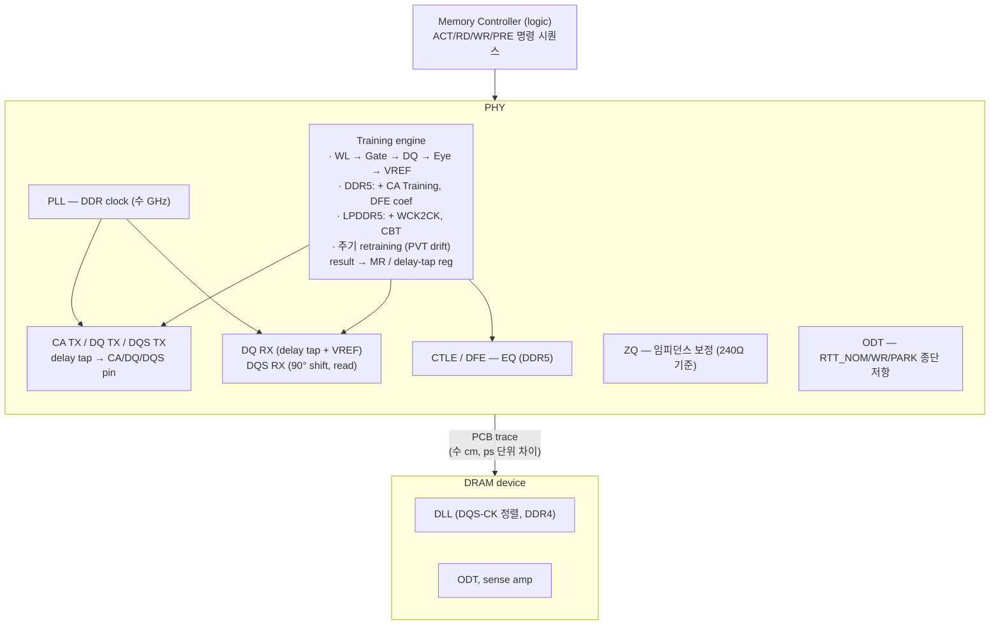
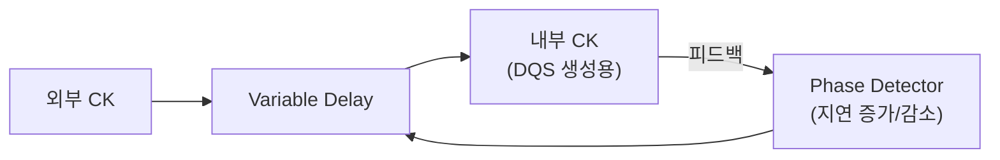
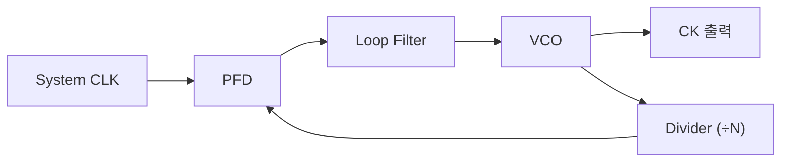

# Module 03 — Memory Interface / PHY

<!-- DV-SKOOL-CH-CTX:start -->
<div class="chapter-context" data-cat="memory">
  <a class="chapter-back" href="../">
    <span class="chapter-back-arrow">←</span>
    <span class="chapter-back-icon">💾</span>
    <span class="chapter-back-text">DRAM / DDR</span>
  </a>
  <span class="chapter-divider">›</span>
  <span class="chapter-marker">Module 03</span>
</div>
<!-- DV-SKOOL-CH-CTX:end -->

<!-- DV-SKOOL-CH-TOC:start -->
<div class="page-toc">
  <span class="page-toc-label">목차</span>
  <a class="page-toc-link" href="#1-why-care-이-모듈이-왜-필요한가">1. Why care?</a>
  <a class="page-toc-link" href="#2-intuition-비유와-한-장-그림">2. Intuition</a>
  <a class="page-toc-link" href="#3-작은-예-write-leveling-한-byte-lane-을-step-by-step-으로-맞추기">3. 작은 예 — Write Leveling 1 lane 추적</a>
  <a class="page-toc-link" href="#4-일반화-phy-블록-과-training-순서">4. 일반화 — PHY 블록 + Training 순서</a>
  <a class="page-toc-link" href="#5-디테일-신호-odt-dll-pll-eq-zq-bl2">5. 디테일</a>
  <a class="page-toc-link" href="#6-흔한-오해-와-dv-디버그-체크리스트">6. 흔한 오해 + DV 디버그 체크리스트</a>
  <a class="page-toc-link" href="#7-핵심-정리-key-takeaways">7. 핵심 정리</a>
</div>
<!-- DV-SKOOL-CH-TOC:end -->

!!! objective "학습 목표"
    이 모듈을 마치면:

    - **Diagram** PHY의 주요 블럭(DLL/PLL, DQ/CA TX/RX, Training engine, ZQ calibration)을 그릴 수 있다.
    - **Apply** Write Leveling, Read DQ Training, CA Training, ZQ Calibration의 순서와 목적을 시나리오에 매핑할 수 있다.
    - **Analyze** PVT(Process/Voltage/Temperature) 변동이 timing margin에 미치는 영향과 보정 메커니즘을 분석할 수 있다.
    - **Distinguish** CTLE / DFE 같은 equalization 기법과 적용 위치(Write/Read)를 구분할 수 있다.
    - **Identify** DDR4 → DDR5에서 추가된 Training 항목과 동기를 식별할 수 있다.

!!! info "사전 지식"
    - [Module 01-02](01_dram_fundamentals_ddr.md) (cell, MC scheduler)
    - 아날로그/디지털 인터페이스 기본 (signal integrity 개념)
    - Eye diagram, jitter 일반 지식

---

## 1. Why care? — 이 모듈이 왜 필요한가

Module 02 에서 MC 가 발행한 ACT/RD/WR/PRE 명령은 _전기 신호_ 가 되어 PCB 트레이스를 건너 DRAM 에 도달해야 합니다. DDR4 3200 MT/s 의 _데이터 유효 윈도우_ 는 ~312 ps, DDR5 4800 MT/s 는 ~208 ps. PCB 배선 차이, PVT 변동, 크로스토크가 그 윈도우를 더 좁힙니다. **PHY 의 임무는 이 ns 도 안 되는 시간 안에서 정확한 샘플링을 보장하는 것** — 그리고 그것은 정적 설정으로는 불가능합니다. **Training 실패 = silent corruption** — silicon 이 동작하는 것처럼 보이지만 데이터 변조.

이 모듈을 건너뛰면 timing parameter 의 의미가 _ns 단위 사이클 카운트_ 에 머무르고, 왜 boot 시 BL2 가 수십 KB 의 training 코드를 돌리는지, 왜 운영 중에도 ZQ Calibration 이 주기적으로 돌아야 하는지 답할 수 없습니다.

---

## 2. Intuition — 비유와 한 장 그림

!!! tip "💡 한 줄 비유"
    **Memory PHY** ≈ **고속 도로의 톨게이트 + 차량 정렬 (training)**.<br>
    DDR 의 GHz 동작은 strobe 정렬, drive strength, ZQ calibration, training 같은 PHY 레이어 작업이 매 순간 보정해 가능합니다. **컨트롤러보다 PHY 가 더 미묘한 영역** — 같은 chip 이라도 온도가 바뀌면 전파 지연이 바뀌어 어제 맞춘 값이 오늘 안 맞을 수 있습니다.

### 한 장 그림 — PHY 는 timing 을 _주기적으로 다시 맞추는_ layer



### 왜 이렇게 설계됐는가 — Design rationale

세 물리적 사실이 _동시에_ 작동합니다.

1. **유효 윈도우가 ps 단위로 좁다** → 정적 setup/hold 로 cover 불가능 → _샘플링 시점_ 자체를 chip-by-chip / lane-by-lane 으로 학습해야 함.
2. **PVT 가 시간에 따라 drift 한다** → 한 번 학습한 값이 영원히 맞을 수 없음 → 주기적 ZQ + retraining 필요.
3. **GHz 신호는 채널 손실이 크다** → ISI 가 eye 를 닫음 → 선형/비선형 등화 (CTLE + DFE) 필요.

이 셋이 PHY 의 모든 기능 — DLL/PLL, training engine, ZQ, ODT, EQ — 의 존재 이유입니다.

---

## 3. 작은 예 — Write Leveling 한 byte lane 을 step-by-step 으로 맞추기

가장 단순한 시나리오. 64-bit DDR4 모듈에서 _byte lane 0_ 의 Write Leveling 한 lane 을 추적합니다.

### 사전 상황

- MC 가 lane 0 의 DQS 출력 delay 를 0 tap 부터 시작.
- DRAM 은 Write Leveling mode (MRS 로 진입). DRAM 은 **CK 의 rising edge 에서 DQS 를 sample** 하여 그 값을 DQ 로 돌려보냅니다.

### 단계별 추적

```
   delay tap   DQS edge vs CK rising      DRAM 이 보는 DQS value     DQ reply
   ──────     ──────────────────────     ──────────────────────     ─────────
     0       DQS 가 CK 보다 _많이_ 빠름        '0'                    0x00 (= 0)
     1       조금 덜 빠름                      '0'                    0x00
     2       조금 덜 빠름                      '0'                    0x00
     3       조금 덜 빠름                      '0'                    0x00
     4       살짝 빠름                          '0'                    0x00
     5       (전환점) DQS rising edge 가 CK 와 거의 정렬   '1' (or '0')   0x01 ⭐
     6       이제 DQS 가 CK 와 정렬 또는 약간 늦음          '1'           0xFF
     7       늦음                                          '1'           0xFF
     ...
```

### 단계별 의미

| Step | 누가 | 무엇을 | 왜 |
|---|---|---|---|
| ① | MC | `MRS` 로 DRAM 을 Write Leveling mode 진입 | DRAM 의 정상 RD/WR 동작 정지, sample-and-reply mode 활성 |
| ② | MC PHY | lane 0 의 DQS 출력 delay tap = 0 으로 set | 가장 이른 위상부터 시작 |
| ③ | MC | DQS 토글 출력 → DRAM | DRAM 의 sample 동작 트리거 |
| ④ | DRAM | `posedge CK` 시점의 DQS 값을 latch → DQ 에 reply | sample 시점의 DQS 위상을 reflect |
| ⑤ | MC | DQ 값을 read → '0' 이면 _DQS 가 CK 보다 빠름_ → tap 증가 | 더 늦추면 정렬에 가까워짐 |
| ⑥ | MC | tap = 1, 2, 3, 4 ... 반복하며 DQ 변화 monitor | 전환점 탐색 |
| ⑦ | MC | DQ 가 0 → 1 로 바뀐 첫 tap (`tap = 5`) 을 lane 0 의 _최적 delay_ 로 채택 | DQS 의 rising edge 가 CK 와 정렬된 시점 |
| ⑧ | MC | lane 1, 2, ... 7 도 같은 절차 (각 lane 의 PCB 길이가 다름) | per-lane 보정 |
| ⑨ | MC | `MRS` 로 Write Leveling mode exit | 정상 RD/WR 가능 |

```c
// Write Leveling pseudocode (per lane)
function int wl_train_lane(int lane) {
    int prev_dq = 0;
    for (int tap = 0; tap < MAX_TAP; tap++) {
        phy.set_dqs_delay(lane, tap);
        toggle_dqs(lane);
        int dq = sample_dq_reply(lane);   // 0 or 1
        if (prev_dq == 0 && dq == 1)      // 0→1 transition
            return tap;                    // optimal delay found
        prev_dq = dq;
    }
    return ERROR_NOT_FOUND;
}
```

!!! note "여기서 잡아야 할 두 가지"
    **(1) DQS-CK 정렬은 _lane 별로 다른 delay tap_ 을 요구한다.** PCB 배선 길이가 lane 마다 mm 단위로 달라서 — 한 lane 5 tap, 다른 lane 7 tap 처럼. 정적 설정으로는 절대 cover 불가.<br>
    **(2) Training 결과는 _런타임 데이터_ 다.** boot 시 BL2 가 학습한 tap 값이 chip-specific / 온도-specific 이라 BootROM 에 hardcoding 할 수 없습니다. DRAM 도 retraining 시 다른 값이 나옵니다.

---

## 4. 일반화 — PHY 블록 과 Training 순서

### 4.1 PHY 의 기능 블록

| 블록 | 책임 | 정확도 단위 |
|------|------|------|
| **PLL** | system clock → DDR clock 합성 | jitter ps |
| **DLL** (DDR4 only) | DRAM 내부 DQS-CK 정렬 | ps |
| **CA / DQ / DQS TX/RX** | 신호 driver / receiver | mV / ps |
| **Per-lane delay tap** | DQ/DQS 위상 조정 | tap (~5-10 ps each) |
| **VREF generator** | 수신 판정 기준 전압 | mV |
| **ODT** | 종단 임피던스 (RTT_NOM/WR/PARK) | Ω |
| **ZQ engine** | 출력 임피던스 보정 (vs 240Ω 기준) | Ω, % |
| **EQ (CTLE + DFE)** | ISI / 고주파 손실 보상 | dB |
| **Training engine** | sequence (WL → Gate → DQ → Eye → VREF) | per-lane |

### 4.2 Training 시퀀스 — 표준 순서

| Training | 목적 | 시점 | DDR4 | DDR5 |
|---------|------|------|------|------|
| **CA / CS Training** | CA 버스 타이밍 정렬 | init | (없음) | ✓ |
| **Write Leveling** | DQS-to-CK 스큐 보정 (Write 경로) | init | ✓ | ✓ |
| **Read Gate Training** | DQS 수신 시작 타이밍 결정 | init | ✓ | ✓ |
| **Read/Write DQ Training** | DQ-to-DQS 비트별 지연 보정 | init | ✓ | ✓ |
| **Read Eye Training** | 데이터 유효 윈도우 중앙 | init | ✓ | ✓ |
| **VREF Training** | 수신 판정 기준 전압 최적화 | init | ✓ | ✓ |
| **DFE coef Training** | Decision Feedback EQ 계수 | init | (없음) | ✓ |
| **ZQ Init / Long / Short** | 출력 임피던스 | init + 주기 | ✓ | ✓ |
| **Periodic Retraining** | 온도 변화 보상 | runtime | ✓ | ✓ |

LPDDR5 는 추가로 **WCK2CK Training** + **CBT** (Command Bus Training).

### 4.3 PVT drift 와 retraining 의 동기

```
                Training 결과 (한 시점)
                          │
                          ▼
                 |◄──── 유효 margin ────►|
   eye 중심  ──── ●  ─────────────────  ●  ──── eye 가장자리
                          │
   온도 ↑ → 전파지연 변경 │ → eye 가 좌/우로 shift
   전압 droop → drive 강도 변경 → eye 중앙 이동
                          ▼
                 새로운 eye 중심을 다시 학습
                          │
                          ▼
                 → ZQ Short / periodic retraining
```

핵심: **한 번 학습 → 영원 유지** 가 아닙니다. 운영 중 ZQ Short 가 수십 초마다, full retraining 이 주기적으로 또는 온도 임계 초과 시 trigger 됩니다.

---

## 5. 디테일 — 신호, ODT, DLL/PLL, EQ, ZQ, BL2

### 5.1 DDR 신호 구성

```
Memory Controller / PHY ←→ DRAM Device

Command/Address (CA) Bus:
  CK/CK# (차동 클럭)
  CS#     (Chip Select)
  RAS#/CAS#/WE# (DDR4) 또는 CA[13:0] (DDR5)
  BA[1:0] (Bank Address)
  BG[1:0] (Bank Group, DDR4) / BG[2:0] (DDR5)
  A[16:0] (Row/Column Address)

Data Bus (per byte lane):
  DQ[7:0]   (데이터, 8-bit per lane)
  DQS/DQS#  (데이터 스트로브, 차동)
  DM/DBI    (데이터 마스크 / Data Bus Inversion)

  DDR4: 8 byte lanes × 8 = 64-bit
  DDR5: Sub-Ch A: 4 lanes × 8 = 32-bit
        Sub-Ch B: 4 lanes × 8 = 32-bit
```

### 5.2 DQS 와 DQ 의 관계

```
DDR에서 DQS는 데이터의 "스트로브":

  Write (MC → DRAM):
    MC가 DQS를 DQ와 정렬하여 전송
    DRAM이 DQS 엣지에서 DQ를 샘플링
    → DQS center-aligned with DQ

  Read (DRAM → MC):
    DRAM이 DQS를 DQ와 edge-aligned로 전송
    MC/PHY가 DQS를 90° 지연시켜 DQ 중앙에서 샘플링
    → Read DQS needs 90° phase shift at receiver

  +----+    +----+    +----+    DQS
  |    |    |    |    |    |
  +    +----+    +----+    +---
       ↑         ↑         ↑   DQS edge (Write: DRAM 샘플링)
    +------+  +------+  +------+ DQ
    | D0   |  | D1   |  | D2   |
    +------+  +------+  +------+
         ↑         ↑         ↑  DQS center (Read: MC 샘플링, 90° shift)
```

### 5.3 ODT (On-Die Termination) — 신호 무결성의 핵심

```
문제: 고속 신호가 전송선 끝에서 임피던스 불일치를 만나면
     신호가 반사되어 원래 신호에 간섭 → 데이터 오류

  반사 없는 조건: 소스 임피던스 = 전송선 임피던스 = 종단 임피던스

  DDR 이전: 외부 종단 저항을 PCB에 실장
  DDR2+: DRAM 칩 내부에 종단 저항 내장 = ODT (On-Die Termination)
  → 외부 부품 제거 → PCB 간소화, 비용 절감, 신호 품질 향상

ODT의 동작:

  Write 시 (MC → DRAM):
    +------+    전송선 (Z0=40Ω)    +------+
    |  MC  |========================| DRAM |
    | Ron  |                        | ODT  |
    | 34Ω  |                        | 40Ω  | ← 수신측 종단
    +------+                        +------+
    → 타겟 DRAM의 ODT 활성화 → 반사 방지

  Read 시 (DRAM → MC):
    +------+    전송선 (Z0=40Ω)    +------+
    |  MC  |========================| DRAM |
    | ODT  |                        | Ron  |
    | 40Ω  | ← 수신측 종단         | 34Ω  |
    +------+                        +------+
    → MC측 ODT 활성화

  Multi-Rank에서의 ODT:
    Rank 0 (타겟): ODT OFF (데이터 구동 중)
    Rank 1 (비타겟): ODT ON (반사 방지)
    → 비타겟 Rank의 ODT가 더 중요 (park termination)

DDR4 ODT 설정 (Mode Register):
  RTT_NOM (MR1):  Nominal termination (60/120/40/240Ω 등)
  RTT_WR  (MR2):  Write 시 dynamic termination
  RTT_PARK (MR5): 항상 활성화된 park termination

DDR5 ODT 변경점:
  - ODTL (ODT Latency): 명령 대비 ODT ON/OFF 타이밍 정밀 제어
  - NT_ODT (Non-Target ODT): 비타겟 Rank ODT 독립 제어
  - Per-Pin ODT: DQ 핀별 ODT 값 설정 가능

면접 포인트:
  "ODT는 고속 DDR 버스에서 신호 반사를 방지하는 핵심 메커니즘이다.
   DRAM 내부에 종단 저항을 내장하여 PCB 간소화와 신호 무결성을 동시에 달성한다.
   Multi-Rank 구성에서 비타겟 Rank의 Park Termination이 특히 중요하며,
   RTT_NOM, RTT_WR, RTT_PARK 세 값의 최적 조합은 시뮬레이션으로 결정한다."
```

### 5.4 DLL / PLL — 클럭 생성과 분배

```
**DLL (Delay-Locked Loop) — DRAM 내부**

목적: 내부 클럭과 외부 CK의 위상을 정렬. 원리: 지연(delay)을 조절하여 피드백 클럭과 기준 클럭의 위상을 맞춤.



DLL이 하는 일:

- Read 시 DQS를 CK에 정렬하여 출력
- 온도/전압 변화에 따라 지연을 자동 조절
- DDR4: DLL 필수, DDR5: DLL 제거 (PHY측에서 처리)

**PLL (Phase-Locked Loop) — MC/PHY 내부**

목적: 시스템 클럭에서 DDR 클럭과 그 분주/배수 클럭 생성. 원리: VCO(전압제어발진기)의 주파수를 조절하여 기준 주파수에 Lock.



PLL이 하는 일:

- 200 MHz 시스템 클럭 → 1600 MHz DDR 클럭 생성 (×8)
- 90° 위상 시프트된 클럭 생성 (Read DQS 샘플링용)
- Jitter 최소화 → Eye Diagram 품질에 직접 영향

DLL vs PLL 차이:
  | 항목    | DLL              | PLL              |
  |--------|------------------|------------------|
  | 동작    | 지연 조절 (위상만)| 주파수 합성       |
  | 위치    | DRAM 내부        | MC/PHY 내부       |
  | 주 목적 | DQS-CK 정렬      | DDR 클럭 생성     |
  | DDR5    | 제거             | 필수 (더 복잡)    |
```

### 5.5 Equalization — 고속 신호 보상 기법

```
문제: DDR5 4800+ MT/s에서 채널 손실(ISI, 크로스토크)이 심각
     → 수신단에서 Eye가 거의 닫힘 → 보상 없이는 데이터 수신 불가

  ISI (Inter-Symbol Interference):
    이전 비트의 잔여 신호가 현재 비트에 간섭
    → 고속일수록 심각 (비트 간격이 좁아지므로)

CTLE (Continuous-Time Linear Equalizer):
  - 수신단에 아날로그 필터 적용
  - 고주파 성분을 증폭하여 채널 손실 보상
  - 간단하지만 노이즈도 함께 증폭하는 단점

  채널 응답:    ─────────╲  (고주파 감쇠)
  CTLE 보상:    ─────────╱  (고주파 부스트)
  결과:         ───────────  (평탄화)

DFE (Decision Feedback Equalizer):
  - 이미 결정된 비트 값을 이용하여 ISI 제거
  - 현재 비트에서 이전 비트의 예상 간섭을 빼줌
  - 노이즈를 증폭하지 않는 장점 (CTLE와 상호 보완)

  수신 신호 = 현재 비트 + h1×(이전 비트) + h2×(2번 전 비트) + ...
  DFE 보상: 수신 신호 - h1×(이전 결정값) - h2×(2번 전 결정값)
  → ISI 성분 제거 → 깨끗한 Eye 복원

  DDR5에서의 적용:
  - DRAM 수신단(Write 경로): DFE 1-tap 이상 지원
  - PHY 수신단(Read 경로): CTLE + DFE 조합
  - Training으로 DFE 계수(h1, h2) 최적화

면접 포인트:
  "DDR5 고속에서는 채널 ISI로 Eye가 닫히므로 Equalization이 필수이다.
   CTLE는 아날로그 고주파 부스트, DFE는 이전 비트의 ISI를 디지털로
   제거한다. DRAM과 PHY 양측에서 적용하며, Training으로 계수를 최적화한다."
```

### 5.6 Training — 왜 필요한가?

```
문제: DDR4 3200MT/s 기준 데이터 유효 윈도우 = ~312 ps
     DDR5 4800MT/s 기준 = ~208 ps

     이 좁은 윈도우 안에서 정확히 샘플링해야 함.

     그러나:
     - PCB 배선 길이 차이 → 신호 도착 시간 차이 (Skew)
     - PVT 변동 → 트랜지스터 속도 변화
     - 온도 변화 → 전파 지연 변화
     - 크로스토크 → 신호 왜곡

     → 고정된 타이밍으로는 정확한 샘플링 불가능
     → 동적으로 타이밍을 조정(Training)해야 함
```

#### DDR5 CA Training (CS Training) — DDR5 에서 새로 추가

```
DDR5에서 CA(Command/Address) 버스도 고속화 → CA 타이밍 정렬 필요

문제:
  DDR4: RAS#/CAS#/WE# 개별 핀 → 상대적으로 저속, 마진 충분
  DDR5: CA[13:0] 멀티플렉싱 → 클럭 속도에 동기 → 타이밍 마진 축소

CS Training 과정:
  1. MC가 CS Training 모드 진입 (MPC 명령)
  2. MC가 CA 핀에 알려진 패턴 전송
  3. DRAM이 CK 엣지에서 CA를 샘플링 → DQ로 결과 반환
  4. MC가 CA 지연을 조절하며 반복
  5. 최적 CA-CK 정렬 지점 결정

  이것이 중요한 이유:
  - CA 타이밍 오류 → 잘못된 명령 해석 → 치명적 오동작
  - DDR4에서는 불필요했으나 DDR5에서 필수가 됨
  - LPDDR5에서는 CBT (Command Bus Training)이라 부름
```

#### Write Leveling 상세

```
목적: 각 Byte Lane의 DQS가 DRAM의 CK에 정렬되도록 지연 조정

과정:
  1. MC가 Write Leveling 모드 진입 (MRS 설정)
  2. MC가 DQS 토글 전송
  3. DRAM이 CK 엣지에서 DQS를 샘플링 → DQ로 결과 반환
     DQ = 0: DQS가 CK보다 빠름 (더 지연 필요)
     DQ = 1: DQS가 CK와 정렬됨 (완료)
  4. MC가 DQS 지연을 증가시키며 반복
  5. 0→1 전환점 = 최적 지연값

  Lane 0: delay = 5 taps
  Lane 1: delay = 7 taps  ← PCB 배선 차이 반영
  Lane 2: delay = 4 taps
  ...
```

#### Eye Diagram — 데이터 유효 윈도우

```
전압
  ^
  |    +--------+   +--------+
  |   /          \ /          \
  |  /   Eye      X    Eye     \
  | /   Opening  / \  Opening   \
  |/____________/___\____________\___> 시간
  |            |     |
  |       DQS edge  DQS edge
  |         (최적 샘플링 포인트 = Eye 중앙)

Eye가 클수록 → 타이밍 마진 충분 → 안정적
Eye가 작으면 → 비트 에러 발생 가능 → Training으로 최적점 탐색
```

### 5.7 ZQ Calibration — 임피던스 매칭

```
문제: DRAM과 MC의 출력 임피던스가 전송선 임피던스(보통 40Ω)와
     불일치하면 신호 반사 → 데이터 오류

ZQ Calibration:
  - DRAM의 ZQ 핀에 정밀 저항(240Ω) 연결
  - DRAM이 이를 기준으로 내부 출력 드라이버 임피던스 조정
  - MC/PHY도 동일한 캘리브레이션 수행

  종류:
  - ZQ Init: 초기화 시 (512 tCK)
  - ZQ Long: 주기적 (256 tCK)
  - ZQ Short: 빈번 (64 tCK)

  → PVT 변동에 따른 임피던스 드리프트를 주기적으로 보상
```

### 5.8 BL2 에서의 DRAM Training (BootROM 연결)

```
부팅 시퀀스에서 DRAM Training 위치:

  BL1 (BootROM):
    - SRAM에서 실행
    - DRAM 미초기화 (Training 전)
    - BL2를 SRAM에 로드 + 검증

  BL2 (FSBL):
    - DRAM Controller 초기화 ← 여기서 Training 수행
    - MC 레지스터 설정
    - DRAM Device MRS 설정
    - Training 시퀀스 실행 (WL → Gate → DQ → Eye → VREF)
    - Training 완료 → DRAM 사용 가능
    - BL3x를 DRAM에 로드

  Training이 BL2에 있는 이유:
    - Training 코드가 크고 복잡 (수 KB ~ 수십 KB)
    - PVT마다 다른 결과 → 런타임 결정 필요
    - DRAM 세대별로 다른 Training → 업데이트 가능해야 함
    → BootROM(불변)에 넣기 부적합
```

### 5.9 Q&A — 자주 묻는 질문

**Q: DRAM Training이 왜 필요한가?**
> "DDR4/5의 데이터 유효 윈도우가 수백 ps로 극히 좁기 때문이다. PCB 배선 차이, PVT 변동, 크로스토크로 인해 고정 타이밍으로는 정확한 샘플링이 불가능하다. Training은 Write Leveling(DQS-CK 정렬), DQ Training(비트별 지연 보정), Eye Training(최적 샘플링 포인트 탐색), VREF Training(판정 전압 최적화)을 통해 각 채널/바이트 레인의 타이밍을 동적으로 최적화한다."

**Q: Write Leveling의 원리는?**
> "MC가 DQS를 점진적으로 지연시키면서 DRAM이 CK 엣지에서 DQS를 샘플링한 결과를 DQ로 반환한다. DQ가 0→1로 전환되는 지점이 DQS와 CK가 정렬된 최적 지연값이다. 바이트 레인마다 PCB 배선 길이가 다르므로, 각 레인의 최적 지연값이 다르다."

**Q: ODT가 필요한 이유와 Multi-Rank에서의 동작은?**
> "고속 DDR 버스에서 전송선 끝의 임피던스 불일치는 신호 반사를 일으켜 데이터 오류를 유발한다. ODT는 DRAM 내부에 종단 저항을 내장하여 반사를 방지한다. Multi-Rank 구성에서는 타겟 Rank가 데이터를 구동할 때 비타겟 Rank의 ODT(RTT_PARK)가 특히 중요하다. RTT_NOM(Nominal), RTT_WR(Write 시), RTT_PARK(상시)의 세 값을 Mode Register로 설정하며, 최적 조합은 채널 시뮬레이션으로 결정한다."

**Q: DDR5에서 Equalization이 필수인 이유는?**
> "DDR5 4800+ MT/s에서는 비트 간격이 극히 좁아 ISI(Inter-Symbol Interference)로 수신단의 Eye가 거의 닫힌다. CTLE(아날로그 고주파 부스트)와 DFE(이전 비트의 ISI를 디지털로 제거)를 조합하여 Eye를 복원한다. DRAM 수신단(Write)에는 DFE, PHY 수신단(Read)에는 CTLE+DFE를 적용하며, Training으로 계수를 최적화한다."

**Q: DDR4 대비 DDR5에서 추가된 Training 항목은?**
> "CA Training(CS Training)이 가장 중요한 추가 항목이다. DDR5에서 CA 버스가 멀티플렉싱으로 변경되어 타이밍 마진이 축소되었기 때문이다. 또한 DFE 계수 Training, Read/Write Preamble Training이 추가되었다. LPDDR5에서는 WCK2CK Training(WCK-CK 위상 정렬)과 CBT(Command Bus Training)가 추가된다."

---

## 6. 흔한 오해 와 DV 디버그 체크리스트

### 흔한 오해

!!! danger "❓ 오해 1 — 'PHY 는 한 번 training 하면 그대로다'"
    **실제**: Training 은 boot 시 + 운영 중 주기적 retraining 이 모두 필요합니다. ZQ Short 가 수십 초마다 자동, full retraining 이 온도 임계 초과 시 trigger.<br>
    **왜 헷갈리는가**: "한 번 잘 맞추면 계속 맞을 것" 이라는 직관 — 실제로는 PVT drift 가 상시.

!!! danger "❓ 오해 2 — 'DLL 과 PLL 은 비슷한 회로다'"
    **실제**: PLL 은 _주파수 합성_ (system clock → DDR clock), DLL 은 _위상 정렬_ (DQS-CK). 위치도 다르고 (PLL: MC/PHY, DLL: DRAM 내부), DDR5 는 DLL 을 _제거_ 하고 PHY 가 phase 를 처리합니다.

!!! danger "❓ 오해 3 — 'CTLE 만 있으면 충분, DFE 까지 필요 없다'"
    **실제**: CTLE 는 _노이즈도_ 함께 증폭합니다. DFE 는 이미 결정된 비트의 ISI 만 빼므로 노이즈 증폭이 없습니다. DDR5 는 CTLE + DFE 의 _상호 보완_ 으로 eye 를 복원합니다.

!!! danger "❓ 오해 4 — 'Multi-Rank 에서 ODT 는 타겟 Rank 만 신경쓰면 된다'"
    **실제**: 비타겟 Rank 의 RTT_PARK (park termination) 가 _더 중요_ 합니다. 비타겟이 floating 이면 신호가 그쪽에서 반사되어 타겟 RX 의 eye 를 닫습니다.

!!! danger "❓ 오해 5 — 'CA Training 은 DDR4 에도 있다'"
    **실제**: DDR4 의 CA 버스 (RAS#/CAS#/WE# 개별 핀) 는 상대적으로 저속이라 별도 training 불필요. **DDR5 가 CA 를 멀티플렉싱 (CA[13:0])** 으로 바꾸면서 CA Training (또는 CS Training) 이 필수가 되었습니다. LPDDR5 는 CBT.

### DV 디버그 체크리스트 (PHY/Training 영역의 흔한 실패)

| 증상 | 1차 의심 | 어디 보나 |
|---|---|---|
| Boot 시 Training 무한 실패 / converge 안 함 | DRAM 미초기화 / CKE/RESET 시퀀스 문제 | Phase 1 power sequence, MRS 발행 timestamp |
| 특정 lane 만 read error | per-lane DQ delay tap 학습 실패 | lane 별 tap 수렴 값, eye margin |
| 고온에서만 read corruption | retraining trigger 조건 / VREF drift | 온도 센서 (MR4), VREF 학습 timestamp |
| Multi-Rank 에서만 fail (single-rank OK) | 비타겟 Rank 의 RTT_PARK 미설정 | MR5, RTT_PARK 활성 여부 |
| Write 만 fail (Read OK) | Write Leveling 학습 결과 / DQS-CK 정렬 | WL tap 값 vs PCB 길이 추정 |
| 특정 ZQ short 직후 RD/WR fail | ZQ 와 RD/WR 명령 충돌 (tZQCS 위반) | ZQCS issue timestamp + 인접 RD/WR |
| DDR5 에서만 CA decode error | CA / CS Training 누락 또는 실패 | MPC 명령 흐름, CS Training tap |
| LPDDR5 DVFSC 전환 후 fail | WCK2CK retraining 누락 / 저장된 값 복원 실패 | DVFSC FSM, WCK 위상 |

!!! warning "실무 주의점 — ZQ Calibration 타이밍 위반으로 ODT 임피던스 오동작"
    **현상**: 온도 변화 이후 Write 데이터가 Eye 중심에서 벗어나 비트 오류율이 증가하거나, 주기적 ZQ Calibration 도중 RD/WR 명령이 겹쳐 데이터 오염 발생.

    **원인**: ZQCS(Short Calibration)는 tZQCS(80ns) 동안 DQ/DQS 드라이버를 완전히 점유하므로, 이 구간에 RD/WR 명령이 발행되면 정의되지 않은 동작. MC가 Calibration 스케줄러와 명령 스케줄러를 독립적으로 운용할 때 충돌 발생 가능.

    **점검 포인트**: ZQCS 명령 발행 시점에서 tZQCS 이전 RD/WR 명령의 완료 여부 확인. SVA에서 `zq_start → ##[1:tZQCS_ns] (no_rd && no_wr)` assertion 구현. 주기적 Calibration 간격이 온도 변화 속도보다 충분히 짧은지 스펙(tZQCAL_interval ≤ 1ms) 확인.

---

## 7. 핵심 정리 (Key Takeaways)

- **PHY = 명령/데이터의 전기적 변환 + 캘리브레이션**: DLL/PLL 로 클럭 위상 정렬, ZQ 로 임피던스 보정, training 으로 lane-by-lane timing 최적화.
- **Training 은 boot 시 한 번이 아니다** — 운영 중 ZQ Short / 주기적 retraining 으로 PVT drift 보상.
- **Equalization (CTLE + DFE)** 는 DDR5 에서 사실상 필수. CTLE 가 고주파 부스트, DFE 가 ISI 제거.
- **DDR5 추가 Training**: CA / CS Training (CA 멀티플렉싱), DFE 계수, Preamble. LPDDR5 는 WCK2CK + CBT.
- **BL2 에서 Training 수행** — 코드 크고 PVT 의존이라 BootROM 부적합. Training 결과는 chip-by-chip / 온도-by-온도 다름.

!!! warning "실무 주의점"
    - "PHY 가 한 번 set up 되면 끝" 은 가장 빈번한 오해 — retraining trigger 조건을 검증 시나리오에 반드시 포함.
    - Multi-Rank ODT 는 비타겟 RTT_PARK 가 더 중요. 무시하면 single-rank 에서는 깨끗했던 eye 가 multi-rank 에서 닫힘.
    - LPDDR5 의 DVFSC 전환은 _train 결과 보존 또는 재train_ 둘 중 하나가 일관되게 동작해야 — 둘 다 안 되면 silent corruption.

---

## 다음 모듈

→ [Module 04 — DRAM DV Methodology](04_dram_dv_methodology.md): 지금까지 본 cell + MC + PHY 를 _어떻게 검증하는가_. Behavioral model, traffic generator, scoreboard, timing SVA, ECC injection.

[퀴즈 풀어보기 →](quiz/03_memory_interface_phy_quiz.md)

<div class="chapter-nav">
  <a class="nav-prev" href="../02_memory_controller/">
    <div class="nav-label">◀ 이전</div>
    <div class="nav-title">Memory Controller 아키텍처</div>
  </a>
  <a class="nav-next" href="../04_dram_dv_methodology/">
    <div class="nav-label">다음 ▶</div>
    <div class="nav-title">DRAM DV 검증 전략</div>
  </a>
</div>


--8<-- "abbreviations.md"
