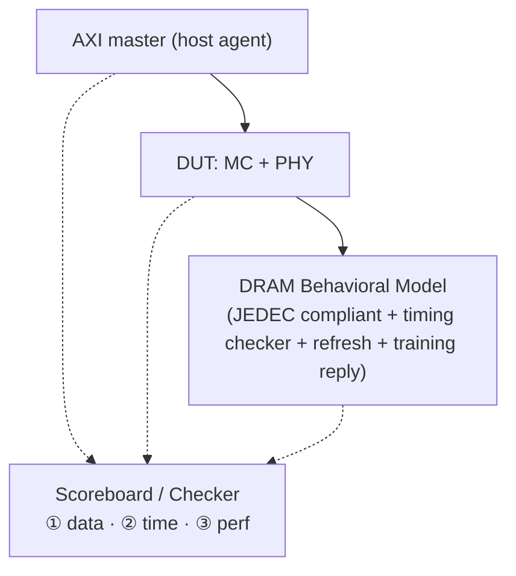
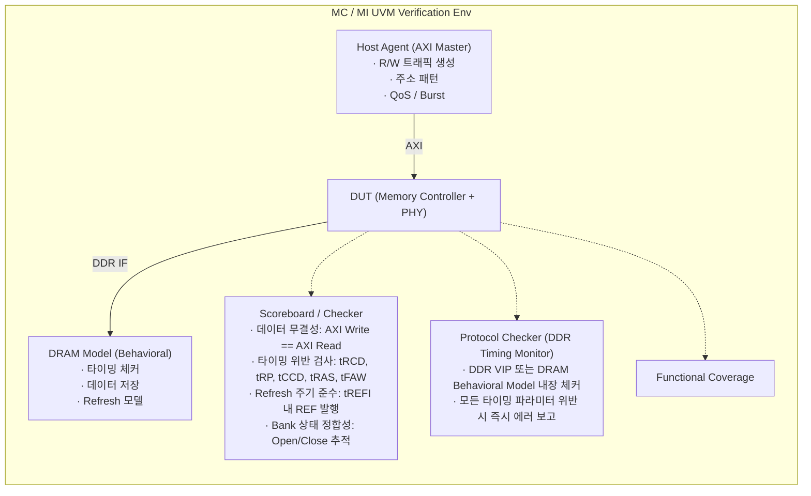

# Module 04 — DRAM DV Methodology

<!-- DV-SKOOL-CH-CTX:start -->
<div class="chapter-context" data-cat="memory">
  <a class="chapter-back" href="../">
    <span class="chapter-back-arrow">←</span>
    <span class="chapter-back-icon">💾</span>
    <span class="chapter-back-text">DRAM / DDR</span>
  </a>
  <span class="chapter-divider">›</span>
  <span class="chapter-marker">Module 04</span>
</div>
<!-- DV-SKOOL-CH-CTX:end -->

<!-- DV-SKOOL-CH-TOC:start -->
<div class="page-toc">
  <span class="page-toc-label">목차</span>
  <a class="page-toc-link" href="#1-why-care-이-모듈이-왜-필요한가">1. Why care?</a>
  <a class="page-toc-link" href="#2-intuition-비유와-한-장-그림">2. Intuition</a>
  <a class="page-toc-link" href="#3-작은-예-trcd-위반-한-cycle-을-잡아내는-1-사이클">3. 작은 예 — tRCD 위반 1 cycle</a>
  <a class="page-toc-link" href="#4-일반화-3축-검증-과-tb-구성">4. 일반화 — 3축 검증 + TB 구성</a>
  <a class="page-toc-link" href="#5-디테일-tb-coverage-init-perf-ecc-sva-confluence">5. 디테일</a>
  <a class="page-toc-link" href="#6-흔한-오해-와-dv-디버그-체크리스트">6. 흔한 오해 + DV 디버그 체크리스트</a>
  <a class="page-toc-link" href="#7-핵심-정리-key-takeaways">7. 핵심 정리</a>
</div>
<!-- DV-SKOOL-CH-TOC:end -->

!!! objective "학습 목표"
    이 모듈을 마치면:

    - **Design** DRAM/MC 검증 환경 (Behavioral Model + Traffic Generator + Reference Scoreboard) 아키텍처를 설계할 수 있다.
    - **Apply** Timing Compliance Check (SVA bind), Refresh check, ECC injection 시나리오를 작성할 수 있다.
    - **Implement** Performance Reference 로 Bandwidth / Latency 회귀를 측정하는 scoreboard 를 구현할 수 있다.
    - **Plan** Training 시퀀스 검증 시나리오 (PVT corner, retraining trigger) 를 수립할 수 있다.
    - **Justify** 어떤 실패가 TB bug 인지 DUT bug 인지 분류 기준을 제시할 수 있다.

!!! info "사전 지식"
    - [Module 01-03](01_dram_fundamentals_ddr.md) (cell + MC + PHY 전반)
    - UVM 기본 (factory, sequence, scoreboard, agent)
    - SystemVerilog Assertion (SVA) 기본

---

## 1. Why care? — 이 모듈이 왜 필요한가

### 1.1 시나리오 — _Silent corruption_ 의 비싼 대가

DRAM 검증은 일반 IP DV 와 _근본적으로_ 다릅니다. 일반 IP:
- Functional test 통과 → silicon 에서도 거의 OK.

DRAM:
- Functional test 통과 → silicon 에서 _가끔_ 데이터 깨짐. **Silent corruption**.

이유:
- _수십 개 timing parameter_ (`tRC`, `tRCD`, `tRP`, `tRAS`, `tFAW`, ...).
- **모든 조합** 이 OK 여야 함. 한 조합만 빠뜨려도 _특정 워크로드_ 에서 fail.
- ECC injection, refresh, training 같은 _stateful_ 시나리오.

실제 사례:
- 2018 Intel 의 _Spectre_ 같은 micro-architectural bug.
- 2014 Rowhammer — _refresh interval_ 이 _공격적으로 짧게_ 설정된 cell 의 _이웃 row_ flip.
- Silent corruption 발견까지 _수개월_ 또는 _수년_ 걸림.

DRAM 검증은 **타이밍 + 무결성 + 성능 의 동시 검증** 입니다. 일반 IP 처럼 "input/output mapping 만 맞으면 OK" 가 아니라 _수십 개의 timing constraint_ (`tRC`, `tRCD`, `tRP`, `tRAS`, `tFAW`, `tREFI`, `tCCD_S/L`, `tWTR`, `tRTW`, `tRFC` ...) 가 _모든 명령 조합_ 에서 충족되어야 합니다. 게다가 ECC injection / refresh 누락 / training 실패 같은 **silent corruption** 시나리오 — 동작은 하지만 데이터가 깨지는 — 를 빠짐없이 다뤄야 합니다.

이 모듈을 건너뛰면 단위 test 는 통과하는데 silicon 에서 random 워크로드가 실패하는 경험을 하게 됩니다. 반대로 이 모듈의 _3축 검증 + protocol checker + performance reference_ 구조를 잡고 나면 어떤 실패가 들어와도 어느 축 (timing / data / perf) 의 문제인지 즉시 분류 가능합니다.

---

## 2. Intuition — 비유와 한 장 그림

!!! tip "💡 한 줄 비유"
    **DRAM DV** ≈ **도서관 사서 검수 — 모든 책 입출고 시간이 spec 과 일치하는지 stopwatch 검증**.<br>
    `tRCD`, `tRP`, `tFAW` 같은 timing 제약을 모두 준수했는지 + refresh / training / scheduler 정책이 모든 시나리오에서 동작하는지 + 성능이 회귀하지 않는지 — 세 stopwatch 를 동시에 들고 보는 작업.

### 한 장 그림 — TB 의 3 stopwatch

```mermaid
flowchart TB
    DUT["DUT (MC + PHY)"]
    HOST["Host Agent (AXI master)<br/>· traffic gen<br/>· QoS / burst"]
    MODEL["DRAM Behavioral Model (JEDEC)<br/>· timing checker<br/>· refresh model"]
    SB1["① Data Stopwatch<br/>Scoreboard:<br/>AXI W == AXI R<br/>(data integrity)"]
    SB2["② Timing Stopwatch<br/>Protocol Checker /<br/>Timing SVA<br/>(tRCD, tRP, ...)"]
    SB3["③ Perf Stopwatch<br/>BW / latency<br/>regressors<br/>vs reference"]
    HOST -- "AXI" --> DUT
    DUT -- "DDR IF" --> MODEL
    HOST -. "AXI request/response" .-> SB1
    HOST -. .-> SB3
    MODEL -. "DDR command/data" .-> SB2
    MODEL -. .-> SB1
```

### 왜 이렇게 설계됐는가 — Design rationale

세 가지 실패 모드가 _서로 다른 메커니즘_ 으로 발생합니다.

1. **Data corruption** — bit 가 잘못 read/write. ECC, RAW bypass, address mapping 버그가 원인. → Scoreboard 가 잡음.
2. **Timing violation** — protocol 자체는 맞는데 spec 보다 짧은 간격으로 명령 발행. silicon 에서는 metastable / sense-amp 실패. → Protocol Checker / SVA 가 잡음.
3. **Performance regression** — 기능은 맞는데 throughput/latency 가 spec 미달. 이건 silent — assertion 안 잡힘. → Performance reference 와의 차이로만 검출.

세 도구를 _분리_ 한 이유는 각각이 _다른 신호_ 를 본다는 것입니다. 통합하려 하면 false-negative 가 늘어 silent fail 이 생깁니다.

---

## 3. 작은 예 — tRCD 위반 한 cycle 을 잡아내는 1 사이클

가장 단순한 시나리오. DUT 가 ACT 발행 후 `tRCD-1` cycle 만 기다리고 RD 를 발행합니다 (DDR4-3200, `tRCD = 22`). DRAM 셀에서는 sense amp 가 아직 안정되지 않았으나 silicon 은 _가끔_ 동작합니다 — random data 로 잡기 어려운 silent bug. SVA 가 잡아내야 합니다.

### 단계별 추적

```
   사이클 │  T=0     T=10    T=21       T=22       T=...
   CMD    │  ACT    ─       ─          RD ⚠       
          │  (Bank0,            ⓦ      (col=0)
          │   Row5)             violation
          │
   DUT    │  ─ ACT 발행 ─                ─ RD 발행 ──
          │                              ↑
          │                  (T=22 가 아니라 T=21 에 발행한 경우)
          │
   SVA    │  ─ ACT 감지 → tRCD timer start ─ T=21 에 RD 가 들어옴
          │                              ↓
          │                              ★ p_tRCD violation FIRE
          │                              ↓
          │                              `uvm_error("DDR_SVA", ...)
```

### 단계별 의미

| Step | 시점 | 누가 | 무엇을 | 왜 |
|---|---|---|---|---|
| ① | `T=0` | DUT | `ACT` (Bank=0, Row=5) 발행 | row open 시작 |
| ② | `T=0` | SVA | `act_time[bank=0] = $time` 기록 | timer 시작 |
| ③ | `T=0..21` | DRAM model | sense amp 동작 → row buffer 안정화 진행 중 | `tRCD = 22` cycle 동안 RD/WR 금지 |
| ④ | `T=21` | DUT | `RD` (col=0) 발행 — 1 cycle 빨리! | scheduler 의 timing 계산 버그 |
| ⑤ | `T=21` | SVA | `(act && {bg,bank}==0) \|-> ##TRCD (1)` 의 시점 도달 전에 RD detect | property 위반 |
| ⑥ | `T=21` | SVA | `assert_tRCD` fire → `uvm_error("DDR_SVA", "tRCD violation: RD too early after ACT")` | error 보고 |
| ⑦ | post-sim | scoreboard | RD 데이터가 _가끔_ 깨짐 (sense amp 미안정) | 데이터 corruption 도 감지될 수 있으나 random — SVA 가 더 안정적 |
| ⑧ | post-sim | coverage | `cover_tRCD` bin 이 _violation 영역_ 에 hit 표시 | 회귀 시 동일 시나리오 재현 보장 |

```systemverilog
// SVA 가 잡아낸 property
property p_tRCD_b0;
    @(posedge clk) disable iff (!rst_n)
    (act && {bg, bank} == 4'd0) |-> ##TRCD (1'b1);
    // ##TRCD: act 후 정확히 TRCD cycle 후의 시점에서 evaluation.
    // 만일 그 사이에 RD/WR 가 같은 bank 에 들어오면 trace 의 다른 assertion (p_no_rd_during_trcd) 이 fire.
endproperty

// Same-bank tRCD 위반 explicit check
property p_no_rd_during_trcd_b0;
    @(posedge clk) disable iff (!rst_n)
    (act && {bg, bank} == 4'd0) |-> not ((rd || wr) && {bg, bank} == 4'd0)[*1:TRCD-1];
endproperty
assert_no_rd_during_tRCD_b0: assert property (p_no_rd_during_trcd_b0)
    else `uvm_error("DDR_SVA", $sformatf("tRCD violation: RD/WR within %0d cycles after ACT @ Bank0", TRCD))
```

!!! note "여기서 잡아야 할 두 가지"
    **(1) 단일 timing SVA 가 silent bug 를 _즉시_ 잡는다.** Scoreboard 에 의존했다면 random data 패턴에 따라 corruption 이 발생/미발생 — flaky 한 fail 이 됩니다. SVA 는 _첫 cycle_ 에 fire.<br>
    **(2) Bank/BG 별로 독립 instance 가 필요하다.** 위 코드는 Bank 0 만 — 실제로는 `generate` 로 16 (DDR4) 또는 32 (DDR5) 개를 생성. timing parameter 도 BG/Bank 단위 관리.

---

## 4. 일반화 — 3축 검증 과 TB 구성

### 4.1 3축 검증 — 무엇을 어떻게

| 축 | 검증 도구 | 잡는 실패 종류 | 핵심 데이터 |
|---|---|---|---|
| **① Data integrity** | UVM Scoreboard | bit 변조, ECC 실패, RAW bypass 버그 | AXI W data ≡ AXI R data |
| **② Timing compliance** | DDR Protocol Checker / SVA | tRCD/tRP/tRAS/tFAW/tREFI/... 위반 | DDR command timestamp |
| **③ Performance** | Perf scoreboard / regression | BW/latency 회귀, QoS 미달 | request/response timestamp |

### 4.2 TB 의 일반 구성



### 4.3 Coverage axis — "무엇이 빠졌는지"

DRAM 의 시나리오 공간은 폭발적입니다 (rank × BG × bank × row × col × command × interleave × refresh state × training × power state). 그래서 **functional coverage 는 cross 형태로 정의되어야** 빠진 영역을 detect 할 수 있습니다 — §5.4.

### 4.4 검증 자료의 분류 — TB bug 인가 DUT bug 인가

| 증상 | TB bug 가능성 | DUT bug 가능성 | 1차 판단 |
|---|---|---|---|
| Scoreboard mismatch | data 변형/모델 불일치 | RAW bypass / ECC / address map | DRAM model 의 expected data 를 직접 quote |
| tRCD SVA 위반 | SVA 의 TRCD localparam 오설정 | scheduler 의 cycle 계산 | spec/MR 의 tRCD value 와 SVA 비교 |
| BW < expected | traffic generator 가 row hit 형성 못함 | scheduler 가 hit 활용 못함 | request 패턴의 row hit 비율 측정 |
| Training fail | DRAM model 의 reply 패턴이 spec 위반 | MC 의 tap 갱신 logic | Write Leveling 의 0→1 transition 위치 확인 |

---

## 5. 디테일 — TB, Coverage, Init, Perf, ECC, SVA, Confluence

### 5.1 검증 환경 아키텍처



### 5.2 핵심 테스트 시나리오

#### Positive

| 카테고리 | 시나리오 | 검증 포인트 |
|---------|---------|-----------|
| **기본 R/W** | 단일 주소 Write → Read | 데이터 일치 |
| | 연속 주소 Burst | 정확한 Column 접근 |
| | 전체 주소 공간 | 모든 Rank/BG/Bank/Row 접근 가능 |
| **스케줄링** | Row Hit 패턴 | ACT 없이 RD/WR 연속 |
| | Row Conflict 패턴 | PRE→ACT→RD/WR 시퀀스 정확 |
| | Bank Interleaving | 다른 Bank 명령 겹침 실행 |
| | BG Interleaving | tCCD_S vs tCCD_L 정확 적용 |
| **Refresh** | 주기적 REF | tREFI 준수, 데이터 보존 |
| | Postpone/Pull-in | 바쁠 때 지연, 한가할 때 선행 |
| **Training** | Write Leveling | 레인별 지연값 수렴 |
| | Eye Training | 유효 윈도우 중앙 탐색 |
| **전력** | Power-Down 진입/복귀 | 데이터 보존 + 정상 동작 재개 |
| | Self-Refresh | 데이터 유지 + 복귀 후 정상 |

#### Negative / Stress

| 카테고리 | 시나리오 | 검증 포인트 |
|---------|---------|-----------|
| **타이밍 경계** | 타이밍 파라미터 최소값 사용 | 위반 없음 |
| **트래픽 혼합** | R/W 혼합 최대 부하 | 대역폭 유지, 데이터 무결성 |
| **Refresh 충돌** | REF 중 R/W 요청 | 요청 대기, REF 후 처리 |
| **Full Bank** | 모든 Bank 동시 Open | 스케줄링 정확, tFAW 준수 |
| **연속 Row Conflict** | 매번 다른 Row 접근 | PRE+ACT 오버헤드, 타이밍 준수 |
| **ECC** | 비트 에러 주입 (DDR5 On-die) | 단일 비트 자동 수정 |
| **온도 변화** | DRAM 온도 상승 시뮬레이션 | Refresh Rate 조정, Retraining |

### 5.3 Coverage Model

```
[CG1] Access Pattern Coverage
  - cp_access_type: {READ, WRITE, RMW}
  - cp_burst_length: {1, 2, 4, 8, 16}
  - cp_row_state: {ROW_HIT, ROW_MISS, ROW_CONFLICT}
  - cross: access_type × row_state

[CG2] Address Coverage
  - cp_rank: {0, 1, ...}
  - cp_bank_group: {BG0, BG1, BG2, BG3, ...}
  - cp_bank: {B0, B1, B2, B3}
  - cp_row_region: {FIRST, MIDDLE, LAST}
  - cross: rank × bank_group × bank

[CG3] Scheduling Coverage
  - cp_interleave: {SAME_BG, DIFF_BG, SAME_BANK, DIFF_RANK}
  - cp_cmd_type: {ACT, RD, WR, PRE, REF, MRS}
  - cp_back_to_back: {ACT_ACT, RD_RD, WR_WR, RD_WR, WR_RD}
  - cross: interleave × back_to_back

[CG4] Refresh Coverage
  - cp_ref_type: {ALL_BANK, SAME_BANK(DDR5)}
  - cp_ref_timing: {ON_TIME, POSTPONED, PULLED_IN}
  - cp_ref_vs_traffic: {IDLE, LIGHT, HEAVY}

[CG5] Training / Power Coverage
  - cp_training_type: {WR_LEVEL, GATE, DQ, EYE, VREF, ZQ}
  - cp_power_mode: {ACTIVE, POWER_DOWN, SELF_REFRESH}
  - cp_gear_lane: {DDR4_3200, DDR5_4800, DDR5_6400, ...}
```

### 5.4 초기화 검증 시나리오

```
DRAM 초기화 시퀀스는 엄격한 순서와 타이밍을 요구 — 검증 필수

주요 검증 항목:

  1. 전원 시퀀싱 (Power-on Sequence)
     - VDD → VDDQ 순서 준수?
     - RESET# 해제 타이밍 (tPW 이상)?
     - CKE 활성화 전 CK 안정?

  2. MRS 설정 순서
     - JEDEC 명시 순서대로 MRS 발행?
     - 각 MRS 간 tMRD(MRS to MRS delay) 준수?
     - 설정값이 현재 속도/구성에 적합?

  3. ZQ Calibration
     - ZQCL이 초기화 시 발행되는지?
     - tZQinit(512 tCK) 대기 후 다음 명령?
     - 주기적 ZQCS/ZQCL 발행?

  4. Training 시퀀스
     - 올바른 순서: WL → Gate → DQ → Eye → VREF?
     - Training 결과(지연값, VREF)가 Mode Register에 반영?
     - Training 실패 시 재시도/에러 보고?

  5. 첫 Refresh
     - 초기화 완료 후 tREFI 이내 첫 REF 발행?

테스트 접근:
  - Golden Sequence 비교: JEDEC 스펙의 참조 시퀀스와 DUT 시퀀스를 비교
  - 순서 위반 주입: MRS 순서를 어겼을 때 DRAM 모델이 에러 보고하는지 확인
  - 타이밍 경계 테스트: tMRD, tZQinit 등을 최소값으로 설정하여 위반 없는지 확인
```

### 5.5 성능 검증 (Bandwidth / Latency)

```
성능 검증 = "기능적으로 맞다"를 넘어 "성능 요구사항을 충족하는가?"

1. Bandwidth 측정
   - 일정 시간 동안 전송된 총 데이터량 / 경과 시간
   - 시뮬레이션에서 측정:
     transaction_count × burst_size × data_width / simulation_time

   검증 시나리오:
     - 순차 접근 최대 Bandwidth (이론적 최대 대비 %)
     - 랜덤 접근 Bandwidth (Row Conflict로 인한 감소율)
     - 혼합 R/W Bandwidth (터널라운드 비용 포함)
     - Multi-Master 동시 접근 Bandwidth

   효율 기준 (예시):
     DDR4-3200, 64-bit: 이론적 최대 = 25.6 GB/s
     Sequential Read: >90% 효율 기대
     Random R/W Mixed: ~50-70% 효율 (구성에 따라)

2. Latency 측정
   - AXI 요청 발행 ~ AXI 응답 수신까지의 시간
   - 시뮬레이션에서 측정:
     response_time - request_time (per transaction)

   검증 시나리오:
     - Idle 상태 Read Latency (Row Miss): tRCD + tCL + PHY 지연
     - Row Hit Latency: tCL + PHY 지연
     - 부하 상태 Latency: 큐잉 지연 포함
     - QoS 우선순위별 Latency 차이

3. Scoreboard 기반 성능 수집
   UVM Scoreboard에서 timestamp 기록:

     class perf_scoreboard extends uvm_scoreboard;
       real total_bytes;
       real start_time, end_time;
       real latency_sum;
       int  txn_count;

       function void write_axi_req(axi_txn t);
         t.req_time = $realtime;  // 요청 시점 기록
       endfunction

       function void write_axi_rsp(axi_txn t);
         real lat = $realtime - t.req_time;
         latency_sum += lat;
         total_bytes += t.burst_len * t.data_width / 8;
         txn_count++;
       endfunction

       function void report_phase(uvm_phase phase);
         real bw = total_bytes / ($realtime - start_time);
         real avg_lat = latency_sum / txn_count;
         `uvm_info("PERF", $sformatf("BW=%.2f GB/s, Avg Lat=%.1f ns",
                   bw/1e9, avg_lat), UVM_LOW)
       endfunction
     endclass
```

### 5.6 Error Injection / ECC 검증

```
목적: On-die ECC(DDR5), 외부 ECC, 에러 핸들링의 정확성 검증

1. Single-Bit Error Injection (SEC — Single Error Correction)
   - DRAM Behavioral Model에서 특정 비트를 반전시켜 전달
   - On-die ECC가 자동 수정하는지 확인
   - 외부에서 관찰 시 에러가 보이지 않아야 함 (투명)

   테스트:
     Write(addr=0x100, data=0xFF00) → Model이 1-bit 오류 주입
     → Read(addr=0x100) → 기대: data=0xFF00 (수정된 값)

2. Multi-Bit Error Injection (DED — Double Error Detection)
   - 2-bit 이상 에러 → On-die ECC 수정 불가
   - MC 외부 ECC(SECDED)가 검출하는지 확인
   - 에러 인터럽트 발생 확인

3. Address Parity Error
   - CA 버스에서 Parity Error 주입
   - MC가 에러 감지 후 재발행 또는 에러 보고?
   - DDR4: CA Parity 선택적, DDR5: 기본 활성화

4. Scrubbing 검증
   - MC가 주기적으로 모든 주소를 Read → ECC 확인 → 수정 → Write-back
   - Scrub 주기가 설정대로 동작하는지?
   - Scrub 중 정상 트래픽과의 경합 처리?

Coverage:
  - cp_error_type: {NO_ERROR, SEC, DED, ADDRESS_PARITY}
  - cp_error_location: {DQ_BIT[0:7], DQ_BYTE[0:7]}
  - cp_ecc_action: {CORRECTED, DETECTED, INTERRUPT}
  - cross: error_type × error_location
```

### 5.7 SVA (SystemVerilog Assertions) 예시 — DDR 타이밍

```systemverilog
// DDR 타이밍 위반 감시 SVA 예시

module ddr_timing_checker (
  input logic        clk,
  input logic        rst_n,
  input logic        act,      // Activate 명령
  input logic        rd,       // Read 명령
  input logic        wr,       // Write 명령
  input logic        pre,      // Precharge 명령
  input logic        ref_cmd,  // Refresh 명령
  input logic [3:0]  bank,     // Bank 주소
  input logic [1:0]  bg        // Bank Group
);

  // 타이밍 파라미터 (DDR4-3200 기준, tCK 단위)
  localparam int TRCD  = 22;  // ACT → RD/WR
  localparam int TRP   = 22;  // PRE → ACT
  localparam int TRAS  = 52;  // ACT → PRE (minimum)
  localparam int TCCD_S = 4;  // CAS→CAS (다른 BG)
  localparam int TCCD_L = 8;  // CAS→CAS (같은 BG)
  localparam int TRFC  = 560; // REF → ACT (tCK 단위)

  // ── tRCD 검사: ACT 후 최소 tRCD 경과 후 RD/WR ──
  // 각 Bank별 ACT 시점 기록
  int act_time [16];  // 16 Banks

  always_ff @(posedge clk) begin
    if (act) act_time[{bg, bank}] <= $time;
  end

  // Bank 단위 tRCD assertion
  property p_tRCD(int b);
    @(posedge clk) disable iff (!rst_n)
    (act && {bg, bank} == b) |->
      ##TRCD (1'b1);  // tRCD 사이클 후에야 RD/WR 허용
  endproperty

  // ── tRAS 검사: ACT 후 최소 tRAS 경과 전 PRE 금지 ──
  property p_tRAS(int b);
    @(posedge clk) disable iff (!rst_n)
    (act && {bg, bank} == b) |->
      !pre[*1:TRAS-1] ##1 1'b1;
  endproperty

  // ── tCCD_S 검사: 다른 BG 간 CAS-to-CAS ──
  sequence cas_any;
    rd || wr;
  endsequence

  property p_tCCD_S;
    @(posedge clk) disable iff (!rst_n)
    (cas_any, bg == $past(bg)) |->  // 같은 BG가 아닌 경우
      ##TCCD_S cas_any;
  endproperty

  // ── tRP 검사: PRE 후 최소 tRP 경과 전 ACT 금지 ──
  property p_tRP(int b);
    @(posedge clk) disable iff (!rst_n)
    (pre && {bg, bank} == b) |->
      ##TRP (1'b1);
  endproperty

  // ── tRFC 검사: REF 후 최소 tRFC 경과 전 ACT 금지 ──
  property p_tRFC;
    @(posedge clk) disable iff (!rst_n)
    ref_cmd |-> !act[*1:TRFC-1] ##1 1'b1;
  endproperty

  // ── Assertion & Cover 인스턴스 ──
  // (실제 구현에서는 generate로 Bank별 인스턴스 생성)
  assert_tRFC: assert property (p_tRFC)
    else `uvm_error("DDR_SVA", "tRFC violation: ACT too early after REF")

  cover_tRFC: cover property (p_tRFC);

endmodule
```

```
SVA 설계 포인트:
  - 모든 assertion에는 대응하는 cover property 필요
  - Bank별/BG별로 generate를 사용하여 개별 인스턴스 생성
  - disable iff는 reset 극성에 맞춰야 함
  - 타이밍 파라미터는 localparam으로 변경 용이하게
  - bind 모듈로 DUT에 비침투적 연결
```

### 5.8 Protocol Checker — 타이밍 검증

```
DDR 타이밍 위반 감시:

  Protocol Checker (DDR VIP 또는 DRAM Model 내장):
    - ACT→RD: tRCD 이상 간격?
    - ACT→PRE: tRAS 이상 간격?
    - PRE→ACT: tRP 이상 간격?
    - RD→RD(같은 BG): tCCD_L 이상?
    - RD→RD(다른 BG): tCCD_S 이상?
    - ACT 4개 윈도우: tFAW 이상?
    - REF 간격: tREFI 이내?

    위반 시 → 즉시 UVM_ERROR + 위반 내용 보고

핵심: MC의 스케줄러가 타이밍을 위반하면 실리콘에서 데이터 오류 발생
→ Protocol Checker는 MC 검증의 필수 인프라
```

### 5.9 이력서 연결

```
Resume:
  "DRAM Memory Controller IP Verification – Follow (TF)" × 2
  "DRAM Memory Interface Verification – Follow"

기여 포인트:
  1. MC 검증 (S5E9945, V920)
     - AXI Host Agent로 다양한 트래픽 패턴 생성
     - Row Hit/Miss/Conflict 시나리오 개발
     - Refresh 타이밍 준수 검증

  2. MI/PHY 검증 (S5E9945)
     - Training 시퀀스 정확성 검증
     - Write Leveling, DQ Training 시나리오
     - 타이밍 마진 경계 테스트

  3. BootROM과의 연결
     - BL2의 DRAM 초기화 시퀀스가
       MC 레지스터 설정 → Training → DRAM 사용 가능
       이 과정의 정확성이 MC/MI 검증에서 보장됨
```

### 5.10 Q&A — 자주 묻는 질문

**Q: MC 검증에서 가장 중요한 검증 항목은?**
> "타이밍 준수와 데이터 무결성이다. 타이밍: tRCD, tRP, tCCD 등 수십 개의 DDR 타이밍 파라미터를 모든 명령 조합에서 위반 없이 준수하는지 Protocol Checker로 상시 감시한다. 데이터: AXI Write 데이터와 AXI Read 데이터가 모든 주소, 모든 패턴에서 일치하는지 Scoreboard로 검증한다. 이 두 가지가 실리콘 수준의 데이터 무결성을 보장한다."

**Q: MC 검증의 트래픽 패턴은 어떻게 설계하나?**
> "Row Hit/Miss/Conflict 비율을 제어하는 것이 핵심이다. 순차 접근(같은 Row 반복) → Row Hit 높음, 랜덤 접근 → Row Conflict 높음, Bank Group 분산 → tCCD_S 활용. 실제 SoC 트래픽(CPU 캐시 라인, GPU 텍스처, DMA 버스트)을 모사하는 패턴과, 최악 조건(모든 접근이 Row Conflict)을 모두 포함하여 스케줄러의 정확성과 성능을 동시에 검증한다."

**Q: DDR 타이밍 검증에 SVA를 어떻게 활용하는가?**
> "tRCD, tRP, tRAS, tCCD, tRFC 등 핵심 타이밍 파라미터를 SVA property로 정의하여 시뮬레이션 전 구간에서 상시 감시한다. Bank별로 generate 문을 사용해 개별 assertion을 인스턴스화하고, bind 모듈로 DUT에 비침투적으로 연결한다. 모든 assertion에 대응하는 cover property를 만들어 실제로 해당 타이밍 경계가 테스트되었는지 확인한다."

**Q: MC 검증에서 성능(Bandwidth/Latency)은 어떻게 측정하나?**
> "Scoreboard에서 AXI 요청/응답 시점의 timestamp를 기록하여, 트랜잭션별 Latency와 구간별 Bandwidth를 계산한다. 순차 접근 최대 대역폭(이론 대비 효율%), 랜덤 R/W 혼합 대역폭, QoS 우선순위별 Latency 차이를 측정하여 설계 요구사항 대비 충족 여부를 판정한다."

**Q: DDR5 On-die ECC 검증은 어떻게 하나?**
> "DRAM Behavioral Model에서 단일 비트 에러를 주입하고, Read 시 수정된 값이 반환되는지 확인한다(투명성). 2-bit 이상 에러는 On-die ECC로 수정 불가하므로, 외부 SECDED ECC의 검출과 에러 인터럽트 발생을 검증한다. 또한 MC의 ECC Scrubbing이 주기적으로 모든 주소를 순회하며 에러를 교정하는지 확인한다."

---

## 6. 흔한 오해 와 DV 디버그 체크리스트

### 흔한 오해

!!! danger "❓ 오해 1 — 'DRAM 검증 = timing 위반 검사'"
    **실제**: Timing 외에 refresh 누락, ECC scrubbing, training 실패 복구, throttle 정책, command bus protocol, RAW bypass, address mapping 등 광범위. timing 만 보면 silent corruption 의 절반을 놓칩니다.<br>
    **왜 헷갈리는가**: "DRAM = timing critical" 라는 명성 때문에 timing 만 보면 다 본 것 같지만, 실제 협업 시나리오 (MC ↔ PHY ↔ DRAM ↔ master) 가 더 다양.

!!! danger "❓ 오해 2 — 'Scoreboard 만 PASS 면 검증 끝'"
    **실제**: Scoreboard 는 _읽은 값이 쓴 값과 일치_ 만 확인. timing violation 은 random data 패턴에서 운 좋게 통과할 수 있습니다 (sense amp 가 _가끔_ 안정). Protocol Checker / SVA 가 _독립적으로_ 동작해야 silent fail 을 잡습니다.

!!! danger "❓ 오해 3 — '성능은 silicon 에 가서 측정하면 된다'"
    **실제**: silicon bring-up 단계에서 BW 미달이 발견되면 RTL 수정 cost 가 polynomial 로 폭발합니다. Performance reference scoreboard 를 시뮬에서 _회귀_ 로 돌려 변경마다 BW/latency 차이를 추적해야 합니다.

!!! danger "❓ 오해 4 — 'Coverage 100% = 검증 완료'"
    **실제**: Coverage 는 _hit_ 만 셉니다. cross 에서 일부 bin 이 unreachable 일 수 있고, _시간 차원_ 의 race condition (ZQ 와 RD 가 같은 cycle) 은 일반 cross-coverage 로 잡히지 않습니다. directed test 와 stress test 가 추가로 필요.

!!! danger "❓ 오해 5 — 'Behavioral DRAM model 은 spec 대로니 신뢰해도 된다'"
    **실제**: 일부 model 은 _refresh-induced delay_ 나 _per-bank refresh_ 같은 신규 feature 가 빠져 있습니다. 기준 DRAM model 의 정확성 자체도 검증 대상 — 가능하면 vendor VIP + reference behavioral 두 개를 cross-check.

### DV 디버그 체크리스트 (DRAM DV 환경의 흔한 실패)

| 증상 | 1차 의심 | 어디 보나 |
|---|---|---|
| Scoreboard FAIL — 특정 주소만 mismatch | RAW bypass 누락 / address mapping 충돌 | write buffer forward path, address decode |
| timing SVA mass-fire (수백 개) | reset 시퀀스에서 disable iff 동작 안 함 | reset polarity, SVA disable iff 표현식 |
| Coverage 가 reach 못 하는 cross bin | traffic generator 의 randomization constraint | cp 정의 vs 실제 발생 분포, constraint 완화 |
| Performance regression — BW 가 갑자기 떨어짐 | scheduler patch / address mapper 변경 | 변경 commit 의 `git log`, BW 시계열 |
| DRAM model 의 expected data 가 틀림 | model 의 PRE/ACT 시점 추적 버그 | model 내부 bank state vs DUT 명령 sequence |
| Training 시나리오에서 무한 loop | model 의 reply 패턴 spec 불일치 | Write Leveling 의 0→1 transition tap |
| ECC SEC 시 데이터 mismatch | DRAM model 의 ECC injection 위치/syndrome 잘못 | ECC code generator, syndrome 디코드 |
| Same-bank refresh 시 다른 bank fail | DDR5 model 의 per-bank state machine | model 의 refresh state (bank vs all) |

!!! warning "실무 주의점 — Open Page Policy에서 Row Conflict 폭증 시 Latency 급등"
    **현상**: 랜덤 주소 패턴 워크로드에서 Bank당 Active Row가 지속적으로 교체되어, Row Miss 비율이 90%를 초과하고 평균 Latency가 순차 접근 대비 3-5배 이상으로 폭증.

    **원인**: Open Page Policy는 마지막으로 열린 Row를 유지하는 최적화인데, 랜덤 주소 패턴에서는 오히려 매 접근마다 PRE(현재 Row 닫기) + ACT(새 Row 열기) 오버헤드가 필연적으로 발생. Closed Page Policy 또는 Adaptive Policy와 비교 없이 설계 고정 시 실제 워크로드에서 성능 미달.

    **점검 포인트**: 성능 시뮬레이션에서 Row Hit/Miss/Conflict 비율을 Bank별로 수집하여 Conflict Rate 30% 초과 시 Page Policy 파라미터 재검토. `tRC`(ACT→ACT 같은 Bank) 위반 여부를 Timing SVA로 동시에 검증.

---

## 7. 핵심 정리 (Key Takeaways)

- **3 축 검증** — timing (SVA / protocol checker), data integrity (scoreboard), performance (perf scoreboard). 셋이 _독립_ 으로 동작해야 silent fail 회피.
- **DRAM Behavioral Model** = JEDEC sequence 모사 + timing checker + refresh + training reply. 그 정확성도 검증 대상.
- **Timing SVA** — `tRCD`/`tCAS`/`tRP`/`tRC`/`tRAS`/`tFAW`/`tREFI`/`tCCD_S/L`/`tWTR`/`tRTW`/`tRFC` 등 + violation count cover. Bank/BG 별 generate.
- **Traffic Generator** — 순차/랜덤/realistic mix. CPU-like (cache line burst) + GPU-like (large block) + worst-case (모두 conflict).
- **Performance Reference** — request/response timestamp → BW/latency. 회귀로 변경 영향 추적.
- **ECC injection** — 1-bit (SEC, transparent) + 2-bit (DED, interrupt) + address parity + scrubbing.
- **Training 검증** — PVT corner 에서 sequence 정상 종료, retraining trigger 발생 시 동작.

!!! warning "실무 주의점"
    - SVA 100% PASS + Scoreboard 100% PASS 로도 _BW 미달_ 은 잡히지 않음. perf reference 를 회귀에 반드시 포함.
    - DRAM model 자체의 신규 feature 누락이 silent corruption 의 근원이 됨 — vendor VIP + behavioral 의 cross-check 가 안전.
    - Coverage 100% 가 검증 완료를 보증하지 않음 — directed stress (ZQ + RD race, refresh storm) 는 cross-coverage 가 잡지 못함.

### 7.1 자가 점검

!!! question "🤔 Q1 — 3 축 검증 (Bloom: Apply)"
    DRAM DV 의 3 축 (Timing / Data / Performance). 각각의 _signal/metric_?

    ??? success "정답"
        - **Timing**: SVA on tRC/tRCD/tRP/tFAW/... 모든 spec parameter. Violation = fail.
        - **Data**: Scoreboard 의 read data == write data. ECC injection 시나리오.
        - **Performance**: BW (GB/s), latency P50/P99, row hit rate, refresh overhead. Reference vs DUT 비교.

        3 축 _모두 pass_ 가 sign-off. 한 축만 보면 false safety.

!!! question "🤔 Q2 — Silent corruption 검증 (Bloom: Evaluate)"
    Refresh + ECC + Training 의 _복합 silent corruption_. 어떤 시나리오?

    ??? success "정답"
        - **Refresh skip + drift**: tREFI 일부러 위반 → row 의 _drift bit_ 발생 → ECC correct 까지 시간.
        - **ECC fail at training boundary**: retraining 중 read → ECC 정정 실패.
        - **Multi-rank + ECC race**: ODT 미세 변동 + ECC bit flip 동시 발생.

        각 시나리오의 _data integrity_ 추적 — scoreboard 가 silent corruption catch.

### 7.2 출처

**External**
- JEDEC DDR4/5 spec
- *DRAM Verification Methodology* — academic/industry
- Cadence/Synopsys DDR VIP guides

---

## 다음 모듈

→ [Module 05 — Quick Reference Card](05_quick_reference_card.md): 면접/코드 리뷰/디버그 중 빠르게 떠올릴 한 장 카드. 모든 모듈의 핵심을 한 곳에.

[퀴즈 풀어보기 →](quiz/04_dram_dv_methodology_quiz.md)

<div class="chapter-nav">
  <a class="nav-prev" href="../03_memory_interface_phy/">
    <div class="nav-label">◀ 이전</div>
    <div class="nav-title">Memory Interface / PHY</div>
  </a>
  <a class="nav-next" href="../05_quick_reference_card/">
    <div class="nav-label">다음 ▶</div>
    <div class="nav-title">DRAM Memory Controller & DDR4/5 — Quick Reference Card</div>
  </a>
</div>


--8<-- "abbreviations.md"
