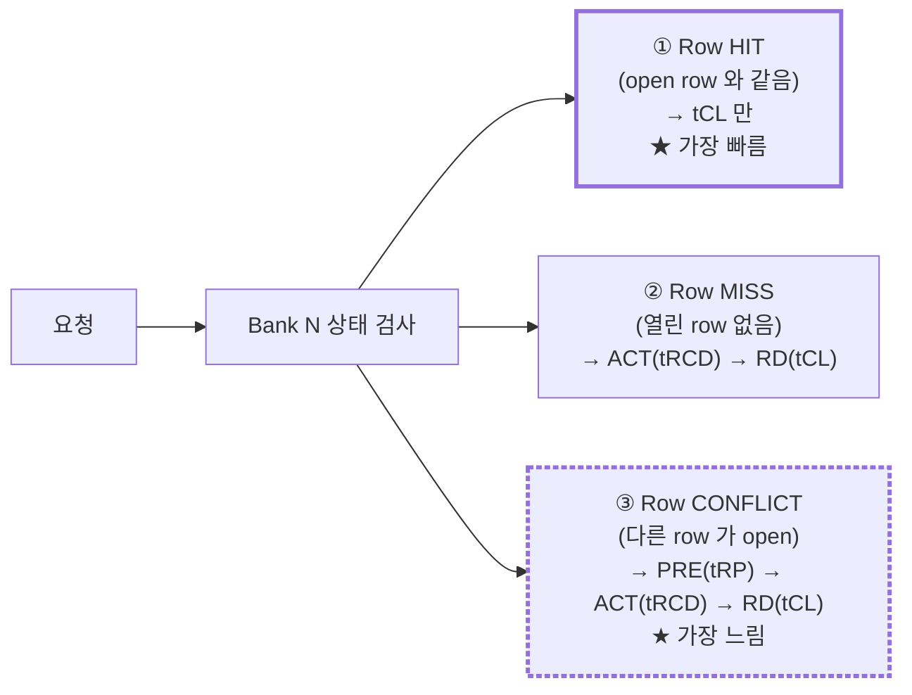
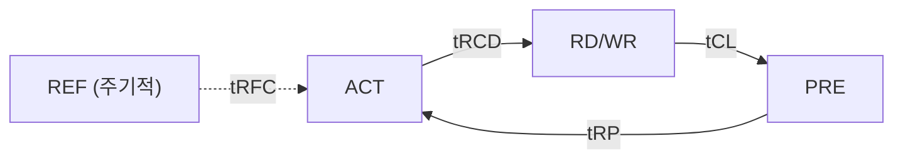

# Module 05 — Quick Reference Card

<!-- DV-SKOOL-CH-CTX:start -->
<div class="chapter-context" data-cat="memory">
  <a class="chapter-back" href="../">
    <span class="chapter-back-arrow">←</span>
    <span class="chapter-back-icon">💾</span>
    <span class="chapter-back-text">DRAM / DDR</span>
  </a>
  <span class="chapter-divider">›</span>
  <span class="chapter-marker chapter-quickref-marker">★ Quick Reference</span>
</div>
<!-- DV-SKOOL-CH-CTX:end -->

<!-- DV-SKOOL-CH-TOC:start -->
<div class="page-toc">
  <span class="page-toc-label">목차</span>
  <a class="page-toc-link" href="#1-why-care-이-카드가-왜-필요한가">1. Why care?</a>
  <a class="page-toc-link" href="#2-intuition-한-장으로-보는-dram-ddr">2. Intuition</a>
  <a class="page-toc-link" href="#3-이-카드를-펼쳐야-할-3-시나리오">3. 3 시나리오</a>
  <a class="page-toc-link" href="#4-일반화-카드를-구성하는-축">4. 일반화</a>
  <a class="page-toc-link" href="#5-디테일-표-타이밍-명령-스토리">5. 디테일</a>
  <a class="page-toc-link" href="#6-이-카드를-봐야-할-때-와-흔한-오해">6. 카드 트리거 + 흔한 오해</a>
  <a class="page-toc-link" href="#7-핵심-정리-key-takeaways">7. 핵심 정리</a>
</div>
<!-- DV-SKOOL-CH-TOC:end -->

!!! objective "사용 목적 / 학습 목표"
    이 카드를 마치면:

    - **Recall** ACT / RD / WR / PRE / REF 명령 흐름 + 핵심 timing parameter (tRCD/tCAS/tRP/tRAS/tRC/tFAW/tREFI/tRFC) 를 즉시 떠올릴 수 있다.
    - **Distinguish** Row Hit / Row Miss / Row Conflict 의 latency 차이를 timing 합으로 계산할 수 있다.
    - **Identify** tRCD violation / refresh storm / bank conflict 증상에서 가장 먼저 봐야 할 신호와 카운터를 지목할 수 있다.
    - **Apply** DDR4 vs DDR5 비교 표를 면접 / 코드 리뷰 / 디버그에서 5초 이내 펼쳐 답변 골격을 구성한다.
    - **Justify** Samsung MC / MI / BootROM / UFS 프로젝트 경험을 카드의 "이력서 연결" 와 정렬하여 진술한다.

!!! info "사전 지식"
    - [Module 01 — DRAM Fundamentals](01_dram_fundamentals_ddr.md) ~ [Module 04 — DRAM DV 방법론](04_dram_dv_methodology.md) 완주 권장
    - 카드 단독 학습 비권장 — 본문에서 한 번 추적한 뒤 카드는 "재호출 트리거" 로 사용

---

## 1. Why care? — 이 카드가 왜 필요한가

DRAM 4 모듈을 끝까지 읽으면 머릿속에 _세 묶음_ 이 남습니다 — (1) 명령 시퀀스 `ACT → RD/WR → PRE → REF`, (2) timing 묶음 `tRCD / tCL / tRP / tRAS / tRC / tFAW / tRFC / tREFI`, (3) DDR4↔DDR5 의 6 가지 차이축. 면접 / 코드 리뷰 / waveform 분석 중에 _어느 묶음의 어느 행_ 을 펼칠지 5 초 안에 결정해야 합니다.

이 카드는 본문이 아니라 **본문을 다 읽은 뒤의 _index_** 입니다. 카드의 각 표 항목은 "이 줄을 보면 어느 본문 모듈의 어디로 점프할지" 가 1:1 매핑됩니다. 카드만 외우면 가짜 마스터리 — capacitor 의 _왜_ 가 빠진 숫자 묶음은 follow-up 에서 즉시 깨집니다.

---

## 2. Intuition — 한 장으로 보는 DRAM/DDR

!!! tip "💡 한 줄 비유"
    **DRAM 마스터 = 모든 timing parameter 의 영향 인지** ≈ **공장 라인의 모든 사이클 타임을 외운 공정 엔지니어**

    tRCD, tRP, tRAS, tFAW, tRFC 의 위반 시 어떤 증상이 나오는지 즉시 떠오르는 것이 마스터. 카드는 그 영향 매핑을 1 페이지로 재호출하는 _참조 지도_.

### 한 장 그림 — Row 접근 3 결말 + 명령 흐름





- **윈도우 게이트**: tFAW (4 ACT / window), tREFI (refresh 주기)

### 왜 카드가 이렇게 정리되는가 — Design rationale

DRAM 의 모든 timing 은 _capacitor 의 물리_ 에서 나옵니다. 누설 → refresh (tREFI, tRFC), 파괴적 read → restore (tRAS), row 전환 비용 → precharge (tRP). 그래서 카드는 _3 결말 × 4 명령 × 8 timing_ 의 작은 매트릭스로 압축되며, 모든 면접 / 디버그 질문은 이 매트릭스의 한 셀로 환원됩니다.

---

## 3. 이 카드를 펼쳐야 할 3 시나리오

본문의 어느 모듈로 점프할지 카드가 안내하는 가장 흔한 3 실제 상황을 step-by-step.

### 3.1 시나리오 A — Protocol checker 가 `tRCD violation @ T=12345ns` 보고

```
   ┌─ 증상 ─────────────────────────────────────────────────┐
   │  SVA assertion: ACT 후 RD 가 tRCD=22 cycle 전에 도착   │
   │  같은 (rank, bank) 에서 발생, DDR4-3200 환경           │
   │  Failure rate: 한 패턴에서만 100%, 다른 패턴 0%        │
   └────────────────────────────────────────────────────────┘
            │
            ▼
   ┌─ 카드의 어느 표를 펼치는가 ────────────────────────────┐
   │  §5.2 "핵심 타이밍 파라미터" → tRCD 행                 │
   │  → ACT → RD/WR (Row to Column Delay)                   │
   │                                                         │
   │  §5.1 "핵심 정리" → "Row Hit/Miss" 행                  │
   │  → Miss = tRCD+tCL, Conflict = tRP+tRCD+tCL            │
   │                                                         │
   │  §5.4 면접 골든 룰 #4 "tCL-tRCD-tRP 22-22-22" 표기     │
   └────────────────────────────────────────────────────────┘
            │
            ▼
   ┌─ 본문으로 점프할 위치 ─────────────────────────────────┐
   │  Module 01 §3  →  Row Conflict cycle-by-cycle 추적     │
   │  Module 02     →  MC 스케줄러의 명령 발행 로직         │
   │  Module 04 §6  →  Protocol Checker SVA 디버그          │
   └────────────────────────────────────────────────────────┘
```

| Step | 누가 | 무엇을 | 왜 |
|---|---|---|---|
| ① | 카드 | tRCD 의 _정의_ 회수 (ACT→RD/WR 간격) | "tRCD 가 무엇인지" 1 줄 진술 |
| ② | 카드 | Row Hit/Miss/Conflict 의 timing 합 회수 | 위반 패턴이 _Miss 인지 Conflict 인지_ 분기 |
| ③ | 본문 | Module 02 (MC) 로 점프 | 스케줄러가 같은 bank 에 _연속 ACT_ 를 발행한 경위 |
| ④ | 본문 | Module 04 §6 (Protocol Checker) 로 점프 | SVA 의 cover property 와 assertion 매핑 확인 |

### 3.2 시나리오 B — 평균 BW 정상이나 워크로드 X 에서 throughput 50% 급락

```
   ┌─ 증상 ─────────────────────────────────────────────────┐
   │  read BW 평소 20 GB/s → 워크로드 X 에서 9 GB/s          │
   │  Latency tail (P99.9) 가 평소의 3× 까지 증가           │
   │  bank-level activate counter: 4-window 내 4회 도달 빈번 │
   └────────────────────────────────────────────────────────┘
            │
            ▼
   ┌─ 카드의 어느 표를 펼치는가 ────────────────────────────┐
   │  §5.7 "실무 주의점 — tFAW + Bank conflict" 박스         │
   │  → tFAW window 내 4 ACT 한도 + 같은 bank row miss       │
   │    → tRC/tRP 직렬화로 단순 합산보다 큰 stall            │
   │                                                         │
   │  §5.2 "핵심 타이밍" → tFAW, tRC, tRP                   │
   │                                                         │
   │  §5.5 "추가 핵심 용어" → tWTR, tRTW (R/W turnaround)   │
   └────────────────────────────────────────────────────────┘
            │
            ▼
   ┌─ 본문으로 점프할 위치 ─────────────────────────────────┐
   │  Module 01 §5  →  tFAW 의 _전류 한도_ 물리적 이유      │
   │  Module 02 §4  →  Bank parallelism + FR-FCFS 스케줄러   │
   │  Module 04 §5  →  성능 시나리오 + tail latency 측정     │
   └────────────────────────────────────────────────────────┘
```

| Step | 누가 | 무엇을 | 왜 |
|---|---|---|---|
| ① | 카드 | tFAW + bank conflict 의 _급락 메커니즘_ 회수 | 50% 절벽이 _가능한_ 이유 진술 |
| ② | 카드 | 같은 BG (tCCD_L) vs 다른 BG (tCCD_S) 차이 회수 | _왜 BG 분산이 효과적_ 인지 진술 |
| ③ | 본문 | Module 02 (MC) 로 점프 | 스케줄러가 BG / bank 분산을 못 하는 패턴 식별 |
| ④ | 본문 | Module 04 §5 로 점프 | tail latency 측정 + cover bin 설계 |

### 3.3 시나리오 C — Refresh storm 의심 — 일정 주기마다 read 멈춤

```
   ┌─ 증상 ─────────────────────────────────────────────────┐
   │  매 ~7.8 µs 마다 ~350 ns 동안 모든 bank read 가 stall   │
   │  effective BW 가 평균 ~5% 감소, P99.9 latency 가 +1 µs │
   │  DDR5 로 전환 후 같은 워크로드에서 stall 폭 감소        │
   └────────────────────────────────────────────────────────┘
            │
            ▼
   ┌─ 카드의 어느 표를 펼치는가 ────────────────────────────┐
   │  §5.2 "핵심 타이밍" → tREFI / tRFC                      │
   │  → tREFI = 7.8 µs (DDR4) / 3.9 µs (DDR5)                │
   │  → tRFC = REF → ACT 사이 (DDR4: ~350 ns class)          │
   │                                                         │
   │  §5.1 "핵심 정리" → "DDR4 → DDR5" 행                    │
   │  → Same-Bank REF 지원 (DDR5) ← 핵심                     │
   │                                                         │
   │  §5.4 면접 골든 룰 — All-bank vs Same-bank REF 차이     │
   └────────────────────────────────────────────────────────┘
            │
            ▼
   ┌─ 본문으로 점프할 위치 ─────────────────────────────────┐
   │  Module 01 §4  →  Refresh 의 물리 (capacitor leak)      │
   │  Module 02 §6  →  Refresh 관리 (all-bank vs same-bank)  │
   │  Module 03 §5  →  PHY: REF 중 DQ tristate 처리          │
   └────────────────────────────────────────────────────────┘
```

| Step | 누가 | 무엇을 | 왜 |
|---|---|---|---|
| ① | 카드 | tREFI / tRFC 회수 | _주기와 폭_ 의 숫자가 맞는지 검증 |
| ② | 카드 | DDR5 Same-bank REF 행 회수 | _DDR5 에서 폭이 줄어든 이유_ 진술 |
| ③ | 본문 | Module 02 §6 로 점프 | MC 가 same-bank vs all-bank REF 모드 선택 로직 |

!!! note "여기서 잡아야 할 두 가지"
    **(1) 카드는 _증상 → 표 위치 → 본문 위치_ 의 3-hop 인덱스.** 카드만 보면 _숫자_ 가 보이지만 _이유_ 는 본문에 있음. 면접 follow-up 의 깊이는 본문에서만 옴.<br>
    **(2) 시나리오마다 _숫자 1개 + 표 1개_ 만 회수해도 충분.** 모든 표를 떠올릴 필요 없고, _어느 표를 펼칠지_ 만 5초에 결정.

---

## 4. 일반화 — 카드를 구성하는 축

이 카드의 모든 표는 _세 축_ 으로 분류됩니다.

| 축 | 표 ID | 무엇을 인덱싱하는가 |
|---|---|---|
| **물리/타이밍축** | §5.1 핵심 정리, §5.2 타이밍, §5.3 명령 | capacitor → 명령 → timing 의 _why_ 묶음 |
| **세대축** | §5.4 DDR4 vs DDR5 비교, §5.5 추가 용어 | 세대간 _변화_ 와 _이유_ (Sub-Ch, ECC, BG, BL16) |
| **검증/스토리축** | §5.6 이력서 연결, §5.7 Samsung 위치, §5.8 실무 주의 | 자기 경험 ↔ 면접 follow-up 매핑 |

면접에서는 _물리축 → 세대축 → 검증축_ 순으로 답변이 흐르면 면접관의 follow-up 이 쉬워집니다. 카드는 이 3-hop 을 한 페이지에 압축한 것.

```
   ① 질문 도착 ─▶ ② 카드 펼침 ─▶ ③ 본문 점프
   ────────────   ─────────────   ─────────────
   "DDR5 의      §5.1 DDR4→DDR5   Module 01 §6
    핵심 차이?"  §5.4 비교 표     세대 비교
                                  Module 02 §6
                                  Same-bank REF
   30 초          5 초             1~2 분
```

---

## 5. 디테일 — 표, 타이밍, 명령, 스토리

### 5.1 한줄 요약 + 핵심 정리

```
MC = AXI 요청을 DRAM 명령(ACT/RD/WR/PRE/REF)으로 변환 + 타이밍 준수 + Row Hit 극대화
MI/PHY = DDR 전기 신호 변환 + Training(타이밍 캘리브레이션)
```

| 주제 | 핵심 포인트 |
|------|------------|
| DRAM 셀 | 1T1C, Destructive Read → Restore, Refresh 필수 |
| 주소 계층 | Rank → Bank Group → Bank → Row → Column |
| Row Hit/Miss | Hit: tCL만, Miss: tRCD+tCL, Conflict: tRP+tRCD+tCL |
| Prefetch | 내부 저속 → I/O 고속 간 속도 차이 해결. DDR4: 8n(BL8), DDR5: 16n(BL16) |
| Bank Group | I/O 회로 공유 → 같은 BG: tCCD_L(느림), 다른 BG: tCCD_S(빠름) |
| DDR4 → DDR5 | 2×32-bit Sub-Ch, BG 4→8, Prefetch 8→16, On-die ECC, Same-Bank REF, CA 멀티플렉싱 |
| MC 핵심 | FR-FCFS + Bank Parallelism + Refresh 관리 + QoS Arbitration + Write Batching |
| Training | WL→Gate→DQ→Eye→VREF (+DDR5: CA Training, DFE), PVT 보상, BL2에서 수행 |
| DQS | Write: center-aligned, Read: edge-aligned + 90° shift |
| ODT | 신호 반사 방지, RTT_NOM/RTT_WR/RTT_PARK, Multi-Rank에서 비타겟 Rank 중요 |
| DBI | 데이터 반전으로 스위칭 전력 ~15% 절감, DDR5 기본 활성화 |
| Equalization | CTLE(아날로그 고주파 부스트) + DFE(ISI 디지털 제거), DDR5 필수 |
| LPDDR5 | WCK(데이터용 클럭 분리) + DVFSC(동적 전력/주파수) + PASR(부분 Refresh) |

### 5.2 핵심 타이밍 파라미터

```
tCL:   CAS Latency (RD → 데이터)
tRCD:  ACT → RD/WR (Row to Column Delay)
tRP:   PRE → ACT (Row Precharge)
tRAS:  ACT → PRE (Active to Precharge)
tRC:   ACT → ACT 같은 Bank (= tRAS + tRP)
tRFC:  REF → ACT (Refresh Cycle)
tREFI: Refresh Interval (7.8μs DDR4 / 3.9μs DDR5)
tCCD_S: CAS→CAS 다른 BG (짧음)
tCCD_L: CAS→CAS 같은 BG (길음)
```

### 5.3 DRAM 명령

```
ACT: Row Open (Row → Row Buffer)
RD:  Column 읽기
WR:  Column 쓰기
PRE: Row Close (Row Buffer → Idle)
REF: Refresh (데이터 보존)
MRS: Mode Register Set (설정)
ZQ:  임피던스 캘리브레이션
```

### 5.4 DDR4 vs DDR5 빠른 비교

```
         DDR4                    DDR5
속도:    1600~3200 MT/s         3200~8800 MT/s
채널:    1 × 64-bit             2 × 32-bit (Sub-Ch)
BG:      4                      8
Bank:    총 16                  총 32
Burst:   BL8                    BL16
ECC:     외부 DIMM              On-die ECC 내장
Refresh: All-bank               Same-bank 지원
```

### 5.5 면접 골든 룰

1. **Row Hit**: "MC의 최우선 목표 — Row Hit 극대화 = 불필요한 PRE+ACT 제거"
2. **DDR5 차이**: "Sub-Channel + BG 증가 + On-die ECC + CA 멀티플렉싱 + DFE"
3. **Training**: "PVT 변동 → 수백 ps 윈도우에서 정확 샘플링 → 동적 캘리브레이션 필수"
4. **타이밍**: tCL-tRCD-tRP 세 수치가 스펙 표기 (예: "22-22-22")
5. **BL2 연결**: "Training은 BL2에서 수행 — 코드 크고 변경 필요 → ROM 부적합"
6. **ODT**: "신호 반사 방지, RTT_NOM/WR/PARK 세 값 최적화, Multi-Rank에서 비타겟 중요"
7. **Prefetch**: "내부 저속/외부 고속 속도 차이 → 한 번에 여러 비트 읽어 고속 전송"
8. **QoS**: "Multi-Master SoC에서 Priority + BW Regulation + Aging + Urgent"
9. **Write Batching**: "R/W 터널라운드 비용 최소화 — Watermark 기반 Write Drain"
10. **LPDDR5 WCK**: "명령(CK)/데이터(WCK) 클럭 분리 → 데이터만 고속, 전력 절감"

### 5.6 추가 핵심 용어

```
ODT:    On-Die Termination (신호 반사 방지 내장 저항)
DBI:    Data Bus Inversion (전력 절감 비트 반전)
CTLE:   Continuous-Time Linear Equalizer (아날로그 EQ)
DFE:    Decision Feedback Equalizer (디지털 EQ)
WCK:    Write Clock (LPDDR5 데이터 전용 클럭)
DVFSC:  Dynamic Voltage Frequency Scaling Clock
PASR:   Partial Array Self-Refresh
MPC:    Multi-Purpose Command (DDR5)
SECDED: Single Error Correction, Double Error Detection
tWTR:   Write-to-Read turnaround delay
tRTW:   Read-to-Write turnaround delay
```

### 5.7 실무 주의 박스 + 비유

!!! warning "실무 주의점 — tFAW + Bank conflict 동시 발생 시 throughput cliff"
    **현상**: 평균 BW는 정상이나 특정 트래픽 패턴에서 effective BW가 50% 이하로 급락하고 latency tail 이 길어짐.

    **원인**: tFAW window 내 4 activate 한도 + 같은 bank row miss 가 겹치면 tRC/tRP 가 직렬화되어 단순 latency 합산보다 큰 stall 이 발생.

    **점검 포인트**: Bank-level activate 분포(시간축), tFAW 카운터, Row-buffer hit rate, 동일 bank-group 연속 access 비율을 함께 측정.

### 5.8 이력서 연결

| 항목 | 면접 질문 | 핵심 답변 |
|------|----------|----------|
| MC Follow × 2 | "MC 검증 경험은?" | 트래픽 패턴(Hit/Miss/Conflict) + Protocol Checker 타이밍 + Refresh + QoS |
| MI Follow | "PHY 검증 경험은?" | Training 시퀀스 + ODT/Equalization + 타이밍 마진 경계 테스트 |
| DDR4/5 프로토콜 | "DDR4/5 차이는?" | Sub-Ch, BG 증가, On-die ECC, Same-Bank REF, CA Training, DFE |
| BootROM 연결 | "부팅과 DRAM 관계는?" | BL2가 MC 설정 + Training → DRAM 사용 가능 |
| LPDDR5 모바일 | "LPDDR5 특징은?" | WCK 분리, DVFSC, PASR, 다양한 저전력 모드 |

### 5.9 Samsung 프로젝트에서의 위치

```
soc_secure_boot_ko: BootROM → BL2 (DRAM Training 수행)
                              ↓
dram_ddr_ko:        BL2 → [MC 설정] → [Training] → DRAM 사용 가능
                          ^^^^^^^^^^^^^^^^^^^^^^^^^^
                          MC/MI 검증 범위 (S5E9945, V920)

ufs_hci_ko:         UFS → BL2 이미지 로드 → BL2가 DRAM 초기화
→ 세 자료가 부팅 시퀀스에서 연결됨
```

---

## 6. 이 카드를 봐야 할 때 + 흔한 오해

### 6.1 카드 트리거 매트릭스 — "지금 카드를 펼쳐라"

| 트리거 (상황) | 카드의 어느 §를 펼치나 | 그다음 본문 어디로 |
|---|---|---|
| 면접관이 "DDR4/5 차이?" 30초 안에 답해야 | §5.4 비교 표 + §5.5 #2 | Module 01 §6 |
| SVA: `tRCD violation @ T=...` | §5.2 tRCD + §5.1 Row Hit/Miss 행 | Module 01 §3, Module 04 §6 |
| BW cliff (워크로드 X 만 50% 급락) | §5.7 tFAW 박스 + §5.2 tFAW/tRC | Module 02 §4, §6 |
| 일정 주기 stall (refresh storm 의심) | §5.2 tREFI/tRFC + §5.1 DDR4→DDR5 행 | Module 02 §6, Module 01 §4 |
| Training 실패 (read 데이터 ECC 폭주) | §5.1 Training 행 + §5.5 #3, #5 | Module 03 §3, §4 |
| Multi-rank 환경에서 read fail | §5.1 ODT 행 + §5.5 #6 | Module 03 §5 |
| LPDDR5 채용 결정 검토 | §5.1 LPDDR5 행 + §5.5 #10 | Module 01 §7 |
| BootROM ↔ DRAM 의존성 질문 | §5.8 BootROM 행 + §5.9 Samsung 도식 | Module 01 §7, Module 03 §3 |
| 코드 리뷰 — write drain 정책 의심 | §5.5 #9 Write Batching | Module 02 §5 |

### 6.2 흔한 오해 — 카드 사용 시 빠지기 쉬운 5 함정

!!! danger "❓ 오해 1 — 'Timing parameter 만 외우면 마스터다'"
    **실제**: Parameter 값보다 "왜 그 값인지" + "어떤 workload 에서 그 값이 critical 한지" 의 직관이 마스터의 핵심. 22-22-22 를 외워도 _왜 tRAS 가 tRCD 의 ~2× 인가_ 를 capacitor restore 시간으로 설명 못 하면 follow-up 에서 막힘.<br>
    **왜 헷갈리는가**: Cheat sheet 의 숫자가 정량적이라 "외우기 = 마스터" 같은 학습 패턴 유도. 실제로는 정성적 직관.

!!! danger "❓ 오해 2 — 'DDR5 가 DDR4 보다 모든 게 빠르다'"
    **실제**: DDR5 는 _bandwidth_ 가 빠르지만 _CAS latency (절대 ns)_ 는 거의 비슷하거나 약간 늘어남. 작은 random access 가 많은 워크로드에서는 DDR5 의 이점이 줄어듭니다. DDR5 의 진짜 이득은 _BG 증가 + Sub-Ch + Same-bank REF_ 로 parallelism 이 올라가는 부분.<br>
    **왜 헷갈리는가**: MT/s 가 두 배여서 "두 배 빠름" 으로 단순화.

!!! danger "❓ 오해 3 — 'Refresh 는 무시할 만한 오버헤드다'"
    **실제**: tRFC × (1 / tREFI) ≈ 4~7% 의 시간이 refresh 에 사용. tail latency 에서는 refresh 가 P99.9 의 _주요 원인_. DDR5 의 same-bank REF 가 _이 비용을 분산_ 해서 줄이는 게 핵심 가치.<br>
    **왜 헷갈리는가**: 평균 BW 에서만 보면 작게 보임.

!!! danger "❓ 오해 4 — 'PHY training 은 부트 시 한 번이면 충분'"
    **실제**: PVT (Process / Voltage / Temperature) 변동으로 _런타임 중 주기적 retrain_ 이 필요. 특히 ZQ calibration, MPR-based read training. 모바일 (LPDDR5) 은 DVFSC 와 함께 _매 주파수 점프마다_ 재캘리브.<br>
    **왜 헷갈리는가**: "boot training" 의 단어가 일회성을 암시.

!!! danger "❓ 오해 5 — 'On-die ECC 가 있으면 외부 ECC 는 불필요'"
    **실제**: DDR5 on-die ECC 는 _DRAM 어레이 내부의 soft error_ 만 정정. DDR bus 위의 신호 무결성 / link error 는 _외부 (system) ECC_ 로 따로 보호해야 함. Enterprise / server 는 둘 다 활성화.<br>
    **왜 헷갈리는가**: "ECC = 다 끝남" 으로 묶임.

### 6.3 DV 디버그 — 카드만 보고 잡아낼 수 있는 6 증상

| 증상 | 1차 의심 | 어디 보나 (카드 → 본문) |
|---|---|---|
| `tRCD violation` SVA fail | 같은 bank 에 ACT→RD 너무 빠름 | §5.2 tRCD → Module 02 §3 (issue 로직) |
| 평균 BW 정상, 특정 패턴만 50% | tFAW window + bank conflict | §5.7 박스 → Module 02 §4 |
| Periodic stall ~7.8 µs 주기 | REF 처리 (all-bank) | §5.2 tREFI / tRFC → Module 02 §6 |
| Read 데이터 ECC burst 빈발 | DQ training drift / eye margin | §5.1 Training 행 → Module 03 §4 |
| Multi-rank read 시 첫 burst fail | ODT 설정 (RTT_NOM/PARK) | §5.5 #6 → Module 03 §5 |
| BL2 가 DRAM 못 보고 hang | Training 실패 / MC 설정 누락 | §5.9 Samsung 도식 → Module 03 §3 |

---

## 7. 핵심 정리 (Key Takeaways)

- **카드 = 인덱스, 본문 = 답** — 카드의 한 줄은 본문의 1~2 페이지를 가리키는 _포인터_. 외우기 목적이 아니라 _점프 위치 결정_.
- **3 결말 × 4 명령 × 8 timing** — Row 접근의 모든 경우가 이 작은 매트릭스의 한 셀로 환원.
- **3 축 — 물리 / 세대 / 검증** — 면접 답변은 이 순서로 흐른다. §5.1-5.3 → §5.4 → §5.8-5.9.
- **DDR5 의 진짜 이득은 parallelism** — bandwidth 가 아니라 BG 증가 + Sub-Ch + Same-bank REF.
- **숫자는 상대값** — 7.8 µs / 350 ns / 22-22-22 는 DDR4-3200 기준의 _감각용_. 절대 spec 값으로 인용 금지.

!!! warning "실무 주의점"
    - 카드만 보고 답하면 follow-up 에서 "왜 그 값인가" 의 capacitor 물리 질문에 막힘. 본문 Module 01 의 _왜_ 를 반드시 한 번 추적.
    - §5.8 의 이력서 연결 표는 자기 프로젝트의 _실제 chip / 실제 measurement_ 로 치환해서 사용. 그대로 인용하면 면접관이 즉시 감지.
    - DDR4 와 DDR5 를 _섞어_ 인용하면 (예: BL8 + Sub-Ch) 면접관이 한 번에 신뢰 잃음. §5.4 표의 한 컬럼 안에서만 답.

### 7.1 자가 점검

!!! question "🤔 Q1 — 3 결말 즉답 (Bloom: Apply)"
    Row buffer 의 _3 결말_ (Hit / Miss / Conflict) 의 latency 순서?
    ??? success "정답"
        Hit < Miss < Conflict:
        - **Hit**: 이미 row open → CAS (CL) 만 → ~15 ns.
        - **Miss**: row 미 open → ACT + CAS → ~25 ns.
        - **Conflict**: 다른 row open → PRE + ACT + CAS → ~45 ns.
        - 결론: scheduler 의 KPI = miss/conflict 비율 최소화 → bank interleave + open-page policy.

!!! question "🤔 Q2 — DDR5 의 진짜 이득 (Bloom: Evaluate)"
    "DDR5 는 DDR4 보다 _대역폭 2 배_" 라는 답변의 문제?
    ??? success "정답"
        대역폭은 _이론치_, 실측 이득은 parallelism:
        - **이론**: DDR5-6400 vs DDR4-3200 → 2 배.
        - **실측**: Random access pattern (DV workload) 에서는 bank conflict 가 botteneck → DDR4 도 50% 만 사용.
        - DDR5 의 _진짜_ 이득: BG 8→16 + sub-channel 분리 + same-bank refresh → conflict 감소.
        - 결론: bandwidth 답변 → "왜 더 빠른가" follow-up 시 parallelism + refresh 으로 확장.

### 7.2 출처

**Internal (Confluence)**
- `DDR Curriculum` — Module 01–04 매핑
- `Memory Controller Tuning` — bank/row policy 사례

**External**
- JEDEC JESD79-4 *DDR4 SDRAM Specification*
- JEDEC JESD79-5 *DDR5 SDRAM Specification*
- Onur Mutlu *Memory Systems Course* (CMU/ETH) — DRAM scheduling

---

## 코스 마무리

4개 모듈 + Quick Ref 완료. 다음:

1. [퀴즈 인덱스](quiz/index.md)
2. [용어집](glossary.md)
3. 다른 토픽: [MMU](../../mmu/), [UVM 검증](../../uvm/), [Formal](../../formal_verification/)

<div class="chapter-nav">
  <a class="nav-prev" href="../04_dram_dv_methodology/">
    <div class="nav-label">◀ 이전</div>
    <div class="nav-title">DRAM DV 검증 전략</div>
  </a>
  <a class="nav-next" href="../quiz/">
    <div class="nav-label">다음 ▶</div>
    <div class="nav-title">퀴즈로 이동</div>
  </a>
</div>


--8<-- "abbreviations.md"
