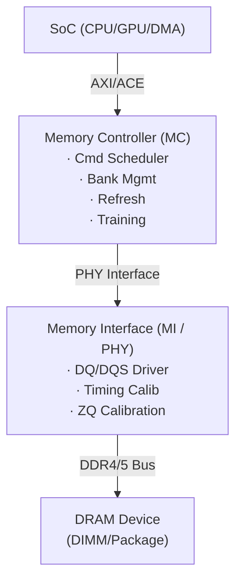

# DRAM Memory Controller & DDR4/5 — 개요 및 컨셉 맵

## 학습 플랜
- **레벨**: Intermediate (MC/MI Follow 경험 × 2 프로젝트 기반)
- **목표**: DRAM 동작 원리, DDR4/5 차이, Memory Controller 아키텍처, 검증 포인트를 설명할 수 있는 수준

## 핵심 용어집 (Glossary)

### 메모리 구조

| 약어 | 풀네임 | 설명 |
|------|--------|------|
| **DRAM** | Dynamic RAM | 커패시터(1T1C) 기반 휘발성 메모리, 주기적 Refresh 필요 |
| **DDR** | Double Data Rate | 클럭 상승/하강 엣지 모두에서 데이터 전송 |
| **BL** | Burst Length | 한 번의 명령으로 전송하는 데이터 수 (DDR4:8, DDR5:16) |
| **Prefetch** | — | 내부 저속↔외부 고속 속도 차이를 해결하는 다중 비트 읽기 |
| **BG** | Bank Group | Bank의 상위 그룹. 다른 BG 간 접근이 같은 BG보다 빠름 |

### 타이밍 파라미터

| 약어 | 풀네임 | 설명 |
|------|--------|------|
| **tCL** | CAS Latency | READ 명령 후 데이터 출력까지의 지연 (핵심 성능 지표) |
| **tRCD** | Row to Column Delay | ACTIVATE 후 READ/WRITE 가능까지의 최소 지연 |
| **tRP** | Row Precharge | PRECHARGE 후 다음 ACTIVATE 가능까지의 지연 |
| **tRAS** | Active to Precharge | ACTIVATE 후 PRECHARGE 가능까지의 최소 시간 |
| **tRFC** | Refresh Cycle | REFRESH 명령 후 ACTIVATE 가능까지의 지연 |
| **tREFI** | Refresh Interval | Refresh 주기 (DDR4: 7.8μs, DDR5: 3.9μs) |
| **tFAW** | Four Activate Window | 4개 ACTIVATE가 허용되는 최소 시간 윈도우 |

### 명령

| 약어 | 풀네임 | 설명 |
|------|--------|------|
| **ACT** | Activate | Row를 Row Buffer에 로드 |
| **PRE** | Precharge | Row Buffer를 닫아 다른 Row 접근 가능하게 함 |
| **REF** | Refresh | 커패시터 전하를 주기적으로 재쓰기 (데이터 유지) |
| **MRS** | Mode Register Set | CL, ODT 등 DRAM 동작 모드 설정 |
| **ZQ** | ZQ Calibration | 출력 임피던스 보정 |

### Physical Layer / Training

| 약어 | 풀네임 | 설명 |
|------|--------|------|
| **PHY** | Physical Layer | DDR 전기 신호 변환, Training, 임피던스 매칭 담당 |
| **MI** | Memory Interface | MC와 PHY 사이의 인터페이스 |
| **DQ/DQS** | Data / Data Strobe | 실제 데이터 신호 / 타이밍 기준 클럭 (차동) |
| **ODT** | On-Die Termination | DRAM 칩 내부 종단 저항 (신호 반사 방지) |
| **WL** | Write Leveling | DQS와 CK를 정렬하는 Write 경로 타이밍 보정 |
| **Eye** | Eye Diagram | 데이터 신호의 유효 수신 윈도우 (클수록 마진 충분) |
| **DFE** | Decision Feedback Equalizer | 이전 비트 기반으로 ISI를 디지털 제거하는 이퀄라이저 |
| **PVT** | Process, Voltage, Temperature | 공정/전압/온도 변동에 의한 칩 특성 편차 |

### 성능 / 전력

| 약어 | 풀네임 | 설명 |
|------|--------|------|
| **Row Hit/Miss/Conflict** | — | Hit=열린 Row 재접근(빠름), Miss=새 Row 열기, Conflict=닫고 열기(느림) |
| **FR-FCFS** | First Ready, First Come First Served | Row Hit 우선 처리 스케줄링 정책 |
| **ECC** | Error Correction Code | 에러 검출/수정 코드 (DDR5부터 On-die ECC 내장) |
| **DBI** | Data Bus Inversion | 전환 많은 데이터를 반전시켜 스위칭 전력 감소 |
| **LPDDR5** | Low Power DDR5 | 모바일용 저전력 메모리 (1.05V, WCK 분리) |

---

## 컨셉 맵

## 학습 단위 (Units)

| # | 단위 | 핵심 질문 |
|---|------|----------|
| 1 | **DRAM 기본 원리 + DDR4/5** | DRAM은 어떻게 동작하고, DDR4와 DDR5의 핵심 차이는? |
| 2 | **Memory Controller 아키텍처** | MC는 어떻게 DRAM 접근을 스케줄링하고 최적화하는가? |
| 3 | **Memory Interface / PHY** | 물리 계층에서 타이밍과 신호 무결성을 어떻게 보장하는가? |
| 4 | **DRAM DV 검증 전략** | MC/MI를 어떻게 검증하고, 어떤 시나리오가 중요한가? |

## 이력서 연결

| 이력서 항목 | 관련 Unit | 면접 시 활용 |
|------------|----------|-------------|
| MC Verification Follow × 2 (S5E9945, V920) | Unit 2, 4 | MC 스케줄링 + 검증 시나리오 |
| MI Verification Follow (S5E9945) | Unit 3, 4 | PHY Training + 타이밍 검증 |
| DDR4/5, LPDDR5 프로토콜 경험 | Unit 1 | 세대별 차이 + 설계 트레이드오프 |

--8<-- "abbreviations.md"
