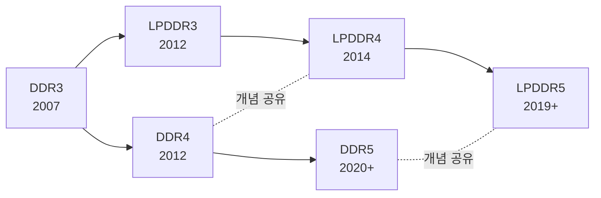

# Ch01. DRAM 기본 원리와 JEDEC 표준 지형도

<div class="chapter-context" data-cat="memory">
  <a class="chapter-back" href="./"><span class="chapter-back-arrow">←</span><span class="chapter-back-icon">📚</span> DRAM JEDEC Deep-Dive</a>
  <span class="chapter-divider">›</span>
  <span class="chapter-marker">CH 01</span>
</div>

## 🎯 Learning Objectives

이 챕터를 마치면 학습자는 다음을 할 수 있습니다.

- **Explain**: DRAM 1T1C cell의 동작 원리와 destructive read 결과로서의 row buffer/precharge 개념을 설명한다.
- **Differentiate**: JEDEC JESD79 시리즈(DDR)와 JESD209 시리즈(LPDDR)를 사용 분야·전력·기능 차원에서 구분한다.
- **Identify**: DDR4 → DDR5, LPDDR4 → LPDDR5 진화에서 도입된 핵심 신기능 5가지를 식별한다.
- **Justify**: DV 엔지니어가 JEDEC 스펙 원문을 직접 읽어야 하는 이유를 검증 품질 관점에서 정당화한다.

## Prerequisites

- 디지털 회로 기본 (capacitor 충방전, sense amplifier 개념)
- 동기식 인터페이스 기본 (clock, setup/hold)
- 용어집 사전 학습: [DRAM, SDRAM, DDR, Bank, Row, Column](appendix_b_glossary.md)

## 1. 왜 DV 엔지니어가 스펙을 직접 읽어야 하는가

> "스펙 요약본은 빠르게 이해하기 좋지만, 검증 환경의 진실은 스펙 원문에 있다."

DRAM 검증에서 발생하는 버그의 상당수는 **스펙의 corner 조항**에서 발생합니다. 예시:

- DDR5 `tCCD_L_WR2` 가 DDR5의 일반 `tCCD_L` 과 별도로 정의됨 — 요약본에는 누락 가능
- LPDDR5 의 `Write Link ECC` 가 활성화될 때 `tWR` 이 다르게 적용됨 (스펙 §9.2.1.2)
- DDR5 `RFM` 명령이 `RAA Counter` 값에 따라 *반드시* 전송되어야 하는 시점 — 위반 시 Rowhammer 가능

DV 엔지니어가 스펙 요약본만 보면 위 corner 들을 놓치기 쉽고, scoreboard / SVA / coverage가 모두 *통과*하지만 실제 silicon에서 fail이 나는 상황이 발생합니다.

**규칙**: 검증 모델·assertion·coverage 작성 시 *항상* 스펙 원문에서 해당 조항을 직접 확인하고, 코드 주석에 `JESD79-5C §3.5.59` 같은 출처를 남깁니다.

---

## 2. DRAM 셀의 본질 — 1T1C와 destructive read

DRAM cell은 **1 transistor + 1 capacitor (1T1C)** 구조입니다.

```
        word_line (row)
              │
              ▼
        ┌─────────────┐
        │  Access TR  │
        └──────┬──────┘
               │
       bit_line (column)
               │
              ─┴─  (capacitor)
              ───
               │
              GND
```

### 2.1 핵심 동작 4 단계

| 단계 | 명령 | 동작 |
|---|---|---|
| ① ACTIVATE (ACT) | ACT bank,row | Word line → cap charge → sense amp 가 row buffer로 latch |
| ② READ/WRITE | RD/WR bank,col | sense amp(row buffer)에서 column 선택 → DQ |
| ③ PRECHARGE (PRE) | PRE bank | bit line 을 VDD/2로 복원, row buffer 닫음 |
| ④ REFRESH | REF | 모든 row를 주기적으로 ACT-PRE로 재충전 (cap leakage 보상) |

### 2.2 destructive read — 왜 PRE가 필요한가

cap의 charge를 sense amplifier가 감지하는 순간, **원본 charge는 손실**됩니다(즉 *destructive*). 그래서 sense amp이 *동시에 복원* 합니다. 그러나 다른 row로 옮기려면 현재 row buffer를 *닫고*(PRE), 새 row를 *열어야*(ACT) 합니다.

이 ACT → PRE → 다음 ACT 사이클이 모든 DRAM timing의 출발점입니다. 핵심 timing 파라미터:

- `tRCD` (Row-to-Column Delay): ACT → 첫 RD/WR 가능 시점
- `tRP` (Row Precharge): PRE → 다음 ACT 가능 시점
- `tRC` (Row Cycle): ACT → 동일 bank의 다음 ACT
- `tRAS` (Row Active): ACT → 같은 bank의 PRE 까지 최소 active 시간

!!! info "DV 적용 — 가장 기본적인 assertion"
    `tRCD`/`tRP`/`tRC`/`tRAS` 위반은 DRAM 검증에서 가장 먼저 짚는 항목입니다. Ch06에서 SVA로 직접 작성합니다.

---

## 3. JEDEC 표준 패밀리 — 두 갈래의 진화

JEDEC(Joint Electron Device Engineering Council)은 DRAM 표준의 사실상 단일 출처입니다. DV 엔지니어가 마주치는 주요 시리즈는 두 갈래입니다.

### 3.1 JESD79 — 메인스트림 DDR (서버/데스크탑)

| 표준 | 발표 | 대표 데이터 레이트 | 핵심 특징 |
|---|---|---|---|
| JESD79 (DDR) | 2000 | 200~400 MT/s | DDR 시작 |
| JESD79-2 (DDR2) | 2003 | 400~1066 MT/s | ODT 도입 |
| JESD79-3 (DDR3) | 2007 | 800~2133 MT/s | Fly-by topology |
| **JESD79-4 (DDR4)** | 2012 | 1600~3200 MT/s | Bank Group, CRC, CA Parity, FGR |
| **JESD79-5 (DDR5)** | 2020~ | 3200~8400 MT/s+ | Two-channel/DIMM, DFE, RFM, On-die ECC, DCA |

### 3.2 JESD209 — Low Power DDR (모바일/임베디드)

| 표준 | 발표 | 대표 데이터 레이트 | 핵심 특징 |
|---|---|---|---|
| JESD209 (LPDDR) | 2007 | 200~400 MT/s | 저전력 시작 |
| JESD209-2 (LPDDR2) | 2009 | 400~1066 MT/s | Multi-die package |
| JESD209-3 (LPDDR3) | 2012 | 800~2133 MT/s | Write Leveling |
| **JESD209-4 (LPDDR4)** | 2014 | 1600~4266 MT/s | Dual-channel die, CBT(Command Bus Training) |
| **JESD209-5 (LPDDR5)** | 2019~ | 3200~9600 MT/s+ | WCK Clocking, DVFS, Link ECC, ARFM/DRFM |

### 3.3 두 갈래의 분화 이유



**JESD79 (DDR)**는 *최대 대역폭과 용량* 우선 — 서버/데스크탑/HPC. 전압이 높고, ECC를 시스템 레벨에서 처리하는 가정.

**JESD209 (LPDDR)**는 *전력 효율* 우선 — 모바일/IoT/자동차. 저전압, 더 정교한 power-down 모드, package-on-package 형태가 일반적.

> **DV 시사점**: 동일한 "DDR" 이라 부르더라도, JESD79 vs JESD209는 *서로 다른 표준*입니다. 동일 vendor가 둘을 모두 만들고 controller IP도 둘을 모두 다루지만, 검증 환경은 *별도* 입니다.

---

## 4. DDR4 → DDR5 — 무엇이 달라졌나

> 출처: JESD79-4D / JESD79-5C.01 v1.31

### 4.1 한눈 비교 표

| 항목 | DDR4 (JESD79-4D) | DDR5 (JESD79-5C.01) |
|---|---|---|
| 데이터 레이트 (typical) | 1600~3200 MT/s | 3200~8400 MT/s |
| Channels per DIMM | 1 | **2** (independent 32-bit channels) |
| Bank Group | 4 BG | 8 BG |
| Burst Length | BL8 (BC4 옵션) | **BL16 / BL32 (옵션)** |
| Burst Length per channel | 8 = 64-bit access | 16 × 4(32-bit) = 64-bit access |
| Vdd / Vddq | 1.2V | **1.1V** |
| Command | 1-cycle | **2-cycle command** (CA[6:0] × 2) |
| Equalization | — | **Decision Feedback Equalization (DFE)** |
| Refresh Management | FGR (Fine Granularity) | **RFM (Refresh Management) — MR58/59** |
| ECC | (System) | **On-die ECC (Transparency ECC)** + system ECC |
| Voltage regulation | Motherboard | **On-DIMM PMIC** (server) |
| MR 수 | MR0~MR6 | **MR0~MR254** (DFE/DCA/per-DQ 영역 포함) |

### 4.2 DDR5에서 새로 등장한 5가지 — DV가 가장 주목할 것

1. **2-cycle command** — 명령 자체가 2 클럭에 걸쳐 전송. SVA 시 `@(posedge clk) command begins` 같은 timing 가정을 다시 짜야 함.
2. **DFE (Decision Feedback Equalization)** — DDR5 receiver가 ISI를 보상. MR21~MR22, MR111~MR116 등에 설정. 훈련 단계에서 DV가 sweep 시나리오 필요.
3. **RFM (Refresh Management)** — controller가 추적하는 `RAA (Rolling Accumulated ACT) counter`가 threshold 도달 시 RFM 명령 발급. Rowhammer 대응. (Ch07)
4. **Transparency ECC** — DRAM 내부에서 ECC syndrome 자동 처리. controller는 *알 수 없는* 상태로 보이지만, MR15에서 임계 threshold 설정 가능. (Ch09)
5. **DCA (Duty Cycle Adjuster)** — high-speed signaling에서 duty cycle을 fine-tune. MR42~MR48, MR103~MR254 영역.

---

## 5. LPDDR4 → LPDDR5 — 무엇이 달라졌나

> 출처: JESD209-4E / JESD209-5C

### 5.1 한눈 비교 표

| 항목 | LPDDR4 (JESD209-4E) | LPDDR5/5X (JESD209-5C) |
|---|---|---|
| 데이터 레이트 (typical) | 1600~4266 MT/s | 3200~9600 MT/s+ |
| Clock 구조 | 단일 CK 1:1 | **WCK + CK** (분리) |
| Vddq | 0.6V | **0.5V or 0.3V** (LPDDR5X) |
| Bank 구조 | 8 BG (16 banks) | **8B / 16B mode, BG mode** |
| Burst Length | BL16 / BL32 | BL16 / BL32 |
| Command Bus Training | CBT (DQ-based) | **CBT Mode1/Mode2** (Three Physical MR) |
| Equalization | — | **Per-pin DFE** |
| Voltage Scaling | — | **DVFS** (DVFSC, Enhanced DVFSC, DVFSQ) |
| ECC | (System) | **Link ECC (DRAM↔Controller 링크 보호)** |
| Refresh Management | All-bank / Per-bank | **ARFM (Adaptive) / DRFM (Directed) + PASR/PARC** |
| Sleep modes | Self Refresh | **Deep Sleep Mode** 추가 |

### 5.2 LPDDR5에서 새로 등장한 5가지 — DV가 가장 주목할 것

1. **WCK (Write Clock) 분리** — CK는 command, WCK는 data. CK 대비 WCK는 4× 또는 2× 빠름. WCK2CK leveling이 별도 training. (Ch08)
2. **DVFS (Dynamic Voltage Frequency Scaling)** — 동작 중 Vddq/주파수 동적 변경. DVFSC(Common parts), DVFSQ(Q output side). MR set 전환과 함께. (스펙 §7.7.1)
3. **Link ECC** — DRAM과 controller 사이 *링크*에서 발생하는 에러를 ECC로 보호. encoding/decoding matrix가 정의됨. DDR5 *Transparency* ECC와는 보호 대상이 다름. (Ch09)
4. **ARFM/DRFM** — Adaptive와 Directed Refresh Management. 컨트롤러가 더 정밀하게 hot row를 식별/지정해서 refresh 가능. (Ch07)
5. **Per-pin DFE** — DQ pin마다 별도 DFE 계수. MR 셋업 양이 늘어남.

---

## 6. DV 관점 — 4개 스펙을 어떻게 다룰 것인가

### 6.1 한 controller IP가 여러 스펙을 지원하는 경우

상용 메모리 컨트롤러 IP (예: Synopsys DesignWare, Cadence Denali, ARM CMN)는 *configurable*로 여러 스펙을 한 RTL에서 지원합니다.

```
DDR_CTRL (parameterized)
├── DDR4 mode  → 1-cycle cmd, BL8,  4 BG
├── DDR5 mode  → 2-cycle cmd, BL16, 8 BG, RFM
├── LPDDR4 mode → BL16, CBT
└── LPDDR5 mode → BL16/32, WCK, DVFS, Link ECC
```

**DV 시사점**: 동일 RTL이지만 mode마다 *별도의 testbench config*가 필요합니다. Coverage도 mode별로 별도 covergroup, 그리고 mode-cross coverage가 필요할 수 있습니다.

### 6.2 검증 환경 구성 — 4가지 패턴

| 패턴 | 설명 | 사용 시점 |
|---|---|---|
| Spec-only TB | DRAM model + protocol checker만 | VIP 자체 검증 |
| Controller TB | RTL controller + DRAM model + agent | controller IP 검증 |
| SoC integration TB | SoC top + controller + PHY + DRAM | 통합 검증 |
| FPGA emulation | 위 TB의 emulation 변형 | 회귀 시간 단축 |

이 학습 자료는 *Controller TB* 와 *Spec-only TB* 사이를 주로 다룹니다. PHY는 *별도 검증 환경*인 경우가 많아 다루지 않습니다.

### 6.3 본 학습 자료의 코드 컨벤션

- 모든 SystemVerilog 예제는 **SystemVerilog-2017 + UVM 1.2** 기반
- `uvm_info` / `uvm_error` 사용, `$display` / `$finish` 금지
- 스펙 인용은 `JESD79-5C §3.5.59` 형식
- 가정/추론은 *(inferred)* 또는 **(추론)** 으로 명시

---

## 7. 대표 문제 — JEDEC 시리즈 분류

!!! question "Q1. 다음 controller IP 검증 상황을 보고, 어떤 JEDEC 스펙을 적용해야 하는지 분류하시오."
    상황 A: 데이터센터 서버용 메모리, 64-bit DIMM, 6400 MT/s, on-DIMM PMIC

    상황 B: 스마트폰 메모리, PoP 패키지, 6400 MT/s, 0.3V Vddq

    상황 C: 자동차 ADAS 메모리, 1.1V Vdd, 4800 MT/s, channel 분리

???+ answer "풀이 (사고 과정)"
    **상황 A 분석**:
    - "서버" + "64-bit DIMM" → 서버급 = JESD79 계열
    - "6400 MT/s" → DDR4 최대(3200)를 넘음 → **DDR5**
    - "on-DIMM PMIC" 는 DDR5의 시그니처 → **확정: JESD79-5 (DDR5)**

    **상황 B 분석**:
    - "스마트폰" + "PoP" → 저전력 = JESD209 계열
    - "0.3V Vddq" → LPDDR4의 0.6V 보다 낮음 → **LPDDR5X** (Vddq=0.3V는 LPDDR5X의 특징)
    - **확정: JESD209-5C (LPDDR5X)**

    **상황 C 분석**:
    - "1.1V Vdd" + "channel 분리" 는 DDR5의 시그니처
    - 자동차용 자동차 등급(extended temperature)은 LPDDR5에도 있지만 1.1V는 DDR5 영역
    - "4800 MT/s" 는 DDR5/LPDDR5 모두 가능
    - **확정: JESD79-5 (DDR5)** — automotive grade

    !!! tip "DV 적용 — controller IP가 위 세 상황을 모두 지원할 때"
        - 같은 RTL이라도 mode별로 *별도 sanity test*가 필요
        - covergroup `dram_spec_mode_cg` 에 `DDR4 / DDR5 / LPDDR4 / LPDDR5` 4가지 bin
        - 각 mode에서 *최소* command set이 동작하는지 (`ACT/RD/WR/PRE/REF`) directed test로 먼저

---

## 8. 핵심 정리 (Key Takeaways)

- DRAM은 1T1C cell + destructive read → ACT/RD/WR/PRE/REF의 4단계 동작이 모든 timing의 기반.
- JEDEC 표준은 두 갈래: **JESD79 (DDR, 메인스트림)** / **JESD209 (LPDDR, 저전력)**.
- DDR4 → DDR5의 결정적 변화: 2-cycle command, DFE, RFM, on-die ECC, MR 0~254 영역.
- LPDDR4 → LPDDR5의 결정적 변화: WCK 분리, DVFS, Link ECC, ARFM/DRFM, per-pin DFE.
- DV 엔지니어는 *항상* 스펙 원문에서 corner 조항을 직접 확인하고, 코드 주석에 출처를 명시한다.
- 하나의 controller IP가 여러 스펙을 지원할 때, mode별 testbench config + mode-cross coverage 필수.

## 9. Further Reading

- 다음 챕터: [Ch02. 패키지·핀아웃·어드레싱](02_package_pinout_addressing.md)
- 부록: [JEDEC Spec 빠른 참조](appendix_a_quick_reference.md)
- 퀴즈: [Ch01 퀴즈](quiz/ch01_quiz.md)
- 외부 자료:
    - JEDEC 공식 홈페이지 — 표준 다운로드 (회원/무료 일부)
    - Micron / Samsung / SK hynix 의 DDR5/LPDDR5 백서 (vendor 공개 자료)

<div class="chapter-nav">
  <span></span>
  <a class="nav-next" href="02_package_pinout_addressing/">
    <div class="nav-label">다음 →</div>
    <div class="nav-title">Ch02. 패키지·핀아웃·어드레싱</div>
  </a>
</div>
