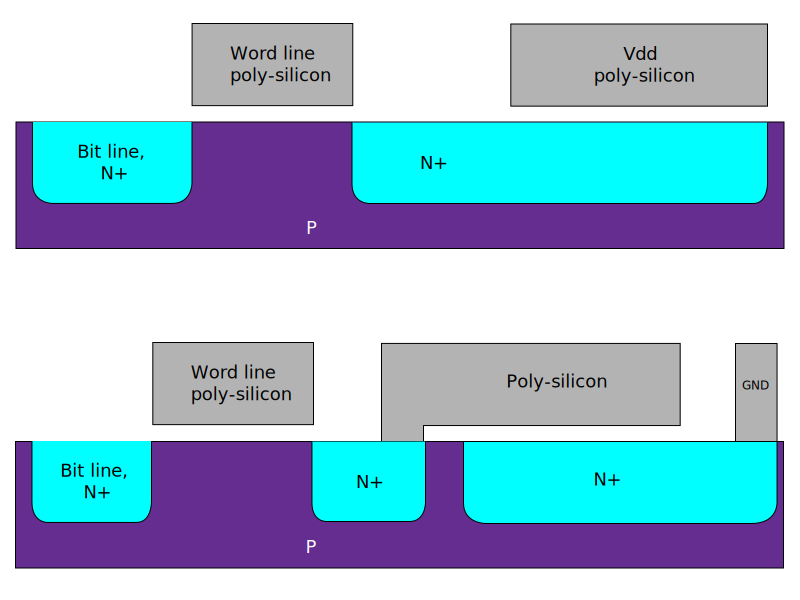

# Ch01. DRAM 기본 원리와 JEDEC 표준 지형도

<div class="chapter-context" data-cat="memory">
  <a class="chapter-back" href="../"><span class="chapter-back-arrow">←</span><span class="chapter-back-icon">📚</span> DRAM JEDEC Deep-Dive</a>
  <span class="chapter-divider">›</span>
  <span class="chapter-marker">CH 01</span>
</div>

## 🎯 Learning Objectives

이 챕터를 마치면 학습자는 다음을 할 수 있습니다.

- **Explain**: DRAM 1T1C cell의 동작 원리와 destructive read 결과로서의 row buffer/precharge 개념을 설명한다.
- **Differentiate**: JEDEC JESD79 시리즈(DDR)와 JESD209 시리즈(LPDDR)를 사용 분야·전력·기능 차원에서 구분한다.
- **Identify**: DDR4 → DDR5, LPDDR4 → LPDDR5 진화에서 도입된 핵심 신기능 5가지를 식별한다.
- **Justify**: DV 엔지니어가 JEDEC 스펙 원문을 직접 읽어야 하는 이유를 검증 품질 관점에서 정당화한다.

## Prerequisites

- 디지털 회로 기본 (capacitor 충방전, sense amplifier 개념)
- 동기식 인터페이스 기본 (clock, setup/hold)
- 용어집 사전 학습: [DRAM, SDRAM, DDR, Bank, Row, Column](appendix_b_glossary.md)

## 1. 왜 DV 엔지니어가 스펙을 직접 읽어야 하는가

> "스펙 요약본은 빠르게 이해하기 좋지만, 검증 환경의 진실은 스펙 원문에 있다."

DRAM 검증에서 발생하는 버그의 상당수는 **스펙의 corner 조항**에서 발생합니다. 요약본이나 애플리케이션 노트에는 공통 케이스만 기술되는 경우가 많고, 특정 기능을 활성화했을 때만 적용되는 타이밍 예외나 카운터 임계 조건은 스펙 원문의 주석(NOTE) 형태로만 남아 있을 때가 있습니다. 실제 예를 들면, DDR5의 `tCCD_L_WR2`는 일반적인 `tCCD_L`과 별도로 정의된 파라미터인데 요약본에서 누락되기 쉽고, LPDDR5에서 `Write Link ECC`가 활성화될 때 `tWR` 적용 규칙이 달라지는 내용은 스펙 §9.2.1.2에만 명시되어 있습니다. DDR5 `RFM` 명령은 `RAA Counter`가 임계치에 도달한 시점에 반드시 전송해야 하며 이를 어기면 Rowhammer 보호가 무력화됩니다.

DV 엔지니어가 스펙 요약본만 보면 위와 같은 corner들을 놓치게 되고, scoreboard · SVA · coverage가 모두 통과하는데도 실제 silicon에서 fail이 나는 최악의 상황이 발생합니다. 시뮬레이션에서 잡지 못한 버그는 검증 비용이 수십 배로 뛰기 때문에, 스펙 원문을 직접 확인하는 습관은 선택이 아닌 필수입니다.

**규칙**: 검증 모델·assertion·coverage 작성 시 *항상* 스펙 원문에서 해당 조항을 직접 확인하고, 코드 주석에 `JESD79-5C §3.5.59` 같은 출처를 남깁니다.

---

## 2. DRAM 셀의 본질 — 1T1C와 destructive read

DRAM cell은 **1 transistor + 1 capacitor (1T1C)** 구조입니다. 단 하나의 access transistor와 단 하나의 storage capacitor로 1비트를 저장하는 이 극단적 단순함이 SRAM(6T) 대비 셀 면적을 1/6 수준으로 줄여, GB급 집적을 가능하게 한 출발점입니다.

<figure markdown>
  { width="620" style="background:#ffffff; padding:14px 10px; border-radius:8px;" }
  <figcaption><b>1T1C NMOS 셀의 단면 구조</b> — DRAM을 처음 정의한 1968년 특허(US 3,387,286)의 셀 설계. <b>word line</b>이 access transistor의 poly-silicon gate를 제어하고, gate가 열리면 <b>bit line</b> 쪽 N+ 확산영역과 <b>capacitor</b>가 도통하여 전하가 오간다. capacitor에 저장된 전하의 유무가 곧 0/1이다.<br><small>출처: Wikimedia Commons, 저자 Cyferz — CC BY-SA 3.0 / GFDL (원본 무수정). 원본 파일: <i>Original 1T1C DRAM design.svg</i></small></figcaption>
</figure>

회로 토폴로지로 보면 세 단자의 연결이 핵심입니다 — **word line은 트랜지스터의 게이트**를, **bit line은 트랜지스터의 한쪽 단자**를, **capacitor는 반대쪽 단자**를 차지하고, capacitor의 다른 극은 공통 cell plate(보통 VDD/2)에 묶입니다. 즉 word line은 "이 셀을 열까 말까"를 결정하는 스위치 제어선이고, 실제 데이터는 bit line ↔ capacitor 사이를 오갑니다. 이 구조가 이어지는 모든 동작과 timing의 물리적 근거입니다.

### 2.1 셀이 모이면 — 어레이와 row buffer

실제 DRAM에서 셀은 하나씩 떨어져 있는 게 아니라 **2차원 격자(array)**로 빽빽이 깔립니다. 핵심은 **선의 공유**입니다. 같은 *행(row)*에 있는 셀들은 하나의 **word line을 공유**하고, 같은 *열(column)*에 있는 셀들은 하나의 **bit line을 공유**합니다. 그래서 word line 하나를 활성화하면 그 줄에 매달린 셀이 **전부 동시에** 자신의 bit line 위로 전하를 토해냅니다. 각 bit line의 끝에는 **sense amplifier가 하나씩** 달려 있어 이 미세 전압을 0/1로 증폭·latch하는데, 한 row 전체를 받아내는 **sense amplifier 배열 = row buffer**입니다. 즉 row buffer는 별도의 메모리가 아니라 "지금 열려 있는 한 row의 내용을 붙들고 있는 sense amp들의 모음"입니다. 이후 column 주소는 이 row buffer 안에서 어느 칸을 DQ로 내보낼지만 고르므로, 같은 row 안의 연속 접근(**row hit**)은 매우 빠릅니다.

```d2
direction: down

RowDec: "Row Decoder\n(한 번에 word line 1개만 활성화)" { style.fill: "#e8f0fe" }

WL0: "Word line 0" { style.fill: "#fff4e5" }
WL1: "Word line 1" { style.fill: "#fff4e5" }

C00: "1T1C"
C01: "1T1C"
C10: "1T1C"
C11: "1T1C"

BL0: "Bit line 0" { style.fill: "#e6f4ea" }
BL1: "Bit line 1" { style.fill: "#e6f4ea" }

SA0: "Sense Amp 0\n= Row Buffer" { style.fill: "#fce8e6" }
SA1: "Sense Amp 1\n= Row Buffer" { style.fill: "#fce8e6" }

IO: "Column Decoder / MUX → DQ (I/O)"

RowDec -> WL0
RowDec -> WL1
WL0 -> C00
WL0 -> C01
WL1 -> C10
WL1 -> C11
C00 -> BL0
C10 -> BL0
C01 -> BL1
C11 -> BL1
BL0 -> SA0
BL1 -> SA1
SA0 -> IO
SA1 -> IO
```

> 위 그림에서 word line 하나(예: WL0)가 올라가면 그 행의 모든 셀(C00·C01)이 각자의 bit line(BL0·BL1)으로 연결되고, 각 bit line 끝의 sense amp가 그 값을 latch합니다 — 이 sense amp들의 모음이 곧 row buffer입니다. column 단계는 row buffer에서 원하는 칸만 골라 DQ로 보냅니다.

### 2.2 핵심 동작 4 단계

| 단계 | 명령 | 동작 |
|---|---|---|
| ① ACTIVATE (ACT) | ACT bank,row | Word line → cap charge → sense amp 가 row buffer로 latch |
| ② READ/WRITE | RD/WR bank,col | sense amp(row buffer)에서 column 선택 → DQ |
| ③ PRECHARGE (PRE) | PRE bank | bit line 을 VDD/2로 복원, row buffer 닫음 |
| ④ REFRESH | REF | 모든 row를 주기적으로 ACT-PRE로 재충전 (cap leakage 보상) |

### 2.3 destructive read — 왜 PRE가 필요한가

capacitor에 저장된 charge를 sense amplifier가 감지하는 순간, **원본 charge가 bit-line으로 흘러나와 손실**됩니다. 이것이 destructive read입니다. sense amplifier는 이 미세한 전압 차이를 VDD/0으로 증폭하면서 *동시에* cell에 charge를 복원합니다. 그러나 다른 row에 접근하려면 현재 활성 row를 닫아야 하는데, bit-line을 VDD/2 수준으로 다시 평형 상태로 만드는 이 동작이 **Precharge(PRE)**입니다. PRE 없이는 다음 row를 열 수 없으므로, 모든 DRAM 접근은 ACT→(RD/WR)→PRE의 사이클로 귀결됩니다.

이 ACT → PRE → 다음 ACT 사이클이 모든 DRAM timing의 출발점입니다. 핵심 timing 파라미터:

- `tRCD` (Row-to-Column Delay): ACT → 첫 RD/WR 가능 시점. sense amp가 row를 완전히 latch하는 데 걸리는 시간입니다.
- `tRP` (Row Precharge): PRE → 다음 ACT 가능 시점. bit-line이 VDD/2로 완전히 복귀하는 데 걸리는 시간입니다.
- `tRC` (Row Cycle): ACT → 동일 bank의 다음 ACT. 사실상 tRAS + tRP의 합입니다.
- `tRAS` (Row Active): ACT → 같은 bank의 PRE 까지 최소 active 시간. 너무 일찍 PRE를 내리면 cell restore가 완료되지 않아 데이터가 손실됩니다.

!!! info "DV 적용 — 가장 기본적인 assertion"
    `tRCD`/`tRP`/`tRC`/`tRAS` 위반은 DRAM 검증에서 가장 먼저 짚는 항목입니다. Ch06에서 SVA로 직접 작성합니다.

---

## 3. JEDEC 표준 패밀리 — 두 갈래의 진화

JEDEC(Joint Electron Device Engineering Council)은 DRAM 표준의 사실상 단일 출처입니다. DV 엔지니어가 마주치는 주요 시리즈는 두 갈래입니다.

### 3.1 JESD79 — 메인스트림 DDR (서버/데스크탑)

| 표준 | 발표 | 대표 데이터 레이트 | 핵심 특징 |
|---|---|---|---|
| JESD79 (DDR) | 2000 | 200~400 MT/s | DDR 시작 |
| JESD79-2 (DDR2) | 2003 | 400~1066 MT/s | ODT 도입 |
| JESD79-3 (DDR3) | 2007 | 800~2133 MT/s | Fly-by topology |
| **JESD79-4 (DDR4)** | 2012 | 1600~3200 MT/s | Bank Group, CRC, CA Parity, FGR |
| **JESD79-5 (DDR5)** | 2020~ | 3200~8400 MT/s+ | Two-channel/DIMM, DFE, RFM, On-die ECC, DCA |

### 3.2 JESD209 — Low Power DDR (모바일/임베디드)

| 표준 | 발표 | 대표 데이터 레이트 | 핵심 특징 |
|---|---|---|---|
| JESD209 (LPDDR) | 2007 | 200~400 MT/s | 저전력 시작 |
| JESD209-2 (LPDDR2) | 2009 | 400~1066 MT/s | Multi-die package |
| JESD209-3 (LPDDR3) | 2012 | 800~2133 MT/s | Write Leveling |
| **JESD209-4 (LPDDR4)** | 2014 | 1600~4266 MT/s | Dual-channel die, CBT(Command Bus Training) |
| **JESD209-5 (LPDDR5)** | 2019~ | 3200~9600 MT/s+ | WCK Clocking, DVFS, Link ECC, ARFM/DRFM |

### 3.3 두 갈래의 분화 이유

```d2
direction: down

DDR3: "DDR3 2007"
DDR4: "DDR4 2012"
DDR5: "DDR5 2020+"
LPDDR3: "LPDDR3 2012"
LPDDR4: "LPDDR4 2014"
LPDDR5: "LPDDR5 2019+"

DDR3 -> DDR4
DDR3 -> LPDDR3
DDR4 -> DDR5
LPDDR3 -> LPDDR4
LPDDR4 -> LPDDR5

DDR4 -> LPDDR4: 개념 공유 {style.stroke-dash: 5}
DDR5 -> LPDDR5: 개념 공유 {style.stroke-dash: 5}
```

두 계열이 분리된 근본 이유는 사용 환경이 요구하는 최적화 방향이 정반대이기 때문입니다. 서버나 데스크탑은 전원이 항상 공급되므로 전력보다는 최대 대역폭과 용량이 우선됩니다. 그래서 **JESD79 (DDR)**는 전압을 비교적 높게 유지하고, ECC를 시스템(DIMM 또는 컨트롤러) 레벨에서 처리하는 구조를 택합니다. 반면 스마트폰이나 IoT 기기는 배터리로 동작하기 때문에, 동작하지 않는 시간에 전력을 최대한 아껴야 합니다. 그래서 **JESD209 (LPDDR)**는 저전압 설계, 더 정교한 power-down 모드, package-on-package 형태를 채택합니다.

두 계열은 세대별로 개념을 공유합니다. DDR5가 도입한 온다이 ECC 개념은 LPDDR5의 Link ECC와, DDR5의 RFM은 LPDDR5의 ARFM/DRFM과 서로 영향을 주고받으며 발전했습니다.

> **DV 시사점**: 동일한 "DDR" 이라 부르더라도, JESD79 vs JESD209는 *서로 다른 표준*입니다. 동일 vendor가 둘을 모두 만들고 controller IP도 둘을 모두 다루지만, 검증 환경은 *별도* 입니다.

---

## 4. DDR4 → DDR5 — 무엇이 달라졌나

> 출처: JESD79-4D / JESD79-5C.01 v1.31

### 4.1 한눈 비교 표

| 항목 | DDR4 (JESD79-4D) | DDR5 (JESD79-5C.01) |
|---|---|---|
| 데이터 레이트 (typical) | 1600~3200 MT/s | 3200~8400 MT/s |
| Channels per DIMM | 1 | **2** (independent 32-bit channels) |
| Bank Group | 4 BG | 8 BG |
| Burst Length | BL8 (BC4 옵션) | **BL16 / BL32 (옵션)** |
| Burst Length per channel | 8 = 64-bit access | 16 × 4(32-bit) = 64-bit access |
| Vdd / Vddq | 1.2V | **1.1V** |
| Command | 1-cycle | **2-cycle command** (CA[6:0] × 2) |
| Equalization | — | **Decision Feedback Equalization (DFE)** |
| Refresh Management | FGR (Fine Granularity) | **RFM (Refresh Management) — MR58/59** |
| ECC | (System) | **On-die ECC (Transparency ECC)** + system ECC |
| Voltage regulation | Motherboard | **On-DIMM PMIC** (server) |
| MR 수 | MR0~MR6 | **MR0~MR254** (DFE/DCA/per-DQ 영역 포함) |

### 4.2 DDR5에서 새로 등장한 5가지 — DV가 가장 주목할 것

1. **2-cycle command** — 명령 자체가 2 클럭에 걸쳐 전송됩니다. CA[6:0] 7개 핀으로는 DDR5가 요구하는 주소 비트와 OPCODE를 1 클럭에 담을 수 없기 때문에 2 클럭으로 나눈 것입니다. 그 결과 monitor는 2 클럭 윈도우를 모아야 명령을 reconstruct할 수 있고, SVA의 타이밍 가정도 1-cycle 기반에서 다시 설계해야 합니다.
2. **DFE (Decision Feedback Equalization)** — 8400 MT/s 이상의 고속 신호에서 ISI(심볼 간 간섭)를 보상하기 위해 DDR5 receiver에 DFE가 내장됩니다. MR21~MR22, MR111~MR116 등에 설정하며, 훈련 단계에서 DV는 sweep 시나리오가 필요합니다. (Ch08)
3. **RFM (Refresh Management)** — controller가 추적하는 `RAA (Rolling Accumulated ACT) counter`가 threshold에 도달하면 RFM 명령을 발급해야 합니다. 동일 row를 반복 access하면 인접 row에 bit flip이 생기는 Rowhammer 취약점을 JEDEC 표준 수준에서 대응하는 메커니즘입니다. (Ch07)
4. **Transparency ECC** — DRAM 내부에서 ECC 인코딩·디코딩이 자동으로 이루어져 controller에게는 투명하게 보입니다. 그러나 MR15에서 임계 threshold를 설정하고 MR16~MR20으로 에러 통계를 조회할 수 있으므로, DV는 이 통계가 정확히 갱신되는지 검증해야 합니다. (Ch09)
5. **DCA (Duty Cycle Adjuster)** — 고속 신호에서 clock/strobe의 duty cycle이 50%에서 벗어나면 eye가 비대칭해집니다. DCA는 이를 fine-tune하는 회로로, MR42~MR48과 MR103~MR254 영역에서 DQ 핀별로 설정합니다.

---

## 5. LPDDR4 → LPDDR5 — 무엇이 달라졌나

> 출처: JESD209-4E / JESD209-5C

### 5.1 한눈 비교 표

| 항목 | LPDDR4 (JESD209-4E) | LPDDR5/5X (JESD209-5C) |
|---|---|---|
| 데이터 레이트 (typical) | 1600~4266 MT/s | 3200~9600 MT/s+ |
| Clock 구조 | 단일 CK 1:1 | **WCK + CK** (분리) |
| Vddq | 0.6V | **0.5V or 0.3V** (LPDDR5X) |
| Bank 구조 | 8 BG (16 banks) | **8B / 16B mode, BG mode** |
| Burst Length | BL16 / BL32 | BL16 / BL32 |
| Command Bus Training | CBT (DQ-based) | **CBT Mode1/Mode2** (Three Physical MR) |
| Equalization | — | **Per-pin DFE** |
| Voltage Scaling | — | **DVFS** (DVFSC, Enhanced DVFSC, DVFSQ) |
| ECC | (System) | **Link ECC (DRAM↔Controller 링크 보호)** |
| Refresh Management | All-bank / Per-bank | **ARFM (Adaptive) / DRFM (Directed) + PASR/PARC** |
| Sleep modes | Self Refresh | **Deep Sleep Mode** 추가 |

### 5.2 LPDDR5에서 새로 등장한 5가지 — DV가 가장 주목할 것

1. **WCK (Write Clock) 분리** — LPDDR4까지는 command와 data가 같은 CK를 공유했습니다. LPDDR5는 CK를 command 전용으로, WCK를 data 전용으로 분리했는데 WCK는 CK보다 4× 또는 2× 빠릅니다. 두 클럭이 독립적으로 동작하므로 WCK2CK leveling이라는 별도 훈련 단계가 추가됩니다. (Ch08)
2. **DVFS (Dynamic Voltage Frequency Scaling)** — 모바일 기기는 워크로드에 따라 실시간으로 메모리 동작 주파수와 전압을 바꿔야 합니다. LPDDR5는 DVFSC(Common parts)·DVFSQ(Q output side) 등의 FSP(Frequency Set Point) 전환 시퀀스를 정의하며, 전환할 때마다 MR set을 함께 교체해야 합니다. (스펙 §7.7.1)
3. **Link ECC** — DRAM과 controller 사이의 DQ 링크에서 발생하는 에러를 ECC로 보호합니다. DDR5의 Transparency ECC가 *셀 내부* 보호라면, Link ECC는 *링크(핀)* 보호입니다. ECC encoding/decoding matrix가 스펙에 정의되므로, DV는 이 행렬과 controller의 구현이 일치하는지 검증해야 합니다. (Ch09)
4. **ARFM/DRFM** — Adaptive와 Directed Refresh Management입니다. ARFM은 DRAM 내부가 hot row 여부를 힌트로 알려주면 controller가 대응하는 방식이고, DRFM은 controller가 직접 특정 row를 지정해 refresh하는 방식입니다. 두 방식 모두 결국 Rowhammer 위협을 줄이는 것이 목적입니다. (Ch07)
5. **Per-pin DFE** — LPDDR5는 DQ 핀마다 별도의 DFE 계수를 가집니다. 덕분에 핀별 신호 특성 차이를 더 정밀하게 보정할 수 있지만, MR 설정 양이 크게 늘어나 훈련 시퀀스가 복잡해집니다.

---

## 6. DV 관점 — 4개 스펙을 어떻게 다룰 것인가

### 6.1 한 controller IP가 여러 스펙을 지원하는 경우

상용 메모리 컨트롤러 IP (예: Synopsys DesignWare, Cadence Denali, ARM CMN)는 *configurable*로 여러 스펙을 한 RTL에서 지원합니다.

```
DDR_CTRL (parameterized)
├── DDR4 mode  → 1-cycle cmd, BL8,  4 BG
├── DDR5 mode  → 2-cycle cmd, BL16, 8 BG, RFM
├── LPDDR4 mode → BL16, CBT
└── LPDDR5 mode → BL16/32, WCK, DVFS, Link ECC
```

같은 RTL 코드가 mode 파라미터 하나로 동작이 바뀐다는 것은, DV 관점에서 *각 mode가 독립적인 검증 대상*임을 의미합니다. DDR4 mode에서 통과한 테스트가 DDR5 mode의 2-cycle command 처리 경로를 검증하지는 않습니다. 따라서 mode마다 별도의 testbench configuration이 필요하고, mode별 coverage와 mode 간 cross coverage도 체계적으로 설계해야 합니다.

### 6.2 검증 환경 구성 — 4가지 패턴

| 패턴 | 설명 | 사용 시점 |
|---|---|---|
| Spec-only TB | DRAM model + protocol checker만 | VIP 자체 검증 |
| Controller TB | RTL controller + DRAM model + agent | controller IP 검증 |
| SoC integration TB | SoC top + controller + PHY + DRAM | 통합 검증 |
| FPGA emulation | 위 TB의 emulation 변형 | 회귀 시간 단축 |

이 학습 자료는 *Controller TB* 와 *Spec-only TB* 사이를 주로 다룹니다. PHY는 *별도 검증 환경*인 경우가 많아 다루지 않습니다.

### 6.3 본 학습 자료의 코드 컨벤션

- 모든 SystemVerilog 예제는 **SystemVerilog-2017 + UVM 1.2** 기반
- `uvm_info` / `uvm_error` 사용, `$display` / `$finish` 금지
- 스펙 인용은 `JESD79-5C §3.5.59` 형식
- 가정/추론은 *(inferred)* 또는 **(추론)** 으로 명시

---

## 7. 대표 문제 — JEDEC 시리즈 분류

!!! question "Q1. 다음 controller IP 검증 상황을 보고, 어떤 JEDEC 스펙을 적용해야 하는지 분류하시오."
    상황 A: 데이터센터 서버용 메모리, 64-bit DIMM, 6400 MT/s, on-DIMM PMIC

    상황 B: 스마트폰 메모리, PoP 패키지, 6400 MT/s, 0.3V Vddq

    상황 C: 자동차 ADAS 메모리, 1.1V Vdd, 4800 MT/s, channel 분리

???+ answer "풀이 (사고 과정)"
    **상황 A 분석**:
    - "서버" + "64-bit DIMM" → 서버급 = JESD79 계열
    - "6400 MT/s" → DDR4 최대(3200)를 넘음 → **DDR5**
    - "on-DIMM PMIC" 는 DDR5의 시그니처 → **확정: JESD79-5 (DDR5)**

    **상황 B 분석**:
    - "스마트폰" + "PoP" → 저전력 = JESD209 계열
    - "0.3V Vddq" → LPDDR4의 0.6V 보다 낮음 → **LPDDR5X** (Vddq=0.3V는 LPDDR5X의 특징)
    - **확정: JESD209-5C (LPDDR5X)**

    **상황 C 분석**:
    - "1.1V Vdd" + "channel 분리" 는 DDR5의 시그니처
    - 자동차용 자동차 등급(extended temperature)은 LPDDR5에도 있지만 1.1V는 DDR5 영역
    - "4800 MT/s" 는 DDR5/LPDDR5 모두 가능
    - **확정: JESD79-5 (DDR5)** — automotive grade

    !!! tip "DV 적용 — controller IP가 위 세 상황을 모두 지원할 때"
        - 같은 RTL이라도 mode별로 *별도 sanity test*가 필요
        - covergroup `dram_spec_mode_cg` 에 `DDR4 / DDR5 / LPDDR4 / LPDDR5` 4가지 bin
        - 각 mode에서 *최소* command set이 동작하는지 (`ACT/RD/WR/PRE/REF`) directed test로 먼저

---

## 8. 핵심 정리 (Key Takeaways)

- DRAM은 1T1C cell + destructive read → ACT/RD/WR/PRE/REF의 4단계 동작이 모든 timing의 기반.
- JEDEC 표준은 두 갈래: **JESD79 (DDR, 메인스트림)** / **JESD209 (LPDDR, 저전력)**.
- DDR4 → DDR5의 결정적 변화: 2-cycle command, DFE, RFM, on-die ECC, MR 0~254 영역.
- LPDDR4 → LPDDR5의 결정적 변화: WCK 분리, DVFS, Link ECC, ARFM/DRFM, per-pin DFE.
- DV 엔지니어는 *항상* 스펙 원문에서 corner 조항을 직접 확인하고, 코드 주석에 출처를 명시한다.
- 하나의 controller IP가 여러 스펙을 지원할 때, mode별 testbench config + mode-cross coverage 필수.

## 9. Further Reading

- 다음 챕터: [Ch02. 패키지·핀아웃·어드레싱](02_package_pinout_addressing.md)
- 부록: [JEDEC Spec 빠른 참조](appendix_a_quick_reference.md)
- 퀴즈: [Ch01 퀴즈](quiz/ch01_quiz.md)
- 외부 자료:
    - JEDEC 공식 홈페이지 — 표준 다운로드 (회원/무료 일부)
    - Micron / Samsung / SK hynix 의 DDR5/LPDDR5 백서 (vendor 공개 자료)

<div class="chapter-nav">
  <span></span>
  <a class="nav-next" href="../02_package_pinout_addressing/">
    <div class="nav-label">다음 →</div>
    <div class="nav-title">Ch02. 패키지·핀아웃·어드레싱</div>
  </a>
</div>
