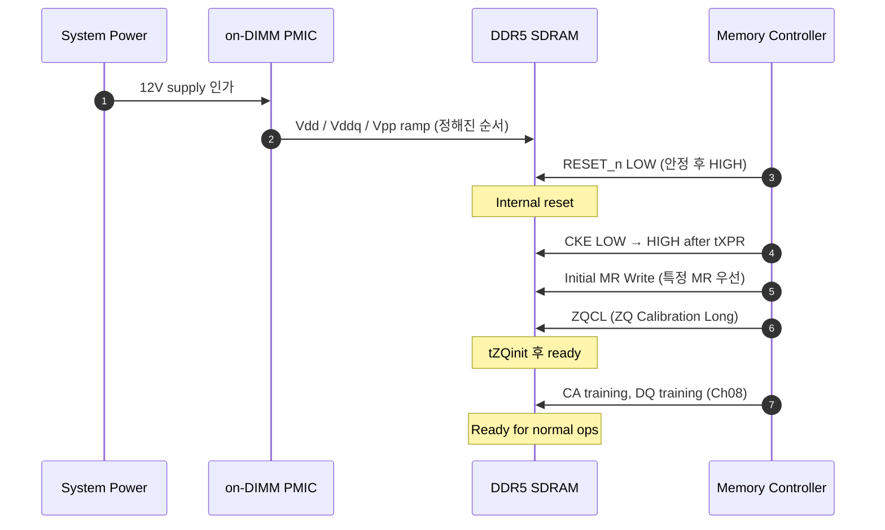

# Ch03. 초기화·Reset·Power 시퀀스

<div class="chapter-context" data-cat="memory">
  <a class="chapter-back" href="./"><span class="chapter-back-arrow">←</span><span class="chapter-back-icon">📚</span> DRAM JEDEC Deep-Dive</a>
  <span class="chapter-divider">›</span>
  <span class="chapter-marker">CH 03</span>
</div>

## 🎯 Learning Objectives

- **Describe**: DDR5의 power-up initialization 시퀀스 단계를 시간 순서대로 서술한다.
- **Compare**: DDR4 / DDR5 / LPDDR4 / LPDDR5의 power-up sequence 핵심 차이를 비교한다.
- **Apply**: Power-up 시퀀스를 UVM run_phase의 sub-phase로 매핑하여 testbench 시퀀스를 설계한다.
- **Analyze**: Reset/Power-down 시 잘못된 명령이 들어왔을 때 발생할 수 있는 결과를 분석한다.

## Prerequisites

- [Ch02. 패키지·핀아웃·어드레싱](02_package_pinout_addressing.md)
- UVM phase 기본 (build → connect → run → extract → report)

## 1. 왜 초기화가 DV의 첫 단계인가

DRAM은 RTL reset만으로는 동작 가능 상태가 *아닙니다*. 다음이 모두 끝나야 ACT/RD/WR 명령을 받을 준비가 됩니다:

1. **Voltage rail이 올바른 순서로 ramp** (Vdd → Vddq → Vpp ...)
2. **RESET_n deasserted + CK 안정화**
3. **Mode Register 프로그래밍** (CL, BL, Vref 등)
4. **ZQ Calibration** (output impedance)
5. **Training** (CA/DQ/DQS — Ch08에서 상세)

DV 환경에서 이 시퀀스를 잘못 짜면, 시뮬레이션에서 *DRAM 모델이 X를 내거나*, *조용히 잘못된 데이터*를 반환합니다. 시뮬레이션이 *통과*하는데 실제 silicon에서 fail이 나는 대표적 원인입니다.

---

## 2. DDR4 Power-up Initialization Sequence

> 출처: JESD79-4D §3.3.1

DDR4의 power-up 시퀀스 — 요약 단계:

```
Step  Time          Action
────────────────────────────────────────────────────────────
T0    0             Power applied (Vdd, Vddq, Vpp 동시 또는 Vpp가 먼저)
T1    Tpw_RESET 후  RESET_n LOW (≥200us 유지)
T2    Tpw_RESET 후  RESET_n HIGH
T3    +500us        CKE LOW로 유지 (RESET_n HIGH 이후)
T4    +tXPR         CKE HIGH 가능
T5    +tMRD         첫 MR Write 가능
        MR3 → MR6 → MR5 → MR4 → MR2 → MR1 → MR0
T6    +tDLLK        ZQCL (ZQ Calibration Long) 가능
T7    +tZQinit      Normal operation 가능
```

핵심 timing 파라미터:
- `tXPR` (Exit Reset Period): RESET_n HIGH → CKE HIGH 가능 시점
- `tDLLK` (DLL Locking Time): DLL이 lock되는 데 필요한 클럭 수
- `tZQinit` (ZQ initial calibration): 첫 ZQ calibration 시간

### 2.1 DDR4 MR programming 순서

JESD79-4D §3.3.1 가 명시하는 MR 프로그래밍 순서:

| 순서 | MR | 주요 설정 |
|---|---|---|
| 1 | MR3 | MPR (Multi-Purpose Register) 설정 |
| 2 | MR6 | Vref calibration |
| 3 | MR5 | CA Parity, ODT, CRC |
| 4 | MR4 | Refresh modes, Temperature, CAL |
| 5 | MR2 | RTT_WR, LP ASR, CWL |
| 6 | MR1 | DLL enable, Output drive, AL, ODT |
| 7 | MR0 | BL, CL, DLL reset, WR, DLL_off |

!!! tip "DV 적용 — MR 프로그래밍 순서 검증"
    Scoreboard에서 controller가 MR을 *위 순서로* 프로그래밍하는지 검증. 순서를 어기면 spec violation이지만 시뮬레이션은 *통과*할 수 있음. directed test로 명시적 검증 필요.

---

## 3. DDR5 Power-up Initialization Sequence

> 출처: JESD79-5C.01 v1.31 §3.3.1

DDR5는 *DIMM에 PMIC가 내장*되고 *channel 별 독립 초기화*가 가능하다는 점이 핵심 차이입니다.

### 3.1 단계별 개요



### 3.2 DDR5 특유의 추가 단계

1. **CS Training** — DDR5의 CS 신호는 high-speed signaling이라 별도 training 필요. MR13의 `CS Geardown` 등 설정.
2. **PDA (Per-DRAM Addressability)** — DIMM 위 여러 DRAM device를 *개별적*으로 MR write. MR1[7] 설정 (§3.5.3).
3. **DCA / DFE 초기화** — high-speed signaling 보상. MR42~MR48 (DCA), MR111~MR116 (DFE).

### 3.3 핵심 timing 파라미터 (DDR5)

- `tXPR` — Exit reset from CKE
- `tINIT3` — RESET_n LOW 펄스 폭 ≥ 200us
- `tINIT4` — CKE LOW 유지 (RESET_n HIGH 이후)
- `tINIT5` — MR write 가능 시점
- `tZQCAL` — ZQ Calibration time

> 정밀 값은 speed bin에 따라 다릅니다 — JESD79-5C.01 의 timing table 참조.

---

## 4. LPDDR4 Power-up Sequence

> 출처: JESD209-4E §3.3

LPDDR4는 *2 단계 voltage ramp* + *RESET 동작이 inverse* (active high) + *MRW로 초기 설정* 이 핵심.

```
Step  Action
─────────────────────────────────────────
T1    Power applied — Vdd1 → Vdd2 → Vddq (정해진 순서)
T2    Reset 활성화 (LPDDR4의 RESET_n)
T3    Reset deassert 후 일정 시간
T4    CKE LOW → HIGH
T5    MRW (Mode Register Write) — initial config
T6    ZQ Calibration
T7    CA / DQ Training (Ch08)
T8    Normal operation
```

### 4.1 LPDDR4의 voltage rail 특징

- **Vdd1**: high voltage (~1.8V) — core
- **Vdd2**: low voltage (~1.1V) — periphery
- **Vddq**: I/O voltage (~0.6V)

순서를 어기면 device damage 위험. controller가 *반드시* 정해진 순서를 보장해야 함.

---

## 5. LPDDR5 Power-up Sequence

> 출처: JESD209-5C §4.1

LPDDR5의 결정적 추가는 *Dual VDD2 rail*과 *DVFS sequence*입니다.

### 5.1 Voltage rail 변화

- **Vdd1**: ~1.8V (unchanged)
- **Vdd2H** + **Vdd2L**: dual VDD2 rail — MR13 OP[7] 설정에 따라 한쪽 또는 양쪽 사용
- **Vddq**: 0.5V (LPDDR5) / 0.3V (LPDDR5X)

### 5.2 Power-up 단계

```
T1    Power applied (정해진 순서: Vdd1 → Vdd2H/L → Vddq)
T2    Reset activate / deactivate
T3    CKE LOW → HIGH
T4    WCK ramp + WCK2CK Leveling (training)
T5    Initial MRW
T6    ZQ Calibration
T7    CA Training (CBT Mode1/Mode2)
T8    DQ Training (Ch08)
T9    Normal operation
```

### 5.3 LPDDR5 특유의 단계 — DVFS 진입

power-up 후 normal op에서 *Dynamic Voltage Frequency Scaling*으로 *Frequency Set Point (FSP)* 를 변경할 수 있음 (§7.6.3). 각 FSP는 *별도의 MR set*을 가짐. DV는 *FSP 전환 시퀀스*가 spec을 준수하는지 검증.

---

## 6. DV 적용 — UVM Phase 매핑

DRAM 초기화 시퀀스를 UVM testbench로 어떻게 매핑할까요?

### 6.1 권장 매핑

| UVM phase | 역할 |
|---|---|
| `build_phase` | TB 구조 build, config_db 설정 |
| `connect_phase` | TLM port 연결, virtual interface 할당 |
| `end_of_elaboration_phase` | 구조 print, sanity check |
| `start_of_simulation_phase` | initial value 설정 |
| `pre_reset_phase` (run-time) | Voltage rail ramp simulation |
| `reset_phase` | RESET_n LOW |
| `post_reset_phase` | RESET_n HIGH, CKE LOW 유지 |
| `pre_configure_phase` | tXPR 대기, CKE HIGH |
| `configure_phase` | **Initial MR Write 시퀀스** (DDR5: CS training → PDA → MR write) |
| `post_configure_phase` | ZQ Calibration, training 진입 |
| `pre_main_phase` | Training (Ch08) |
| `main_phase` | Normal traffic |
| `post_main_phase` | Cool-down |
| `pre_shutdown_phase` | Self-refresh entry (옵션) |
| `shutdown_phase` | Power-down |

### 6.2 Initial sequence skeleton (DDR5 가정)

```systemverilog
// 출처 인용 위치: JESD79-5C.01 §3.3 (power-up sequence)
class ddr5_init_vseq extends uvm_sequence;
    `uvm_object_utils(ddr5_init_vseq)

    rand int  init_wait_cycles;
    constraint c_wait { init_wait_cycles inside {[200_000 : 250_000]}; }
                                                // tINIT3 ≥ 200us

    virtual task body();
        // Phase 1: RESET pulse
        `uvm_info("INIT", "Asserting RESET_n LOW", UVM_MEDIUM)
        // ... assert RESET signal via interface ...
        #(init_wait_cycles);

        // Phase 2: RESET deassert
        `uvm_info("INIT", "Deasserting RESET_n", UVM_MEDIUM)
        // ... deassert RESET ...

        // Phase 3: CKE LOW → HIGH after tXPR
        `uvm_info("INIT", "Waiting tXPR, then CKE HIGH", UVM_MEDIUM)
        #(`TXPR_NS);

        // Phase 4: CS Training (DDR5-specific)
        do_cs_training();

        // Phase 5: Initial MR Write (specific MR first)
        do_initial_mr_write();

        // Phase 6: ZQ Calibration Long
        do_zqcl();
        #(`TZQINIT_NS);

        // Phase 7: Done
        `uvm_info("INIT", "Init sequence complete", UVM_MEDIUM)
    endtask

    extern task do_cs_training();
    extern task do_initial_mr_write();
    extern task do_zqcl();
endclass
```

### 6.3 Init 시퀀스용 SVA

```systemverilog
// RESET_n LOW 시간이 tINIT3 (200us) 이상이어야 함
// 출처: JESD79-5C.01 §3.3 (tINIT3 minimum)
property p_reset_min_pulse;
    @(posedge clk) disable iff (!power_good)
    $fell(reset_n) |-> ##[0:$] $rose(reset_n) &&
        ($time - $past($time, 1, $fell(reset_n))) >= 200_000_000;  // 200us in ps
endproperty

a_reset_min_pulse: assert property (p_reset_min_pulse)
    else `uvm_error("ASSERT", "RESET_n LOW pulse < tINIT3")
```

> 위 SVA는 **개념 예시**입니다. 실제 시뮬레이터에서 `$past($time, ...)` 사용 방식은 EDA마다 다르므로 vendor 매뉴얼 확인.

### 6.4 Init 시퀀스용 Coverage

```systemverilog
covergroup init_cg with function sample (
    bit cs_training_done,
    bit pda_done,
    bit zqcl_done,
    int reset_pulse_us
);
    cp_cs_training: coverpoint cs_training_done {
        bins done = {1};
        bins skipped = {0};
    }
    cp_pda: coverpoint pda_done {
        bins done = {1};
        bins skipped = {0};
    }
    cp_zqcl: coverpoint zqcl_done {
        bins done = {1};
        bins skipped = {0};
    }
    cp_reset_pulse: coverpoint reset_pulse_us {
        bins min_spec     = {[200:210]};
        bins normal       = {[211:500]};
        bins long_pulse   = {[501:1000]};
        bins very_long    = {[1001:$]};
    }
endgroup
```

---

## 7. 비교 정리 — 4 스펙 power-up sequence

| 단계 | DDR4 | DDR5 | LPDDR4 | LPDDR5 |
|---|---|---|---|---|
| Voltage rails | Vdd, Vddq, Vpp | Vdd, Vddq (PMIC on DIMM) | Vdd1, Vdd2, Vddq | Vdd1, **Vdd2H/L**, Vddq |
| Reset 방식 | RESET_n (async) | RESET_n (async) | RESET_n | RESET_n |
| Initial CKE 시점 | tXPR 후 | tXPR 후 | reset deassert 후 | reset deassert 후 |
| CS Training | — | **CS training 필요** | — | — |
| PDA | (제한적) | **MR1[7]** | — | — |
| Clock 분리 | — | per channel | — | **WCK separate** |
| WCK2CK Leveling | — | — | — | **있음** |
| ZQ Calibration | ZQCL | ZQCL | ZQCal | ZQCal |
| Bank mode 선택 | — | — | — | **있음 (16/8/BG)** |

---

## 8. 대표 문제 — DDR5 init 시퀀스 dry-run + UVM phase 매핑

!!! question "Q. 다음 가상 DDR5 시뮬레이션에서 RESET → MR Write → ZQCL → Ready 까지 시퀀스를 UVM phase 단위로 정리하라. tINIT3=200us, tXPR=410ns, tZQinit=1024 nCK, tCK=0.5ns 가정. 잘못된 시점에 MR Write가 들어가면 어떻게 되는지도 분석."

???+ answer "풀이 (UVM phase trace + 위반 분석)"

    **Step 1 — 시간/phase 매핑**

    | 시간 | UVM phase | Action | 이유 |
    |---|---|---|---|
    | t=0 | build/connect | TB build, vif 연결 | structural |
    | t=0+ | start_of_simulation | initial value | const init |
    | t=10ns | pre_reset | power_good=1 | rail ramp 완료 가정 |
    | t=10ns | reset | RESET_n=0 | LOW assert |
    | t=10ns + 200us = 200.01us | post_reset | RESET_n=1 | LOW 유지 200us |
    | t=200.01us + 410ns ≈ 200.42us | pre_configure | CKE=1 | tXPR 후 |
    | t=200.42us+ | configure | MR Write 시퀀스 | CS training + PDA + MR |
    | t=~201us | post_configure | ZQCL 명령 발급 | normal |
    | t=~201us + 512ns | pre_main | training (Ch08) | tZQinit 후 (1024 × 0.5ns = 512ns) |
    | t=~202us | main | normal traffic 시작 | 모든 init 완료 |

    **Step 2 — 위반 시나리오 분석**

    가정: configure phase가 *시작도 전에* (CKE=0 상태에서) MR Write를 발급했다면?

    - DRAM은 CKE=0 동안 *명령을 수락하지 않음* (Self-Refresh / Power-Down 상태)
    - DRAM 모델은 *조용히 명령을 drop* 하거나, *X*를 내부 상태에 전파
    - 시뮬레이션은 *계속 진행*되며 후속 RD/WR이 *잘못된 데이터*를 반환
    - 결과: scoreboard mismatch가 *몇 us 후*에 발생 — **timestamp가 떨어져 있어 debug 어려움**

    **Step 3 — DV 적용**

    1. SVA로 *CKE=0 상태에서 MRW 명령이 들어가면 즉시 error*:
       ```systemverilog
       property p_no_mrw_when_cke_low;
           @(posedge clk) (cmd == MRW) |-> (cke == 1'b1);
       endproperty
       a_no_mrw_cke_low: assert property (p_no_mrw_when_cke_low);
       ```
    2. covergroup `init_cg` 에 `pda_done`, `cs_training_done` bin
    3. directed test `test_init_violation` 로 일부러 잘못된 순서를 발급 → assertion이 catch하는지 확인

---

## 9. 핵심 정리 (Key Takeaways)

- DRAM은 RTL reset만으로는 동작 불가. Voltage ramp → RESET → CKE → MR Write → ZQCL → Training 의 전체 시퀀스 필요.
- DDR4의 MR programming 순서는 *MR3→6→5→4→2→1→0* (spec 규정).
- DDR5는 *CS training*, *PDA*, *DCA/DFE 초기화*가 추가됨.
- LPDDR4는 *Vdd1→Vdd2→Vddq* 의 정해진 ramp 순서.
- LPDDR5는 *Vdd2H/L dual rail* + *WCK2CK Leveling* + *DVFS 기반 FSP 전환* 추가.
- UVM phase 매핑: pre_reset → reset → post_reset → pre_configure → configure → post_configure → main.
- CKE=0 상태에서 MRW 같은 위반은 *조용히* 진행되어 후속에서 mismatch — SVA로 *즉시* catch해야 한다.

## 10. Further Reading

- 이전: [Ch02. 패키지·핀아웃·어드레싱](02_package_pinout_addressing.md)
- 다음: [Ch04. Mode Register 깊이 분석](04_mode_registers.md)
- 부록: [JEDEC Spec 빠른 참조](appendix_a_quick_reference.md)
- 퀴즈: [Ch03 퀴즈](quiz/ch03_quiz.md)

<div class="chapter-nav">
  <a class="nav-prev" href="02_package_pinout_addressing/">
    <div class="nav-label">← 이전</div>
    <div class="nav-title">Ch02. 패키지·핀아웃·어드레싱</div>
  </a>
  <a class="nav-next" href="04_mode_registers/">
    <div class="nav-label">다음 →</div>
    <div class="nav-title">Ch04. Mode Register 깊이 분석</div>
  </a>
</div>
