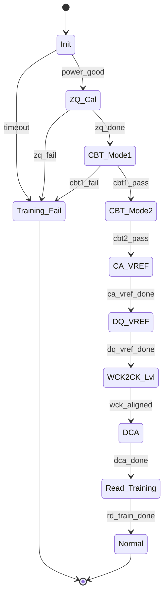

# Ch08. Training — CA / DQ / DQS / Read DQ Calibration

<div class="chapter-context" data-cat="memory">
  <a class="chapter-back" href="../"><span class="chapter-back-arrow">←</span><span class="chapter-back-icon">📚</span> DRAM JEDEC Deep-Dive</a>
  <span class="chapter-divider">›</span>
  <span class="chapter-marker">CH 08</span>
</div>

## 🎯 Learning Objectives

- **Describe**: Training이 high-speed DRAM signaling에서 *왜* 필요한지를 sampling timing/eye-opening 관점에서 서술한다.
- **Compare**: DDR4 Write Leveling / MPR-based training vs DDR5 DQS Training (MR3) vs LPDDR5 CBT Mode1/2 + WCK2CK Leveling 의 절차를 비교한다.
- **Trace**: LPDDR5 CBT Mode1 시퀀스를 cycle-level로 추적한다.
- **Design**: Training failure injection 시나리오와 coverage를 설계한다.

## Prerequisites

- [Ch07. Refresh·RFM](07_refresh_rfm.md)
- 디지털 신호 무결성 기초 (eye diagram, jitter, ISI)

## 1. 왜 training이 필요한가

DDR4-3200 (1.6GHz)부터 DDR5-8400 (4.2GHz), LPDDR5-9600 (4.8GHz) 까지 — 신호 속도가 너무 빨라 *고정 sampling timing*만으로는 *eye가 닫힐 수* 있습니다.

DRAM과 controller(host)는 각자의 PCB trace 길이, 부하, 온도가 다르므로:

1. *PCB 자체의 신호 지연*이 다름
2. *온도/전압 변화*에 따라 지연이 *동적으로* 변함
3. *제조 편차*로 device마다 sampling sweet spot이 다름

→ 시스템 초기화 시 *training 단계*에서 *최적 sampling point*를 자동으로 찾아 설정.

```
이상적 eye opening:
        ┌─────data─────┐
        │              │
        │              │
        └──────────────┘
        ↑              ↑
       너무 빠름      너무 늦음
            ▲
        최적 sampling point ← training이 찾는 것
```

---

## 2. DDR4 Training — 기준점

> 출처: JESD79-4D §4.7 (Write Leveling), §4.10 (MPR), §4.13 (DQ Vref Training)

### 2.1 Write Leveling (§4.7)

목적: DQS와 CK 의 *정렬* 맞추기 (DRAM 입장에서 DQS edge가 CK edge와 정확히 align되도록).

```
Procedure:
1. controller가 WR Leveling mode 진입 (MR1 enable)
2. controller가 DQS toggle (다양한 delay로)
3. DRAM이 *현재 CK 시점의 DQS 값*을 DQ에 출력
4. controller가 DQ를 읽고 0→1 transition 시점 = DQS-CK 정렬점
5. controller가 delay 값 저장 + WR Leveling mode 종료
```

### 2.2 MPR-based DQ Training (§4.10)

DDR4는 *Multi-Purpose Register (MPR)* 라는 *내부 고정 패턴*을 두고, RD 명령으로 이 패턴을 읽어 DQ sampling 을 calibration.

### 2.3 DQ Vref Training (§4.13)

DQ receiver의 *reference voltage*를 sweep해 *eye opening*을 최대화. MR6 + VrefDQ 비트.

---

## 3. DDR5 Training — 더 정교해짐

> 출처: JESD79-5C.01 v1.31 §3.5.4 (MR3 DQS), §3.5.27~3.5.33 (MR25~MR31 Read Training)

### 3.1 DQS Training (MR3)

DDR5는 MR3에 *DQS Training Mode*를 두어:
- DQS edge 위치 sweep
- DQS preamble 패턴 confirm
- Per-byte DQS 정렬

### 3.2 Read Training Mode (MR25~MR31)

- **MR25**: Read Training Mode Settings
- **MR26, MR27**: Read Pattern Data0/Data1 / LFSR0/LFSR1
- **MR28, MR29**: Read Pattern Invert (DQL / DQU)
- **MR30**: Read LFSR Assignments
- **MR31**: Read Training Pattern Address

DRAM이 *내부 LFSR* 또는 *고정 pattern*을 DQ에 출력해 controller가 *eye opening*을 찾도록.

### 3.3 DCA (Duty Cycle Adjuster) Training

> 출처: JESD79-5C.01 §3.5.45~3.5.121 (MR42~MR254 DCA)

DDR5는 *clock duty cycle*까지 training. 고속 신호에서 duty가 50%가 아니면 *eye가 비대칭*.

- MR42~MR48: DCA Types Supported, DCA Settings
- MR103~MR254: per-DQ DCA + Vref offset

### 3.4 DDR5 training step-by-step (개념)

```
1. CS Training      → CS_n 신호 정렬 (MR13 CS Geardown)
2. CA Training      → CA[6:0] 신호 정렬 (PDA + MR write)
3. DQS Preamble Cfg → MR8 (Preamble 길이)
4. Write Leveling   → DDR4와 유사한 패턴, MR7 사용
5. Read Training    → MR25~MR31 활용
6. DQ Vref Calib    → MR10 (VrefDQ)
7. CA Vref Calib    → MR11 (VrefCA)
8. CS Vref Calib    → MR12 (VrefCS)
9. DCA Settings     → MR42~MR48
10. DFE Training    → MR21, MR70~MR75, MR111~MR116
```

---

## 4. LPDDR4 Training

> 출처: JESD209-4E §4.26~4.34

LPDDR4 training은 *Command Bus Training (CBT)* 가 핵심입니다.

### 4.1 CBT (Command Bus Training) — §4.28

CA 신호 정렬을 위한 training:
- **CBT for x16 mode**: 16-bit data 모드
- **CBT for Byte (x8) Mode**: byte 모드

CBT 동안 *임시 패턴*을 CA에 보내고 DRAM이 DQ로 capture pattern을 출력. controller가 *비교*해 정렬 보정.

### 4.2 LPDDR4 의 training 흐름

1. ZQ Calibration (§4.38)
2. VREF Current Generator (VRCG, §4.25)
3. CA VREF Training (§4.26)
4. DQ VREF Training (§4.27)
5. CBT (§4.28)
6. Frequency Set Point change (§4.29)
7. Write Leveling (§4.30)
8. RD DQ Calibration (§4.31)
9. DQS-DQ Training (§4.32)
10. DQS Interval Oscillator (§4.33)
11. READ Preamble Training (§4.34)

---

## 5. LPDDR5 Training — WCK 도입으로 한층 복잡

> 출처: JESD209-5C §4.2

LPDDR5의 *WCK* 클럭이 *CK와 분리*되었으므로, WCK 관련 training 단계가 *대거 추가*됩니다.

### 5.1 LPDDR5 training 흐름

```
1. ZQ Calibration (§4.2.1)
   - Background calibration / Command-based calibration
2. CBT Mode1 (§4.2.2.2) — 첫 단계
3. CBT Mode1 with DVFSQ (§4.2.2.3)
4. CBT Mode2 (§4.2.2.4) — 더 정교한 보정
5. CBT Mode2 with DVFSQ (§4.2.2.5)
6. CA VREF Training (§4.2.3)
7. DQ VREF Training (§4.2.4)
8. WCK2CK Leveling (§4.2.5) — WCK ↔ CK 정렬
9. Duty Cycle Adjuster (DCA) Training (§4.2.6)
10. Read DCA (§4.2.7)
11. Duty Cycle Monitor (DCM) (§4.2.8)
12. READ DQ Calibration (§4.2.9)
13. WCK-DQ Training (§4.2.10)
14. RDQS Toggle Mode / Enhanced RDQS Training (§4.2.11, §4.2.12)
15. Read/Write-based WCK-RDQS_t Training (§4.2.13)
16. Rx Offset Calibration (§4.2.14)
```

이 16+ 단계가 *모두 정상 동작*해야 normal traffic이 가능. *어느 한 단계라도 fail*이면 데이터 corruption 또는 DRAM 미응답.

### 5.2 CBT Mode1 — 핵심 절차

> JESD209-5C §4.2.2.2

LPDDR5 CBT Mode1 은:
1. Controller가 CBT 모드 진입 명령 발급
2. Three Physical MR 사용 — *임시 MR write*
3. Controller가 CA에 *알려진 패턴* 전송
4. DRAM이 *capture 결과*를 DQ에 출력
5. Controller가 비교 → 보정 → 반복
6. CBT 종료 명령

### 5.3 WCK2CK Leveling (§4.2.5)

WCK가 CK와 정확히 정렬되어야 *CAS WCK2CK Sync 비트*가 의미를 가짐. WCK 주파수는 CK의 2× 또는 4× (CKR 설정에 따라):

```
CK_t:   |‾‾‾‾|____|‾‾‾‾|____|‾‾‾‾|____|
WCK_t:  |‾|_|‾|_|‾|_|‾|_|‾|_|‾|_|‾|_|     (4× ratio)
         ↑
         정렬 (WCK edge가 CK edge와 정렬되어야 함)
```

### 5.4 DCM (Duty Cycle Monitor) — §4.2.8

WCK clock의 *duty cycle*을 *측정*. 50%에서 벗어나면 DCA로 보정.

---

## 6. DV 적용 — Training FSM Model

training은 *FSM (Finite State Machine)*으로 모델링하면 깔끔.

### 6.1 LPDDR5 Training FSM (개념)



### 6.2 Training FSM model (SystemVerilog skeleton)

```systemverilog
typedef enum {
    TR_INIT, TR_ZQ_CAL, TR_CBT_MODE1, TR_CBT_MODE2,
    TR_CA_VREF, TR_DQ_VREF, TR_WCK2CK_LVL, TR_DCA,
    TR_READ_TRAINING, TR_NORMAL, TR_TRAINING_FAIL
} lpddr5_training_state_e;

class lpddr5_training_monitor extends uvm_monitor;
    `uvm_component_utils(lpddr5_training_monitor)

    lpddr5_training_state_e state, next_state;

    // 전이 기록 — coverage 용
    uvm_analysis_port #(lpddr5_training_state_e) state_ap;

    virtual function void next_step(string event_name);
        case (state)
            TR_INIT       : if (event_name == "power_good")  next_state = TR_ZQ_CAL;
            TR_ZQ_CAL     : if (event_name == "zq_done")     next_state = TR_CBT_MODE1;
            TR_CBT_MODE1  : if (event_name == "cbt1_pass")   next_state = TR_CBT_MODE2;
                            else if (event_name == "cbt1_fail") next_state = TR_TRAINING_FAIL;
            // ... 나머지 ...
            default       : ;
        endcase
        if (next_state != state) begin
            `uvm_info("TRAINING_FSM",
                $sformatf("Transition %s → %s on event %s",
                          state.name(), next_state.name(), event_name),
                UVM_MEDIUM)
            state = next_state;
            state_ap.write(state);
        end
    endfunction
endclass
```

### 6.3 Training step coverage

```systemverilog
covergroup training_step_cg with function sample (lpddr5_training_state_e state);
    cp_state: coverpoint state {
        bins zq            = {TR_ZQ_CAL};
        bins cbt_mode1     = {TR_CBT_MODE1};
        bins cbt_mode2     = {TR_CBT_MODE2};
        bins ca_vref       = {TR_CA_VREF};
        bins dq_vref       = {TR_DQ_VREF};
        bins wck2ck_lvl    = {TR_WCK2CK_LVL};
        bins dca           = {TR_DCA};
        bins read_training = {TR_READ_TRAINING};
        bins normal        = {TR_NORMAL};
        bins fail          = {TR_TRAINING_FAIL};
    }
endgroup

// 모든 step이 *적어도 한 번* hit되어야 sign-off 가능
```

---

## 7. DV 적용 — Training Failure Injection

각 training 단계에서 *failure를 의도적으로 주입*해 controller의 recovery를 검증.

### 7.1 Failure injection sequence (예: WCK2CK 실패)

```systemverilog
class lpddr5_wck2ck_fail_inject_seq extends uvm_sequence;
    `uvm_object_utils(lpddr5_wck2ck_fail_inject_seq)

    virtual task body();
        // Step 1: 일반 시퀀스로 ZQ, CBT까지 진행
        do_zq_cal();
        do_cbt_mode1();
        do_cbt_mode2();

        // Step 2: WCK2CK 단계에서 *의도적*으로 WCK delay 큰 값 주입
        `uvm_info("FAIL_INJECT", "Injecting bad WCK delay", UVM_MEDIUM)
        force_wck_delay_excessive();
            // → DRAM model이 *training fail* 응답을 내야 함

        // Step 3: Controller가 recovery 시도하는지 monitor
        wait_for_recovery_attempt();

        // Step 4: 정상 값으로 복귀
        release_wck_delay();

        // Step 5: Training 완료
        do_remaining_training_steps();
    endtask

    extern task force_wck_delay_excessive();
    extern task wait_for_recovery_attempt();
endclass
```

### 7.2 Coverage — failure injection 시나리오

```systemverilog
covergroup training_fail_cg with function sample (
    lpddr5_training_state_e fail_state,
    bit recovered
);
    cp_fail_at: coverpoint fail_state {
        bins zq_fail        = {TR_ZQ_CAL};
        bins cbt1_fail      = {TR_CBT_MODE1};
        bins cbt2_fail      = {TR_CBT_MODE2};
        bins ca_vref_fail   = {TR_CA_VREF};
        bins dq_vref_fail   = {TR_DQ_VREF};
        bins wck_fail       = {TR_WCK2CK_LVL};
        bins dca_fail       = {TR_DCA};
        bins rd_train_fail  = {TR_READ_TRAINING};
    }
    cp_recovery: coverpoint recovered {
        bins yes = {1};
        bins no  = {0};
    }
    cx_fail_recovery: cross cp_fail_at, cp_recovery;
endgroup
```

---

## 8. 대표 문제 — LPDDR5 CBT Mode1 dry-run

!!! question "Q. LPDDR5 controller가 CBT Mode1 진입 후 다음 동작을 한다. 각 cycle별 expected behavior를 추적하고, 어떤 점이 spec violation이 될 수 있는지 분석하라."

    ```
    Cycle  0: Enter CBT mode (special MR write)
    Cycle  1: Three Physical MR write — calibration pattern
    Cycle  2-5: Controller sends CA pattern [0xA, 0x5, 0xC, 0x3] on CA[5:0]
    Cycle  6-9: DRAM responds — DQ outputs capture result
    Cycle 10: Controller compares → decides next iteration
    Cycle 11: Exit CBT mode
    ```

???+ answer "풀이 (CBT Mode1 trace + violation 분석)"

    **Step 1 — Cycle-by-cycle expected behavior**

    | Cycle | Phase | Expected |
    |---|---|---|
    | 0 | Entry | MR write가 *CBT entry MR* (LPDDR5 §6 참조)로 향함. 잘못된 MR이면 진입 실패 — *조용히 normal 모드 유지*. |
    | 1 | Setup | Three Physical MR write — capture pattern (예: 0xAA), invert pattern, control |
    | 2-5 | Pattern send | Controller가 CA[5:0]에 알려진 패턴 [0xA, 0x5, 0xC, 0x3] 전송. CA의 *모든 비트*가 toggle되도록 패턴 선택. |
    | 6-9 | DRAM response | DRAM이 *capture 결과*를 DQ에 출력. 정상이면 *입력 패턴과 동일*하거나 *defined transform* 결과. |
    | 10 | Compare | Controller가 DQ 출력 = expected 인지 비교. mismatch가 *너무 크면* delay 보정 후 retry. |
    | 11 | Exit | CBT exit MR write. *normal 모드*로 전환. |

    **Step 2 — Spec violation 가능성**

    1. **Cycle 0 entry 실패 + 계속 traffic 발급**: CBT entry가 무시되었는데 controller가 *알지 못하고* 일반 RD/WR을 발급 → DRAM이 일반 명령으로 해석 → 잘못된 동작
       - SVA: CBT entry MR 발급 후 *최소 N cycles* 안에 일반 traffic이 발급되지 않아야 함
    2. **Cycle 1 의 Three Physical MR 순서 위반**: LPDDR5 §6 의 *순서가 정해진 MR*. 순서 어기면 *training 동작이 정의되지 않음*.
       - DV scoreboard: MR write 순서를 *명시적*으로 검증
    3. **Cycle 2-5 의 CA 패턴**: *random*이거나 *too few unique values* 면 calibration 정확도 ↓. 일반적으로 *모든 CA 비트가 toggle*되는 패턴 권장.
       - covergroup `cbt_ca_pattern_cg`: 사용된 CA 패턴의 *unique count* bin
    4. **Cycle 6-9 의 DRAM response timing**: training mode에서 DQ 출력은 *정해진 latency* (예: 4 cycles 후). controller가 *잘못된 timing*에 sample하면 잘못된 비교.
       - SVA: training mode CA→DQ latency 정확 검증
    5. **Cycle 10 의 compare failure 시**: *infinite retry*하면 power-on이 오래 걸리고 timeout fail. controller가 *max retry count*를 두어야 함.
       - timeout assertion + coverage bin

    **Step 3 — DV 적용 — CBT 검증의 핵심**

    - `cbt_state_cg`: CBT entry/setup/pattern/response/compare/exit *모든 phase* cover
    - `cbt_ca_pattern_cg`: CA 패턴 *uniqueness*와 *coverage*
    - `cbt_retry_cg`: *retry count* 의 distribution (0, 1, 2-5, 6+)
    - directed test `test_cbt_mode1_normal`: 정상 시퀀스
    - directed test `test_cbt_mode1_corrupted_response`: DRAM model이 *의도적으로 잘못된* response 반환 → controller가 retry 또는 fail 처리 검증

---

## 9. 핵심 정리 (Key Takeaways)

- High-speed signaling (≥3.2 GT/s)에서 *training은 필수* — sampling timing/Vref/duty/equalizer를 *initial로 calibrate*.
- DDR4 training: Write Leveling + MPR-based DQ training + DQ Vref Training (3가지 핵심).
- DDR5 training: 위 + *CS Training*, *Read Training Mode (MR25~MR31)*, *DCA Training*, *DFE Training*.
- LPDDR4 training: CBT (x16/x8 모드) + CA VREF + DQ VREF + Write Leveling + RD/DQS Training.
- LPDDR5 training: *16+ 단계*. CBT Mode1/2, *WCK2CK Leveling*, *DCA + DCM*, *WCK-DQ Training*.
- DV는 training FSM 을 *모델링*하고, *모든 step coverage* + *failure injection coverage* + *retry timeout* 을 검증.
- Failure injection은 *각 training step* 에서 *의도적*으로 fail을 만들어 *controller recovery*를 검증.

## 10. Further Reading

- 이전: [Ch07. Refresh·RFM](07_refresh_rfm.md)
- 다음: [Ch09. 신뢰성·ECC·CRC·PPR](09_reliability_ecc_crc.md)
- 부록 C: [SVA / Coverage 예제 모음](appendix_c_sva_coverage_examples.md)
- 퀴즈: [Ch08 퀴즈](quiz/ch08_quiz.md)

<div class="chapter-nav">
  <a class="nav-prev" href="../07_refresh_rfm/">
    <div class="nav-label">← 이전</div>
    <div class="nav-title">Ch07. Refresh·RFM</div>
  </a>
  <a class="nav-next" href="../09_reliability_ecc_crc/">
    <div class="nav-label">다음 →</div>
    <div class="nav-title">Ch09. 신뢰성·ECC·CRC</div>
  </a>
</div>
