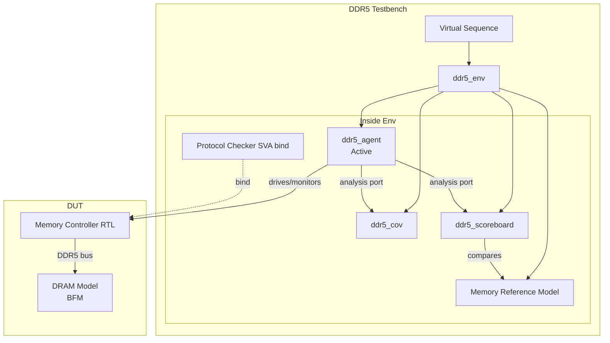

# Ch10. DV Methodology 통합 — Spec → TB → Coverage

<div class="chapter-context" data-cat="memory">
  <a class="chapter-back" href="../"><span class="chapter-back-arrow">←</span><span class="chapter-back-icon">📚</span> DRAM JEDEC Deep-Dive</a>
  <span class="chapter-divider">›</span>
  <span class="chapter-marker">CH 10</span>
</div>

## 🎯 Learning Objectives

- **Design**: DRAM 검증 환경의 agent / monitor / scoreboard 책임 분할을 설계한다.
- **Compose**: Coverage 카테고리 6가지(command / timing / MR / training / refresh / ECC)를 한 testbench에 통합한다.
- **Classify**: SVA 패턴을 *timing violation* / *command order* / *training protocol* 세 부류로 분류한다.
- **Plan**: DDR5/LPDDR5 sign-off checklist를 수립한다.

## Prerequisites

- Ch01~Ch09 (모든 챕터)
- UVM 1.2 component 구조 (env, agent, sequencer, driver, monitor)

## 1. DRAM TB의 구조 — 큰 그림



### 1.1 컴포넌트별 책임

| 컴포넌트 | 책임 |
|---|---|
| **virtual sequence** | 시나리오 조합 — init / training / traffic / refresh stress |
| **agent** | DDR5 protocol drive/monitor — driver, monitor, sequencer |
| **driver** | sequence_item을 *cycle-accurate*로 핀에 driving (또는 controller cmd interface) |
| **monitor** | 핀 신호를 transaction으로 reconstruct (2-cycle command 처리) |
| **scoreboard** | data integrity 검증 — write/read 매칭, ECC 동작 확인 |
| **memory reference model** | DRAM의 *기능적* 모델 — mem[addr]=data + bank state FSM |
| **coverage collector** | 모든 covergroup 집계 |
| **SVA bind module** | RTL controller에 bind되어 protocol 위반 즉시 catch |

---

## 2. Memory Reference Model — 핵심 설계 결정

DRAM 검증의 *척추*는 memory reference model 입니다.

### 2.1 두 가지 전략

| 전략 | 설명 | 장단점 |
|---|---|---|
| **Cycle-accurate model** | 모든 timing을 모델링 (tRCD, tRP, bank FSM 포함) | 정확하지만 느림. controller IP의 timing model에 의존성 ↑ |
| **Functional model** | data integrity만 추적 (mem[addr]=data) — timing은 SVA가 별도 검증 | 빠르고 깔끔. 권장. |

**권장**: **Functional model + 별도 SVA timing checker**의 *2분 분리*.

### 2.2 Functional model skeleton

```systemverilog
class ddr5_mem_ref_model extends uvm_object;
    `uvm_object_utils(ddr5_mem_ref_model)

    // Address → data mapping
    bit [127:0] mem[longint];

    // Per-bank state — for spec compliance check
    typedef enum {BANK_IDLE, BANK_ACTIVE, BANK_REFRESH} bank_state_e;
    bank_state_e bank_st[256];      // 8 BG × 4 BA × 8 ranks = 256
    bit [16:0]   bank_active_row[256];

    function new(string name = "ddr5_mem_ref_model");
        super.new(name);
        foreach (bank_st[i]) bank_st[i] = BANK_IDLE;
    endfunction

    function int bank_idx(int bg, int ba, int rank);
        return (rank * 32) + (bg * 4) + ba;
    endfunction

    // ACT — open row
    function void do_act(int bg, int ba, int rank, bit [16:0] row);
        int idx = bank_idx(bg, ba, rank);
        if (bank_st[idx] != BANK_IDLE)
            `uvm_error("REF_MODEL",
                $sformatf("ACT to non-idle bank (rank=%0d bg=%0d ba=%0d state=%s)",
                          rank, bg, ba, bank_st[idx].name()))
        bank_st[idx] = BANK_ACTIVE;
        bank_active_row[idx] = row;
    endfunction

    // PRE — close row
    function void do_pre(int bg, int ba, int rank);
        int idx = bank_idx(bg, ba, rank);
        if (bank_st[idx] != BANK_ACTIVE)
            `uvm_error("REF_MODEL",
                $sformatf("PRE to non-active bank state=%s", bank_st[idx].name()))
        bank_st[idx] = BANK_IDLE;
    endfunction

    // WR — record data
    function void do_wr(longint addr, bit [127:0] data);
        mem[addr] = data;
    endfunction

    // RD — fetch data (returns 'x if not written)
    function bit [127:0] do_rd(longint addr);
        if (!mem.exists(addr)) return 'x;
        return mem[addr];
    endfunction
endclass
```

### 2.3 Reference model의 위치 — scoreboard 안 또는 별도

권장: *별도 component*. scoreboard는 *비교 전담*, reference model은 *상태 추적 전담*.

---

## 3. Coverage 카테고리 6가지 — 모두 통합

DRAM 검증에서 *coverage closure*는 다음 6가지 카테고리가 *모두* 채워져야 의미가 있습니다.

### 3.1 Command Coverage (Ch05)

```systemverilog
// 모든 명령이 *적어도 한 번* 발급되었는가
// (BL 옵션 × Auto-precharge 옵션 × Rank 옵션의 cross까지 권장)
```

### 3.2 Timing Parameter Coverage (Ch06)

```systemverilog
// 각 timing parameter의 *min/normal/long_idle* bin이 hit
// tRCD/tRP/tRRD_S/tRRD_L/tCCD_S/tCCD_L/tWTR_S/tWTR_L/tFAW
```

### 3.3 Mode Register Coverage (Ch04)

```systemverilog
// MR0~254 중 *DV 우선순위 카테고리*의 모든 MR이 write + read 되었는가
// 카테고리 cross: basic/ecc/odt/dca/refresh/ppr/dfe
```

### 3.4 Training Scenario Coverage (Ch08)

```systemverilog
// FSM 의 모든 state hit + 각 step에서 fail injection 시나리오 cover
// training_step_cg + training_fail_cg
```

### 3.5 Refresh / RFM Coverage (Ch07)

```systemverilog
// tREFI mode (normal/extended), deferred count, RFM RAA threshold cross
// + Rowhammer aggressor scenario
```

### 3.6 ECC / Error Injection Coverage (Ch09)

```systemverilog
// Single-bit / Multi-bit / no-error 비율
// CRC error count distribution
// PPR type × guard key 가 cross
```

### 3.7 통합 weighting — 어떤 카테고리가 더 중요한가

| 카테고리 | weight (예시) | 이유 |
|---|---|---|
| Command coverage | 1.0 | 기본 |
| Timing coverage | **2.0** | corner timing bug가 가장 심각 |
| MR coverage | 0.8 | 일부 MR은 default 만으로 충분 |
| Training | 1.5 | high-speed device의 핵심 |
| Refresh / RFM | 1.2 | Rowhammer 대응 |
| ECC / Error | **1.5** | 신뢰성 직결 |

> weight는 organization마다 다름. *sign-off goal*과 함께 정의.

---

## 4. SVA 패턴 — 3 분류

### 4.1 Timing Violation Assertions

- tRCD/tRP/tRC/tRAS/tRRD/tFAW/tCCD_L/S 위반 catch
- tREFI 9 deferred 초과 catch
- preamble length 위반 catch

> Ch06 §5 참조

### 4.2 Command Order Assertions

- ACT→ACT without PRE (same bank)
- PRE→ACT within tRP
- RD→WR within tRTW
- WR→RD within tWTR

> Ch05 §6 참조

### 4.3 Training Protocol Assertions

- CBT entry MR 발급 후 일반 traffic 발급 금지
- WCK2CK leveling 단계에서 RD/WR 금지
- training mode 진입/종료 절차의 *정확한 sequence*

> Ch08 §6 참조

### 4.4 SVA Bind 패턴

```systemverilog
// 파일: ddr5_protocol_check.sv
module ddr5_protocol_check (
    input bit clk,
    input bit reset_n,
    input bit [6:0] ca_t,         // 2-cycle command — sampled
    input bit cs_n,
    input bit cke,
    // ... 다른 핀 ...
);
    // Timing assertions
    `include "sva_timing_checks.svh"

    // Command order assertions
    `include "sva_command_order.svh"

    // Training protocol assertions
    `include "sva_training_protocol.svh"
endmodule

// 사용 — DUT 외부에서 bind
bind ddr5_top ddr5_protocol_check u_proto_check (
    .clk(clk),
    .reset_n(reset_n),
    .ca_t(ca_signal),
    .cs_n(cs_n_signal),
    .cke(cke_signal)
    // ...
);
```

`bind` 의 장점: RTL 수정 *없이* checker 추가/제거 가능.

---

## 5. Regression Strategy — Tier 기반

### 5.1 3-Tier Regression

```
Tier 1 — Smoke (~5 min, seed=0)
├── basic_init_test       — init sequence 정상
├── basic_wr_rd_test      — single WR + RD
├── basic_refresh_test    — REF 발급
└── basic_training_test   — training 진입/탈출

Tier 2 — Constrained-random (~30 min, 100 seeds × 10 tests)
├── random_traffic        — random WR/RD pattern
├── timing_corner_test    — tight timing constraint
├── refresh_stress        — high refresh load
├── training_fail_inject  — 각 step별 fail
├── ecc_error_inject      — single/multi bit
└── rowhammer_attack      — RFM 검증

Tier 3 — Coverage closure (~hours, hole-filling tests)
└── directed tests for specific coverage holes
```

### 5.2 Seed strategy

- **Tier 1**: seed=0 (deterministic, debug용)
- **Tier 2**: random seeds — *failure 발생 시 seed 기록*
- **Tier 3**: *failed seed*를 회귀 풀에 영구 추가 (regression list)

---

## 6. Sign-off Checklist (DDR5)

### 6.1 Functional / Protocol

- [ ] 모든 명령 (ACT/PRE/RD/WR/REF/MRW/MRR/RFM/ZQ/PDE/PDX) 이 적어도 1회 발급
- [ ] 2-cycle command monitor가 *모든 명령*을 정확 reconstruct
- [ ] BL16 / BL32 모두 사용
- [ ] Auto-precharge (RDA/WRA) 사용
- [ ] 모든 BG/BA 조합 사용 (BG ×8, BA ×4)

### 6.2 Timing

- [ ] tRCD/tRP/tRAS/tRC 위반 catch SVA pass (한 번도 fail 없음)
- [ ] tFAW sliding window 위반 catch SVA pass
- [ ] tCCD_L (same BG) / tCCD_S (different BG) 위반 catch
- [ ] tREFI deferred 9+ 위반 catch
- [ ] Timing parameter coverage *all bins* hit

### 6.3 Mode Register

- [ ] DV 우선순위 Top 10 MR 모두 write + read
- [ ] init-only MR을 runtime에 변경 시 SVA fail 확인
- [ ] MR mirror value가 DUT internal MR과 *일치* (RAL verify)

### 6.4 Training

- [ ] Training FSM 의 모든 state hit (failure 포함)
- [ ] Each training step 에 fail injection 후 controller가 *graceful*하게 처리
- [ ] retry count distribution이 reasonable

### 6.5 Refresh / RFM

- [ ] Normal-temp / Extended-temp 모두 검증
- [ ] RFM RAA threshold 도달 시 RFM 명령 발급 확인
- [ ] Rowhammer aggressor pattern 후 victim data integrity 확인

### 6.6 ECC

- [ ] Single-bit error → 정정 확인 (data 일치)
- [ ] Double-bit error → 검출 확인 (epoch error report)
- [ ] MR20 error count 증가 확인
- [ ] CRC error injection → ALERT_n 토글

### 6.7 PPR

- [ ] hPPR sequence success 확인
- [ ] sPPR sequence success 확인
- [ ] Guard key incorrect → PPR fail 확인

### 6.8 Coverage 목표

- [ ] Functional coverage 95%+ (waive 1.5% 미만)
- [ ] Code coverage (line/toggle) 95%+
- [ ] FSM coverage 100% (모든 state + transition)

### 6.9 Regression

- [ ] Tier 1 (smoke): 100% pass
- [ ] Tier 2 (1000+ seeds): 0 unexplained fail
- [ ] Tier 3 (coverage hole tests): 모든 hole이 *intent로 waive*되거나 hit

---

## 7. Sign-off Checklist (LPDDR5 추가 항목)

LPDDR5 검증 시 DDR5의 위 체크리스트 + 다음 추가:

- [ ] WCK Clocking — WCK2CK Leveling 시퀀스 성공
- [ ] DVFS Frequency Set Point 전환 시퀀스 정상
- [ ] CBT Mode1 / Mode2 모두 진행
- [ ] DCA / DCM 동작 확인 (duty cycle 50% 근접)
- [ ] Link ECC encoding/decoding *spec matrix*와 일치
- [ ] PASR / PARC self-refresh 시나리오
- [ ] ARFM / DRFM 모두 발급되었는지
- [ ] Single-ended mode (low-frequency operation) 시나리오
- [ ] Deep Sleep Mode 진입/탈출

---

## 8. 대표 문제 — 검증 환경 책임 분배 시나리오

!!! question "Q. 다음 상황에서 어떤 컴포넌트가 어떻게 동작해야 하는지 책임을 분배하라.

    상황: DDR5 controller가 ACT 발급 후 tRCD-1 cycles 만에 RD 발급. DRAM model은 이 RD를 *수락*하지만 *invalid data*를 반환 (모델의 timing 가정 위반). 시뮬레이션은 *통과*하지만 silicon에서는 fail."

???+ answer "풀이 (책임 분배 + 개선안)"

    **Step 1 — 누가 *현재* fail을 catch해야 하나?**

    | 컴포넌트 | 현재 상태 | 문제 |
    |---|---|---|
    | DRAM model | RD를 수락하고 invalid data 반환 | *너무 관대* — spec violation을 *조용히* 받아들임 |
    | Monitor | RD transaction을 publish | *순수 capture* 만 함 — timing 검증 X |
    | Scoreboard | RD data를 *write data*와 비교 | *invalid data*가 *write data*와 우연히 일치 가능 → false pass |
    | SVA timing checker | tRCD assertion이 *제대로 작성되었으면* fail | 만약 *없거나 약하게* 작성되었으면 못 잡음 |
    | Reference model | bank state는 추적 — `do_rd()` 호출 | 그러나 *timing*은 추적 X (functional model) |

    **Step 2 — 책임 분배 — *올바른* 설계**

    - **SVA timing checker** (필수): `tRCD` 위반을 *즉시* catch. RD 명령 발급 시점이 ACT 후 *< tRCD* 라면 fail.
    - **DRAM model** (개선): timing 위반을 *수락하지 말고* — *X data* 반환 + UVM_WARNING. 그러나 *fail은 SVA가 책임*.
    - **Scoreboard** (보조): RD data가 *X*면 *write data와 비교하지 않음* — *valid data only* 검증.
    - **Monitor**: 그대로 — capture만 (timing은 SVA).

    **Step 3 — 개선된 시퀀스**

    1. Driver가 ACT 후 *tRCD-1 cycle*에 RD 발급 (시퀀스 자체는 의도적 위반)
    2. SVA `a_trcd` 가 *즉시* fail → uvm_error
    3. DRAM model이 *X data* 반환
    4. Scoreboard가 *X*를 보고 *비교 skip* (또는 warning)
    5. UVM_FATAL 또는 UVM_ERROR로 시뮬레이션 fail 종료
    6. Failure log에 *정확한 cycle + 위반된 timing parameter* 기록

    **Step 4 — DV 적용 — 시스템적 보완**

    1. **SVA 작성 빠짐 없이**: 모든 critical timing 에 대해 SVA. 이 학습 자료의 Ch06이 가이드.
    2. **DRAM model의 정직성**: 위반을 *조용히 수락* 하지 않도록 model을 *strict mode*로 설정.
    3. **Scoreboard의 X handling**: `===` 비교 + X면 warning.
    4. **Coverage**: `timing_corner_cg` 의 *min_spec* bin이 hit되도록 directed test.
    5. **Regression**: SVA fail 시 *seed log* → 영구 회귀 풀에 추가.

---

## 9. 핵심 정리 (Key Takeaways)

- DRAM TB는 *5개 컴포넌트*: agent(driver/monitor/seqr) + scoreboard + reference model + coverage collector + SVA bind.
- Memory reference model은 *functional* (mem[addr]=data) 전략 권장. timing은 SVA가 별도 검증.
- Coverage 6 카테고리: command / timing / MR / training / refresh / ECC. 모두 *통합*해야 sign-off 의미.
- SVA 3 분류: *timing violation* / *command order* / *training protocol*.
- SVA는 `bind`로 부착 — RTL 수정 없이.
- Regression은 *3-Tier*: smoke / constrained-random / coverage-hole 채우기.
- Sign-off는 *checklist 기반* — 모든 항목 명시적 통과 또는 *waive 사유* 기록.

## 10. Further Reading

- 이전: [Ch09. 신뢰성·ECC·CRC·PPR](09_reliability_ecc_crc.md)
- 다음: [Ch11. DV 프로젝트 End-to-End](11_dv_project_endtoend.md)
- 부록 C: [SVA / Coverage 예제 모음](appendix_c_sva_coverage_examples.md)
- 퀴즈: [Ch10 퀴즈](quiz/ch10_quiz.md)

<div class="chapter-nav">
  <a class="nav-prev" href="../09_reliability_ecc_crc/">
    <div class="nav-label">← 이전</div>
    <div class="nav-title">Ch09. 신뢰성·ECC·CRC</div>
  </a>
  <a class="nav-next" href="../11_dv_project_endtoend/">
    <div class="nav-label">다음 →</div>
    <div class="nav-title">Ch11. DV 프로젝트 End-to-End</div>
  </a>
</div>
