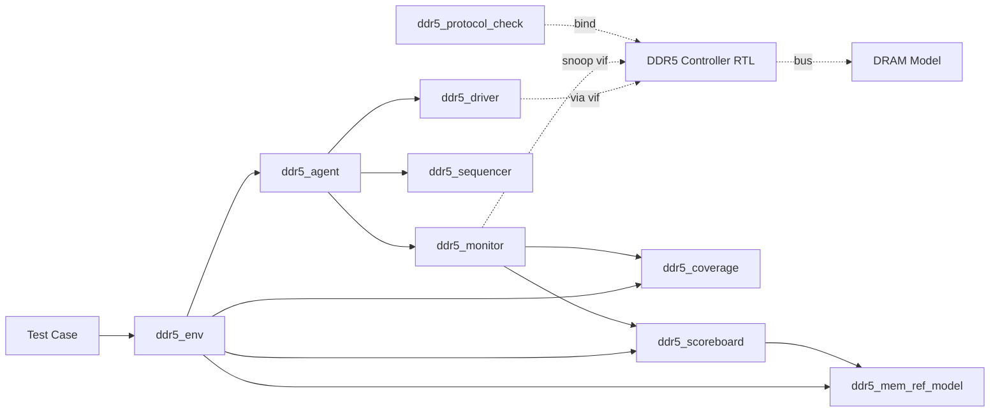

# Ch11. DDR5/LPDDR5 검증 프로젝트 실전 (End-to-End)

<div class="chapter-context" data-cat="memory">
  <a class="chapter-back" href="./"><span class="chapter-back-arrow">←</span><span class="chapter-back-icon">📚</span> DRAM JEDEC Deep-Dive</a>
  <span class="chapter-divider">›</span>
  <span class="chapter-marker">CH 11</span>
</div>

!!! tip "이 챕터의 목적"
    Ch01~Ch10 의 모든 개념을 *하나의 가상 검증 프로젝트*로 묶어 *실전 흐름*을 보여줍니다. **DDR5 Memory Controller IP** 를 검증한다고 가정하고, UVM 1.2 기반으로 *agent / driver / monitor / scoreboard / coverage*의 스켈레톤과 *SVA bind*, *시나리오 라이브러리*, *sign-off* 까지 한 흐름으로.

## 🎯 Learning Objectives

- **Construct**: DDR5 controller IP 검증을 위한 UVM testbench의 *최소* skeleton을 구축한다.
- **Design**: Bind 패턴을 사용한 SVA protocol checker 모듈을 설계한다.
- **Compose**: Init / Traffic / Refresh stress / Training fail / ECC error / Rowhammer 6가지 시나리오 시퀀스를 작성한다.
- **Plan**: Coverage closure flow와 LPDDR5 변형 적용을 계획한다.
- **Evaluate**: Sign-off 체크리스트 기반으로 검증 완료 여부를 평가한다.

## Prerequisites

- Ch01~Ch10 (모든 챕터)
- 본 챕터 코드는 *컴파일 보장이 아닌 학습용 스켈레톤*입니다. 실제 사용 시 EDA tool과 RTL interface에 맞게 다듬으세요.

---

## 11.1 Verification Plan (V-Plan)

### 11.1.1 DUT 정의

**DUT**: DDR5 Memory Controller IP (parameterized)
- Spec 지원: DDR5 + LPDDR5 (configurable)
- 채널: per-DIMM 2 independent channels
- BL: 16 (default), 32 (optional)
- ECC: Transparency ECC enable (DDR5), Link ECC (LPDDR5)
- RFM 지원: Yes

### 11.1.2 검증 목표

| 카테고리 | 목표 |
|---|---|
| Functional | Spec compliance — 모든 명령/MR/burst pattern |
| Timing | 모든 critical timing SVA pass |
| Training | 모든 training step + fail recovery |
| Refresh | tREFI 정상 + RFM 검증 + Rowhammer 대응 |
| ECC | Single-bit correct + Multi-bit detect |
| Coverage | 95%+ functional coverage |
| Regression | 1000+ seeds zero unexplained fail |

### 11.1.3 Feature → 검증 항목 매핑

| Feature (Ch 참조) | 검증 항목 | Test name |
|---|---|---|
| Init sequence (Ch03) | RESET → MR Write → ZQCL → Ready | `test_init` |
| MR access (Ch04) | RAL write/read all priority MRs | `test_mr_walk` |
| Command (Ch05) | BL16/BL32, AutoPre, all BG/BA | `test_command_walk` |
| Timing (Ch06) | tRCD/tRP/tFAW corner | `test_timing_corner` |
| Refresh (Ch07) | tREFI normal + RFM trigger | `test_refresh_basic`, `test_rowhammer` |
| Training (Ch08) | All steps + fail injection | `test_training_full`, `test_training_fail_*` |
| ECC (Ch09) | Single/Multi/CRC | `test_ecc_single`, `test_ecc_multi`, `test_crc_inject` |
| PPR (Ch09) | hPPR/sPPR + guard key | `test_ppr_*` |

---

## 11.2 UVM Testbench Architecture

### 11.2.1 디렉토리 구조

```
ddr5_tb/
├── sim/
│   ├── Makefile
│   └── filelist.f
├── src/
│   ├── ddr5_pkg.sv              # 패키지 — 모든 component
│   ├── ddr5_transaction.sv      # transaction class
│   ├── ddr5_if.sv               # interface
│   ├── ddr5_driver.sv
│   ├── ddr5_monitor.sv
│   ├── ddr5_sequencer.sv
│   ├── ddr5_agent.sv
│   ├── ddr5_scoreboard.sv
│   ├── ddr5_coverage.sv
│   ├── ddr5_mem_ref_model.sv
│   ├── ddr5_env.sv
│   └── ddr5_ral_pkg.sv          # RAL (Ch04)
├── seq/
│   ├── ddr5_base_seq.sv
│   ├── ddr5_init_vseq.sv
│   ├── ddr5_traffic_seq.sv
│   ├── ddr5_refresh_stress_seq.sv
│   ├── ddr5_training_fail_seq.sv
│   ├── ddr5_ecc_inject_seq.sv
│   └── ddr5_rowhammer_seq.sv
├── test/
│   ├── ddr5_base_test.sv
│   ├── test_init.sv
│   ├── test_command_walk.sv
│   ├── test_timing_corner.sv
│   ├── test_refresh_basic.sv
│   ├── test_training_full.sv
│   ├── test_ecc_single.sv
│   ├── test_rowhammer.sv
│   └── test_lpddr5_variant.sv
└── sva/
    ├── ddr5_protocol_check.sv  # bind module
    ├── sva_timing_checks.svh
    ├── sva_command_order.svh
    └── sva_training_protocol.svh
```

### 11.2.2 Top-level connection



---

## 11.3 핵심 컴포넌트 스켈레톤 (UVM)

### 11.3.1 ddr5_transaction.sv

```systemverilog
// 출처: Ch05 + Ch06 — command + timing 정보
class ddr5_transaction extends uvm_sequence_item;
    `uvm_object_utils(ddr5_transaction)

    // Command
    rand ddr5_cmd_e cmd;
    rand bit [2:0]  bg;
    rand bit [1:0]  ba;
    rand bit [16:0] row;
    rand bit [9:0]  col;
    rand bit        ap;     // Auto-Precharge
    rand int        bl;     // 16 or 32

    // Data (for WR/RD)
    rand bit [127:0] data[];
    rand bit         corrupt_crc;  // CRC injection flag

    // MR access
    rand bit [7:0]  mr_num;
    rand bit [7:0]  mr_data;

    // Timing
    bit [63:0] timestamp;   // monitor가 채움

    // Reporting flags (from DRAM model)
    bit ecc_error_reported;
    bit alert_n_toggled;

    constraint c_bl { bl inside {16, 32}; }
    constraint c_bg { bg inside {[0:7]}; }
    constraint c_ba { ba inside {[0:3]}; }

    function new(string name = "ddr5_transaction");
        super.new(name);
    endfunction

    function string convert2string();
        return $sformatf("cmd=%s bg=%0d ba=%0d row=0x%x col=0x%x bl=%0d",
                         cmd.name(), bg, ba, row, col, bl);
    endfunction
endclass
```

### 11.3.2 ddr5_driver.sv

```systemverilog
class ddr5_driver extends uvm_driver #(ddr5_transaction);
    `uvm_component_utils(ddr5_driver)

    virtual ddr5_if vif;

    function new(string name, uvm_component parent);
        super.new(name, parent);
    endfunction

    virtual function void build_phase(uvm_phase phase);
        super.build_phase(phase);
        if (!uvm_config_db#(virtual ddr5_if)::get(this, "", "vif", vif))
            `uvm_fatal("DRV", "virtual interface not set")
    endfunction

    virtual task run_phase(uvm_phase phase);
        forever begin
            ddr5_transaction t;
            seq_item_port.get_next_item(t);
            drive_command(t);
            if (t.cmd inside {CMD_WR, CMD_WRA})
                drive_write_data(t);
            seq_item_port.item_done();
        end
    endtask

    // DDR5의 2-cycle command 발급
    virtual task drive_command(ddr5_transaction t);
        @(posedge vif.clk);
        vif.cs_n <= 1'b0;
        vif.ca   <= encode_cmd_cycle0(t);    // 1st cycle
        @(posedge vif.clk);
        vif.cs_n <= 1'b0;
        vif.ca   <= encode_cmd_cycle1(t);    // 2nd cycle
        @(posedge vif.clk);
        vif.cs_n <= 1'b1;                    // de-assert
        `uvm_info("DRV",
            $sformatf("Drove %s", t.convert2string()),
            UVM_HIGH)
    endtask

    virtual task drive_write_data(ddr5_transaction t);
        // CL 후 burst 시점 계산 후 driving
        wait_cycles(`CWL_NCK);
        drive_preamble();
        for (int i = 0; i < t.bl; i++) begin
            @(posedge vif.dqs_t or negedge vif.dqs_t);
            vif.dq <= t.data[i][7:0];     // x8 가정
        end
        drive_postamble();
    endtask

    // helper functions (encoding은 spec 참조해 구현)
    extern function bit [6:0] encode_cmd_cycle0(ddr5_transaction t);
    extern function bit [6:0] encode_cmd_cycle1(ddr5_transaction t);
    extern task drive_preamble();
    extern task drive_postamble();
    extern task wait_cycles(int n);
endclass
```

### 11.3.3 ddr5_monitor.sv

```systemverilog
class ddr5_monitor extends uvm_monitor;
    `uvm_component_utils(ddr5_monitor)

    virtual ddr5_if vif;

    uvm_analysis_port #(ddr5_transaction) ap;

    // 2-cycle command 윈도우
    bit [6:0] cmd_cycle0;
    bit       waiting_for_cycle1;

    function new(string name, uvm_component parent);
        super.new(name, parent);
        ap = new("ap", this);
    endfunction

    virtual function void build_phase(uvm_phase phase);
        super.build_phase(phase);
        if (!uvm_config_db#(virtual ddr5_if)::get(this, "", "vif", vif))
            `uvm_fatal("MON", "virtual interface not set")
    endfunction

    virtual task run_phase(uvm_phase phase);
        forever begin
            @(posedge vif.clk);
            if (vif.cs_n == 1'b0) begin
                if (waiting_for_cycle1) begin
                    ddr5_transaction t = decode_2cycle_cmd(cmd_cycle0, vif.ca);
                    t.timestamp = $time;
                    ap.write(t);
                    waiting_for_cycle1 = 1'b0;
                    capture_data_if_needed(t);
                end else begin
                    cmd_cycle0 = vif.ca;
                    waiting_for_cycle1 = 1'b1;
                end
            end else if (waiting_for_cycle1) begin
                // 1-cycle command (NOP/DES)
                ddr5_transaction t = decode_1cycle_cmd(cmd_cycle0);
                t.timestamp = $time;
                ap.write(t);
                waiting_for_cycle1 = 1'b0;
            end
        end
    endtask

    extern function ddr5_transaction decode_2cycle_cmd(bit [6:0] c0, bit [6:0] c1);
    extern function ddr5_transaction decode_1cycle_cmd(bit [6:0] c0);
    extern task capture_data_if_needed(ddr5_transaction t);
endclass
```

### 11.3.4 ddr5_scoreboard.sv

```systemverilog
class ddr5_scoreboard extends uvm_scoreboard;
    `uvm_component_utils(ddr5_scoreboard)

    uvm_analysis_imp #(ddr5_transaction, ddr5_scoreboard) imp;

    ddr5_mem_ref_model ref_model;

    int total_wr, total_rd, total_mismatch;
    int ecc_corrections, ecc_uncorrectable;

    function new(string name, uvm_component parent);
        super.new(name, parent);
        imp = new("imp", this);
        ref_model = ddr5_mem_ref_model::type_id::create("ref_model");
    endfunction

    virtual function void write(ddr5_transaction t);
        case (t.cmd)
            CMD_ACT: ref_model.do_act(t.bg, t.ba, /*rank=*/0, t.row);
            CMD_PRE: ref_model.do_pre(t.bg, t.ba, /*rank=*/0);
            CMD_WR, CMD_WRA: process_write(t);
            CMD_RD, CMD_RDA: process_read(t);
            default: ;
        endcase
    endfunction

    function void process_write(ddr5_transaction t);
        longint addr = compute_addr(t.bg, t.ba, t.row, t.col);
        for (int i = 0; i < t.bl/8; i++) begin
            // BL16 → 2 * 128-bit blocks (or 16 * 8-bit ...)
            ref_model.do_wr(addr + i, /*pack*/ t.data[i*16 +: 16]);
        end
        total_wr++;
    endfunction

    function void process_read(ddr5_transaction t);
        longint addr = compute_addr(t.bg, t.ba, t.row, t.col);
        bit [127:0] expected;
        total_rd++;

        for (int i = 0; i < t.bl/8; i++) begin
            expected = ref_model.do_rd(addr + i);
            if (expected === 'x) begin
                `uvm_info("SB", $sformatf("RD @0x%x: never written, skip", addr+i),
                          UVM_HIGH)
                continue;
            end
            if (expected !== t.data[i*16 +: 16]) begin
                // 비교 fail — ECC 정정 여부 판단
                int diff_bits = $countones(expected ^ t.data[i*16 +: 16]);
                if (diff_bits == 0) begin
                    // OK
                end else if (diff_bits == 1 && t.ecc_error_reported) begin
                    `uvm_warning("SB", "1-bit error survived — ECC degraded?")
                    ecc_uncorrectable++;
                end else if (diff_bits >= 2 && t.ecc_error_reported) begin
                    `uvm_info("SB", "Uncorrectable error properly reported", UVM_MEDIUM)
                    ecc_uncorrectable++;
                end else begin
                    `uvm_error("SB_MISMATCH",
                        $sformatf("RD @0x%x: expected 0x%x got 0x%x",
                                  addr+i, expected, t.data[i*16 +: 16]))
                    total_mismatch++;
                end
            end
        end
    endfunction

    virtual function void report_phase(uvm_phase phase);
        `uvm_info("SB_REPORT",
            $sformatf("WR=%0d RD=%0d Mismatch=%0d ECC_corr=%0d ECC_uncorr=%0d",
                      total_wr, total_rd, total_mismatch,
                      ecc_corrections, ecc_uncorrectable),
            UVM_MEDIUM)
    endfunction

    extern function longint compute_addr(int bg, int ba, int row, int col);
endclass
```

### 11.3.5 ddr5_coverage.sv

```systemverilog
class ddr5_coverage extends uvm_subscriber #(ddr5_transaction);
    `uvm_component_utils(ddr5_coverage)

    // Ch05 — command coverage
    covergroup cmd_cg;
        cp_cmd: coverpoint t_local.cmd { /* see Ch05 §5.1 */ }
    endgroup

    // Ch06 — timing coverage
    covergroup timing_cg;
        cp_gap: coverpoint timing_gap_local { /* see Ch06 */ }
    endgroup

    // Ch04 — MR coverage
    covergroup mr_cg;
        cp_mr: coverpoint t_local.mr_num { /* see Ch04 §4.4 */ }
    endgroup

    // Ch07 — refresh coverage
    covergroup refresh_cg;
        cp_raa: coverpoint raa_local { /* see Ch07 §6.2 */ }
    endgroup

    // Ch08 — training coverage
    covergroup training_cg;
        cp_state: coverpoint training_state_local { /* see Ch08 §6.3 */ }
    endgroup

    // Ch09 — ECC coverage
    covergroup ecc_cg;
        cp_err: coverpoint ecc_error_type_local { /* see Ch09 */ }
    endgroup

    // local vars for coverpoints
    ddr5_transaction t_local;
    int timing_gap_local;
    int raa_local;
    int training_state_local;
    int ecc_error_type_local;

    function new(string name, uvm_component parent);
        super.new(name, parent);
        cmd_cg = new();
        timing_cg = new();
        mr_cg = new();
        refresh_cg = new();
        training_cg = new();
        ecc_cg = new();
    endfunction

    virtual function void write(ddr5_transaction t);
        t_local = t;
        cmd_cg.sample();
        mr_cg.sample();
        // timing_gap_local 계산 후 timing_cg.sample();
        // 등등
    endfunction
endclass
```

---

## 11.4 핵심 SVA Bind 모듈

```systemverilog
// 파일: ddr5_protocol_check.sv
module ddr5_protocol_check #(
    parameter TRCD_NCK = 28,
    parameter TRP_NCK  = 28,
    parameter TRRD_L_NCK = 8,
    parameter TFAW_NS  = 13   // ns
)(
    input bit clk,
    input bit reset_n,
    input bit [6:0] ca_t,
    input bit cs_n,
    input bit cke,
    // ... bank/cmd decoded signals from internal monitor ...
    input ddr5_cmd_e cmd_decoded,
    input bit [2:0] bg_decoded,
    input bit [1:0] ba_decoded,
    input bit [16:0] row_decoded
);

    // ============================
    // Timing assertions (Ch06)
    // ============================
    property p_trcd;
        @(posedge clk) disable iff (!reset_n)
        (cmd_decoded == CMD_ACT) |->
            ##[TRCD_NCK : $]
            first_match(cmd_decoded inside {CMD_RD, CMD_WR, CMD_RDA, CMD_WRA});
    endproperty
    a_trcd: assert property (p_trcd)
        else `uvm_error("SVA_TIMING", "tRCD violation")

    property p_trp;
        @(posedge clk) disable iff (!reset_n)
        (cmd_decoded == CMD_PRE) |->
            ##[TRP_NCK : $]
            first_match(cmd_decoded == CMD_ACT);
    endproperty
    a_trp: assert property (p_trp);

    // tFAW sliding window
    int act_timestamps[$];
    always @(posedge clk) begin
        if (cmd_decoded == CMD_ACT) begin
            while (act_timestamps.size() > 0 &&
                   ($time - act_timestamps[0]) > TFAW_NS * 1000)
                act_timestamps.delete(0);
            act_timestamps.push_back($time);
            if (act_timestamps.size() > 4)
                `uvm_error("SVA_TIMING", "tFAW violation")
        end
    end

    // ============================
    // Command order assertions (Ch05)
    // ============================
    property p_act_after_act_needs_pre;
        @(posedge clk) disable iff (!reset_n)
        (cmd_decoded == CMD_ACT) |->
            not ((cmd_decoded == CMD_ACT) &&
                 (bg_decoded == $past(bg_decoded)) &&
                 (ba_decoded == $past(ba_decoded)));
    endproperty
    // ... (full impl needs FSM tracking)

    // ============================
    // Training protocol assertions (Ch08)
    // ============================
    // (CBT entry 후 일반 traffic 금지 등)

endmodule

// Bind
bind ddr5_top ddr5_protocol_check #(
    .TRCD_NCK(28),
    .TRP_NCK(28),
    .TRRD_L_NCK(8),
    .TFAW_NS(13)
) u_proto_check (
    .clk(clk),
    .reset_n(reset_n),
    .ca_t(ca_signal),
    .cs_n(cs_n_signal),
    .cke(cke_signal),
    .cmd_decoded(internal_cmd_decoded),
    .bg_decoded(internal_bg_decoded),
    .ba_decoded(internal_ba_decoded),
    .row_decoded(internal_row_decoded)
);
```

---

## 11.5 시나리오 라이브러리

### 11.5.1 시나리오 매트릭스

| 시나리오 | 시퀀스 | Coverage 타겟 |
|---|---|---|
| Init | `ddr5_init_vseq` | init_cg, training_cg |
| Random traffic | `ddr5_traffic_seq` | cmd_cg, addr_cg, timing_cg |
| Refresh stress | `ddr5_refresh_stress_seq` | refresh_cg |
| Training fail | `ddr5_training_fail_seq` | training_fail_cg |
| ECC error | `ddr5_ecc_inject_seq` | ecc_cg |
| Rowhammer | `ddr5_rowhammer_seq` | rfm_cg, rowhammer_cg |

### 11.5.2 Virtual Sequence 예시 — Full Test Flow

```systemverilog
class ddr5_full_test_vseq extends uvm_sequence;
    `uvm_object_utils(ddr5_full_test_vseq)

    ddr5_init_vseq          init_seq;
    ddr5_training_vseq      training_seq;
    ddr5_traffic_seq        traffic_seq;
    ddr5_refresh_stress_seq refresh_seq;
    ddr5_rowhammer_seq      hammer_seq;
    ddr5_ecc_inject_seq     ecc_seq;

    virtual task body();
        `uvm_info("VSEQ", "=== Phase 1: Init ===", UVM_MEDIUM)
        `uvm_do(init_seq)

        `uvm_info("VSEQ", "=== Phase 2: Training ===", UVM_MEDIUM)
        `uvm_do(training_seq)

        `uvm_info("VSEQ", "=== Phase 3: Random Traffic ===", UVM_MEDIUM)
        `uvm_do_with(traffic_seq, { traffic_seq.num_transactions == 10000; })

        `uvm_info("VSEQ", "=== Phase 4: Refresh Stress ===", UVM_MEDIUM)
        `uvm_do(refresh_seq)

        `uvm_info("VSEQ", "=== Phase 5: Rowhammer ===", UVM_MEDIUM)
        `uvm_do(hammer_seq)

        `uvm_info("VSEQ", "=== Phase 6: ECC Error Injection ===", UVM_MEDIUM)
        `uvm_do(ecc_seq)

        `uvm_info("VSEQ", "=== Test Complete ===", UVM_MEDIUM)
    endtask
endclass
```

### 11.5.3 Rowhammer 시나리오 (Ch07 §7.1 참조)

```systemverilog
class ddr5_rowhammer_seq extends uvm_sequence #(ddr5_transaction);
    `uvm_object_utils(ddr5_rowhammer_seq)

    rand bit [16:0] aggressor_row;
    rand bit [2:0]  aggressor_bg;
    rand bit [1:0]  aggressor_ba;
    rand int        hammer_count;
    constraint c_count { hammer_count inside {[50_000 : 200_000]}; }

    virtual task body();
        ddr5_transaction t;
        `uvm_info("ROWHAMMER", $sformatf("Start: row=0x%x count=%0d",
                                          aggressor_row, hammer_count),
                  UVM_MEDIUM)
        // Init victim rows (above/below aggressor) with known patterns
        write_victim_pattern();

        // Hammer the aggressor row
        for (int i = 0; i < hammer_count; i++) begin
            `uvm_do_with(t, {
                t.cmd == CMD_ACT;
                t.bg == aggressor_bg;
                t.ba == aggressor_ba;
                t.row == aggressor_row;
            })
            `uvm_do_with(t, {
                t.cmd == CMD_PRE;
                t.bg == aggressor_bg;
                t.ba == aggressor_ba;
            })
            if ((i % 10_000) == 0)
                `uvm_info("ROWHAMMER", $sformatf("Hammer iter %0d", i), UVM_HIGH)
        end

        // RFM 명령 발급되었는지 monitor (controller가 자동으로 해야 함)
        // → scoreboard에서 RFM count 검증

        // Read victim rows + check integrity
        read_victim_pattern_and_check();
    endtask

    extern task write_victim_pattern();
    extern task read_victim_pattern_and_check();
endclass
```

---

## 11.6 Coverage Closure Flow

### 11.6.1 3-Tier 진행

```
Day 1-2:  Tier 1 (Smoke) — seed=0 directed tests
          ├ test_init        → init_cg
          ├ test_command_walk → cmd_cg basic
          └ test_refresh_basic → refresh_cg

Day 3-7:  Tier 2 (Constrained-random) — 100 seeds × 10 tests
          ├ random_traffic
          ├ timing_corner
          ├ refresh_stress
          └ ecc_random

Day 8-10: Tier 3 (Coverage hole) — directed tests for missing bins
          └ specific bin-targeted tests
```

### 11.6.2 가상 Coverage Report 예시

```
=== ddr5_coverage_report.txt ===
Functional Coverage Summary:

  cmd_cg                   : 100.0% [10/10 bins]
  timing_cg                :  92.3% [12/13 bins]
    HOLE: cp_gap.min_spec  for tCCD_L
  mr_cg                    :  88.5% [23/26 bins]
    HOLE: cp_mr.dfe_global[71..75]
  refresh_cg               :  75.0% [9/12 bins]
    HOLE: cp_raa.near_threshold * cp_rfm.issued
    HOLE: extended_temp_mode * tREFI_3.9us
  training_cg              : 100.0% [10/10 bins]
  ecc_cg                   :  87.5% [7/8 bins]
    HOLE: cp_err.double_bit_detected

  OVERALL:  90.5%  [GOAL: 95%]
```

→ Tier 3에서 holes를 채울 directed test 작성:
- `test_tccd_l_min` — same-BG back-to-back CAS min_spec
- `test_dfe_full_walk` — DFE MR 71~75 모두 write
- `test_rfm_near_threshold` — RAA를 정확히 threshold 직전까지 올림
- `test_extended_temp_refresh` — temperature mode 전환 후 verify
- `test_double_bit_ecc` — 2-bit flip 후 epoch error report 확인

---

## 11.7 LPDDR5 변형 — 동일 프로젝트의 변형

DDR5 검증 환경을 *parameterize* 해 LPDDR5도 지원하도록:

### 11.7.1 추가/변경 컴포넌트

| 컴포넌트 | 변경점 |
|---|---|
| `ddr5_if.sv` | `lpddr5_if.sv` — WCK_t/c, RDQS_t/c 핀 추가 |
| `ddr5_transaction.sv` | CAS WCK Sync bits 필드 추가 |
| `ddr5_driver.sv` | WCK toggle + WCK2CK Sync 동작 |
| `ddr5_monitor.sv` | WCK 클럭 도메인 capture |
| Training sequences | CBT Mode1/Mode2 추가, WCK2CK Leveling |
| Scoreboard | Link ECC encoding/decoding 모델 추가 |
| Coverage | DVFS FSP 전환 bin 추가 |
| SVA | CBT entry-after-traffic 금지 등 |

### 11.7.2 LPDDR5 추가 시나리오

```systemverilog
class lpddr5_dvfs_transition_seq extends uvm_sequence;
    `uvm_object_utils(lpddr5_dvfs_transition_seq)

    virtual task body();
        // 현재 FSP=0 (정상 동작 중)
        run_traffic_for(1000);

        // FSP 0 → FSP 1 전환 (DVFSC)
        do_dvfsc_entry();
        do_mr_write_for_fsp1();
        do_dvfsc_exit();

        // 새 frequency에서 traffic
        run_traffic_for(1000);

        // FSP 1 → FSP 0 (다시 원래로)
        do_dvfsc_entry();
        do_mr_write_for_fsp0();
        do_dvfsc_exit();
    endtask
endclass
```

### 11.7.3 LPDDR5 추가 coverage

```systemverilog
covergroup lpddr5_dvfs_cg with function sample (
    int from_fsp, int to_fsp, bit success
);
    cp_transition: coverpoint {from_fsp, to_fsp} {
        bins fsp_0_to_1 = {{0, 1}};
        bins fsp_1_to_0 = {{1, 0}};
        bins fsp_0_to_2 = {{0, 2}};   // LPDDR5X
        bins fsp_2_to_0 = {{2, 0}};
    }
    cp_success: coverpoint success;
    cx: cross cp_transition, cp_success;
endgroup
```

---

## 11.8 Sign-off 체크리스트 (DDR5 / LPDDR5 통합)

### 11.8.1 DDR5 sign-off (Ch10 §6 표 기반)

- [ ] **Functional**: 모든 명령/MR/burst pattern
- [ ] **Timing**: tRCD/tRP/tFAW/tCCD_L SVA pass
- [ ] **MR**: priority Top 10 RAL verify
- [ ] **Training**: all steps + fail recovery
- [ ] **Refresh**: normal + extended temp + RFM
- [ ] **ECC**: single correct + multi detect
- [ ] **PPR**: hPPR/sPPR + guard key
- [ ] **Coverage**: 95%+ functional
- [ ] **Regression**: 1000+ seeds zero fail

### 11.8.2 LPDDR5 추가 (Ch10 §7)

- [ ] **WCK**: WCK2CK Leveling 정상
- [ ] **DVFS**: FSP 전환 시나리오 모두 통과
- [ ] **CBT**: Mode1/Mode2 진행
- [ ] **DCA/DCM**: duty cycle 50% 근접
- [ ] **Link ECC**: encoding/decoding spec matrix 일치
- [ ] **PASR/PARC**: self-refresh 일부 영역만 검증
- [ ] **ARFM/DRFM**: 모두 발급
- [ ] **Single-ended mode**: 시나리오
- [ ] **Deep Sleep Mode**: 진입/탈출

---

## 11.9 대표 문제 — ECC error injection scoreboard 검증 dry-run

!!! question "Q. DDR5 controller에 on-die ECC enabled 상태. WR(data=A) → bit_flip(force) → RD(expect=A) 시나리오를 cycle-level로 trace하고 scoreboard 동작을 분석하라. multi-bit error로 확장 시 fail 시그널 catch는 어떻게?"

???+ answer "풀이 (cycle trace + scoreboard 동작)"

    **Step 1 — WR 단계 (data=A=128'h0123_4567_...)**

    ```
    Cycle 0: Driver  → ACT (bg=2, ba=1, row=0x1000)
    Cycle 14: Driver → WR  (col=0x40, AP=0)
    Cycle 14+CWL: Driver → DQ에 burst 16 beats data=A
                          (Preamble + 16 beats + Postamble)
    Monitor: capture WR transaction → analysis_port → Scoreboard
    Scoreboard: ref_model.do_wr(addr=compute_addr(2,1,0x1000,0x40), data=A)
    DRAM model:
        ECC encoder: data=A → parity P_A 계산
        cell_array[row=0x1000, col=0x40] = {A, P_A}
    ```

    **Step 2 — Bit flip injection (backdoor)**

    ```
    Test (외부 시퀀스):
        // backdoor 1-bit flip
        force ddr5_top.u_dram.cell_array[some_addr].data[3] = ~original;
        # 1 ps;
        release ddr5_top.u_dram.cell_array[some_addr].data[3];
        // 이제 cell의 data는 A' (1 bit different from A), parity는 P_A 그대로
    ```

    **Step 3 — RD 단계**

    ```
    Cycle 100: Driver → ACT (bg=2, ba=1, row=0x1000)  (PRE→ACT 가정)
    Cycle 114: Driver → RD (col=0x40)
    DRAM model:
        ECC decoder: read {A', P_A} → compute syndrome
        syndrome → single bit error at position 3
        ECC corrects: A' → A
        DQ 출력: A (corrected)
        MR20 (Error Count) ++
    Cycle 114+CL: DQ valid, data=A
    Monitor: capture RD transaction with data=A
    Scoreboard:
        ref_model.do_rd(addr) → 반환 = A (original write)
        비교: rd_data = A vs expected = A → match → PASS
        (ECC correction은 *transparent* — scoreboard는 데이터만 비교)
    ```

    **Step 4 — MR20 statistic verify (RAL)**

    ```
    Test 추가 단계:
        ral.MR20.read(status, value, UVM_FRONTDOOR);
        if (value <= 0)
            `uvm_error("ECC_STAT", "MR20 should have incremented")
        // 정상이면 MR20 = 1 (단일 에러 발생)
    ```

    **Step 5 — Multi-bit error 확장**

    1-bit 대신 *2-bit flip* 주입:
    ```
    force ddr5_top.u_dram.cell_array[some_addr].data[3] = ~original_3;
    force ddr5_top.u_dram.cell_array[some_addr].data[7] = ~original_7;
    ```

    RD 시:
    - ECC decoder: syndrome ≠ 0 + syndrome이 *어떤 single-bit column*과도 일치 X → **uncorrectable**
    - DRAM 모델: data 출력 + `ecc_error_reported` 비트 set (epoch error report)
    - DQ 출력: 정정되지 않은 data (A''로 부정확)
    - MR16~MR19 (Row Address with Max Errors) update
    - 일부 device는 *ALERT_n 토글* 또는 *uncorrectable flag* set

    **Step 6 — Scoreboard 의 fail 처리**

    ```
    process_read(t):
        diff_bits = $countones(expected ^ t.data);
        if (diff_bits == 0):                       # corrected
            // PASS
        elsif (diff_bits >= 1 && t.ecc_error_reported):  # uncorrectable
            `uvm_info("SB", "Uncorrectable reported", UVM_MEDIUM)
            ecc_uncorrectable++;
        else:                                       # silent corruption
            `uvm_error("SB_SILENT_CORRUPTION",
                "Data mismatch but no ECC error reported — silent corruption!")
    ```

    **Step 7 — Coverage 적용**

    ```
    ecc_cg.cp_err.sample('single_bit_corrected);  // Step 3 후
    ecc_cg.cp_err.sample('double_bit_detected);   // Step 5 후
    ```

    **Step 8 — DV 통합 함의**

    1. **Backdoor 인터페이스** — DRAM model이 *backdoor force*를 지원해야 함
    2. **Scoreboard의 `ecc_error_reported` 추적** — transaction에 *반드시* 포함
    3. **MR20 mirror update** — RAL이 *주기적 readback*
    4. **Coverage bin balance** — single/double bin 모두 *충분히* hit 필요
    5. **Regression**: ECC scenario를 *별도 test*로 분리 (test_ecc_single, test_ecc_double)

---

## 11.10 핵심 정리 (Key Takeaways)

- DRAM 검증 프로젝트는 *Verification Plan → TB → Sequence → SVA → Sign-off*의 5단계.
- TB skeleton은 *agent (driver/monitor/seqr) + scoreboard + reference model + coverage + SVA bind*.
- SVA `bind` 패턴으로 RTL 수정 없이 protocol checker 부착.
- 시나리오 라이브러리: Init / Traffic / Refresh stress / Training fail / ECC inject / Rowhammer (최소).
- Coverage closure는 3-Tier: smoke → constrained-random → hole-filling directed.
- LPDDR5 변형은 *parameterize*해 동일 framework 재사용 + WCK/DVFS/Link ECC 추가.
- ECC error injection은 *force/release backdoor* + *scoreboard의 ECC report flag 추적* + *MR mirror verify*.
- Sign-off는 *체크리스트 기반* — 모든 항목 명시적 *pass 또는 documented waive*.

## 11.11 Further Reading

- 이전: [Ch10. DV Methodology 통합](10_dv_methodology.md)
- 코스 홈: [JEDEC Deep-Dive 코스 홈](index.md)
- 부록 A: [JEDEC Spec 빠른 참조](appendix_a_quick_reference.md)
- 부록 B: [Glossary](appendix_b_glossary.md)
- 부록 C: [SVA / Coverage 예제 모음](appendix_c_sva_coverage_examples.md)
- 퀴즈: [Ch11 퀴즈](quiz/ch11_quiz.md)

<div class="chapter-nav">
  <a class="nav-prev" href="10_dv_methodology/">
    <div class="nav-label">← 이전</div>
    <div class="nav-title">Ch10. DV Methodology 통합</div>
  </a>
  <a class="nav-next" href="appendix_a_quick_reference/">
    <div class="nav-label">다음 →</div>
    <div class="nav-title">부록 A. Quick Reference</div>
  </a>
</div>
