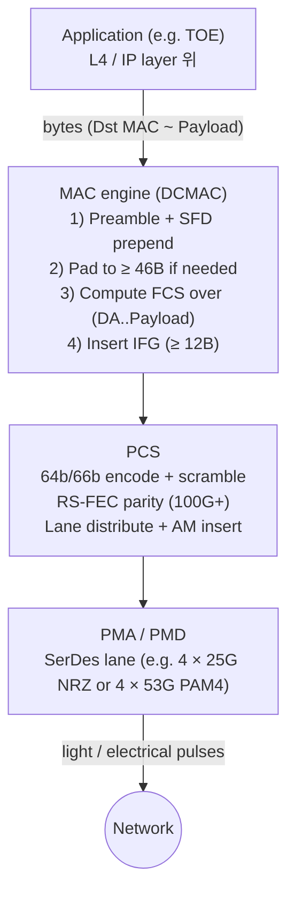
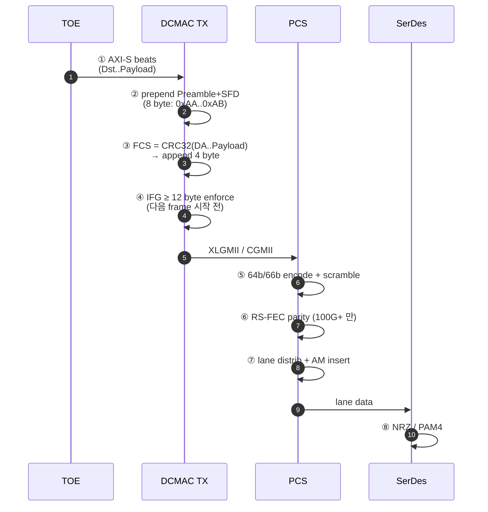
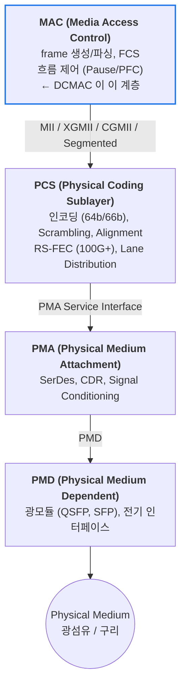

# Module 01 — Ethernet Fundamentals

<!-- DV-SKOOL-CH-CTX:start -->
<div class="chapter-context" data-cat="network">
  <a class="chapter-back" href="../">
    <span class="chapter-back-arrow">←</span>
    <span class="chapter-back-icon">🌐</span>
    <span class="chapter-back-text">Ethernet DCMAC</span>
  </a>
  <span class="chapter-divider">›</span>
  <span class="chapter-marker">Module 01</span>
</div>
<!-- DV-SKOOL-CH-CTX:end -->

<!-- DV-SKOOL-CH-TOC:start -->
<div class="page-toc">
  <span class="page-toc-label">목차</span>
  <a class="page-toc-link" href="#1-why-care-이-모듈이-왜-필요한가">1. Why care?</a>
  <a class="page-toc-link" href="#2-intuition-비유와-한-장-그림">2. Intuition</a>
  <a class="page-toc-link" href="#3-작은-예-1-518b-ipv4-프레임의-tx-1-cycle-step-by-step">3. 작은 예 — 1518B 프레임 TX</a>
  <a class="page-toc-link" href="#4-일반화-mac-pcs-pma-pmd-와-속도-진화의-축">4. 일반화 — 4 계층</a>
  <a class="page-toc-link" href="#5-디테일-필드-속도-vlan-fcs-pcs-fec">5. 디테일</a>
  <a class="page-toc-link" href="#6-흔한-오해-와-dv-디버그-체크리스트">6. 흔한 오해 + 디버그</a>
  <a class="page-toc-link" href="#7-핵심-정리-key-takeaways">7. 핵심 정리</a>
</div>
<!-- DV-SKOOL-CH-TOC:end -->

!!! objective "학습 목표"
    이 모듈을 마치면:

    - **Diagram** Ethernet frame structure (Preamble / SFD / DA / SA / Type / Payload / FCS / IFG) 을 한 장으로 그릴 수 있다.
    - **Distinguish** GbE / 10GbE / 100GbE / 400GbE 의 PCS / FEC / lane 폭 차이를 구분할 수 있다.
    - **Trace** 1 KB IPv4 payload 가 user → MAC → PCS → SerDes 까지 어떻게 변환되는지 추적할 수 있다.
    - **Apply** VLAN tag, jumbo frame, pause/PFC frame 을 시나리오에 매핑할 수 있다.
    - **Identify** PCS / RS-FEC / lane distribution / alignment marker 의 역할을 식별할 수 있다.

!!! info "사전 지식"
    - OSI 7 계층 모델 (특히 L1 / L2)
    - 패킷 / 프레임 일반 어휘 (header, payload, CRC)
    - DMA 와 host CPU 의 일반적인 데이터 핸드오프

---

## 1. Why care? — 이 모듈이 왜 필요한가

### 1.1 시나리오 — _IFG 가 11 byte 면_?

당신은 100G Ethernet MAC 을 검증. 모든 frame 정상, FCS 통과. 그런데 _peer 가 frame loss_ 보고.

원인: **IFG 11 byte 발생** (12 byte 규정 위반).
- Spec: 최소 IFG 12 byte (96 bit).
- 11 byte → peer PHY 가 다음 frame 의 _preamble_ 인식 못함 → frame _drop_.

11 byte vs 12 byte 의 _0.8% 차이_ — 시뮬에서 _대부분 통과_ 하지만 silicon 에서 _intermittent fail_.

DCMAC 검증의 모든 트랜잭션은 **Ethernet frame 1 개** 단위로 출발합니다. Frame 의 어느 byte 가 PHY 영역이고 어느 byte 가 MAC 영역인지, FCS 가 어디부터 어디까지를 보호하는지, IFG 가 왜 12 byte 인지 — 이 어휘 없이 scoreboard / SVA / coverage 를 작성하면 거의 모든 비교가 silent 로 어긋납니다.

또한 100GbE 이상에서는 frame 자체보다 **PCS 64b/66b + RS-FEC + lane distribution** 이 더 큰 검증 비중을 차지합니다. lane skew, alignment marker, FEC corner case 가 line-rate 손실을 만들기 때문입니다. 이 모듈이 없으면 이후 모든 DCMAC corner case 가 "그냥 외워야 하는 규칙" 으로 보입니다.

---

## 2. Intuition — 비유와 한 장 그림

!!! tip "💡 한 줄 비유"
    **Ethernet frame** = **봉투에 담긴 편지**.<br>
    겉봉(Preamble + SFD) 은 우체국 분류기가 “편지 시작” 을 인식하는 마커, 발신/수신 주소(Src/Dst MAC) 는 라우팅, 내용물(Payload) 은 IP 패킷, 봉인 도장(FCS) 은 위변조 검사. 다음 편지와의 최소 간격(IFG) 은 분류기가 두 봉투를 헷갈리지 않게 해 주는 “쉬는 시간”.<br>
    **MAC vs PHY** = **편지 작성자 vs 우체부**. MAC 은 봉투를 만들고 봉인을 찍고 주소를 적는다. PHY (PCS/PMA/PMD) 는 그 봉투를 광케이블 신호로 바꿔 던지는 일만 한다. 둘 사이는 표준 규격의 컨베이어 (MII/XGMII/CGMII/Segmented).

### 한 장 그림 — Frame 한 개가 wire 까지 가는 길



### 왜 이렇게 설계됐는가 — Design rationale

100 Gbps 라인레이트에서 64-byte minimum frame 의 도착 간격은 **~6.7 ns** 입니다. 이 안에서 **frame 시작 인식 (Preamble), 무결성 (FCS), 다음 frame 과의 분리 (IFG), bit-error 복구 (FEC)** 가 모두 끝나야 하므로 — 한 layer 가 하지 못하면 다음 layer 가 도와주는 식의 **계층 분담** 이 필수입니다.

- MAC 은 **byte-level** 일을 합니다 (frame 경계, FCS, padding).
- PCS 는 **block-level** 일을 합니다 (64b/66b, alignment, FEC).
- PMA/PMD 는 **bit/symbol-level** 일을 합니다 (NRZ/PAM4, CDR).

이 분담이 곧 DCMAC 의 인터페이스 형상 — 위쪽은 AXI-Stream(byte), 아래쪽은 Segmented(block) — 를 결정합니다.

---

## 3. 작은 예 — 1518B IPv4 프레임의 TX 1-cycle step by step

가장 단순한 시나리오. TOE 가 **1500-byte IPv4 payload** 를 만들어 DCMAC 의 AXI-S TX 인터페이스에 1518-byte Ethernet frame 으로 흘려보냅니다 (DA 6 + SA 6 + Type 2 + Payload 1500 + FCS 4 = 1518).



| Step | 누가 | 무엇을 | 왜 |
|---|---|---|---|
| ① | TOE | AXI-S 로 1512 byte (DA..Payload) 를 24 beat (512 b 폭 기준) 송신 | DCMAC 위쪽 인터페이스는 byte-level. Preamble/FCS/IFG 는 안 보냄 |
| ② | DCMAC TX | Preamble (7 × `0xAA`) + SFD (`0xAB`) prepend | 수신측 PHY 가 frame 시작 인식 + clock 동기화 |
| ③ | DCMAC TX | DA 부터 Payload 까지 CRC-32 계산 → 4 byte FCS append | end-to-end byte-level 무결성 |
| ④ | DCMAC TX | 다음 frame 까지 ≥ 12 byte idle (96 bit time) 보장 | 수신측 분류기가 두 frame 을 분리할 수 있게 |
| ⑤ | PCS | 64-byte 단위로 64b/66b encode + scramble | DC balance + clock recovery 가능 |
| ⑥ | PCS RS-FEC | RS(528,514) (100G) 또는 RS(544,514) (200/400G) parity | SerDes BER 을 1e-5 → 1e-13 로 |
| ⑦ | PCS | 66-bit block 들을 lane 4~16 개에 round-robin 배포 + 16 K block 마다 AM 삽입 | 수신측 lane reorder + skew 보정 가능 |
| ⑧ | SerDes | NRZ (25G) 또는 PAM4 (50G/100G) 로 wire 송신 | 광/구리 매체가 받아들이는 신호 형식 |

### 비트로 옮긴 frame 모양

```
   Byte: 0      7 8 9       14 15      20 21    22 23           1522 1523     1526
        ┌────────┬───┬─────────┬─────────┬───────┬───────────────┬──────┬────...┐
        │  AA*7  │AB │ DstMAC  │ SrcMAC  │ Type  │   Payload     │  FCS │ IFG   │
        │  Preamb│SFD│  6 B    │  6 B    │ 0x0800│   1500 B      │ 4 B  │ 12 B  │
        └────────┴───┴─────────┴─────────┴───────┴───────────────┴──────┴────...┘
                     │←──────── FCS 계산 범위 (1514 byte) ──────→│
        │←───────── PHY 영역 ──────│←──────── MAC 영역 ──────────│←PHY영역→│
```

!!! note "여기서 잡아야 할 두 가지"
    **(1) FCS 계산 범위** = DstMAC 부터 Payload 까지. Preamble/SFD/IFG 는 제외. 이 한 줄을 놓치면 거의 모든 scoreboard mismatch 가 여기서 시작합니다.<br>
    **(2) Frame 1 개가 끝나는 시점** = TX 가 마지막 FCS byte 를 PCS 에 밀어 넣은 시점이 아니라 **다음 frame 이 IFG 12 byte 를 기다린 후 Preamble 을 다시 시작하는 시점**. SVA / coverage 의 "frame_end" 정의가 흔들리면 IFG 측정도 흔들립니다.

---

## 4. 일반화 — MAC / PCS / PMA / PMD 와 속도 진화의 축

### 4.1 4 계층 분담



**DV 관점**: MAC 검증은 **MAC ↔ PCS 경계 (MII/Segmented)** 와 **MAC ↔ 상위 계층 (AXI-S)** 두 경계에서 수행합니다. 각 경계에서 신호 의미가 어떻게 다른지가 핵심.

### 4.2 속도 진화의 세 축 — bit-rate / lane / encoding

속도가 올라갈수록 **세 축이 동시에** 변합니다.

| 축 | GbE → 10GbE → 100GbE → 400GbE 변화 |
|---|---|
| **bit rate / lane** | 1.25 GBaud (8b/10b) → 10.3125 GBaud → 25.78125 GBaud (NRZ) → 53.125 GBaud (PAM4) |
| **lane 수** | 1 → 1 (또는 4×2.5G 묶음) → 4 → 8 (또는 4×PAM4) |
| **encoding / FEC** | 8b/10b (no FEC) → 64b/66b (no FEC) → 64b/66b + RS(528,514) → 64b/66b + RS(544,514) |

→ "단순히 클럭만 빨라지는 게 아니라 인코딩/FEC/lane 조합이 통째로 바뀌므로, 각 속도 모드는 사실상 **다른 PHY**" 입니다.

### 4.3 Frame 한 개의 변형 — VLAN / Jumbo / Pause / PFC

표준 frame 에서 옵션 4 가지가 갈라집니다.

| 변형 | 무엇이 추가/변경 | 사용 |
|---|---|---|
| **VLAN tag (802.1Q)** | EtherType 자리에 4-byte VLAN tag 삽입 (TPID 0x8100 + TCI) | L2 segregation, QoS PCP |
| **Jumbo frame** | Payload 1500 → ~9000 byte | throughput 효율 (overhead↓) |
| **Pause frame (802.3x)** | EtherType `0x8808`, MAC control, 포트 전체 정지 | 흐름 제어 (전체) |
| **PFC frame (802.1Qbb)** | EtherType `0x8808`, opcode `0x0101`, 8 priority 별 정지 | RoCE / 무손실 DCN 흐름 제어 |

이 4 가지가 곧 §5 의 detail 표와 SVA / coverage 의 cross bin 을 결정합니다.

---

## 5. 디테일 — 필드, 속도, VLAN, FCS, PCS, FEC

### 5.1 Ethernet 프레임 구조

```
+----------+--------+--------+------+--------+---------+-----+-----+
| Preamble | SFD    | Dst    | Src  | Type/  | Payload | FCS | IFG |
| (7B)     | (1B)   | MAC    | MAC  | Length |         |(4B) |(12B)|
|          |        | (6B)   | (6B) | (2B)   |(46-1500)| CRC |     |
+----------+--------+--------+------+--------+---------+-----+-----+
|← PHY 영역 →|←          MAC 영역                    →|← PHY →|

총 크기: 64B (최소) ~ 1518B (표준 최대) ~ 9022B (Jumbo)
```

#### 각 필드 상세

| 필드 | 크기 | 역할 |
|------|------|------|
| **Preamble** | 7B | 10101010... 패턴, 수신측 클럭 동기화 |
| **SFD** (Start Frame Delimiter) | 1B | 10101011 — 프레임 시작 표시 |
| **Dst MAC** | 6B | 목적지 MAC 주소 (Unicast/Multicast/Broadcast) |
| **Src MAC** | 6B | 출발지 MAC 주소 |
| **EtherType / Length** | 2B | ≥0x0600: 프로토콜 타입 (0x0800=IPv4, 0x86DD=IPv6) |
| | | <0x0600: Payload 길이 (IEEE 802.3) |
| **Payload** | 46-1500B | 상위 계층 데이터 (IP 패킷 등) |
| **FCS** (Frame Check Sequence) | 4B | CRC-32, Dst MAC부터 Payload까지의 무결성 검증 |
| **IFG** (Inter-Frame Gap) | 12B | 프레임 간 최소 간격 (96 bit time) |

#### VLAN Tag (802.1Q)

```
VLAN 태그 삽입 시:

+--------+------+----------+------+---------+-----+
| Dst MAC| Src  | VLAN Tag | Type | Payload | FCS |
| (6B)   | MAC  | (4B)     | (2B) |         |(4B) |
+--------+------+----------+------+---------+-----+

VLAN Tag (4B):
  TPID (2B): 0x8100 (VLAN 식별)
  TCI (2B):
    PCP (3bit): Priority (0-7, QoS)
    DEI (1bit): Drop Eligible
    VID (12bit): VLAN ID (0-4095)
```

### 5.2 Ethernet 속도 진화

| 세대 | 속도 | 표준 | 매체 | 데이터센터 용도 |
|------|------|------|------|---------------|
| GbE | 1 Gbps | 802.3ab | Cat5e 구리 | 레거시 |
| 10GbE | 10 Gbps | 802.3ae | SFP+ 광 | 서버 연결 |
| 25GbE | 25 Gbps | 802.3by | SFP28 | 서버 NIC |
| 40GbE | 40 Gbps | 802.3ba | QSFP+ | 스위치 업링크 |
| 100GbE | 100 Gbps | 802.3ck | QSFP28/56 | 현재 주류 |
| 200GbE | 200 Gbps | 802.3ck | QSFP56-DD | 차세대 |
| 400GbE | 400 Gbps | 802.3ck | OSFP/QSFP-DD | 최신 스파인 |
| 800GbE | 800 Gbps | 802.3df | OSFP-XD | 개발 중 |

**MangoBoost 맥락**: DCMAC = 100/200/400GbE MAC → 서버급 SmartNIC/DPU용

### 5.3 FCS (CRC-32) — 핵심 에러 검출

#### CRC-32 동작

```
TX:
  1. Dst MAC ~ Payload까지 CRC-32 계산
  2. 결과 4B를 FCS 필드에 삽입
  3. 프레임 전송

RX:
  1. 수신된 프레임의 Dst MAC ~ Payload에 대해 CRC-32 재계산
  2. 계산 결과 vs FCS 필드 비교
  3. 일치 → 정상, 불일치 → 프레임 폐기

CRC-32 다항식: x^32 + x^26 + x^23 + ... + x + 1
  (IEEE 802.3 표준)
```

#### CRC의 한계

| 검출 가능 | 검출 불가능 |
|----------|-----------|
| 단일 비트 에러 | 일부 다중 비트 패턴 (확률적) |
| 버스트 에러 (32bit 이하) | CRC 자체가 변조된 경우 |
| 대부분의 랜덤 에러 | 의도적 변조 (보안 → MAC 범위 밖) |

### 5.4 Ethernet 흐름 제어

#### Pause Frame (IEEE 802.3x)

```
수신 버퍼 거의 가득 참:
  RX → TX: PAUSE Frame (pause_time = N × 512 bit time)
  TX: N 단위 시간 동안 전송 중단

문제: 포트 전체를 멈춤 → 다른 트래픽도 영향
```

#### PFC (Priority-based Flow Control, 802.1Qbb)

```
우선순위별 개별 제어:

  RX → TX: PFC Frame (priority 3만 멈춰라)
  TX: priority 3 트래픽만 중단, 나머지 우선순위는 계속 전송

  8개 우선순위 × 개별 Pause → 세밀한 흐름 제어
  → 데이터센터에서 필수 (RoCE, Storage 등 무손실 네트워크)
```

### 5.5 MAC 주소 구조

```
MAC 주소 = 48비트 (6바이트), 16진수 표기: AA:BB:CC:DD:EE:FF

  +--------+--------+--------+--------+--------+--------+
  | Byte 0 | Byte 1 | Byte 2 | Byte 3 | Byte 4 | Byte 5 |
  +--------+--------+--------+--------+--------+--------+
  |←   OUI (24bit)  →|←   NIC Specific (24bit)  →|

  Byte 0의 비트 구조:
    bit 0: 0 = Unicast, 1 = Multicast
    bit 1: 0 = Globally Unique (OUI 기반), 1 = Locally Administered

  특수 주소:
    FF:FF:FF:FF:FF:FF = Broadcast (모든 노드에 전달)
    01:80:C2:00:00:01 = Pause Frame 목적지 (IEEE 802.3x)
    01:00:5E:xx:xx:xx = IPv4 Multicast 매핑
```

**DV 관점**: MAC 주소 필터링 검증 시 Unicast/Multicast/Broadcast 각각의 동작을 확인해야 하고, Promiscuous 모드에서는 모든 주소를 수신하는지 확인.

### 5.6 MII 인터페이스 종류

MAC과 PCS 사이의 인터페이스. 속도가 올라갈수록 데이터 폭이 넓어진다.

| 인터페이스 | 속도 | 데이터 폭 | 클럭 | 특징 |
|-----------|------|----------|------|------|
| **MII** | 10/100M | 4-bit | 2.5/25 MHz | 원조 |
| **GMII** | 1G | 8-bit | 125 MHz | GbE용 |
| **XGMII** | 10G | 32-bit (DDR 64-bit) | 156.25 MHz | 10G용, Control 캐릭터 포함 |
| **XLGMII** | 40G | 128-bit | 156.25 MHz | 4×10G 레인 기반 |
| **CGMII** | 100G | 256-bit | 390.625 MHz | 100G용 |
| **Segmented** | 100G+ | 가변 | 가변 | AMD DCMAC이 사용, 아래 상세 |

#### Segmented 인터페이스 (DCMAC Line Side)

```
기존 MII: 한 번에 하나의 프레임만 전송 가능

Segmented: 하나의 버스 사이클에 여러 프레임의 세그먼트가 공존 가능

  +---------+---------+---------+---------+
  | Seg 0   | Seg 1   | Seg 2   | Seg 3   |
  | Frame A | Frame A | Frame B | Frame B |
  | (끝)    | (IFG)   | (시작)  | (계속)  |
  +---------+---------+---------+---------+

  → 프레임 간 IFG를 최소화하여 대역폭 효율 극대화
  → 100G+에서 라인 레이트 달성에 필수
  → 각 세그먼트에 Control 정보(SOP, EOP, Error) 포함

DV 관점:
  - 세그먼트 경계에서 프레임 시작/종료 정확성 검증
  - 동일 사이클 내 다중 프레임 세그먼트 처리 검증
  - 에러 세그먼트 주입 및 전파 검증
```

### 5.7 PCS 64b/66b 인코딩

100G+ Ethernet에서 사용하는 표준 인코딩 방식. (이전 세대의 8b/10b보다 오버헤드가 낮음)

```
8b/10b vs 64b/66b 오버헤드 비교:
  8b/10b:  10bit 중 8bit 유효 → 오버헤드 20%
  64b/66b: 66bit 중 64bit 유효 → 오버헤드 ~3%

64b/66b 블록 구조:
  +----+-------------------------------+
  | SH | Payload (64 bits)             |
  |(2b)|                               |
  +----+-------------------------------+

  Sync Header (SH):
    01 = Data Block (64비트 전부 데이터)
    10 = Control Block (제어 정보 포함 — SOP, EOP, Idle, Error 등)

인코딩 과정:
  1. MAC에서 64비트 데이터 또는 제어 문자를 받음
  2. 2비트 Sync Header를 앞에 붙여 66비트 블록 생성
  3. Scrambling 적용 (DC 밸런스 + 클럭 복원 지원)
  4. SerDes로 전달

디코딩 과정 (RX):
  1. SerDes에서 비트 스트림 수신
  2. Block Lock: Sync Header 패턴(01/10)을 찾아 66비트 경계 정렬
  3. Descrambling
  4. Data/Control 블록 분리 → MAC에 전달
```

#### Lane Distribution (Multi-Lane)

```
100GbE = 4 × 25G 또는 2 × 50G 레인

Lane Distribution:
  PCS가 66비트 블록들을 Round-Robin으로 레인에 분배

  Block 0 → Lane 0
  Block 1 → Lane 1
  Block 2 → Lane 2
  Block 3 → Lane 3
  Block 4 → Lane 0  (다시)
  ...

Alignment Marker (AM):
  각 레인에 주기적으로 삽입 (약 16K 블록마다)
  → RX 측에서 레인 순서 복원 + 레인 간 Skew 보정

  PCS Lane 0: ...data... [AM0] ...data... [AM0] ...
  PCS Lane 1: ...data... [AM1] ...data... [AM1] ...
  ...

DV 관점:
  - Lane 순서 뒤바뀜(Lane Swizzle) 시 PCS가 복원하는지 검증
  - Lane 간 Skew 보정 정확성
  - AM 삽입/제거 주기 정확성
```

### 5.8 RS-FEC (Reed-Solomon Forward Error Correction)

100G+ Ethernet에서 BER(Bit Error Rate)을 낮추기 위한 필수 기술.

```
왜 필요한가?
  - 25Gbps+ SerDes에서는 신호 품질 열화로 BER이 높아짐
  - CRC(FCS)는 에러를 "검출"만 함 → 프레임 폐기 → 재전송 필요
  - RS-FEC는 에러를 "정정"함 → 폐기 없이 복구 → 처리량 유지

동작 원리:
  TX: PCS 인코딩 후, RS 부호화 (패리티 심볼 추가)
  RX: RS 복호화로 에러 정정 → PCS 디코딩

  +------+    +------+    +--------+    +--------+
  | MAC  | → | PCS  | → | RS-FEC | → | SerDes |
  |      |    |64b66b|    |Encode  |    |   TX   |
  +------+    +------+    +--------+    +--------+

                         RS(544, 514):
                           514 심볼 데이터 + 30 심볼 패리티
                           → 최대 16 심볼 에러 정정 가능

성능 지표:
  - Pre-FEC BER: ~1e-5 (RS-FEC 투입 전, SerDes 출력)
  - Post-FEC BER: ~1e-13 이하 (RS-FEC 정정 후)
  → 8자릿수 이상의 BER 개선

종류:
  | 표준 | 속도 | FEC 방식 | 레이턴시 |
  |------|------|----------|---------|
  | 802.3bj (Clause 91) | 100G | RS(528,514) | ~50ns |
  | 802.3cd (Clause 119) | 200G/400G | RS(544,514) | ~50ns |

DV 관점:
  - FEC 카운터(corrected/uncorrected codeword) 정확성
  - FEC 바이패스 모드 동작
  - Pre-FEC BER vs Post-FEC BER 통계 수집 검증
```

### 5.9 Q&A 보강

**Q: Ethernet 프레임의 최소/최대 크기는 왜 정해져 있는가?**
> "최소 64B: CSMA/CD 충돌 감지에 필요한 최소 전송 시간 보장을 위해 역사적으로 설정됨. 현대 Full-Duplex에서는 충돌 없지만 호환성을 위해 유지. Payload가 46B 미만이면 패딩 추가. 최대 1518B(표준) / 9022B(Jumbo): 수신 버퍼 크기와 지연 제한을 위해 설정. Jumbo Frame은 서버 환경에서 오버헤드 감소를 위해 사용."

**Q: PFC가 Pause Frame보다 나은 이유는?**
> "Pause Frame은 포트 전체를 멈추므로, 한 트래픽의 혼잡이 모든 트래픽에 영향을 준다(Head-of-Line Blocking). PFC는 8개 우선순위별로 독립적으로 Pause할 수 있어, RoCE 같은 무손실 트래픽만 보호하면서 나머지는 계속 전송 가능하다."

**Q: 64b/66b 인코딩이 8b/10b보다 유리한 이유는?**
> "오버헤드 차이가 핵심이다. 8b/10b는 20% 오버헤드(10GbE에서 실제 SerDes 속도 12.5Gbps 필요), 64b/66b는 ~3% 오버헤드(25GbE에서 25.78Gbps). 고속에서 SerDes 속도를 낮출 수 있어 구현 비용과 전력이 줄어든다. 단점은 DC 밸런스를 별도 Scrambling으로 확보해야 하는 점."

**Q: RS-FEC는 왜 100G+에서 필수인가?**
> "25Gbps+ SerDes에서 신호 감쇠와 크로스톡으로 Pre-FEC BER이 ~1e-5 수준이다. FEC 없이 CRC만으로는 프레임 폐기율이 높아 사실상 라인 레이트를 유지할 수 없다. RS-FEC(544,514)가 Post-FEC BER을 1e-13 이하로 낮추므로, 물리적 열악한 채널에서도 무결성 있는 통신이 가능해진다."

**Q: Segmented 인터페이스란 무엇이고 왜 필요한가?**
> "기존 MII는 한 사이클에 하나의 프레임만 처리하므로 짧은 프레임이 연속되면 IFG 오버헤드가 커진다. Segmented 인터페이스는 하나의 버스 사이클 내에 여러 프레임의 세그먼트를 담을 수 있어 IFG를 최소화하고 대역폭 활용률을 극대화한다. 100G+에서 라인 레이트 달성에 필수적이다."

---

## 6. 흔한 오해 와 DV 디버그 체크리스트

### 흔한 오해

!!! danger "❓ 오해 1 — 'FCS(CRC-32) 는 Preamble 부터 Payload 까지 전체 프레임을 보호한다'"
    **실제**: FCS 는 **Dst MAC 부터 Payload 까지** (= 1514 byte for 표준 max) 만 계산합니다. Preamble(7B)/SFD(1B)/IFG(12B) 는 계산 범위 밖.<br>
    **왜 헷갈리는가**: frame 다이어그램에서 Preamble~FCS 가 한 줄로 표시되다 보니 FCS 가 전체를 커버한다고 직관적으로 착각.

!!! danger "❓ 오해 2 — '1G / 10G / 100G 는 같은 PHY 위에서 속도만 바뀌는 것이다'"
    **실제**: encoding (8b/10b → 64b/66b), lane 수 (1 → 4 → 8), FEC (없음 → RS(528,514) → RS(544,514)), modulation (NRZ → PAM4) 가 모두 다른 PHY. 속도 모드 전환은 사실상 PHY 교체.<br>
    **왜 헷갈리는가**: 소프트웨어 driver / 레지스터가 동일한 추상화를 제공해서.

!!! danger "❓ 오해 3 — 'IFG 는 단순한 idle 여백이라 검증 우선순위가 낮다'"
    **실제**: IFG 위반은 수신측 버퍼 underrun, 링크 파트너 오동작을 **silent** 로 유발. 라인 레이트에서 IFG < 12 byte 면 frame loss 가 frame counter / CRC error 어느 곳에도 잡히지 않음.<br>
    **왜 헷갈리는가**: IFG 위반이 명시적인 error counter 로 보고되지 않아서 통과처럼 보임.

!!! danger "❓ 오해 4 — 'VLAN tag 를 붙여도 데이터는 그대로니까 throughput 에 영향이 없다'"
    **실제**: 4-byte tag 추가로 frame 최소 길이 / MTU 기준 / IFG 포함 효율이 모두 변합니다. line-rate 에서 동일 payload 라도 frame-level overhead 가 늘어나 effective throughput 이 줄어듭니다.<br>
    **왜 헷갈리는가**: payload 자체가 불변이라 "데이터는 그대로" 라는 직관이 강해서.

!!! danger "❓ 오해 5 — 'RS-FEC 는 latency 만 늘릴 뿐이지 mandatory 는 아니다'"
    **실제**: 100G+ SerDes 는 Pre-FEC BER 이 ~1e-5 라 FEC 없이는 frame 폐기율이 너무 높아 사실상 line-rate 유지 불가. spec 자체가 FEC 를 mandatory 로 규정 (802.3bj/cd).

### DV 디버그 체크리스트 (이 모듈 내용으로 마주칠 첫 실패들)

| 증상 | 1차 의심 | 어디 보나 |
|---|---|---|
| Scoreboard 에서 FCS 가 항상 mismatch | TB 가 CRC 입력에 Preamble/SFD 를 포함시켰나? | TX model 의 CRC 시작 offset = +8B 인지 |
| FCS 는 OK 인데 frame size mismatch | VLAN tag 붙은 frame 의 size 비교 기준 | 표준 1518 vs VLAN 1522 분기 |
| Runt frame counter 가 정상보다 큼 | 수신 frame size = 64B 미만으로 잘림 | TX padding 로직 + AXI-S tkeep 마지막 beat |
| Lane 0 만 lock 되고 lane 1~3 lock 안 됨 | AM (alignment marker) 주기 / 패턴 불일치 | PCS lane 별 AM 삽입 주기 (16 K block) |
| 100G FEC 검증인데 frame loss 없음 | FEC bypass 모드인지 확인 | RS-FEC enable 레지스터 + FEC counter |
| IFG 가 12 byte 미만인데 link 동작 | Segmented IF 의 IFG enforce 미설정 | DCMAC config 의 min_ifg parameter |
| TX frame 마지막 4 byte 가 garbage | FCS 자리에 user data 가 들어감 | AXI-S tlast + tkeep 의 last-beat 처리 |
| Pause frame 받았는데 TX 안 멈춤 | Pause frame parser disable / EtherType 0x8808 미인식 | flow control config + EtherType filter |

---

## 7. 핵심 정리 (Key Takeaways)

- **Frame 구조**: Preamble (7) + SFD (1) + DA (6) + SA (6) + Type (2) + Payload (46-1500) + FCS (4) + IFG (12). FCS 범위 = DA..Payload.
- **MAC vs PHY**: MAC 은 byte-level (frame/CRC/IFG), PHY 의 PCS/PMA/PMD 는 block/symbol/bit-level (인코딩, FEC, SerDes).
- **속도 진화 3 축**: bit-rate × lane 수 × encoding/FEC. 셋이 동시에 변하므로 각 속도 모드는 사실상 다른 PHY.
- **VLAN / Jumbo / Pause / PFC** = 표준 frame 의 4 변형. 각각이 frame 길이 / MTU / 흐름제어 의미를 바꿈.
- **PCS + RS-FEC + Lane distribution** 이 100G+ 의 silent failure 주범 — DV 의 진짜 corner case 는 frame 자체가 아니라 PCS 계층에서.

!!! warning "실무 주의점 — FCS 계산 범위 착각"
    **현상**: Scoreboard 에서 FCS 값이 항상 mismatch. TB 가 삽입한 FCS 가 DUT 출력과 다름.<br>
    **원인**: FCS (CRC-32) 는 Dst MAC 부터 Payload 까지만. Preamble/SFD (총 8B) 는 제외 대상인데 TB 코드가 Preamble 을 CRC 입력 버퍼에 포함시키는 실수 빈번.<br>
    **점검 포인트**: TX model 의 CRC 계산 시작 offset = Preamble(7B) + SFD(1B) = 8B 이후. VLAN tag 삽입 시 EtherType 이전 4B 추가되므로 Jumbo 임계값 (1518B → 1522B) 도 재계산 필요.

### 7.1 자가 점검

!!! question "🤔 Q1 — IFG 계산 (Bloom: Apply)"
    400 Gbps line rate. 64-byte minimum frame + 12-byte IFG. _초당 최대 frame rate_?

    ??? success "정답"
        - Frame + IFG = 64 + 12 + 8 (preamble+SFD) = **84 byte**.
        - 400 Gbps / (84 × 8 bit) ≈ **595 M frames/sec**.

        그래서 _64B minimum frame_ 이 _최대 packet rate_ 의 worst case. DV scoreboard 가 _초당 ~6 억 frame_ 처리 가능해야.

!!! question "🤔 Q2 — RS-FEC 검증 (Bloom: Analyze)"
    100GBASE-R 의 RS-FEC. _얼마나 많은 error_ 까지 복구?

    ??? success "정답"
        **RS(528, 514, t=7)**: 528-symbol codeword 에서 _최대 7 symbol error_ 복구.
        - 1 symbol = 10 bit.
        - 7 symbol = 70 bit per codeword.

        실제 _burst error_ 에 강함 (burst 가 consecutive symbol 에 분포).

        Pre-FEC BER 10^-5 → Post-FEC BER 10^-15 가능 (10^10× 개선).

!!! question "🤔 Q3 — Lane skew (Bloom: Evaluate)"
    400G 8-lane 의 _lane skew_. 어디까지 허용?

    ??? success "정답"
        IEEE 802.3 spec: PMA-to-PMA skew _최대 ~180 ns_ (lane 간).
        - 400 Gbps / 8 lanes = 50 Gbps/lane.
        - 1 bit time @ 50 Gbps = 20 ps.
        - 180 ns = 9000 bit time.

        Lane re-ordering 의 _buffer depth_ 가 _이 skew × line rate_ 이상이어야. DV 시 _worst skew injection_ + buffer overflow 안 함 검증.

### 7.2 출처

**Internal (Confluence)**
- `[Jaehyeok] Ethernet Wrapper (DCMAC)` (id=893747237)
- `DCMAC spec related to AXIS intf` (id=894402571)

**External**
- IEEE 802.3 *Ethernet Standard*
- IEEE 802.3bj/bs — 100/400GBASE-R with RS-FEC
- Reed-Solomon code analysis textbooks

---

## 다음 모듈

→ [Module 02 — DCMAC Architecture](02_dcmac_architecture.md): DCMAC 한 IP 안에 MAC + PCS + FEC 가 어떻게 통합되어 있는지, 그리고 user 측 AXI-S 와 line 측 Segmented IF 의 신호가 정확히 어떻게 생겼는지.

[퀴즈 풀어보기 →](quiz/01_ethernet_fundamentals_quiz.md)

<div class="chapter-nav">
  <a class="nav-prev" href="../">
    <div class="nav-label">◀ 이전</div>
    <div class="nav-title">코스 홈</div>
  </a>
  <a class="nav-next" href="../02_dcmac_architecture/">
    <div class="nav-label">다음 ▶</div>
    <div class="nav-title">DCMAC 아키텍처</div>
  </a>
</div>


--8<-- "abbreviations.md"
