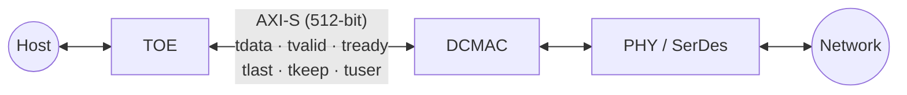

# Module 02 — DCMAC Architecture

<!-- DV-SKOOL-CH-CTX:start -->
<div class="chapter-context" data-cat="network">
  <a class="chapter-back" href="../">
    <span class="chapter-back-arrow">←</span>
    <span class="chapter-back-icon">🌐</span>
    <span class="chapter-back-text">Ethernet DCMAC</span>
  </a>
  <span class="chapter-divider">›</span>
  <span class="chapter-marker">Module 02</span>
</div>
<!-- DV-SKOOL-CH-CTX:end -->

<!-- DV-SKOOL-CH-TOC:start -->
<div class="page-toc">
  <span class="page-toc-label">목차</span>
  <a class="page-toc-link" href="#1-why-care-이-모듈이-왜-필요한가">1. Why care?</a>
  <a class="page-toc-link" href="#2-intuition-비유와-한-장-그림">2. Intuition</a>
  <a class="page-toc-link" href="#3-작은-예-pfc-priority3-한-frame-이-line-에서-toe-까지-올라가는-과정">3. 작은 예 — PFC frame TOE 까지</a>
  <a class="page-toc-link" href="#4-일반화-tx-rx-engine-config-flow-control-ptp-5-블록">4. 일반화 — 5 블록</a>
  <a class="page-toc-link" href="#5-디테일-블록-인터페이스-신호-레지스터-맵">5. 디테일</a>
  <a class="page-toc-link" href="#6-흔한-오해-와-dv-디버그-체크리스트">6. 흔한 오해 + 디버그</a>
  <a class="page-toc-link" href="#7-핵심-정리-key-takeaways">7. 핵심 정리</a>
</div>
<!-- DV-SKOOL-CH-TOC:end -->

!!! objective "학습 목표"
    이 모듈을 마치면:

    - **Diagram** DCMAC IP 의 5 블록 (TX MAC / RX MAC / Config / Flow Control / PTP) 과 양 측 인터페이스 (AXI-S host, Segmented line) 를 그릴 수 있다.
    - **Apply** Segmented (PHY) ↔ AXI-Stream (host) 데이터 흐름을 한 frame 단위로 추적할 수 있다.
    - **Identify** RS-FEC, KR-FEC, auto-negotiation, link training 의 역할을 식별할 수 있다.
    - **Implement** Multi-channel (1×400G, 2×200G, 4×100G) 시나리오의 SerDes lane 매핑을 구현할 수 있다.
    - **Trace** TX tuser / RX tuser 비트가 frame 의 어느 동작과 매핑되는지 추적할 수 있다.

!!! info "사전 지식"
    - [Module 01](01_ethernet_fundamentals.md) — Frame 구조, FCS, MAC vs PHY 분담
    - [AXI-Stream](../../amba_protocols/03_axi_stream/) — host 측 인터페이스
    - PCIe / DMA 의 일반적인 host ↔ accelerator 데이터 핸드오프

---

## 1. Why care? — 이 모듈이 왜 필요한가

### 1.1 시나리오 — _Single lane OK_, _Multi-lane FAIL_

당신의 DCMAC 검증. 100G 단일 lane mode 모든 test 통과. 200G 4-lane 모드로 옮기니 _ random 시간에 frame skew error_.

추적:
- Lane 0, 1, 2, 3 의 _PCS alignment marker_ 가 _다른 시점_ 도착.
- DCMAC 의 _lane reorder buffer_ 가 _이 skew 를 흡수_ 해야 함.
- Bug: reorder buffer 가 _expected 보다 작은 depth_.

**Multi-lane bug 는 단일 lane test 에서 _절대_ 안 잡힘**. 다른 시나리오 필요.

DCMAC 검증 환경의 모든 신호 이름 — `tx_axis_tdata`, `rx_axis_tuser`, `pause_req`, `pcs_align_status`, `gt_txusrclk2` — 는 이 모듈의 5 블록 중 하나에 속합니다. 어느 블록의 신호인지 모르면 **scoreboard 위치 / SVA bind 모듈 / coverage 도메인** 자체가 잘못 설정됩니다.

또한 100/200/400G **multi-channel mode** 는 같은 IP 가 SerDes lane 을 다르게 매핑한 결과입니다. 이 매핑이 틀어지면 단일 lane test 는 통과해도 4-lane / 8-lane 구성에서 silent failure 가 누적됩니다. 이 모듈을 건너뛰면 그 silent failure 의 root cause 를 찾을 어휘가 없습니다.

---

## 2. Intuition — 비유와 한 장 그림

!!! tip "💡 한 줄 비유"
    **DCMAC** = **초고속 우편물류 자동화 센터**.<br>
    위층 입구(AXI-S) 로 편지 내용물(payload byte) 이 들어오면 봉투(Preamble/FCS/IFG) 를 씌워 아래층 컨베이어(Segmented IF) 로 내보낸다. 반대로 컨베이어에서 들어온 봉투는 봉투를 뜯고(strip Preamble/FCS) 내용물만 위층으로 올린다. 옆에는 관리실(AXI-Lite Config) + 흐름제어실(Pause/PFC) + 시계실(PTP) 이 항상 따로 일하면서 본 라인을 감시한다.

### 한 장 그림 — 5 블록 + 두 인터페이스

```d2
direction: right

HOST_TX: "Host\nAXI-S TX"
HOST_RX: "Host\nAXI-S RX"
LINE_TX: "Line\nSegmented IF\n(TX out)" { shape: circle }
LINE_RX: "Line\nSegmented IF\n(RX in)" { shape: circle }
DCMAC: "DCMAC IP" {
  direction: down
  TXP: "TX path" {
    direction: right
    TXMAC: "TX MAC\nPreamble/SFD\nFCS gen\nPad / IFG"
    TXPCS: "PCS + FEC\n64b/66b + RS-FEC\nLane distribute + AM"
    TXMAC -> TXPCS
  }
  RXP: "RX path" {
    direction: right
    RXPCS: "PCS + FEC\nBlock lock + Descramble\nFEC decode + Lane align"
    RXMAC: "RX MAC\nPreamble strip\nFCS check\nFilter / Stat"
    RXPCS -> RXMAC
  }
  CFG: "Config (AXI-Lite)\nMAC addr, MTU, mode\nFEC en, stat counter"
  FC: "Flow Ctrl\nPause / PFC"
  PTP: "PTP\nTS · 1step"
}
HOST_TX -> TXMAC
TXPCS -> LINE_TX
LINE_RX -> RXPCS
RXMAC -> HOST_RX
```

### 왜 이 구조 — Design rationale

세 가지 동시 요구가 있습니다.

1. **Line-rate (400 Gbps) 를 single-cycle stall 없이 채워야 함** → TX/RX 데이터 path 가 한 사이클에 multi-segment 처리 가능한 Segmented IF.
2. **상위 stack (TOE/IP) 가 byte-level frame 만 다루게 해야 함** → host 측은 표준 AXI-Stream, byte 마스크 (tkeep), 사이드밴드 (tuser) 만 노출.
3. **흐름제어 / 시각 동기 / 통계는 main path 와 독립이어야 함** → PFC, PTP, RMON counter 가 각각 별도 블록으로 분리.

이 세 요구의 교집합이 곧 **5 블록 + 2 인터페이스** 형상.

---

## 3. 작은 예 — PFC priority-3 한 frame 이 Line 에서 TOE 까지 올라가는 과정

가장 단순한 시나리오. **PFC frame 이 line 에서 들어와 DCMAC 이 TX 의 priority-3 큐만 멈추도록** 하는 1 cycle 추적. (정상 data frame 의 RX path 와 PFC 처리 path 두 가지를 한 번에 보여줌.)

```d2
direction: right

NETIN: "Network\n(in)" { shape: circle }
SDIN: "SerDes RX"
PCSIN: "PCS RX"
RXMAC: "RX MAC"
AXISRX: "AXI-S RX → TOE\n(PFC frame 안 올림)"
FCB: "Flow Control 블록\n② opcode=0x0101 (PFC)\npriority_enable_vector[3]=1\npause_time[3] = 0x0064"
TXQ3: "TX MAC priority-3 queue\n③ scheduler: priority_3 만 정지\n(priority 0..2, 4..7 은 계속 송신)"
TXMAC: "TX MAC"
PCSOUT: "PCS TX"
SDOUT: "SerDes TX"
NETOUT: "Network\n(out)" { shape: circle }
NETIN -> SDIN
SDIN -> PCSIN
PCSIN -> RXMAC
RXMAC -> AXISRX: "일반 data frame"
RXMAC -> FCB: "① EtherType=0x8808 인식"
FCB -> TXQ3
TXQ3 -> TXMAC
TXMAC -> PCSOUT
PCSOUT -> SDOUT
SDOUT -> NETOUT
FCB -> TXQ3: "④ pause_time tick\n(단위 = 512 bit time)" { style.stroke-dash: 4 }
```

| Step | 누가 | 무엇을 | 왜 |
|---|---|---|---|
| ① | RX MAC | EtherType `0x8808` (MAC Control) frame 식별 | 일반 data frame 이 아니므로 host 로 안 올림 |
| ② | RX MAC | Flow Control 블록에 frame body 전달 | opcode + priority_enable + pause_time 디코드 |
| ③ | Flow Ctrl | TX MAC scheduler 의 priority_3 만 stall request | 다른 priority traffic 은 line-rate 유지 |
| ④ | Flow Ctrl | pause_time counter (512 bit time 단위) tick down | 0 도달 시 priority_3 자동 재개 |
| ⑤ | RX MAC | rx_pause_pfc_counter 증가 | RMON 통계 |
| ⑥ | RX MAC | host 의 AXI-S RX 에는 **올리지 않음** | PFC frame 은 host 가 보지 않아도 됨 |
| ⑦ | (반대 방향) | data frame 은 RX MAC 에서 FCS 검증 후 tuser.bad_fcs=0 으로 host 송출 | data path 는 PFC 와 독립 |

```c
// 검증 환경 측의 sequence body (line agent 가 PFC frame 주입)
class pfc_inject_seq extends dcmac_base_seq;
  rand bit [7:0]  prio_enable;
  rand bit [15:0] pause_time[8];
  task body();
    eth_frame_t f;
    f.dst_mac      = 48'h0180_C200_0001;   // MAC control 예약 주소
    f.src_mac      = cfg.local_mac;
    f.ether_type   = 16'h8808;             // MAC Control
    f.opcode       = 16'h0101;             // PFC
    f.prio_en_vec  = prio_enable;          // bit3=1 이면 priority 3 만
    foreach (pause_time[i]) f.pause_time[i] = pause_time[i];
    line_agent.send(f);                     // Segmented IF 로 주입
  endtask
endclass
```

!!! note "여기서 잡아야 할 두 가지"
    **(1) 같은 frame 이 두 블록을 동시에 통과한다** — RX MAC 은 통계만 올리고, Flow Control 블록이 TX MAC 의 priority queue 를 제어. 즉 line frame 1 개의 효과가 host AXI-S 에는 안 나타나고 TX 송신 패턴에 나타남. scoreboard 가 양쪽을 동시에 봐야 검증됨.<br>
    **(2) PFC vs Pause** — pause frame (opcode `0x0001`) 은 포트 전체 정지, PFC (opcode `0x0101`) 는 priority 별. opcode 한 byte 차이로 흐름제어 의미가 완전히 달라짐. monitor 가 opcode 를 같이 캡처하지 않으면 root cause 가 안 보임.

---

## 4. 일반화 — TX/RX engine + Config + Flow Control + PTP, 5 블록

### 4.1 5 블록의 책임 분담

| 블록 | 입력 | 출력 | 책임 |
|---|---|---|---|
| **TX MAC** | AXI-S TX | Segmented (line out) | Preamble + FCS + Pad + IFG |
| **RX MAC** | Segmented (line in) | AXI-S RX | Preamble strip + FCS check + filter + stat |
| **Config (AXI-Lite)** | AXI-Lite | 모든 블록의 control register | 모드/MTU/MAC addr/FEC/PFC config |
| **Flow Control** | RX MAC, Config | TX MAC stall vector | Pause/PFC parsing + TX scheduler 제어 |
| **PTP / 1588** | Config + frame timing | TX/RX timestamp out | TS capture + correction field 갱신 |

### 4.2 두 인터페이스의 의미 차이

| 인터페이스 | 위치 | 단위 | 흐름 | 누가 frame 경계를 표시 |
|---|---|---|---|---|
| AXI-Stream (host) | DCMAC ↔ TOE/IP | byte | tvalid/tready handshake | tlast + tkeep |
| Segmented (line) | DCMAC ↔ PCS/PHY | block (64b multi-segment) | always-running pipeline | per-segment SOP/EOP control bit |

→ 같은 frame 이 위쪽에서는 **24 beat × 512-bit AXI-S** 로, 아래쪽에서는 **N segment / cycle 의 multi-segment block** 으로 표현됩니다. 같은 byte sequence 의 두 표현.

### 4.3 Multi-port mode 의 내부 매핑

DCMAC 한 IP 가 같은 SerDes pool 을 어떻게 묶느냐에 따라 1×400G / 2×200G / 4×100G / mixed 가 나옵니다.

```
SerDes lane 8 개 pool:
   L0 L1 L2 L3 L4 L5 L6 L7

  1 × 400G : [L0..L7]                      → 단일 port, 단일 AXI-S
  2 × 200G : [L0..L3] [L4..L7]             → 2 port, 각각 AXI-S
  4 × 100G : [L0,L1] [L2,L3] [L4,L5] [L6,L7] → 4 port, 각각 AXI-S
  Mixed    : 레지스터 설정으로 임의 매핑
```

**핵심**: 모드 변경은 **reset 후 재설정** 이 정상 흐름. runtime 에 모드 toggle 은 spec 외 영역.

---

## 5. 디테일 — 블록, 인터페이스 신호, 레지스터 맵

### 5.1 DCMAC 블록 다이어그램

```d2
direction: right

DCMAC: "DCMAC IP" {
  direction: down
  TX_ROW: "TX data path" {
    direction: right
    AXIS_TX: "AXI-S TX IF\n(tdata, tvalid, tready,\ntlast, tkeep)"
    TX_MAC: "TX MAC Engine\n- Preamble\n- FCS Gen\n- Pad\n- IFG"
    TX_PCS: "TX PCS Encoder\n64b/66b\nScramble\nRS-FEC\nLane Dist"
    GT_TX: "GT / SerDes TX"
    AXIS_TX -> TX_MAC
    TX_MAC -> TX_PCS
    TX_PCS -> GT_TX
  }
  RX_ROW: "RX data path" {
    direction: right
    GT_RX: "GT / SerDes RX"
    RX_PCS: "RX PCS Decoder\nDescramble\nRS-FEC\nAlign\nDeskew"
    RX_MAC: "RX MAC Engine\n- FCS Chk\n- Filter\n- Stat"
    AXIS_RX: "AXI-S RX IF"
    GT_RX -> RX_PCS
    RX_PCS -> RX_MAC
    RX_MAC -> AXIS_RX
  }
  CFG: "Configuration / Status Registers (AXI-Lite)\nMAC 주소·모드·통계 카운터·에러 상태\nRS-FEC 설정 · PTP 타임스탬프 · Flow Control 설정"
  FC_ENG: "Flow Control Engine\nPause Frame 생성/처리\nPFC (Priority Flow Ctrl)"
  PTP_ENG: "PTP / 1588 Engine\nTX Timestamp Capture\nRX Timestamp Capture"
}
```

### 5.2 Multi-Port 아키텍처 및 속도 모드

DCMAC은 단일 IP 블록으로 다양한 속도 구성을 지원한다.

```
400GbE (1×400G):
  +----------------------------------------------------------+
  |                    DCMAC (Single Port)                    |
  |  Port 0: 400G                                            |
  |  AXI-S: 1개 (1024-bit+)                                  |
  |  SerDes: 8 × 53.125G (PAM4) 또는 4 × 106.25G            |
  +----------------------------------------------------------+

200GbE (2×200G):
  +----------------------------------------------------------+
  |                    DCMAC (Dual Port)                      |
  |  Port 0: 200G    |    Port 1: 200G                       |
  |  AXI-S: 각각 1개  |    AXI-S: 각각 1개                    |
  |  SerDes: 4레인    |    SerDes: 4레인                      |
  +----------------------------------------------------------+

100GbE (4×100G):
  +----------------------------------------------------------+
  |                    DCMAC (Quad Port)                      |
  |  Port 0 | Port 1 | Port 2 | Port 3                      |
  |  100G   | 100G   | 100G   | 100G                        |
  |  각각 독립 AXI-S + 독립 SerDes 2레인                      |
  +----------------------------------------------------------+

Mixed Mode (예: 1×200G + 2×100G):
  포트 매핑은 레지스터 설정으로 구성
  → 하나의 DCMAC IP로 유연한 배치 가능
```

#### 속도 모드별 인터페이스 매핑

| 모드 | 포트 수 | AXI-S 폭 | SerDes 레인 | 레인 속도 |
|------|--------|----------|------------|----------|
| 1×400G | 1 | 1024-bit+ | 8 (또는 4 PAM4) | 53.125G / 106.25G |
| 2×200G | 2 | 각 512-bit | 각 4레인 | 53.125G |
| 4×100G | 4 | 각 512-bit | 각 2레인 | 53.125G |
| Mixed | 가변 | 포트별 | 포트별 | 53.125G |

**DV 관점**: 각 속도 모드 전환 시 포트 매핑, AXI-S 연결, SerDes 할당이 올바른지 검증 필요. 특히 런타임 모드 전환 없이 리셋 후 재설정하는 구조인지 확인.

### 5.3 AXI-Stream 인터페이스 (User Side)

#### TX AXI-Stream (사용자 → DCMAC)

```
신호:
  tx_axis_tdata   [511:0]  // 512-bit 데이터 (100G 기준)
  tx_axis_tvalid            // 데이터 유효
  tx_axis_tready            // DCMAC 수신 준비
  tx_axis_tlast             // 프레임 마지막 beat
  tx_axis_tkeep   [63:0]   // 바이트 유효 마스크 (마지막 beat)
  tx_axis_tuser   [N:0]    // 사이드밴드 (에러, VLAN 등)

동작:
  사용자가 Ethernet Payload(Dst MAC ~ Payload)를 전달
  → DCMAC이 Preamble, SFD, FCS, IFG를 자동 추가
  → 완전한 Ethernet Frame으로 변환하여 PCS로 전달
```

#### RX AXI-Stream (DCMAC → 사용자)

```
신호:
  rx_axis_tdata   [511:0]
  rx_axis_tvalid
  rx_axis_tlast
  rx_axis_tkeep   [63:0]
  rx_axis_tuser   [N:0]   // FCS 결과(good/bad), 에러 플래그

동작:
  DCMAC이 PCS에서 Ethernet Frame 수신
  → Preamble/SFD 제거, FCS 검증
  → Payload(Dst MAC ~ Payload)를 사용자에게 전달
  → tuser에 FCS 결과(good/bad) 표시
```

#### tuser 필드 상세

AXI-S tuser는 사이드밴드 정보를 전달한다. DCMAC의 구체적 비트 할당:

```
TX tuser (사용자 → DCMAC):
  bit 0:     tx_poison — 이 프레임에 의도적으로 bad FCS 생성 요청
  bit 1:     tx_preamble_en — Custom Preamble 사용 (1=사용자 Preamble, 0=자동)
  [기타]:    구현에 따라 VLAN 처리 힌트 등 확장 가능

RX tuser (DCMAC → 사용자):
  bit 0:     rx_bad_fcs — FCS 검증 실패 (1=bad)
  bit 1:     rx_bad_frame — 기타 프레임 에러 (Runt, Oversize, Bad SFD 등)
  bit 2:     rx_vlan_tagged — VLAN 태그 포함 여부
  [기타]:    rx_timestamp_valid, rx_port_id 등 확장 필드

DV 관점:
  - TX에서 tx_poison=1 설정 시 실제로 bad FCS가 생성되는지 확인
  - RX에서 에러 유형별 tuser 비트가 정확히 설정되는지 확인
  - tuser 비트 조합 (예: bad_fcs + vlan_tagged 동시) 검증
```

#### 데이터 폭과 속도의 관계

| Ethernet 속도 | AXI-S 데이터 폭 | 클럭 | 이유 |
|--------------|-----------------|------|------|
| 100 Gbps | 512-bit (64B) | ~322 MHz | 100G / 512bit = ~195M beat/s |
| 200 Gbps | 512-bit × 2 또는 1024-bit | ~322 MHz | 대역폭 2배 |
| 400 Gbps | 1024-bit 이상 | ~322 MHz+ | 대역폭 4배 |

**핵심**: 라인 레이트를 유지하려면 AXI-S 폭 × 클럭 ≥ Ethernet 속도.

### 5.4 TX MAC Engine 상세

```d2
direction: down

IN: "사용자 데이터 수신 (AXI-S)" { shape: oval }
S1: "1. Preamble + SFD 삽입\n7B(10101010) + 1B(SFD)"
S2: "2. 패딩 (필요 시)\nPayload < 46B → 패딩\n최소 프레임 64B 보장"
S3: "3. FCS (CRC-32) 계산\nDst MAC ~ Payload\n→ 4B CRC 추가"
S4: "4. IFG 삽입\n최소 12B 간격 보장\n(Rate Adaptation 포함)"
OUT: "PCS/SerDes 로 전달" { shape: oval }
IN -> S1
S1 -> S2
S2 -> S3
S3 -> S4
S4 -> OUT
```

### 5.5 RX MAC Engine 상세

```d2
direction: down

IN: "PCS / SerDes 에서 수신" { shape: oval }
R1: "1. Preamble / SFD 감지 + 제거\n프레임 시작 인식"
R2: "2. FCS 검증\nCRC-32 재계산 vs FCS\n불일치 → bad 플래그"
R3: "3. 주소 필터링\nDst MAC == 자신?\nBroadcast? Multicast?\nPromiscuous 모드?"
R4: "4. 길이/타입 검사\n최소 64B? Jumbo 허용?\nRunt/Oversize 감지"
R5: "5. 통계 카운터 업데이트\nRX frames, bytes,\nCRC errors, etc."
OUT: "사용자에게 전달 (AXI-S)\ntuser 에 FCS good/bad 표시" { shape: oval }
IN -> R1
R1 -> R2
R2 -> R3
R3 -> R4
R4 -> R5
R5 -> OUT
```

### 5.6 AXI-Lite 레지스터 인터페이스 (Configuration/Status)

```
AXI-Lite Bus:
  s_axi_awaddr / s_axi_wdata / s_axi_bresp   (Write)
  s_axi_araddr / s_axi_rdata / s_axi_rresp   (Read)

주요 레지스터 영역:

  +------------------+-------------------------------------------+
  | Offset Range     | 용도                                      |
  +------------------+-------------------------------------------+
  | 0x0000 - 0x00FF  | Global Config (리셋, 모드, 속도 설정)      |
  | 0x0100 - 0x01FF  | TX Config (MAC 주소, MTU, TX Enable)       |
  | 0x0200 - 0x02FF  | RX Config (Promiscuous, Filter, RX Enable) |
  | 0x0300 - 0x03FF  | Flow Control (Pause Quanta, PFC 설정)      |
  | 0x0400 - 0x04FF  | RS-FEC Config/Status                       |
  | 0x0800 - 0x0FFF  | Statistics Counters (RMON, 읽기 전용)      |
  | 0x1000 - 0x10FF  | PTP/1588 Config + Timestamp Capture        |
  +------------------+-------------------------------------------+

레지스터 접근 패턴:
  - 통계 카운터: Read-on-Clear 또는 Latch-on-Read 방식
    → 읽기 시 값이 0으로 리셋되거나 스냅샷 래치됨
    → DV에서 읽기 순서/타이밍에 따른 정확성 검증 중요
  - Config 레지스터: Write 후 즉시 적용 또는 다음 프레임부터 적용
    → "When does config take effect?" 가 검증 포인트
```

**DV 관점 (RAL 연결)**: UVM RAL (Register Abstraction Layer)로 레지스터 맵을 모델링하고, frontdoor/backdoor 접근, reset value 검증, read-only/write-only 속성 검증 수행.

### 5.7 PTP/IEEE 1588 타임스탬프

정밀 시간 동기화를 위한 하드웨어 타임스탬프 기능.

```
왜 필요한가?
  - 데이터센터 내 서버 간 μs~ns 단위 시간 동기화
  - 금융 거래, 5G 프론트홀 등에서 정밀 타이밍 필수
  - 소프트웨어 타임스탬프는 OS 지터로 정밀도 부족

DCMAC의 PTP 지원:
  TX Timestamp:
    - 프레임이 MAC을 떠나는 정확한 시점 캡처
    - AXI-S 사이드밴드 또는 별도 FIFO로 전달
    - 1-step (수정 후 전송) / 2-step (캡처만 후 SW 처리) 모드

  RX Timestamp:
    - 프레임이 MAC에 도착하는 정확한 시점 캡처
    - tuser 또는 별도 인터페이스로 상위 계층에 전달

  +---------+    +------+    +----------+
  | PTP     | →  | MAC  | →  | TX       |
  | Frame   |    |      |    | (ts 캡처)|
  +---------+    +------+    +----------+
                    ↓
              Timestamp FIFO
              → SW가 읽어서 PTP 프로토콜 처리

DV 관점:
  - 타임스탬프 정밀도: 캡처 시점이 실제 전송/수신 시점과 일치하는지
  - 1-step 모드: Correction Field가 정확히 수정되었는지
  - 타임스탬프 FIFO 오버플로우 시 동작
  - PTP 프레임 식별 (EtherType 0x88F7) 정확성
```

### 5.8 통계 카운터 (RMON)

| 카운터 | 설명 |
|--------|------|
| tx_frames / rx_frames | 송수신 프레임 수 |
| tx_bytes / rx_bytes | 송수신 바이트 수 |
| rx_fcs_errors | FCS 에러 프레임 수 |
| rx_runt_frames | 최소 크기 미달 프레임 |
| rx_oversize_frames | 최대 크기 초과 프레임 |
| tx_pause / rx_pause | Pause 프레임 수 |
| tx_pfc / rx_pfc | PFC 프레임 수 |

### 5.9 TOE ↔ DCMAC 연동 상세 (이력서 직결)

**MangoBoost Data Path:** Host ↔ TOE ↔ DCMAC ↔ PHY ↔ Network



```
TOE → DCMAC (TX):
  TOE 가 TCP 세그먼트를 IP 패킷으로 완성
  → AXI-S 로 DCMAC 에 전달 (Dst MAC 부터 시작)
  → DCMAC 이 Preamble + FCS + IFG 추가
  → Ethernet Frame 으로 PHY 에 전달

DCMAC → TOE (RX):
  PHY 에서 Ethernet Frame 수신
  → DCMAC 이 Preamble 제거, FCS 검증
  → AXI-S 로 TOE 에 전달 (tuser 에 FCS 결과)
  → TOE 가 IP/TCP 헤더 파싱 시작
```

#### 연동 검증 포인트

| 항목 | 시나리오 | 확인 사항 |
|------|---------|----------|
| 핸드셰이크 | tvalid/tready 조합 | 데드락 없음, 데이터 손실 없음 |
| 프레임 경계 | tlast 정확성 | 프레임 단위 정확한 분리 |
| 바이트 마스크 | tkeep 마지막 beat | 유효 바이트만 전달 |
| 백프레셔 | DCMAC busy (tready=0) | TOE가 올바르게 대기 |
| FCS 에러 전파 | DCMAC이 bad FCS 수신 | tuser로 TOE에 통지, TOE가 폐기 |
| Pause 동작 | DCMAC이 Pause 수신 | TX 일시 중단 → TOE 백프레셔 |

### 5.10 Q&A 보강

**Q: DCMAC이 하는 일과 하지 않는 일은?**
> "DCMAC은 Ethernet L2 MAC이다. 하는 일: 프레임 생성(Preamble, FCS, IFG 추가), FCS 검증, 주소 필터링, 흐름 제어(Pause/PFC), 통계 수집. 하지 않는 일: IP/TCP 처리(→ TOE), 라우팅(→ IP 계층), 물리 전송(→ PHY/SerDes). 계층 분리가 명확하다."

**Q: DCMAC 서브시스템 검증에서 E2E란?**
> "Host에서 TOE를 통해 DCMAC까지의 전체 데이터 경로를 의미한다. Host가 보낸 데이터가 TOE의 TCP 처리를 거쳐 DCMAC의 Ethernet Frame으로 정확히 변환되는지, 반대 방향도 마찬가지로 DCMAC이 수신한 Frame이 TOE를 거쳐 Host에 정확히 전달되는지를 검증한다. 중간의 AXI-S 인터페이스 핸드셰이크, FCS 에러 전파, 백프레셔 동작이 핵심 포인트다."

**Q: DCMAC이 Multi-port를 지원하는 방식은?**
> "하나의 DCMAC IP가 내부적으로 SerDes 레인을 포트에 매핑하는 구조다. 8레인을 1×400G로 쓸 수도, 4+4로 2×200G, 2+2+2+2로 4×100G로 쓸 수도 있다. 모드는 레지스터 설정으로 결정되고, 변경 시 리셋이 필요하다. 각 포트는 독립적인 AXI-S 인터페이스와 통계 카운터를 가진다."

**Q: DCMAC 레지스터 검증에서 주의할 점은?**
> "세 가지: (1) 통계 카운터의 Read-on-Clear 특성 — 읽기 순서를 잘못하면 값이 사라지므로 Latch-on-Read 구현을 검증. (2) Config 레지스터 적용 시점 — Write 직후 적용인지, 다음 프레임부터인지. (3) Reset Value — 모든 레지스터가 리셋 후 스펙상의 기본값을 가지는지. RAL frontdoor/backdoor 양쪽으로 확인한다."

---

## 6. 흔한 오해 와 DV 디버그 체크리스트

### 흔한 오해

!!! danger "❓ 오해 1 — '1G / 10G / 100G 는 같은 PHY 위에서 속도만 바꾸면 된다'"
    **실제**: 인코딩 (8b/10b → 64b/66b), lane 수 (1 → 4 → 8), FEC (없음 → RS-FEC), 변조 (NRZ → PAM4) 가 모두 다른 PHY. 속도 모드 전환은 사실상 PHY 교체.<br>
    **왜 헷갈리는가**: 소프트웨어 API/레지스터가 추상화돼 있어 같은 driver 로 다루는 것처럼 보임.

!!! danger "❓ 오해 2 — 'Multi-port mode 는 runtime 에 자유롭게 toggle 가능하다'"
    **실제**: SerDes lane 매핑 / PCS lane bonding / FEC config 가 reset domain 에 묶여 있어 reset 후 재설정이 정상. runtime toggle 은 spec 외 corner.<br>
    **왜 헷갈리는가**: 레지스터 한 비트 처럼 보여서.

!!! danger "❓ 오해 3 — 'AXI-S tkeep 은 마지막 beat 에서만 0 이 아닌 비트를 가질 수 있다'"
    **실제**: 표준 AXI-S 는 마지막 beat 만 partial keep. 그러나 일부 segmented 모드 / multi-segment AXI-S 에서는 중간 beat 도 partial keep 가능. DCMAC 의 tkeep 해석 정책이 표준 vs 확장인지 spec 확인 필수.<br>
    **왜 헷갈리는가**: AXI 표준만 외워두면 단순히 last-beat-only 라고 단정.

!!! danger "❓ 오해 4 — 'pause frame 은 host AXI-S 로도 같이 올라온다'"
    **실제**: pause/PFC frame (EtherType `0x8808`) 은 RX MAC 에서 통계 + Flow Control 블록으로만 분기. host 에는 안 올림 (filter 통과 못 함). host 가 보고 싶으면 promiscuous + pause-pass-through 옵션 별도.<br>
    **왜 헷갈리는가**: 일반 frame 처럼 line 으로 들어왔으니 host 도 볼 줄 안다.

!!! danger "❓ 오해 5 — 'PTP timestamp 는 software 가 frame 을 뽑은 시점이다'"
    **실제**: PTP TS 는 frame 의 SFD 가 MAC 경계를 통과하는 hardware 시점. software 시점은 OS jitter 때문에 ns 정밀도가 안 됨. DCMAC 은 SFD 시점을 별도 FIFO 로 캡처.

### DV 디버그 체크리스트 (이 모듈 내용으로 마주칠 첫 실패들)

| 증상 | 1차 의심 | 어디 보나 |
|---|---|---|
| Single lane test pass, 4-lane 구성에서 link up 실패 | lane swizzle / skew compensation 미설정 | PCS `rx_pcs_align_status`, `rx_lane_lock` 모든 lane 동시 assert 여부 |
| `tx_axis_tready` 영구 low (TX hang) | TX MAC 의 backpressure 출처 (FIFO full / pause active) | TX FIFO level + flow control state |
| RX 측 frame 1 개가 host 에 안 올라옴 | EtherType 이 `0x8808` (pause/PFC) 으로 잡혔나 | RX MAC 의 `rx_pause_pfc_filter_count` |
| RX `tuser.bad_fcs` 항상 1 | RS-FEC bypass / lane 정렬 실패로 디스크램블 깨짐 | FEC enable + AM lock 신호 |
| 통계 counter 가 매번 0 | Read-on-Clear 인데 monitor + scoreboard 가 같은 reg 중복 read | RAL atomic snapshot 패턴 |
| Mode 변경 후 PCS lock 안 됨 | mode 변경 시 reset 안 줬음 | reset sequence + AXI-Lite mode register 변경 순서 |
| PTP timestamp 가 ns 단위로 흔들림 | TS capture 가 SFD 가 아닌 다른 시점 | PTP 모듈의 capture trigger source |
| Mixed mode (1×200G + 2×100G) 에서 1×100G 만 동작 | SerDes lane 매핑 충돌 | Global Config 의 port-lane mapping reg |

---

## 7. 핵심 정리 (Key Takeaways)

- **DCMAC = MAC + PCS + FEC 통합 IP**. 100/200/400 GbE line-rate.
- **5 블록**: TX MAC / RX MAC / Config (AXI-Lite) / Flow Control / PTP. 각 블록의 신호 도메인을 구분해야 SVA bind / scoreboard 위치가 맞아짐.
- **두 인터페이스**: 위(host)는 AXI-Stream byte-level, 아래(line)는 Segmented multi-segment block. 같은 frame 의 두 표현.
- **Multi-port**: 1×400G, 2×200G, 4×100G — SerDes lane pool 의 매핑. reset 후 재설정.
- **tuser 의 정의가 IP 마다 다르다** — TX poison/preamble_en, RX bad_fcs/bad_frame/vlan_tagged 등 사이드밴드는 spec 으로 외워야지 추측 금지.

!!! warning "실무 주의점 — Lane Skew / Swap 미검증으로 인한 silent 링크 실패"
    **현상**: 단일 레인 단독 테스트에서는 정상이지만, 4-레인 또는 8-레인 구성 시 간헐적 frame error 가 발생하거나 link up 자체가 안 된다.<br>
    **원인**: Multi-lane 구성에서 각 SerDes lane 은 물리 배선 차이로 skew 가 발생하고, 보드 레이아웃에 따라 lane 순서가 뒤바뀌는(swap) 경우가 있다. PCS 의 lane deskew/reorder 기능이 제대로 설정되지 않으면 조용히 CRC 오류가 누적된다.<br>
    **점검 포인트**: 시뮬레이션에서 `lane_skew` 파라미터를 최대 허용 skew (보통 ±half bit period) 까지 변화시킨 시나리오를 반드시 포함. `rx_pcs_align_status` 및 `rx_lane_lock` 신호가 모든 lane 에서 동시에 assert 되는지 로그 확인.

### 7.1 자가 점검

!!! question "🤔 Q1 — 신호 분류 (Bloom: Apply)"
    Debug log:
    ```
    tx_axis_tdata[511:0] = 0x...
    pause_req = 1
    pcs_align_status = 0
    ```
    각 신호 _어느 블록_ 소속?

    ??? success "정답"
        - `tx_axis_tdata`: **User interface (AXI-S TX)** — frame data.
        - `pause_req`: **Pause/PFC block** — flow control.
        - `pcs_align_status`: **PCS block** — alignment marker lock status.

        각 신호 분류 → scoreboard 의 hook 위치 + monitor 결정.

!!! question "🤔 Q2 — Multi-lane race (Bloom: Analyze)"
    8-lane 모드에서 _lane 0, 1, 2_ 의 `pcs_align_status=1`, _lane 3-7_ 의 `=0`. 어떤 상태?

    ??? success "정답"
        **Partial alignment** — link 가 _완전히_ up 안 됨.

        가능한 원인:
        - Lane 3-7 의 SerDes _trained_ 안 됨.
        - PCB 의 lane 3-7 trace 의 _길이 차이_ 가 PCS deskew 한계 초과.
        - Alignment marker 의 _frequency error_.

        Link 가 _전부 lane align_ 까지 not L0. 검증 시 _부분 align_ 시나리오 inject.

!!! question "🤔 Q3 — 모드 전환 검증 (Bloom: Evaluate)"
    DCMAC 가 _100G → 400G 동적 전환_. 어떤 SVA?

    ??? success "정답"
        - `assert property (mode_change |=> $stable(traffic) until link_up_new)` — 전환 중 _데이터 loss 없음_.
        - `assert property (mode_change |-> ##[1:100] all_lanes_aligned)` — _100 cycle 내_ 새 mode 의 alignment.
        - SerDes _PLL 안정화_ 시간 SVA.
        - In-flight frame 의 _완료_ 보장 (다음 mode 진입 전).

### 7.2 출처

**Internal (Confluence)**
- `[Jaehyeok] Ethernet Wrapper (DCMAC)` (id=893747237)
- 사내 DCMAC user manual

**External**
- IEEE 802.3 *Ethernet*
- Xilinx UltraScale+ Integrated DCMAC IP guide
- Cadence MAC IP / Verisium docs

---

## 다음 모듈

→ [Module 03 — DCMAC DV Methodology](03_dcmac_dv_methodology.md): 이 5 블록 위에 UVM 환경을 어떻게 얹는지. AXI-S agent + Line agent + scoreboard + RAL + SVA + coverage 의 전체 설계.

[퀴즈 풀어보기 →](quiz/02_dcmac_architecture_quiz.md)

<div class="chapter-nav">
  <a class="nav-prev" href="../01_ethernet_fundamentals/">
    <div class="nav-label">◀ 이전</div>
    <div class="nav-title">Ethernet 기본 + 프레임 구조</div>
  </a>
  <a class="nav-next" href="../03_dcmac_dv_methodology/">
    <div class="nav-label">다음 ▶</div>
    <div class="nav-title">DCMAC DV 검증 전략</div>
  </a>
</div>


--8<-- "abbreviations.md"
