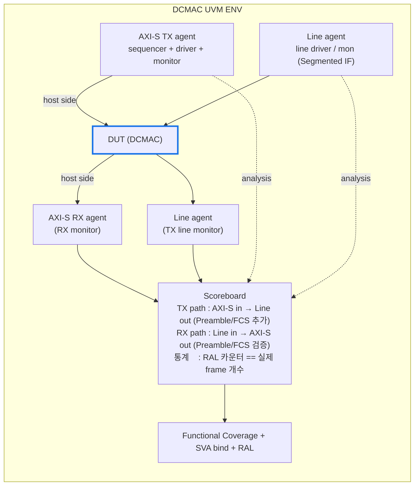
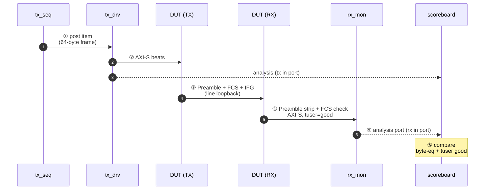
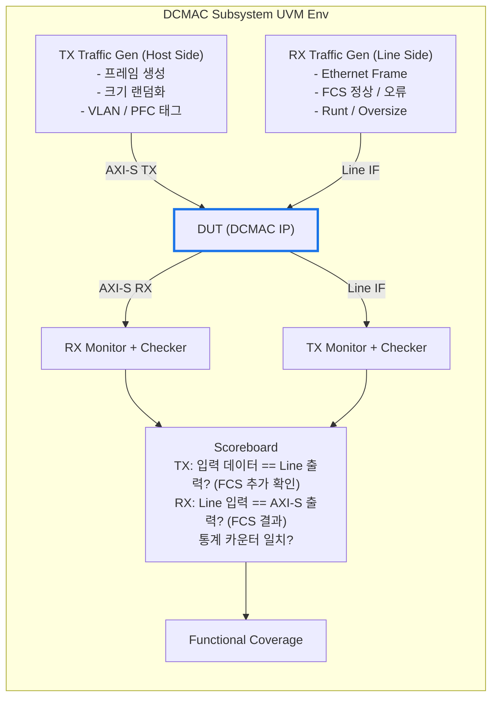

# Module 03 — DCMAC DV Methodology

<!-- DV-SKOOL-CH-CTX:start -->
<div class="chapter-context" data-cat="network">
  <a class="chapter-back" href="../">
    <span class="chapter-back-arrow">←</span>
    <span class="chapter-back-icon">🌐</span>
    <span class="chapter-back-text">Ethernet DCMAC</span>
  </a>
  <span class="chapter-divider">›</span>
  <span class="chapter-marker">Module 03</span>
</div>
<!-- DV-SKOOL-CH-CTX:end -->

<!-- DV-SKOOL-CH-TOC:start -->
<div class="page-toc">
  <span class="page-toc-label">목차</span>
  <a class="page-toc-link" href="#1-why-care-이-모듈이-왜-필요한가">1. Why care?</a>
  <a class="page-toc-link" href="#2-intuition-비유와-한-장-그림">2. Intuition</a>
  <a class="page-toc-link" href="#3-작은-예-host-한-byte-가-tx-driver-dut-rx-monitor-scoreboard-까지-가는-길">3. 작은 예 — 1 byte E2E</a>
  <a class="page-toc-link" href="#4-일반화-검증-4축-환경-구조-시퀀스-계층">4. 일반화 — 검증 4축</a>
  <a class="page-toc-link" href="#5-디테일-test-시나리오-ral-sva-coverage-cdc-디버그">5. 디테일</a>
  <a class="page-toc-link" href="#6-흔한-오해-와-dv-디버그-체크리스트">6. 흔한 오해 + 디버그</a>
  <a class="page-toc-link" href="#7-핵심-정리-key-takeaways">7. 핵심 정리</a>
</div>
<!-- DV-SKOOL-CH-TOC:end -->

!!! objective "학습 목표"
    이 모듈을 마치면:

    - **Design** DCMAC DV 환경 (UVM env + traffic gen + scoreboard + FEC injector) 을 설계할 수 있다.
    - **Apply** Frame integrity (FCS), AXI-S protocol, Pause/PFC flow control 시나리오를 매핑할 수 있다.
    - **Implement** RS-FEC error injection (within / beyond correction limit) 시나리오를 구현할 수 있다.
    - **Plan** Performance regression (line-rate throughput, IFG enforcement, latency tail) 을 계획할 수 있다.
    - **Decompose** 한 transaction 이 driver → DUT → monitor → scoreboard 를 통과하는 path 를 분해할 수 있다.

!!! info "사전 지식"
    - [Module 01-02](01_ethernet_fundamentals.md) — frame, MAC/PCS 분담, DCMAC 5 블록
    - [UVM](../../uvm/), [AXI-Stream](../../amba_protocols/03_axi_stream/)
    - 일반 UVM env (agent, scoreboard, virtual sequence) 어휘

---

## 1. Why care? — 이 모듈이 왜 필요한가

DCMAC 검증의 핵심 어려움은 두 가지가 **동시에** 일어난다는 점입니다 — (1) **line-rate throughput 유지** 와 (2) **byte-level 무결성 / 프로토콜 / 흐름제어 모두 검증**. 한 쪽만 보면 통과하지만 동시에 두면 corner case 가 silent 로 누적됩니다 (예: pause + line-rate 가 같이 일어날 때 IFG underrun).

또한 DCMAC 은 **TOE / IP / 다른 NIC subsystem 의 wire-side 끝단** 이라 — 여기서 통과시킨 frame 은 곧바로 wire 로 나갑니다. TB 가 발견하지 못한 bug 는 silicon 후 SerDes BER 통계로만 보이게 됩니다. 즉 DV 비용의 sweet spot 이 다른 IP 보다 훨씬 높습니다. 이 모듈이 그 sweet spot 의 시나리오 / scoreboard / SVA / coverage / RAL 설계의 청사진을 제공합니다.

---

## 2. Intuition — 비유와 한 장 그림

!!! tip "💡 한 줄 비유"
    **DCMAC 검증 환경** = **택배 물류센터 품질 감사**.<br>
    한쪽에서 쉼 없이 밀려오는 택배(frame)를 받아 분류(scoreboard)하고 봉인(FCS)을 확인하면서, 동시에 트럭 도착 간격(IFG)이 규정을 지키는지 SVA 가 감시한다. 옆에서는 RAL 이 관제실 컴퓨터(register) 와 자동으로 동기화하면서 "지금 몇 개 들어왔는지" 카운터를 합산. coverage 는 "어떤 종류의 택배 × 어떤 시간대 × 어떤 우선순위" 를 빠짐없이 점검 표로 만든다.

### 한 장 그림 — Env 구조 + 신호 흐름



### 왜 이 구조 — Design rationale

DCMAC 은 **양방향 + 프로토콜 + 통계 + 흐름제어 + reg** 가 모두 동시에 검증돼야 합니다.

- 양방향 → host/line 양쪽 agent 필요.
- 프로토콜 → AXI-S agent 가 byte-level + tuser 사이드밴드 모두 캡처.
- 통계 → RAL 이 reg 카운터를 mirror, scoreboard 가 실제 frame count 와 비교.
- 흐름제어 → virtual sequence 가 양 agent 를 시간 동기로 조율.
- Reg → AXI-Lite agent + RAL adapter.

이 모든 책임을 single agent 에 몰면 **agent 가 DUT 보다 복잡** 해집니다. 그래서 4 agent + scoreboard + RAL + SVA + coverage 의 **6 영역 분담** 이 굳어진 구조.

---

## 3. 작은 예 — Host 한 byte 가 TX driver → DUT → RX monitor → scoreboard 까지 가는 길

가장 단순한 시나리오. **smoke test**: TOE 모델이 single 64-byte frame 을 TX 에 넣고, line-loopback 으로 다시 RX 로 들어오게 해서 scoreboard 가 byte-level 동일성과 FCS good 을 확인. (line-loopback 은 Segmented IF 두 끝을 wire connect.)



| Step | 누가 | 무엇을 | 의미 |
|---|---|---|---|
| ① | tx_seq | `dcmac_frame_item` 1 개를 sequencer 로 post | DA/SA/Type/Payload 64B 랜덤 |
| ② | tx_drv | AXI-S 1 beat 로 driver | host 측 byte 흐름 |
| ③ | DUT TX | Preamble (8B) + FCS (4B) + IFG 추가 | MAC engine 의 frame builder |
| ④ | DUT RX | line loopback 으로 들어온 frame 의 Preamble strip + FCS 검증 | RX MAC pipeline |
| ⑤ | tx_mon, rx_mon | analysis port 로 scoreboard 에 sample 송출 | 양쪽 monitor 가 비동기 캡처 |
| ⑥ | scoreboard | TX 측 payload `==` RX 측 payload byte-eq + RX tuser.bad_fcs `==` 0 | E2E equality |

```sv
// scoreboard 의 비교 task (간단화)
task automatic dcmac_sb::compare(dcmac_frame_item tx, dcmac_frame_item rx);
  if (tx.payload != rx.payload)
    `uvm_error("E2E", $sformatf("payload mismatch: tx=%0d B, rx=%0d B", tx.payload.size(), rx.payload.size()))
  if (rx.tuser_bad_fcs)
    `uvm_error("E2E", "rx reported bad_fcs on a clean loopback")
endtask
```

!!! note "여기서 잡아야 할 두 가지"
    **(1) frame 1 개가 두 번 monitor 된다** — TX side 는 host 의 byte 를, RX side 는 line 을 돌아 host 로 다시 올라온 byte 를. scoreboard 가 두 분량이 byte-equal 임을 확인. 즉 **agent 한 쪽만 보면 절대 E2E 검증 불가**.<br>
    **(2) tuser 가 곧 메타데이터 채널** — payload 는 같아야 하지만, tuser.bad_fcs / vlan_tagged / poison 같은 사이드밴드 정보는 별도 비교. 같은 frame 의 두 표현을 모두 검증해야 protocol level 까지 covered.

---

## 4. 일반화 — 검증 4 축, 환경 구조, 시퀀스 계층

### 4.1 검증 4 축

| 축 | 의미 | 대표 시나리오 |
|---|---|---|
| **Frame integrity** | FCS / padding / size 의 byte-level 정확성 | min/max/jumbo, runt/oversize, bad FCS |
| **AXI-S protocol** | tvalid/tready, tlast, tkeep, tuser 의 표준 준수 | backpressure, single-beat, partial keep |
| **Flow control** | Pause / PFC 에 의한 TX 정지 / 재개 | pause mid-traffic, PFC priority subset |
| **Performance** | line-rate, IFG, latency tail, multi-channel parallelism | sustained line-rate, min frame burst |

이 4 축이 곧 sequence library, coverage group, SVA category 의 분류 기준.

### 4.2 환경 구조 — 4 agent + scoreboard + RAL + SVA + coverage



### 4.3 시퀀스 / 시나리오 계층

```
seq_lib/                                 vseq_lib/
  ├── dcmac_base_seq                       ├── dcmac_tx_only_vseq
  ├── dcmac_single_frame_seq               ├── dcmac_rx_only_vseq
  ├── dcmac_random_frame_seq               ├── dcmac_bidir_vseq
  ├── dcmac_burst_seq (line-rate)          ├── dcmac_e2e_vseq (TOE↔DCMAC)
  ├── dcmac_error_inject_seq               ├── dcmac_flow_ctrl_vseq
  ├── dcmac_pause_seq                      └── dcmac_stress_vseq
  ├── dcmac_vlan_seq
  └── dcmac_mixed_traffic_seq
```

---

## 5. 디테일 — Test 시나리오, RAL, SVA, Coverage, CDC, 디버그

### 5.1 핵심 테스트 시나리오

#### Positive

| 카테고리 | 시나리오 | 검증 포인트 |
|---------|---------|-----------|
| **프레임** | 최소 크기 (64B) | 패딩 정확, FCS 정확 |
| | 최대 크기 (1518B / 9022B Jumbo) | Segmentation 없이 단일 프레임 |
| | 랜덤 크기 | 모든 크기에서 정확 동작 |
| | VLAN 태그 포함 | VLAN 삽입/제거 정확 |
| **AXI-S** | Back-to-back 프레임 | IFG 준수, 연속 전송 정확 |
| | 백프레셔 (tready toggle) | 데이터 손실 없음 |
| | 단일 beat 프레임 | tlast + tkeep 정확 |
| **흐름 제어** | Pause Frame 수신 | TX 일시 중단 + 재개 |
| | PFC 특정 우선순위 | 해당 우선순위만 중단 |

#### Negative / 에러

| 카테고리 | 시나리오 | 검증 포인트 |
|---------|---------|-----------|
| **FCS** | Bad CRC 프레임 수신 | 폐기 + tuser bad 표시 + 카운터 증가 |
| **크기** | Runt 프레임 (<64B) | 폐기 + 카운터 증가 |
| | Oversize 프레임 (>MTU) | 설정에 따라 폐기 또는 통과 |
| **프로토콜** | 잘못된 Preamble | 프레임 무시 |
| | IFG 부족 | 정상 처리 또는 에러 플래그 |
| **AXI-S** | tlast 없는 프레임 | 타임아웃 또는 에러 처리 |

#### Stress / 성능

| 시나리오 | 측정 |
|---------|------|
| 라인 레이트 연속 전송 (100Gbps) | 드롭 없이 처리 |
| 최소 크기 연속 (최대 pps) | 최대 프레임 레이트 달성 |
| TX/RX 동시 라인 레이트 | Full-duplex 처리량 |
| Pause 후 재개 반복 | 재개 시 즉시 라인 레이트 복구 |

### 5.2 시퀀스 전략

#### Sequence Item 설계

```
class dcmac_frame_item extends uvm_sequence_item;
  // 프레임 필수 필드
  rand bit [47:0]  dst_mac;
  rand bit [47:0]  src_mac;
  rand bit [15:0]  ether_type;
  rand bit [7:0]   payload[];
  rand int unsigned frame_size;    // 64 ~ 9022

  // 프레임 옵션
  rand bit          has_vlan;
  rand bit [11:0]   vlan_id;
  rand bit [2:0]    vlan_pcp;
  rand bit          inject_fcs_err;  // 의도적 bad FCS

  // AXI-S 전송 제어
  rand int unsigned inter_frame_gap;  // IFG 사이클 수
  rand bit          insert_backpressure;

  // 기본 제약
  constraint c_size { frame_size inside {[64:9022]}; }
  constraint c_payload { payload.size() == frame_size - 18; } // Header(14) + FCS(4)
  constraint c_etype { ether_type >= 16'h0600; }             // EtherType, not Length
endclass
```

#### Virtual Sequence 설계 원칙

```
Virtual Sequence가 필요한 이유:
  - DCMAC에는 TX(Host Side) + RX(Line Side) + Reg(AXI-Lite) 3개 Agent가 있음
  - 여러 Agent를 조율하는 시나리오 (예: TX 전송 중 Pause 삽입)는
    단일 Sequence로 구현 불가 → Virtual Sequence로 오케스트레이션

  class dcmac_flow_ctrl_vseq extends dcmac_base_vseq;
    task body();
      fork
        // TX Agent: 연속 프레임 전송
        tx_seq.start(p_sequencer.tx_sqr);
        // Line Agent: 일정 시간 후 Pause Frame 주입
        begin
          #100us;
          pause_seq.start(p_sequencer.line_sqr);
        end
      join
    endtask
  endclass

  Scoreboard 검증:
  → Pause 수신 후 TX가 실제로 멈추는지 (전송 갭 확인)
  → Pause 해제 후 TX가 재개되는지
```

### 5.3 Constraint-Random 전략

#### 제약 조건 계층화

```
Layer 1: Sequence Item 기본 제약 (항상 적용)
  constraint c_valid_size { frame_size inside {[64:9022]}; }
  constraint c_valid_mac  { src_mac != 48'h0; }

Layer 2: 시나리오별 제약 (Sequence에서 override)
  // 에러 주입 시퀀스
  constraint c_error_mode {
    inject_fcs_err dist {0 := 80, 1 := 20};  // 20% 확률 bad FCS
    frame_size dist {[64:64] := 10, [65:1517] := 70, [1518:9022] := 20};
  }

  // 스트레스 시퀀스
  constraint c_stress {
    inter_frame_gap == 0;           // 최소 IFG → 라인 레이트
    frame_size inside {[64:128]};   // 짧은 프레임 → 최대 pps
  }

Layer 3: 테스트별 제약 (Test class에서 factory override 또는 config)
  // config_db로 제약 모드 전달
  uvm_config_db#(dcmac_frame_cfg)::set(this, "env.tx_agent*", "cfg", stress_cfg);
```

#### 분포 전략 (Distribution)

```
커버리지 홀에 따른 분포 조정:

초기 (탐색):
  frame_size dist {
    [64:64]     := 10,    // MIN
    [65:127]    := 20,    // SMALL
    [128:1023]  := 30,    // MEDIUM
    [1024:1517] := 20,    // LARGE
    [1518:1518] := 10,    // MAX
    [1519:9022] := 10     // JUMBO
  };

후기 (커버리지 홀 타겟팅):
  // Cross coverage (JUMBO × BROADCAST)가 비어있다면:
  constraint c_target_hole {
    frame_size inside {[1519:9022]};
    dst_mac == 48'hFFFF_FFFF_FFFF;
  }
```

### 5.4 RAL (Register Abstraction Layer) 전략

```
레지스터 검증 구조:

  +------------------+    AXI-Lite    +-------------------+
  | RAL Model        | ←── adapter ──→ | DCMAC Registers   |
  | (UVM Register)   |    (Frontdoor)  | (실제 HW)         |
  +------------------+                 +-------------------+
         |
    Backdoor (hdl_path)
         |
    RTL 시뮬레이션 내부 직접 접근

검증 항목:
  1. Reset Value Test
     - 모든 레지스터가 리셋 후 기본값과 일치
     - RAL: reg_model.reset("HARD"); → mirror check

  2. Read/Write Test
     - RW 필드: Write → Read back → 일치 확인
     - RO 필드: Write 시도 → 값 변경 없음 확인
     - WO 필드: Write → Read 시 0 반환 확인
     - W1C 필드: Write 1 → Clear 동작 확인

  3. Frontdoor vs Backdoor 일치
     - 동일 레지스터를 양쪽으로 읽어 값 일치 확인

  4. 통계 카운터 검증
     - 프레임 N개 전송 후 tx_frames 카운터 == N 확인
     - FCS 에러 M개 주입 후 rx_fcs_errors == M 확인
     - Read-on-Clear 동작: 읽기 후 카운터 0인지 확인

  5. Config 적용 시점 검증
     - MTU 변경 후 즉시/다음 프레임에서 적용되는지
     - TX Enable=0 시 진행 중인 프레임 완료 후 멈추는지

RAL 패키지 구조:
  dcmac_ral_pkg.sv
    ├── dcmac_reg_block.sv          // Top-level register block
    ├── dcmac_global_cfg_reg.sv     // 개별 레지스터 정의
    ├── dcmac_tx_cfg_reg.sv
    ├── dcmac_rx_cfg_reg.sv
    ├── dcmac_stats_reg.sv
    └── dcmac_axi_lite_adapter.sv   // AXI-Lite ↔ RAL Adapter
```

### 5.5 SVA / Assertion 전략

```
프로토콜 어설션 분류:

[A1] AXI-Stream Protocol Assertions
  // tvalid가 올라간 후 tready 전에 떨어지면 안 됨
  assert property (@(posedge clk) disable iff (!rst_n)
    tx_axis_tvalid && !tx_axis_tready |=> tx_axis_tvalid
  ) else `uvm_error("AXIS","tvalid dropped before tready")

  // tlast 후 tkeep이 유효해야 함
  assert property (@(posedge clk) disable iff (!rst_n)
    tx_axis_tvalid && tx_axis_tlast |-> (tx_axis_tkeep != 0)
  ) else `uvm_error("AXIS","tkeep zero on tlast beat")

  // tdata는 tvalid 동안 안정적이어야 함
  assert property (@(posedge clk) disable iff (!rst_n)
    tx_axis_tvalid && !tx_axis_tready |=>
      $stable(tx_axis_tdata) && $stable(tx_axis_tkeep)
  ) else `uvm_error("AXIS","tdata/tkeep changed while waiting")

[A2] Frame Integrity Assertions
  // 프레임 최소 크기
  assert property (@(posedge clk)
    frame_complete |-> (frame_byte_count >= 64)
  ) else `uvm_error("FRAME","Frame smaller than 64 bytes")

  // IFG 최소 간격
  assert property (@(posedge clk)
    frame_end |-> ##[12:$] next_frame_start
  ) else `uvm_error("IFG","less than 12 bytes")

[A3] Flow Control Assertions
  // Pause 수신 후 TX 멈춤
  assert property (@(posedge clk)
    pause_received && (pause_quanta > 0) |=>
      !tx_frame_start [*1:$] ##1 (pause_timer == 0)
  ) else `uvm_error("PAUSE","TX did not stop after Pause")

[A4] Configuration Assertions
  // TX Enable=0이면 새 프레임 시작하지 않음
  assert property (@(posedge clk)
    !tx_enable |-> !tx_frame_start
  ) else `uvm_error("CFG","TX started frame while disabled")

Bind Module 구조:
  // RTL을 수정하지 않고 외부에서 어설션 바인드
  module dcmac_sva_bind;
    bind dcmac_tx_engine dcmac_tx_sva u_tx_sva (.*);
    bind dcmac_rx_engine dcmac_rx_sva u_rx_sva (.*);
    bind dcmac_axi_stream dcmac_axis_sva u_axis_sva (.*);
  endmodule
```

### 5.6 Coverage Model

```
[CG1] Frame Coverage
  - cp_frame_size: {MIN(64), SMALL(<128), MEDIUM, LARGE(>1024), MAX(1518), JUMBO(9022)}
  - cp_frame_type: {UNICAST, MULTICAST, BROADCAST}
  - cp_vlan: {NO_VLAN, SINGLE_VLAN, DOUBLE_VLAN(QinQ)}
  - cross: frame_size × frame_type
  - cross: frame_size × vlan  // 모든 크기에서 VLAN 조합

[CG2] FCS/Error Coverage
  - cp_fcs_result: {GOOD, BAD}
  - cp_error_type: {NONE, CRC_ERR, RUNT, OVERSIZE, BAD_PREAMBLE}
  - cp_direction: {TX, RX}
  - cross: error_type × direction  // 모든 에러가 양방향에서 검증

[CG3] AXI-S Protocol Coverage
  - cp_backpressure: {NONE, OCCASIONAL, HEAVY, EXTREME}
  - cp_burst_length: {SINGLE_BEAT, SHORT, LONG, MAX}
  - cp_tkeep_pattern: {ALL_VALID, PARTIAL_LAST}
  - cp_tuser_bits: {NORMAL, POISON, BAD_FCS, VLAN_TAGGED}
  - cross: backpressure × burst_length

[CG4] Flow Control Coverage
  - cp_pause_type: {NONE, PAUSE, PFC}
  - cp_pfc_priority: {0, 1, ..., 7, MULTI}
  - cp_pause_duration: {SHORT, MEDIUM, LONG, INFINITE}
  - cp_pause_timing: {IDLE, MID_FRAME, BACK_TO_BACK}  // Pause 시점
  - cross: pause_type × pfc_priority (PFC일 때만)

[CG5] Statistics Counter Coverage
  - cp_counter_type: {FRAMES, BYTES, ERRORS, PAUSE}
  - cp_counter_overflow: {NORMAL, NEAR_MAX, OVERFLOW}
  - cp_counter_access: {SINGLE_READ, CONSECUTIVE_READ, READ_DURING_TRAFFIC}

[CG6] Configuration Coverage (추가)
  - cp_speed_mode: {100G, 200G, 400G}
  - cp_mtu_setting: {STANDARD(1518), JUMBO(9022), CUSTOM}
  - cp_tx_enable: {ENABLED, DISABLED, TOGGLE_MID_TRAFFIC}
  - cp_promiscuous: {ON, OFF}
  - cross: speed_mode × frame_size

[CG7] Reset / Init Coverage (추가)
  - cp_reset_type: {HARD_RESET, SOFT_RESET}
  - cp_reset_timing: {IDLE, MID_FRAME, MID_PAUSE}
  - cp_post_reset: {IMMEDIATE_TRAFFIC, DELAYED_TRAFFIC}
```

#### 커버리지 클로저 전략

```
Phase 1: 기본 커버리지 (Constrained-Random)
  - 랜덤 시퀀스 1000+ 프레임 × 100 시드
  - 목표: CG1~CG5의 single coverpoint 90%+

Phase 2: Cross 커버리지 타겟팅
  - Uncovered cross bin 식별
  - Directed constraint로 hole 타겟팅
  - 예: JUMBO × BROADCAST × HEAVY_BP가 비어있으면 전용 시퀀스 작성

Phase 3: Corner Case 보완
  - 에러 + Pause 동시 발생
  - Reset 직후 즉시 트래픽
  - 통계 카운터 오버플로우 경계값

Sign-off 기준: 전체 functional coverage 95%+, cross 90%+
```

### 5.7 E2E 데이터 무결성 검증

```
TX E2E:
  Host 데이터 (AXI-S TX) → DCMAC → Line Side 출력
  Scoreboard: AXI-S 입력 데이터 == Line 출력 Payload?
              FCS가 올바르게 추가되었는가?

RX E2E:
  Line Side 입력 (Ethernet Frame) → DCMAC → AXI-S RX 출력
  Scoreboard: Line 입력 Payload == AXI-S 출력 데이터?
              FCS 검증 결과가 tuser에 정확히 반영?

TOE ↔ DCMAC E2E (서브시스템):
  Host → TOE → DCMAC → Line → DCMAC → TOE → Host
  Scoreboard: Host 전송 데이터 == Host 수신 데이터?
              TCP/Ethernet 프로토콜 모두 정확?
```

### 5.8 리셋 / 초기화 검증

```
리셋 종류:
  1. Hard Reset (글로벌 리셋)
     - 전체 DCMAC 블록 리셋
     - 모든 레지스터 → 기본값
     - 진행 중인 프레임 폐기
     - FSM → IDLE 상태

  2. Soft Reset (포트별 리셋)
     - 특정 포트만 리셋
     - 다른 포트는 영향 없음
     - 해당 포트의 카운터만 클리어

검증 시나리오:
  +---------------------------------------------------+
  | 시나리오             | 검증 포인트               |
  |---------------------+---------------------------|
  | IDLE 시 리셋        | 레지스터 기본값 복원      |
  | TX 프레임 전송 중 리셋| 프레임 중단, 잔여 데이터 없음|
  | RX 프레임 수신 중 리셋| 수신 중단, partial 프레임 폐기|
  | Pause 활성 중 리셋   | Pause 상태 해제          |
  | 리셋 직후 트래픽     | 첫 프레임 정상 처리      |
  | 리셋 반복 (stress)   | N회 반복 후 정상 동작    |
  +---------------------------------------------------+

초기화 시퀀스:
  1. Hard Reset Assert (최소 N 클럭)
  2. Hard Reset Deassert
  3. 레지스터 기본값 확인 (RAL mirror)
  4. MAC 주소, MTU, 속도 모드 설정
  5. TX/RX Enable
  6. Link Status 확인 (PCS Lock)
  7. 트래픽 시작
```

### 5.9 CDC (Clock Domain Crossing) 고려사항

```
DCMAC의 클럭 도메인:

  +------------+    +------------+    +-------------+
  | AXI-S CLK  |    | Core CLK   |    | SerDes CLK  |
  | (User IF)  |    | (MAC 내부) |    | (Line Side) |
  +------------+    +------------+    +-------------+
       |                  |                  |
  tx_axis_aclk       core_clk          gt_txusrclk2
  rx_axis_aclk                         gt_rxusrclk2

  +------------+
  | AXI-L CLK  |
  | (Register) |
  +------------+
       |
  s_axi_aclk

CDC 경계:
  1. AXI-S CLK ↔ Core CLK: 비동기 FIFO (프레임 데이터)
  2. Core CLK ↔ SerDes CLK: 비동기 FIFO (인코딩된 데이터)
  3. AXI-Lite CLK ↔ Core CLK: CDC 동기화 (레지스터 접근)

DV에서의 CDC 검증 접근:
  - 클럭 비율 변경 시나리오 (정수비 / 비정수비)
  - FIFO full/empty 경계 조건
  - 레지스터 읽기 중 값 변경 시 일관성 (특히 64bit 카운터의 상/하위 32bit)
  - CDC 관련 경고: 시뮬레이터의 CDC check 옵션 활용 (VCS: -Xcheck=cdc)
  - 실무: CDC formal verification은 별도 도구 (Questa CDC, Spyglass CDC)로 수행
    → 시뮬레이션에서는 비동기 FIFO의 기능적 정확성 위주로 검증
```

### 5.10 DCMAC 디버그 방법론

```
디버그 레벨 (DCMAC 특화):

  L1: 기본 로그 분석
    - UVM_ERROR 메시지에서 프레임 번호, 방향(TX/RX) 확인
    - Scoreboard 미스매치: expected vs actual 바이트 비교
    - "첫 번째 에러"를 찾는 것이 핵심 (cascading error 주의)

  L2: 프로토콜 레벨 분석
    - AXI-S 트랜잭션 로그: tdata, tkeep, tuser 값 확인
    - 프레임 경계(tlast) 위치가 맞는지
    - FCS 수동 계산과 비교

  L3: 신호 레벨 분석 (파형)
    - 핵심 관찰 신호:
      tx_axis_tvalid, tx_axis_tready (핸드셰이크 정상?)
      rx_axis_tuser (FCS 결과 정확?)
      pause_req, pause_val (흐름 제어 동작?)
      stat counters (카운터 증가 시점?)
    - IFG 타이밍 측정
    - Pause 수신 → TX 중단 사이의 레이턴시

  L4: 내부 상태 분석
    - MAC Engine FSM 상태 추적
    - 내부 FIFO 레벨 모니터링
    - PCS lock 상태, alignment marker 감지

흔한 실패 패턴과 원인:

  | 증상 | 가능한 원인 |
  |------|-----------|
  | Scoreboard mismatch (데이터) | tkeep 해석 오류, 바이트 순서(endian) |
  | FCS always bad | CRC 계산 범위 오류, 바이트 패딩 누락 |
  | TX 멈춤 (hang) | tready가 영구 low, 데드락 |
  | 프레임 누락 | FIFO 오버플로우, 백프레셔 미처리 |
  | 카운터 불일치 | Read-on-Clear 타이밍, CDC 관련 |
  | Pause 후 미재개 | Pause timer 리셋 로직 오류 |
```

### 5.11 이력서 연결 — DCMAC 서브시스템 기여

```
Resume: "Verified DCMAC-integrated subsystems by architecting and
         implementing end-to-end UVM environments from scratch."

기여 포인트:
  1. UVM 환경 From Scratch 구축
     - DCMAC AXI-S Agent (TX/RX)
     - Line Side Agent (Ethernet Frame 생성/검증)
     - Scoreboard (E2E 데이터 비교)
     - Coverage Model 설계

  2. TOE ↔ DCMAC 연동 검증
     - AXI-S 핸드셰이크 정확성
     - FCS 에러 전파 경로
     - 백프레셔 동작

  3. E2E 데이터 패스 검증
     - Host → TOE → DCMAC → Network (전체 경로)
     - 프레임 무결성, 프로토콜 준수, 성능
```

### 5.12 Q&A 보강

**Q: DCMAC 서브시스템 검증 환경을 어떻게 설계했나?**
> "UVM 환경을 from scratch로 구축했다. 핵심 컴포넌트: (1) AXI-S Agent — TX/RX 양방향, 랜덤 크기/타입 프레임 생성 + 백프레셔 모델링. (2) Line Side Agent — Ethernet Frame 레벨 트래픽 생성 + FCS 에러 주입. (3) Scoreboard — TX/RX 양방향 E2E 데이터 비교 + FCS 결과 검증 + 통계 카운터 일치 확인. Coverage는 프레임 크기/타입, FCS 결과, AXI-S 프로토콜, 흐름 제어 상태를 교차 커버했다."

**Q: E2E 검증에서 가장 중요한 포인트는?**
> "두 가지: (1) 데이터 무결성 — Host에서 보낸 바이트가 Network 끝에서 정확히 나오는지, 한 비트도 변경 없이. DCMAC이 추가하는 Preamble/FCS/IFG를 제외한 Payload가 정확히 일치해야 한다. (2) 에러 전파 — Line Side에서 FCS 에러가 발생하면 DCMAC이 tuser로 정확히 표시하고, TOE가 이를 감지하여 패킷을 폐기하는 전체 경로가 올바른지 검증."

**Q: DCMAC 검증에서 가장 어려웠던 시나리오는?**
> "Pause Frame과 라인 레이트 트래픽이 동시에 발생하는 시나리오였다. TX가 프레임 전송 중간에 Pause를 받으면 현재 프레임은 완료해야 하고, 다음 프레임부터 멈춰야 한다. 그런데 Pause quanta가 짧으면 멈추기도 전에 해제되는 경우가 있고, PFC에서는 특정 우선순위만 멈추면서 나머지는 계속 전송해야 한다. 이걸 검증하려면 Virtual Sequence로 TX와 Line Side Agent를 정밀하게 조율하고, Scoreboard에서 Pause 기간 중 전송 갭을 시간 기반으로 확인해야 했다."

**Q: Constraint-random 전략은 어떻게 설계했나?**
> "3-layer 접근이다. Layer 1은 Sequence Item의 기본 제약(유효 크기, 유효 MAC), Layer 2는 시나리오별 제약(에러 주입 확률, 크기 분포), Layer 3는 테스트별 제약(config_db로 주입). 초기에는 균등 분포로 탐색하고, 커버리지 결과를 보면서 비어있는 cross bin을 타겟팅하는 directed constraint를 추가했다. 예를 들어 JUMBO × BROADCAST cross가 안 채워지면 해당 조합만 생성하는 전용 시퀀스를 만들었다."

**Q: 레지스터 검증은 어떻게 접근했나?**
> "UVM RAL을 구축하고 세 가지를 검증했다. (1) Reset Value — 모든 레지스터의 리셋 후 값이 스펙과 일치하는지 RAL mirror로 자동 확인. (2) Access Policy — RW/RO/W1C 등 각 필드의 접근 정책이 올바른지. (3) Functional — 통계 카운터가 실제 트래픽과 일치하는지, Config 변경이 올바른 시점에 적용되는지. 특히 통계 카운터의 Read-on-Clear 특성 때문에 읽기 순서/타이밍 검증이 까다로웠다."

---

## 6. 흔한 오해 와 DV 디버그 체크리스트

### 흔한 오해

!!! danger "❓ 오해 1 — 'VLAN tag 를 붙여도 payload 는 그대로니까 throughput 에 영향 없다'"
    **실제**: 4-byte tag 추가로 frame 최소 길이 / MTU 기준 / IFG 포함 effective bandwidth 가 모두 변합니다. line-rate 시나리오에서 같은 payload 라도 tagged frame 의 frame-rate 가 다름.<br>
    **왜 헷갈리는가**: payload 가 불변이라 "데이터는 그대로" 라는 직관.

!!! danger "❓ 오해 2 — 'Coverage 100% 면 검증 끝이다'"
    **실제**: Functional coverage 는 sequence library 가 도달할 수 있는 시나리오의 dimension 만 봅니다. 정상 trace 의 timing race / cross-clock / multi-channel skew 같은 corner 는 별도 SVA + assertion-based stress test 가 채움. coverage 100% 는 entry condition 일 뿐.<br>
    **왜 헷갈리는가**: coverage report 가 깔끔한 수치라서.

!!! danger "❓ 오해 3 — '통계 카운터는 마지막에 한 번만 읽으면 된다'"
    **실제**: Read-on-Clear 특성 때문에 monitor + scoreboard 가 같은 카운터를 다른 시점에 두 번 읽으면 두 번째 값은 0. atomic snapshot 으로 한 번에 캡처해야 함.<br>
    **왜 헷갈리는가**: software driver 관점에서는 read 가 idempotent 라는 일반 직관.

!!! danger "❓ 오해 4 — 'Pause frame 은 단순히 tx_enable 을 0 으로 만들면 된다'"
    **실제**: 진행 중인 frame 은 완료해야 하고 (mid-frame stop 금지), pause_time tick 을 정확히 (512 bit time 단위) 세야 하며, PFC 인 경우 priority subset 만 멈춰야 함. tx_enable 한 비트로는 표현 안 됨.<br>
    **왜 헷갈리는가**: tx_enable 이 제일 단순한 hook 이라.

!!! danger "❓ 오해 5 — 'Scoreboard 의 byte equality 만 맞으면 정상'"
    **실제**: tuser sideband (bad_fcs, vlan_tagged, port_id, timestamp) 와 통계 카운터 / pause state 가 모두 같이 일치해야 정상. byte 만 같고 tuser 불일치는 흔한 silent fail.<br>
    **왜 헷갈리는가**: payload 가 user-visible data 라서 거기에만 집중하기 쉬움.

### DV 디버그 체크리스트 (이 모듈 내용으로 마주칠 첫 실패들)

| 증상 | 1차 의심 | 어디 보나 |
|---|---|---|
| Scoreboard mismatch (data) | tkeep 해석 오류, byte order (endian) | TX driver 의 byte packing + DUT 의 little/big endian |
| FCS always bad | CRC 계산 범위 오류 또는 padding 누락 | TX TB 의 CRC 입력 = DA..Payload 인지, runt 의 padding 처리 |
| TX hang (tready 영구 low) | TX MAC 내부 backpressure | flow control state, tx FIFO level, pause active vector |
| Frame 누락 | RX FIFO overflow / backpressure 미처리 | rx_axis_tready toggle 패턴, FIFO almost-full 신호 |
| Counter 불일치 | Read-on-Clear timing or CDC | RAL atomic snapshot, monitor / sb 가 reg 중복 read 안 했나 |
| Pause 후 미재개 | pause_time tick 또는 timer reset 로직 | pause_timer state + tx_enable_per_priority |
| Coverage hole 안 메워짐 | constraint 가 해당 영역을 배제 | constraint distribution + directed seq 추가 |
| RAL frontdoor/backdoor mismatch | hdl_path 오설정 또는 reg width 불일치 | RAL 모델의 hdl_path + reg width annotation |

---

## 7. 핵심 정리 (Key Takeaways)

- **검증 4 축**: Frame integrity (FCS) / AXI-S protocol / Flow control (Pause, PFC) / Performance.
- **6 영역 분담**: 4 agent (TX-host, RX-host, TX-line, RX-line) + scoreboard + RAL + SVA + coverage. 책임을 한 곳에 몰지 말 것.
- **E2E 의 의미** = host AXI-S in 의 byte sequence 와 line out (또는 line loopback 후 host AXI-S out) 의 byte sequence + tuser sideband 가 byte-level 동일.
- **3-layer constraint**: Item 기본 / Sequence 시나리오 / Test factory override. coverage hole 은 directed constraint 로 타겟.
- **흐름제어 + 라인레이트는 동시에 봐야 한다** — 둘을 분리해서 검증하면 silent corner 발생. virtual sequence 가 시간 동기로 두 agent 조율.

!!! warning "실무 주의점 — Statistics Counter Clear-on-Read 레이스 컨디션"
    **현상**: 회귀 테스트에서 통계 카운터 (rx_frame_count, rx_error_count 등) 값이 읽을 때마다 달라지거나 0 으로 리셋된 것처럼 보임.<br>
    **원인**: DCMAC 통계 레지스터는 Read-on-Clear 방식이 많다. Scoreboard 와 Coverage 수집 루틴이 동일 카운터를 서로 다른 timestep 에서 각각 읽으면 첫 번째 read 에서 카운터가 클리어돼 두 번째 read 가 0.<br>
    **점검 포인트**: RAL task 내에서 통계 read 를 single atomic sequence 로 묶고, scoreboard / checker 가 동일 reg 를 중복 읽지 않도록 구현. `stat_snapshot` 방식으로 전체 카운터를 한 번에 latch 한 뒤 비교하는 패턴 채택.

---

## 다음 모듈

→ [Module 04 — Quick Reference Card](04_quick_reference_card.md): 지금까지 3 모듈을 한 페이지로 압축한 cheat sheet — frame, AXI-S tuser, RS-FEC, 면접 골든 룰, MangoBoost 데이터 패스 한 장.

[퀴즈 풀어보기 →](quiz/03_dcmac_dv_methodology_quiz.md)

<div class="chapter-nav">
  <a class="nav-prev" href="../02_dcmac_architecture/">
    <div class="nav-label">◀ 이전</div>
    <div class="nav-title">DCMAC 아키텍처</div>
  </a>
  <a class="nav-next" href="../04_quick_reference_card/">
    <div class="nav-label">다음 ▶</div>
    <div class="nav-title">Ethernet & DCMAC — Quick Reference Card</div>
  </a>
</div>


--8<-- "abbreviations.md"
