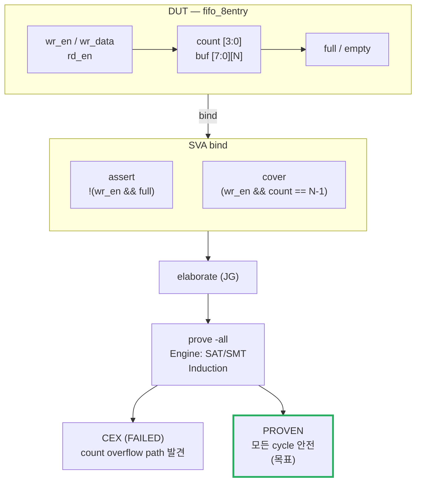
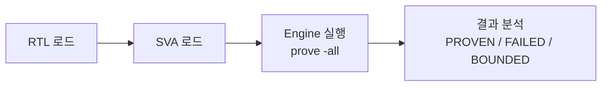
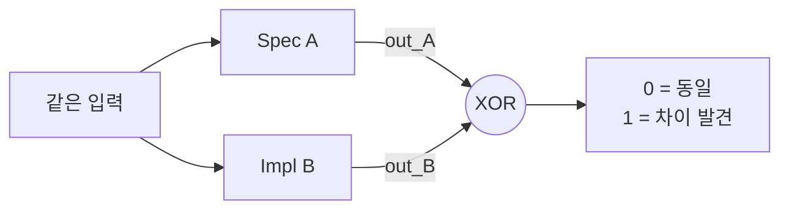
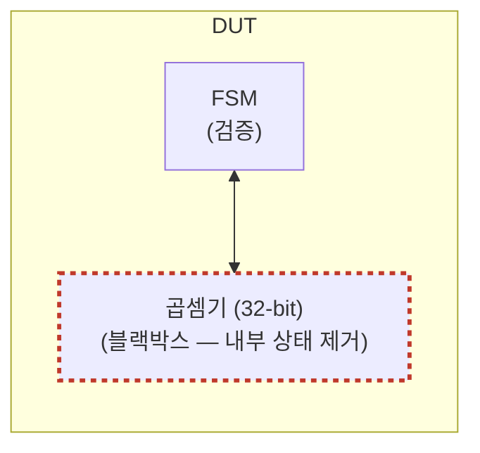
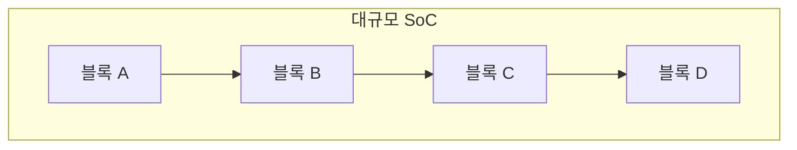

# Module 01 — Formal Verification 기본 개념

<!-- DV-SKOOL-CH-CTX:start -->
<div class="chapter-context" data-cat="core">
  <a class="chapter-back" href="../">
    <span class="chapter-back-arrow">←</span>
    <span class="chapter-back-icon">✅</span>
    <span class="chapter-back-text">Formal Verification</span>
  </a>
  <span class="chapter-divider">›</span>
  <span class="chapter-marker">Module 01</span>
</div>
<!-- DV-SKOOL-CH-CTX:end -->

<!-- DV-SKOOL-CH-TOC:start -->
<div class="page-toc">
  <span class="page-toc-label">목차</span>
  <a class="page-toc-link" href="#1-why-care-이-모듈이-왜-필요한가">1. Why care?</a>
  <a class="page-toc-link" href="#2-intuition-비유와-한-장-그림">2. Intuition</a>
  <a class="page-toc-link" href="#3-작은-예-fifo-overflow-property-한-개의-life-cycle">3. 작은 예 — FIFO overflow property</a>
  <a class="page-toc-link" href="#4-일반화-formal-의-3-결과-와-induction">4. 일반화 — 3 결과 + Induction</a>
  <a class="page-toc-link" href="#5-디테일-engine-기법-state-explosion">5. 디테일 — Engine, 기법, State Explosion</a>
  <a class="page-toc-link" href="#6-흔한-오해-와-dv-디버그-체크리스트">6. 흔한 오해 + 디버그</a>
  <a class="page-toc-link" href="#7-핵심-정리-key-takeaways">7. 핵심 정리</a>
</div>
<!-- DV-SKOOL-CH-TOC:end -->

!!! objective "학습 목표"
    이 모듈을 마치면:

    - **Distinguish** Simulation 과 Formal 의 본질적 차이 (샘플링 vs 증명) 를 설명할 수 있다.
    - **Interpret** Formal 의 3가지 결과 (PROVEN / BOUNDED / CEX) 의 의미와 각 결과를 받았을 때의 다음 행동을 결정할 수 있다.
    - **Identify** Formal 이 강력한 영역 (corner case, control logic, protocol) 과 약한 영역 (data path, large state space) 을 구분할 수 있다.
    - **Explain** Induction (Base + Step) 의 동작 원리와 BOUNDED→PROVEN 전환 조건을 설명할 수 있다.
    - **Apply** State Explosion 대응 기법 (Blackbox / Cut Point / Abstraction / Symmetry) 을 시나리오에 매핑할 수 있다.

!!! info "사전 지식"
    - SystemVerilog 기본 (module, interface, always_ff)
    - 시뮬레이션 기반 검증 경험 (UVM 또는 directed test)
    - 명제 논리, 상태 머신 기본

---

## 1. Why care? — 이 모듈이 왜 필요한가

### 1.1 시나리오 — _수십억 시나리오_ 를 _초_ 안에

당신은 AXI bridge IP 의 _deadlock 부재_ 를 검증해야 합니다.

**Simulation 접근**:
- 100 시나리오 작성, 각각 100K cycle 시뮬.
- 1 일 후: 95% 시나리오 통과. 그런데 _남은 5%_? 그리고 _아직 안 본_ corner case?
- 일주일 후: 1000 시나리오 통과. 신뢰도 ~99%, 단 _수학적 보장_ 없음.

**Formal 접근**:
- AXI handshake 의 _deadlock-free property_ 한 줄 작성.
- JasperGold 가 모든 가능한 입력 sequence 를 _수학적으로_ 탐색.
- 30 분 후: **PROVEN** — _어떤 입력 시퀀스_ 에서도 deadlock 없음 _수학 증명_.

**Trade-off**:
| | Simulation | Formal |
|---|-----------|--------|
| 검증 범위 | _직접 본_ 시나리오 | _모든_ 시나리오 (수학) |
| 시간 | 일 ~ 주 | 시간 ~ 일 |
| 디자인 크기 | 임의 | _state explosion_ 한계 |
| 결과 신뢰도 | 통계적 | _수학적_ |

이후 모든 Formal 모듈은 한 가정에서 출발합니다 — **"property 한 개를 증명하면 모든 입력/모든 cycle 에서 violation 이 없음을 수학적으로 보장한다"**. SVA 가 왜 implication 중심으로 쓰이는지, JasperGold 가 왜 Cover/Assume 을 강제하는지, BOUNDED 가 왜 PROVEN 이 아닌지 — 전부 이 한 가정의 파생입니다.

이 모듈을 건너뛰면 이후 모든 Formal 결정이 "도구 사용법" 으로만 보입니다. 반대로 이 가정을 정확히 잡으면 PROVEN/BOUNDED/CEX 어떤 결과를 받아도 **"엔진이 무엇을 보지 못했는가"** 가 보입니다 — 그게 Formal 엔지니어의 핵심 역량입니다.

!!! question "🤔 잠깐 — Formal 이 _모든 IP_ 에 안 쓰이는 이유?"
    Formal 이 _수학적 증명_ 이면 _simulation 대체_ 가능하지 않나? 왜 둘 다 사용?

    ??? success "정답"
        **State explosion**.

        Formal 의 _수학적 증명_ 은 _design state space_ 가 _작을 때_ 만 가능. 큰 IP (예: CPU pipeline) 는 state 가 _2^1000_ 이상 → 도구가 _수렴 못함_ (BOUNDED 까지만 = N cycle 만 증명).

        규칙:
        - **작은 + critical**: arbiter, FIFO, AXI bridge → Formal.
        - **큰 + complex**: CPU pipeline, GPU → Simulation + UVM.
        - **Hybrid**: 큰 IP 의 _작은 sub-module_ 만 Formal, _전체_ 는 Simulation.

        Formal 은 _silver bullet 아님_ — _좁은 영역_ 의 _깊은 보장_.

---

## 2. Intuition — 비유와 한 장 그림

!!! tip "💡 한 줄 비유"
    **Simulation** = 보안 점검원이 _샘플 입장객_ 의 가방만 열어보는 검사. 샘플에 폭탄이 없으면 통과로 처리.<br>
    **Formal** = 출입구 자체를 _수학적으로 봉쇄_ — "어떤 가방이든 폭탄을 가지고 들어올 수 없는 구조" 임을 증명. 가방을 열어보지도 않고 결론.

### 한 장 그림 — 입력 공간 커버리지

```
            Simulation (sample-based)              Formal (exhaustive proof)
            ─────────────────────────              ──────────────────────────
   입력 공간 ████████████████████████      입력 공간 ████████████████████████
   탐색했음  ▓▓▓░░░▓░░▓▓░░░▓░░░░▓▓░       탐색했음  ████████████████████████
            ↑                              ↑
            seed 가 안 닿은 빈칸에 버그가    어느 입력에서도 위반이 없음을
            숨을 수 있음                     수학적으로 봉쇄
   결과     "이 100 시드에서 PASS"           결과     "PROVEN: 무한 cycle 안전"
                                                    (또는) "BOUNDED N: N cycle 까지"
                                                    (또는) "CEX: 이 시퀀스에서 깨짐"
```

세 개의 결과 (PROVEN / BOUNDED / CEX) 가 후속 모든 모듈의 어휘입니다.

### 왜 이렇게 설계됐는가 — Design rationale

100 만 시드를 돌려도 **2^32 데이터 입력 공간** 의 0.0001% 도 못 채웁니다. 즉 시뮬레이션이 채울 수 있는 corner 와 못 채우는 corner 가 처음부터 분리됩니다. Formal 의 본질은 **"증명을 만들 수 있는 size 의 logic 만 골라서 100% 보장"** — 큰 datapath 는 시뮬에 맡기고, 작은 control / protocol / arbiter / FSM 만 Formal 로 봉쇄하는 분업이 결정됩니다. 이 분업이 곧 §5 의 적합/부적합 영역 표, §7 의 sign-off 기준, 그리고 후속 모듈의 SVA 패턴을 결정합니다.

---

## 3. 작은 예 — FIFO overflow property 한 개의 life cycle

가장 단순한 시나리오. **8-entry FIFO** 의 `wr_en && full` (overflow attempt) property 한 개를 SVA 로 작성 → bind → JasperGold 에 로드 → PROVEN 까지 전체 사이클을 따라가 봅시다.



| Step | 누가 | 무엇을 | 왜 |
|---|---|---|---|
| ① | DV 엔지니어 | spec 읽기: "FIFO 가 full 일 때 wr_en 들어오면 안 됨" | natural-language requirement → property 후보 |
| ② | DV 엔지니어 | SVA 작성: `assert property (@(posedge clk) disable iff (rst) !(wr_en && full));` | safety property — 어떤 cycle 에도 위반 없어야 함 |
| ③ | DV 엔지니어 | 짝 cover: `cover property (wr_en && (count == N-1));` | "FIFO 가 거의 full 일 때 wr_en 도달 가능" 도달성 확인 |
| ④ | DV 엔지니어 | bind: `bind fifo_8entry fifo_sva u_sva (.*);` | RTL 비침습 연결 |
| ⑤ | JG | `analyze -sv ...` `elaborate -top fifo_8entry` | RTL+SVA 를 internal model 로 변환 |
| ⑥ | JG engine | clock/reset 설정 후 `prove -all` | SAT/SMT 로 명제 풀이 시작 |
| ⑦ | JG engine | Base case (cycle 0): reset 직후 `count==0, full==0` → assert 만족 ✓ | Induction Base 통과 |
| ⑧ | JG engine | Inductive step: 임의 cycle N 에서 `!(wr_en && full)` 가정 → cycle N+1 도 만족? | RTL 의 `count` 증분 로직이 `count==N` 일 때 `wr_en` 을 차단함을 SAT 가 검증 |
| ⑨ | JG | 결과: **PROVEN** (만약 step 실패 시 BOUNDED, 위반 입력 발견 시 CEX) | 무한 cycle 보장 |
| ⑩ | DV 엔지니어 | cover 결과: "trace 1 covered" → 의미 있는 증명 확인 | Vacuous Pass 방지 |

```systemverilog
// Step ② ~ ③ 의 실제 SVA. 이 한 property + 한 cover 가 ⑤~⑩ 을 트리거.
module fifo_sva #(parameter N = 8)
  (input logic clk, rst, wr_en, rd_en,
   input logic [3:0] count,
   input logic full, empty);

  // Safety: overflow 시도 금지
  ap_no_overflow: assert property (
    @(posedge clk) disable iff (rst)
    !(wr_en && full)
  );

  // Cover: full 직전에 wr_en 이 실제 도달 가능한가
  cp_near_full_write: cover property (
    @(posedge clk) disable iff (rst)
    wr_en && (count == N-1)
  );
endmodule

bind fifo_8entry fifo_sva #(.N(8)) u_sva (.*);
```

!!! note "여기서 잡아야 할 두 가지"
    **(1) property 한 개의 운명은 PROVEN / BOUNDED / CEX 셋 중 하나** — 시뮬의 PASS/FAIL 이분법과 다른 3-trichotomy. 후속 모든 디버그/sign-off 가 이 셋의 분류로 진행됩니다.<br>
    **(2) cover 가 짝으로 따라간다** — "trace covered" 라는 출력이 나와야 PROVEN 이 의미가 있음. 이 짝 규칙은 Module 02 의 Vacuous Pass 와 직결됩니다.

---

## 4. 일반화 — Formal 의 3 결과 와 Induction

### 4.1 Simulation vs Formal — 한 장 비교

```
Simulation:
  특정 테스트 시나리오 → DUT 실행 → 결과 확인
  커버리지 100% 여도 "모든 상태" 를 검사한 것이 아님

  입력 공간: ████████████████████████
  시뮬레이션: ▓▓▓░░░▓░░▓▓░░░▓░░░░▓▓░  (샘플링)
  → 빈 곳에 버그가 숨어 있을 수 있음

Formal:
  속성을 정의 → 수학적으로 모든 상태에서 검증
  반례가 없으면 PROVEN (증명됨)

  입력 공간: ████████████████████████
  Formal:    ████████████████████████  (전수 검사)
  → 증명되면 어떤 입력에서도 속성이 성립
```

| 항목 | Simulation | Formal |
|------|-----------|--------|
| 검증 범위 | 실행된 시나리오만 | **모든** 가능한 입력/상태 |
| 결과 | Pass/Fail (이 시나리오에서) | **PROVEN** / FAILED / BOUNDED |
| 버그 찾기 | 시나리오가 버그 경로를 지나야 | 자동으로 반례 (Counterexample) 생성 |
| 확장성 | 큰 설계 가능 | 상태 폭발 (State Explosion) 한계 |
| 적합 대상 | 전체 SoC, 대규모 설계 | 제어 로직, 프로토콜, 소규모 IP |
| 자극 (Stimulus) | 직접 작성 (Sequence) | 불필요 (엔진이 자동 탐색) |
| 환경 | UVM TB 필요 | **TB 불필요** (Property 만 작성) |

### 4.2 Formal 의 3가지 결과

1. **PROVEN (증명됨)** — 모든 가능한 입력/상태에서 Property 성립 → 수학적 보장 → 가장 강력한 결과.
2. **FAILED (반례 발견 = CEX = Counterexample)** — Property 를 위반하는 구체적 입력 시퀀스 발견 → 파형으로 확인 가능 → 버그 확정.
3. **BOUNDED (제한적 증명)** — N cycle 까지는 증명, 그 이후는 미검증 → State Explosion 으로 완전 증명 불가 시 → "N cycle 이내에서는 안전" (실용적으로 충분할 수 있음).

### 4.3 Induction — BOUNDED 와 PROVEN 의 차이를 만드는 핵심

```
Formal 이 "모든 상태" 를 증명하는 핵심 기법 = 수학적 귀납법 (Induction)

  Base Case (기초):
    리셋 직후 (cycle 0) → Property 성립?    ✓

  Inductive Step (귀납):
    "임의의 cycle N 에서 Property 가 성립한다고 가정하면,
     cycle N+1 에서도 성립하는가?"           ✓

    Base + Inductive Step 모두 통과 → PROVEN (무한 cycle 증명)

  BOUNDED 란?
    Base Case 는 통과했지만, Inductive Step 을 증명 못한 경우.
    → "N cycle 까지는 확인했지만, 그 이후는 모르겠다"

  ┌──────────────────────────────────────────┐
  │  cycle 0 ─── cycle N ───── cycle ∞       │
  │  ████████████████████░░░░░░░░░░░░░░░     │
  │  ← BOUNDED (N) →    ← 미검증 →           │
  │                                          │
  │  PROVEN 이면:                             │
  │  ████████████████████████████████████    │
  │  ← 전체 증명 (무한 cycle) →              │
  └──────────────────────────────────────────┘

Induction 실패 원인과 대응:
  1. 도달 불가능 상태 (Unreachable State) 에서 귀납 실패
     → Helper Assertion 추가: 중간 상태 불변 (invariant) 명시
  2. 상태 공간이 너무 커서 탐색 한계
     → Abstraction / Assume 으로 축소
  3. Property 가 너무 복잡
     → 작은 sub-property 로 분할 후 각각 증명
```

§3 의 FIFO 예에서 Induction 이 성공한 이유는 단순합니다 — `count` 가 `N-1` 일 때 `wr_en` 을 차단하는 조건이 1 cycle 안에 결정되어, 임의 N 의 가정에서 N+1 의 결론이 곧바로 따라옵니다. 더 복잡한 FSM 이라면 Helper invariant ("state 는 valid encoding 만 가짐") 가 필요하게 됩니다 — Module 03 에서 다룹니다.

### 4.4 Formal 적합/부적합 — 한 장 결정 트리

```d2
direction: down

Q0: "이 IP/블록에 Formal 을 적용할까?"
Q1: "상태 공간이\n관리 가능한가?\n(레지스터 수, 메모리 크기)" { shape: diamond }
Q2: "기능 명세가\nProperty 로 표현 가능한가?" { shape: diamond }
Q3: "시뮬레이션으로 놓치기 쉬운\n코너 케이스가 있는가?" { shape: diamond }
S1: "시뮬레이션\n(또는 Abstraction 후 Formal)"
S2: "시뮬레이션\n(E2E 데이터 비교)"
S3: "시뮬레이션으로 충분"
F: "Formal 강력 추천 ✓"
Q0 -> Q1
Q1 -> S1: "NO"
Q1 -> Q2: "YES"
Q2 -> S2: "NO"
Q2 -> Q3: "YES"
Q3 -> S3: "NO"
Q3 -> F: "YES"
```

---

## 5. 디테일 — Engine, 기법, State Explosion

### 5.1 Formal 이 강력한 영역 / 부적합한 영역

| 영역 | 이유 | 예시 |
|------|------|------|
| **프로토콜 준수** | 모든 프로토콜 위반을 잡아냄 | AXI handshake, FIFO overflow |
| **제어 로직** | FSM 상태 전이를 완전 검증 | Deadlock 부재 증명 |
| **데이터 무결성** | 모든 경로에서 데이터 보존 증명 | FIFO: 넣은 것 = 빼낸 것 |
| **리셋 동작** | 리셋 후 모든 상태가 올바른지 | 초기값 검증 |
| **보안 속성** | 특정 조건에서 접근 차단 증명 | "JTAG disabled → 접근 불가" |
| **Connectivity** | 신호 연결 정확성 | SoC 레벨 연결 검증 |

| 영역 | 이유 (부적합) |
|------|------|
| 대규모 데이터 경로 | State Space 폭발 |
| 성능 검증 | Formal 은 기능만, 타이밍/처리량 불가 |
| 복잡한 알고리즘 | 암호, 압축 등 → 상태 너무 많음 |
| 전체 SoC | 크기 한계 → 블록 단위 적용 |

### 5.2 Formal Engine 의 동작 원리

```
Formal Engine 은 수학적 알고리즘으로 회로의 모든 상태를 탐색한다.
시뮬레이션처럼 "실행" 하는 것이 아니라, "논리적으로 추론" 하는 것이다.

핵심 기술 2가지:

1. SAT (Boolean Satisfiability)
   - 회로를 Boolean 수식으로 변환
   - "이 Property 를 위반하는 입력 조합이 존재하는가?" 를 풀이
   - 존재하면 → FAILED (그 조합이 반례)
   - 존재하지 않으면 → PROVEN

   RTL →(변환)→ Boolean Formula →(SAT Solver)→ SAT (반례) / UNSAT (증명)

2. SMT (SAT + Theory)
   - SAT 에 "이론(Theory)" 을 추가: 비트벡터 연산, 배열, 산술 등
   - 32-bit 덧셈을 비트 단위가 아닌 산술 이론으로 처리 → 효율 ↑
   - 현대 Formal 도구 (JasperGold 등) 는 SAT + SMT 혼합 사용

비유:
  시뮬레이션 = "이 입력을 넣어보니 출력이 맞다"  (실험)
  Formal     = "어떤 입력을 넣어도 출력이 맞을 수밖에 없다" (증명)
```

### 5.3 Formal 의 3대 핵심 기법

#### 5.3.1 Assertion-Based (Property Checking) — 가장 핵심

```
SVA 로 Property 작성 → Formal Engine (SAT/SMT) 이 증명

  assert property (@(posedge clk) disable iff (rst)
    req |-> ##[1:3] ack);  // req 후 1~3 cycle 내 ack

  결과: PROVEN → 어떤 상황에서도 ack 가 보장됨 (Induction 성공)
        FAILED → req 후 ack 없는 시나리오 반례 제공 (SAT 해 발견)
        BOUNDED → N cycle 까지는 성립, 이후 미검증 (Induction 미완)
```

워크플로:



#### 5.3.2 Equivalence Checking (동등성 검증)

두 설계가 기능적으로 동일한지 검증:

**사용 시나리오 3종**

- **(a) RTL vs RTL (Sequential Equivalence, SEQ)** — 리팩토링, 최적화, ECO 후 동일성 확인. "코드를 바꿨는데, 기능이 달라지지 않았는가?" FSM 재인코딩, 파이프라인 단계 변경 등 검증 가능.
- **(b) RTL vs Netlist (Logic Equivalence, LEC)** — 합성 (Synthesis) 후 동일성 확인. "합성 도구가 로직을 바꾸지 않았는가?" Synopsys Formality, Cadence Conformal 등 사용.
- **(c) C/C++ vs RTL (HLS 검증)** — HLS 생성 RTL 이 원본 C++ 알고리즘과 동일한지. 실무에서는 C-sim + Co-sim 으로 대체하는 경우 많음.

**핵심 개념 — Miter Circuit**



같은 입력에 대해 두 설계의 출력이 항상 동일한지 수학적으로 증명.

#### 5.3.3 Connectivity Checking (연결성 검증)

```
SoC 레벨: IP 간 연결이 설계 의도 (스펙 시트) 와 일치하는지

  왜 필요한가?
  - SoC 통합 시 수천 개 신호 연결 → 수작업 실수 불가피
  - 잘못된 비트 순서, 빠진 연결, 교차 연결 등
  - 시뮬레이션으로는 모든 연결을 검증하기 비현실적

  동작 방식:
  1. 스펙 (CSV/Excel) 에서 연결 규칙 정의
     | Source           | Destination              |
     |------------------|--------------------------|
     | IP_A.irq         | IntCtrl.input[5]         |
     | DMA.addr[31:0]   | BusFabric.s2_addr[31:0]  |

  2. Formal Engine 이 RTL 에서 실제 연결 경로를 추적
  3. 스펙과 불일치하는 연결을 자동 보고

  JasperGold 의 Connectivity Verification (CON) 앱이 이를 자동화.
  → SoC 통합 검증에서 가장 ROI 가 높은 Formal 기법 중 하나
```

### 5.4 State Explosion 문제와 4 가지 대응 기법

```
Formal 의 근본 한계:

  N-bit 레지스터 → 2^N 상태
  10개 × 32-bit 레지스터 → 2^320 상태 → 탐색 불가능

  이것이 Formal 의 "설계 크기 한계" 의 본질이다.
```

#### 대응 기법 1: Abstraction (추상화)

불필요한 디테일을 제거하여 상태 공간을 줄이는 핵심 기법.

**(a) Blackboxing — 모듈을 블랙박스로 치환**

검증 대상이 아닌 서브모듈을 "입출력만 있는 빈 박스" 로 교체 → 내부 상태가 제거되어 탐색 공간 대폭 축소.

예: 데이터 경로 (곱셈기, ALU) 를 블랙박스로 → 제어 FSM 만 검증.



주의: 블랙박스 출력은 자유 (unconstrained) 가 됨 → 필요시 assume 으로 출력 범위 제한.

**(b) Data Abstraction — 데이터 폭 축소**

32-bit 데이터를 2~4-bit 으로 축소하여 검증. 제어 로직의 정확성은 데이터 폭에 독립적인 경우 유효.

예: FIFO 의 Overflow/Underflow → 데이터 내용이 아니라 wr_en/rd_en/full/empty 관계가 핵심 → 데이터 폭 무관.

**(c) Counter Abstraction — 카운터 범위 축소**

32-bit 카운터를 3-bit 으로 축소 → 8가지 상태로 검증. "카운터가 0 에서 MAX 까지 간다" 는 속성은 작은 범위에서도 동일.

예: 타이머가 0 → N 카운트 후 이벤트 발생. N=1000 을 N=3 으로 축소해도 제어 로직 검증 가능.

#### 대응 기법 2: Assume (환경 제약)

```
입력 공간을 실제 환경에 맞게 제한하여 탐색 공간 축소.

  assume property (@(posedge clk) addr < 256);          // 주소 범위
  assume property (@(posedge clk) mode inside {0,1,2}); // 유효 모드

  ⚠ 과도한 Assume → False PROVEN 위험 (Module 03 에서 상세)
```

#### 대응 기법 3: Cut Point (분할 검증)

큰 설계를 작은 블록으로 분할하여 각각 Formal 적용.



각 블록을 독립적으로 Formal 검증:

- 블록A 의 출력 스펙 → 블록B 의 Assume 으로 사용
- 블록 간 인터페이스만 정확하면, 전체가 정확

= Compositional Verification (합성적 검증)

#### 대응 기법 4: Bounded Proof (제한적 증명)

```
완전 증명이 불가능할 때의 실용적 타협.

  N cycle 까지 증명 → "설계의 최대 latency 보다 크면 실용적으로 충분"

  예: 파이프라인 depth = 5 stage
      → BOUNDED 20 이면 파이프라인 4회 통과 검증 → 실용적으로 안전

  단, BOUNDED 는 PROVEN 이 아님을 항상 명시해야 한다.
```

### 5.5 면접 골든 답변 4종

**Q: Formal Verification 이 시뮬레이션보다 나은 점은?**
> "Formal 은 모든 가능한 입력/상태를 수학적으로 검증한다 — '전수 검사' 이다. 시뮬레이션은 실행된 시나리오만 검증하므로, 테스트하지 않은 코너 케이스에 버그가 숨어 있을 수 있다. Formal 에서 PROVEN 이면 어떤 시나리오에서도 해당 속성이 성립함을 수학적으로 보장한다. 반면 Formal 은 State Explosion 으로 큰 설계에 적용이 어렵고, 성능 검증은 불가능하다. 따라서 Formal 과 시뮬레이션은 **상호 보완적** 으로 사용한다."

**Q: Formal 은 어떤 IP 에 적합한가?**
> "상태 공간이 관리 가능한 크기의 제어 로직이 최적이다. 구체적으로: (1) FSM — Deadlock/Livelock 부재 증명. (2) 프로토콜 인터페이스 — AXI/AHB handshake 준수. (3) FIFO/Buffer — Overflow/Underflow 부재, 데이터 순서 보존. (4) Arbiter — Starvation 부재, 공정성. (5) 보안 로직 — 접근 제어 규칙. Mapping Table IP 는 테이블 조회 로직의 정확성을 Formal 로 증명하기에 적합했다."

**Q: BOUNDED 결과가 나왔을 때 어떻게 하나?**
> "BOUNDED 는 N cycle 까지만 증명된 것이다. Inductive Step 이 실패한 것이므로, (1) Helper Assertion 을 추가하여 중간 상태 불변을 명시하거나, (2) Abstraction 으로 상태 공간을 줄이거나, (3) Property 를 분할하여 각각 증명한다. 실무적으로 BOUNDED depth 가 충분히 크면 (설계의 최대 latency 보다 큰 경우) 실용적으로 수용하기도 한다."

**Q: State Explosion 은 어떻게 대응하는가?**
> "핵심은 상태 공간 축소이다. (1) Blackboxing — 검증 대상이 아닌 모듈을 빈 박스로 교체. (2) Data/Counter Abstraction — 데이터 폭이나 카운터 범위를 축소. (3) Assume — 입력을 실제 환경 범위로 제한. (4) Cut Point — 큰 설계를 블록 단위로 분할하여 각각 증명. 이 기법들을 조합하여 Formal 이 수렴 (PROVEN) 하도록 만드는 것이 Formal 엔지니어의 핵심 역량이다."

---

## 6. 흔한 오해 와 DV 디버그 체크리스트

### 흔한 오해

!!! danger "❓ 오해 1 — 'Formal PROVEN = 영원히 안전'"
    **실제**: PROVEN 은 induction 의 "step n → n+1" 이 모든 n 에 대해 성립할 때만 진짜 무한 안전. **BOUNDED 만 통과한 경우는 N+1 cycle 부터의 동작은 미증명**. 결과 status 를 PROVEN / BOUNDED / CEX 별로 분류하지 않고 통째로 "통과" 라고 보고하면 실리콘 단계에서 같은 property 가 위반되는 사고가 난다.<br>
    **왜 헷갈리는가**: "Formal 은 완벽" 이라는 마케팅 문구 + tool 의 default summary 가 PROVEN/BOUNDED 를 같은 색 "passing" 으로 묶어 표시하기 때문.

!!! danger "❓ 오해 2 — 'Cover 는 옵션, assert 만 있으면 충분'"
    **실제**: Cover 없이 assert PROVEN 이면 antecedent 가 한 번도 도달하지 않아 vacuously true 일 수 있다. assert 와 cover 는 짝. Module 02 의 Vacuous Pass 가 정확히 이 함정을 다룬다.<br>
    **왜 헷갈리는가**: cover 는 "이미 발생한 것만 본다" 는 인상 + 학습 순서가 assert 우선이기 때문에 cover 가 보조처럼 느껴짐.

!!! danger "❓ 오해 3 — 'Formal = 시뮬을 대체한다'"
    **실제**: Formal 은 작은 control / protocol 영역만 100% 봉쇄. 큰 datapath / 성능 / system-level 시나리오는 여전히 시뮬이 담당. 둘은 **상호 보완** — Bind 로 같은 SVA 를 양쪽에서 재사용하는 것이 실무 표준.<br>
    **왜 헷갈리는가**: PROVEN 이 주는 "완벽한 보장" 인상 + 마케팅이 "no more simulation" 을 부추김.

!!! danger "❓ 오해 4 — 'BOUNDED 면 일단 안전하다'"
    **실제**: BOUNDED N 은 "cycle N 까지 위반 없음" 일 뿐, N+1 부터는 unknown. 설계의 max latency × 2~3 정도 depth 가 나오지 않으면 sign-off 위험 — 그리고 그 사실을 sign-off 문서에 기록해야 함. tool 이 BOUNDED 를 "초록색" 으로 표시하는 함정에 주의.<br>
    **왜 헷갈리는가**: tool UI 에서 BOUNDED 가 RED 가 아닌 YELLOW/GREEN 으로 표시되어 "통과" 처럼 보임.

!!! danger "❓ 오해 5 — 'Formal Engine 이 알아서 다 해줌'"
    **실제**: 입력 자유도가 너무 크면 BOUNDED 또는 무의미한 CEX 만 쏟아짐. 엔지니어가 Assume 으로 환경 제약을 모델링하고, Blackbox 로 무관 영역을 잘라내고, Helper invariant 로 induction 을 도와야 PROVEN 에 도달. **도구 사용법 ≠ Formal 검증**.<br>
    **왜 헷갈리는가**: GUI 가 한 클릭으로 prove-all 을 실행해 마치 자동인 것처럼 보임.

### DV 디버그 체크리스트 (Formal 첫 사용 시 자주 보는 실패)

| 증상 | 1차 의심 | 어디 보나 |
|---|---|---|
| 전부 BOUNDED 만 나옴 | 입력 자유도 과다 또는 Helper invariant 부재 | `check_coi -property` 로 영향 범위 확인 → 큰 데이터 경로 blackbox 후보 |
| 전부 PROVEN 인데 cover 가 UNCOVERED | Vacuous pass — antecedent 미도달 | 각 assert 의 antecedent 를 cover 로 분리해 trace 출력 확인 |
| FAILED 인데 spec 상 불가능한 입력 | Assume 부족 (false negative) | CEX 의 입력 시퀀스를 spec 과 1:1 대조 — 실제 spec 위반인지 판단 |
| FAILED 인데 reset 직후 X 가 보임 | reset 로직 미정의 또는 init 미완 | RTL 의 always_ff reset case 누락 + JG 의 `reset` 명령 설정 확인 |
| 어떤 property 도 안 끝남 (timeout) | State explosion + abstraction 미적용 | `abstract -module <large>` + counter abstraction 적용 |
| Property 추가했는데 elaborate 실패 | bind 의 포트 이름 mismatch | RTL 모듈 포트 list 와 SVA wrapper 포트 비교 |
| PROVEN 인데 FPGA 에서 같은 property 위반 | over-constraint assume 또는 BOUNDED 를 PROVEN 으로 오해 | 모든 assume 의 spec 근거 audit + 결과 status 재분류 |

이 체크리스트는 Module 03 에서 더 정교한 Convergence 전략으로 다시 등장합니다.

---

## 7. 핵심 정리 (Key Takeaways)

- **Sim = 샘플링, Formal = 증명**: Sim 은 시드/입력 조합을 일부 샘플; Formal 은 가능한 모든 입력에 대해 명제를 증명.
- **3가지 결과**: PROVEN (완전 증명) / BOUNDED (N cycle 내 위반 없음) / CEX (반례). BOUNDED ≠ PROVEN — 이후 N+1 cycle 은 미증명.
- **Induction**: Base case (reset 직후) + Inductive step (N→N+1) 모두 통과해야 무한 cycle PROVEN. Inductive step 실패가 BOUNDED 의 흔한 원인.
- **Formal 적합 영역**: FSM, 프로토콜 핸드셰이크, FIFO/Arbiter, 보안 로직 (제어 위주, 상태 공간 관리 가능). **부적합**: 큰 datapath, 곱셈기/큰 메모리.
- **State Explosion 대응 4종**: Blackbox / Abstraction / Assume / Cut Point — 조합 사용이 핵심.

!!! warning "실무 주의점 — BOUNDED 를 PROVEN 으로 오해"
    **현상**: 회의에서 "이 property 는 formal 로 통과했다" 라고 보고했는데, 보드에서 같은 property 가 위반되어 시간 늦게 발견된다.

    **원인**: JasperGold/VC Formal 의 PROVEN 과 BOUNDED 는 다르다. BOUNDED 는 "현재 도달한 N cycle 까지 위반 없음" 일 뿐 N+1 cycle 부터의 동작은 보장하지 않는다. tool 의 status 만 보고 "통과" 라고 판단하면 induction 실패를 놓친다.

    **점검 포인트**: 매 property 의 결과를 PROVEN / BOUNDED / CEX 별로 분류해 보고. BOUNDED 인 경우 (1) helper invariant 추가, (2) abstraction (blackbox / cut), (3) max bound 명시 후 sign-off 위험을 문서화. Sign-off 시 BOUNDED 만 있는 property 는 "검증 불완전" 으로 표시.

### 7.1 자가 점검

!!! question "🤔 Q1 — PROVEN vs BOUNDED (Bloom: Analyze)"
    Property A: PROVEN. Property B: BOUNDED (bound=100 cycle). 둘의 _신뢰도 차이_?

    ??? success "정답"
        - **PROVEN**: _수학적_ 보장. _모든 cycle, 모든 입력_ 에서 violation 없음.
        - **BOUNDED (100)**: _100 cycle 까지_ 만 보장. 101 cycle 부터 _unknown_.

        Sign-off 위험:
        - PROVEN: 안전.
        - BOUNDED: _운영 시간_ 이 _bound_ 초과 가능 (예: counter overflow at cycle 2^32) → 위반 잠복.

        대응: bound 가 _critical path_ 모두 cover 하는지 분석.

!!! question "🤔 Q2 — Formal 적용 결정 (Bloom: Evaluate)"
    당신은 verification lead. 어떤 IP 를 _Formal_ vs _Simulation_?

    ??? success "정답"
        **Formal 적합**:
        - 작은 state space (arbiter, FIFO, AXI bridge).
        - Critical safety property (예: never deadlock).
        - Concurrent corner case 가 많음 (race, deadlock).

        **Simulation 적합**:
        - 큰 IP (CPU pipeline, GPU).
        - Sequential workload (datapath throughput).
        - Coverage 가 _자연스럽게_ 채워지는 시나리오.

        Hybrid: 큰 IP 의 _작은 sub-module_ 에 Formal.

### 7.2 출처

**External**
- Cadence JasperGold User Guide
- Synopsys VC Formal Reference
- *Formal Verification: An Essential Toolkit for Modern VLSI Design* — Erik Seligman et al.

---

## 다음 모듈

→ [Module 02 — SVA (SystemVerilog Assertions)](02_sva.md): 이 모듈에서 본 property 가 실제로 어떤 SVA 연산자로 표현되는지, Vacuous Pass 와 Bind 의 함정까지.

[퀴즈 풀어보기 →](quiz/01_formal_fundamentals_quiz.md)

<div class="chapter-nav">
  <a class="nav-prev" href="../">
    <div class="nav-label">◀ 이전</div>
    <div class="nav-title">코스 홈</div>
  </a>
  <a class="nav-next" href="../02_sva/">
    <div class="nav-label">다음 ▶</div>
    <div class="nav-title">SVA (SystemVerilog Assertions)</div>
  </a>
</div>


--8<-- "abbreviations.md"
