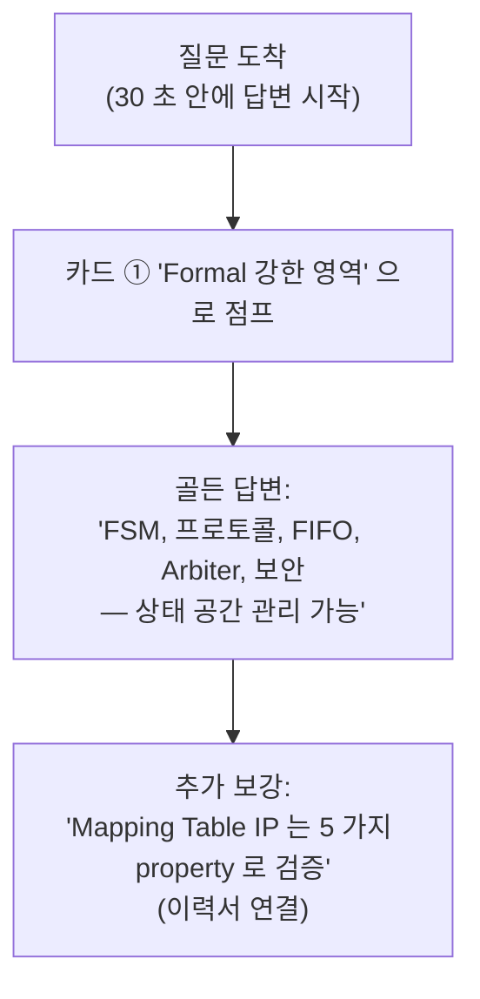
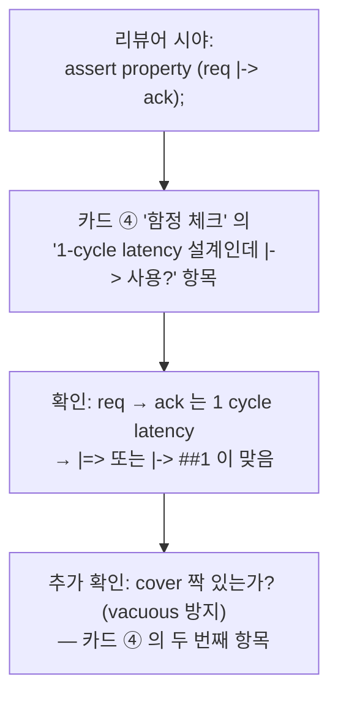
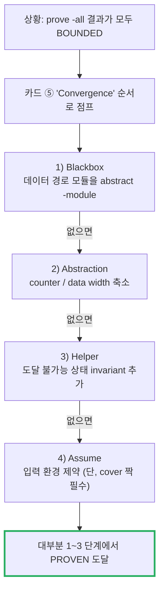
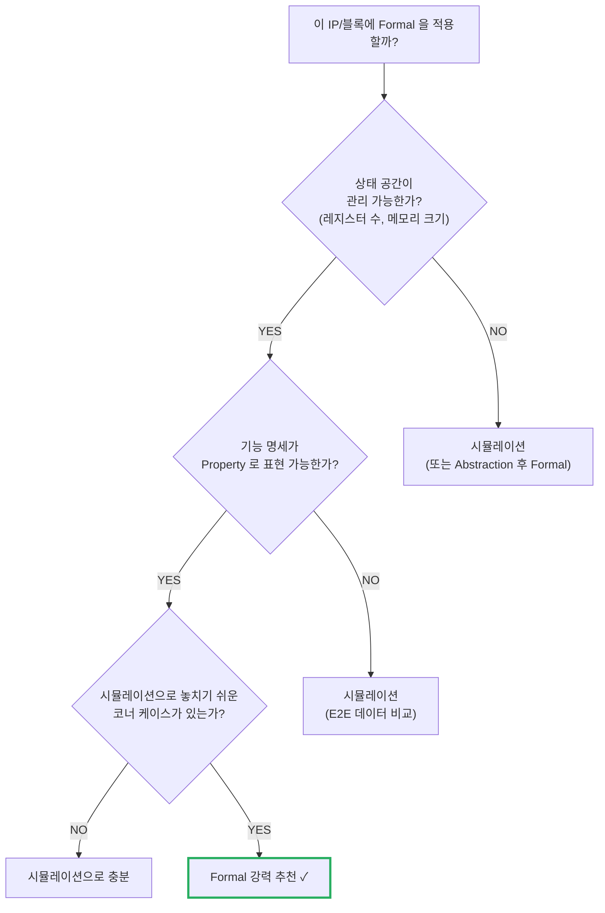

# Module 04 — Quick Reference Card

<!-- DV-SKOOL-CH-CTX:start -->
<div class="chapter-context" data-cat="core">
  <a class="chapter-back" href="../">
    <span class="chapter-back-arrow">←</span>
    <span class="chapter-back-icon">✅</span>
    <span class="chapter-back-text">Formal Verification</span>
  </a>
  <span class="chapter-divider">›</span>
  <span class="chapter-marker chapter-quickref-marker">★ Quick Reference</span>
</div>
<!-- DV-SKOOL-CH-CTX:end -->

<!-- DV-SKOOL-CH-TOC:start -->
<div class="page-toc">
  <span class="page-toc-label">목차</span>
  <a class="page-toc-link" href="#1-why-care-이-카드가-왜-필요한가">1. Why care?</a>
  <a class="page-toc-link" href="#2-intuition-한-페이지-치트시트-구조">2. Intuition</a>
  <a class="page-toc-link" href="#3-작은-예-3-시나리오에서-어느-항목을-먼저-보는가">3. 작은 예 — 카드 사용 시나리오 3 종</a>
  <a class="page-toc-link" href="#4-일반화-한-장-요약-formal-fundamentals-sva-jaspergold">4. 일반화 — 한 장 요약</a>
  <a class="page-toc-link" href="#5-디테일-연산자-패턴-convergence-sign-off">5. 디테일 — 연산자/패턴/Convergence/Sign-off</a>
  <a class="page-toc-link" href="#6-흔한-오해-와-카드-사용-체크리스트">6. 흔한 오해 + 카드 체크리스트</a>
  <a class="page-toc-link" href="#7-핵심-정리-key-takeaways">7. 핵심 정리</a>
</div>
<!-- DV-SKOOL-CH-TOC:end -->

!!! objective "사용 목적"
    참조용 치트시트 — 면접 / 코드 리뷰 / 디버그 중 빠른 확인용.

    **떠올릴 수 있어야 하는 것:**

    - **Recall** SVA 핵심 연산자 (`|->`, `|=>`, `##N`, `[*N]`, `[->N]`, `throughout`)
    - **Recall** Vacuous Pass / Over-constraint 식별 패턴
    - **Recall** Convergence 순서 (Blackbox → Abstraction → Helper → Assume → Split → Bounded 수용)
    - **Reference** Sign-off 5가지 기준 (PROVEN / Cover / Assume / COI / Completeness)

!!! info "사전 지식"
    - [Module 01-03](01_formal_fundamentals.md) 학습 후 활용

---

## 1. Why care? — 이 카드가 왜 필요한가

Module 01~03 의 모든 어휘를 한 페이지에 압축한 이유는 _상황별_ 빠른 회상을 위해서입니다 — 면접 30 초 안에 "Vacuous Pass 방지법" 을 답해야 할 때, 코드 리뷰 중 `|->` 와 `|=>` 의 차이를 즉시 확인할 때, 새벽에 BOUNDED 결과를 받고 어떤 순서로 시도할지 결정할 때. 카드는 **외워야 하는 12 항목** 과 **그 12 항목으로 분기되는 의사결정 트리** 만 남깁니다.

이 카드를 못 외우고도 검증은 가능하지만, sign-off 회의에서 즉답해야 하는 항목들 — "왜 BOUNDED 인가?", "이 assume 의 spec 근거는?", "cover 가 covered 인가?" — 에서 흐름을 잃으면 검증 책임자로서의 신뢰가 흔들립니다. 카드의 역할은 그 30 초 답변을 보장하는 것입니다.

---

## 2. Intuition — 한 페이지 치트시트 구조

!!! tip "💡 한 줄 비유"
    **Formal sign-off 체크리스트** ≈ **수출 인허가 절차 — 항목별 도장 모두 받아야 통과**.<br>
    PROVEN / BOUNDED 정당성 / Cover / Assume audit / COI / Completeness — 모두 도장 받아야 sign-off. 하나라도 빠지면 검증 incomplete.

### 한 장 그림 — 카드의 6 영역

```
   ┌──────────────────────────────────────────────────────────────┐
   │           Formal Verification — Quick Reference              │
   ├──────────────────────────────────────────────────────────────┤
   │ ① 핵심 어휘     │ Sim vs Formal, PROVEN/BOUNDED/CEX           │
   │                  │ Induction, SAT/SMT                          │
   ├──────────────────┼─────────────────────────────────────────────┤
   │ ② SVA 연산자    │ |->, |=>, ##N, [*N], [->N], $past, $rose    │
   ├──────────────────┼─────────────────────────────────────────────┤
   │ ③ SVA 패턴      │ handshake / FIFO / FSM / reset / liveness   │
   ├──────────────────┼─────────────────────────────────────────────┤
   │ ④ 함정 체크     │ disable iff / 리셋 극성 / vacuous /         │
   │                  │  ##[0:$] 위험 / overlapping vs non-overlap  │
   ├──────────────────┼─────────────────────────────────────────────┤
   │ ⑤ Convergence  │ Blackbox → Abs → Helper → Assume → Split    │
   │                  │ → Bounded accept                            │
   ├──────────────────┼─────────────────────────────────────────────┤
   │ ⑥ Sign-off 5종 │ assert / cover / assume / COI / 완전성       │
   └──────────────────────────────────────────────────────────────┘
```

각 영역은 § 5 의 sub-section 1:1 대응. 카드를 빠르게 훑을 때는 ① → ⑥ 순으로 따라가면 됩니다.

### 왜 이렇게 설계됐는가 — Design rationale

학습 자료는 _이해_ 를 돕고, 카드는 _회상_ 을 돕습니다. 두 형식이 다른 이유는 인지 부담의 차이 — 본문은 "왜?" 를 풀어 설명해야 하지만, 카드는 "무엇을?" 한 단어로 던져야 합니다. 그래서 § 5 의 표는 한 행이 평균 20 자 미만, 코드 예제는 한 줄짜리 핵심만, Convergence 순서는 6 단어로 압축합니다. 이 압축은 정보 손실이 아니라 _리콜 우선_ 의 형식 변환입니다.

---

## 3. 작은 예 — 3 시나리오에서 어느 항목을 먼저 보는가

가장 흔한 카드 사용 3 시나리오. 각 시나리오의 첫 30 초 안에 _카드의 어느 영역_ 을 보아야 하는지를 step-by-step.

### 시나리오 A — 면접 질문: "Formal 에 적합한 IP 는?"



### 시나리오 B — 코드 리뷰 중: "이 SVA 가 맞는가?"



### 시나리오 C — 새벽 디버그: "전부 BOUNDED 만 나옴"



| 시나리오 | 카드 영역 | 첫 행동 |
|---|---|---|
| 면접 답변 | ① 핵심 어휘 / ⑥ Sign-off | 5 가지 골든 답변 중 매핑 |
| 코드 리뷰 | ② 연산자 / ④ 함정 | latency 와 연산자 일치, cover 짝 |
| BOUNDED 디버그 | ⑤ Convergence | 6 단계 순서대로 |
| Sign-off 회의 | ⑥ 5 기준 | PROVEN / cover / assume / COI / 완전성 audit |
| 신규 IP 적용 판단 | ① 결정 트리 | 상태 공간 관리 가능? + Property 표현 가능? |

!!! note "여기서 잡아야 할 두 가지"
    **(1) 카드는 _순차 읽기_ 자료가 아니라 _랜덤 액세스_ 자료** — 시나리오 → 영역 점프 → 1~2 행 회상 → 답변. 처음부터 끝까지 읽는 것이 아님.<br>
    **(2) 매 시나리오의 답변에 _Module 번호_ 를 같이 외움** — "Vacuous Pass = Module 02 §5.5" 식으로. 깊이 파야 할 때 본문으로 즉시 점프 가능.

---

## 4. 일반화 — 한 장 요약 (Formal Fundamentals + SVA + JasperGold)

### 4.1 한줄 요약

```
Formal = 수학적 전수 검사. SVA 로 Property 정의 → Formal Engine 이
모든 상태에서 증명 (PROVEN) 또는 반례 (FAILED) 반환. 시뮬레이션과 상호 보완.
```

### 4.2 핵심 정리 표

| 주제 | 핵심 포인트 |
|------|------------|
| Formal vs Sim | Formal=전수검사 (증명), Sim=샘플링 (시나리오) |
| Engine 원리 | SAT/SMT Solver + Induction (귀납법) 으로 증명 |
| 결과 | PROVEN (증명) / FAILED (반례) / BOUNDED (N cycle 까지) |
| BOUNDED 원인 | Inductive Step 실패 → Helper/Abstraction/분할로 대응 |
| SVA 3요소 | assert (검증) / assume (가정) / cover (도달성) |
| Vacuous Pass | Antecedent 미발생 → 자동 PASS → cover 로 방지 필수 |
| 적합 대상 | FSM, 프로토콜, FIFO, Arbiter, 보안, Connectivity |
| 한계 | State Explosion → 큰 데이터 경로, 성능 검증 불가 |
| Assume 위험 | 과도 → False PROVEN. Cover 로 검증 필수 |
| Convergence | Blackbox → Abstraction → Helper → Assume → 분할 → Bounded 수용 |
| Bind | DUT 수정 없이 SVA 연결 → Formal + Sim 재사용 |
| 도구 | JasperGold (Cadence) — FPV, CON, SEQ, X-Prop |
| Sign-off | PROVEN/BOUNDED + cover COVERED + assume 감사 + COI + 완전성 |

### 4.3 Formal 적용 판단 플로우



---

## 5. 디테일 — 연산자, 패턴, Convergence, Sign-off

### 5.1 SVA 핵심 연산자 빠른 참조

```
##N           N cycle 지연
##[M:N]       M~N cycle 범위
|->           Overlapping implication (같은 cycle)
|=>           Non-overlapping (다음 cycle)
[*N]          N회 연속 반복
[*M:N]        M~N회 반복
[->N]         N번째 goto 반복
[=N]          N번 비연속 반복
$rose(x)      0→1 전환
$fell(x)      1→0 전환
$stable(x)    값 유지
$past(x,N)    N cycle 전 값
s_eventually  언젠가 참 (Formal only)
throughout    구간 동안 유지
intersect     두 시퀀스 동시 시작+종료

$onehot(x)    정확히 1비트만 1 (FSM one-hot)
$onehot0(x)   최대 1비트만 1 (0 허용)
$countones(x) 1인 비트 수
$isunknown(x) X/Z 포함 여부
```

### 5.2 자주 쓰는 SVA 패턴

```systemverilog
// 핸드셰이크: valid 올라가면 ready 까지 유지
$rose(valid) |-> valid throughout (##[0:$] ready);

// FIFO Overflow 방지
!(wr_en && full);

// FSM 불법 상태
!(state inside {ILLEGAL_STATES});

// 리셋 후 초기값
$fell(rst) |-> ##1 (out == 0);

// 요청 후 응답 보장
req |-> s_eventually(ack);
```

### 5.3 SVA 함정 체크리스트

```
□ disable iff 누락?          → 리셋 중 위반 보고 방지
□ 리셋 극성 맞는가?          → active-low 면 disable iff (!rst_n)
□ |-> vs |=> 맞는가?         → 설계 latency 에 맞는 연산자 선택
□ Vacuous Pass 방지 cover?   → 모든 assert 에 대응 cover 필수
□ Local variable 필요?       → write/read 데이터 비교 시
□ strong/weak 구분?          → 시뮬레이션에서 완료 보장 필요 시 strong
```

### 5.4 Convergence 순서

```
BOUNDED → ① Blackbox → ② Abstraction → ③ Helper Assert
        → ④ Assume (최소) → ⑤ Property 분할 → ⑥ Bounded 수용
```

각 단계 별 명령어:

| 단계 | JasperGold TCL | 효과 |
|---|---|---|
| ① Blackbox | `abstract -module <name>` | 모듈 출력을 자유 변수로 |
| ② Abstraction | `abstract -counter` 또는 parameter 재정의 | counter/data width 축소 |
| ③ Helper Assert | SVA 에 invariant 추가 | induction step 보조 |
| ④ Assume | SVA 에 `assume property` 추가 | 입력 환경 제약 |
| ⑤ Split | property 를 sub-property 로 분리 | 각각 독립 증명 |
| ⑥ Accept | sign-off 문서에 BOUNDED depth 와 사유 명시 | 정당화된 BOUNDED |

### 5.5 면접 골든 룰 9 항목

1. **Formal = 전수검사**: "시뮬레이션의 샘플링 한계를 수학적 증명으로 보완"
2. **Engine = SAT/SMT + Induction**: "Boolean 수식 → SAT 풀이 + 귀납법으로 무한 cycle 증명"
3. **PROVEN 의 의미**: "어떤 입력/상태에서도 성립 — 수학적 보장"
4. **BOUNDED ≠ PROVEN**: "Induction 미완 — Helper/Abstraction 으로 Convergence 시도"
5. **Vacuous Pass**: "Antecedent 미발생 → 자동 PASS — cover 로 반드시 방지"
6. **State Explosion**: "Formal 의 근본 한계 — Blackbox + Abstraction 필수"
7. **Assume 주의**: "과도하면 False PROVEN — Cover 로 검증"
8. **병행 전략**: "Formal=제어로직/프로토콜, Sim=데이터경로/성능/대규모"
9. **Sign-off**: "PROVEN + cover COVERED + assume 감사 + 문서화"

### 5.6 이력서 연결 매핑

| 항목 | 면접 질문 | 핵심 답변 |
|------|----------|----------|
| Mapping Table FV Lead | "Formal 을 어떻게 적용했나?" | 5가지 핵심 Property 증명 (Hit/Miss 배타, 데이터 무결성 등) |
| JasperGold | "도구 경험은?" | FPV 앱으로 Property Checking, Counterexample 파형 분석 |
| Convergence 경험 | "BOUNDED 는 어떻게 해결했나?" | Blackbox + Helper Assert 로 Induction 성공시킴 |
| SVA 기술 스킬 | "SVA 를 어디에 사용했나?" | Formal (증명) + 시뮬레이션 (런타임 체커) 양쪽에서 Bind 로 재사용 |
| 검증 품질 | "Vacuous Pass 를 어떻게 방지?" | 모든 assert 에 대응 cover, assume 감사 프로세스 |

---

## 6. 흔한 오해 와 카드 사용 체크리스트

### 흔한 오해

!!! danger "❓ 오해 1 — 'Property PROVEN 100% = sign-off 완료'"
    **실제**: PROVEN 100% 라도 (1) cover 미작성 (2) assume 과도 (3) blackbox/cut point 후 미모델링 등 빈 칸이 있으면 unsound. Sign-off 5 기준 모두 도장 받아야 함.<br>
    **왜 헷갈리는가**: 체크리스트의 정량 지표 (% PROVEN) 만 보면 정성 항목이 누락되기 쉬워서.

!!! danger "❓ 오해 2 — '카드를 외우면 본문은 안 봐도 된다'"
    **실제**: 카드는 _리콜 가속_ 만 한다. 디버그 중 BOUNDED 의 _근본 원인_ 분석은 Module 03 본문의 §5.3 (Counterexample 분석) 과 §5.5 (Sign-off 5 기준) 의 디테일이 필요. 카드 → 본문 점프가 표준 흐름.<br>
    **왜 헷갈리는가**: 짧은 형식이 "충분" 으로 보임 + 시간 압박이 디테일을 건너뛰게 함.

!!! danger "❓ 오해 3 — 'Convergence 는 항상 Blackbox 부터'"
    **실제**: 첫 단계는 _문제 진단_ (`check_coi`, `visualize -bounded_trace`) — 그 다음에 (1) 도달 불가능 상태가 원인이면 Helper 만으로 풀림 (Module 03 §3 의 케이스), (2) datapath 가 큰 게 원인이면 Blackbox. 진단 없이 Blackbox 부터 가면 false CEX 가 양산됨.<br>
    **왜 헷갈리는가**: 카드의 순서가 "Blackbox → Abs → Helper" 로 되어 있어 _기계적_ 으로 따르기 쉬움. 카드 ⑤ 는 _시도 우선순위_ 이지 _필수 시퀀스_ 가 아님.

!!! danger "❓ 오해 4 — '`s_eventually` 는 카드의 모든 시나리오에서 동작'"
    **실제**: `s_eventually` 는 Formal _전용_. 시뮬레이션에서는 무한 시간 가정이 성립 안 함 → 시뮬용 liveness 는 `strong(##[1:N] ack)` 같이 _유한_ bound 로 작성. Module 02 §5.7 에서 다룸.<br>
    **왜 헷갈리는가**: 카드의 연산자 표에 두 가지 (`##[0:$]`, `s_eventually`) 가 같은 영역에 있어 같은 의미로 보임.

!!! danger "❓ 오해 5 — '카드만 있으면 sign-off 회의에서 즉답 가능'"
    **실제**: Sign-off 의 5 기준 audit 는 카드의 1 행 ("assume audit") 으로 표현되지만, _실제 audit_ 은 모든 assume 의 spec 문서 1:1 매핑 + 대응 cover trace 확인 — 시간 단위 작업. 카드는 _기억의 인덱스_ 일 뿐.<br>
    **왜 헷갈리는가**: 카드의 압축 형식이 "5 분이면 sign-off 가능" 이라는 환상을 줌.

### 카드 사용 체크리스트 (디버그/리뷰/면접 시 어디를 보나)

| 상황 | 1차 확인 | 2차 점프 |
|---|---|---|
| 면접: "Formal 의 결과는?" | 카드 § 4.2 의 "결과" 행 | Module 01 §4.2 |
| 면접: "BOUNDED 처리?" | 카드 § 5.4 Convergence | Module 03 §5.1 |
| 면접: "Vacuous Pass?" | 카드 § 5.3 함정 체크 | Module 02 §5.5 |
| 면접: "Sign-off 기준?" | 카드 § 4.2 의 "Sign-off" 행 | Module 03 §5.5 |
| 코드 리뷰: SVA 의 implication | 카드 § 5.1 연산자 | Module 02 §4.4 |
| 코드 리뷰: cover 누락 | 카드 § 5.3 함정 | Module 02 §5.5 |
| 디버그: BOUNDED 만 나옴 | 카드 § 5.4 Convergence | Module 03 §3 (worked example) |
| 디버그: false CEX | 카드 § 6 오해 3 | Module 03 §6 의 디버그 표 |
| Sign-off 회의: assume audit | 카드 § 4.2 의 "Assume 위험" | Module 03 §5.4 |
| 신규 IP 적용 판단 | 카드 § 4.3 의사결정 트리 | Module 01 §4.4 |

---

## 7. 핵심 정리 (Key Takeaways)

- **카드는 _리콜_ 자료**: 12 항목 표 + 6 영역 그림 + 6 단계 Convergence 순서. 본문은 _이해_, 카드는 _회상_.
- **시나리오 → 영역 점프**: 면접/리뷰/디버그/Sign-off 별로 카드의 어느 영역을 먼저 보는지 § 3 의 표로 학습.
- **연산자 + 함정 + Convergence + Sign-off** 4 묶음만 외우면 80% 의 상황 대응 가능. 나머지 20% 는 본문 점프.
- **Convergence 는 진단 후 적용**: `check_coi` / `visualize -bounded_trace` 로 원인 파악 → 그에 맞는 단계 (Blackbox/Helper/Assume) 선택.
- **Sign-off 5 기준은 정성 항목 포함**: PROVEN % 만으로 부족 — assume audit 와 property 완전성은 문서화 작업.

!!! warning "실무 주의점 — Over-constraint 인 assume"
    **현상**: Formal 결과가 깔끔하게 PROVEN 으로 끝나는데, 같은 RTL 이 simulation 에서는 같은 condition 에서 fail 한다. 또는 spec 상 가능한 입력 시나리오가 formal CEX 에서 한 번도 안 나타난다.

    **원인**: Assume 이 spec 보다 강해서 (over-constraint) formal tool 이 실제로는 가능한 입력 공간을 탐색하지 못한다. 결과: PROVEN 이지만 의미 없는 증명. spec 과 1:1 대응 검증을 안 하면 발견 못한다.

    **점검 포인트**: 모든 assume 마다 "이 가정이 spec 의 어느 항목에 대응되는가" 를 주석으로 남기고 review. Simulation 에서 같은 assume 이 위반되지 않는지 cross-check. JasperGold 의 `check_assumptions` / `prove -property -bg` 으로 unreachable assumption 탐지. Sign-off 시 assumption 목록을 spec reviewer 와 함께 walk-through.

---

## 코스 마무리

3 개 모듈 + Quick Reference 완료. 다음을 권장:

1. **퀴즈 풀어보기** — [퀴즈 인덱스](quiz/index.md)
2. **글로서리 점검** — [용어집](glossary.md)
3. **실전 적용** — 본인 프로젝트의 simple FSM 에 SVA 5 개 + cover 5 개 작성해서 PROVEN 시도
4. **다른 토픽** — DV 환경에서의 [UVM](../../uvm/) 연계, 프로토콜 레벨 [AMBA](../../amba_protocols/) 검증과 조합

<div class="chapter-nav">
  <a class="nav-prev" href="../03_jaspergold_and_strategy/">
    <div class="nav-label">◀ 이전</div>
    <div class="nav-title">JasperGold 활용 + DV 전략</div>
  </a>
  <a class="nav-next" href="../quiz/">
    <div class="nav-label">다음 ▶</div>
    <div class="nav-title">퀴즈로 이동</div>
  </a>
</div>


--8<-- "abbreviations.md"
