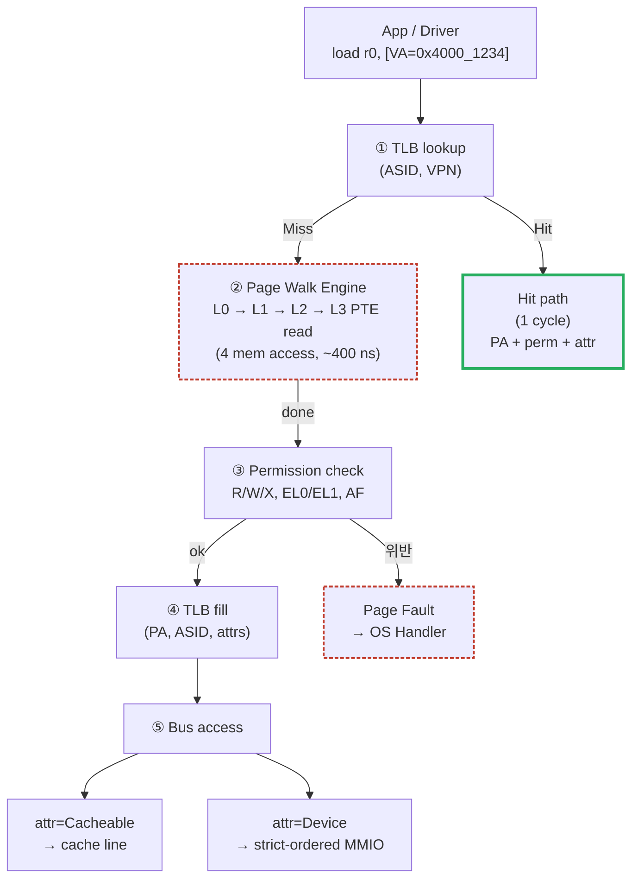

# Module 01 — MMU 기본 개념 및 주소 변환

<!-- DV-SKOOL-CH-CTX:start -->
<div class="chapter-context" data-cat="memory">
  <a class="chapter-back" href="../">
    <span class="chapter-back-arrow">←</span>
    <span class="chapter-back-icon">🧭</span>
    <span class="chapter-back-text">MMU</span>
  </a>
  <span class="chapter-divider">›</span>
  <span class="chapter-marker">Module 01</span>
</div>
<!-- DV-SKOOL-CH-CTX:end -->

<!-- DV-SKOOL-CH-TOC:start -->
<div class="page-toc">
  <span class="page-toc-label">목차</span>
  <a class="page-toc-link" href="#1-why-care-이-모듈이-왜-필요한가">1. Why care?</a>
  <a class="page-toc-link" href="#2-intuition-비유와-한-장-그림">2. Intuition</a>
  <a class="page-toc-link" href="#3-작은-예-process-a-가-va-0x40001234-를-읽는-한-사이클">3. 작은 예 — VA 0x4000_1234 읽기</a>
  <a class="page-toc-link" href="#4-일반화-mmu-3대-기능과-translation-regime">4. 일반화 — 3대 기능 + Regime</a>
  <a class="page-toc-link" href="#5-디테일-페이지-크기-권한-속성-trustzone-page-fault">5. 디테일</a>
  <a class="page-toc-link" href="#6-흔한-오해-와-dv-디버그-체크리스트">6. 흔한 오해 + DV 디버그 체크리스트</a>
  <a class="page-toc-link" href="#7-핵심-정리-key-takeaways">7. 핵심 정리</a>
</div>
<!-- DV-SKOOL-CH-TOC:end -->

!!! objective "학습 목표"
    이 모듈을 마치면:

    - **Explain** 가상 주소(Virtual Address)가 해결하는 5가지 문제(주소 충돌 / 메모리 보호 / 단편화 / 물리 한계 / 보안 격리)를 설명할 수 있다.
    - **Distinguish** MMU 의 3대 기능(주소 변환 / 권한 검사 / 캐시 속성 제어)을 PTE 비트 단위로 구분할 수 있다.
    - **Trace** 한 번의 VA → PA 변환을 (TLB lookup → page walk → permission check → access) 흐름으로 끝까지 추적할 수 있다.
    - **Identify** Translation Regime(EL0/EL1 Stage 1, EL2 Stage 2, Secure)별 책임자를 식별한다.
    - **Apply** MMU Enable 시퀀스(Page Table → TTBR → TCR/MAIR → SCTLR.M → ISB) 를 부트 코드에 적용할 수 있다.

!!! info "사전 지식"
    - TCP/IP 또는 일반 OS의 process memory 모델 (heap/stack 분리)
    - 이진/16진 비트 마스킹, 페이지 정렬

---

## 1. Why care? — 이 모듈이 왜 필요한가

### 1.1 시나리오 — _Process 격리_ 가 _없으면_?

당신은 OS 설계자. 두 process 가 _동시 실행_:
- **Process A**: 비밀번호 저장 (메모리 0x1000).
- **Process B**: 게임. 일반 메모리 사용.

만약 _MMU 없이_ 두 process 가 _직접_ DRAM 사용:
- B 의 _임의 메모리 read_ (예: 버그, 또는 의도적 공격) → A 의 0x1000 의 비밀번호 _노출_.
- 동시에 _쓰면_ → 서로 data corruption.

**MMU 의 해법**:
- 각 process 가 _자신의 VA space_ — 0x1000 이 A 에서는 PA 0x80000000, B 에서는 PA 0x90000000.
- Page table 이 _VA → PA 매핑_ 을 process 별 관리.
- 한 process 가 _다른 process 의 메모리_ 자체를 _주소조차_ 모름.

이게 _OS 의 가장 근본적 보안_. UNIX/Linux/Windows/macOS 모두 _MMU 없이는 multi-user system 불가능_.

이 토픽의 모든 후속 모듈은 한 가정에서 시작합니다 — **"CPU 와 device 가 보는 주소(Virtual Address)는 실제 DRAM 주소(Physical Address)가 아니다"**. Page table 이 왜 multi-level 인지, TLB 가 왜 latency-critical 인지, IOMMU 가 왜 SoC 보안의 토대인지 — 모두 이 한 가정의 파생입니다.

이 모듈을 건너뛰면 이후 검증 시 마주칠 모든 fault, permission error, ASID mismatch, identity-mapping 누락 같은 증상이 "그냥 외워야 하는 규칙" 으로 보입니다. 반대로 이 가정을 정확히 잡고 나면, 디테일을 만날 때마다 **"아, 이건 process isolation 을 위한 거구나"** 처럼 _이유_ 가 보입니다.

---

## 2. Intuition — 비유와 한 장 그림

!!! tip "💡 한 줄 비유"
    **MMU** = 도시의 _주소록_. 같은 "302호" 라는 가상 주소가 어느 동(어느 process) 인지에 따라 전혀 다른 실제 빌딩(physical address) 으로 번역됩니다. 우편물(load/store) 은 _주소록을 거치지 않고는 배달되지 않습니다_.<br>
    **Page Table** = 그 주소록의 _두꺼운 종이 책_. 통째로 외우기엔 무거워서, MMU 는 자주 본 페이지(TLB) 만 _즐겨찾기_ 해 둡니다.

### 한 장 그림 — VA → PA 흐름



### 왜 이렇게 설계됐는가 — Design rationale

세 가지 요구가 동시에 만족돼야 했습니다.

1. **Process A 와 Process B 가 같은 VA 0x4000_1234 를 동시에 _다른_ DRAM 위치로 매핑** → page table 이 process 마다 따로 있어야 → TTBR0 + ASID.
2. **하지만 store 마다 메모리를 4번 읽으면 IPC 가 무너짐** → TLB 가 hit-rate 95%+ 로 walk 비용을 1 cycle 로 압축.
3. **그래도 권한 위반은 _하드웨어가 즉시_ 잡아야** → PTE 의 AP/UXN/PXN/AF/NS bit 가 walk 결과에 같이 실려나옴.

이 세 요구의 교집합이 **"VA = (VPN, offset) → 주소록 색인 → PA + permission + attribute"** 라는 한 줄 모델입니다.

---

## 3. 작은 예 — Process A 가 VA 0x4000_1234 를 읽는 한 사이클

가장 단순한 시나리오. ARMv8 EL0 에서 동작하는 Process A 가 `ldr w0, [x1]` 로 **VA = 0x0000_0000_4000_1234** 를 읽으려 합니다. 4KB granule, ASID=5, 처음 접근이라 TLB 는 비어 있습니다.

### 단계별 추적

```
   Process A (ASID=5, EL0, TTBR0_EL1 = 0x0000_8000_0000)
     ▼
   VA = 0x0000_0000_4000_1234
        │
        ├── VA[63:48] = 0x0000  (sign-ext, TTBR0 영역)
        ├── VA[47:39] = 0x000   (L0 index = 0)
        ├── VA[38:30] = 0x001   (L1 index = 1)
        ├── VA[29:21] = 0x000   (L2 index = 0)
        ├── VA[20:12] = 0x001   (L3 index = 1)
        └── VA[11:0]  = 0x234   (page offset, 변환 안 함)
        ▼
   ┌────────────────────────────────────────────────────┐
   │ ① TLB lookup (ASID=5, VPN=0x0_0000_0000_4000_1)    │
   │     → MISS                                         │
   ├────────────────────────────────────────────────────┤
   │ ② Page Walk Engine 발동                             │
   │     L0 read: 0x0000_8000_0000 + 0×8 = ..._0000     │
   │       PTE = 0x0000_0000_8001_0003 (Table, V=1)     │
   │     L1 read: 0x0000_8001_0000 + 1×8 = ..._0008     │
   │       PTE = 0x0000_0000_8002_0003 (Table, V=1)     │
   │     L2 read: 0x0000_8002_0000 + 0×8 = ..._0000     │
   │       PTE = 0x0000_0000_8003_0003 (Table, V=1)     │
   │     L3 read: 0x0000_8003_0000 + 1×8 = ..._0008     │
   │       PTE = 0x0040_0000_0009_2783 (Page descriptor)│
   │         AP[7:6]=01  → EL0/EL1 RW                   │
   │         AF=1        → already accessed             │
   │         AttrIdx=2   → Normal WB Cacheable          │
   │         OutputAddr  = 0x0000_0009_2000             │
   ├────────────────────────────────────────────────────┤
   │ ③ Permission check                                 │
   │     access = Read at EL0 → AP=01 허용 → OK         │
   ├────────────────────────────────────────────────────┤
   │ ④ PA 합성                                           │
   │     PA = OutputAddr | offset                       │
   │        = 0x0000_0009_2000 | 0x234                  │
   │        = 0x0000_0009_2234                          │
   ├────────────────────────────────────────────────────┤
   │ ⑤ TLB fill (ASID=5, VPN, PPN, AP, attrs, size=4KB)│
   ├────────────────────────────────────────────────────┤
   │ ⑥ DRAM read at PA=0x9_2234, attr=WB → fill L1$     │
   └────────────────────────────────────────────────────┘
        ▼
   r0 = *(0x9_2234)
```

### 단계별 의미

| Step | 누가 | 무엇을 | 왜 |
|---|---|---|---|
| ① | CPU MMU | TLB 에서 (ASID, VPN) 검색 | TLB hit 면 walk 생략 — 1 cycle path |
| ② | Page Walk Engine | TTBR0 부터 L0..L3 PTE 4개 읽기 | Multi-level 의 본질 — sparse VA space 를 효율 표현 |
| ③ | MMU permission unit | AP[7:6], UXN/PXN, AF 검사 | 위반 시 즉시 Synchronous Exception |
| ④ | MMU | PPN || offset | offset 은 변환 없이 그대로 통과 |
| ⑤ | TLB fill logic | 결과 캐싱 | 다음 접근부터는 ① 만으로 끝 |
| ⑥ | Bus + cache | 실제 DRAM 접근 | attr 이 cacheable / device 인지에 따라 path 분기 |

### 만약 PTE 가 잘못됐다면? (3 분기)

| 시나리오 | PTE 상태 | 결과 |
|---|---|---|
| **Translation fault** | L2 PTE 의 V=0 | Page Fault, ESR.IFSC=0b0001_xx (Level 2) |
| **Permission fault** | AP[7:6]=10 (RO/RO) 인데 store | Permission Fault, ESR.WnR=1 |
| **Access Flag fault** | AF=0 | AF Fault → SW 가 AF=1 로 update 후 재실행 (FEAT_HAFDBS 없을 때) |

!!! note "여기서 잡아야 할 두 가지"
    **(1) VPN 만 변환되고 offset 은 그대로 통과** — 이게 page-aligned 라는 단어의 본질입니다. Page 크기 = (offset bit 의 2^N) 이라는 정의도 여기서 옵니다. <br>
    **(2) walk 결과가 "PA + permission + attribute" 의 _한 묶음_ 으로 나온다** — TLB 엔트리는 단순한 PA 캐시가 아니라 _권한과 속성도 함께_ 캐싱합니다. PTE 변경 후 TLB invalidate 를 안 하면 stale permission 이 살아있는 게 그 때문입니다.

---

## 4. 일반화 — MMU 3대 기능과 Translation Regime

### 4.1 MMU 의 3대 기능

| 기능 | PTE 의 어디 | 검증 포인트 |
|---|---|---|
| **주소 변환 (VA→PA)** | OutputAddress[47:12] | walk 결과의 PA bit-exact 일치 |
| **접근 권한 검사** | AP[7:6], UXN, PXN, NS, AF | 위반 시 정확한 fault class + level |
| **캐시 속성 제어** | AttrIdx[4:2] → MAIR_EL1 lookup | Normal WB / Device-nGnRnE 등 attr 이 bus 로 정확히 전파 |

### 4.2 Translation Regime — 누가, 어디서

```
ARMv8 Exception Level 별 Translation:

  EL0/EL1 Stage 1    : TTBR0_EL1 (user) + TTBR1_EL1 (kernel)  → VA → IPA (or PA)
                       관리자 = OS kernel
  EL2     Stage 2    : VTTBR_EL2                               → IPA → PA
                       관리자 = Hypervisor
  EL3     별도 regime: TTBR0_EL3                               → Secure Monitor 전용
                       관리자 = Secure Firmware (TF-A 등)

핵심:
  - EL0 (User) 와 EL1 (Kernel) 은 같은 Stage 1 regime 을 공유
    → TTBR0 = user-half, TTBR1 = kernel-half
  - 가상화 켜지면 EL1 의 PA 는 _진짜 PA 가 아님_ — IPA → S2 walk 한번 더
  - 각 regime 은 독립 page table + 독립 TLB tag (ASID/VMID)
```

### 4.3 가상 주소가 해결하는 5가지 문제

| 문제 | VA 의 해결 | 검증 시 보일 증상 (없으면) |
|------|---------|------|
| 주소 충돌 | 각 process 가 독립 VA space | 두 test 가 같은 PA 를 덮어씀 |
| 메모리 보호 | Page 단위 R/W/X + AP | EL0 가 kernel 영역에 store 성공 |
| 단편화 | 가상 연속 / 물리 불연속 | DMA buffer 할당 실패 |
| 메모리 한계 | Swap (demand paging) | OOM, fault-on-load 미동작 |
| 보안 격리 | Process A 가 B 의 PA 를 모름 | side-channel 또는 leak |

### 4.4 MMU 의 위치 — CPU 내장 vs SoC 레벨

```d2
direction: right

SoC: "SoC" {
  CPU: "CPU"
  GPU: "GPU"
  DMA: "DMA"
  ACC: "NIC / Accel"
  MMU: "MMU\n(CPU 전용)"
  SMMU: "SMMU"
  IOMMU: "IOMMU"
  SYSMMU: "sysMMU"
  MC: "Memory\nController"
}
DRAM: "DRAM" { shape: cylinder }
CPU -> MMU
MMU -> MC
GPU -> SMMU
SMMU -> MC
DMA -> IOMMU
IOMMU -> MC
ACC -> SYSMMU
SYSMMU -> MC
MC -> DRAM
```

> CPU → MMU (CPU 전용, 보통 CPU 내부) <br>
> GPU/DMA/가속기 → SMMU / IOMMU / sysMMU (디바이스용)

**SoC 에서 MMU 가 중요한 이유**: HW 가속기(NPU, GPU, DMA)가 직접 메모리에 접근할 때, 가상 주소를 사용해야 OS의 메모리 관리 체계와 일관성을 유지하고, 잘못된 접근으로부터 시스템을 보호할 수 있다. 자세한 SMMU 구조는 [Module 04](04_iommu_smmu.md) 에서 다룹니다.

---

## 5. 디테일 — 페이지 크기, 권한, 속성, TrustZone, Page Fault

### 5.1 Page 기반 변환 — VPN vs Offset

```
가상 주소 (예: 48-bit VA, 4KB Page)
+------------------+------------------+
|  Virtual Page No. |  Page Offset     |
|  (VPN, 36-bit)   |  (12-bit)        |
+--------+---------+--------+---------+
         |                   |
         v                   |
  +-------------+            |
  | Page Table  |            |
  | VPN → PPN   |            |  (Offset은 변환 없이 그대로)
  +------+------+            |
         |                   |
         v                   v
+------------------+------------------+
| Physical Page No.|  Page Offset     |
| (PPN)            |  (12-bit)        |
+------------------+------------------+
         물리 주소
```

**핵심**: VPN(Virtual Page Number)만 변환하고, Page Offset(하위 12bit)은 그대로 통과한다.

### 5.2 Page 크기와 Offset 관계

| Page 크기 | Offset 비트 | 용도 |
|----------|-----------|------|
| 4 KB | 12 bit | 가장 일반적 (일반 OS) |
| 16 KB | 14 bit | ARM 일부 (iOS 등) |
| 64 KB | 16 bit | HPC, 대형 메모리 |
| 2 MB (Huge Page) | 21 bit | 대용량 연속 매핑 |
| 1 GB (Giga Page) | 30 bit | 서버, HW 가속기 |

**면접 포인트**: Page 크기가 클수록 TLB 하나의 엔트리가 커버하는 범위가 넓어져 TLB Miss가 줄어든다. 그러나 내부 단편화(Internal Fragmentation)가 증가한다.

### 5.3 PTE 권한 비트 (개념도)

```
Page Table Entry (PTE)에 포함된 권한 비트:

  +---+---+---+-----+--------+-------+--------+
  | V | R | W | X   | User   | Global| Dirty  |
  +---+---+---+-----+--------+-------+--------+
  | 1 | 1 | 0 | 1   | 1      | 0     | 0      |
  +---+---+---+-----+--------+-------+--------+

  V = Valid (유효한 매핑 여부)
  R = Read 허용
  W = Write 허용
  X = Execute 허용
  User = User mode 접근 허용
  Global = 컨텍스트 스위치 시 TLB flush 제외

  위반 시 → Page Fault (Exception) 발생
```

(실제 ARMv8 의 AP/UXN/PXN/AF/NG 인코딩은 [Module 02 §5](02_page_table_structure.md) 에서 정밀하게 다룸)

### 5.4 캐시 속성 제어 (Memory Attributes)

| 속성 | 의미 | 용도 |
|------|------|------|
| Cacheable | 캐시에 저장 가능 | 일반 DRAM |
| Non-cacheable | 캐시 우회 | MMIO, Device 레지스터 |
| Write-back | 캐시에 쓰고 나중에 메모리 반영 | 성능 우선 |
| Write-through | 캐시와 메모리에 동시 쓰기 | 일관성 우선 |
| Device | 순서 보장, 캐시 불가 | HW 레지스터 |

ARMv8 에서는 PTE 의 `AttrIdx[4:2]` 가 `MAIR_EL1` 의 8 슬롯 중 하나를 지칭하고, 그 슬롯의 8-bit 인코딩이 실제 attribute (`Device-nGnRnE`, `Normal WB` 등) 를 결정합니다. 즉 PTE 에는 attr 의 _이름_ 만, MAIR 에 attr 의 _내용_ 이 들어 있는 indirection 입니다.

### 5.5 MMU Enable / Disable 시퀀스

```
SCTLR_EL1.M (bit[0]) — MMU 활성화 제어:

  M = 0 (MMU Disabled):
    모든 VA가 그대로 PA로 통과 (Identity Mapping)
    TLB 사용 안 함, Page Walk 없음
    캐시 속성: 기본값 (Device-nGnRnE 또는 구현 정의)

    사용 시점:
    - 부트 초기 (OS 로드 전)
    - Firmware / Bootloader 단계
    - Page Table이 아직 설정되지 않은 상태

  M = 1 (MMU Enabled):
    모든 VA가 Page Table 기반으로 변환
    TLB 활성화, Page Walk Engine 동작

MMU 활성화 순서 (부트 시):
  1. Page Table 구성 (메모리에 PTE 배치)
  2. TTBR0_EL1 / TTBR1_EL1에 Table Base 주소 설정
  3. TCR_EL1에 VA 크기, Granule, 캐시 속성 설정
  4. MAIR_EL1에 메모리 속성 정의
  5. SCTLR_EL1.M = 1 (MMU Enable)
  6. ISB (파이프라인 플러시 — 이후 명령어부터 변환 적용)

주의: Enable 직후의 첫 명령어도 변환됨
→ Enable 전에 현재 실행 중인 코드 영역의 Identity Mapping 필수
   (VA = PA인 매핑이 있어야 Enable 후에도 실행 계속)
```

### 5.6 Translation Regime 상세

```
ARMv8에서 Exception Level별 Translation Regime:

  +--------+------------------+-------------------+
  | EL     | Translation      | Page Table 관리   |
  +--------+------------------+-------------------+
  | EL0/1  | Stage 1:         | OS 커널            |
  |        | VA → PA (또는 IPA)|                   |
  +--------+------------------+-------------------+
  | EL2    | Stage 2:         | Hypervisor         |
  |        | IPA → PA         |                    |
  |        | (가상화 시)       |                    |
  +--------+------------------+-------------------+
  | EL3    | Secure Monitor   | Secure Firmware    |
  |        | (별도 Translation)|                   |
  +--------+------------------+-------------------+

핵심:
  - EL0 (User) + EL1 (Kernel): 같은 Stage 1 Translation 공유
    → TTBR0_EL1 = User 공간, TTBR1_EL1 = Kernel 공간
  - EL2 (Hypervisor): Guest OS의 IPA를 실제 PA로 변환
  - 각 Regime은 독립적인 Page Table + TLB 공간을 가짐
```

### 5.7 Secure vs Non-secure — TrustZone 과 MMU

```d2
direction: right

Normal: "Normal World" {
  NOS: "Normal OS\n(Android / Linux)"
  NMMU: "Normal MMU\n(TTBR_EL1)"
  NOS -> NMMU
}
Secure: "Secure World" {
  SOS: "Trusted OS\n(OP-TEE 등)"
  SMMU2: "Secure MMU\n(TTBR_EL1_S)"
  SOS -> SMMU2
}
TZASC: "TZASC\n(TrustZone Address\nSpace Controller)"
NMMU -> TZASC
SMMU2 -> TZASC
```

**물리 주소 공간 분리**:

- NS (Non-Secure) 비트: PTE[5]
- NS=0 → Secure 물리 메모리 접근 가능
- NS=1 → Non-secure 물리 메모리만 접근 가능

**보안 경계**:

- Normal World 에서 Secure 메모리 접근 시도 → Bus Error / Slave Error
- TrustZone Address Space Controller (TZASC) 가 물리 주소 수준에서 차단

**DV 관점**:

- Secure → Non-secure 전환 시 TLB 상태 관리 검증
- NS bit 가 잘못 설정된 PTE 로 Secure 메모리 접근 시도 → 차단 확인
- World 전환 시 TLB Flush 범위 검증 (Secure TLB 와 Normal TLB 독립성)

### 5.8 CPU MMU vs IOMMU/SMMU 비교

| 항목 | CPU MMU | IOMMU / SMMU |
|------|---------|-------------|
| 위치 | CPU 내부 | Bus Fabric / 독립 IP |
| 사용자 | CPU 코어 | GPU, DMA, NIC, 가속기 |
| Page Table 관리 | OS 커널 | OS 커널 (IOMMU 드라이버) |
| 주요 목적 | 프로세스 격리 | 디바이스 격리 + DMA 보호 |
| TLB | CPU 전용 TLB | IOTLB (디바이스용) |
| 성능 요구 | 매우 높음 (매 명령어마다) | 높음 (DMA 트래픽 의존) |
| 가상화 지원 | Stage 2 (EL2) | Stage 2 (Hypervisor) |

### 5.9 Page Fault — 변환 실패 처리

#### Page Fault 유형

| 유형 | 원인 | 처리 |
|------|------|------|
| Invalid (매핑 없음) | PTE의 Valid 비트 = 0 | OS가 페이지 할당 후 매핑 |
| Permission (권한 위반) | Write 시도 but W=0 | Segfault 또는 COW (Copy-on-Write) |
| Not Present (스왑) | 물리 메모리에 없음 (디스크로 스왑됨) | 디스크에서 읽어 복원 |

#### Page Fault 처리 흐름

```d2
shape: sequence_diagram

CPU
MMU
Handler: "OS Fault Handler"

# Note over MMU: PTE 없거나 권한 위반
CPU -> MMU: "VA 접근 시도"
MMU -> MMU: "TLB Miss → Page Walk"
MMU -> CPU: "Page Fault Exception"
CPU -> Handler: "Page Fault Handler 호출"
Handler -> Handler: "원인 분석\n페이지 할당/로드\n권한 업데이트"
Handler -> CPU: "복귀 → 원래 명령어 재실행"
CPU -> MMU: "VA 재접근"
MMU -> CPU: "정상 변환 성공" { style.stroke-dash: 4 }
```

**DV 관점**: Page Fault 발생 → Exception → Handler → 재실행의 전체 흐름이 올바르게 동작하는지, 특히 Fault 발생 시 MMU 상태(TLB, Page Walk Engine)가 정확히 유지되는지 검증해야 한다.

---

## 6. 흔한 오해 와 DV 디버그 체크리스트

### 흔한 오해

!!! danger "❓ 오해 1 — 'MMU 가 켜지면 자동으로 안전하다'"
    **실제**: MMU 가 켜져도 page table entry 가 잘못 설정되면(예: NS 비트 미설정, AP 권한 오류, 같은 PA 를 두 process 가 RW 로 공유) 보안 격리가 즉시 깨집니다. MMU 는 _정책 적용 도구_ 이지 _정책 자체_ 가 아닙니다 — 정책은 SW(OS, hypervisor) 가 PTE 에 채워 넣어야 비로소 효력이 생깁니다.<br>
    **왜 헷갈리는가**: "기능 켜짐 = 안전" 이라는 직관 + page table 을 SW 가 채우는 책임이라는 사실이 이름만으로는 드러나지 않아서.

!!! danger "❓ 오해 2 — 'MMU 가 hardware 라 SW 가 신경 쓸 필요 없다'"
    **실제**: MMU 동작은 **HW + SW 협업 contract** 입니다. Page table 채우기, ASID 할당/회수, TLBI 호출, fault handler 작성, MAIR 인덱스 정의 — _전부_ SW 책임. HW 는 그 contract 위에서 lookup/walk/check 만 수행합니다.<br>
    **왜 헷갈리는가**: "하드웨어 모듈 = SW 무관" 이라는 명칭 함정.

!!! danger "❓ 오해 3 — 'MMU 를 끄면 (M=0) 변환이 그냥 사라진다'"
    **실제**: M=0 이면 VA = PA 의 _identity mapping_ 으로 동작하지만, 이 때도 캐시 attribute 는 reset 또는 SCTLR 의 다른 비트에 의해 결정됩니다. 보통 강제 Device-nGnRnE 또는 구현 정의값 — 즉 _캐시 비활성_ 으로 떨어집니다. 그래서 MMU enable 직전과 직후의 _성능_ 이 극적으로 달라집니다.<br>
    **왜 헷갈리는가**: "M=0 = MMU 무관" 으로 단순화하기 쉬워서.

!!! danger "❓ 오해 4 — 'TLB 만 비우면 page table 변경이 즉시 반영된다'"
    **실제**: TLBI 명령은 _완료를 보장하지 않습니다_. 반드시 `DSB ISH` (Inner Shareable barrier) + `ISB` 가 따라와야 다른 코어 / 같은 코어의 후속 instr 이 새 매핑을 봅니다. 멀티코어에서 이 sequence 누락 = stale translation race.<br>
    **왜 헷갈리는가**: TLBI 가 즉시 효력을 갖는 atomic 으로 직관됨.

!!! danger "❓ 오해 5 — 'PTE 의 V=1 이면 access 가 보장된다'"
    **실제**: V=1 은 _이 PTE 가 의미를 가짐_ 만을 의미. 실제 access 가 통과하려면 (V=1) AND (AP 권한) AND (AF=1 또는 HW AF update 지원) AND (executable 의 경우 UXN/PXN 통과) 모두 만족해야 합니다.<br>
    **왜 헷갈리는가**: V 가 가장 눈에 띄는 single bit 라서 "valid = good to go" 로 줄여 기억하기 쉽다.

### DV 디버그 체크리스트 (이 모듈 내용으로 마주칠 첫 실패들)

| 증상 | 1차 의심 | 어디 보나 |
|---|---|---|
| MMU enable 직후 즉시 Prefetch/Data Abort | 부트 코드 영역의 Identity Mapping 부족 | TTBR0 dump → 현재 PC 의 PA 가 mapping 되어 있는가 |
| Translation Fault 인데 Level 정보가 0 | walk engine 이 L0 에서 fault → ESR.IFSC 가 Level 0 인코딩 | ESR_EL1.IFSC[5:2], FAR_EL1, TTBR 값 dump |
| 같은 VA 가 Process A 에선 OK, B 에선 Permission Fault | TTBR0 가 process 별로 swap 됐으나 ASID 만 그대로 | context switch 코드의 TTBR0 + ASID 동시 update |
| Store 가 silently 무시 (값이 안 변함) | PTE 의 AP 가 RO 로 떨어졌고 TLB 에 stale RW 가 살아있음 | PTE 변경 후 `TLBI VAE1, Xt; DSB ISH; ISB` 시퀀스 |
| Device 레지스터 write 가 reorder 되어 보임 | AttrIdx → MAIR 슬롯이 Normal Cacheable 로 잘못 설정 | MAIR_EL1 의 해당 슬롯 8-bit 인코딩 vs Device-nGnRnE 기대값 |
| Secure 영역 access 가 통과 (Normal world 에서) | PTE.NS 미설정 또는 TZASC 미초기화 | PTE[5] (NS) + TZASC 의 region 설정 |
| MMU enable 후 첫 instr 이 untranslated 로 실행 | `SCTLR.M=1` 직후 ISB 누락 | enable code 의 `MSR SCTLR_EL1, ...; ISB` 두 줄 |
| Page Fault 가 무한 루프 | Handler 가 PTE 만 update 하고 TLBI 안 함 → 재실행 시 stale | Handler 의 마무리 코드에 TLBI by VA 호출 |

### 흔한 오해 종합 — Page Fault Handler 가 안 끝남

!!! warning "실무 주의점 — MMU Enable 직후 ISB 누락"
    **현상**: MMU Enable(SCTLR.M=1) 직후 Instruction Fetch가 stale 변환 주소로 실행되어 예기치 않은 Fault 또는 오동작 발생.

    **원인**: 파이프라인에 이미 페치된 명령어들이 SCTLR 업데이트 이전 상태로 실행됨. ISB를 삽입하지 않으면 컴파일러/CPU가 명령어 순서를 재배치하여 변환이 활성화되기 전 코드가 실행될 수 있음.

    **점검 포인트**: 부트 코드에서 `SCTLR_EL1.M = 1` 설정 직후 `ISB` 명령어 존재 여부 확인. 시뮬레이션 로그에서 MMU Enable 시점 이후 첫 번째 Translation Fault가 Enable 이전 VA 범위를 참조하면 ISB 누락 의심.

---

## 7. 핵심 정리 (Key Takeaways)

- **VA → PA 변환은 _주소록 색인_ + _권한 + 속성 묶음_** 의 한 묶음으로 나옴 — TLB 는 PA 만 캐시하지 않는다.
- **VA 의 5가지 동기**: Process isolation / 메모리 보호 / 단편화 해결 / 물리 한계 우회 (swap) / 보안 격리.
- **MMU 3대 기능**: 주소 변환 + 권한 검사 + 캐시 속성 제어. PTE 의 비트 영역이 각각 담당.
- **MMU 위치**: CPU 내장 (core 단위) vs SoC 레벨 IOMMU/SMMU (DMA 마스터들 격리).
- **MMU enable 시퀀스**: Page Table 구성 → TTBR → TCR/MAIR → SCTLR.M=1 → ISB. ISB 누락 시 파이프라인 잔여 instr 이 untranslated 로 실행.

### 7.1 자가 점검

!!! question "🤔 Q1 — ISB 의 역할 (Bloom: Analyze)"
    MMU Enable (SCTLR.M=1) 직후 ISB 가 _없으면_ 어떤 일이?
    ??? success "정답"
        Pipeline 잔여 명령어가 _untranslated_ 로 실행:
        - SCTLR write 이전에 fetch 된 instr 들이 이미 pipeline 에 있음 → 그 instr 들은 _SCTLR 변경을 모름_.
        - ISB 없으면 그 instr 들이 PA = VA 가정으로 실행 → translation 적용 안 됨 → 의도와 다른 메모리 접근.
        - ISB 는 pipeline 을 flush + context synchronize → 이후 instr 부터 _확정적_ 으로 새 SCTLR 적용.
        - 검증 단서: MMU Enable 직후 첫 Translation Fault 의 VA 가 enable 이전 영역이면 ISB 누락 의심.

!!! question "🤔 Q2 — TLB 가 캐시하는 것 (Bloom: Evaluate)"
    TLB 가 _단순히 PA 만_ 캐시한다는 흔한 오해. 무엇이 빠진 설명?
    ??? success "정답"
        TLB entry = (VA, ASID, PA, **permission**, **attribute**) 묶음:
        - **Permission**: AP[2:1] (RW/RO/RWX 등), XN/PXN/UXN (execute never).
        - **Attribute**: cacheability (NC/WB/WT), shareability (NS/IS/OS).
        - PA 만 캐시한다면 매 access 마다 PT walk 필요 → TLB 의 의미 없음.
        - 결과: PTE 의 permission/attribute 변경 시 _TLB invalidate 필수_ → 단순 PA 변경이 아닌 _권한_ 변경에도 stale 발생.

### 7.2 출처

**Internal (Confluence)**
- `MMU Fundamentals` — MMU enable 시퀀스 + ISB 의무
- `TLB Entry Structure` — permission/attribute 캐시 정책

**External**
- ARM ARM (DDI0487) §D5 *VMSAv8-64 Translation*
- Intel SDM Vol 3A §4 *Paging*
- *Hennessy & Patterson — Computer Architecture: A Quantitative Approach* — Memory hierarchy

## 다음 단계

- 📝 [**Module 01 퀴즈**](quiz/01_mmu_fundamentals_quiz.md)
- ➡️ [**Module 02 — Page Table Structure**](02_page_table_structure.md): 4-level walk 의 비트 분할, PTE descriptor format, granule trade-off, PWC 까지.

<div class="chapter-nav">
  <a class="nav-prev" href="../">
    <div class="nav-label">◀ 이전</div>
    <div class="nav-title">코스 홈</div>
  </a>
  <a class="nav-next" href="../02_page_table_structure/">
    <div class="nav-label">다음 ▶</div>
    <div class="nav-title">Page Table 구조</div>
  </a>
</div>


--8<-- "abbreviations.md"
