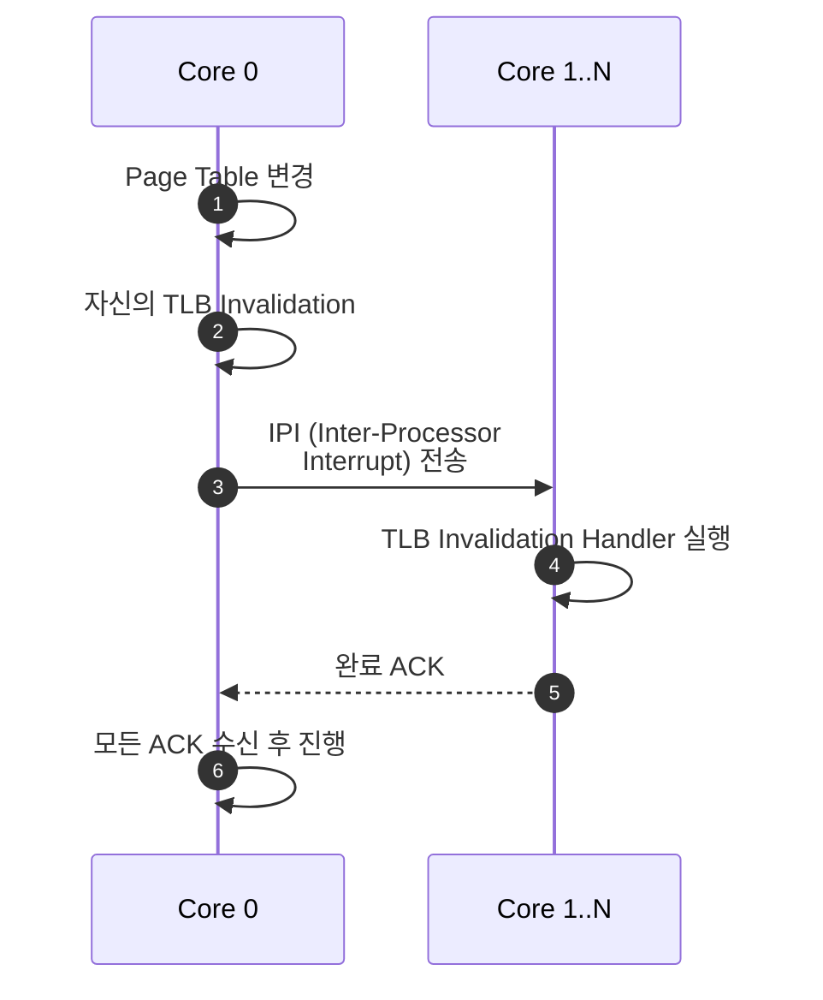
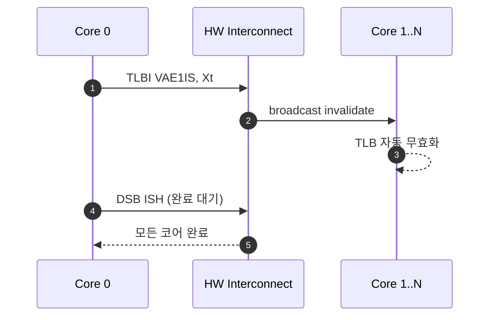

# Module 03 — TLB

<!-- DV-SKOOL-CH-CTX:start -->
<div class="chapter-context" data-cat="memory">
  <a class="chapter-back" href="../">
    <span class="chapter-back-arrow">←</span>
    <span class="chapter-back-icon">🧭</span>
    <span class="chapter-back-text">MMU</span>
  </a>
  <span class="chapter-divider">›</span>
  <span class="chapter-marker">Module 03</span>
</div>
<!-- DV-SKOOL-CH-CTX:end -->

<!-- DV-SKOOL-CH-TOC:start -->
<div class="page-toc">
  <span class="page-toc-label">목차</span>
  <a class="page-toc-link" href="#1-why-care-이-모듈이-왜-필요한가">1. Why care?</a>
  <a class="page-toc-link" href="#2-intuition-즐겨찾기-비유와-한-장-그림">2. Intuition</a>
  <a class="page-toc-link" href="#3-작은-예-tlb-miss-fill-2nd-hit-의-3-사이클">3. 작은 예 — Miss → Fill → Hit</a>
  <a class="page-toc-link" href="#4-일반화-tlb-구조-계층-tagging">4. 일반화 — 구조/계층/Tagging</a>
  <a class="page-toc-link" href="#5-디테일-replacement-hwsw-managed-prefetch-invalidation-coherency">5. 디테일</a>
  <a class="page-toc-link" href="#6-흔한-오해-와-dv-디버그-체크리스트">6. 흔한 오해 + DV 디버그 체크리스트</a>
  <a class="page-toc-link" href="#7-핵심-정리-key-takeaways">7. 핵심 정리</a>
</div>
<!-- DV-SKOOL-CH-TOC:end -->

!!! objective "학습 목표"
    이 모듈을 마치면:

    - **Diagram** TLB 의 구조 (set-associative, fully associative, micro-TLB / L1 / L2) 와 동작을 그릴 수 있다.
    - **Trace** TLB hit / TLB miss / page walk 흐름과 각 경우의 latency 영향을 추적할 수 있다.
    - **Apply** ASID/VMID tagging 이 어떻게 process / VM 간 TLB sharing 을 가능하게 하는지 시나리오에 적용할 수 있다.
    - **Decide** 언제 TLB invalidate (TLBI), shootdown 이 필요한지 식별할 수 있다.
    - **Distinguish** HW-managed TLB (ARM/x86) 와 SW-managed TLB (MIPS) 차이를 설명할 수 있다.

!!! info "사전 지식"
    - [Module 01-02](01_mmu_fundamentals.md) (VA → PA 변환, multi-level walk)
    - 캐시 기본 (associativity, replacement policy)

---

## 1. Why care? — 이 모듈이 왜 필요한가

### 1.1 시나리오 — _Stale TLB_ 의 silent corruption

당신은 OS 에서 `mmap` 으로 file 을 mapping. 작업 후 `munmap`. 다른 process 가 _같은 VA 영역_ 에 _다른 file_ mmap. 잠시 후 **wrong file 의 데이터 access**.

원인: **Stale TLB entry**.
- 첫 mmap → TLB 에 VA → PA1 매핑.
- munmap → page table 에서 매핑 제거. _그런데 TLB invalidate 안 함_.
- 새 mmap → 새 매핑 (VA → PA2) 추가, 단 TLB 에 _구 entry (PA1)_ 잔존.
- Access 시 TLB hit (구 entry) → _PA1 access_ → 다른 file 의 데이터.

해법: `munmap` 후 _반드시_ `tlb_invalidate(va)` 또는 `INVLPG` (x86) / `tlbi` (ARM).

OS 의 _가장 자주 발생하는 bug_ 중 하나 — Linux 커널 history 에 수십 건.

**TLB 는 MMU 성능의 90% 를 결정**합니다. Page walk 이 ~400 ns 인 반면 TLB hit 는 ~1 cycle (~0.5 ns) — _800 배_ 차이. Hit rate 가 99% 에서 95% 로 4%p 만 떨어져도 effective access time 이 4.5 ns 에서 20.5 ns 로 _4.6배_ 늘어납니다. 즉, TLB hit-rate 가 IPC 를 직접 결정.

검증 관점에서 **stale TLB entry 는 silent correctness bug 의 가장 흔한 원인** 입니다 — page table update 후 invalidate 누락이면 잘못된 PA 에 access 하지만 _아무 경고도 없이_ 진행. 이 모듈의 invalidation 시나리오를 빠짐없이 다루는 것이 핵심.

---

## 2. Intuition — 즐겨찾기 비유와 한 장 그림

!!! tip "💡 한 줄 비유"
    **TLB** ≈ **자주 가는 곳 즐겨찾기 (Bookmark)**. Page table walk 결과를 cache 해 두는 작은 hardware. Hit 시 ~1 cycle, miss 시 4 mem access. 즐겨찾기가 많을수록 빠르지만 **stale 우려** — 책 위치가 바뀌었는데 즐겨찾기를 안 지우면 엉뚱한 책장으로 안내됨.

### 한 장 그림 — TLB 의 latency 게임

```d2
direction: down

REQ: "request(VA, ASID, EL)"
UTLB: "μTLB (L1)\n~32-64 ent\nfully-assoc\ntotal: ~1 cycle"
L2TLB: "L2 TLB\n~512-2048\n4-8 way SA\ntotal: ~3-5 cycles"
PWE: "Page Walk Engine\nL0/L1/L2/L3 read\n(PWC 가 끼면 단축)\ntotal: ~수십~수백 cycles\n(4 mem access)"
BUS: "bus access\nPA + perm + attr"
CHIT: "L1 cache hit\n~3 cycles"
CMISS: "L1 cache miss\n→ DRAM"
REQ -> UTLB
UTLB -> BUS: "hit"
UTLB -> L2TLB: "miss"
L2TLB -> BUS: "hit (μTLB 재캐싱)"
L2TLB -> PWE: "miss"
PWE -> BUS: "TLB fill"
BUS -> CHIT
BUS -> CMISS
```

### 왜 이 디자인인가 — Design rationale

세 요구가 동시에 만족돼야 했습니다.

1. **매 instruction 마다 _1 cycle_ 안에 끝나야** → μTLB 가 fully-associative + 32-64 entries 의 _아주 작은_ CAM. 검색 latency 가 cycle time 안에 들어와야 IPC 무너지지 않음.
2. **그래도 working set 은 수천 page 가능** → L2 TLB 가 set-associative 로 더 크게. Hit 가 μTLB 보다 몇 cycle 느리지만 walk 보단 100 배 빠름.
3. **walk 자체도 줄여야** → PWC (Module 02 §4.6).

이 세 단계가 **μTLB → L2 TLB → PWC → page walk** 의 정확히 4 단계 hierarchy 를 만듭니다. 각 단계가 다음 단계의 비용을 _분산 흡수_ 하는 구조.

---

## 3. 작은 예 — TLB miss → fill → 2nd hit 의 3 사이클

가장 단순한 시나리오. 같은 VA = `0x4000_2000` 을 1 ms 사이에 두 번 읽습니다. 첫 접근은 cold (TLB miss → walk → fill), 두 번째는 hot (TLB hit). ASID=5, 4 KB granule.

### 단계별 추적

```
   T0: 첫 접근 — cold

      ldr w0, [VA=0x4000_2000]   (ASID=5)
        ▼
      ┌────────────┐
      │ μTLB lookup│ ── MISS (cold)
      └────────────┘
        ▼
      ┌────────────┐
      │ L2 TLB     │ ── MISS (cold)
      └────────────┘
        ▼
      ┌────────────────────────────────────┐
      │ Page Walk Engine                    │
      │   L0 read → PWC miss → mem (100ns)  │
      │   L1 read → PWC miss → mem (100ns)  │
      │   L2 read → PWC miss → mem (100ns)  │
      │   L3 read → PTE = page descriptor   │
      │              (100ns) → PA=0xA000    │
      │   Total walk: ~400 ns               │
      └────────────────────────────────────┘
        ▼
      TLB fill:  μTLB ← (ASID=5, VPN, PA=0xA000, perm, attr)
                 L2 TLB ← (same)
                 PWC L0/L1/L2 ← intermediate PTEs
        ▼
      DRAM read at PA=0xA_2000 → fill L1$ → r0 ready
      Total path: ~400 ns + bus

   T1 = T0 + 1 ms: 두 번째 접근 — hot

      ldr w0, [VA=0x4000_2000]   (ASID=5)
        ▼
      ┌────────────┐
      │ μTLB lookup│ ── HIT! (ASID & VPN match, V=1)
      │            │     PA = 0xA_2000, perm OK, attr OK
      └────────────┘
        ▼ ~1 cycle
      L1 cache lookup at PA=0xA_2000 → 보통 hit → r0 ready

      Total path: ~1 cycle + (cache hit 1-3 cycle) = ~5 ns

   비율:  T0 / T1 ≈ 400 / 5 = 80배
```

### 단계별 의미

| Step | 시점 | 누가 | 무엇 |
|---|---|---|---|
| ① | T0 | μTLB | (ASID=5, VPN) match 검색 — 32 entries CAM 동시 비교 |
| ② | T0 | L2 TLB | μTLB miss → 더 큰 SA 검색 |
| ③ | T0 | PWE | walk → 4 mem access |
| ④ | T0 | TLB fill logic | μTLB + L2 TLB + PWC 모두 채움 (replacement 가 victim 선택) |
| ⑤ | T1 | μTLB | hit → 1 cycle 에 PA + perm + attr 반환 |

### 만약 T0 와 T1 사이에 다른 ASID 의 같은 VA 가 끼어들면?

- 다른 ASID (예: 7) 의 _같은_ VA = `0x4000_2000` 이 들어옴.
- μTLB 검색 시 (ASID=7, VPN) match — 기존 (ASID=5) entry 와 _별개_.
- ASID 가 _구분 태그_ 라서 충돌 안 함.
- **단**, μTLB 가 작아서 (ASID=7) entry 가 (ASID=5) entry 를 _eviction_ 시킬 수 있음 → T1 에서 (ASID=5) miss 가능 → L2 TLB 로 fall-through → 여전히 walk 보다 빠름.

!!! note "여기서 잡아야 할 두 가지"
    **(1) hit / miss 의 latency 차이 = 80~800 배.** 1% 의 miss rate 변화도 effective access time 에 _수배_ 영향. 평균이 아닌 _critical path_ 라는 점이 본질입니다. <br>
    **(2) TLB fill 은 _다음 access 만_ 보호한다.** 첫 cold miss 의 비용 (~400 ns) 은 _불가피_. 그래서 prefetch / huge page / PWC 가 cold miss 를 줄이는 보조 수단으로 쓰입니다.

---

## 4. 일반화 — TLB 구조 / 계층 / Tagging

### 4.1 기본 TLB 엔트리

```
+------+------+------+------+----+----+----+----+------+-------+
| VMID | ASID | VPN  | PPN  | V  | R  | W  | X  | Attr | Size  |
+------+------+------+------+----+----+----+----+------+-------+
|  3   |  5   | 0x1F | 0x8A | 1  | 1  | 1  | 0  | WB   | 4KB   |
+------+------+------+------+----+----+----+----+------+-------+

V    = Valid
R/W/X = 권한 (Page Table에서 복사)
Attr = 캐시 속성
Size = Page 크기 (4KB/2MB/1GB)
```

### 4.2 TLB Lookup 과정

```
입력: VMID + ASID + VA

1. VA에서 VPN 추출
2. TLB 전체(Full-associative) 또는 Set(Set-associative)에서 검색:
   - VMID 일치?
   - ASID 일치? (또는 Global 엔트리?)
   - VPN 일치? (Page 크기 고려한 마스킹)
3. 일치하는 Valid 엔트리 발견?
   → Hit:  PPN + 권한 + 속성 즉시 반환
   → Miss: Page Walk Engine에 요청
```

### 4.3 일반적인 2-Level TLB

```d2
direction: right

L1: "L1 TLB (μTLB)"
L2: "L2 TLB (Main)"
PWE: "Page Walk Engine"
L1 -> L2: "miss"
L2 -> PWE: "miss"
```

**L1 TLB (μTLB)**:

- 크기: 32-64 엔트리
- 구조: Fully-associative
- 속도: 1 cycle
- 역할: 가장 빈번한 매핑 캐시

**L2 TLB (Main TLB)**:

- 크기: 256-2048 엔트리
- 구조: Set-associative (4-8 way)
- 속도: 2-4 cycle
- 역할: L1 Miss 시 백업

**Page Walk Engine**:

- L2 Miss 시 메모리에서 Page Table 읽기
- 결과를 L1, L2 에 모두 캐싱

### 4.4 IOTLB (IOMMU/SMMU 용)

디바이스(GPU, DMA, NIC) 의 주소 변환용 TLB:

```d2
direction: right

DEV: "Device\nRequest"
IOTLB: "IOTLB"
PWE: "Page Walk\n(메모리)"
DEV -> IOTLB
IOTLB -> PWE: "miss"
```

**특징**:

- StreamID (Device ID) 로 디바이스별 구분
- SubstreamID (PASID) 로 프로세스별 구분
- 디바이스 트래픽 패턴이 CPU 와 다름:
    - DMA: 대용량 순차 접근 → Huge Page 가 효과적
    - GPU: 불규칙 접근 패턴 → TLB 크기가 중요

### 4.5 TLB 설계 — Split vs Unified

**방식 1: Split TLB (Instruction + Data 분리)**

```d2
direction: down

ITLB: "I-TLB\n(48 ent)"
DTLB: "D-TLB\n(64 ent)"
L2: "L2 TLB (Unified)\n(1024)"
ITLB -> L2
DTLB -> L2
```

- 장점: I-Fetch 와 D-Access 가 동시에 TLB 접근 가능 (병렬성)
- 단점: 한쪽만 사용하면 다른 쪽 엔트리 낭비

**방식 2: Unified TLB**

```d2
direction: right

UTLB: "Unified TLB\n(112 entries)\nI/D 구분 없이 공유"
```

- 장점: 엔트리 활용 효율 높음
- 단점: 동시 접근 시 경쟁 (arbitration 필요)

**실무**: 대부분 L1 = Split, L2 = Unified 조합 사용 → DV 에서 I-TLB/D-TLB 동시 접근 시나리오 검증 필수.

### 4.6 Effective Memory Access Time

```
T_eff = TLB_Hit_Rate × T_hit + TLB_Miss_Rate × T_miss

예시 (4-level, DDR4):
  T_hit  = 0.5 ns (1 cycle @ 2GHz)
  T_miss = 400 ns (4 × 100ns page walk)

  Hit Rate 99%:  0.99 × 0.5 + 0.01 × 400 = 0.495 + 4.0 = 4.5 ns
  Hit Rate 95%:  0.95 × 0.5 + 0.05 × 400 = 0.475 + 20  = 20.5 ns
  Hit Rate 90%:  0.90 × 0.5 + 0.10 × 400 = 0.45  + 40  = 40.5 ns

  → 99% vs 95%: 4.6배 차이
  → 99% vs 90%: 9배 차이
  → 1%의 Miss Rate 변화가 전체 성능에 막대한 영향
```

---

## 5. 디테일 — Replacement, HW/SW-managed, Prefetch, Invalidation, Coherency

### 5.1 TLB 교체 정책 (Replacement Policy)

| 정책 | 원리 | 장단점 |
|------|------|--------|
| LRU (Least Recently Used) | 가장 오래 사용되지 않은 엔트리 교체 | 정확하지만 HW 복잡 |
| Pseudo-LRU | 트리 기반 근사 LRU | HW 간단, 성능 근접 |
| Random | 랜덤 선택 | 가장 간단, 최악 케이스 없음 |
| FIFO | 가장 먼저 들어온 엔트리 교체 | 간단하지만 성능 낮음 |

### 5.2 Pseudo-LRU 알고리즘 상세 (Tree-based PLRU)

```
4-way Set-Associative TLB의 Pseudo-LRU 예시:

  이진 트리 구조 (3개의 방향 비트):
            B0
           /    \
         B1      B2
        /  \    /  \
      Way0 Way1 Way2 Way3

  비트 의미:
    B0 = 0 → 좌측 방향(Way0/1)이 최근 사용됨 → 교체 대상은 우측(Way2/3)
    B0 = 1 → 우측 방향(Way2/3)이 최근 사용됨 → 교체 대상은 좌측(Way0/1)
    B1, B2도 동일 논리

  접근 시 업데이트:
    Way1 접근 → B0 = 0 (좌측 사용), B1 = 1 (Way1 방향)

  교체 대상 결정:
    B0=0 → 우측으로, B2=0 → Way2 선택
    B0=0 → 우측으로, B2=1 → Way3 선택
    B0=1 → 좌측으로, B1=0 → Way0 선택
    B0=1 → 좌측으로, B1=1 → Way1 선택

  HW 구현:
    - 비트 수 = (Way 수 - 1) = 3비트 (4-way 기준)
    - True LRU는 4-way에서 log₂(4!) ≈ 4.58 → 5비트 필요
    - N-way 증가 시: PLRU = (N-1)비트, True LRU = O(N·log₂N)비트
    → PLRU가 HW 비용 대비 성능이 우수하여 실제 프로세서에서 널리 사용
```

**DV 포인트**: PLRU 검증 시 교체 순서가 True LRU와 정확히 일치하지 않는다. "근사"이므로 특정 접근 패턴에서 LRU와 다른 Way를 교체할 수 있다 — Reference Model도 동일한 PLRU 알고리즘으로 구현해야 한다.

### 5.3 HW-Managed vs SW-Managed TLB

```
HW-Managed TLB (ARM, x86):
  TLB Miss → HW Page Walk Engine이 자동으로 Page Table 탐색
  → SW 개입 없이 TLB 채움
  → OS는 Page Table만 관리하면 됨

  장점: 빠른 Miss 처리 (HW 속도)
  단점: Page Table 형식이 HW에 고정 → 유연성 낮음

SW-Managed TLB (MIPS, SPARC):
  TLB Miss → TLB Miss Exception → OS의 TLB Miss Handler 호출
  → SW가 Page Table 탐색 후 TLB에 직접 채움

  장점: Page Table 형식 자유 (OS가 결정)
  단점: Exception 오버헤드 → Miss 처리 수십~수백 cycle 더 느림

현재 추세:
  ARM, x86, RISC-V 모두 HW-Managed 채택
  → SW-Managed는 거의 사라짐 (임베디드 일부 제외)
```

| 항목 | HW-Managed | SW-Managed |
|------|-----------|-----------|
| Miss 처리 | HW Walk Engine | OS Exception Handler |
| Miss Latency | 수십~수백 cycle | 수백~수천 cycle |
| PT 형식 | HW 고정 | SW 자유 |
| DV 복잡도 | Walk Engine 검증 필요 | Exception 흐름 검증 필요 |
| 대표 ISA | ARM, x86, RISC-V | MIPS, SPARC |

### 5.4 TLB Prefetch / Speculative Walk

```
TLB Prefetch — Miss를 사전에 방지:

방법 1: Sequential Prefetch
  VA = 0x1000 접근 (Hit) → 다음 Page VA = 0x2000도 미리 Walk
  → Sequential DMA 트래픽에 효과적
  → Random 접근에는 무효 (오히려 TLB 오염)

방법 2: Stride Prefetch
  접근 패턴 감지: 0x1000, 0x3000, 0x5000 (stride = 0x2000)
  → 다음 예상: 0x7000을 미리 Walk
  → HW Stride Detector 필요

방법 3: Speculative Walk (Page Walk Cache 활용)
  Page Walk 중 중간 레벨 결과를 캐싱:
    Level 0 결과 → Level 0 Cache에 저장
    Level 1 결과 → Level 1 Cache에 저장

  다음 Walk 시 상위 레벨 캐시 Hit → Walk 단축:
    4-level Walk = 4 mem access
    Level 0,1 캐시 Hit → 2 mem access만 필요 (50% 단축)

  이것이 "Page Walk Cache (PWC)" 또는 "Translation Walk Cache"
```

**면접 포인트**: "TLB Miss Latency를 줄이는 방법?" → (1) TLB 크기 증가, (2) Huge Page, (3) Page Walk Cache로 중간 레벨 캐싱, (4) Prefetch. 이 중 PWC가 가장 실질적이며 대부분의 현대 MMU에 구현되어 있다.

### 5.5 TLB Invalidation (무효화)

#### 무효화가 필요한 시점

| 이벤트 | 이유 | 무효화 범위 |
|--------|------|-----------|
| 컨텍스트 스위치 | 다른 프로세스의 매핑 | ASID 기반 선택적 (또는 전체) |
| Page Table 변경 | OS가 매핑 변경 | 변경된 VA 범위 |
| VM 전환 | 다른 VM의 매핑 | VMID 기반 선택적 |
| 권한 변경 | mprotect() 등 | 변경된 VA |
| Unmap | 매핑 제거 | 제거된 VA |

#### ARMv8 TLB Invalidation 명령어

```
TLBI ALLE1        // EL1 전체 TLB 무효화
TLBI VAE1, Xt     // 특정 VA의 EL1 엔트리 무효화
TLBI ASIDE1, Xt   // 특정 ASID의 전체 엔트리 무효화
TLBI VMALLE1      // 현재 VMID의 전체 EL1 엔트리 무효화

DSB ISH            // 무효화 완료 보장 (Barrier)
ISB                // 파이프라인 플러시
```

**DV 핵심**: TLB Invalidation 후 같은 VA를 접근하면 반드시 TLB Miss가 발생하고 Page Walk가 수행되어야 한다. Stale 엔트리가 남아있으면 보안 취약점이 된다.

### 5.6 TLB Coherency 문제

#### 문제: Page Table 변경 시 TLB 불일치

```mermaid
sequenceDiagram
    autonumber
    participant CPU
    participant TLB
    participant OS
    participant PT as Page Table
    Note over TLB: T1: VA=0x1000 → PA=0x8000 캐싱
    OS->>PT: T2: VA=0x1000 매핑을<br/>PA=0xA000 으로 변경
    CPU->>TLB: T3: VA=0x1000 접근
    TLB-->>CPU: Hit → PA=0x8000 ← Stale!
    Note over OS,TLB: 해결: T2 후 반드시<br/>TLBI VAE1, 0x1000<br/>DSB ISH; ISB
    CPU->>TLB: VA=0x1000 재접근
    TLB->>PT: Miss → Page Walk
    PT-->>CPU: PA=0xA000 (올바른 값)
```

#### 멀티코어 환경에서의 TLB Coherency

```
Core 0: TLB에 VA=0x1000 → PA=0x8000
Core 1: OS가 Page Table 변경 후 자신의 TLB만 Invalidation

→ Core 0의 TLB는 여전히 오래된 값!

해결: Broadcast TLB Invalidation
  TLBI VAE1IS, Xt   // Inner Shareable → 모든 코어에 broadcast
  DSB ISH            // 모든 코어의 완료 보장
```

#### TLB Shootdown 프로토콜 (멀티코어 상세)

TLB Shootdown = 한 코어가 다른 코어들의 TLB 를 원격 무효화하는 프로토콜.

**x86 방식 (SW Shootdown — IPI 기반)**:



> 코어 수에 비례하여 지연 증가 (scalability 문제).

**ARM 방식 (HW Broadcast — TLBI + IS)**:



> SW 개입 최소 (IPI 불필요), 더 빠름.

**DV 검증 핵심**:

- Broadcast 후 모든 코어에서 해당 엔트리 무효화 확인
- DSB ISH 전에 다른 코어가 stale 엔트리 사용하지 않는지 확인
- Race condition: invalidation 진행 중 같은 VA 로 walk 시작 시 처리

### 5.7 DV 관점 — TLB 검증 포인트

| 검증 항목 | 시나리오 | 확인 사항 |
|----------|---------|----------|
| TLB Hit | 동일 VA 연속 접근 | 첫 접근은 Walk, 이후 1-cycle 변환 |
| TLB Miss → Walk | 새로운 VA 접근 | Page Walk 수행 후 TLB에 캐싱 |
| TLB Replacement | 엔트리 가득 참 + 새 VA | 교체 정책 정확 동작 |
| TLB Invalidation | Invalidate 후 동일 VA 접근 | 반드시 Miss 발생 → Walk |
| ASID 분리 | 같은 VA, 다른 ASID | 각각 별도 엔트리, 별도 PPN |
| Multi-size | 4KB + 2MB 혼합 | 크기별 VPN 마스킹 정확 |
| Stale Entry | Page Table 변경 후 Invalidation 없이 접근 | **버그**: 잘못된 PA 반환 |
| Concurrent Walk | 동시에 여러 TLB Miss | Walk Engine 병렬 처리 또는 직렬화 정확 |

---

## 6. 흔한 오해 와 DV 디버그 체크리스트

### 흔한 오해

!!! danger "❓ 오해 1 — 'TLB invalidate = 모든 entry 삭제'"
    **실제**: `TLBI ALLE1` 은 전체 무효화이지만, `TLBI VAE1` (by VA) / `TLBI ASIDE1` (by ASID) 은 _일부만_ 무효화. 전체 flush 는 비싸므로 (cold miss 폭발) **fine-grained** 가 표준입니다. OS 의 mprotect() 는 boundary VA 범위만, context switch 도 이전 ASID 만 비웁니다.<br>
    **왜 헷갈리는가**: "clear = 전부 지움" 이라는 직관 + 명령어가 한 개로 보여서 모두 같은 효과로 오인.

!!! danger "❓ 오해 2 — 'TLB 만 키우면 성능이 항상 향상된다'"
    **실제**: TLB 가 너무 크면 _lookup latency_ 자체가 늘어납니다 (associative search 의 한계). 그래서 modern CPU 는 **L1 TLB (작고 빠름) + L2 TLB (크고 느림)** 의 hierarchy 로 _search latency vs miss penalty_ 의 trade-off 를 분산합니다. 단순히 size up 만으론 critical path 침해.<br>
    **왜 헷갈리는가**: "cache 큰 게 무조건 좋다" 의 직관.

!!! danger "❓ 오해 3 — 'TLB invalidate 가 다른 코어까지 즉시 전파된다'"
    **실제**: ARM 의 `TLBI VAE1` (single-core) 은 자기 코어만. 다른 코어까지 보내려면 `TLBI VAE1IS` (Inner Shareable) + `DSB ISH` 가 필요합니다. x86 은 _SW shootdown_ (IPI) 으로만 가능. 이 차이가 multi-core 에서 stale TLB race 의 단골 원인.<br>
    **왜 헷갈리는가**: "global state = 자동 sync" 라는 가정.

!!! danger "❓ 오해 4 — 'ASID 가 다르면 TLB 엔트리는 절대 충돌 안 한다'"
    **실제**: _logical_ 으로는 충돌 안 하지만, _physical_ TLB way 가 한정되므로 같은 set 에 ASID 5 와 7 의 엔트리가 동시에 들어가면 _서로 eviction 시킴_. ASID 는 hit/miss 의 _구분_ 일 뿐 _격리_ 가 아닙니다.<br>
    **왜 헷갈리는가**: ASID 의 이름이 "isolation" 같이 들려서.

!!! danger "❓ 오해 5 — 'TLB hit 면 page walk 가 절대 일어나지 않는다'"
    **실제**: Speculative execution 의 결과로 TLB hit 인 path 를 따라가더라도, _다른_ speculative branch 가 동시에 walk 를 트리거할 수 있습니다 (HW prefetch / stride / sequential). 즉, _이 access 의_ walk 는 안 일어나도 _주변_ walk 는 일어나는 게 정상.<br>
    **왜 헷갈리는가**: scalar 모델 ("이 instr 의 결과만") 로 simplification.

### DV 디버그 체크리스트 (이 모듈 내용으로 마주칠 첫 실패들)

| 증상 | 1차 의심 | 어디 보나 |
|---|---|---|
| Page table 변경 후에도 옛 PA 로 access | TLBI 누락 또는 DSB/ISB 누락 | Code 의 `TLBI ...; DSB ISH; ISB` 3-line 시퀀스 |
| Multi-core 에서 한쪽 core 만 stale | TLBI 가 IS suffix 없이 single-core | TLBI 명령어의 `IS` / `OS` suffix 확인 |
| Context switch 마다 첫 100 instr 모두 miss | ASID rollover 로 전체 flush 발생 중 | ASID alloc 로그, OS 의 ASID generation counter |
| 같은 VA, 다른 ASID 가 같은 PA 로 변환 | TLB lookup 시 ASID 비교 누락 또는 nG=0 (global) | TLB dump 의 ASID field, PTE.nG bit |
| Random 패턴에서 throughput 급락 | TLB capacity miss + PWC 도 miss | working set vs TLB 크기, PWC 적중률 |
| TLBI VA 후에도 _근처_ VA 가 hit | TLBI 가 size mask 를 잘못 처리 (huge page mask) | TLB entry 의 size 필드와 invalidation VA mask |
| I-fetch 와 D-fetch 동시에 TLB miss → 직렬화 | walk engine 이 single-port (1 walk at a time) | 동시 walk 발생 시 stall 신호, walk port 수 |
| Stage 2 켜진 후 TLB hit rate 급락 | combined TLB 의 capacity 부족 (S1+S2 entries) | IOTLB 또는 combined TLB 의 분리/통합 정책 |

!!! warning "실무 주의점 — TLB Shootdown 순서 오류로 stale 변환 사용"
    **현상**: Multi-core 환경에서 한 코어가 PTE를 변경했음에도 다른 코어가 이전 변환 결과를 계속 사용하여 잘못된 PA로 접근, 데이터 오염 또는 보안 취약점 발생.

    **원인**: PTE 업데이트 후 반드시 다른 코어에 IPI(Inter-Processor Interrupt)를 보내 TLBI를 수행시켜야 하는데, 순서가 `PTE 수정 → 자신의 TLBI → IPI 전송 → 상대 코어 TLBI 완료 확인` 이어야 함. IPI 전송 전에 새로운 주소로 접근을 허용하거나 DSB 없이 진행하면 race가 발생함.

    **점검 포인트**: Shootdown 코드에서 `TLBI → DSB ISH → IPI 발송 → 상대 코어 TLBI 완료 확인` 순서 검증. 시뮬레이션 파형에서 PTE store 완료 시점과 원격 코어 TLBI 발행 시점 사이에 해당 VA 접근이 발생하면 race 발생.

---

## 7. 핵심 정리 (Key Takeaways)

- **TLB 는 latency 게임**: hit ~1 cycle vs miss + walk ~수백 cycle. Hit rate 가 IPC 를 좌우. 1% miss rate 변화가 4-9 배의 effective access time 변화.
- **계층화**: μTLB (L1, fully-assoc, 32-64 ent) → L2 TLB (set-assoc, 수백-수천 ent) → PWC → page walk. 각 단계가 다음 비용을 흡수.
- **ASID/VMID**: process / VM 간 TLB 공유 가능. Context switch 시 flush 회피 → cold miss 폭증 방지. 단, ASID rollover 시 전체 flush 강제됨.
- **TLBI 명령**: `ASIDE1` / `VAE1` / `VMALLE1` / `ALLE1`. Page table 변경 / context switch 시 필수. 반드시 `DSB ISH; ISB` 동반.
- **TLB shootdown**: Multi-core SMP 에서 _다른_ 코어의 TLB 도 무효화하는 메커니즘. ARM = HW broadcast (TLBI ... IS), x86 = SW IPI. 둘 다 비싸므로 batch 처리.
- **HW-managed 가 표준**: 검증에서는 walk engine + TLB 의 정확성 (특히 invalidation 후 stale 없는지) 핵심.

### 7.1 자가 점검

!!! question "🤔 Q1 — TLB miss 의 latency (Bloom: Apply)"
    TLB hit = 1 cycle, miss = 100 cycle (4-level walk + cache miss). hit rate 99% 와 95% 의 effective access time 차이?
    ??? success "정답"
        EAT = hit_rate × 1 + miss_rate × 100:
        - 99%: 0.99 × 1 + 0.01 × 100 = 1.99 cycle.
        - 95%: 0.95 × 1 + 0.05 × 100 = 5.95 cycle.
        - 차이: ~3 배. 1% miss rate 변화가 IPC 에 _배수_ 영향.
        - 결론: TLB hit rate 가 cache hit rate 만큼 IPC 의 핵심 변수 → huge page / ASID / prefetch 모두 hit rate 최적화 도구.

!!! question "🤔 Q2 — TLB shootdown 순서 (Bloom: Analyze)"
    `PTE store → TLBI → DSB → IPI` 순서가 _뒤바뀌면_ 어떤 race?
    ??? success "정답"
        PTE store 후 TLBI 전에 다른 core 가 stale entry 사용:
        - **시나리오**: PTE invalid 로 변경 → 다른 core 가 _아직 invalidate 되지 않은_ TLB 로 접근 → unmapped 영역 access.
        - **DSB 누락**: TLBI 완료 보장 안 됨 → IPI 받은 core 가 _아직 propagate 되지 않은_ TLBI 를 commit 하기 전에 stale 사용.
        - **순서 보장 메커니즘**: TLBI broadcast (ARM IS) 또는 SW barrier (x86 IPI). Inner-Shareable domain 안에서 _모든_ core 가 invalidate 확인 후 DSB 완료.
        - 검증 포인트: PTE store 시각 + 원격 core TLBI 완료 시각 + 그 사이 VA 접근 → 셋의 timeline assertion.

### 7.2 출처

**Internal (Confluence)**
- `TLB Architecture` — μTLB/L2 TLB/PWC 계층 + ASID 정책
- `TLB Shootdown Verification` — multi-core race 시나리오

**External**
- ARM ARM (DDI0487) §D5.10 *TLB Maintenance*
- Intel SDM Vol 3A §4.10 *Caching Translation Information*
- *Computer Architecture: A Quantitative Approach* — Memory hierarchy / TLB design

## 다음 단계

- 📝 [**Module 03 퀴즈**](quiz/03_tlb_quiz.md)
- ➡️ [**Module 04 — IOMMU / SMMU**](04_iommu_smmu.md): CPU 가 아닌 _device_ 도 같은 TLB 게임을 하지만, StreamID / SubstreamID / 비동기 page fault 가 추가됨.

<div class="chapter-nav">
  <a class="nav-prev" href="../02_page_table_structure/">
    <div class="nav-label">◀ 이전</div>
    <div class="nav-title">Page Table 구조</div>
  </a>
  <a class="nav-next" href="../04_iommu_smmu/">
    <div class="nav-label">다음 ▶</div>
    <div class="nav-title">IOMMU / SMMU — SoC에서의 MMU</div>
  </a>
</div>


--8<-- "abbreviations.md"
