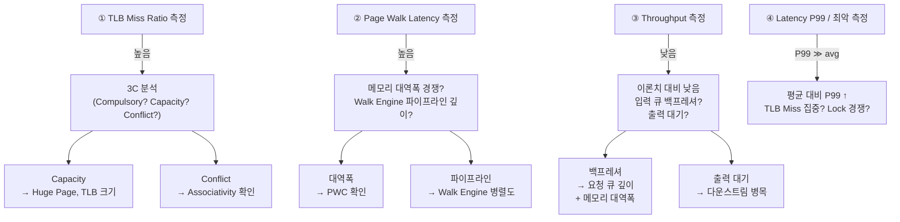

# Module 05 — Performance Analysis

<!-- DV-SKOOL-CH-CTX:start -->
<div class="chapter-context" data-cat="memory">
  <a class="chapter-back" href="../">
    <span class="chapter-back-arrow">←</span>
    <span class="chapter-back-icon">🧭</span>
    <span class="chapter-back-text">MMU</span>
  </a>
  <span class="chapter-divider">›</span>
  <span class="chapter-marker">Module 05</span>
</div>
<!-- DV-SKOOL-CH-CTX:end -->

<!-- DV-SKOOL-CH-TOC:start -->
<div class="page-toc">
  <span class="page-toc-label">목차</span>
  <a class="page-toc-link" href="#1-why-care-이-모듈이-왜-필요한가">1. Why care?</a>
  <a class="page-toc-link" href="#2-intuition-교통-체증-비유와-한-장-그림">2. Intuition</a>
  <a class="page-toc-link" href="#3-작은-예-1m-translation-에서-tlb-miss-ratio-3-2-가-실제로-어떻게-나타나는가">3. 작은 예 — 1M trans 의 latency 분포</a>
  <a class="page-toc-link" href="#4-일반화-3-지표-dual-reference-model-3c">4. 일반화 — 3 지표 + 3C</a>
  <a class="page-toc-link" href="#5-디테일-pwc-impact-uvm-perf-monitor-bottleneck-진단-server-grade-요구">5. 디테일</a>
  <a class="page-toc-link" href="#6-흔한-오해-와-dv-디버그-체크리스트">6. 흔한 오해 + DV 디버그 체크리스트</a>
  <a class="page-toc-link" href="#7-핵심-정리-key-takeaways">7. 핵심 정리</a>
</div>
<!-- DV-SKOOL-CH-TOC:end -->

!!! objective "학습 목표"
    이 모듈을 마치면:

    - **Calculate** TLB hit rate, miss penalty, page walk cost 를 측정값으로부터 계산할 수 있다.
    - **Apply** Dual-Reference Model (Ideal vs DUT) 로 성능 갭을 분석할 수 있다.
    - **Distinguish** 평균 vs P99 / P99.9 latency 를 측정하고 tail latency 가 의미하는 것을 해석할 수 있다.
    - **Identify** Performance bottleneck 의 원천 (TLB miss, walk depth, memory bandwidth) 을 분리할 수 있다.
    - **Design** UVM Performance Monitor 를 통한 실시간 성능 데이터 수집 구조를 설계할 수 있다.

!!! info "사전 지식"
    - [Module 01-04](01_mmu_fundamentals.md)
    - 통계 기본 (평균, percentile, histogram)

---

## 1. Why care? — 이 모듈이 왜 필요한가

### 1.1 시나리오 — _0.1% miss ratio_ 의 SLA 위반

당신은 100 Gbps NIC. _Functional_ 검증 모두 통과. 그런데 _운영_ 시 throughput _100 Gbps_ 가 아닌 _80 Gbps_.

추적:
- TLB miss ratio: **0.5%** (vs ideal 0.1%).
- Miss penalty: page walk ~400 ns.
- 평균: hit 1 ns × 99.5% + miss 400 ns × 0.5% = **3 ns/translation**.
- 64 byte packet @ 100 Gbps = _150 M translations/sec_.
- 3 ns/trans → 동시 _3 nsec × 150M = 450 M cycle/sec_ TLB activity.
- TLB bandwidth 한계 도달 → throughput cap _80 Gbps_.

**0.1% miss ratio** vs **0.5%** 차이가 _20 Gbps_ SLA 위반.

검증 시 _functional pass_ 만 보지 말고 _miss ratio 측정_ + _ideal 대비 비교_ 필수.

**MMU 성능 검증은 functional verification 보다 미묘**합니다. PASS/FAIL 이 아니라 _"Ideal 대비 얼마나 효율적인가"_ 를 정량 분석. 100 Gbps NIC / SmartNIC 가속기는 64 byte packet 기준 **150 M+ translations/sec** 를 요구하고, miss ratio 0.1% 차이가 throughput SLA 를 좌우합니다.

**Dual-Reference Model** (Functional + Ideal) 은 이력서의 시그니처 패턴 — Ideal 을 기준으로 DUT 성능 갭을 _자동_ 측정해 시뮬레이션에서 회귀를 잡습니다. P99 tail latency 는 평균만 봐선 보이지 않는 SLA 위반의 실제 원인. 이 모듈을 못 잡으면 검증이 _"되긴 한다"_ 단계에서 멈추고, _"충분히 빠른가"_ 단계로 못 넘어갑니다.

---

## 2. Intuition — 교통 체증 비유와 한 장 그림

!!! tip "💡 한 줄 비유"
    **MMU 성능 = 도시의 교통량**. TLB hit rate 95% 는 _대로의 95% 가 신호 없이 통과_, 5% 는 _신호등 4번 + 사거리 4번 (page walk)_. 평균만 보면 _"잘 흐른다"_ 지만 사거리 한 번이 평균의 800 배라 **상위 1% (P99)** 에서 급격히 막힘. **Tail latency = 도심 출퇴근 시간** — 평균은 20 분이어도 P99 는 2 시간.

### 한 장 그림 — Latency 분포가 정상이라면

```
     count
       ▲                                 (logarithmic 비슷한 분포)
       │  ▓▓▓▓▓▓▓▓▓▓▓▓▓ (90%)  ← μTLB hit (1 cycle)
       │  ▓▓▓▓▓▓▓▓▓▓▓▓▓
       │  ▓▓▓▓▓▓▓▓▓▓▓▓▓
       │  ▓▓▓▓▓▓▓▓▓▓▓▓▓
       │  ▓▓▓▓▓▓▓▓▓▓▓▓▓
       │       ▒▒▒▒▒    (8%)   ← L2 TLB hit (3-5 cycle)
       │       ▒▒▒▒▒
       │            ░░░ (1.5%) ← walk + PWC (~수십)
       │              ─── (0.4%) ← walk + PWC miss (~수백)
       │                ─        ← walk + memory contention (>400)
       │                          ↑
       │                       이 꼬리가 P99/P99.9 → SLA 결정
       └────────────────────────────────────────────────▶ latency
```

### 왜 평균은 거짓말을 하는가 — Design rationale

세 가지가 동시에 일어납니다.

1. **Hit/Miss 의 두 봉우리 (bimodal)**: 평균은 두 봉우리의 _가중 평균_ — 어느 한 쪽 정보를 잃습니다.
2. **꼬리는 수가 적지만 _효과는 큼_**: P99 1 trans 의 400 ns 가 P50 1000 trans 의 0.5 ns 와 _같은 영향_.
3. **꼬리가 _SLA_ 를 결정**: 서버 워크로드는 worst-case latency 가 SLO/SLA 의 척도. 평균 latency 좋은 시스템도 tail 이 나쁘면 _service degradation_ 으로 간주.

이 세 가지의 교집합이 "평균 + P99 + P99.9 + Histogram" 의 _multi-metric_ 측정을 강제합니다.

---

## 3. 작은 예 — 1M translation 에서 TLB miss ratio 3.2% 가 실제로 어떻게 나타나는가

가장 단순한 시나리오. DUT MMU 가 1,000,000 회의 random VA translation 을 처리. 측정 결과를 Ideal Model 과 비교하여 _성능 갭_ 의 root cause 를 추적합니다.

### 측정 raw data

```
   1M random VA translations, 4 KB granule, ASID=다양

   DUT 측정:                                Ideal Model:
   ──────────────────────                    ──────────────────────
   μTLB hit:        850,000                   μTLB hit:      950,000
   L2 TLB hit:      118,000                   L2 TLB hit:     45,000
   Page walk:        32,000                   Page walk:       5,000
   ─────────────────────                     ─────────────────────
   TLB miss ratio:   3.2%                    TLB miss ratio:  0.5%
   avg latency:      5.8 cycle                avg latency:    1.2 cycle
   P99 latency:      48 cycle                  P99 latency:    8 cycle
   P99.9 latency:    420 cycle                 P99.9 latency:  120 cycle
   throughput:       0.62 req/cycle           throughput:     0.95 req/cycle
```

### Histogram — DUT 의 latency 분포

```
   Cycles | Count    | %     | Source
   -------+----------+-------+------------------
   1      | 850,000  | 85.0% | μTLB hit
   3-5    | 118,000  | 11.8% | L2 TLB hit
   20-50  |  25,000  |  2.5% | Page walk + PWC hit
   100-400|   6,500  |  0.65%| Page walk + PWC miss
   >400   |     500  |  0.05%| Walk + 메모리 경쟁
   -------+----------+-------+------------------
   total  |1,000,000 | 100%  |
```

### 진단 단계

```
   ① Functional 비교: DUT.PA == FuncModel.PA?
        → 모든 1M trans 일치 ✓ (정확성 OK)

   ② Performance 비교: DUT vs Ideal
        miss_ratio_gap = 3.2% / 0.5% = 6.4×       ← 6.4 배 높음 ⚠
        avg_latency_gap = 5.8 / 1.2 = 4.8×
        P99_gap        = 48 / 8 = 6.0×
        P99.9_gap      = 420 / 120 = 3.5×

   ③ 3C 분석으로 miss 원인 분류
        - Compulsory: cold miss (TLB 첫 채움) — 약 3%
        - Capacity:   working set > TLB capacity — 약 60%   ← 주범
        - Conflict:   set-assoc 충돌 — 약 37%

   ④ 마이크로아키텍처 가설
        - L2 TLB capacity 가 working set 대비 작다
        - 또는 set-associativity 가 부족 (4-way → 8-way 필요?)
        - 또는 replacement policy 가 random VA 패턴에 약한 PLRU

   ⑤ Re-spin: TLB associativity 4 → 8 way 변경 후 재측정
        → miss ratio 3.2% → 1.1%, P99 48 → 18 cycle
        → server-grade SLA 충족
```

### 단계별 의미

| Step | 누가 | 무엇 | 왜 |
|---|---|---|---|
| ① | Scoreboard | DUT.PA 와 FuncModel.PA 비교 | 정확성 — 모든 trans 일치해야 (필수) |
| ② | Performance scoreboard | DUT 와 Ideal 의 miss/latency 비율 | 정확성과 _독립적_ 인 차원 — 100% 정확해도 너무 느릴 수 있음 |
| ③ | 분석가 | miss 들을 3C 로 분류 (Compulsory/Capacity/Conflict) | 어떤 _구조_ 변경이 효과적인지 결정 |
| ④ | 분석가 | replacement / capacity / associativity 가설 | "TLB 키워라" 가 아니라 _어느_ axis 를 바꿀지 |
| ⑤ | Re-spin | RTL 파라미터 변경 후 재측정 | Dual-reference 가 자동 회귀 검출 |

!!! note "여기서 잡아야 할 두 가지"
    **(1) 정확성과 성능은 _다른 axis_ 다.** PA 가 모두 정확해도 P99 가 SLA 를 어기면 production 에서 _장애_. Functional model 만으로는 이 axis 를 못 잡습니다 — Ideal Performance Model 이 두 번째 reference. <br>
    **(2) 평균은 4.8× 차이지만 P99 는 6.0×, P99.9 는 3.5×** — 꼬리가 _다른 비율_ 로 움직임. P99 가 더 나쁘다는 건 _간헐적_ 병목 (capacity miss burst) 이 있다는 신호. P99.9 가 P99 와 비례하지 않으면 _다른 root cause_ (memory bandwidth contention) 가능성.

---

## 4. 일반화 — 3 지표, Dual-Reference Model, 3C

### 4.1 성능 지표 3가지

#### TLB Miss Ratio

```
TLB Miss Ratio = TLB Miss 횟수 / 전체 변환 요청 수

예시:
  전체 요청: 1,000,000
  TLB Hit:     990,000
  TLB Miss:     10,000
  Miss Ratio = 10,000 / 1,000,000 = 1%

  1%가 작아 보이지만:
  T_eff = 0.99 × 0.5ns + 0.01 × 400ns = 4.5ns
  → TLB 없을 때 (400ns) 대비 89배 빠르지만
  → TLB Miss = 0일 때 (0.5ns) 대비 9배 느림
```

#### Translation Latency

```
요청 → 변환 완료까지의 시간:

  TLB Hit Latency:     1~2 cycles
  L2 TLB Hit Latency:  3~5 cycles
  Page Walk Latency:   수십~수백 cycles (메모리 접근 의존)

  측정 포인트:
    - Request valid → Response valid 간격
    - Page Walk 시작 → 완료 간격
    - 평균 / P99 / 최악 지연
```

#### Throughput (처리량)

```
단위 시간당 처리 가능한 변환 요청 수:

  이상적: 매 cycle 1개 변환 (파이프라인 완전 활용)
  실제: TLB Miss, Page Walk 대기, 메모리 대역폭 경쟁으로 감소

  측정:
    Throughput = 처리된 변환 수 / 총 소요 시간
    Ideal Throughput = 1 / TLB Hit Latency (파이프라인 기준)
```

### 4.2 Dual-Reference Model (이력서 핵심)

#### 왜 모델이 두 개 필요한가?

```
문제:
  "DUT가 올바르게 동작하는가?" → Functional Model로 확인
  "DUT가 충분히 빠른가?"     → Functional Model만으로는 판단 불가

  Functional Model: 정답만 제공 (PA가 맞는가?)
  → 성능 기준(얼마나 빨라야 하는가?)은 제공하지 않음

해결: Dual-Reference Model
  1. Functional Model: 비트 정확한 변환 결과 비교 (정확성)
  2. Ideal Performance Model: 이론적 성능 상한 제공 (성능 기준)
```

#### 모델 구조

```d2
direction: down

REQ: "Translation Request\n(VA, size, type)"
DUT: "DUT (RTL)"
FUNC: "Functional Model"
IDEAL: "Ideal Perf Model"
OUT_D: "PA + Latency"
OUT_F: "PA (Golden)"
OUT_I: "PA + Min Latency"
SB: "Scoreboard\n① DUT.PA == Functional.PA? (정확성)\n② DUT.Latency ≤ Ideal.Latency × K? (성능)\n③ DUT.MissRatio vs Ideal.MissRatio (효율)"
REQ -> DUT
DUT -> OUT_D
OUT_D -> SB
REQ -> FUNC
FUNC -> OUT_F
OUT_F -> SB
REQ -> IDEAL
IDEAL -> OUT_I
OUT_I -> SB
```

#### Functional Model vs Ideal Performance Model

| 항목 | Functional Model | Ideal Performance Model |
|------|-----------------|------------------------|
| 목적 | 변환 정확성 검증 | 성능 상한 기준 제공 |
| TLB 모델 | 있음 (DUT와 동일 크기/정책) | 무한 TLB (Miss = 0) 또는 이론 최적 |
| Page Walk | 실제 Walk 시뮬레이션 | 즉시 완료 (0-cycle Walk) |
| 출력 | PA + 권한 | PA + 최소 가능 Latency |
| 비교 기준 | DUT PA == Model PA (반드시 일치) | DUT Latency / Model Latency (비율) |

#### 성능 갭 분석 (이력서 직결)

```
DUT vs Ideal Model 비교:

  시나리오: 1M 랜덤 주소 변환 요청

  Ideal Model:
    TLB Miss Ratio: 0.5% (무한 TLB가 아닌, 이론적 최적 교체)
    Avg Latency: 1.2 cycles
    Throughput: 0.95 req/cycle

  DUT 결과:
    TLB Miss Ratio: 3.2% (← 6.4배 높음!)
    Avg Latency: 5.8 cycles
    Throughput: 0.62 req/cycle

  분석:
    Miss Ratio 갭이 큼 → TLB 교체 정책 또는 크기 문제
    Latency 갭 → Page Walk Engine 병목 또는 메모리 대역폭 경쟁
    Throughput 갭 → 파이프라인 Stall 발생

  → 마이크로아키텍처 분석으로 root cause 특정
```

**면접 답변 준비**:

**Q: Dual-Reference Model 을 어떻게 활용했나?**
> "두 가지 Reference Model을 만들었다. (1) Functional Model — DUT와 동일한 TLB/Page Walk을 모델링하여 비트 정확한 변환 결과를 비교. (2) Ideal Performance Model — 이론적 최적 성능(최소 Miss Ratio, 최소 Latency)을 정의하여 DUT 성능의 상한 기준을 제공. DUT를 두 모델과 비교하여 'TLB Miss Ratio가 이론치의 6배'라는 성능 갭을 발견했고, 마이크로아키텍처 분석으로 교체 정책의 비효율을 특정하여 서버급 처리량 요구사항을 충족시켰다."

### 4.3 TLB Miss 의 3C 분류

| 원인 | 설명 | 대응 |
|------|------|------|
| **Compulsory** (Cold) | 첫 접근 — 캐시에 없으므로 필연적 Miss | Prefetch로 완화 |
| **Capacity** | TLB 크기 부족 — 워킹셋이 TLB보다 큼 | TLB 크기 증가 또는 Huge Page |
| **Conflict** | Set-associative 충돌 — 같은 set에 경쟁 | Associativity 증가 |

### 4.4 트래픽 패턴별 예상 Miss Ratio

| 패턴 | 설명 | 예상 Miss Ratio |
|------|------|----------------|
| Sequential | 연속 주소 접근 (DMA) | 매우 낮음 (같은 페이지 내 반복) |
| Stride | 고정 간격 접근 | 간격 의존 (페이지 경계 넘는 빈도) |
| Random | 완전 랜덤 주소 | 높음 (워킹셋/TLB 크기 비율 의존) |
| Hotspot | 소수 영역 집중 | 낮음 (핫 엔트리가 TLB에 유지) |

---

## 5. 디테일 — PWC impact, UVM Perf Monitor, Bottleneck 진단, Server-grade 요구

### 5.1 Page Walk Cache (PWC) 성능 영향

```
PWC가 Walk Latency에 미치는 영향 — 구체적 수치:

  4-level Walk, DRAM 100ns/access:

  PWC 없음:         4 × 100ns = 400ns
  L0 Hit:           3 × 100ns = 300ns (25% 감소)
  L0+L1 Hit:        2 × 100ns = 200ns (50% 감소)
  L0+L1+L2 Hit:     1 × 100ns = 100ns (75% 감소)

  실제 워크로드에서 PWC 효과 (512-entry TLB, 16-entry PWC):
    순차 4KB 접근: PWC Hit Rate ~95% → 평균 Walk ~120ns
    랜덤 접근:     PWC Hit Rate ~30% → 평균 Walk ~310ns
    Stride 1MB:    PWC Hit Rate ~60% → 평균 Walk ~240ns

  → PWC는 TLB Miss 발생 시의 penalty를 줄이는 "2차 방어선"
  → TLB 크기 + PWC 크기의 조합이 전체 성능을 결정
```

### 5.2 Performance Counter 수집 (UVM)

```systemverilog
class mmu_perf_monitor extends uvm_component;

  // 카운터
  int unsigned total_requests;
  int unsigned tlb_l1_hits;
  int unsigned tlb_l2_hits;
  int unsigned tlb_misses;
  int unsigned page_walks;
  int unsigned walk_cycles_total;   // Walk 총 소요 사이클
  int unsigned faults;

  // Latency 히스토그램 (bin별 카운트)
  int unsigned latency_hist[int];   // key=cycle수, value=횟수

  // 실시간 수집 (모니터에서 호출)
  function void record_translation(mmu_result_t result);
    total_requests++;
    case (result.source)
      TLB_L1_HIT: tlb_l1_hits++;
      TLB_L2_HIT: tlb_l2_hits++;
      PAGE_WALK: begin
        tlb_misses++;
        page_walks++;
        walk_cycles_total += result.latency;
      end
    endcase
    if (result.fault != NO_FAULT) faults++;
    latency_hist[result.latency]++;
  endfunction

  // 성능 리포트 출력
  function void report_phase(uvm_phase phase);
    real miss_ratio = real'(tlb_misses) / total_requests * 100.0;
    real avg_walk = (page_walks > 0) ?
                    real'(walk_cycles_total) / page_walks : 0;
    real throughput = real'(total_requests) / sim_cycles;

    `uvm_info("PERF", $sformatf(
      "\n=== MMU Performance Report ===\n"
      "Total Requests:  %0d\n"
      "L1 TLB Hit Rate: %.2f%%\n"
      "L2 TLB Hit Rate: %.2f%%\n"
      "TLB Miss Ratio:  %.3f%%\n"
      "Avg Walk Latency: %.1f cycles\n"
      "Throughput:       %.3f req/cycle\n"
      "Faults:          %0d",
      total_requests,
      real'(tlb_l1_hits)/total_requests*100,
      real'(tlb_l2_hits)/total_requests*100,
      miss_ratio, avg_walk, throughput, faults
    ), UVM_LOW)
  endfunction

endclass
```

### 5.3 Latency 분포 분석

```
Latency Histogram 예시 (1M 트랜잭션 후):

  Cycles | Count    | Percentage | Meaning
  -------+----------+------------+------------------
  1      | 890,000  | 89.0%      | L1 TLB Hit
  3-5    |  80,000  |  8.0%      | L2 TLB Hit
  20-50  |  25,000  |  2.5%      | Page Walk (PWC Hit)
  100-400|   4,500  |  0.45%     | Page Walk (PWC Miss)
  >400   |     500  |  0.05%     | Walk + 메모리 경쟁

  분석 포인트:
  - Bimodal 분포 확인: Hit(1 cycle)과 Miss(수십~수백 cycle) 두 봉우리
  - P99 Latency: 상위 1% = ~50 cycles → Walk + PWC 영역
  - Tail Latency (P99.9): ~400 cycles → 메모리 대역폭 경쟁 의심
  - 평균 vs P99 비율이 10배 이상 → 간헐적 병목 존재
```

### 5.4 Ideal Model 과 DUT 비교 자동화

```
Scoreboard에서 자동 성능 비교:

  foreach transaction:
    ideal_latency = ideal_model.translate(va).latency;
    dut_latency   = dut_result.latency;

    perf_ratio = real'(dut_latency) / ideal_latency;

    // 성능 임계값 체크
    if (perf_ratio > PERF_THRESHOLD)  // 예: 2.0x
      `uvm_warning("PERF",
        $sformatf("VA=0x%h: DUT=%0d cyc, Ideal=%0d cyc, ratio=%.1fx",
                  va, dut_latency, ideal_latency, perf_ratio))

  최종 리포트:
    avg_perf_ratio, max_perf_ratio, P99_perf_ratio
    → "DUT는 Ideal 대비 평균 1.3x, P99에서 2.1x" 형태로 정량화
```

### 5.5 성능 병목 진단 프로세스



### 5.6 서버급 HW 가속기의 성능 요구사항 (이력서 연결)

```
서버용 HW 가속기 (NPU, SmartNIC 등):

  요구사항:
  - 100Gbps+ 네트워크 트래픽 처리
  - 패킷당 주소 변환 필요
  - 작은 패킷 (64B) 기준 ~150M 패킷/초

  MMU 성능 요구:
  - Throughput: 150M+ translations/sec
  - Latency: 수 μs 이내 (패킷 처리 지연에 직접 영향)
  - TLB Miss Ratio: < 0.1% (Miss 한 번 = 수백 ns 지연)

MangoBoost MMU IP 맥락:
  - TCP Offload Engine + DCMAC 서브시스템
  - 고대역폭 HW 가속기용 MMU
  - TLB Miss Ratio가 서버급 처리량 요구사항을 위협
  → Dual-Reference Model로 성능 갭 발견 + 최적화
```

---

## 6. 흔한 오해 와 DV 디버그 체크리스트

### 흔한 오해

!!! danger "❓ 오해 1 — 'TLB 만 키우면 성능이 항상 향상된다'"
    **실제**: TLB 가 너무 크면 _lookup latency_ 자체가 증가합니다 (associative search 의 한계). modern CPU 는 L1 TLB (작고 빠름) + L2 TLB (크고 느림) hierarchy 로 _search latency vs miss penalty_ 의 trade-off 를 분산합니다. 단순한 "TLB 두 배" 는 critical path 를 침해해 IPC 저하.<br>
    **왜 헷갈리는가**: "cache 큰 게 무조건 좋다" 의 직관.

!!! danger "❓ 오해 2 — '평균 latency 만 좋으면 성능이 좋다'"
    **실제**: 서버 워크로드의 SLA 는 _P99 / P99.9_ 의 tail latency 가 결정합니다. 평균이 3 cycle 이라도 P99 가 200 cycle 이면 상위 1% trans 가 _40,000 ns_ 의 지연 — RPC timeout / queue overflow 유발. 평균이 _숨기는_ 정보.<br>
    **왜 헷갈리는가**: 단일 지표로 요약하려는 본능.

!!! danger "❓ 오해 3 — 'Miss ratio 1% 면 무시해도 되는 수준'"
    **실제**: T_eff = 0.99 × 0.5 + 0.01 × 400 = **4.5 ns**, T_eff(0%) = 0.5 ns → _9 배 느려짐_. 100 Gbps NIC 에서 1% miss = 1.5 M miss/sec × 400 ns = 600 ms/sec 의 walk 부담 → 파이프라인 stall. 1% 는 _작아 보이지만_ 800-배 latency 차이 때문에 영향이 비례 이상.<br>
    **왜 헷갈리는가**: 1% 의 직관적 작음.

!!! danger "❓ 오해 4 — 'PWC = TLB 의 일부'"
    **실제**: PWC 는 _intermediate-level PTE_ (next-level table 주소) 를 캐싱하는 _별도_ 구조. TLB 는 (VA → PA) 의 _최종_ 매핑을 캐싱. 둘은 invalidation 정책이 다를 수 있고, capacity 도 따로 측정해야 합니다 (PWC hit rate vs TLB hit rate).<br>
    **왜 헷갈리는가**: 둘 다 walk 비용을 줄이는 보조 캐시.

!!! danger "❓ 오해 5 — 'Throughput 이 높으면 latency 도 좋다'"
    **실제**: 둘은 _다른 차원_. Pipeline 이 깊으면 throughput 은 높아도 single-trans latency 는 길어질 수 있음. 또 throughput 이 한도에 닿으면 _큐 대기_ 로 latency 가 폭발 (M/M/1 큐의 latency = 1/(μ-λ)). 0.95 utilization 이 넘어가면 _작은 입력 증가_ 가 _큰 latency 증가_.<br>
    **왜 헷갈리는가**: "빠르다" 라는 단어가 둘 다 가리켜서.

### DV 디버그 체크리스트 (이 모듈 내용으로 마주칠 첫 실패들)

| 증상 | 1차 의심 | 어디 보나 |
|---|---|---|
| Avg latency 는 spec 안인데 P99 가 3 배 초과 | Capacity miss burst (working set spike) | latency histogram 의 bimodal, miss-rate vs time |
| Throughput 이 0.7 req/cycle 정체 (이상 0.95) | Walk engine 의 single-port 병목 | walk engine 의 outstanding 카운터, queue 깊이 |
| Miss ratio 가 모든 test 에서 동일하게 높음 | TLB capacity 자체가 working set 보다 작음 | UVM perf monitor 의 hit/miss 비율, working set 측정 |
| Random pattern 만 P99 가 폭발 | Conflict miss (set-assoc 부족) | TLB set 분포 dump, 같은 set 의 충돌 빈도 |
| ASID rollover 직후 1 ms 동안 cold miss | OS 의 ASID alloc strategy + TLB 전체 flush | ASID alloc 로그, TLBI ALL 발행 시점 |
| 주기적인 latency spike (1 ms 마다) | 다른 master 의 memory bandwidth 경쟁 | bus monitor, walk 시 memory access latency 분포 |
| PWC hit rate 가 spec 보다 낮음 | PWC capacity 부족 또는 invalidation 빈번 | PWC counter, TLBI 발행 빈도 |
| Stage 2 활성화 시 throughput 절반 | nested walk (S1 PTE 도 S2 walk) 비용 | combined walk count vs S1-only count |

!!! warning "실무 주의점 — ASID 고갈 시 전체 TLB Flush로 성능 절벽"
    **현상**: 프로세스를 빠르게 생성/종료하는 워크로드에서 주기적으로 TLB Miss Rate가 급등하고 처리량이 수십% 하락.

    **원인**: 8-bit ASID(256개) 또는 16-bit ASID(65536개)가 소진되면 OS는 ASID를 재활용하기 위해 전체 TLB Flush(`TLBI VMALLE1`)를 수행함. 이때 모든 코어의 TLB 엔트리가 무효화되어 대규모 Cold Miss가 발생. 컨테이너/VM 환경에서 ASID 소비 속도가 예상보다 훨씬 빠를 수 있음.

    **점검 포인트**: 성능 저하 주기와 ASID 재활용 주기 일치 여부 확인. PMU 카운터에서 `L1D_TLB_REFILL` 이벤트 급증 시점과 TLBI 명령 발행 로그 타임스탬프 비교.

---

## 7. 핵심 정리 (Key Takeaways)

- **MMU 성능 = TLB Hit Rate × Throughput × Latency** 의 함수. 단일 지표로 요약 불가 — 다차원 측정 필수.
- **Dual-Reference Model**: Ideal (완벽한 walk + TLB) vs DUT 비교. Performance Ratio 임계값 (2×) 초과 시 회귀.
- **TLB miss penalty**: walk N levels × memory access cost. PWC 가 hit 면 1-2 access 로 줄어듦.
- **Tail latency (P99 / P99.9)**: 평균은 간헐 병목 가림. SLA 위반은 tail 에서 발생. 반드시 histogram + P99 + P99.9 측정.
- **Bottleneck 분리**: TLB miss / walk depth / memory bandwidth — 각각 측정해 root cause 특정.
- **UVM Performance Monitor**: trans 별 latency / hit 소스 / walk count 실시간 수집 + histogram + 자동 회귀.

### 7.1 자가 점검

!!! question "🤔 Q1 — P99 vs P50 측정 (Bloom: Analyze)"
    Latency P50 = 5 ns, P99 = 50 ns. 의미는?

    ??? success "정답"
        - 50% 의 translation 이 _5 ns 이하_ (TLB hit, ~1 cycle).
        - 99% 의 translation 이 _50 ns 이하_ (TLB miss → 1-2 mem access).
        - 1% (P100) 이 _50 ns 초과_ → page walk full depth + PWC miss.

        SLA: P99 50 ns 가 _허용_ 이면 OK. _요구 sub-10 ns_ 면 TLB 크기 / 정책 개선 필요.

!!! question "🤔 Q2 — TLB miss penalty 분해 (Bloom: Evaluate)"
    Penalty 400 ns. 어떻게 분해?

    ??? success "정답"
        ARMv8 4-level walk:
        - L0/L1/L2/L3 각각 _1 memory access_ (PWC miss 시) = 4 × 100 ns = 400 ns.
        - PWC hit 시 (예: L0/L1 cached): 2 × 100 ns = 200 ns.

        Optimization:
        - **Huge page**: walk depth 3 → 300 ns.
        - **PWC 크기 ↑**: 더 많은 intermediate cache.
        - **Memory access latency ↓**: caching, prefetch.

### 7.2 출처

**External**
- *Performance Implications of Extended Page Tables* — research paper
- ARM PMU (Performance Monitoring Unit) documentation

---
## 다음 단계

- 📝 [**Module 05 퀴즈**](quiz/05_performance_analysis_quiz.md)
- ➡️ [**Module 06 — MMU DV Methodology**](06_mmu_dv_methodology.md): 지금까지의 _측정_ 을 _체계적인 검증 환경_ 으로 — Custom Thin VIP, SVA bind, Constrained Random.

<div class="chapter-nav">
  <a class="nav-prev" href="../04_iommu_smmu/">
    <div class="nav-label">◀ 이전</div>
    <div class="nav-title">IOMMU / SMMU — SoC에서의 MMU</div>
  </a>
  <a class="nav-next" href="../06_mmu_dv_methodology/">
    <div class="nav-label">다음 ▶</div>
    <div class="nav-title">MMU DV 검증 방법론</div>
  </a>
</div>


--8<-- "abbreviations.md"
