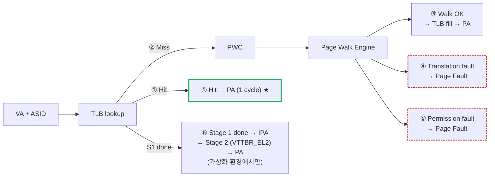

# Module 07 — Quick Reference Card

<!-- DV-SKOOL-CH-CTX:start -->
<div class="chapter-context" data-cat="memory">
  <a class="chapter-back" href="../">
    <span class="chapter-back-arrow">←</span>
    <span class="chapter-back-icon">🧭</span>
    <span class="chapter-back-text">MMU</span>
  </a>
  <span class="chapter-divider">›</span>
  <span class="chapter-marker chapter-quickref-marker">★ Quick Reference</span>
</div>
<!-- DV-SKOOL-CH-CTX:end -->

<!-- DV-SKOOL-CH-TOC:start -->
<div class="page-toc">
  <span class="page-toc-label">목차</span>
  <a class="page-toc-link" href="#1-why-care-이-카드가-왜-필요한가">1. Why care?</a>
  <a class="page-toc-link" href="#2-intuition-한-장으로-보는-mmu">2. Intuition</a>
  <a class="page-toc-link" href="#3-이-카드를-펼쳐야-할-3-시나리오">3. 3 시나리오</a>
  <a class="page-toc-link" href="#4-일반화-카드를-구성하는-축">4. 일반화</a>
  <a class="page-toc-link" href="#5-디테일-표-공식-스토리-체크리스트">5. 디테일</a>
  <a class="page-toc-link" href="#6-이-카드를-봐야-할-때-와-흔한-오해">6. 카드 트리거 + 흔한 오해</a>
  <a class="page-toc-link" href="#7-핵심-정리-key-takeaways">7. 핵심 정리</a>
</div>
<!-- DV-SKOOL-CH-TOC:end -->

!!! objective "사용 목적 / 학습 목표"
    이 카드를 마치면:

    - **Recall** VA → PA 변환 6 path (Hit / Miss / Walk / Fault / Stage2 / ASID) 를 즉시 떠올릴 수 있다.
    - **Identify** TLB miss 디버그 시 가장 먼저 봐야 할 신호 (ASID / TTBR / PTE / ESR) 를 지목할 수 있다.
    - **Apply** 면접 / 코드 리뷰 / 디버그 상황에서 카드 표 1개를 5초 이내에 펼쳐 답변 골격을 만들 수 있다.
    - **Justify** 자기 이력서의 MMU 검증 경험을 카드의 "이력서 연결 포인트" 와 맞춰 설명할 수 있다.

!!! info "사전 지식"
    - [Module 01 — MMU 기본](01_mmu_fundamentals.md) ~ [Module 06 — DV 방법론](06_mmu_dv_methodology.md) 완주 권장
    - 카드 단독 학습 비권장 — 본문에서 한 번 추적한 뒤 카드는 "재호출 트리거" 로 사용

---

## 1. Why care? — 이 카드가 왜 필요한가

MMU 6 모듈을 끝까지 읽고 나면 머릿속에 _path 6개_ (Hit / Miss / Walk / Fault / Stage2 / ASID) 와 _숫자 한 묶음_ (tCL / TLB 800배 / 4-level / 0.99→0.95 = 4.6×) 이 남습니다. 면접에서 30 초, 코드 리뷰에서 1 분, fault log 디버그 중 10 초 안에 그 6 path 중 어느 가지로 들어가야 하는지 _결정_ 해야 합니다.

이 카드는 본문이 아니라 **본문을 다 읽은 뒤의 _index_** 입니다. 그래서 카드의 모든 항목은 "이 줄을 보면 어느 본문 모듈로 점프해야 하는지" 가 1:1 로 매핑됩니다. 카드만 외우면 가짜 마스터리 — 본문을 읽지 않고 카드만 보면 _숫자 외우기_ 함정에 빠집니다.

---

## 2. Intuition — 한 장으로 보는 MMU

!!! tip "💡 한 줄 비유"
    **MMU 마스터 = 변환의 모든 path 인지** ≈ **주소록의 모든 흐름을 머릿속에 가진 도시계획가**

    정상 hit, TLB miss, page fault, stage 2, ASID 변경, TLBI — 이 6 path 의 동작을 즉시 떠올리는 것이 마스터의 indicator. 카드는 그 6 path 가 어디로 흘러가는지 5 초 안에 다시 보여주는 _참조용 지도_.

### 한 장 그림 — VA → PA 6 path



> ⑦ **ASID 변경 시**: 다른 ASID 의 entry 와 공존 (Flush 안 함) — 컨텍스트 스위치 핵심.<br>
> ⑧ **TLBI 호출 시**: 특정 (ASID, VA) / ALL / by-IPA 단위로 invalidate.

### 왜 카드가 6 path 로 정리되는가 — Design rationale

이력서 / 면접 / 디버그 상황에서 마주치는 모든 질문은 결국 _이 6 path 중 어느 가지_ 인지 분류하는 문제로 환원됩니다. "TLB miss 가 왜 800배 느린가?" 는 ②③, "context switch 때 TLB 비싸지 않나?" 는 ⑦, "VM 안에서 syscall 이 왜 느린가?" 는 ⑥, "MMU enable 직후 abort" 는 ④. 카드의 모든 표는 이 6 path 의 어느 슬라이스에 해당하는지 알면 의미가 잡힙니다.

---

## 3. 이 카드를 펼쳐야 할 3 시나리오

본문의 어떤 모듈로 점프해야 하는지 _카드 표가 안내하는_ 가장 흔한 3 실제 상황을 step-by-step 으로 따라갑니다.

### 3.1 시나리오 A — Linux 부팅 중 TLB miss 가 비정상적으로 높다

```
   ┌─ 증상 ─────────────────────────────────────────────────┐
   │  perf stat: dTLB-load-misses / dTLB-loads = 8%         │
   │  (정상 1% 미만, 8× 비정상)                              │
   │  → IPC 가 평소 1.8 → 0.4 로 4.5× 저하                   │
   └────────────────────────────────────────────────────────┘
            │
            ▼
   ┌─ 카드의 어느 표를 펼치는가 ────────────────────────────┐
   │  §5.1 "핵심 정리" 표 → "TLB" 행                        │
   │  → Hit ~1 cycle vs Miss ~400 ns (800배)                │
   │  →  Miss Ratio 변화가 EAT 에 미치는 영향 정량 확인     │
   │                                                         │
   │  §5.3 "성능 공식" → T_eff = Hit·T_hit + Miss·T_miss    │
   │  → 99% → 95% Hit Rate = 4.6× 느려짐                    │
   └────────────────────────────────────────────────────────┘
            │
            ▼
   ┌─ 본문으로 점프할 위치 ─────────────────────────────────┐
   │  Module 03 (TLB) §5  →  3C 분석 (Compulsory / Capacity│
   │                          / Conflict) + Huge Page +     │
   │                          PWC 효과                       │
   │  Module 05 (성능)   →  Miss Ratio 측정 방법            │
   └────────────────────────────────────────────────────────┘
```

| Step | 누가 | 무엇을 | 왜 |
|---|---|---|---|
| ① | 카드 | "TLB Hit/Miss 800배" 숫자 회수 | 8% miss 가 _얼마나_ 치명적인지 정량화 |
| ② | 카드 | §5.3 EAT 공식 회수 | 4.6× 라는 결론을 면접관 앞에서 1줄로 |
| ③ | 본문 | Module 03 §5 (3C 분석) 로 점프 | _원인_ 의 카테고리 결정 (working set vs 충돌) |
| ④ | 본문 | Module 05 (perf 측정) 로 점프 | 측정 도구와 메트릭 (perf, MissRatio counter) |

### 3.2 시나리오 B — 새 process 진입 후 ASID 충돌 의심

```
   ┌─ 증상 ─────────────────────────────────────────────────┐
   │  새 fork() 직후 SIGSEGV — 의도하지 않은 메모리 접근    │
   │  ESR_EL1.EC = 0b100100 (Data Abort lower EL)           │
   │  FAR 가 _다른 process 의 stack 영역_ 을 가리킴          │
   └────────────────────────────────────────────────────────┘
            │
            ▼
   ┌─ 카드의 어느 표를 펼치는가 ────────────────────────────┐
   │  §5.1 "핵심 정리" → "ASID" 행                          │
   │  → 프로세스별 TLB 태깅 → 컨텍스트 스위치 시 Flush 불필요│
   │                                                         │
   │  §5.5 "흔한 실수 표" → "TLB Miss 줄이려면 TLB만 키우면 │
   │       된다" 와 같은 행에서 ASID 격리 누락 가능성 추적  │
   └────────────────────────────────────────────────────────┘
            │
            ▼
   ┌─ 본문으로 점프할 위치 ─────────────────────────────────┐
   │  Module 03 §4 (ASID/VMID 의미)                         │
   │  Module 06 §6 (DV 디버그) — ASID rollover 시 stale TLB │
   └────────────────────────────────────────────────────────┘
```

| Step | 누가 | 무엇을 | 왜 |
|---|---|---|---|
| ① | 카드 | ASID 의 역할 (per-process tag) 회수 | _전제_ 점검: ASID 가 비어 있으면 stale entry 적용 |
| ② | 본문 | Module 03 §4 로 점프 | ASID rollover 시 OS 가 TLBI 호출 의무 |
| ③ | 본문 | Module 06 §6 (디버그) 로 점프 | TLBI ASIDE1 호출 누락 / mid-flight ASID 교체 패턴 |

### 3.3 시나리오 C — IOMMU 가 device DMA 를 reject

```
   ┌─ 증상 ─────────────────────────────────────────────────┐
   │  PCIe device 의 DMA write 가 IOMMU 에서 차단           │
   │  SMMU event log: TRANSLATION_FAULT @ stage=1           │
   │  StreamID=0x82, IOVA=0x1_0000_0000                     │
   └────────────────────────────────────────────────────────┘
            │
            ▼
   ┌─ 카드의 어느 표를 펼치는가 ────────────────────────────┐
   │  §5.1 "핵심 정리" → "IOMMU/SMMU" 행                    │
   │  → 디바이스용 MMU: StreamID 로 격리, DMA 보호          │
   │                                                         │
   │  §5.4 "면접 골든 룰" #5 IOMMU                          │
   │  → DMA 보호 + 디바이스 격리 + 가상 연속 매핑           │
   │                                                         │
   │  §5.5 "흔한 실수" → "IOMMU 는 보안용이다" 행 (불완전)  │
   └────────────────────────────────────────────────────────┘
            │
            ▼
   ┌─ 본문으로 점프할 위치 ─────────────────────────────────┐
   │  Module 04 (IOMMU/SMMU) §3, §4 — Stage1 vs Stage2 표  │
   │  Module 04 §5 — PCIe ATS/PRI 와 SVM                    │
   └────────────────────────────────────────────────────────┘
```

| Step | 누가 | 무엇을 | 왜 |
|---|---|---|---|
| ① | 카드 | IOMMU 의 3축 (보안+격리+가상 연속) 회수 | _어느 축_ 의 실패인지 결정 (이 경우 격리 / Stream Table) |
| ② | 본문 | Module 04 §3-4 로 점프 | StreamID → S1CDMax → CD → PTE chain 디버그 |
| ③ | 본문 | Module 04 §5 (ATS) 로 점프 | device 가 ATC 캐싱 중인지, PRI 활성 여부 |

!!! note "여기서 잡아야 할 두 가지"
    **(1) 카드는 _증상 → 표 위치 → 본문 위치_ 의 3-hop 인덱스다.** 카드만 보고 결론을 내면 인덱스를 답으로 착각하는 함정에 빠집니다. <br>
    **(2) 시나리오마다 _숫자 한 개 + 표 한 개_ 만 회수해도 충분.** 면접 30 초 / 디버그 10 초 안에 모든 표를 떠올릴 필요는 없고, _어느 표를 펼칠지_ 만 결정하면 됩니다.

---

## 4. 일반화 — 카드를 구성하는 축

이 카드의 모든 표는 _세 축_ 으로 분류됩니다.

| 축 | 표 ID | 무엇을 인덱싱하는가 |
|---|---|---|
| **개념 회상축** | §5.1 핵심 정리, §5.2 면접 골든 룰 | 본문의 한 줄 결론 (path 6개의 _이름_) |
| **공식 / 수치축** | §5.3 성능 공식, §5.4 면접 골든 룰 수치 | 800× / 4.6× / 150M trans/sec 같은 _숫자_ |
| **스토리축** | §5.6 이력서 연결, §5.7 면접 스토리 흐름 | _경험_ 을 골든 룰에 맞춰 진술하는 frame |

면접에서는 _개념축 → 수치축 → 스토리축_ 순서로 답변이 흘러가야 면접관의 follow-up 이 쉬워집니다. 카드는 이 흐름의 _3-hop_ 을 한 페이지에 모아두었습니다.

```
   ① 질문 도착 ─▶ ② 카드 펼침 ─▶ ③ 본문 점프
   ────────────   ─────────────   ─────────────
   "TLB miss 의   §5.1 800× 행    Module 03 §5
    파급 효과?"   §5.3 EAT 공식   3C 분석
                                  Huge Page
   30 초          5 초             1 분
```

---

## 5. 디테일 — 표, 공식, 스토리, 체크리스트

### 5.1 주소 변환 한줄 요약 + 핵심 정리

```
VA → [TLB Hit? → PA] or [TLB Miss → Page Walk (L0→L1→L2→L3) → PA → TLB 캐싱]
```

| 주제 | 핵심 포인트 |
|------|------------|
| MMU 기능 | 주소 변환(VA→PA) + 권한 검사(R/W/X) + 캐시 속성 제어 |
| Page 단위 | VPN만 변환, Offset(하위 비트)은 그대로 통과 |
| Multi-level PT | 4-level (64-bit): 사용 영역만 하위 테이블 할당 → 메모리 절약 |
| TLB | 변환 캐시: Hit ~1 cycle vs Miss ~400 ns (800배 차이) |
| TLB 설계 | Split(I/D 분리) L1 + Unified L2, Pseudo-LRU 교체 |
| Page Walk Cache | 중간 레벨 PTE 캐싱 → Walk 비용 40~60% 감소 |
| ASID | 프로세스별 TLB 태깅 → 컨텍스트 스위치 시 TLB Flush 불필요 |
| IOMMU/SMMU | 디바이스용 MMU: StreamID로 격리, DMA 보호 |
| PCIe ATS/PRI | 디바이스측 ATC 캐싱 + Page Fault 시 OS 협력 → SVM 기반 |
| 2-Stage | S1(VA→IPA) + S2(IPA→PA): 최악 20번 메모리 접근 |
| Page Fault | Invalid/Permission/Not-Present → OS Handler → 재실행 |
| COW | fork() 최적화: RO 공유 → Write 시 Permission Fault → 복사 |
| 성능 지표 | TLB Miss Ratio, Translation Latency, Throughput |
| MMU Enable | SCTLR.M=1, Identity Mapping 필수, ISB로 파이프라인 동기화 |
| TrustZone | Secure/Normal 독립 Translation, PTE NS bit로 메모리 분리 |

!!! warning "실무 주의점 — Identity Mapping 범위 부족으로 MMU Enable 후 즉시 Fault"
    **현상**: MMU를 Enable하는 순간 CPU가 Prefetch Abort 또는 Data Abort로 즉시 멈춤.

    **원인**: MMU Enable 직후 실행 중인 코드(PC 값)와 스택 포인터(SP)가 가리키는 영역에 대해 VA=PA로 매핑하는 Identity Mapping이 없거나 범위가 부족할 때 발생. Enable 이전에는 PA로 실행하다가 Enable 순간 MMU가 같은 VA를 변환 시도하여 Mapping 없이 Fault.

    **점검 포인트**: 부트 코드에서 Identity Mapping 영역이 최소 현재 PC ± 함수 호출 깊이 + 스택 범위를 포함하는지 확인. TTBR0에 설정된 페이지 테이블 덤프에서 부트 코드 PA 구간에 매핑 존재 여부 확인.

### 5.2 면접 골든 룰

1. **Page 크기**: "Huge Page는 TLB 효율 향상이지만 내부 단편화 트레이드오프"
2. **TLB Miss**: "1% Miss Rate 변화도 전체 성능에 막대한 영향 — 수치로 보여줘라"
3. **Multi-level PT**: "메모리 효율성 — 사용하지 않는 영역의 하위 테이블 미할당"
4. **ASID**: "TLB Flush 회피가 핵심 가치 — 컨텍스트 스위치 성능"
5. **IOMMU**: "DMA 보호 + 디바이스 격리 + 가상 연속 매핑" 세 가지를 말하라
6. **성능 분석**: "Dual-Reference Model — Functional(정확성) + Ideal(성능 상한)" 차별화
7. **Custom VIP**: "문제 → 분석 → 해결 → 성과" 스토리 구조로 답변
8. **트레이드오프**: 항상 장점과 단점을 함께 언급 (VIP, Page 크기, TLB 크기 등)
9. **PWC**: "TLB Miss의 2차 방어선 — 중간 레벨 캐싱으로 Walk 비용 50%+ 절감"
10. **SVA**: "TLB Hit 1-cycle, Invalidation 후 Miss 보장, valid-ready 프로토콜" — bind module로 RTL 무수정
11. **ATS/SVM**: "디바이스가 CPU의 VA를 직접 사용 — ATS로 캐싱, PRI로 Fault 협력"
12. **Pseudo-LRU**: "True LRU 대비 HW 비용 절반 이하, 성능 95% 근접 — N-1비트 트리"

### 5.3 성능 공식 빠른 참조

```
Effective Access Time:
  T_eff = Hit_Rate × T_hit + Miss_Rate × T_miss

Page Walk Cost (4-level):
  T_walk = 4 × T_mem_access ≈ 400 ns (DDR4)

2-Stage Walk Cost (4+4 level):
  T_walk_worst = 4 × 5 × T_mem_access ≈ 2000 ns

TLB Miss Impact (99% → 95%):
  T_99 = 0.99 × 0.5 + 0.01 × 400 = 4.5 ns
  T_95 = 0.95 × 0.5 + 0.05 × 400 = 20.5 ns
  → 4.6배 차이

Server-grade 요구 (100Gbps, 64B packets):
  ~150M packets/sec → 150M+ translations/sec 필요

Page Walk Cache 효과:
  PWC 없음: 4 × 100ns = 400ns
  L0+L1+L2 Hit: 1 × 100ns = 100ns (75% 감소)

Pseudo-LRU HW 비용 (N-way):
  True LRU: O(N·log₂N) bits
  PLRU: (N-1) bits  →  4-way: 3비트 vs 5비트
```

### 5.4 4-Level 비트 분할 (ARMv8, 4 KB granule)

```
   VA[47:39]   VA[38:30]   VA[29:21]   VA[20:12]   VA[11:0]
    L0 idx      L1 idx      L2 idx      L3 idx      offset
    (TTBR)      (1 GB)      (2 MB)      (4 KB)
       │           │           │           │
       └────────── 4 메모리 접근 ─────────┘   변환 안 함
```

### 5.5 흔한 실수와 올바른 답변

| 실수 | 왜 위험한가 | 올바른 답변 |
|------|-----------|-----------|
| "MMU는 주소 변환만 한다" | 불완전 — 권한 검사 + 캐시 속성도 핵심 | "변환 + 권한 + 속성 제어 3가지" |
| "TLB Miss는 별 영향 없다" | 800배 지연 차이 무시 | "수치로: 99%→95% Hit Rate = 4.6배 느림" |
| "Page Table이 하나면 된다" | 단일 레벨의 메모리 비용 무시 | "48-bit VA 단일 레벨 = 512GB, 불가능" |
| VIP 교체 이유를 "느려서"만 | 근본 원인 부족 | "메모리 80% 소비 → 크래시 → Tape-out 위험" |
| "TLB Miss 줄이려면 TLB만 키우면 된다" | PWC, Huge Page, Prefetch 누락 | "TLB 크기 + PWC + Huge Page + Prefetch 조합" |
| "IOMMU는 보안용이다" | 성능/편의 측면 누락 | "보안 + 격리 + 가상 연속 매핑 + SVM 지원" |
| "평균 Latency만 보면 된다" | Tail latency 무시 | "평균 + P99 + 최악 모두 측정, P99가 SLA 결정" |

### 5.6 이력서 연결 포인트

| 이력서 항목 | 면접 질문 | 핵심 답변 포인트 |
|------------|----------|----------------|
| Custom "Thin" VIP | "상용 VIP를 왜 교체했나?" | 메모리 80% 소비 → 크래시 → tdata/valid/ready 핵심 경로만 → 0% 크래시율 |
| Dual-Reference Model | "성능을 어떻게 검증했나?" | Functional(정확성) + Ideal(성능 상한) → Miss Ratio 갭 발견 → 마이크로아키텍처 분석 |
| TLB Miss Ratio 분석 | "성능 병목을 어떻게 찾았나?" | 3C 분석(Compulsory/Capacity/Conflict) → 교체 정책 비효율 특정 |
| AI-Assisted 자동화 | "스펙 변경에 어떻게 대응했나?" | UVM 템플릿 + AI 생성 → 수 일 → 수 시간, DAC 2026 제출 |
| TLB + MMU Top E2E | "검증 전략을 설명하라" | 계층적: TLB Unit → PWE Unit → MMU Top → 성능 시나리오 |
| Server-grade 요구 | "왜 중요한 IP인가?" | 100Gbps HW 가속기용 → 150M+ trans/sec → Miss 0.1% 차이가 치명적 |
| SVA Assertions | "RTL 검증 방법?" | TLB Hit 1-cycle, Invalidation→Miss, Walk→Fill — bind module로 RTL 무수정 |
| Reference Model | "정확성 검증 방법?" | SW Page Walk 재현 — associative array PT, 4-level Walk, TLB 모델 포함 |
| Constrained Random | "어떤 시나리오를 랜덤화?" | VA 분포(Hotspot 60%), PTE Fault 주입(15%), 병렬 시나리오 조합 |

### 5.7 면접 스토리 흐름 (Technical Challenge #2)

```
1. 문제 인식
   "새로운 MMU IP를 촉박한 일정 + 빈번한 스펙 변경 속에서 검증해야 했다"

2. 위기 — 시뮬레이션 크래시
   "상용 AXI-S VIP이 고스트레스 테스트에서 메모리 80% 소비 → 크래시"
   "벤더 지원 대기 → Tape-out 위험 → 즉각적 아키텍처 전환 필요"

3. 해결 (3가지 핵심)
   "(1) Custom Thin VIP — 핵심 경로만, 0% 크래시"
   "(2) Dual-Reference Model — 기능 + 성능 동시 검증, TLB 병목 발견"
   "(3) AI-Assisted 자동화 — 스펙 변경 수 시간 내 대응"

4. 성과 (정량적)
   "시뮬레이션 안정성: 0% 크래시율"
   "스펙 대응: Zero-day latency"
   "아키텍처 개선: TLB 성능 갭 발견 → 서버급 처리량 충족"

5. 학술 기여
   "AI-Assisted 방법론 → DAC 2026 제출"
```

### 5.8 다음 학습 추천

| 주제 | 이유 |
|------|------|
| AXI/AXI-S 프로토콜 심화 | Custom VIP 설계 + 프로토콜 준수 검증 |
| ARM SMMU v3 스펙 | SoC 레벨 IOMMU 검증 시 필수 |
| Cache Coherency | MMU + 캐시 일관성 상호작용 |
| 가상화 (ARMv8 EL2) | Stage 2 Translation 검증 |

---

## 6. 이 카드를 봐야 할 때 + 흔한 오해

### 6.1 카드 트리거 매트릭스 — "지금 카드를 펼쳐라"

| 트리거 (상황) | 카드의 어느 §를 펼치나 | 그다음 본문 어디로 |
|---|---|---|
| 면접관이 "MMU 가 뭐 하나?" 30 초 안에 답해야 | §5.1 첫 3행 (변환 / 권한 / 속성) | Module 01 §4 |
| `perf stat` 의 dTLB-load-misses 가 5% 초과 | §5.1 TLB 행 + §5.3 EAT 공식 | Module 03 §5 |
| dmesg 에 `Bad mode in Synchronous Abort handler` | §5.1 MMU Enable 행 (Identity Mapping) | Module 01 §5 |
| SMMU event log 에 `TRANSLATION_FAULT` | §5.1 IOMMU 행 + §5.2 #5 | Module 04 §3-4 |
| context switch 후 의도하지 않은 PA 접근 | §5.1 ASID 행 + §5.5 "TLB만 키우면" 행 | Module 03 §4 |
| VM 안에서 syscall 가 평소보다 N× 느림 | §5.1 2-Stage 행 + §5.3 2-stage 공식 | Module 04 §6 |
| 면접 끝물 "DAC 2026" 같은 의 follow-up | §5.6 + §5.7 (스토리 흐름) | (본문 점프 불필요) |
| 코드 리뷰 — TLBI 호출 누락 의심 | §5.5 + §5.2 #4 (ASID) | Module 06 §6 |

### 6.2 흔한 오해 — 카드 사용 시 빠지기 쉬운 5 함정

!!! danger "❓ 오해 1 — '카드를 외우면 마스터다'"
    **실제**: 카드는 _인덱스_ 입니다. 표 항목 한 줄당 본문의 1~2 페이지가 _뒤에_ 있습니다. 카드를 외우면 면접 30 초는 살아남지만 follow-up 1 분에서 _얕은 깊이_ 가 노출됩니다.<br>
    **왜 헷갈리는가**: 카드의 한 줄 결론이 정량적이고 짧아서 "이것만 알면 됨" 처럼 보입니다.

!!! danger "❓ 오해 2 — 'MMU 가 hardware 라 SW 가 신경 쓸 필요 없다'"
    **실제**: MMU 의 동작 ≈ HW + SW 협업. Page table 채우기, ASID 관리, TLB invalidate 호출, fault handler 작성 — 모두 SW 책임.<br>
    **왜 헷갈리는가**: "하드웨어 모듈 = SW 무관" 이라는 명칭 함정. 실제로는 contract 기반 협업.

!!! danger "❓ 오해 3 — 'TLB miss 는 latency 만 문제다'"
    **실제**: Miss 가 _연속_ 으로 일어나면 OoO core 의 LSU buffer 가 차서 _IPC 자체_ 가 무너집니다. 단발 miss 의 400 ns 가 아니라 _연쇄_ 의 영향이 핵심.<br>
    **왜 헷갈리는가**: 카드의 "800배" 숫자가 단발 비교 기준이라.

!!! danger "❓ 오해 4 — '이력서 연결 표는 그냥 자랑이다'"
    **실제**: §5.6 의 좌우 컬럼 (이력서 항목 ↔ 면접 질문) 매핑은 면접관이 _follow-up 을 어느 방향으로 던지는지_ 의 예측표. 자기 경험이 카드의 어떤 행과 닿는지 미리 정렬해 두면 follow-up 의 답이 자동으로 §5.1 의 한 줄로 회수됩니다.<br>
    **왜 헷갈리는가**: 표가 "정답 답안" 처럼 보여서.

!!! danger "❓ 오해 5 — '카드의 숫자 (800×, 4.6×) 가 절대값이다'"
    **실제**: T_hit=0.5ns, T_miss=400ns, DDR4 100ns 등은 _2026 시점의 server-grade ARM 값_. 모바일 / 임베디드 / DDR5 환경에서 ±50% 변동. 카드의 숫자는 _상대적 차이의 감각_ 을 위한 reference 이지 spec 의 결정값이 아닙니다.<br>
    **왜 헷갈리는가**: 면접에서 숫자가 강조되면 _정답_ 처럼 들립니다.

### 6.3 DV 디버그 — 카드만 보고 잡아낼 수 있는 6 증상

| 증상 | 1차 의심 | 어디 보나 (카드 → 본문) |
|---|---|---|
| MMU Enable 직후 즉시 Abort | Identity Mapping 누락 | §5.1 MMU Enable 행 → Module 01 §5 |
| dTLB miss > 5% (정상 워크로드) | Huge page 미사용 or PWC 무효화 | §5.1 TLB / PWC 행 → Module 03 §5 |
| context switch 후 SIGSEGV | ASID rollover 시 TLBI 누락 | §5.1 ASID 행 → Module 03 §4 |
| SMMU `TRANSLATION_FAULT` | Stream Table CD 매핑 누락 | §5.1 IOMMU 행 → Module 04 §3 |
| VM syscall 이 native 의 20× 느림 | 2-Stage walk × refill | §5.1 2-Stage 행 → Module 04 §6 |
| Random 메모리 corruption | Cacheable / Device attr 혼동 | §5.1 MMU 기능 행 (속성 제어) → Module 01 §4 |

---

## 7. 핵심 정리 (Key Takeaways)

- **카드 = 인덱스, 본문 = 답** — 카드의 한 줄은 본문 1~2 페이지를 가리키는 _포인터_. 외우는 게 목적이 아니라 _점프 위치 결정_ 이 목적.
- **6 path 모델** — Hit / Miss / Walk / Fault / Stage2 / ASID. 모든 카드 표가 이 6 path 의 어느 슬라이스인지 알면 표가 _의미_ 로 살아남.
- **3 축 — 개념 / 수치 / 스토리** — 면접 답변은 이 3 축의 순서로 흐른다. 카드의 §5.1 → §5.3 → §5.6/5.7.
- **숫자는 상대값** — 800× / 4.6× / 150M trans/sec 는 _감각_ 용. 절대 spec 값으로 인용 금지.
- **MMU 마스터 = 6 path × 3 축 × 본문 점프** — 카드는 그 _경로_ 를 1 페이지에 압축한 것일 뿐.

!!! warning "실무 주의점"
    - 카드만 보고 면접 답하면 follow-up 에서 _밀려난다_. 카드의 각 행이 가리키는 본문 모듈을 _한 번씩_ 추적해 본 뒤에 카드를 펼치세요.
    - 카드의 "이력서 연결" 표는 자기 경험과 맞게 _이름을 바꿔_ 사용. 그대로 인용하면 면접관이 "AI 답변" 의 흔적을 즉시 감지.
    - 카드는 _완주 후_ 의 도구. 1~6 모듈을 안 본 상태에서 카드만 학습하면 _진짜 함정_.

---

## 코스 마무리

6개 모듈 + Quick Ref 완료. 다음을 권장:

1. **퀴즈 풀어보기** — [퀴즈 인덱스](quiz/index.md)
2. **글로서리 점검** — [용어집](glossary.md)
3. **실전 적용** — 본인 프로젝트의 MMU 검증 환경에서 Dual-Reference Model 도입
4. **다른 토픽** — 가상화 [Virtualization](../../virtualization/) (Stage 2 deep), 또는 메모리 [DRAM/DDR](../../dram_ddr/)

<div class="chapter-nav">
  <a class="nav-prev" href="../06_mmu_dv_methodology/">
    <div class="nav-label">◀ 이전</div>
    <div class="nav-title">MMU DV 검증 방법론</div>
  </a>
  <a class="nav-next" href="../quiz/">
    <div class="nav-label">다음 ▶</div>
    <div class="nav-title">퀴즈로 이동</div>
  </a>
</div>


--8<-- "abbreviations.md"
