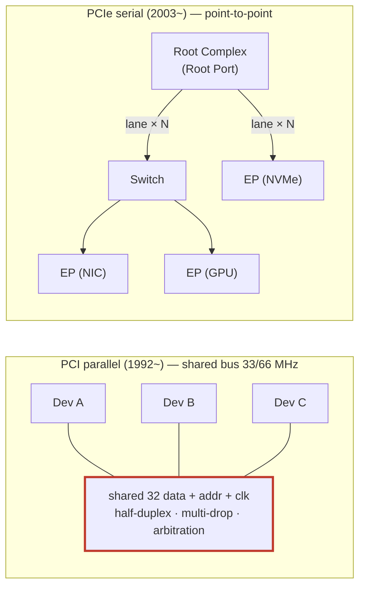
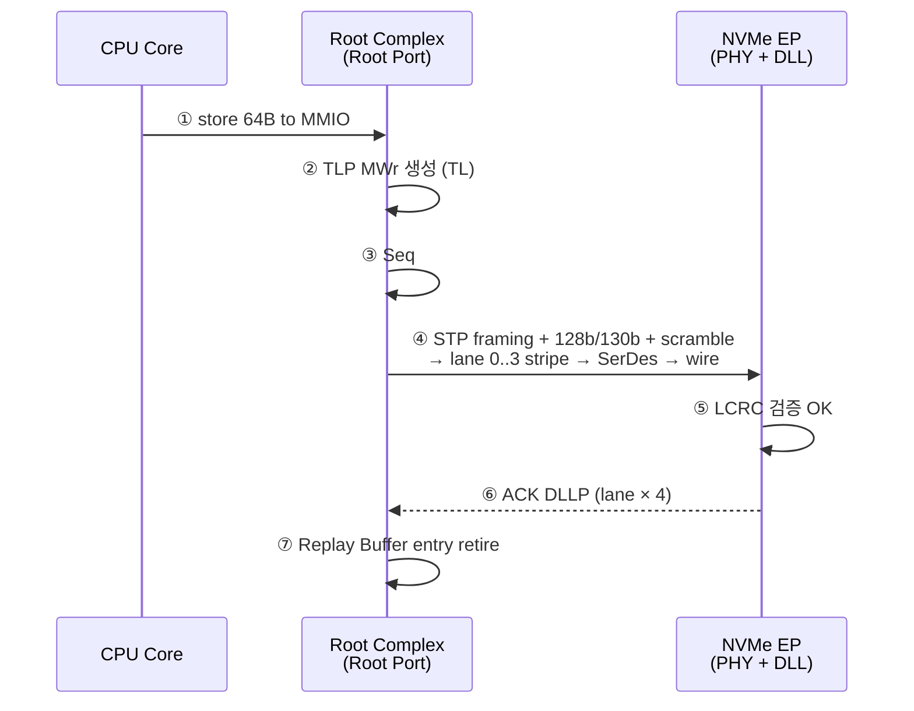
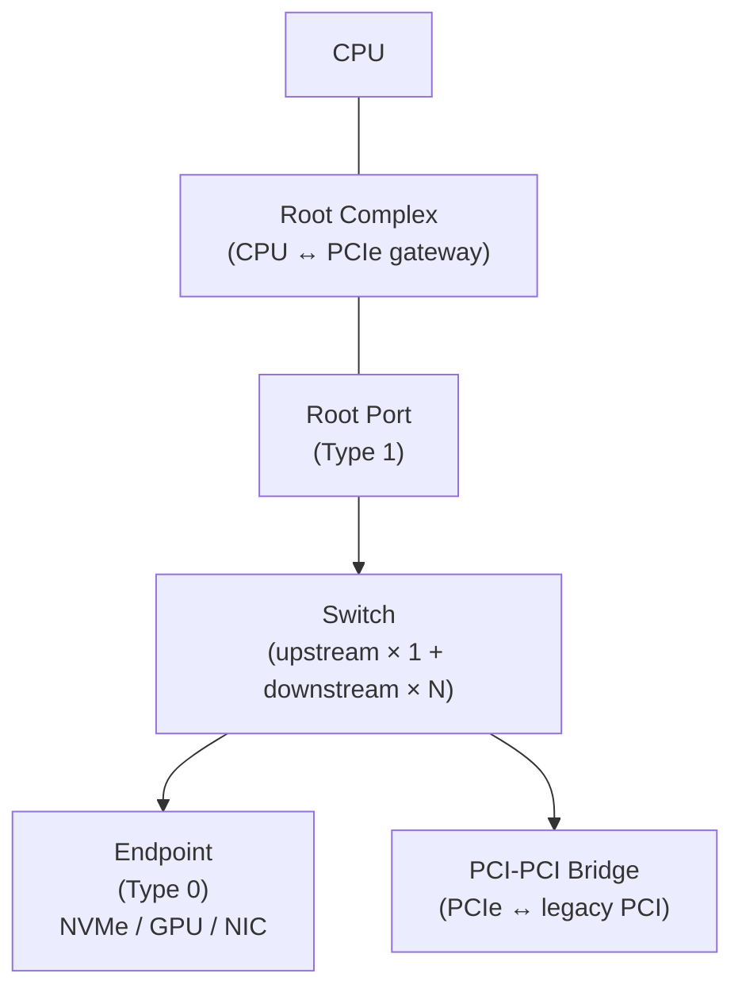
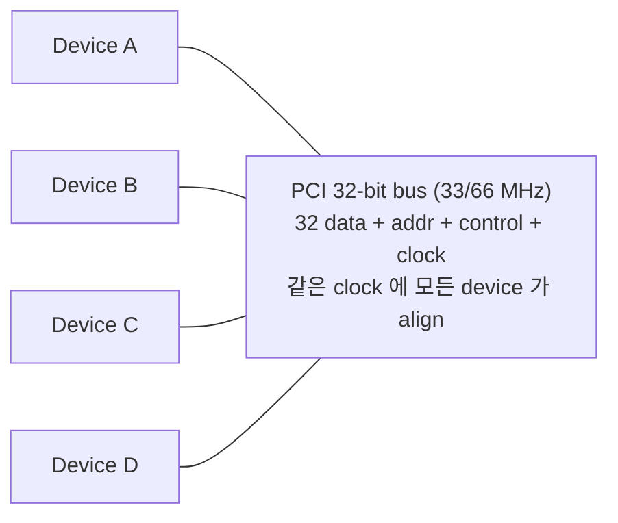
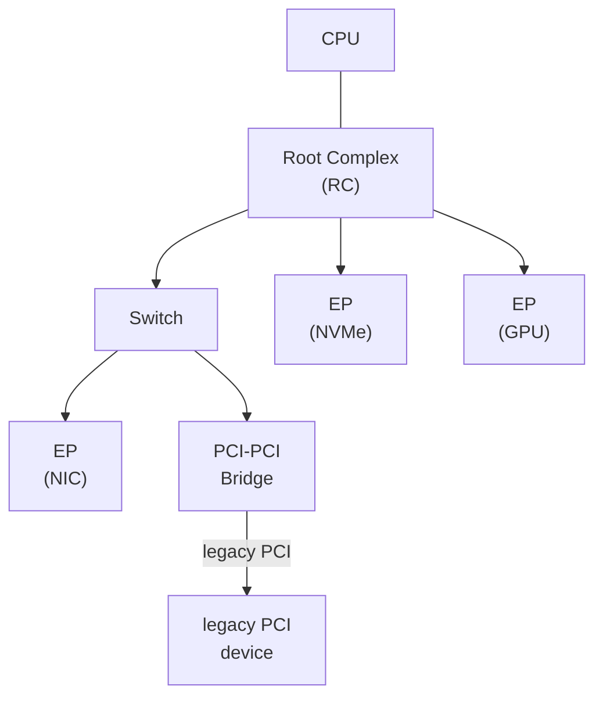

# Module 01 — PCIe 동기와 진화

<!-- DV-SKOOL-CH-CTX:start -->
<div class="chapter-context" data-cat="intercon">
  <a class="chapter-back" href="../">
    <span class="chapter-back-arrow">←</span>
    <span class="chapter-back-icon">🔌</span>
    <span class="chapter-back-text">PCI Express</span>
  </a>
  <span class="chapter-divider">›</span>
  <span class="chapter-marker">Module 01</span>
</div>
<!-- DV-SKOOL-CH-CTX:end -->

<!-- DV-SKOOL-CH-TOC:start -->
<div class="page-toc">
  <span class="page-toc-label">목차</span>
  <a class="page-toc-link" href="#1-why-care-이-모듈이-왜-필요한가">1. Why care?</a>
  <a class="page-toc-link" href="#2-intuition-비유와-한-장-그림">2. Intuition</a>
  <a class="page-toc-link" href="#3-작은-예-x4-gen3-link-한-개의-1초-짜리-전송-한-번-따라가기">3. 작은 예 — x4 Gen3 link 의 한 사이클</a>
  <a class="page-toc-link" href="#4-일반화-네-가지-결정-축과-토폴로지-4-객체">4. 일반화 — 네 결정 축 + 4 객체</a>
  <a class="page-toc-link" href="#5-디테일-spec-진화-bandwidth-lane-구성-axiamba-비교">5. 디테일</a>
  <a class="page-toc-link" href="#6-흔한-오해-와-dv-디버그-체크리스트">6. 흔한 오해 + DV 디버그 체크리스트</a>
  <a class="page-toc-link" href="#7-핵심-정리-key-takeaways">7. 핵심 정리</a>
</div>
<!-- DV-SKOOL-CH-TOC:end -->

!!! objective "학습 목표"
    이 모듈을 마치면:

    - **Explain** PCI parallel 의 한계 (skew, signal integrity, scalability) 와 PCIe 의 serial point-to-point 가 어떻게 그 한계를 해결했는지 설명한다.
    - **Identify** Root Complex / Switch / Endpoint / Bridge 의 역할과 위치를 토폴로지에서 식별한다.
    - **Compare** Gen1 (2.5 GT/s) ~ Gen7 (128 GT/s) 의 raw rate, encoding, equalization 변화를 비교한다.
    - **Apply** "x4 Gen3 link 의 effective bandwidth 는?" 같은 계산을 lane × rate × encoding 모델로 수행한다.
    - **Distinguish** 같은 차원이 아닌 두 축 — "병렬 vs 직렬" 과 "공유 vs 1:1" — 을 구분해 PCIe 와 AXI 의 설계 선택을 정확히 비교한다.

!!! info "사전 지식"
    - 직렬 vs 병렬 인터페이스 개념
    - clock domain, skew 의 의미
    - DMA, memory-mapped IO 의 기본 개념

---

## 1. Why care? — 이 모듈이 왜 필요한가

### 1.1 시나리오 — PCI 가 _왜_ 폐기됐나?

당신은 1990 년대 PC 디자이너. PCI bus 가 표준. 그런데 _2000 년대_ 그래픽 카드가 _32-bit / 33 MHz = 133 MB/s_ 한계에 부딪힘. 비디오 카드는 _수 GB/s_ 필요.

순진한 해법: "PCI 폭 늘리기 + 클럭 올리기". 시도:
- PCI-X 64-bit, 133 MHz → 1 GB/s. **여전히 부족**.
- 200 MHz 시도 → _32 lane 의 skew_ 가 critical path → 각 lane 의 trace length _정확히 일치_ 필요. PCB 비용 폭증.
- 200 MHz @ 32-bit + low skew → trace 가 _마더보드의 절반_ 차지. 면적 ↑.

**근본 문제**: _parallel bus 는 lane skew_ 가 _frequency 의 제곱_ 으로 폭증. 1990 년대 SOC 에서는 GB/s 가능했지만, GHz 영역에서 한계.

**PCIe 의 발상**: _Lane 을 독립_ 시키자.
- 각 lane = _별도 differential pair_, _자체 clock 임베디드_.
- Lane 간 skew? _상관 없음_ — packet 이 lane 끝에서 _재조립_.
- N lane = N × 단일 lane bandwidth. _완전 scalable_.

| | PCI (parallel) | PCIe (serial) |
|---|----------------|---------------|
| 1 lane BW | 4 MB/s | 1+ GB/s (gen 4) |
| Skew | Critical | _독립_ |
| Lane scale | 한계 | x1/x4/x8/x16 |
| Frequency | 33-133 MHz | GHz |

이후 모든 PCIe 모듈은 한 가정에서 출발합니다 — **"한 lane 의 직렬 전송을 여러 lane 으로 묶어 늘린다, 양 끝은 packet 단위로 layered protocol 을 주고받는다"**. TLP 가 왜 가변길이인지, LTSSM 이 왜 11 state 나 필요한지, AER 의 error class 가 왜 셋으로 갈라져 있는지 — 전부 이 한 가정의 파생입니다.

이 모듈을 건너뛰면 이후의 모든 spec/패킷/검증 결정이 **"그냥 외워야 하는 규칙"** 으로 보입니다. 반대로 lane-scaling + serial + packet-switched 라는 세 결정을 정확히 잡고 나면, 디테일을 만날 때마다 _"아, 이게 lane 독립성을 위한 거구나"_ 처럼 **이유** 가 보입니다.

---

## 2. Intuition — 비유와 한 장 그림

!!! tip "💡 한 줄 비유"
    **PCI parallel → PCIe serial** ≈ **8차선 일반도로 → 고속 1차선 다발**.<br>
    8차선 일반도로 (병렬 32-bit bus + 같은 clock) 는 차들이 같은 속도로 가야 하고 (skew 문제), 고속화하면 lane 간 간섭이 심해짐. 같은 시간에 1차선 고속 (직렬 lane + clock 임베디드) 으로 8 대의 차를 더 빨리 보낼 수 있다는 발상이 PCIe 의 핵심.

### 한 장 그림 — PCI 공유 버스 vs PCIe 직렬 fabric



- **PCI**: 한 device 만 송신, 공유 bus 부하 ↑ → 속도 ↓, 32-line skew 가 freq 상한 (~533 MHz).
- **PCIe**: 모든 link 가 full-duplex, Switch 가 fan-out 담당, lane 마다 독립 CDR.

세 가지 PCI 의 한계 (공유 bus 부하 / parallel skew / multi-drop arbitration) 가 PCIe 에서 모두 사라지고, 대신 **lane 독립 SerDes + Switch fan-out + packet-switched layered architecture** 가 그 자리를 채웁니다.

### 왜 이렇게 설계됐는가 — Design rationale

칩 외부 통신은 **거리 (수 cm ~ 수십 cm) + 속도 (Gb/s)** 의 두 축이 동시에 가혹합니다. 거리 길어지면 parallel skew 가 폭증, 속도 올리면 crosstalk 가 폭증 — 둘 다 parallel 의 한계. PCIe 는 셋을 동시에 푸는 결정을 했습니다.

1. **Differential signaling + embedded clock**: 두 선의 차이만 보면 common-mode noise 면역, 별도 clock line 불필요 → skew 사라짐.
2. **Point-to-point + Switch**: 공유 bus 부하 제거. Fan-out 은 별도 component (Switch) 가 담당.
3. **Lane scaling**: 한 lane 의 한계를 N 개로 stripe → x1 ~ x16 의 자유로운 조합.

이 세 결정이 곧 모든 PCIe 패킷 포맷, LTSSM 의 layered training 절차, 검증 환경의 layered 구조를 결정합니다.

---

## 3. 작은 예 — x4 Gen3 link 한 개의 1초 짜리 전송 한 번 따라가기

가장 단순한 시나리오. CPU 가 NVMe device (x4 Gen3 EP) 에 **64 byte** Memory Write 를 한 번 발행합니다.



| Step | 누가 | 무엇을 | 의미 |
|---|---|---|---|
| ① | CPU core | `*phys_addr = data` (store 64 B) | Driver 가 BAR 영역에 write — 일반 memory store 처럼 보임 |
| ② | Root Complex | TLP `MWr` 생성 (Fmt=10, Type=00000, Length=16 DW, Address=BAR+offset) | TL 책임 (Module 02, 03) |
| ③ | DLL (RC) | Seq# 부여 + 32-bit LCRC 계산 + Replay Buffer 에 저장 | DLL 책임 (Module 04) |
| ④ | PHY (RC) | STP framing → 128b/130b encoding → scrambling → 4 lane 으로 byte stripe → SerDes → wire | PHY 책임 (Module 05) |
| ⑤ | EP DLL | LCRC 검증 OK → ACK DLLP 송신, 수신 완료 | reliability link 보장 |
| ⑥ | RC DLL | ACK 수신 → Replay Buffer entry retire | 끝. CPU 는 이미 다른 일 |

```
   wire 위에서 한 byte 가 4 lane 으로 어떻게 stripe 되는가:

     payload byte    : B0 B1 B2 B3 B4 B5 B6 B7 …
     lane 0          : B0       B4       B8 …
     lane 1          :    B1       B5       B9 …
     lane 2          :       B2       B6       B10 …
     lane 3          :          B3       B7       B11 …
                       ↑
                       각 lane 은 자기만의 SerDes / CDR / EQ 보유
                       lane 길이 차이 (skew) 는 PHY 의 SKP Ordered Set 으로 보정
```

!!! note "여기서 잡아야 할 두 가지"
    **(1) 한 packet 이 4 layer 를 통과하면서 wrapper 가 차곡차곡 추가/제거된다** — TL 의 TLP, DLL 의 Seq#+LCRC, PHY 의 framing+encoding. 이 layered 구조가 디버그에서 "어느 layer 의 일?" 라는 질문 하나로 원인을 좁히는 능력의 토대.<br>
    **(2) lane 은 byte 단위로 round-robin stripe 된다** — x4 Gen3 라고 해서 "4 배 빠른 한 lane" 이 아니라 "독립적인 4 개 lane 이 byte 를 나눠 운반". 이 모델 덕에 lane 한 개가 fail 해도 down-train 으로 link 유지 가능 (§6).

---

## 4. 일반화 — 네 가지 결정 축과 토폴로지 4 객체

### 4.1 PCIe 의 네 결정 축

| 축 | 무엇을 제거 | PCI 와의 차이 |
|---|---|---|
| **Serial differential** | 32-line skew + crosstalk 한계 | Common-mode noise 면역, 더 낮은 voltage swing → 더 빠른 freq |
| **Embedded clock (CDR)** | 별도 clock line + 그에 따른 skew | clock 이 data 의 transition 에서 추출됨 |
| **Point-to-point + Switch** | Multi-drop 부하, arbitration overhead | Switch 가 fan-out, 각 link 는 1:1 |
| **Layered + packet** | 모놀리식 bus 신호의 디버그 어려움 | TLP/DLLP/PHY layer 가 분리되어 검증·확장 용이 |

### 4.2 토폴로지 4 객체



- **Enumeration**: DFS traversal (§5, Module 06).
- **PD (Protection Domain)** — IOMMU 격리 영역 (Module 08).

| 컴포넌트 | 역할 | Configuration Header |
|---------|------|---------------------|
| **Root Complex (RC)** | CPU ↔ PCIe 도메인의 게이트웨이. memory controller 와 합쳐진 경우 많음. | Type 1 (Root Port) |
| **Switch** | PCIe 의 fan-out. upstream port 1 + downstream port N. TLP routing 수행. | 각 port 가 Type 1 |
| **Endpoint (EP)** | PCIe 디바이스. NVMe, NIC, GPU 등. | Type 0 |
| **PCI-PCI Bridge** | PCIe ↔ legacy PCI. 사실상 Switch 의 일종. | Type 1 |

이후 모든 모듈에서 이 4 객체가 등장합니다. 새 컴포넌트가 나오면 일단 이 4 개 중 하나의 변형/속성인지 확인하세요.

### 4.3 라우팅 단위 — 3 가지

```
   Address Routing : Memory address 기반 → MRd, MWr, IORd, IOWr
   ID Routing      : BDF (Bus/Device/Function) 기반 → Cfg, Cpl, ID-routed Msg
   Implicit Routing: "to RC" / "broadcast from RC" / "to local" → 일부 Msg
```

자세한 건 Module 03.

---

## 5. 디테일 — spec 진화, bandwidth, lane 구성, AXI/AMBA 비교

### 5.1 PCI parallel 의 한계 (PCIe 가 해결한 문제)



| 한계 | 설명 |
|------|------|
| **Skew** | 32 라인의 도착 시간 편차가 늘면 setup/hold 위반 |
| **Signal integrity** | 고속화 시 crosstalk + 반사 폭증 |
| **Pin count** | 64-bit 확장 시 100+ pin |
| **Multi-drop** | 모든 device 가 동일 bus → 부하 ↑, freq ↓ |
| **Half-duplex** | 한 시점에 한 device 만 송신 |
| **Arbitration overhead** | bus master 변경 시마다 협상 |

→ 결과: **PCI-X 533 MHz 가 한계**. 그 이상은 parallel 로 못 감.

### 5.2 PCIe 의 핵심 결정

```
              Sender                         Receiver
              ──────                         ────────

              TX+/TX-       ─────── lane ──────▶ RX+/RX-
              RX+/RX-       ◀────── lane ────── TX+/TX-

                  per-lane 독립 differential pair
              clock 은 data 안에 임베디드 (CDR 로 복원)
```

| 결정 | 이득 |
|------|------|
| **Differential signaling** | Common-mode noise 면역, 더 낮은 voltage swing → 더 빠른 freq |
| **Embedded clock (CDR)** | 별도 clock line 없음, skew 문제 사라짐 |
| **Point-to-point** | Multi-drop 부하 제거, switch 가 fan-out 담당 |
| **Lane 단위 scaling** | 1, 2, 4, 8, 16 lane 으로 x1~x16 link |
| **Full-duplex per lane** | TX/RX 동시 송신 |
| **Layered + packet** | TLP/DLLP/PHY layer 분리, 디버그/확장 용이 |

### 5.3 Topology 4 객체 상세



| 컴포넌트 | 역할 |
|---------|------|
| **Root Complex (RC)** | CPU ↔ PCIe 도메인의 게이트웨이. memory controller 와 합쳐진 경우 많음. Root Port 가 다운스트림 link 의 시작점. |
| **Switch** | PCIe 의 fan-out. upstream port 1 + downstream port N. TLP routing 수행. |
| **Endpoint (EP)** | PCIe 디바이스. Type 0 config header. NVMe, NIC, GPU 등. |
| **PCI-PCI Bridge** | PCIe ↔ legacy PCI. 사실상 Switch 의 일종. Type 1 config header. |

**라우팅 단위**: Address routing (memory address 기반), ID routing (BDF 기반), Implicit routing (broadcast/upstream). 자세한 건 Module 03.

### 5.4 Generation 진화

| Gen | Spec 연도 | Raw rate (per lane) | Encoding | x16 b/w (uni-dir) | 주요 변화 |
|-----|----------|---------------------|----------|-------------------|----------|
| **1.0** | 2003 | 2.5 GT/s | 8b/10b | 4 GB/s | NRZ, 기본 EQ |
| **2.0** | 2007 | 5.0 GT/s | 8b/10b | 8 GB/s | Tx/Rx EQ 표준화 |
| **3.0** | 2010 | 8.0 GT/s | 128b/130b | 15.75 GB/s | Encoding 효율 ↑ (96.15% → 98.46%), 적응 EQ |
| **4.0** | 2017 | 16.0 GT/s | 128b/130b | 31.5 GB/s | Connector retimer 도입 |
| **5.0** | 2019 | 32.0 GT/s | 128b/130b | 63 GB/s | NRZ 한계 |
| **6.0** | 2022 | 64.0 GT/s | PAM4 + FLIT | 121 GB/s | **PAM4** 도입, **FLIT mode** 신설 |
| **7.0** | 2025 | 128.0 GT/s | PAM4 + FLIT | 242 GB/s | EQ + retimer 강화 |

!!! note "FLIT mode (Gen6+)"
    Gen5 까지는 TLP/DLLP 가 packet 단위로 가변 길이. Gen6 의 **FLIT (Flow Control unIT)** 은 **고정 256 byte 프레임** 단위로 묶어 전송 → DLL 의 ACK/NAK overhead 감소, FEC 통합 용이. PAM4 의 BER 증가 (NRZ 대비) 를 보완하기 위해 도입.

#### Encoding 효율

```
   8b/10b (Gen1, Gen2)
     원본 8 bit → 송신 10 bit  → 효율 80%

   128b/130b (Gen3 ~ Gen5)
     원본 128 bit → 송신 130 bit → 효율 98.46%

   PAM4 + FEC (Gen6, Gen7)
     2 bit / symbol → throughput 2× per symbol
     단, BER 악화 → FLIT + FEC 로 보완
```

### 5.5 Bandwidth 계산 예제

**문제**: PCIe Gen3 x4 link 의 한 방향 raw + effective bandwidth 는?

**계산**:

```
   Raw           : 8 GT/s × 4 lane = 32 GT/s
   8b/10b 였다면  : 32 × 0.8 = 25.6 Gbps
   실제 Gen3 (128b/130b): 32 × (128/130) = 31.5 Gbps ≈ 3.94 GB/s
```

**Effective** (TLP overhead 추가 차감 — header, ACK, FC):

```
   typical: ~3.5 GB/s (≈ raw 의 88-90%)
```

→ 실 트래픽 패턴에 따라 ±10%.

!!! tip "Bandwidth 빠른 추산법"
    "x{N} Gen{G} ≈ N × G GB/s 의 한 방향" (Gen3 부터는 실효 bandwidth ≈ raw rate 그대로 GB/s 로 환산해도 거의 정확).

    예: x16 Gen5 ≈ 16 × 32 / 8 ≈ 64 GB/s 한 방향 (정확 63 GB/s).

!!! example "직관적 비유 — 클럭 스큐가 왜 문제인가"
    병렬 32-bit 버스에서 송신 측은 32 개 선에 동시에 0/1 을 띄우고 클럭 신호로 "지금 읽어!" 라고 알린다. 수신 측은 그 순간을 **사진 찍듯이** 32 개 선의 값을 한 번에 캡처. 그런데 한 선의 데이터가 약간 늦게 도착하면 사진에는 그 선의 **이전 타이밍 값** 이 찍힌다 — "가나다라" 보냈는데 "가나다**바**" 로 읽힘.

    옛날 메인보드의 PCB 위 구리선이 **구불구불 지그재그 패턴 (Trace)** 으로 그려진 이유: 모든 데이터 선의 물리 길이를 맞춰 도착 시간을 강제로 동기화하기 위함. 그래도 33–66 MHz 가 한계.

    PCIe 의 직렬 + embedded clock 은 이 사진 찍기 패러다임 자체를 버리고, 각 lane 의 CDR 이 **자기 박자를 직접 추출** 하므로 lane 길이 차이가 큰 문제가 안 됨.

### 5.6 Lane 구성 — bifurcation, reversal, down-train

**Lane bifurcation**: 한 x16 connector 를 x8+x8 또는 x4+x4+x4+x4 로 쪼개 사용.

**Lane reversal**: 보드 라우팅 편의를 위해 lane 0..15 의 순서를 뒤집어 받음 — LTSSM 의 polling 단계에서 자동 검출.

**Lane width down-train**: 한 lane 이 fail 시 link 가 더 작은 width 로 retrain. (예: x16 → x8)

### 5.7 PCIe 의 두 SW model

```
   Memory-mapped IO (MMIO)            Configuration Space
   ──────────────────────────         ───────────────────────────
   BAR 가 매핑된 주소를 CPU 가         Type 0 (EP) / Type 1 (Bridge)
   load/store 로 직접 접근            registers — bus enumeration,
   (driver 의 일반 통신 path)         BAR sizing, capability discovery
```

→ Module 06 에서 자세히.

### 5.8 AXI/AMBA 는 왜 여전히 병렬인가?

DV 엔지니어 관점에서 자주 나오는 질문 — "PCIe 가 직렬로 갔으니 AXI 도 직렬로 가야 하는 것 아닌가?"

| 비교 항목 | AXI/AMBA (칩 내부) | PCIe (칩 외부) |
|----------|-------------------|----------------|
| 신호 이동 거리 | 수 mm | 수 cm ~ 수십 cm |
| 클럭 스큐 관리 | 짧은 거리라 관리 가능 | 거리 멀어 관리 불가 → SerDes 필수 |
| SerDes 비용 | 불필요 (병렬이 면적 효율) | 필수 (병렬은 물리적 한계) |
| 버스 구조 | Interconnect (스위치 구조, 1:1 지원) | Switch 기반 Point-to-Point |

**핵심 통찰**:

- 현대 AXI 도 **공유 버스가 아님** — Interconnect 가 일종의 스위치라 1:1 통신 보장.
- 즉 AXI = **"병렬 + 1:1 전용망"**, PCIe = **"직렬 + 1:1 전용망"**.
- 두 프로토콜이 다른 layer 의 다른 거리/비용 trade-off 에 최적화된 설계.

→ **"병렬 vs 직렬"** 와 **"공유 vs 1:1"** 은 서로 다른 축의 결정. PCIe 가 한 번에 둘 다 해결한 것은 칩 외부 통신의 거리/속도 양쪽 한계가 동시에 컸기 때문.

---

## 6. 흔한 오해 와 DV 디버그 체크리스트

### 흔한 오해

!!! danger "❓ 오해 1 — 'PCIe x16 은 PCI 32-bit bus 가 16 lane 으로 늘어난 것이다'"
    **실제**: PCI 는 모든 device 가 같은 bus 를 공유 (multi-drop, half-duplex). PCIe x16 은 RC ↔ device 간 16 쌍의 **point-to-point full-duplex serial link**. 토폴로지·전송방식·동작모델이 모두 다름. x16 lane 은 단순히 "더 두꺼운 버스" 가 아니라 **16 개 독립 차선 + striping**.<br>
    **왜 헷갈리는가**: 같은 PCI 이름과 SW backward compat (Configuration Space) 때문.

!!! danger "❓ 오해 2 — '직렬은 항상 병렬보다 빠르다'"
    **실제**: 짧은 거리 (수 mm) 에서는 병렬이 압도적으로 면적/전력 효율적. AXI/AMBA 같은 칩 내부 interconnect 는 여전히 병렬. PCIe 가 직렬을 택한 것은 **수 cm ~ 수십 cm 거리 + multi-Gbps 속도** 라는 두 조건이 동시에 성립한 결과.<br>
    **왜 헷갈리는가**: "PCIe = 빠르다 = 직렬" 의 단순 매핑.

!!! danger "❓ 오해 3 — 'Gen 6 = NRZ 의 단순 2× 빠른 버전이다'"
    **실제**: Gen6 부터 modulation 이 NRZ → PAM4 로 바뀌고, packet 모델이 가변 → FLIT (256B 고정) 로 바뀜. FEC 가 필수가 되어 BER 모델도 변경. 단순한 freq doubling 이 아닌 **세 가지 패러다임 동시 변경**.<br>
    **왜 헷갈리는가**: 표만 보면 "rate 2 배" 처럼 보임.

!!! danger "❓ 오해 4 — 'x16 connector 를 꽂으면 항상 x16 으로 동작한다'"
    **실제**: RC/EP 의 capability, board routing 품질, 한 lane 의 EQ 실패 등에 따라 **down-train** 으로 x8/x4/... 로 떨어질 수 있음. 항상 Configuration Space 의 LnkSta 로 실제 width/speed 확인 필요.<br>
    **왜 헷갈리는가**: connector 의 물리적 lane 수 = 동작 lane 수 라는 직관.

!!! danger "❓ 오해 5 — 'Embedded clock 이라 PHY 의 reference clock 이 없어도 된다'"
    **실제**: 100 MHz refclk 가 양 끝 PHY 에 공급되어야 정상 동작. "Embedded clock" 은 _data 라인 안에서 박자를 추출_ 한다는 뜻이지 _refclk 가 없다_ 는 뜻이 아님. Common Refclock vs Independent Refclock (SRIS) 모드는 board design 결정사항.

### DV 디버그 체크리스트 (이 모듈 내용으로 마주칠 첫 실패들)

| 증상 | 1차 의심 | 어디 보나 |
|---|---|---|
| Link up 자체가 안 됨 | LTSSM Detect/Polling stuck | LTSSM trace, refclk 공급, electrical idle 검출 |
| x16 capable 인데 x4 로 떨어짐 | 일부 lane 의 EQ 실패 또는 전기적 문제 | LTSSM polling/configuration 단계의 lane 별 status |
| Link up 했는데 traffic 0 | DL_Active 미진입 또는 FC init 미완료 | DLL state, FC InitFC1/2 교환 (Module 04) |
| Bandwidth 가 spec 의 절반 | Gen 협상이 낮은 값으로 collapse | LnkSta 의 current speed, EQ 결과 |
| Driver 가 device 못 봄 | Enumeration 실패 또는 Vendor ID = 0xFFFF | Configuration Space access (Module 06) |
| `lspci -tv` 트리에 device 없음 | Type 1 의 Sec/Sub Bus 잘못 할당 | Switch port 의 Bridge header 점검 |
| Gen 변경 후 대량 Recovery | EQ preset 이 channel 에 안 맞음 | LTSSM Recovery 진입 빈도 + EQ Phase 결과 |

이 체크리스트는 이후 모듈에서 더 정교한 형태로 다시 나옵니다. 지금 단계에서는 "PCIe 실패 = (LTSSM state | Lane width | Configuration Space) 셋 중 하나" 만 기억하세요.

---

## 7. 핵심 정리 (Key Takeaways)

- PCIe = **serial point-to-point + lane-scaling + packet-switched + layered**.
- Topology 4 객체: **RC → Switch (fan-out) → Endpoint, 일부 PCI-PCI Bridge**.
- Gen1 (2.5 GT/s) → Gen7 (128 GT/s), encoding 은 8b/10b → 128b/130b → PAM4 + FLIT.
- Bandwidth 계산: lane × rate × encoding 효율, Gen3+ 는 거의 lane × rate × 1 GB/s/Gbps.
- "병렬 vs 직렬" 과 "공유 vs 1:1" 은 다른 축의 결정 — PCIe 는 둘 다 갈아 엎었다.

!!! warning "실무 주의점"
    - "Gen6 = NRZ 의 단순 2× 빠른 버전" 으로 보면 PAM4 + FLIT + FEC 의 의미를 놓침. NRZ 와 PAM4 는 modulation 자체가 다름.
    - x16 connector = 실제 x16 동작 보장 아님. RC/EP 의 capability 와 board routing 에 따라 down-train 가능.
    - "Gen 3 link" 라고 해도 양 끝의 capability 가 다르면 낮은 쪽으로 collapse — Gen capability 와 link speed 둘 다 Configuration Space 에서 확인.
    - Embedded clock 이라고 PHY 의 reference clock 이 없는 게 아님 — 100 MHz refclk 가 양 끝에 공급되어야 정상 동작 (Common Refclock vs Independent Refclock).

### 7.1 자가 점검

!!! question "🤔 Q1 — Lane / Gen 결정 (Bloom: Apply)"
    Endpoint capability x8 Gen4. Host RC capability x16 Gen5. 실제 link?

    ??? success "정답"
        **x8 Gen4** — 양 끝의 _작은 쪽_ 으로 collapse.

        - Lane count: min(x8, x16) = x8.
        - Gen: min(Gen4, Gen5) = Gen4.

        Total BW: 8 × 16 GT/s × 128/130 ≈ **15.75 GB/s** unidir.

!!! question "🤔 Q2 — PCIe vs PCI 면적 (Bloom: Evaluate)"
    PCIe x1 (직렬) vs PCI 32-bit (병렬). 같은 BW 1 GB/s 의 PCB 면적?

    ??? success "정답"
        - **PCIe x1**: 2 trace (differential pair). _좁고 short_.
        - **PCI 32-bit**: 32 + control trace = ~50 trace. _넓고 매칭 trace length 필요_.

        면적 비: PCI 가 _10-20×_. PCIe 가 _경제적 + 빠름_. PCI 가 죽은 이유.

### 7.2 출처

**External**
- PCIe Specification (PCI-SIG)
- *PCI Express Technology* — Mike Jackson et al.

---

## 다음 모듈

→ [Module 02 — 3-Layer Architecture](02_layer_architecture.md): TLP/DLLP/PHY 의 layer 책임 분리가 어떻게 디버그를 직선화하는지.

[퀴즈 풀어보기 →](quiz/01_pcie_motivation_quiz.md)

--8<-- "abbreviations.md"
--8<-- "_inc/topic_abbr.md"
