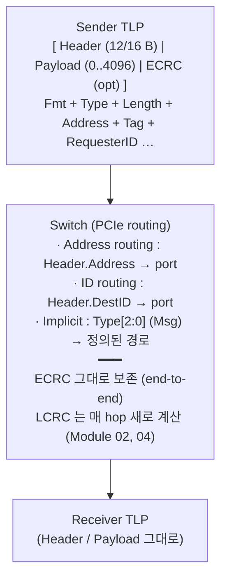
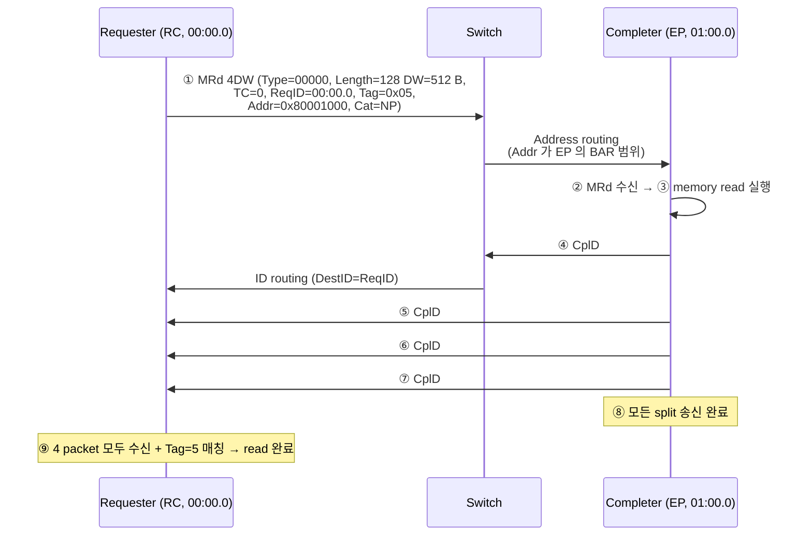
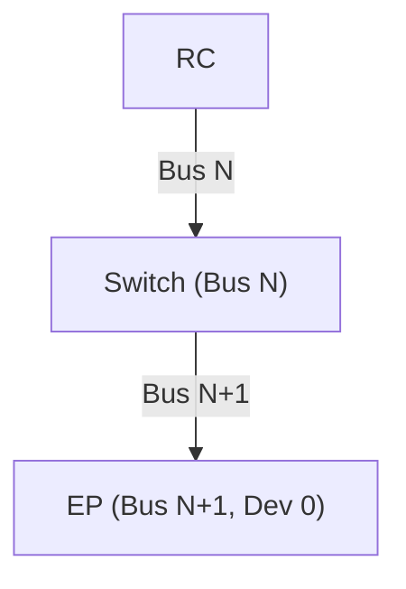
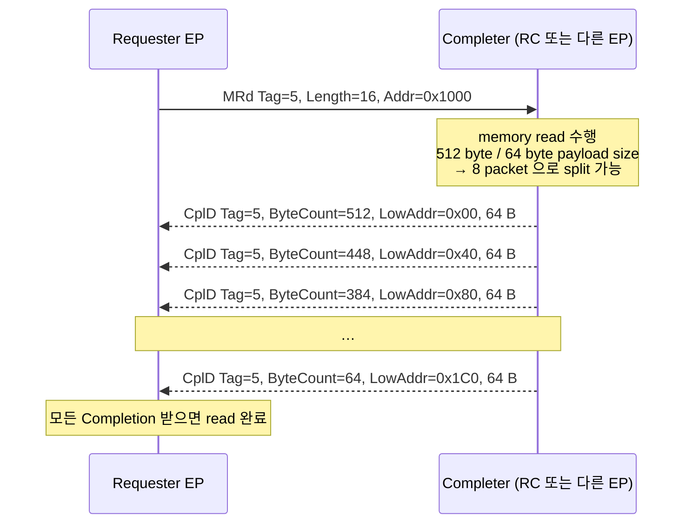

# Module 03 — TLP (Transaction Layer Packet)

<!-- DV-SKOOL-CH-CTX:start -->
<div class="chapter-context" data-cat="intercon">
  <a class="chapter-back" href="../">
    <span class="chapter-back-arrow">←</span>
    <span class="chapter-back-icon">🔌</span>
    <span class="chapter-back-text">PCI Express</span>
  </a>
  <span class="chapter-divider">›</span>
  <span class="chapter-marker">Module 03</span>
</div>
<!-- DV-SKOOL-CH-CTX:end -->

<!-- DV-SKOOL-CH-TOC:start -->
<div class="page-toc">
  <span class="page-toc-label">목차</span>
  <a class="page-toc-link" href="#1-why-care-이-모듈이-왜-필요한가">1. Why care?</a>
  <a class="page-toc-link" href="#2-intuition-국제-송장-비유와-한-장-그림">2. Intuition</a>
  <a class="page-toc-link" href="#3-작은-예-mrd-512-byte-가-rc-switch-ep-1-hop-을-건너는-과정">3. 작은 예 — MRd 512B 의 1-hop 라우팅</a>
  <a class="page-toc-link" href="#4-일반화-tlp-의-3-축-fmt-type-routing-category">4. 일반화 — TLP 의 3 축</a>
  <a class="page-toc-link" href="#5-디테일-필드-카탈로그-routing-규칙-special-tlp">5. 디테일</a>
  <a class="page-toc-link" href="#6-흔한-오해-와-dv-디버그-체크리스트">6. 흔한 오해 + DV 디버그 체크리스트</a>
  <a class="page-toc-link" href="#7-핵심-정리-key-takeaways">7. 핵심 정리</a>
</div>
<!-- DV-SKOOL-CH-TOC:end -->

!!! objective "학습 목표"
    이 모듈을 마치면:

    - **Decode** TLP header (3DW vs 4DW, Fmt/Type/TC/Length/Address) 의 각 필드를 식별한다.
    - **Classify** TLP 를 Posted / Non-Posted / Completion 으로 분류하고 ordering 함의를 설명한다.
    - **Apply** Address routing vs ID routing vs Implicit routing 을 시나리오에 매핑한다.
    - **Trace** Memory Read 의 MRd → CplD 의 송수신 + Tag matching 흐름을 추적한다.
    - **Justify** Posted 가 NP 를 추월하도록 spec 가 허용한 이유 (deadlock 회피) 를 producer-consumer 의미와 함께 설명한다.

!!! info "사전 지식"
    - Module 02 (TL 의 책임)
    - 메모리 매핑 IO, BDF 개념

---

## 1. Why care? — 이 모듈이 왜 필요한가

**TLP 는 PCIe 의 "데이터 path" 입니다.** 모든 driver, NIC, NVMe, GPU 의 통신은 결국 TLP. Header field 의 의미를 알아야 packet trace 를 읽을 수 있고 (검증/디버그), VIP coverage 를 설계할 수 있습니다.

이 모듈의 어휘 — **Fmt/Type, P/NP/Cpl, Tag, Address vs ID routing** — 가 이후 모든 DV scoreboard, AER error 분류, SR-IOV/ATS/CXL 의 기본 단위. 이 layer 모델을 정확히 잡고 나면 처음 보는 TLP 도 _"아, 이게 NP 라 Cpl 매칭이 필요하구나"_ 처럼 행동을 즉시 예측할 수 있습니다.

---

## 2. Intuition — 국제 송장 비유와 한 장 그림

!!! tip "💡 한 줄 비유"
    **TLP** ≈ **국제 송장**. <br>
    **Fmt/Type** = 화물 분류 코드 (Memory Read / Write / Config / Message / Completion). <br>
    **Length** = 화물 양. <br>
    **Address** (3DW: 32-bit, 4DW: 64-bit) = 주소. <br>
    **Tag** = 송장 번호 (요청 ↔ 응답 매칭). <br>
    **TC** (Traffic Class) = 우선순위 등급 (express vs standard). <br>
    **Requester ID** = 발신자 BDF.

### 한 장 그림 — TLP 포맷과 Switch 의 라우팅



### 왜 이 디자인인가 — Design rationale

세 가지 요구가 동시에 풀려야 했습니다.

1. **PCI 와의 SW backward compat** → Configuration Space + ordering rules 그대로 유지 → P/NP/Cpl 의 분리.
2. **Producer-Consumer 의 데이터 무결성** → MWr (P) 가 Read Cpl 보다 먼저 도착해야 함 → P 가 NP 추월 가능 + NP 는 P 추월 불가.
3. **Routing flexibility** (memory address / device identity / message type) → 3 가지 routing 메커니즘.

이 세 요구의 교집합이 **Fmt/Type 인코딩 + P/NP/Cpl 분리 + Address/ID/Implicit 3 routing** 입니다.

---

## 3. 작은 예 — MRd 512 byte 가 RC → Switch → EP 1-hop 을 건너는 과정

가장 단순한 시나리오. CPU 가 EP (NVMe) 의 BAR 영역 `0x80001000` 에서 **512 byte** Memory Read 를 발행. MRRS=512, MPS=128 가정 → 응답은 4 packet 으로 split.

### 단계별 추적



### 단계별 의미

| Step | 누가 | 무엇을 | 왜 |
|---|---|---|---|
| ① | RC TL | MRd TLP 생성 | Driver 의 read 요청 |
| ② | Switch | Header.Address 보고 outgoing port 결정 | Address routing |
| ③ | EP TL | Address 검증, memory read | BAR 영역 hit |
| ④–⑦ | EP TL | 512 B 를 MPS=128 단위로 split | Receiver 의 buffer 한계 |
| ④–⑦ | EP TL | 각 CplD 에 같은 Tag=5, 다른 LowAddr/ByteCount | Requester 가 위치 + 잔량 추적 |
| ④–⑦ | Switch | DestID = Requester ID 보고 RC 방향 forward | ID routing |
| ⑨ | RC TL | Tag=5 의 모든 split 받으면 read 완료 통지 | Tag matching |

```c
// MRd 측 의사코드 — ReqID/Tag 가 Cpl 매칭의 핵심
struct tlp build_mrd(uint64_t addr, uint16_t length_dw, uint8_t tag) {
    return (struct tlp){
        .fmt    = 0b01,  // 4DW, no data
        .type   = 0b00000, // MRd
        .length = length_dw,
        .req_id = REQ_BDF,
        .tag    = tag,
        .addr   = addr,
    };
    // Cat = NP → Cpl 응답을 Tag 로 매칭해야 함
}

// CplD 측 — split 마다 같은 Tag, 다른 ByteCount/LowAddr
void send_cpld(uint8_t tag, uint16_t total_remaining, uint8_t low_addr_7b,
               uint8_t *payload, uint16_t payload_len) {
    struct tlp t = {
        .fmt    = 0b10,  // 3DW + data
        .type   = 0b01010, // Cpl with data
        .length = payload_len / 4,
        .req_id = req_id_received,  // 응답 destination
        .tag    = tag,
        .byte_count = total_remaining,
        .low_addr   = low_addr_7b,
    };
    send(t, payload, payload_len);
}
```

!!! note "여기서 잡아야 할 두 가지"
    **(1) Memory Read 는 NP — 응답이 필수다.** Tag 가 그 매칭의 키. Tag pool 이 고갈되면 새 MRd 못 보내고 stall (Module 04). <br>
    **(2) 한 read 가 여러 split 으로 쪼개진다 — MRRS (요청 측) 와 MPS (응답 측) 의 mismatch 가 split 갯수를 결정한다.** Tag 는 같고 LowAddr/ByteCount 가 위치를 구분.

---

## 4. 일반화 — TLP 의 3 축 (Fmt × Type × Routing × Category)

### 4.1 TLP Format

```
   ┌─────────────────────────────────────────────────┐
   │ Header (3DW=12B 또는 4DW=16B)                    │
   ├─────────────────────────────────────────────────┤
   │ Data Payload (0..4096 byte, 4-byte aligned)     │
   ├─────────────────────────────────────────────────┤
   │ ECRC (optional, 4 byte)                          │
   └─────────────────────────────────────────────────┘

   상위 layer 가 보는 packet 단위. DLL 이 Seq# + LCRC 를 추가하면 그 결과가 PHY 로 내려감.
```

**Header 길이 결정**:

- **3DW (12 byte)**: 32-bit address (예: x86 legacy 호환), Configuration, Completion
- **4DW (16 byte)**: 64-bit address (modern memory request)

### 4.2 3 카테고리 (P / NP / Cpl)

| Cat | 응답 (TL) | 예 | Credit 그룹 |
|-----|----------|----|------------|
| **Posted (P)** | 없음 | MWr, MsgD | Posted Header (PH) + Posted Data (PD) |
| **Non-Posted (NP)** | Cpl 또는 CplD 필수 | MRd, IORd, IOWr, CfgRd/Wr, AtomicOp | Non-Posted Header (NPH) + Non-Posted Data (NPD) |
| **Completion (Cpl)** | (응답 자체) | Cpl, CplD | Completion Header (CplH) + Completion Data (CplD) |

### 4.3 Routing 3 가지

```
   Address Routing (Memory, IO)
   ─────────────────────────────
   TLP 의 Address 를 보고 switch 가 outgoing port 결정.
   각 port 의 [Memory Base, Memory Limit] 범위 비교.

   ID Routing (Configuration, Completion, ID-routed Msg)
   ────────────────────────────────────────────────────
   TLP 의 Destination BDF (Bus/Device/Function) 로 라우팅.
   Configuration 의 경우 Type 0 (직접) vs Type 1 (Bridge 통과).

   Implicit Routing (일부 Msg)
   ────────────────────────────
   "to RC" / "broadcast from RC" / "to local" 등 implicit 정의.
```

### 4.4 Ordering Rules

```
   같은 source 의 P 두 개          : in-order 도착
   P 가 NP 를 추월 가능 (deadlock 회피)
   NP 가 P 를 추월 불가
   Cpl 이 다른 Cpl 을 추월 불가
   Cpl 이 P 를 추월 가능
```

→ **Why?** Producer-Consumer 패턴에서 Producer 의 MWr (P) 가 Consumer 의 MRd Cpl 보다 먼저 도착해야 함. Posted/Non-Posted/Cpl 분리가 PCI legacy 의 ordering 가정과 호환.

---

## 5. 디테일 — 필드 카탈로그, routing 규칙, special TLP

### 5.1 TLP Header — 3DW 일반 구조

```
   Byte 0    Byte 1    Byte 2    Byte 3
   ┌────┬───┬────────┬────────┬────────┐
   │Fmt │Typ│ TC R Th│   ATTR │  Length │  ← DW0
   │ 2b │5b │ 3 1 1  │   2b   │  10b    │
   └────┴───┴────────┴────────┴────────┘
   ┌─────────────────┬─────────┬─────────┐
   │ Requester ID    │  Tag    │  BE     │  ← DW1 (혹은 routing field)
   │ 16b (Bus/Dev/Fn)│  8b     │ 4b last │
   └─────────────────┴─────────┴─────────┘
   ┌─────────────────────────────────────┐
   │ Address [31:2]                      │  ← DW2 (3DW Memory)
   └─────────────────────────────────────┘
```

| Field | 길이 | 설명 |
|-------|-----|------|
| **Fmt** | 2 | 00 = 3DW header, no data; 01 = 4DW header, no data; 10 = 3DW + data; 11 = 4DW + data; (Gen3+: 추가 인코딩) |
| **Type** | 5 | Type 별 의미는 Fmt 와 조합. 표 아래 참고 |
| **TC** (Traffic Class) | 3 | 0..7. VC (Virtual Channel) 매핑에 사용 |
| **R** (Reserved) / **Th** (TLP Hint) / etc | 1 each | TPH 등의 추가 hint |
| **ATTR** | 2 | RO (Relaxed Ordering), NS (No Snoop) bit |
| **Length** | 10 | DW 단위 payload 길이. 0 = 1024 DW (= 4096 byte) |
| **Requester ID** | 16 | BDF (Bus 8b + Device 5b + Function 3b) |
| **Tag** | 8 | (10 bit Gen2.1+ extended) Non-Posted Request 의 ID, Completion 매칭용 |
| **Last DW BE** | 4 | 마지막 DW 의 byte enable |
| **First DW BE** | 4 | 첫 DW 의 byte enable |
| **Address** | 30 (3DW) or 62 (4DW) | DW-aligned address |

### 5.2 Fmt × Type 조합 — 주요 TLP 카탈로그

| Fmt[1:0] | Type[4:0] | TLP 명 | Cat | xH 길이 | 설명 |
|---------|-----------|--------|-----|---------|------|
| 00 / 01 | 00000 | MRd | NP | 3DW/4DW | Memory Read Request |
| 10 / 11 | 00000 | MWr | P | 3DW/4DW | Memory Write |
| 00 | 00010 | IORd | NP | 3DW | IO Read |
| 10 | 00010 | IOWr | NP | 3DW | IO Write (NP! TL-level 응답 필요) |
| 00 | 00100 | CfgRd0 | NP | 3DW | Configuration Read Type 0 |
| 10 | 00100 | CfgWr0 | NP | 3DW | Configuration Write Type 0 |
| 00 | 00101 | CfgRd1 | NP | 3DW | Configuration Read Type 1 |
| 10 | 00101 | CfgWr1 | NP | 3DW | Configuration Write Type 1 |
| 00 | 01010 | Cpl | Cpl | 3DW | Completion (no data) |
| 10 | 01010 | CplD | Cpl | 3DW | Completion with Data |
| 00 | 01011 | CplLk | Cpl | 3DW | Locked Completion |
| 10 | 01011 | CplDLk | Cpl | 3DW | Locked Completion with Data |
| 01/11 | 11rrr | Msg / MsgD | P | 4DW | Message (Type[2:0] = routing) |
| 10/11 | 01100/01101 | FetchAdd, Swap | NP | 3DW/4DW | AtomicOps |
| 11 | 01110 | CAS | NP | 4DW | Compare and Swap |

> **Cat** = Posted (P), Non-Posted (NP), Completion (Cpl)

!!! quote "Spec 인용"
    PCIe Base Spec 에서 Fmt/Type 인코딩은 Section "Transaction Layer Specification > TLP Format" 에 표 형태로 정의. 실제 spec 은 PCI-SIG 회원사 비공개이지만 *PCI Express System Architecture* (MindShare) 가 공개 자료의 표준 인용 소스.

### 5.3 Posted / Non-Posted / Completion 의 ordering 의미

!!! example "Write-passes-Read 의 두 얼굴 — Deadlock 방지 + 데이터 무결성"
    **Strong ordering 의 기본 원칙**: 먼저 출발한 Memory Write 는 무조건 먼저 도착해야 한다 (FIFO). Write 32-bit / 64-bit 모두 Posted 로 동일 취급.

    **Write 가 Read 를 새치기 가능 — Why?**

    - Read 는 응답을 기다리는 transaction. 만약 Read 가 길을 막은 채 Write 가 그 뒤에 줄 서 있으면, Read 의 응답을 기다리는 쪽도 그 Write 가 있어야 진행 → **circular wait → deadlock**.
    - 그래서 spec 가 명시적으로 "Write **MUST PASS** Read" 허용.

    **Read 가 Write 를 새치기 절대 불가 — Why?**

    - Producer-Consumer: GPU 가 RAM 에 결과 Write → CPU 가 그 영역 Read.
    - 만약 Read 가 Write 를 추월하면 CPU 가 **이전 (쓰레기) 데이터** 를 받음 → 무결성 파괴.

    **Relaxed Ordering (RO) 의 책임**:

    - TLP 헤더의 RO bit 가 1 이면 "순서 섞여도 OK" 선언 — switch 가 ordering 무시하고 우선순위로 처리.
    - Switch 는 주소 검사 안 함 → 같은 주소도 섞을 수 있음.
    - 책임은 **sender** 에게. 순서가 중요한 제어 명령에는 절대 RO 금지.

### 5.4 Routing 상세 — Type 0 vs Type 1 Configuration TLP



- **RC → Switch 자기 자신 config 접근**: `CfgRd0` (Type 0, target = same bus).
- **RC → Switch 의 secondary 측 통과**: `CfgRd1` (Type 1) — switch 가 받아 `CfgRd0` 로 변환해 EP 에 전달.

→ **Type 1 → 0 변환은 PCI-PCI Bridge / Switch 의 책임**.

### 5.5 Memory Read 흐름 (Tag matching)



| 필드 | 의미 |
|------|------|
| **Tag** | Requester 가 Non-Posted 마다 unique 하게 부여 (8b 또는 10b extended). Completion 매칭. |
| **ByteCount** | "이 completion 까지 받은 후 남은 byte 수" — 마지막 packet 에서 끝의 length 와 일치 |
| **LowAddr** | 첫 byte 의 하위 7 bit address (split 시 위치 표시) |
| **Cpl Status** | Successful / Unsupported Request (UR) / Configuration Request Retry (CRS) / Completer Abort (CA) |

→ **Max Read Request Size** (MRRS) 가 한 번의 MRd 가 요청할 수 있는 최대 byte. Completer 의 **Max Payload Size** (MPS) 가 한 Completion packet 의 최대 payload — 이 둘의 mismatch 가 split 갯수를 결정.

### 5.6 ECRC — End-to-End CRC

- 32-bit CRC, TLP header (특정 변경 가능 field 제외) + payload 위로 계산.
- Switch / Bridge 가 통과시켜도 변경 안 됨 — end-to-end 무결성.
- Optional. AER 의 ECRC error 카운터로 모니터링.
- LCRC 와 다름: LCRC 는 link-by-link.

### 5.7 Atomic Operations

| Op | 의미 |
|----|------|
| **FetchAdd** | mem[addr] += val, return old |
| **Swap** | atomic exchange |
| **CAS** (Compare and Swap) | if mem[addr] == cmp: mem[addr] = swap |

- 4-byte / 8-byte / 128-byte (CAS) operands.
- TL-Atomic 도 NP — Cpl 로 응답.
- Lock-free 분산 데이터 구조에 사용.

### 5.8 Message TLP

Routing field (Type[2:0]) 이 destination 결정:

| Type[2:0] | Routing |
|-----------|---------|
| 000 | Routed to Root Complex |
| 010 | Routed by Address |
| 011 | Routed by ID |
| 100 | Broadcast from RC |
| 101 | Local — terminated at receiver |
| 110 | Gather (rare) |

용도:

- Power Management (PME_Turn_Off, PME_TO_Ack)
- Hot Plug events
- Vendor-defined messages
- Error signaling (ERR_COR, ERR_NONFATAL, ERR_FATAL)

!!! danger "❓ 흔한 오해 — MSI / MSI-X 는 Message TLP 가 아니다"
    이름에 "Message" 가 들어가지만, MSI/MSI-X 는 실제로는 **Memory Write TLP** 로 전송된다.

    - **MSI**: Configuration Space 에 등록된 한 메모리 주소에 32 vector 까지 (하위 비트만 변경). 개별 mask 불가.
    - **MSI-X**: BAR 영역 안에 별도 **MSI-X Table** 생성. 최대 **2048 vector** (Table Size 11-bit). 각 vector 가 독립적인 주소 + 데이터, 개별 mask 가능.
    - **SR-IOV 환경에서는 MSI-X 필수** — 각 VF 가 자기만의 vector 가 필요.

    Message TLP 와 헷갈리면 **packet trace 의 MSI 식별** 이 안 됨 — Memory Write TLP 의 dst 주소가 MSI 영역인지 보고 판단해야 함.

!!! example "MPS 가 작게 설정되는 진짜 이유 — HOL + 비용"
    Length 필드 10 bit × 4 byte = **이론상 최대 4096 byte payload**. 그런데 실무 시스템은 보통 128 / 256 / 512 byte.

    | MPS | 헤더 오버헤드 | 사용처 |
    |-----|--------------|--------|
    | 128 B | ~17% | PC 일반 |
    | 256 B | ~9% | PC 기본 |
    | 512 B | ~4.5% | 서버급 |
    | 4096 B | ~0.5% | 이론적 최고, 실무 거의 미사용 |

    **작게 쓰는 이유**:

    1. **Head-of-Line (HOL) Blocking**: 4096-byte 화물차가 차선을 점유하는 동안 뒤에서 급한 인터럽트 (MSI Memory Write) 가 기다려야 함. 잘게 쪼개면 끼워 넣을 틈이 생김.
    2. **수신 측 SRAM 비용**: MPS 가 4096 이면 모든 device 의 RX buffer / Replay Buffer 가 그만큼 커야 함 → 칩 면적, 발열, 단가 폭등.

    → 즉 MPS 결정은 **"최고 효율 vs 빠른 반응성 + 저렴한 단가"** 의 trade-off. 현대 시스템은 오버헤드를 감수하고 반응성 / 비용 측을 선택.

---

## 6. 흔한 오해 와 DV 디버그 체크리스트

### 흔한 오해

!!! danger "❓ 오해 1 — 'Memory Write 는 응답 (ACK) 가 없으니 unreliable 하다'"
    **실제**: PCIe 에서 Memory Write (MWr) 는 **TL-level Posted** = TL 의 응답 없음. 그러나 **DLL 의 ACK/NAK 은 발생** — receiver 의 DLL 이 packet 을 정상 받았다는 ACK 는 DLLP 로 sender 의 DLL 에 전달되어 Replay buffer 에서 해당 entry 가 retire. 따라서 **link-level 신뢰성은 보장**, 단지 application-level "내 write 가 정말 처리됐는가" 는 별도로 확인해야 함 (예: 다음 Read 로).<br>
    **왜 헷갈리는가**: "Posted" 와 "응답 없음" 을 link 전체로 해석하기 쉬움.

!!! danger "❓ 오해 2 — 'IOWr 는 Memory Write 처럼 Posted 다'"
    **실제**: IOWr 는 **Non-Posted** — TL-level 응답이 필수입니다. Legacy ISA bus 의 IO write 가 응답을 기다리는 동작과 호환을 위해. 모르면 timing 분석에서 큰 오차 — IOWr 후 Cpl 까지 기다려야 다음 transaction 가능.<br>
    **왜 헷갈리는가**: "Write 는 Posted" 라는 단순 매핑.

!!! danger "❓ 오해 3 — 'Length=0 이면 0 byte payload 다'"
    **실제**: Length 필드는 **DW 단위 payload 길이** + **0 = 1024 DW (= 4096 byte)** 의 special encoding. Length=1 이 1 DW (4 byte). 0 의 의미가 직관과 정반대 — TLP 분석 도구에서 흔히 잘못 표시되는 함정.<br>
    **왜 헷갈리는가**: 일반적으로 0 = 빈 packet 으로 가정.

!!! danger "❓ 오해 4 — 'Tag 는 어차피 8-bit 면 256 outstanding NP 가능'"
    **실제**: Gen2.1 부터 **Extended Tag** (10-bit) 가 추가되어 1024 outstanding 까지 가능. SR-IOV / PASID 환경에서는 더 많은 outstanding 이 필요 — Tag pool 관리 정책이 throughput 의 발목. 또한 device 마다 실제 지원 Tag 수가 capability 로 결정.<br>
    **왜 헷갈리는가**: legacy 8-bit 만 보고 외움.

!!! danger "❓ 오해 5 — 'ECRC 카운터가 0 이면 path 가 깨끗하다'"
    **실제**: ECRC 는 _optional_ 이므로 disabled 되어 있을 수 있음. AER 의 ECRC error counter 가 0 이라고 안전한 게 아니라 **ECRC 자체가 enable 되었는지** 부터 확인 필요. AER Capability 의 Control register 에서 enable bit 검사.

### DV 디버그 체크리스트 (이 모듈 내용으로 마주칠 첫 실패들)

| 증상 | 1차 의심 | 어디 보나 |
|---|---|---|
| MRd 보냈는데 Cpl 안 옴 (timeout) | Tag pool 고갈 또는 Address 잘못 | Tag tracking + AER Completion Timeout counter |
| Cpl 의 Tag 가 보낸 적 없는 값 | Unexpected Completion (UR) | Tag matching state, 다른 source 의 BDF 충돌 |
| Cpl status = UR | EP 가 처리 못 하는 TLP | EP 의 BAR 범위, Fmt/Type 지원 여부 |
| Cpl 이 split 으로 오는데 LowAddr 가 안 맞음 | EP 의 split 로직 버그 | ByteCount 와 LowAddr 의 일관성 |
| Switch 통과 후 ECRC error | path 중간 corruption 또는 switch 의 잘못된 wrapper | LCRC 카운터와 비교 (LCRC OK 인데 ECRC fail = 의심) |
| MWr 보낸 후 다음 MRd 결과가 stale | Producer-Consumer ordering 위반 또는 RO bit set | TLP 의 Attribute(RO) bit, switch 의 ordering |
| Cfg access 가 EP 못 도달 | Type 1 → Type 0 변환 실패 (Bridge) | Bridge 의 Sec/Sub Bus number, BDF |
| MSI vector 가 도착 안 함 | MSI 는 MWr 인데 destination 주소가 잘못 매핑 | MSI-X Table 의 message address |

---

## 7. 핵심 정리 (Key Takeaways)

- TLP = header (3DW/4DW) + payload (0..4096B) + opt ECRC.
- Fmt+Type 조합이 TLP 종류 결정 (MRd/MWr/CfgRd/CfgWr/Cpl/Msg/Atomic).
- 3 카테고리: Posted (P) / Non-Posted (NP) / Completion (Cpl), 각자 별도 FC credit + ordering 규칙.
- Routing: Address (Memory/IO), ID (Config/Completion), Implicit (일부 Msg).
- Memory Read 는 MRd → 여러 CplD 로 split, Tag 로 매칭.

!!! warning "실무 주의점"
    - `IOWr` 는 P 가 아니라 **NP** — IO write 는 응답을 받아야 함 (legacy ISA 호환). 모르면 timing 분석에서 큰 오차.
    - `Length` 가 0 = 1024 DW (= 4096 byte). `Length=1` = 1 DW (4 byte). 0 의 의미가 직관과 다름.
    - Tag 가 8b → 10b extended 로 늘어난 것은 outstanding NP 가 256 개 → 1024 개로 확장. Sender 의 max outstanding 추적 필요.
    - Posted 라고 해서 ACK/NAK 까지 없는 게 아님 — DLL ACK 는 발생. 단지 TL 응답 없음.
    - ECRC 는 optional 이라 disabled 인 경우가 흔함. AER 카운터 0 이라고 안전한 게 아니라 ECRC 자체가 꺼져 있을 수 있음.

---

## 다음 모듈

→ [Module 04 — DLLP, Flow Control, ACK/NAK](04_dllp_flow_control.md): TL 의 packet 이 link 위에서 어떻게 reliability 를 얻는지 — DLL 의 Sequence + LCRC + ACK/NAK + Replay.

[퀴즈 풀어보기 →](quiz/03_tlp_quiz.md)

--8<-- "abbreviations.md"
--8<-- "_inc/topic_abbr.md"
