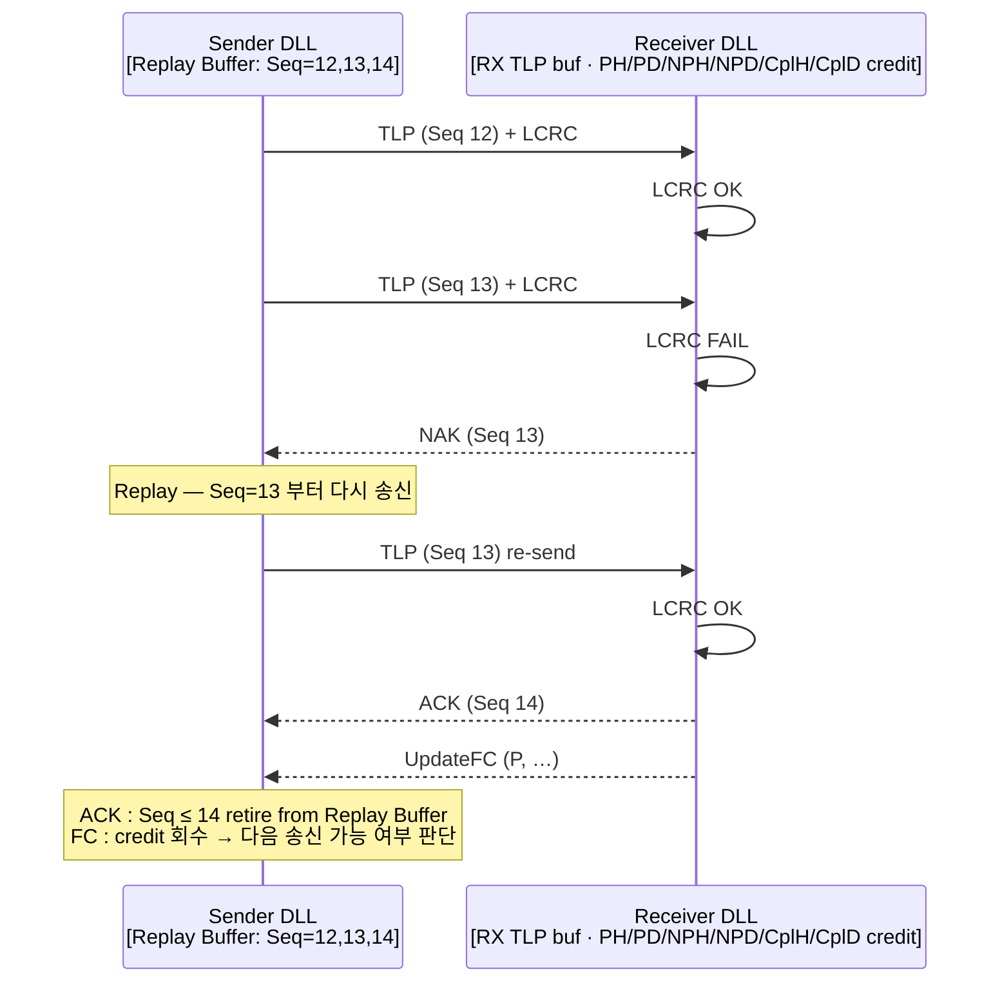
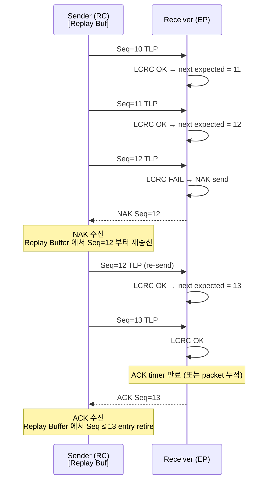
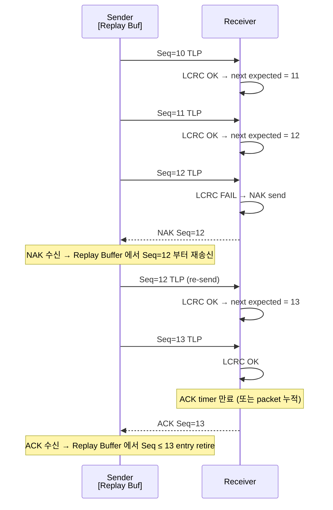
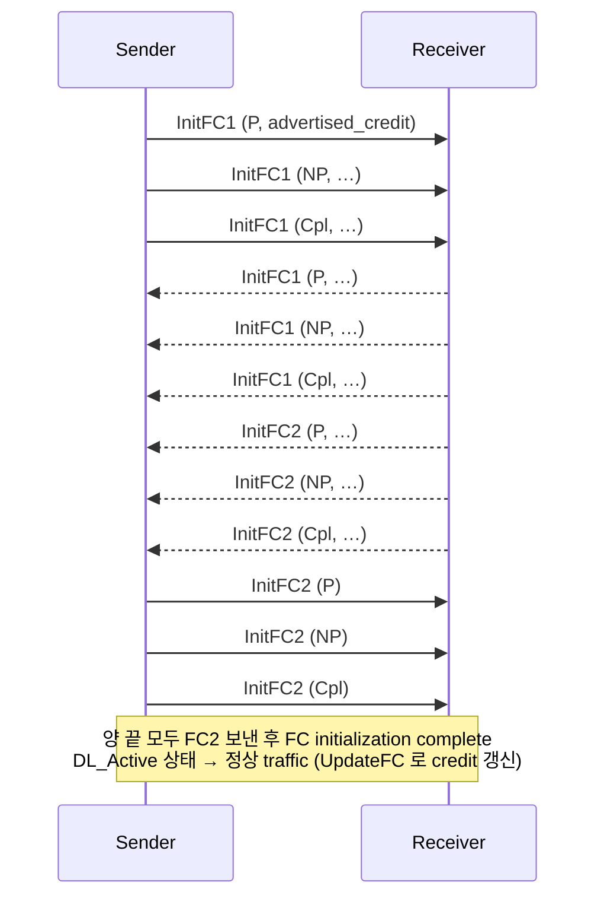

# Module 04 — DLLP, Flow Control, ACK/NAK

<!-- DV-SKOOL-CH-CTX:start -->
<div class="chapter-context" data-cat="intercon">
  <a class="chapter-back" href="../">
    <span class="chapter-back-arrow">←</span>
    <span class="chapter-back-icon">🔌</span>
    <span class="chapter-back-text">PCI Express</span>
  </a>
  <span class="chapter-divider">›</span>
  <span class="chapter-marker">Module 04</span>
</div>
<!-- DV-SKOOL-CH-CTX:end -->

<!-- DV-SKOOL-CH-TOC:start -->
<div class="page-toc">
  <span class="page-toc-label">목차</span>
  <a class="page-toc-link" href="#1-why-care-이-모듈이-왜-필요한가">1. Why care?</a>
  <a class="page-toc-link" href="#2-intuition-음식점-좌석-비유와-한-장-그림">2. Intuition</a>
  <a class="page-toc-link" href="#3-작은-예-3-tlp-중-1개-lcrc-error-가-replay-까지-가는-과정">3. 작은 예 — LCRC error 의 replay 사이클</a>
  <a class="page-toc-link" href="#4-일반화-dll-의-3-역할-reliability-flow-control-link-state">4. 일반화 — DLL 의 3 역할</a>
  <a class="page-toc-link" href="#5-디테일-dllp-카탈로그-fc-credit-rule-gen6-flit">5. 디테일</a>
  <a class="page-toc-link" href="#6-흔한-오해-와-dv-디버그-체크리스트">6. 흔한 오해 + DV 디버그 체크리스트</a>
  <a class="page-toc-link" href="#7-핵심-정리-key-takeaways">7. 핵심 정리</a>
</div>
<!-- DV-SKOOL-CH-TOC:end -->

!!! objective "학습 목표"
    이 모듈을 마치면:

    - **List** DLLP 의 종류 (Ack, Nak, FC Init/Update, PM_*, Vendor) 와 8 byte 포맷을 나열한다.
    - **Trace** ACK/NAK 시퀀스와 Replay Buffer 동작을 timeline 으로 추적한다.
    - **Compute** P/NP/Cpl 별 (Header credit + Data credit) 모델로 송신 가능 여부를 판정한다.
    - **Diagram** Gen6 의 FLIT mode 가 ACK/NAK 메커니즘을 어떻게 단순화하는지 그릴 수 있다.
    - **Distinguish** ACK 와 FC Update 의 의미 차이를 정확히 구분해 stall 원인을 분류한다.

!!! info "사전 지식"
    - Module 02 (DLL 책임)
    - Module 03 (TLP 의 P/NP/Cpl 분리)

---

## 1. Why care? — 이 모듈이 왜 필요한가

**Link 가 동작하지 않을 때 80% 는 DLL 영역의 이슈** (FC credit 부족, ACK/NAK loop, Replay buffer overflow). DLLP 와 FC 의 동작을 정확히 알아야 packet trace 에서 stall 의 원인을 찾을 수 있습니다.

이 모듈의 어휘 — **Sequence# / LCRC / Replay Buffer / FC credit (PH/PD/NPH/NPD/CplH/CplD) / ACK coalescing** — 가 이후 stall debug, AER correctable counter 해석, Gen6 FLIT 의 차이를 이해하는 기반. 한 번 정확히 잡으면 packet trace 만 봐도 _"이건 NP credit 부족"_ 처럼 즉시 분류할 수 있습니다.

---

## 2. Intuition — 음식점 좌석 비유와 한 장 그림

!!! tip "💡 한 줄 비유"
    **Flow Control credit** ≈ **음식점 좌석 예약**.<br>
    좌석이 비어야 (credit 있음) 손님 (TLP) 보낼 수 있음. 좌석 종류 (P/NP/Cpl) 마다 별도 카운트 — VIP 좌석 (Cpl) 이 비어도 일반 (P) 이 차면 못 받음. 손님이 식사 끝내면 (TL 처리 완료) 좌석 반환 (FC Update DLLP). 처음에 "좌석 N 개" 알려줌 (FC Init).

### 한 장 그림 — DLL 의 두 트랙



**두 트랙이 분리된 layer 의 두 트랙**:

- **Reliability 트랙** — Seq# / LCRC / ACK / NAK / Replay. "내가 보낸 packet 이 정상 도착했는가."
- **Flow Control 트랙** — credit per (P/NP/Cpl) × (Header/Data). "다음 packet 을 보낼 buffer 자리가 있는가."

### 왜 이 디자인인가 — Design rationale

세 가지 요구가 동시에 풀려야 했습니다.

1. **Hop-level reliability** (PHY BER ≠ 0) → Seq# + LCRC + ACK/NAK + Replay.
2. **Receiver buffer overflow 방지** (TL 의 처리 속도 ≠ link 속도) → P/NP/Cpl 별 credit-based FC.
3. **Producer-Consumer ordering 보장** (TL 의 ordering rule 과 호환) → P/NP/Cpl 분리된 credit pool.

세 요구의 교집합이 **DLLP (8B link-level packet) + 12-bit Seq# + 6 credit groups** 입니다.

---

## 3. 작은 예 — 3 TLP 중 1 개 LCRC error 가 replay 까지 가는 과정

가장 단순한 시나리오. Sender 가 Seq=10/11/12 의 TLP 3 개를 연속 송신, 12 가 LCRC error 로 깨짐. 그 후 13/14 가 추가 송신.



### 단계별 의미

| Step | 누가 | 무엇을 | 왜 |
|---|---|---|---|
| ① | Sender DLL | Seq=10/11/12 의 TLP 를 Replay Buffer 에 저장 + 송신 | ACK 받기 전까지 보관 필수 |
| ② | Receiver DLL | Seq=10, 11 의 LCRC OK → next_expected 증가 | hop-level 무결성 통과 |
| ③ | Receiver DLL | Seq=12 의 LCRC FAIL → NAK with seq=12 | 재전송 요청 |
| ④ | Sender DLL | NAK Seq=12 수신 → Replay Buffer 에서 Seq=12 부터 재송신 | "그 지점부터 모두 다시" |
| ⑤ | Receiver DLL | Seq=12 재수신 → OK → 13 도 OK → ACK Seq=13 (누적 ACK) | ACK coalescing |
| ⑥ | Sender DLL | ACK Seq=13 → Replay Buffer 에서 Seq ≤ 13 retire | 메모리 회수 |

```c
// 의사코드 — Sender DLL 의 NAK 처리
void on_nak(uint16_t bad_seq) {
    // NAK 받으면 그 seq 부터 모두 재송신
    for (uint16_t s = bad_seq; s != next_transmit_seq; s = (s + 1) % 4096) {
        struct tlp t = replay_buffer_get(s);
        send_phy_with_seq(t, s);
    }
    replay_count++;
    if (replay_count > REPLAY_MAX) {
        // Replay 한도 초과 → DL_Inactive → LTSSM Recovery
        dl_state = DL_INACTIVE;
        trigger_ltssm_recovery();
    }
}

// Sender DLL 의 ACK 처리
void on_ack(uint16_t cumulative_seq) {
    // 누적 ACK — cumulative_seq 까지 모두 retire
    while (replay_buffer_oldest_seq() <= cumulative_seq) {
        replay_buffer_retire_oldest();
    }
    replay_count = 0;  // 정상 진행 → reset
}
```

!!! note "여기서 잡아야 할 두 가지"
    **(1) NAK 은 단일 packet 이 아니라 _그 Seq 부터 끝까지_ 의 재송신을 트리거한다.** 그래서 단일 비트 오류가 늦게 발견되면 retransmission 비용이 큼 — ACK 가 일찍 돌아와야 효율. <br>
    **(2) Replay Buffer 가 차면 sender 가 stall 한다 — credit 처럼 동작.** RTT 가 큰 link (long-distance, retimer 다수) 에서는 작은 buffer 가 throughput 의 발목.

---

## 4. 일반화 — DLL 의 3 역할 (Reliability / Flow Control / Link State)

### 4.1 DLL 의 3 책임

| 책임 | 메커니즘 | DLLP 종류 |
|---|---|---|
| **Reliability** | Seq# (12-bit) + LCRC (32-bit) + Replay Buffer + ACK/NAK | Ack, Nak |
| **Flow Control** | P/NP/Cpl × Header/Data 의 6 credit 그룹 (per VC) | InitFC1, InitFC2, UpdateFC |
| **Link State** | DL_Inactive → DL_Init → DL_Active | (state machine, no DLLP) |
| **Power Mgmt 신호** | PM_Enter_L1, PM_Request_Ack, … | PM_xxx |

### 4.2 Sequence Number 모델

```
   범위: 0..4095 (modulo 4096)

   Sender
     - Next Transmit Seq# (NTS): 송신할 Seq#
     - Acknowledged Seq# (AckSeq): 마지막 ACK 받은 #

   Receiver
     - Next Receive Seq# (NRS): 받을 것으로 기대하는 Seq#
     - Receive Buffer 의 last good Seq#

   조건: 항상 (NTS - AckSeq) mod 4096 < buffer_size
```

→ Window size = 2048 (modulo 의 절반) 정도가 정상 운영 범위. modulo arithmetic 이라 "앞뒤" 비교 시 절반 window 만 안전.

### 4.3 ACK ≠ FC Update — 두 메커니즘의 분리

```
   ACK :    "이 Seq# 까지 LCRC 검증 OK 로 받았다"
            → Sender 의 Replay Buffer entry retire
            → Reliability 트랙

   FC Update: "이만큼 credit 이 다시 비었다, 이 만큼 더 보내도 된다"
            → Sender 의 송신 가능 여부 판단
            → Flow Control 트랙
```

두 메커니즘이 같은 방향 (receiver → sender) 의 DLLP 라는 공통점이 있지만, **하나는 packet integrity, 다른 하나는 buffer occupancy**. 헷갈리면 stall 분석에서 잘못된 결론.

---

## 5. 디테일 — DLLP 카탈로그, FC credit rule, Gen6 FLIT

### 5.1 DLLP 구조 (8 byte 고정)

```
   Byte 0 (Type)   Byte 1-3 (Type-specific) Byte 4-7 (CRC + LCRC)
   ┌──────────┬─────────────────────────────────────┐
   │ Type 8b  │   payload (3 byte)                  │
   ├──────────┼─────────────────────────────────────┤
   │   16-bit DLLP CRC (separate from TLP LCRC)     │
   └────────────────────────────────────────────────┘
```

| Type | DLLP | 설명 |
|------|------|------|
| `0000_0000` | **ACK** | 누적 ACK — Sequence # 까지 수신 OK |
| `0001_0000` | **NAK** | Sequence Number 부터 재송 요청 |
| `0010_VVVV` | **PM_xxx** | Power Management (Enter_L1, Request_Ack, ...) |
| `0011_xxxx` | **Vendor Specific** | 벤더 확장 |
| `01_VC_TYPE` | **InitFC1 / InitFC2 / UpdateFC** | FC initialization / update — VC 와 type (P/NP/Cpl) 인코딩 |

**InitFC1 → InitFC2 → UpdateFC** 의 3 단계로 FC initialization 완료.

### 5.2 ACK / NAK 타임라인 (전체)



#### Replay Buffer

- 송신 후 ACK 받기 전까지 TLP 보관.
- NAK 시 그 Seq# 부터 재송신.
- ACK 시 그 Seq# 까지의 entry retire (메모리 회수).
- **Buffer 가 차면 sender stall** — credit 처럼 동작.

#### ACK Coalescing

매 packet 마다 ACK 보내면 비효율. Receiver 는 일정 packet 누적 또는 timer 만료 시 누적 ACK 1 개. spec 의 `AckFactor` parameter 가 양 끝의 협상 결과를 결정.

#### Replay Number Rollover

Replay 횟수가 한도 (보통 4) 초과 → DL 가 link recovery 트리거. LTSSM Recovery 단계로 빠짐.

!!! quote "Spec 인용"
    PCIe Base Spec 의 "Data Link Layer Specification > Retry Buffer" 와 "Ack/Nak Protocol" 섹션. (Spec 자체는 PCI-SIG 회원사 비공개)

### 5.3 Sequence Number 12-bit

```
   범위: 0..4095 (modulo 4096)

   Sender
     - Next Transmit Seq# (NTS): 송신할 Seq#
     - Acknowledged Seq# (AckSeq): 마지막 ACK 받은 #

   Receiver
     - Next Receive Seq# (NRS): 받을 것으로 기대하는 Seq#
     - Receive Buffer 의 last good Seq#

   조건: 항상 (NTS - AckSeq) mod 4096 < buffer_size
```

→ Window size = 2048 (modulo 의 절반) 정도가 정상 운영 범위.

### 5.4 Flow Control — 6 Credit Groups

```
   각 Virtual Channel (VC) 마다 독립적으로:
                Header   Data
                ──────   ────
   Posted   :   PH       PD
   Non-Posted:  NPH      NPD
   Completion:  CplH     CplD
```

- Header credit: 1 unit = 4 DW (header size)
- Data credit: 1 unit = 4 DW = 16 byte

**Receiver 의 advertised credit** = receiver 의 RX buffer 가 받을 수 있는 양.

**Sender 의 송신 조건**:

```
   if  TLP 의 header 가 1 unit 이고 payload 가 N DW 이면:
       (used_PH + 1) ≤ credit_limit_PH
       and (used_PD + ceil(N/4)) ≤ credit_limit_PD
   → 만족 시 송신 가능
```

만족 못 하면 **stall** — receiver 가 UpdateFC 로 credit 풀어주기를 기다림.

#### Infinite Credit (∞)

일부 카테고리는 spec 가 무한 credit 을 허용 (특히 Completion 의 Header).

→ FC Init1 / Init2 의 "credit advertised value" field 가 0 인 경우 ∞ 의미.

#### FC Initialization



UpdateFC: 현재 credit consumed 의 총합 (modulo) 을 주기적으로 송신.

### 5.5 디버그 — Stall 의 원인 분류

```
   Sender 가 packet 못 보냄
       │
       ├─ Replay Buffer full ?
       │      → ACK 늦거나 NAK 빈발
       │      → Receiver LCRC error 확인
       │      → Link 의 BER 또는 PHY 문제
       │
       ├─ FC credit 부족 ?
       │      → 어느 그룹? (PH/PD/NPH/NPD/CplH/CplD)
       │      → Receiver 의 TL 이 packet 처리 못 따라가는가
       │      → UpdateFC 주기가 비정상으로 느린가
       │
       ├─ Outstanding NP 한도 초과 ?
       │      → Tag pool 고갈
       │      → 가장 흔한 원인: Completion 늦게 오거나 timeout
       │
       └─ DL_Inactive 로 빠짐 ?
              → LTSSM Recovery 발생
              → 더 깊은 PHY 진단 필요 (Module 05)
```

### 5.6 Gen6 FLIT mode

```
   Pre-Gen6:   가변 길이 TLP/DLLP
   Gen6 FLIT:  고정 256-byte FLIT 프레임
               ┌──────────┬──────────────────────┬──────┬──────┐
               │ FLIT Hdr │ TLP / DLLP payload   │ CRC  │ FEC  │
               │  6 byte  │      236 byte        │ 8B   │ 6B   │
               └──────────┴──────────────────────┴──────┴──────┘
```

| 변화 | 효과 |
|------|------|
| 고정 프레임 | Framing 단순화 (STP/END token 불필요) |
| FEC (Forward Error Correction) | PAM4 의 BER 증가를 보완, single-bit 정정 |
| 통합 ACK/NAK | FLIT 단위로 매 frame ACK 가능 → 늦은 ACK 문제 ↓ |
| FLIT mode 만 지원 | Gen6 이상 link 는 FLIT mode 강제 |

→ Gen5 이하의 ACK/NAK 메커니즘은 그대로 살아 있지만, **Gen6 부터 spec 의 default 가 FLIT mode**.

### 5.7 검증 (DV) 시 자주 보는 시나리오

| 시나리오 | 목표 |
|---------|------|
| **Replay 강제** | LCRC corruption inject → NAK → replay 정상 동작 확인 |
| **Replay overflow** | ACK 일부러 drop → Replay 횟수 한도 → Recovery 진입 |
| **FC stall** | Receiver TL 의 처리 속도 강제 저하 → credit 부족 → sender stall 검증 |
| **Tag exhaustion** | NP 8b/10b tag pool 고갈 직전 시나리오 |
| **FC update timing** | UpdateFC 주기 변화에 따른 throughput 영향 |
| **Sequence # wraparound** | 4096 packet 보내 wrap 동작 확인 |
| **DLLP CRC fail** | DLLP 자체에 CRC corruption — 어떻게 처리되는지 |

---

## 6. 흔한 오해 와 DV 디버그 체크리스트

### 흔한 오해

!!! danger "❓ 오해 1 — 'ACK 와 FC Update 는 같은 것이다'"
    **실제**: 서로 다른 layer 의 다른 메커니즘.

    - **ACK**: "이 sequence # 까지 LCRC 검증 OK 로 받았다" — DLL의 reliability.
    - **FC Update**: "이만큼 credit 이 다시 비었다, 이 만큼 더 보내도 된다" — TL 의 flow control.

    하나는 packet integrity, 다른 하나는 buffer occupancy. 헷갈리면 stall 분석에서 잘못된 결론.

    **왜 헷갈리는가**: 둘 다 receiver → sender 방향 DLLP 라는 공통점 때문.

!!! danger "❓ 오해 2 — '한 NAK 은 한 packet 만 재송신을 트리거한다'"
    **실제**: NAK 은 그 Seq# **이후 모두** 의 재송신을 트리거. cumulative semantics. 단일 비트 오류가 늦게 발견되면 large 한 retransmit overhead 가 발생 — 그래서 ACK timer 가 너무 길지 않아야.<br>
    **왜 헷갈리는가**: TCP-style "selective ACK" 와의 혼동.

!!! danger "❓ 오해 3 — 'Cpl credit 은 항상 무한이라 신경 쓸 필요 없다'"
    **실제**: spec 가 Cpl 의 Header/Data credit 을 ∞ 로 광고하도록 _허용_ 하지만 _강제_ 하지는 않음. Implementation 에 따라 finite credit 을 광고할 수 있고, 그 경우 Cpl stall 도 발생. FC Init1 의 광고값을 직접 확인 필요.<br>
    **왜 헷갈리는가**: 일부 자료가 "Cpl 은 ∞" 로 단순화.

!!! danger "❓ 오해 4 — 'Replay Buffer size 는 spec 에 정해져 있다'"
    **실제**: spec 는 _최소_ 만 규정 (RTT 와 ACK timer 를 견딜 정도). 실제 size 는 implementation 결정. 큰 size → throughput, 작은 size → 면적/전력 — trade-off. RTT 큰 link (retimer 다수) 에서는 작은 buffer 가 stall 의 주범.

!!! danger "❓ 오해 5 — 'Gen6 FLIT 이라 ACK/NAK 이 사라진다'"
    **실제**: Gen6 FLIT 도 reliability 가 필요 — 단지 _프레임 단위_ 가 가변 → 256B 고정 으로 바뀐 것. ACK/NAK 메커니즘은 단순화되지만 사라지지 않음. FLIT mode 의 ACK 는 매 FLIT 단위로 가능해 latency 가 줄어드는 장점.

### DV 디버그 체크리스트 (이 모듈 내용으로 마주칠 첫 실패들)

| 증상 | 1차 의심 | 어디 보나 |
|---|---|---|
| Sender 가 packet 0 — link up 했는데 traffic 0 | FC initialization 미완료 또는 credit advertised = 0 | InitFC1/2 양쪽 교환 + DL_Active 상태 |
| Latency spike + AER correctable counter ↑ | LCRC error → NAK → replay 빈발 | Receiver 의 LCRC error rate, replay 횟수 통계 |
| 특정 워크로드에서만 stall | Cpl credit 부족 (split 많은 read) | NPH/NPD 또는 CplH/CplD credit 사용량 추적 |
| Tag pool 고갈로 새 NP 못 보냄 | Cpl 이 timeout 으로 안 옴 → outstanding 누적 | Completion Timeout counter + Tag tracking |
| `lspci` 로 봤을 때 link 정상이지만 throughput 0 | DL_Active 미진입 | LTSSM L0 도달했는데 DLL state 가 stuck — DLLP 캡처 |
| Sequence# wrap 후 새 packet 이 거부 | 12-bit modulo arithmetic 버그 | sender 의 NTS-AckSeq 모듈로 비교 |
| DLLP CRC 자체가 깨져서 ACK 무효 | PHY BER 또는 DLLP CRC 계산 버그 | DLLP CRC error counter (별도) |
| Gen6 FLIT 인데 기존 분석 도구가 표시 못 함 | FLIT-aware analyzer 가 아님 | FLIT mode 인지 확인 → 도구 교체 |

---

## 7. 핵심 정리 (Key Takeaways)

- DLLP = 8-byte link-level packet (Ack, Nak, FC Init/Update, PM_*, Vendor) — TL 이 보지 않음.
- ACK/NAK + Sequence # (12-bit) + Replay Buffer 가 link reliability.
- Flow Control 은 P/NP/Cpl × Header/Data 의 6 credit 그룹 (per VC).
- FC Init: InitFC1 → InitFC1 양방향 → InitFC2 양방향 → DL_Active.
- Gen6 FLIT 는 256B 고정 프레임 + FEC + 단순화된 ACK 메커니즘.

!!! warning "실무 주의점"
    - "Link up 됐는데 traffic 0" 의 99%: FC initialization 미완료 또는 credit advertised = 0 으로 시작.
    - DLLP CRC 와 LCRC 와 ECRC 는 모두 다른 메커니즘 — packet trace 에서 명확히 구분.
    - Replay buffer 는 DUT 마다 size 가 다름. RTT 가 큰 retimer 환경에서는 작은 buffer 가 throughput 의 발목.
    - "ACK 가 안 옴" 의 원인 진단: receiver 가 link 가 down (LTSSM 빠짐) / receiver 의 ACK timer 가 너무 길게 설정 / DLLP 자체가 PHY 에서 깨짐.
    - Gen6 FLIT 모드 검증은 기존 ACK/NAK packet trace 도구가 적용 안 될 수 있음 — FLIT-aware analyzer 필요.

---

## 다음 모듈

→ [Module 05 — Physical Layer & LTSSM](05_phy_ltssm.md): DL_Inactive 로 빠진 link 가 어떻게 LTSSM Recovery 와 EQ 로 회복되는지. PHY 의 11 state 와 4 phase EQ.

[퀴즈 풀어보기 →](quiz/04_dllp_flow_control_quiz.md)

--8<-- "abbreviations.md"
--8<-- "_inc/topic_abbr.md"
