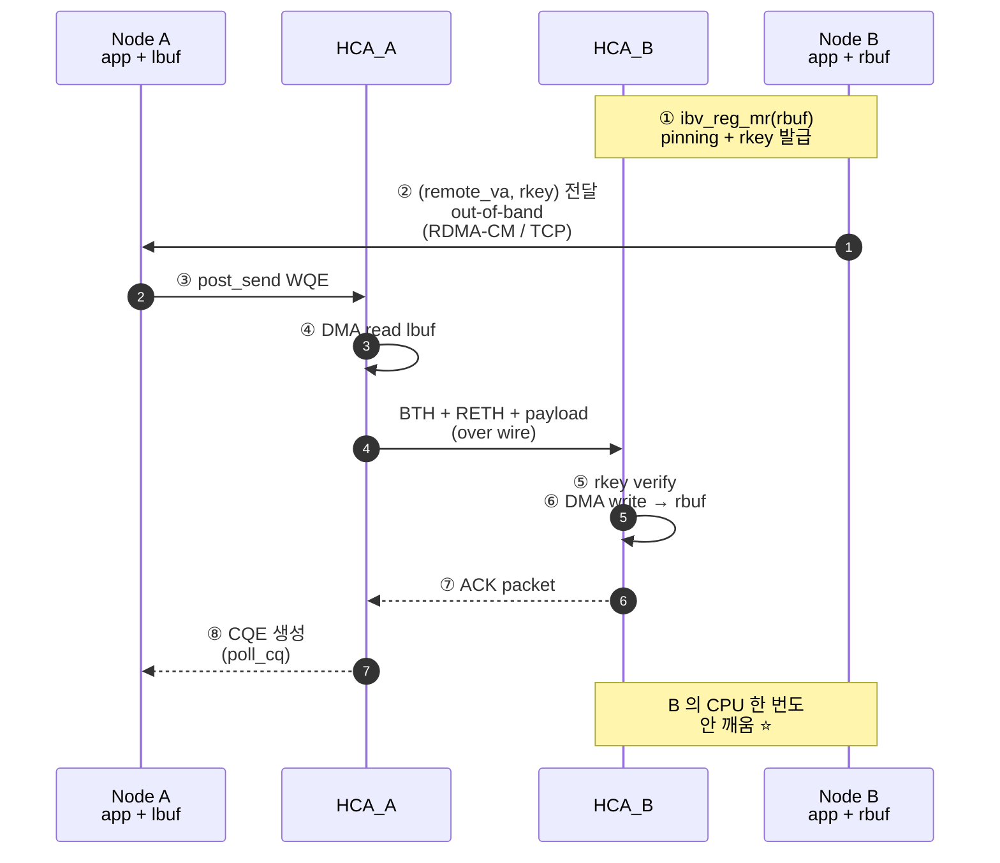
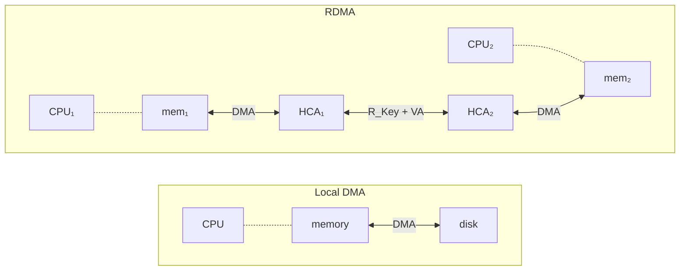

# Module 01 — RDMA 동기와 핵심 모델

<!-- DV-SKOOL-CH-CTX:start -->
<div class="chapter-context" data-cat="network">
  <a class="chapter-back" href="../">
    <span class="chapter-back-arrow">←</span>
    <span class="chapter-back-icon">⚡</span>
    <span class="chapter-back-text">RDMA</span>
  </a>
  <span class="chapter-divider">›</span>
  <span class="chapter-marker">Module 01</span>
</div>
<!-- DV-SKOOL-CH-CTX:end -->

<!-- DV-SKOOL-CH-TOC:start -->
<div class="page-toc">
  <span class="page-toc-label">목차</span>
  <a class="page-toc-link" href="#1-why-care-이-모듈이-왜-필요한가">1. Why care?</a>
  <a class="page-toc-link" href="#2-intuition-비유와-한-장-그림">2. Intuition</a>
  <a class="page-toc-link" href="#3-작은-예-1-kb-rdma-write-를-step-by-step-으로-따라가기">3. 작은 예 — 1 KB WRITE 따라가기</a>
  <a class="page-toc-link" href="#4-일반화-세-가지-축과-6-객체">4. 일반화 — 세 축 + 6 객체</a>
  <a class="page-toc-link" href="#5-디테일-스택-변형-api-워크로드">5. 디테일</a>
  <a class="page-toc-link" href="#6-흔한-오해-와-dv-디버그-체크리스트">6. 흔한 오해 + DV 디버그 체크리스트</a>
  <a class="page-toc-link" href="#7-핵심-정리-key-takeaways">7. 핵심 정리</a>
</div>
<!-- DV-SKOOL-CH-TOC:end -->

!!! objective "학습 목표"
    이 모듈을 마치면:

    - **Explain** TCP/IP 가 가진 세 가지 비용 (memcpy / stack / interrupt) 을 RDMA 가 어떻게 제거하는지 설명할 수 있다.
    - **Distinguish** "DMA" 와 "RDMA" 를 단어가 아니라 **데이터 흐름** 관점에서 구분할 수 있다.
    - **Trace** 1 KB RDMA WRITE 한 번을 8단계로 끝까지 추적할 수 있다.
    - **Identify** Verbs 6 객체 (PD, MR, QP, CQ, WQE, WC) 의 역할과 협력 관계를 식별한다.
    - **Compare** IB / iWARP / RoCEv1 / RoCEv2 의 계보와 사용 영역을 비교한다.

!!! info "사전 지식"
    - TCP/IP 송수신 흐름 (sk_buff, copy_to/from_user, NIC interrupt)
    - DMA, PCIe 의 memory-mapped IO

---

## 1. Why care? — 이 모듈이 왜 필요한가

### 1.1 시나리오 — 1024-GPU LLM 학습이 통신에서 죽는다

2026년 1월. 우리는 H100 1024 개로 GPT 급 LLM 을 학습합니다. 매 step 마다 **32 GB 의 gradient** 를 all-reduce 해야 합니다.

**문제**: 한 step 의 compute 시간은 ~600 ms. 그런데 _통신_ 만 잘못 짜면 step 시간이 **2~3 배** 늘어납니다. 측정해 봅시다.

```
   Per-step gradient allreduce, 1024 GPU × 32 GB = 32 TB aggregate
                            ┌─────────────────────────────────────────┐
   TCP/IP over 100 GbE      │ ~ 6.4 s / step    (10× compute time)    │ ← 학습 불가능
   RDMA over 100 GbE        │ ~ 0.4 s / step    (compute 와 겹침)      │
                            └─────────────────────────────────────────┘
   * 출처: NCCL all_reduce_perf, 92% of fabric peak ~ 370 GB/s on 400G fabric.
     [Oracle/Nebius blog, 2025]
```

**왜 이 차이가 나는가?** TCP/IP 는 100 Gbps 라인레이트를 채우려면 CPU 코어를 **4 ~ 8 개** 통째로 통신 처리에 쓴다 — 그러면 _학습 코드_ 가 돌 수 있는 코어가 그만큼 줄어듭니다. 그리고 매 메시지마다 `copy_from_user` + 스택 + interrupt 의 누적이 **p99 latency** 를 폭주시킵니다 (10 µs → 50 µs 의 tail).

### 1.2 그래서 이 모듈을 잡아야 한다

이후 모든 RDMA 모듈은 한 가정에서 출발합니다 — **"네트워크의 양 끝 NIC 가 host CPU 를 거치지 않고 상대 노드의 메모리를 직접 읽고/쓴다"**. IB 패킷 헤더가 왜 그렇게 생겼는지, RC service 가 왜 PSN/ACK 를 hardware 로 처리하는지, DV TB 가 왜 host memory 와 MMU 까지 모델링해야 하는지 — 전부 이 한 가정의 파생입니다.

이 모듈을 건너뛰면 이후의 모든 spec/패킷/검증 결정이 "그냥 외워야 하는 규칙" 으로 보입니다. 반대로 이 가정을 정확히 잡고 나면, 디테일을 만날 때마다 **"아, 이게 zero-copy 를 위한 거구나"** 처럼 _이유_ 가 보입니다.

!!! question "🤔 잠깐 — 100 Gbps 에서 패킷 한 개 간격은?"
    1500-byte 이더넷 프레임을 100 Gbit/s 로 연속 전송한다고 합시다. 패킷 하나가 도착하는 시간 간격은 약 얼마인가요?

    이게 왜 중요한가? CPU 가 인터럽트 받고 context switch 하는 데 **수백 ns** 가 듭니다. 만약 패킷 간격이 그것보다 짧으면?

    ??? success "정답"
        **약 120 ns** (1500 B × 8 / 100 Gbit/s ≈ 120 ns).

        Context switch 가 ~500 ns 이므로, 패킷이 도착할 때마다 CPU 가 깨면 **CPU 가 패킷 도착 속도를 못 따라잡습니다**. → 이게 곧 "interrupt coalescing" 과 "kernel bypass" 가 동시에 필요한 이유.

---

## 2. Intuition — 비유와 한 장 그림

!!! tip "💡 한 줄 비유"
    **TCP/IP** = 택배 회사. 박스에 담아(`copy_from_user`) 우체국(kernel/NIC)에 맡기고, 받는 쪽 우체국이 풀어서 다시 옮겨담아(`copy_to_user`) 사용자에게 줌.<br>
    **RDMA** = 두 사무실이 _같은 캐비넷에 한 서랍씩 공유_ 하는 모델. 미리 "여기가 네 서랍이야" 라고 등록(MR)해 두면 상대가 우체국 거치지 않고 직접 쓰고 빠짐.

### 한 장 그림 — TCP path vs RDMA path

```d2
direction: right

TCP: "TCP/IP — 3 copies + interrupt" {
  direction: down
  T1: "App"
  T2: "user buf"
  T3: "socket buf"
  T4: "NIC"
  T5: "NIC (수신)"
  T6: "socket buf"
  T7: "App"
  T1 -> T2
  T2 -> T3: "copy_from_user · CPU"
  T3 -> T4: "TCP/IP stack · CPU"
  T4 -> T5: "wire"
  T5 -> T6: "IRQ → ksoftirqd · CPU"
  T6 -> T7: "copy_to_user · CPU"
}
RDMA: "RDMA — 0 copies, no IRQ" {
  direction: down
  R1: "App"
  R2: "user buf\n(= MR, 등록만 해 두면 끝)"
  R3: "HCA"
  R4: "HCA (peer)"
  R5: "peer MR"
  R1 -> R2
  R2 -> R3: "MMIO doorbell"
  R3 -> R4: "DMA → wire"
  R4 -> R5: "rkey 검증 후\n직접 DMA write\n(peer CPU 안 깨움)"
}
```

세 개의 빨간 원이 RDMA 에서는 모두 사라지고, 대신 **HCA hardware** 가 PSN, ACK, 재전송, 무결성 검사를 처리합니다.

### 왜 이렇게 설계됐는가 — 순진한 시도가 모두 실패한 결과

RDMA 가 채택한 설계는 _하늘에서 떨어진_ 게 아닙니다. 1990년대~2000년대 초 여러 순진한 시도가 _구체적으로 어디서 막혔는지_ 의 결과물입니다. 세 가지 대표 시도를 따라가 봅시다.

**시도 1 — "TCP/IP 스택을 더 빠르게 만들면?"** (Toe, TCP Offload Engine)
NIC 에 TCP 처리를 일부 offload 하면? → 일부 latency 개선되지만 _user space 까지_ 의 `copy_to_user` 와 socket buffer 가 여전히 존재. CPU jitter 가 사라지지 않음. **결론: socket API 자체가 병목.**

**시도 2 — "그냥 DMA 를 wire 로 확장하면?"** (단순 remote DMA)
"내 메모리 ↔ 내 디바이스" 의 DMA 를 "내 메모리 ↔ 원격 메모리" 로 일반화하면 안 되나? → 두 가지가 막힘:

- **보안**: 원격 노드가 임의 메모리 주소를 쓸 수 있으면 OS isolation 붕괴. → "사전 등록(MR) + 키(R_Key)" 같은 권한 제어 필요.
- **주소**: 원격 노드는 내 가상 주소도, 물리 주소도 모름. → IOVA 와 MR 등록으로 매핑 필요.

**시도 3 — "MMIO 로 원격 메모리 직접 쓰면?"** (memory-mapped over wire)
PCIe 같은 메모리-매핑 IO 를 네트워크로 확장? → 거리/지연 때문에 cache coherence 가 불가능. cache flush latency 만 ~10 µs. **결론: per-load/store 가 아닌 _메시지 단위_ 의 비동기 모델 필요.**

세 시도의 _부분 정답_ 을 합치면 다음 세 가지가 _동시에_ 만족돼야 한다는 결론에 도달합니다:

| 축 | 시도 1 이 못 푼 것 | 시도 2 가 못 푼 것 | 시도 3 이 못 푼 것 |
|----|------------------|------------------|------------------|
| **Kernel bypass** | ✗ (socket 잔존) | — | — |
| **Zero-copy** | ✗ (copy 잔존) | — | — |
| **Transport offload** | △ (부분만) | △ (DMA 만) | — |
| **메모리 등록 + 키** | — | ✗ (보안 구멍) | — |
| **메시지 단위 비동기** | — | — | ✗ (per-load/store) |

이 다섯이 동시에 만족돼야 _100 Gbps 라인레이트 + p99 안정 + 보안_ 이라는 세 마리 토끼가 잡힙니다. 이게 RDMA 의 설계 결정 — **kernel bypass + zero-copy + transport offload** — 가 _하나라도 빠지면 전체가 무너지는_ 이유.

100 Gbps 라인레이트에서는 패킷 1개 도착 간격이 **~120 ns** (1.1 의 계산). CPU 가 인터럽트 받고 컨텍스트 전환만 해도 수백 ns. 즉 **CPU 가 끼는 한 라인레이트를 못 채웁니다**. 그래서 세 축이 _동시에_ 만족돼야 의미가 있고, 셋 중 하나라도 빠지면 전체가 의미를 잃습니다. 이 세 축이 곧 IB/RoCE 패킷 포맷, Verbs API 디자인, 검증 환경의 구조를 결정합니다.

---

## 3. 작은 예 — 1 KB RDMA WRITE 를 step by step 으로 따라가기

가장 단순한 시나리오. 노드 **A** 가 노드 **B** 의 메모리에 **1 KB** 를 RDMA WRITE 합니다.



| Step | 누가 | 무엇을 | 의미 |
|---|---|---|---|
| ① | B 의 app | `ibv_reg_mr(rbuf, len, R/W)` 로 rbuf 등록 | NIC 가 DMA 가능하게 핀(pinning) + rkey 발급 |
| ② | B → A | (remote_va, rkey) 를 out-of-band 로 알려줌 | RDMA 자체는 채널이 없음 — 보통 RDMA-CM(over TCP) 또는 sockets |
| ③ | A 의 app | SQ 에 WRITE WQE post (`ibv_post_send`) | 단순히 도어벨 MMIO 1번 — kernel 안 거침 |
| ④ | HCA_A | lbuf 에서 1 KB DMA read | A 의 CPU 는 이미 다른 일 하고 있음 (zero-copy) |
| ⑤ | HCA_B | rkey 와 length 검증 | 실패 시 NAK → CQE error |
| ⑥ | HCA_B | rbuf 에 1 KB DMA write | B 의 **CPU 한 번도 안 깨움** ⭐ |
| ⑦ | HCA_B → HCA_A | ACK 패킷 송신 | RC service 의 reliability — hardware 가 보장 |
| ⑧ | HCA_A | CQ 에 WC 삽입 | A 의 app 이 `ibv_poll_cq` 로 회수 |

```c
// Step ③ 의 실제 코드 (A 측). 이 한 번의 post_send 가 ④~⑧ 을 트리거.
struct ibv_send_wr wr = {
    .opcode             = IBV_WR_RDMA_WRITE,
    .sg_list            = &(struct ibv_sge){
        .addr   = (uintptr_t)lbuf,    // 로컬 source
        .length = 1024,
        .lkey   = lmr->lkey,          // 로컬 보호 키
    },
    .num_sge = 1,
    .wr.rdma.remote_addr = remote_va, // ② 에서 받음
    .wr.rdma.rkey        = remote_rkey,
};
ibv_post_send(qp, &wr, &bad_wr);
ibv_poll_cq(cq, 1, &wc);              // ⑧ 까지 끝나면 status=SUCCESS
```

!!! note "여기서 잡아야 할 두 가지"
    **(1) 양 노드의 CPU 가 거의 안 쓰임** — A 는 post_send + poll_cq, B 는 0회. 이게 RDMA 의 본질. <br>
    **(2) "원격 메모리 주소" 가 미리 약속돼야 한다** — RDMA 는 _주소를 알고 직접 쓰는_ 모델. 그래서 connection setup (control path) 과 data 전송 (data path) 이 분리됩니다.

!!! question "🤔 잠깐 — 만약 step ⑥ 에서 B 의 CPU 를 깨우려면?"
    위 그림에서 B 의 CPU 는 한 번도 안 깨워졌습니다. 만약 B 의 application 이 "데이터 도착했음" 을 알아야 한다면 (예: 메시지 큐에 새 항목 push), A 는 어떤 opcode 를 써야 할까요?

    ??? success "정답"
        **SEND** 또는 **WRITE_WITH_IMMEDIATE**.
        - **SEND** 는 B 의 RQ 에서 RECV WQE 를 소비 → CQ 에 WC 가 떨어짐 → B 의 application 이 `poll_cq` 로 알아챔.
        - **WRITE_WITH_IMMEDIATE** 는 WRITE 본체와 함께 4 byte ImmDt 도 전달, 마찬가지로 B 의 CQ 에 WC 생성.
        - **일반 WRITE** 는 _완전 비동기_ — 데이터만 도착, B 의 application 은 다른 방법(polling memory, signal flag)으로 감지해야 함.

        이게 M06 의 "왜 SEND 와 WRITE_WITH_IMM 가 따로 존재하는가?" 질문의 답: **completion 통지 의무** 가 다릅니다.

---

## 4. 일반화 — 세 가지 축과 6 객체

### 4.1 RDMA 의 세 축 — 그리고 각 축이 빠지면 무엇이 부서지는가

| 축 | 무엇을 제거 | TCP/IP 와의 차이 | **이 축이 빠지면 발생하는 시스템 실패** |
|---|---|---|---|
| **Kernel bypass** | Syscall + context switch | post_send 는 user-space MMIO doorbell | 매 메시지마다 context switch (~500 ns) → p99 latency jitter 폭주 → AI training step 시간 분산 큼 → 동기 barrier 가 _가장 느린 GPU_ 에 의해 결정 → 평균 throughput 폭락 |
| **Zero-copy** | `copy_from/to_user` | NIC 가 user buffer 에서 직접 DMA (MR pinning 으로 가능) | 매 메시지마다 memcpy → 100 Gbps 양방향이면 25 GB/s memcpy → DDR4 25.6 GB/s 한 채널 통째로 점유 → application 의 메모리 대역폭이 0 으로 수렴 |
| **Transport offload** | TCP stack (PSN, ACK, retransmit, congestion) 의 SW 처리 | HCA hardware 가 RC PSN/ACK/NAK/retry 처리 | 100 Gbps 채우려면 4~8 코어 통째로 통신 처리에 점유 (Mellanox WP 2014 측정) → 64 코어 서버에서 12% 의 코어가 _학습/추론_ 이 아닌 _통신_ 에 소진 |

!!! note "Internal (Confluence: [RDMA] basic, id=934608922)"
    사내 보고서도 같은 결론: "1Gbps 네트워크 시대에 설계된 소켓 통신 방식은 100Gbps, 400Gbps, 나아가 800Gbps에 이르는 현대의 고속 네트워크 대역폭을 감당하기에 지나치게 비효율적이다. 100Gbps 대역폭을 TCP/IP로 포화시키기 위해서는 최신 멀티코어 프로세서의 상당수 코어를 오직 통신 처리에만 할당해야 하는 비효율이 발생한다."

    **사내 자료가 외부 자료(Mellanox WP, Oracle Cloud benchmark)와 일치하므로 이 측정은 신뢰 가능.**

### 4.1.1 대안 비교 — 왜 iWARP 가 시장에서 사실상 졌나?

세 축이 모두 만족돼야 한다면, _부분만_ 만족시키는 대안은 어떻게 됐을까? iWARP 의 흥망에서 답을 찾을 수 있습니다.

| 변형 | Kernel bypass | Zero-copy | Transport offload | 결과 |
|------|---------------|-----------|-------------------|------|
| **TCP/IP** | ✗ | ✗ | ✗ | 100 Gbps 부적합 (CPU 폭주) |
| **iWARP** | ✓ | ✓ | △ (TCP 위라 retransmit/PSN 결국 SW 도움) | 3 µs latency. RoCE 의 1.3 µs 에 비해 **2.3 배 느림**. 시장 outcompete 됨 |
| **RoCEv2** | ✓ | ✓ | ✓ (BTH 가 IB Transport 그대로) | 7~10 µs latency (DC 라우팅 시), IB 의 1~2 µs 에 가까운 성능 |
| **InfiniBand** | ✓ | ✓ | ✓ | 1~2 µs latency, switch port-port 100 ns |

**교훈**: iWARP 는 "TCP 위에서 RDMA 의 _프로그래밍 모델_ 만 제공" — 호환성은 좋지만 transport offload 가 _TCP 의 제약_ 을 그대로 안고 감. 그래서 latency 와 throughput 모두 RoCE 에 밀림. 2026 년 현재 iWARP 는 legacy 로 분류[NVIDIA RoCE vs iWARP WP, 2025; AI Journal RoCEv2 vs IB vs iWARP, 2025].

!!! quote "외부 자료"
    "There are RoCE HCAs with a latency as low as 1.3 microseconds while the lowest known iWARP HCA latency in 2011 was 3 microseconds." — *RDMA over Converged Ethernet, Wikipedia, 2025*

### 4.2 DMA vs RDMA — 한 글자 차이의 의미

!!! note "정의 (ISO 11179)"
    - **DMA**: CPU 의 직접 개입 없이 디바이스가 호스트 메모리를 직접 read/write 하는 메커니즘.
    - **RDMA**: 네트워크의 양 끝에서 DMA 가 동시에 일어나, **원격** 노드의 메모리를 read/write 하는 메커니즘.



핵심: RDMA 는 "원격 노드의 메모리 주소" 를 (1) 사전 등록(Memory Registration), (2) 보호 키 (R_Key) 와 함께 노출, (3) 양 끝의 NIC 가 그 주소를 인식해 DMA 를 수행.

### 4.3 Verbs 6 객체 — 협력 관계

```d2
direction: down

PD: "**PD** · Protection Domain\n같은 PD 안에서만 cross-access 허용"
MR: "**MR** · Memory Region\nDMA 가능 영역 + access flag\nlkey / rkey"
QP: "**QP** · Queue Pair\nservice: RC / UC / UD / XRC"
SQ: "**SQ** · Send Queue"
RQ: "**RQ** · Recv Queue"
CQ: "**CQ** · Completion Queue"
WQE: "WQE — operation 디스크립터" { shape: oval }
WC: "WC — 처리 결과" { shape: oval }
PD -> MR
PD -> QP
QP -> SQ
QP -> RQ
WQE -> SQ: "post_send"
WQE -> RQ: "post_recv"
QP -> CQ: "완료 통지" { style.stroke-dash: 4 }
CQ -> WC: "poll_cq"
```

<div class="parallel-grid">
<div>

**PD (Protection Domain)**<br>
모든 객체의 보호 경계. PD 가 다른 MR/QP 끼리는 cross-access 불가.
</div>
<div>

**MR (Memory Region)**<br>
NIC 가 DMA 가능한 메모리 영역 + access flag (Local Read/Write, Remote Read/Write/Atomic). lkey/rkey 발급.
</div>
<div>

**QP (Queue Pair)**<br>
Send Queue + Receive Queue. 한 QP 가 한 endpoint. RC/UC/UD/XRC 중 한 service type.
</div>
<div>

**CQ (Completion Queue)**<br>
완료 통지 큐. WC 가 들어옴 — `ibv_poll_cq` 로 polling (또는 event 모드).
</div>
<div>

**WQE (Work Queue Element)**<br>
한 RDMA operation (SEND/WRITE/READ/ATOMIC) 의 디스크립터. SQ/RQ 에 enqueue.
</div>
<div>

**WC (Work Completion)**<br>
WQE 처리 결과 (status, byte count, opcode, source QP 등). CQ 에서 polling.
</div>
</div>

이후 모든 모듈에서 이 6개가 등장합니다. 새 약어가 나오면 일단 이 6개 중 하나의 변형/속성인지 확인하세요.

---

## 5. 디테일 — 스택, 변형, API, 워크로드

### 5.1 TCP/IP 가 가진 세 가지 비용 (RDMA 가 제거하는 것)

```d2
direction: down

AppS: "Application (송신)"
SBS: "Socket buffer"
NICS: "NIC"
NET: "Network" { shape: circle }
NICR: "NIC"
SBR: "Socket buffer"
AppR: "Application (수신)"
AppS -> SBS: "**(1)** copy_from_user\n_CPU cycle_"
SBS -> NICS: "**(2)** TCP/IP, checksum, retransmit\n_CPU cycle + cache pollution_"
NICS -> NET
NET -> NICR
NICR -> SBR: "Interrupt → ksoftirqd"
SBR -> AppR: "**(3)** copy_to_user\n_CPU cycle_"
```

| 비용 | 발생 위치 | RDMA 의 해결 |
|------|----------|-------------|
| **(1) Send-side memcpy** | `copy_from_user` | Memory Registration → NIC 가 사용자 메모리 직접 read |
| **(2) Stack processing** | TCP segment, retransmit timer, congestion control 모두 SW | Transport offload → HCA hardware 가 PSN/ACK/NAK 처리 |
| **(3) Recv-side memcpy + interrupt** | `copy_to_user`, IRQ → softirq → 스케줄링 | Zero-copy 직접 DMA, polling completion (선택) |

**결과**: 100 Gbps 링크에서 TCP/IP 는 **~10–15 µs** RTT, RDMA 는 **~1–3 µs** RTT. CPU 사용률은 보통 **5–10× 차이**.

### 5.2 RDMA 의 세 가지 변형 — IB / iWARP / RoCE

```d2
direction: down

ROOT: "RDMA 패밀리"
IB: "**InfiniBand (IB)**\n━━━━━━━━━━━━\nIB Link / Net Layer\nIB SerDes (1x..12x)\nHPC, 전용 Fabric\n_IBTA Vol1_"
IW: "**iWARP**\n━━━━━━━━━━━━\nTCP/IP 위에 RDMA\n표준 IP 인프라\n느림 (TCP overhead)\nLong-distance, WAN\n_IETF spec_"
ROCE: "**RoCE (v1, v2)**\n━━━━━━━━━━━━\nEthernet 위에 RDMA\nv1: Eth L2 직결\nv2: IP/UDP(4791) + BTH\n데이터센터 표준\n_IBTA Annex A16/A17_"
ROOT -> IB
ROOT -> IW
ROOT -> ROCE
```

| 항목 | InfiniBand | iWARP | RoCEv1 | RoCEv2 |
|------|-----------|-------|--------|--------|
| L1/L2 | IB SerDes + Link | Ethernet | Ethernet (L2) | Ethernet (L2) |
| L3 | IB Network (GRH) | IP | (없음 — L2 only) | IPv4 / IPv6 |
| L4 | IB Transport (BTH) | TCP + DDP/RDMAP | BTH | UDP(4791) + BTH |
| 라우팅 | IB Subnet Manager | Standard IP routing | 같은 broadcast domain 내 | Standard IP routing |
| 설치 환경 | HPC, AI 클러스터 | 일반 IP 망 | 단일 L2 도메인 | 데이터센터 일반 |
| 성능 | 가장 좋음 (~600 ns) | TCP 오버헤드 | IB와 유사 | IB와 거의 동등 |

**오늘 (2026)**: 데이터센터/하이퍼스케일러는 거의 **RoCEv2**, HPC/AI 트레이닝 팜은 여전히 **InfiniBand**, iWARP 는 사실상 레거시.

!!! quote "Spec 인용"
    "RoCEv2 packets share the same Base Transport Header (BTH) and Extended Transport Headers (xTH) used in InfiniBand transport. The IB Network Layer (GRH) is replaced with the IP header." — IBTA, *Annex A17 RoCEv2*, §A17.4

### 5.3 Verbs API — Control path vs Data path

```d2
direction: down

APP: "User application"
LIB: "**libibverbs** (Verbs)\n_OFED user-space lib_"
KER: "**ib_uverbs / rdma_cm**\n_kernel module_"
HW: "HCA / RNIC"
APP -> LIB
LIB -> KER: "ioctl / uverbs\n(control path)"
KER -> HW: "MMIO + DMA"
LIB -> HW: "data path: MMIO doorbell\n(kernel bypass)" { style.stroke-dash: 4 }
```

!!! note "Internal (Confluence: RDMA Verbs (basic), id=32178388)"
    실제 host 측 RDMA 스택은 **user-level driver** 와 **kernel-level driver** 두 갈래가 모두 있다.
    user-level driver 는 `libibverbs` 가 RNIC 의 BAR 영역과 직접 통신해 syscall context-switch 를 회피하고, completion 을 polling 방식으로 가져온다 — datapath verbs (`ibv_post_send`, `ibv_poll_cq`) 가 여기에 속한다.
    반면 kernel-level driver 는 자원 할당·매핑·MR pinning 처럼 **권한 / 안전성 검증** 이 필요한 control path verbs (`ibv_open_device`, `ibv_alloc_pd`, `ibv_reg_mr`, `ibv_create_qp`) 를 처리한다.
    두 드라이버는 **기능 차이가 없고**, 같은 verb 가 user-level 에서는 `ibv_*`, kernel-level 에서는 `ib_*` 로 명명된다.
    검증 환경에서도 control path 와 datapath 를 분리하는 이 모델을 그대로 따른다 — TB 의 sequence 는 verb-level 로 작성하고, agent 가 BAR write / mailbox 으로 변환한다.

| Path | 대표 Verb | Kernel 개입 | TB 모델링 |
|------|----------|------------|----------|
| Control | `ibv_open_device` `ibv_alloc_pd` `ibv_reg_mr` `ibv_create_qp` | O (자원·권한) | 초기화 sequence + RAL |
| Data | `ibv_post_send` `ibv_post_recv` `ibv_poll_cq` | X (kernel bypass) | scoreboard + agent |

### 5.4 실패 모드 — "이 축이 빠지면 정확히 어떤 증상이 보이나"

각 축이 빠지면 시스템 레벨에서 _관찰 가능한 증상_ 이 어떻게 나타나는지를 알면, DV 환경에서 fault injection 시나리오를 설계할 수 있습니다.

#### 실패 모드 1 — Kernel bypass 미적용 (예: TCP 로 같은 워크로드)

```
   AI training step 의 NCCL allreduce, 1024 GPU
                          │
                          ▼
   매 메시지마다 context switch (~500 ns)
                          │
                          ▼
   p50: 평소 1 µs → 5 µs (5× degradation)
   p99: 평소 2 µs → 50 µs (25× degradation, tail 폭주)
                          │
                          ▼
   barrier 가 _가장 느린 GPU_ 를 기다림
                          │
                          ▼
   step 시간이 _평균이 아닌 worst-case_ 에 의해 결정
                          │
                          ▼
   1024 GPU x 600 ms compute = 614 s wall  →  실제로는 ~1500 s (2.4× slowdown)
```

**관측 증상**: `nccl-tests/all_reduce_perf` 에서 latency variance 가 크고, throughput 이 fabric peak 의 30 ~ 40 % 에서 cap. DV TB 에서는 _CPU latency injection_ 시나리오로 재현 가능.

#### 실패 모드 2 — Zero-copy 미적용 (예: 일반 socket-buf 통신)

100 Gbps 양방향 = 25 GB/s 의 송수신 memcpy. DDR4 한 채널 대역폭이 ~25.6 GB/s 이므로:

```
   네트워크 처리에 DDR 한 채널 통째로 점유
                  │
                  ▼
   application 의 메모리 대역폭이 0 으로 수렴
                  │
                  ▼
   `numactl --membind` 으로 봐도 application 이 cache 에만 의존
                  │
                  ▼
   working set > L3 cache 이면 throughput 0 (사실상 hang)
```

**관측 증상**: `perf stat` 으로 본 memory bandwidth 가 saturated, application 의 IPC 가 0.1 이하로 떨어짐, top 에서 `kworker` 또는 `ksoftirqd` 가 CPU 점유. DV 관점: scoreboard 의 buffer copy count 가 0 이 아닌 시나리오를 시각화.

#### 실패 모드 3 — Transport offload 미적용 (예: SW PSN/ACK)

```
   HCA 가 PSN/ACK 를 SW 에 위임
                  │
                  ▼
   CPU 코어 4~8 개 통째로 통신 처리에 점유 [Mellanox WP, 2014]
                  │
                  ▼
   64 코어 서버에서 12 % 의 코어가 _학습_ 이 아닌 _통신_ 에 소진
                  │
                  ▼
   동일 GPU 클러스터에서 1024-GPU job 의 effective throughput 이
   12 % 의 코어 손실만큼 추가로 감소
```

**관측 증상**: `mpstat 1` 에서 특정 코어들이 100 % `sys` 점유. iWARP 가 실패한 정확한 이유.

!!! note "Internal (Confluence: RDMA AI Workload Performance Modeling, id=98795521 / 98140444)"
    AI workload 관점에서 step time = compute time + comm time 일 때, RDMA 가 없으면 comm time 이 compute time 의 _배수_ 가 되어 학습 자체가 _경제성_ 을 잃는다.
    사내 모델링에서도 1024-GPU 학습 시 comm overhead 가 25 % 이내로 들어와야 손익분기점이라는 분석.

### 5.5 어울리는 워크로드 / 어울리지 않는 워크로드

| 워크로드 | RDMA 적합성 | 이유 |
|---------|------------|------|
| **HPC MPI Allreduce** | ★★★★★ | 작은 latency, 반복 패턴, 동기 |
| **AI training all-to-all** | ★★★★★ | 동일 |
| **분산 KV (Memcached, Redis-like)** | ★★★★ | Small message, 짧은 latency |
| **분산 storage (NVMe-oF)** | ★★★★★ | Block 크기 transfer, kernel bypass 효과 큼 |
| **일반 웹 서비스 (HTTP)** | ★★ | RDMA 의 setup 비용이 connection 짧은 워크로드에 비해 큼 |
| **WAN (대륙간)** | ★ | RDMA reliability 는 LAN/DC 가정 |

### 5.6 인접 영역 — AI Server, NRT, GPUBoost

!!! note "Internal (Confluence: AI Servers, RDMA for NRT, Latest GPUBoost Specification)"
    사내 RDMA-IP 의 운용 환경은 **AI training / inference 노드** (예: NVIDIA DGX, AMD MI325X) 와 **NRT (Non-RDMA Transport) fallback** 시나리오를 모두 포함한다.

    - **AI Servers** — RCCL/NCCL allreduce, all-to-all, scatter/gather 가 핵심. RDMA-IP 는 GPU peer-memory 를 IOVA 로 노출하기 위해 **MR Large MR 모드** 를 자주 사용한다 (참조: M05).
    - **RDMA for NRT** — RDMA QP 를 사용할 수 없는 경로 (예: CPU-only flow) 를 위해 IP 가 fallback path 를 노출. 검증에서는 두 path 가 **동일 application 시맨틱** 을 보장하는지 비교 scoreboard 로 확인.
    - **GPUBoost spec** — 사내 RNIC 의 외부 spec. opcode·MTU·QP 수 등의 cap 은 spec 에서 직접 인용한다.

### 5.7 RDMA Communication Lifecycle — 한 장 그림

지금까지 본 객체와 verb 가 _실제 통신 한 번_ 에서 **어떤 순서로 등장하는가** 를 끝에서 끝으로 따라갑니다. 다음 모듈들이 각 구간을 잘게 쪼개 다루므로, 이 그림은 **앞으로의 모듈을 어디에 끼워 읽을지** 의 지도로 사용하세요.

```
   ┌── Phase 1. Initialization ───────────────────────────────────────────┐
   │   ibv_open_device  →  ibv_alloc_pd  →  ibv_reg_mr  →  ibv_create_cq  │
   │   ibv_create_qp(PD, CQ, service_type=RC)                              │
   │   Modify(Reset → Init)        ← pkey_index, port, access_flags       │
   │   상태: QP=Init, MR 등록 완료, CQ 준비됨                                │
   └──────────────────────────────────────────────────────────────────────┘
                                ↓ (RC 만 해당)
   ┌── Phase 2. Connection Setup (RC service) — Module 03, 04 ────────────┐
   │   RDMA CM (또는 OOB) 으로 양 끝이 교환:                                  │
   │       peer QPN, init PSN, MTU, retry/timeout, rkey                    │
   │   Modify(Init → RTR)          ← peer QPN, rq_psn, path_mtu, ah_attr   │
   │   Modify(RTR → RTS)           ← sq_psn, timeout, retry_cnt            │
   │   상태: QP=RTS (양방향 data 가능)                                       │
   │                                                                       │
   │   UD 는 Phase 2 가 가벼움 — Init → RTR (Q_Key 만) → RTS, AH 만 더 만들면 │
   │   임의 peer 로 SEND. Connection 자체는 안 맺음.                          │
   └──────────────────────────────────────────────────────────────────────┘
                                ↓
   ┌── Phase 3. Data Transfer — Module 05, 06, 07 ────────────────────────┐
   │   ① ibv_post_send / ibv_post_recv  → SQ/RQ 에 WQE 쓰기                 │
   │   ② Doorbell MMIO write           → RNIC 가 새 WQE 알아챔                │
   │   ③ RNIC: WQE fetch, MPT/MTT 로 access 검증, DMA read payload        │
   │   ④ RNIC: BTH+xTH 패킷 만들어 wire 로 송신 (PSN 부여)                    │
   │   ⑤ 상대 RNIC: PSN/rkey/range 검증 → DMA write to peer MR             │
   │   ⑥ ACK / NAK / READ-RESP / ATOMIC-ACK (AETH + MSN)                  │
   │   ⑦ 요청자 RNIC: WQE retire → CQE 생성                                │
   │   ⑧ ibv_poll_cq → user 가 완료 회수                                    │
   │                                                                       │
   │   장애 시:                                                              │
   │     packet/ack drop → timer 만료 → Go-Back-N 재전송 (Module 07)          │
   │     receiver RECV 없음 → RNR NAK → min_rnr_timer 후 재전송               │
   │     rkey/range 위반 → NAK + QP→Err                                    │
   └──────────────────────────────────────────────────────────────────────┘
                                ↓
   ┌── Phase 4. Disconnection / Cleanup ──────────────────────────────────┐
   │   (RC) RDMA CM: rdma_disconnect → DREQ / DREP (UD QP1 의 MAD)         │
   │   Modify(Any → Reset) — in-flight WR flush + WC FLUSH_ERR             │
   │   ibv_destroy_qp → ibv_destroy_cq → ibv_dereg_mr → ibv_dealloc_pd     │
   │   ibv_close_device                                                    │
   └──────────────────────────────────────────────────────────────────────┘
```

#### Phase 별 책임자

| Phase | 누가 | 무엇을 | 어디서 자세히 |
|------|------|--------|------------|
| **1. Init** | host SW (control verb) | 자원 할당, MR pin, QP/CQ 생성, kernel/IOMMU 매핑 | M04 §3, M05 |
| **2. Setup** | host SW + UD QP1 (control plane) | metadata 합의 — peer QPN, init PSN, MTU, retry, rkey | M03 §5.9, M04 §3 |
| **3. Data** | RNIC hardware (data verb) | doorbell, WQE fetch, DMA, packet build, PSN/ACK | M05 §4, M06 전체, M07 |
| **4. Teardown** | host SW + RNIC | flush in-flight, dereg, dealloc | M04 §5.3 (FSM) |

#### RC vs UD 의 lifecycle 차이 (한 표)

| 단계 | RC | UD |
|------|----|----|
| Phase 1 (init) | 동일 | 동일 |
| Phase 2 (setup) | **RDMA CM 으로 양 끝 metadata 합의 + Modify(RTR/RTS)** | Init → RTR(Q_Key) → RTS 만. 1:1 합의 없음 |
| 매 SEND 마다 | 사전에 합의된 peer QPN/PSN 사용 | **AH (Address Handle)** 가 dest LID/QPN 을 매번 지정 |
| Phase 3 (data) | SEND / WRITE / READ / ATOMIC 전부 | SEND only (write_with_imm 일부 변형 가능) |
| ACK / retry | RNIC 가 자동 처리 | 없음 — drop = 메시지 loss |
| Phase 4 (disconnect) | DREQ/DREP MAD + cleanup | RTS 에서 바로 Reset 가능 (peer 통보 없음) |

!!! note "왜 이 lifecycle 을 한 번에 봐야 하나"
    Phase 1·4 는 **kernel** 이 처리, Phase 2 는 host SW + UD QP1 (control plane), Phase 3 만 **RNIC hardware** 의 데이터 패스 — 검증 환경도 이 경계를 따라 분리됩니다. 사내 RDMA-TB 는 Phase 1·2 를 sequence 의 _init_phase_ 로, Phase 3 을 _io_phase_ 로 분리해 대다수 시나리오가 Phase 3 의 변형이라는 사실을 반영합니다.

---

## 6. 흔한 오해 와 DV 디버그 체크리스트

### 흔한 오해

!!! danger "❓ 오해 1 — 'RDMA = 빠른 TCP'"
    **실제**: RDMA 는 transport semantics 가 아예 다릅니다. TCP 는 byte stream + 양 끝의 user-space socket. RDMA 는 message + 원격 메모리 주소 (rkey + virtual address) 모델. RC service 의 reliability 도 hardware ACK/NAK + PSN + retry 로 구현되며, TCP 의 reliability 와는 다른 mechanism. **"빠른 TCP" 가 아니라 "원격 메모리 access"** 입니다.<br>
    **왜 헷갈리는가**: "high-performance networking" 카테고리에 같이 묶이고, RoCEv2 가 IP/UDP 위에 올라가서.

!!! danger "❓ 오해 2 — 'RDMA-CM 도 RDMA 다'"
    **실제**: RDMA-CM 자체는 _TCP 위에서 동작하는 "RDMA connection 만들기" 프로토콜_ 입니다. 노드끼리 (rkey, remote_va, QPN) 같은 메타데이터를 교환하는 control path. 데이터는 그 후 RDMA QP 로 갑니다. <br>
    **왜 헷갈리는가**: 이름이 RDMA 로 시작.

!!! danger "❓ 오해 3 — 'RDMA 는 throughput 이 빠른 거다'"
    **실제**: TCP/IP 도 100 Gbps 라인레이트 자체는 잘 채웁니다. RDMA 의 차별점은 **CPU 점유율** 과 **tail latency** 입니다. 1 µs vs 10 µs 는 `p99.9` 에서 큰 차이.<br>
    **왜 헷갈리는가**: 마케팅 자료가 "fast" 만 강조.

!!! danger "❓ 오해 4 — 'rkey 만 알면 안전'"
    **실제**: rkey 가 노출되면 원격 노드가 임의 메모리에 RDMA WRITE 가능 → MR 의 access flag (Local R/W, Remote R/W/Atomic) 와 PD 격리는 **spec 가 아니라 구현 책임**. 검증 시 access flag 위반 시 어떤 CQE 가 떨어지는지 직접 확인.

### DV 디버그 체크리스트 (초기 RDMA 시뮬에서 자주 보는 실패)

| 증상 | 1차 의심 | 어디 보나 |
|---|---|---|
| CQE status = `WC_LOC_PROT_ERR` | lkey mismatch / 미등록 영역 | MR 의 lkey 와 WQE 의 sg_list lkey 비교 |
| CQE status = `WC_REM_ACCESS_ERR` | rkey mismatch 또는 access flag 위반 | 상대 MR 의 access flag (Remote Write 켜졌나?) |
| CQE 가 안 옴 (timeout) | 도어벨 안 됨 또는 ACK 안 옴 | post_send 후 SQ HW pointer 진행했나, BTH.PSN 시퀀스 |
| Peer CPU 가 깨어남 | SEND 를 WRITE 와 혼동 | WRITE 는 peer CPU 안 깨움. SEND 는 peer 의 RQ WQE 소비 + WC |
| 같은 PD 인데 access 거부 | rkey 가 다른 PD 의 MR | `ibv_reg_mr` 의 PD argument 확인 |
| connection setup 자체가 안 됨 | RDMA-CM (TCP) 경로 문제 | RDMA verb 와 분리해서 디버그 |

이 체크리스트는 이후 모듈에서 더 정교한 형태로 다시 나옵니다. 지금 단계에서는 "RDMA 실패 = CQE error status + (lkey | rkey | PD | PSN | 도어벨) 확인" 만 기억하세요.

---

## 7. 핵심 정리 (Key Takeaways)

- **세 축**: kernel bypass + zero-copy + transport offload — 셋이 동시에 만족돼야 의미가 있다.
- **DMA → RDMA**: "내 메모리 ↔ 내 디바이스" 가 "내 메모리 ↔ 원격 메모리" 로 확장. 그래서 _주소 약속_ (rkey + remote_va) 이 필수.
- **6 객체**: PD / MR / QP / CQ / WQE / WC. 이후 모든 모듈의 어휘.
- **변형 4종**: IB / iWARP / RoCEv1 / RoCEv2. 오늘 데이터센터는 RoCEv2 가 표준, HPC/AI 는 IB 가 강세.
- **DV 관점**: host CPU 가 빠지므로 TB 가 host memory + MMU + PCIe + control/data path 분리까지 모델링해야 한다.

!!! warning "실무 주의점"
    - "RDMA 빠르다" 는 **latency / CPU 점유율**. throughput 만 보면 TCP 도 라인레이트 가능.
    - **RDMA-CM ≠ RDMA**. RDMA-CM 은 TCP 위 connection setup.
    - 보안: rkey 노출 = remote write 가능 → MR access flag 와 PD 격리는 구현 책임.

### 7.1 자가 점검 — 이 모듈을 진짜로 이해했는지

다음 3 문제를 _책 안 보고_ 풀어보세요. 답이 막히면 본문 어디로 돌아가야 하는지가 보일 겁니다.

!!! question "🤔 Q1 — 1024-GPU 학습의 step time 계산 (Bloom: Analyze)"
    1024 H100 GPU, 매 step compute 600 ms, gradient 32 GB allreduce.
    - **(a)** 100 GbE TCP/IP 로 통신하면 step time 은 대략 얼마? 왜?
    - **(b)** 100 GbE RoCEv2 로 통신하면? 왜?
    - **(c)** 두 시나리오에서 _가장 큰 차이_ 가 throughput 인가 latency variance 인가? 한 줄로 답.

    ??? success "정답"
        - (a) ~6.4 s (10× compute) — TCP/IP 는 100 Gbps 의 ~30~40% 만 실제로 활용, 그리고 CPU 점유 → 결과적으로 step time 이 compute 의 10 배.
        - (b) ~0.4 s — RoCEv2 는 fabric peak 의 ~92% 활용 (NCCL all_reduce_perf 측정), compute 와 overlap 가능.
        - (c) **Latency variance (p99 tail)**. 1024-GPU barrier 는 _가장 느린 GPU_ 가 step 시간을 결정하므로 throughput 보다 _tail latency_ 가 더 치명적.

!!! question "🤔 Q2 — opcode 선택 (Bloom: Apply)"
    노드 B 의 application 이 "데이터가 도착했음" 을 알 _필요가 없는_ 경우 (예: 주기적으로 메모리를 polling) A 는 어떤 opcode 를 써야 가장 효율적일까? 그리고 알 _필요가 있는_ 경우는?

    ??? success "정답"
        - **알 필요 없음** → **RDMA WRITE** (일반). B 의 CPU 안 깨움, CQE 도 B 측에 안 생김.
        - **알 필요 있음** → **WRITE_WITH_IMMEDIATE** (WRITE 의 효율 + 통지 결합) 또는 **SEND** (RECV WQE 가 미리 필요, 메시지 모델).

!!! question "🤔 Q3 — DV scoreboard 설계 (Bloom: Evaluate)"
    당신이 RDMA-TB scoreboard 를 설계한다. _zero-copy_ 가 깨졌음 (예: HCA RTL bug 로 user buffer 가 아닌 임시 buffer 를 거침) 을 어떤 measurement 로 감지할 수 있을까? 한 줄로.

    ??? success "정답"
        Host memory model 의 **buffer access trace** 에서 user-MR 영역이 아닌 _다른 주소_ 가 등장하는지 검사. 또는 DMA channel 의 source/destination 주소가 MR base ± len 범위 밖이면 fail. 더 단순하게는 _DMA 사이즈 ≠ 메시지 사이즈_ 면 copy 가 끼었다는 신호.

### 7.2 출처

**Internal (Confluence)**
- `[RDMA] basic` (id=934608922) — 본 모듈 §1.1, §4.1 의 3 축 모티베이션과 100 Gbps 코어 점유 통계
- `RDMA AI Workload Performance Modeling` (id=98795521 / 98140444) — §5.4 실패 모드의 step time 모델링
- `[RDMA] SEND` (id=973439000) — §3 의 opcode 별 시맨틱
- `RDMA Verbs (basic)` (id=32178388) — §5.3 control vs data path
- `NCCL official docs summary` (id=99779475) — §1.1 의 allreduce throughput 측정 컨텍스트

**External**
- IBTA, *InfiniBand Architecture Specification Volume 1, Release 1.7* (2023)
- IBTA, *Annex A17: RoCEv2 — RDMA over Converged Ethernet v2*
- NVIDIA/Mellanox, *RoCE vs iWARP Competitive Analysis WP* (2014; rev. 2024)
- *RoCEv2 vs InfiniBand vs iWARP for Large-Scale Training Fabrics* — AI Journal (2025)
- *Demystifying NCCL: An In-depth Analysis of GPU Communication Protocols and Algorithms* — arXiv:2507.04786 (2025)
- *RDMA over Converged Ethernet* — Wikipedia (revision 2025) — latency 1.3 µs vs 3 µs 인용

---

## 다음 모듈

→ [Module 02 — InfiniBand 프로토콜 스택](02_ib_protocol_stack.md): RDMA 의 가정 위에서 IB 가 패킷을 어떻게 그렸는지. LRH/GRH/BTH/xTH 와 ICRC/VCRC 의 분리.

[퀴즈 풀어보기 →](quiz/01_rdma_motivation_quiz.md)

--8<-- "abbreviations.md"
--8<-- "_inc/topic_abbr.md"
