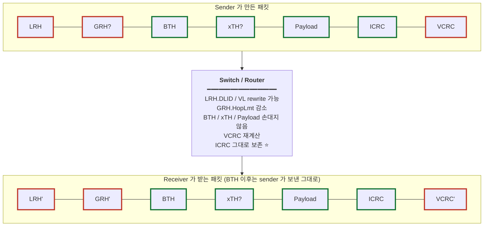
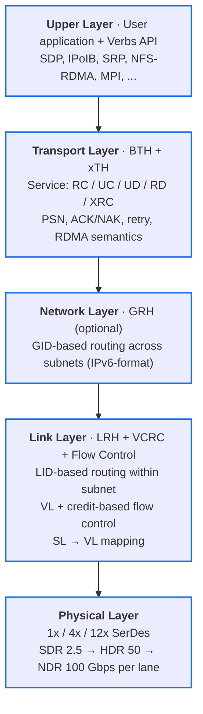
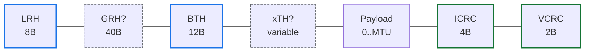
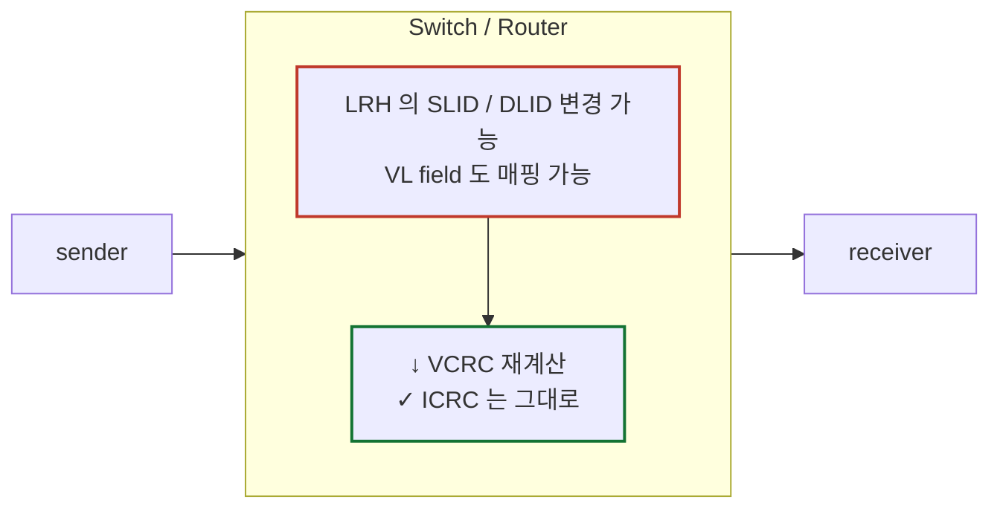
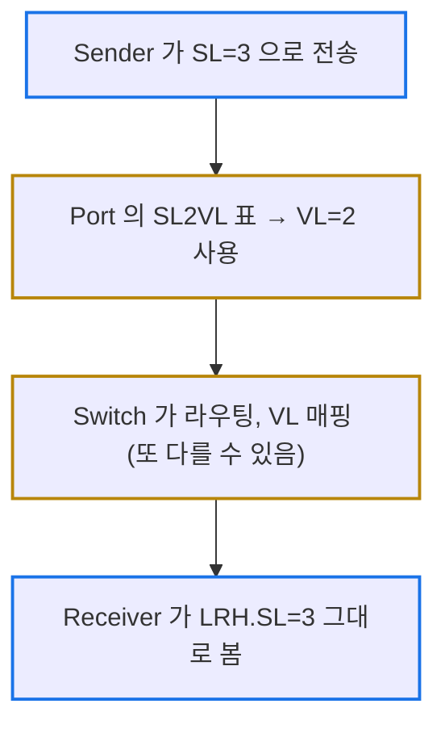
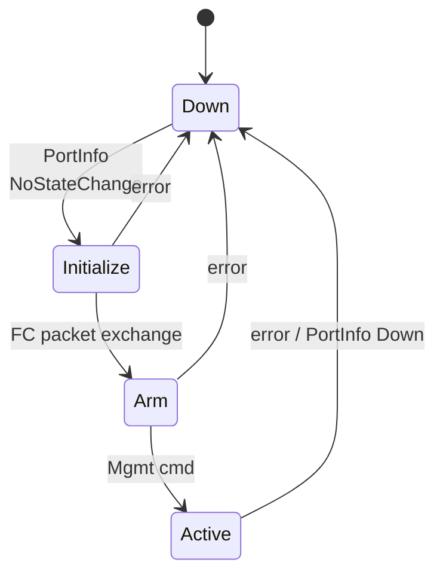

# Module 02 — InfiniBand 프로토콜 스택

<!-- DV-SKOOL-CH-CTX:start -->
<div class="chapter-context" data-cat="network">
  <a class="chapter-back" href="../">
    <span class="chapter-back-arrow">←</span>
    <span class="chapter-back-icon">⚡</span>
    <span class="chapter-back-text">RDMA</span>
  </a>
  <span class="chapter-divider">›</span>
  <span class="chapter-marker">Module 02</span>
</div>
<!-- DV-SKOOL-CH-CTX:end -->

<!-- DV-SKOOL-CH-TOC:start -->
<div class="page-toc">
  <span class="page-toc-label">목차</span>
  <a class="page-toc-link" href="#1-why-care-이-모듈이-왜-필요한가">1. Why care?</a>
  <a class="page-toc-link" href="#2-intuition-국제-우편물-비유와-한-장-그림">2. Intuition</a>
  <a class="page-toc-link" href="#3-작은-예-rc-send-한-패킷이-switch-1-홉을-건너는-과정">3. 작은 예 — 한 패킷의 1-hop 여행</a>
  <a class="page-toc-link" href="#4-일반화-5-계층-과-패킷-포맷-한-장-뷰">4. 일반화 — 5 계층 + 패킷 포맷</a>
  <a class="page-toc-link" href="#5-디테일-헤더-별-필드-와-규칙">5. 디테일 — 헤더별 필드와 규칙</a>
  <a class="page-toc-link" href="#6-흔한-오해-와-dv-디버그-체크리스트">6. 흔한 오해 + DV 디버그 체크리스트</a>
  <a class="page-toc-link" href="#7-핵심-정리-key-takeaways">7. 핵심 정리</a>
</div>
<!-- DV-SKOOL-CH-TOC:end -->

!!! objective "학습 목표"
    이 모듈을 마치면:

    - **Diagram** InfiniBand 의 5계층 모델 (Physical / Link / Network / Transport / Upper) 을 그릴 수 있다.
    - **Decompose** IB 패킷 (LRH | GRH | BTH | xTH | Payload | ICRC | VCRC) 의 각 헤더 역할을 분해할 수 있다.
    - **Trace** RC SEND 패킷이 한 switch hop 을 건널 때 어떤 필드가 read / rewrite / preserve 되는지 추적할 수 있다.
    - **Justify** ICRC 와 VCRC 의 분리가 왜 필요한지 설명할 수 있다 (라우터 통과 시 변경 가능 영역 분리).
    - **Apply** LRH 의 SLID/DLID/VL/SL 필드를 사용해 link-level 라우팅을 추적할 수 있다.

!!! info "사전 지식"
    - Module 01 (RDMA 동기) — Verbs 객체와 message 모델
    - 일반 OSI 5계층 / Ethernet/IP/TCP 헤더 구조

---

## 1. Why care? — 이 모듈이 왜 필요한가

**IB Spec 의 모든 protocol rule 은 packet header field 를 기반으로 표현됩니다.** PROTOCOL_RULES.md 의 1079 must-rule 중 대다수가 "이 필드는 이 값이어야 한다" 형태이므로, 각 헤더의 위치/길이/의미를 알지 못하면 규칙도 spec 도 읽기 어렵습니다.

또한 검증의 99% 는 패킷 monitor / scoreboard / assertion — **모두 헤더 필드 비교** 입니다. 즉 이 모듈의 어휘는 이후 **거의 모든 DV 코드 라인** 에 등장합니다.

---

## 2. Intuition — 국제 우편물 비유와 한 장 그림

!!! tip "💡 한 줄 비유 — IB 패킷 ≈ 국제 우편물"
    **LRH** = 국내(subnet 내) 주소 라벨. _옆 동네 우체국이 보고 다음 우체국으로 보냄._<br>
    **GRH** = 국제(subnet 간) 주소 라벨. _IPv6 주소 형식 그대로._<br>
    **BTH** = 송장 번호 + 우선순위. _수신자의 어느 사서함(QP)에 넣을지._<br>
    **xTH** = 부가 송장 (등기/착불/원격주소). _옵션이지만 어떤 service 는 필수._<br>
    **Payload** = 내용물.<br>
    **ICRC** = 봉투 _안_ 의 인장. 우체국이 못 건드림 → end-to-end.<br>
    **VCRC** = 봉투 _겉_ 의 봉인. 우체국마다 새로 찍음 → hop-by-hop.

### 한 장 그림 — 패킷 포맷과 라우터의 작용



### 왜 이 디자인인가 — Design rationale

세 가지 요구가 동시에 풀려야 했습니다.

1. **Subnet 내에서는 Subnet Manager (SM) 가 토폴로지 변경에 따라 LID/VL 매핑을 바꿀 수 있어야** → LRH 가 hop-by-hop rewrite 대상.
2. **그래도 sender 가 보낸 데이터의 무결성은 receiver 가 end-to-end 로 검증해야** → ICRC 가 변경 가능 영역을 빼고 계산.
3. **각 link 의 무결성도 hop 마다 보장해야** → VCRC 가 hop 마다 재계산.

이 세 요구의 교집합이 LRH 분리 + ICRC/VCRC 이중 CRC 입니다.

---

## 3. 작은 예 — RC SEND 한 패킷이 switch 1-hop 을 건너는 과정

같은 subnet 내 두 노드 — A (LID=10) 가 B (LID=42) 에게 256-byte SEND. 중간에 switch 1대.

### 단계별 추적

```
                     Sender A                     Switch                       Receiver B
    LRH.SLID         10                             10               (그대로)        10
    LRH.DLID         42                          (rewrite 가능: 42)               42
    LRH.VL           4                           (SL→VL 재매핑: 2)                2
    LRH.SL           3                              3                (그대로)        3
    LRH.PktLen       (LRH 시작 ~ ICRC 직전)/4 = N      N              (그대로)         N
    GRH              없음 (same subnet, LNH=10)    없음                              없음
    BTH.OpCode       0x04 (RC SEND_ONLY)           (그대로)                          0x04
    BTH.DestQP       0x000123                      (그대로)                       0x000123
    BTH.PSN          0x100000                      (그대로)                       0x100000
    Payload          256 byte                      (그대로)                          그대로
    ICRC             4 byte (변경 가능 영역 제외)    ⭐ 그대로                        ✓ 검증 통과
    VCRC             2 byte                        ⭐ 재계산                         ✓ 검증 통과
```

### 단계별 의미

| Step | 누가 | 무엇을 | 왜 |
|---|---|---|---|
| ① | **Sender HCA_A** | LRH.LNH = `10` (IBA local — GRH 없음, BTH 가 바로 따라옴) | 같은 subnet 이라 GRH 불필요 |
| ② | Sender | LRH.SL = 3 으로 채움 | application 이 요청한 QoS class |
| ③ | Sender | port 의 SL2VL 표 → VL = 4 로 송신 | sender 측 link 의 매핑 |
| ④ | Sender | ICRC 계산 (변경 가능 영역 제외) → BTH/payload 의 무결성 잠금 | end-to-end 보호 |
| ⑤ | Sender | VCRC 계산 (전체 패킷) → 첫 link 의 무결성 잠금 | hop-by-hop 보호 |
| ⑥ | **Switch** | LRH.DLID 보고 출력 port 결정 | subnet routing |
| ⑦ | Switch | 출력 port 의 SL2VL 표 → VL = 2 로 매핑 | head-of-line blocking 회피, QoS |
| ⑧ | Switch | LRH.PktLen, BTH, xTH, Payload **변경 안 함** | ICRC 가 보호하는 영역이라 |
| ⑨ | Switch | VCRC 재계산 (LRH 가 바뀌었으므로) | hop-by-hop 무결성 재잠금 |
| ⑩ | **Receiver HCA_B** | LRH.SL = 3 그대로 받음 → QoS 인식 | SL 은 subnet 내 절대 불변 (C7-33) |
| ⑪ | Receiver | ICRC 검증 — 통과 | end-to-end 무결성 OK |
| ⑫ | Receiver | VCRC 검증 — 통과 | 마지막 link 무결성 OK |
| ⑬ | Receiver | BTH.OpCode `0x04` 디코드 → RC SEND_ONLY | 한 패킷 메시지 |
| ⑭ | Receiver | BTH.DestQP=0x123 의 RQ 에서 WQE 소비, payload 256 B 를 그 buffer 로 DMA | message → memory |
| ⑮ | Receiver | (BTH.AckReq = 1 이므로) ACK 패킷 송신 | RC reliability |

### 여기서 잡아야 할 두 가지

1. **변경 가능한 것 (LRH 일부, VCRC) vs 변경 불가능한 것 (BTH, xTH, Payload, ICRC) 의 경계가 존재한다.** 이 경계가 ICRC 의 계산 범위로 명문화돼 있고, 검증의 핵심 invariant 입니다.
2. **SL 은 절대 안 바뀐다 — VL 은 hop 마다 바뀔 수 있다.** SL 은 application QoS 의 약속, VL 은 각 link 의 자원. SL2VL 표가 그 사이를 매개합니다.

---

## 4. 일반화 — 5 계층 과 패킷 포맷 한 장 뷰

### 4.1 IB 5 계층 모델



!!! quote "Spec 인용"
    "All IBA transport packets shall contain a BTH" — IB Spec 1.7, **C5-3** (R-008 in PROTOCOL_RULES.md)

### 4.2 패킷 포맷 한 장 뷰



- **LRH** — Local Route Header (필수)
- **GRH** — Global Route Header (subnet 간 또는 multicast 시 필수)
- **BTH** — Base Transport Header (필수, 모든 IBA transport packet)
- **xTH** — Extended Transport Header (opcode 별로 0개 ~ 여러 개)
- **ICRC** — Invariant CRC (header + payload 의 라우팅-불변 부분)
- **VCRC** — Variant CRC (전체 패킷, hop 마다 재계산)

### 4.3 xTH 가 7 종류인 이유

서로 다른 opcode 가 서로 다른 부가 정보를 필요로 합니다. 각 xTH 는 "어떤 opcode 일 때 들어가는가" 로 기억하세요.

| xTH | 길이 | 사용 시점 |
|-----|------|----------|
| **RETH** (RDMA Extended Transport Header) | 16B | RDMA WRITE, READ Request 첫 패킷 (remote_va + rkey + DMALen) |
| **DETH** (Datagram Extended Transport Header) | 8B | UD service 모든 패킷 (Q_Key, SrcQP) |
| **AtomicETH** | 28B | ATOMIC operation (CMP_SWAP, FADD) |
| **AETH** (ACK Extended Transport Header) | 4B | ACK, NAK 패킷 (AckReq → ACK return) |
| **AtomicAckETH** | 8B | Atomic operation 의 ACK |
| **ImmDt** (Immediate Data) | 4B | SEND with Immediate, WRITE with Immediate |
| **IETH** (Invalidate Extended Transport Header) | 4B | SEND with Invalidate |

!!! note "RETH 가 1번 패킷에만 들어가는 이유"
    RDMA WRITE 가 fragmentation 되어 multi-packet 으로 나뉘어도, "remote address" 와 "rkey" 는 첫 패킷에만 있고 이후 패킷은 PSN 만으로 연속성을 보장. 첫 패킷은 OpCode `WRITE_FIRST` / `WRITE_ONLY`, 중간은 `WRITE_MIDDLE`, 끝은 `WRITE_LAST`.

---

## 5. 디테일 — 헤더 별 필드 와 규칙

### 5.1 LRH (Local Route Header) — 8 byte

```
 Bit:  31     28 27   24 23   20 19         16 15           0
       ┌────────┬───────┬──────┬─────────────┬─────────────┐
LRH[0] │  VL    │ LVer  │  SL  │ LNH         │ DLID        │
       └────────┴───────┴──────┴─────────────┴─────────────┘
       4 bit    4 bit    4 bit  4 bit          16 bit
LRH[1] ┌─────────────┬─────┬───────────────────────────────┐
       │ Reserved(5) │PktLn│           SLID (16)            │
       │             │ 11  │                                │
       └─────────────┴─────┴───────────────────────────────┘
```

| 필드 | 길이 | 역할 |
|------|------|------|
| **VL** (Virtual Lane) | 4 | 이 패킷이 사용할 가상 레인 (0..15). VL15 는 management 전용. |
| **LVer** | 4 | LRH 버전. 1.7 spec 에서 항상 `0x0`. |
| **SL** (Service Level) | 4 | QoS 레벨. 라우터/스위치가 SL→VL 매핑. |
| **LNH** (Link Next Header) | 2 | 다음 헤더 종류: 00=raw, 10=IBA local, 11=IBA global (GRH followed). |
| **DLID** | 16 | Destination Local ID (subnet 내 destination). |
| **PktLen** | 11 | (LRH start ~ ICRC 직전까지) 길이 / 4. |
| **SLID** | 16 | Source Local ID. |

!!! quote "Spec 인용"
    "For all non-directed route packets, the SLID shall be a LID of the port which injected the packet onto the subnet." — **C7-46** (R-056)

### 5.2 GRH (Global Route Header) — 40 byte

GRH 는 **IPv6 헤더와 같은 형식**입니다 (IPVer=6).

```
| 4b IPVer |  8b TClass | 20b FlowLabel |
| 16b PayLen | 8b NxtHdr | 8b HopLmt    |
| 128b SGID                              |
| 128b DGID                              |
```

| 필드 | 의미 |
|------|------|
| **IPVer** | 항상 6 (C8-2 / R-087) |
| **TClass** | DSCP/ECN 에 해당 (priority) |
| **FlowLabel** | 같은 flow 의 packet 은 같은 값 — 라우터가 ECMP path 고정 |
| **PayLen** | GRH 다음부터 ICRC 끝까지의 byte 수 |
| **NxtHdr** | non-raw IBA 면 0x1B (IBA transport — BTH 가 따라옴) |
| **HopLmt** | IPv6 Hop Limit 과 동일 (router 통과마다 -1) |
| **SGID/DGID** | Source/Dest Global ID — IPv6 address 형식 (128 bit) |

GRH 가 들어가는 조건 (C8-1):

1. Multicast packet
2. Final destination 이 같은 subnet 이 **아닌** 경우 (cross-subnet)

→ 같은 subnet 내 RC 통신은 GRH 없이 LRH+BTH 만 사용.

### 5.3 BTH (Base Transport Header) — 12 byte

모든 IBA transport packet 의 필수 헤더.

```
 Byte: 0       1       2       3
       ┌───────┬───────┬───────────────┐
   0:  │OpCode │ flags │  P_Key (16)   │
       ├───────┴───────┴───────────────┤
   4:  │ FECN |BECN| Reserve | DestQP  │   ← DestQP = 24 bit
       ├───────────────────────────────┤
   8:  │ A | Reserve(7) │   PSN (24)    │
       └───────────────────────────────┘
```

| 필드 | 길이 | 의미 |
|------|------|------|
| **OpCode** | 8 | Service type (3 bit) + operation (5 bit). 예: `0x04` = RC SEND_ONLY. |
| **SE** (Solicited Event) | 1 | RX 측 CQ event 트리거. |
| **MigReq** | 1 | Path migration request. |
| **PadCnt** | 2 | Payload 가 4-byte align 안 되었을 때 padding 길이. |
| **TVer** | 4 | Transport version (항상 0). |
| **P_Key** | 16 | Partition Key (subnet 내 그룹). |
| **FECN/BECN** | 1+1 | Forward/Backward ECN — congestion notification. |
| **DestQP** | 24 | 수신측 Queue Pair number. |
| **A** (AckReq) | 1 | Responder 가 ACK 보내야 함. |
| **PSN** (Packet Sequence Number) | 24 | 24-bit, 2^24 modulo. RC 에서 PSN window = 2^23. |

!!! info "OpCode 디코딩 예"
    OpCode `0x04` = `001_00100`:

    - 상위 3 bit `001` = RC (Reliable Connection)
    - 하위 5 bit `00100` = `SEND_ONLY` (전체 메시지가 한 패킷)

    OpCode `0x06` = `001_00110` = RC `SEND_LAST` (멀티 패킷 SEND 의 마지막)

(전체 OpCode 표는 [Module 06](06_data_path.md) 와 [Quick Reference](09_quick_reference_card.md) 에서 다룸)

### 5.4 ICRC vs VCRC — 두 CRC 가 분리된 이유



| CRC | 범위 | 변경 시점 |
|-----|------|----------|
| **ICRC** | LRH 의 일부 (SLID/DLID 제외) + GRH (HopLmt 제외) + BTH 전체 + Payload | end-to-end. 라우터가 변경 안 함. |
| **VCRC** | 전체 패킷 (LRH 부터 ICRC 까지) | hop 마다 재계산. |

**왜 이렇게?**

- 라우터/스위치는 LRH 의 DLID, VL 등을 정상적으로 변경(rewrite)할 수 있어야 한다 → 그 부분이 변경되어도 깨지지 않는 CRC 가 별도로 필요 → VCRC 가 hop 마다 재계산.
- 그런데 데이터 자체의 무결성은 end-to-end 보장이 필요 → ICRC 는 변경 가능 영역을 빼고 계산되어 처음부터 끝까지 보존.

!!! quote "Spec 인용"
    - "The ICRC field shall be present in all IBA transport packets." — C7-47 (R-057)
    - "The VCRC field shall be present in all data packets." — C7-49 (R-059)

→ **RoCEv2 에서는 VCRC 가 사라지고 Ethernet FCS 가 그 역할을 대체**. ICRC 는 계산 방식이 약간 다르지만 그대로 유지 (Module 03 에서 자세히).

### 5.5 Virtual Lanes 와 Service Level

#### Virtual Lane (VL)

- 각 link 는 0..15 의 VL 을 가짐 (구현마다 지원 개수 다름).
- VL15 는 **management 전용** (SMP/SA traffic). VL15 는 flow control 의 대상이 아니며, 256-byte payload 제한 (C7-27 / R-037).
- 각 VL 은 독립적인 buffer + 독립적인 credit-based flow control → head-of-line blocking 방지.

#### Service Level (SL)

- LRH 에 4-bit SL 필드.
- SL → VL 매핑은 port 별 SL2VLMappingTable 로 설정 (subnet manager 가 분배).
- SL 은 subnet 내 절대 변경되지 않음 (C7-33 / R-043) — receiver 가 SL 을 보고 QoS 결정 가능.



### 5.6 패킷 길이 제약 — MTU 와 PktLen

| 항목 | 값 |
|------|------|
| **MTU** | 256, 512, 1024, 2048, **4096** byte (per VL) |
| **Min PktLen** (IBA transport) | 6 (24 byte, LRH + BTH) — C7-43 / R-053 |
| **Min PktLen** (raw) | 5 (20 byte) — C7-44 / R-054 |
| **Max PktLen** | MIN(MTUCap, NeighborMTU) 에 따라 표 22 — C7-45 / R-055 |

PktLen 계산: **(LRH 시작 ~ VCRC 직전 byte 수) / 4**.

→ 따라서 VCRC 는 PktLen 에 포함되지 않음. ICRC 는 포함.

### 5.7 Flow Control — Credit 기반

```
  Sender ◀─ FC packet (FCCL = receiver 의 advertised credit) ─ Receiver
       Block 단위로 credit 발급 (1 block = 64 byte)
       Sender 는 credit 부족 시 송신 중단

  ABR  : Adjusted Blocks Received  (receiver 가 누적)
  FCTBS: Flow Control Total Blocks Sent (sender 가 보낸 누적)
  FCCL : Flow Control Credit Limit (receiver 가 sender 에 통보)
```

(**RoCEv2 에서는 IB FC 가 사라지고 Ethernet PFC 로 대체**)

규칙: VL15 는 flow control 적용 안 됨 (C7-18 / R-029).

### 5.8 Link 상태 머신



- **Down** → 물리 링크 없음
- **Initialize** → 물리 링크 OK, FC packet 교환 중
- **Arm** → 모든 VL 에 대해 FC 교환 완료, 데이터 packet 송수신 가능 (제한적)
- **Active** → 정상 동작

이건 IB 전용. RoCEv2 에서는 그냥 Ethernet PHY 의 link-up/down.

### 5.9 Confluence 보강 — BTH 필드별 사내 default 와 사용 정책

!!! note "Internal (Confluence: RDMA headers and header fields, id=32178321)"
    사내 RDMA-IP 의 BTH 사용 정책은 다음과 같다 (spec 자체가 강제하지 않는 사용자 결정 항목).

    | BTH 필드 | 사내 default / 정책 |
    |---|---|
    | **MTU** | **1024 byte (정적)** — 4 KB write 는 4 패킷으로 분할 (first / middle×2 / last) |
    | **Pad count** | spec 정의대로 4-byte 정렬을 위해 0~3 |
    | **TVer** | 0 으로 zero-fill |
    | **P_Key** | `0xFFFF` (default partition) 사용 |
    | **Reserved6** | 0 으로 zero-fill |
    | **SE (Solicited Event)** | SEND/SEND_WITH_IMM/SEND_WITH_INVALIDATE/WRITE_WITH_IMM 의 only/last 패킷에 한해 1 set — `notify_cq` 시맨틱을 hardware 로 구현 |
    | **MigReq** | 미사용 (APM 비활성) |
    | **AckReq** | RC 에서만 의미. only/last 또는 ACK coalescing 정책에 따라 set |

    이 표는 **검증 시 BTH 비교 scoreboard 의 mask** 이기도 하다 — `0xFFFF`/`0` 으로 zero-fill 된 필드는 `==` 가 아닌 *internal-default-aware* 비교를 사용한다.

### 5.10 Confluence 보강 — MSN 필드의 미세한 동작

!!! note "Internal (Confluence: Details of MSN field, id=32211107) — IB Spec 1.4 §C9-147..149"
    AETH 의 MSN 은 "responder 가 성공적으로 완료한 메시지 수" 를 나타내며, 다음 규칙이 검증 핵심이다.

    1. **다중 패킷 메시지 (예: 4KB WRITE → 4 packet, MTU=1KB)**: MSN 은 **마지막 패킷에서만** 증가.
    2. **ACK coalescing**: N 개의 요청을 하나의 ACK 로 묶을 때, MSN 은 **마지막으로 완료된 SSN 값** 으로 단번에 증가.
    3. **Duplicate request**: MSN 은 **증가하지 않음**. responder 는 캐시된 마지막 ACK 의 MSN 을 그대로 재전송.
    4. **RDMA READ**: validation (R_Key / PSN) 직후 MSN 을 증가시키고, **첫 응답 패킷의 AETH** 에 새 MSN 을 실을 수 있다 (구현 선택). 이후 동일 read 의 모든 응답 패킷은 같은 MSN.
    5. MSN 은 **roll-back 금지** — 단조 증가만 허용.

    SoftRoCE (`rxe`) 는 WRITE/SEND 는 END_MASK 패킷에서, READ 는 validation 직후 증가시킨다. 사내 IP 는 동일 정책.

    !!! tip "검증 포인트"
        Scoreboard 는 (a) duplicate request 시 MSN 비증가, (b) READ 의 first response packet 에서 MSN 증가, (c) coalesced ACK 의 MSN = last-completed SSN 이라는 세 조건을 직접 assertion 으로 두면 좋다.

---

## 6. 흔한 오해 와 DV 디버그 체크리스트

### 흔한 오해

!!! danger "❓ 오해 1 — 'IB 의 LRH 는 Ethernet 의 MAC header 와 같다'"
    **실제**: LRH 는 subnet 내 라우팅 (LID 기반) + VL/SL 정보를 _함께_ 가집니다. Ethernet MAC 은 pure L2 destination/source 만 가지며, VLAN tag 도 별도 헤더입니다. SLID/DLID 는 16-bit, MAC 은 48-bit — 의미와 크기가 다름.<br>
    **왜 헷갈리는가**: 둘 다 "L2 헤더, 같은 subnet 내 라우팅" 이라는 추상 역할이 같기 때문.

!!! danger "❓ 오해 2 — 'switch 가 패킷을 통과시키는 동안 ICRC 도 다시 계산해야 한다'"
    **실제**: ICRC 는 변경 가능 영역(LRH 의 SLID/DLID, GRH.HopLmt)을 _빼고_ 계산되도록 정의돼 있어서, switch 가 LRH/HopLmt 를 정상적으로 바꿔도 ICRC 값은 그대로입니다. switch 는 VCRC 만 재계산.<br>
    **왜 헷갈리는가**: "CRC = 패킷 전체에 대한 무결성" 이라는 일반 직관 때문.

!!! danger "❓ 오해 3 — 'GRH 는 항상 들어간다'"
    **실제**: GRH 는 (1) multicast 또는 (2) cross-subnet 일 때만 들어갑니다 (C8-1). 같은 subnet 내 RC 통신은 LRH+BTH 만 — 그래서 LRH.LNH = `10` (IBA local) 인 경우가 흔합니다.

!!! danger "❓ 오해 4 — 'SL 도 hop 마다 바뀐다'"
    **실제**: SL 은 subnet 내 절대 불변 (C7-33 / R-043). receiver 가 LRH.SL 을 그대로 보고 QoS 를 인식하기 위함. 바뀌는 건 VL — port 마다 SL2VL 표로 매핑.

!!! danger "❓ 오해 5 — 'PSN window 가 2^24 다'"
    **실제**: PSN 필드는 24-bit (2^24 modulo) 지만, RC 의 outstanding window 는 **2^23** (절반). 두 PSN 의 "앞/뒤" 비교를 modulo arithmetic 으로 하기 위해 절반만 씀.

### DV 디버그 체크리스트 (이 모듈 내용으로 마주칠 첫 실패들)

| 증상 | 1차 의심 | 어디 보나 |
|---|---|---|
| Receiver 가 패킷 drop, ICRC error | sender ICRC 계산 범위 오류 (변경 가능 영역 포함했나?) | 패킷 dump → ICRC 입력 영역 vs spec |
| Switch 통과 후 VCRC error | switch 가 VCRC 재계산 안 함 | VCRC = LRH 부터 ICRC 까지 vs 실제 계산 영역 |
| 같은 subnet 인데 packet 가 destination 못 찾음 | LRH.LNH 가 `11` (GRH 가 따라옴) 인데 GRH 누락 / 그 반대 | LNH 와 GRH 존재 여부 일관성 |
| Cross-subnet routing 실패 | GRH.HopLmt = 0 또는 DGID 잘못 | GRH dump |
| Receiver 가 high-prio class 인데 low VL 로 옴 | sender 의 SL2VL 매핑 / switch SL2VL 매핑 어긋남 | LRH.SL 은 그대로인지 + 양쪽 SL2VL 표 |
| BTH compare 가 mismatch (0xFFFF P_Key) | scoreboard 가 internal-default 미인식 | §5.9 의 zero-fill 정책 vs scoreboard mask |
| AETH.MSN 이 예상보다 크다 | duplicate request 가 MSN 을 증가시키나? | §5.10 의 5가지 규칙 모두 ✓ |
| `RoCEv2` 검증인데 LRH/VCRC 규칙 false-positive | RoCEv2 는 LRH/VCRC 없음 | ROCEV2_RULE_APPLICABILITY.md, R-001~085 NOT-APPLICABLE 영역 확인 |

---

## 7. 핵심 정리 (Key Takeaways)

- IB 는 자체 5 계층. 모든 패킷은 LRH 로 시작, BTH 가 transport, GRH 는 cross-subnet/multicast 시.
- LRH ↔ GRH ↔ BTH 의 역할: subnet 라우팅 ↔ 글로벌 라우팅 ↔ transport.
- xTH 7 종류는 **opcode 별 부가 정보** (RETH, DETH, AETH, ImmDt, IETH, AtomicETH, AtomicAckETH).
- **ICRC vs VCRC 분리** 가 IB 의 핵심 발명 — 라우터의 LRH 변경을 허용하면서 end-to-end 무결성 보장.
- **SL 불변 + VL hop-by-hop 매핑** 이 IB 의 QoS 모델 (RoCEv2 는 PFC/DSCP 로 대체).
- 검증 관점: 모든 패킷 monitor / scoreboard 가 이 헤더 필드 비교 — **이 모듈의 어휘 = 이후 모든 DV 코드의 어휘**.

!!! warning "실무 주의점"
    - PROTOCOL_RULES.md 의 R-001 ~ R-085 (Architecture, Packet Format, Link Layer) 는 RoCEv2 에서 **대부분 NOT-APPLICABLE**. RoCEv2 검증 시 이 영역의 규칙을 그대로 가져오면 false positive 가 발생합니다 → ROCEV2_RULE_APPLICABILITY.md 참고.
    - LRH 의 PktLen 단위가 4-byte word 라서 byte 단위 길이 검사 시 ×4 필수.
    - GRH 의 PayLen 은 GRH 다음 byte 부터 ICRC 끝까지 — IB 와 IPv6 의 PayLen 정의가 미묘하게 다름 (RoCEv2 의 IP PayLen 도 또 다름).

---

## 다음 모듈

→ [Module 03 — RoCEv2 — Ethernet 위의 RDMA](03_rocev2.md): IB 의 LRH/VCRC/Flow Control 이 어떻게 Ethernet/IP/UDP 로 대체되는지, 그리고 BTH/xTH 가 어떻게 그대로 유지되는지.

[퀴즈 풀어보기 →](quiz/02_ib_protocol_stack_quiz.md)


--8<-- "abbreviations.md"
--8<-- "_inc/topic_abbr.md"
