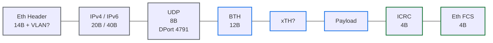

# Module 03 — RoCEv2: Ethernet 위의 RDMA

<!-- DV-SKOOL-CH-CTX:start -->
<div class="chapter-context" data-cat="network">
  <a class="chapter-back" href="../">
    <span class="chapter-back-arrow">←</span>
    <span class="chapter-back-icon">⚡</span>
    <span class="chapter-back-text">RDMA</span>
  </a>
  <span class="chapter-divider">›</span>
  <span class="chapter-marker">Module 03</span>
</div>
<!-- DV-SKOOL-CH-CTX:end -->

<!-- DV-SKOOL-CH-TOC:start -->
<div class="page-toc">
  <span class="page-toc-label">목차</span>
  <a class="page-toc-link" href="#1-why-care-이-모듈이-왜-필요한가">1. Why care?</a>
  <a class="page-toc-link" href="#2-intuition-비유와-한-장-그림">2. Intuition</a>
  <a class="page-toc-link" href="#3-작은-예-rocev2-패킷-한-개를-끝까지-따라가기">3. 작은 예 — 패킷 따라가기</a>
  <a class="page-toc-link" href="#4-일반화-매핑-applicable-vs-not-applicable">4. 일반화 — 매핑 + APPLICABLE 영역</a>
  <a class="page-toc-link" href="#5-디테일-패킷-구조-icrc-신뢰성-confluence-보강">5. 디테일</a>
  <a class="page-toc-link" href="#6-흔한-오해-와-dv-디버그-체크리스트">6. 흔한 오해 + 디버그 체크리스트</a>
  <a class="page-toc-link" href="#7-핵심-정리-key-takeaways">7. 핵심 정리</a>
</div>
<!-- DV-SKOOL-CH-TOC:end -->

!!! objective "학습 목표"
    이 모듈을 마치면:

    - **Diagram** RoCEv1 / RoCEv2 의 패킷 구조 차이를 그릴 수 있다.
    - **Map** IB 의 LRH/GRH 가 RoCEv2 의 Ethernet/IP 헤더로 어떻게 매핑되는지 표로 정리한다.
    - **Trace** RoCEv2 패킷 한 개가 sender → switch → receiver 로 갈 때 어떤 필드가 변경/보존되는지 추적할 수 있다.
    - **Identify** IB 만 적용되는 영역과 RoCEv2 에 그대로 적용되는 영역 (NOT-APPLICABLE / APPLICABLE / MODIFIED) 을 구분한다.
    - **Compute** RoCEv2 의 ICRC 가 IB 와 어떻게 다르게 계산되는지 (IP/UDP placeholder 사용) 설명한다.

!!! info "사전 지식"
    - Module 02 (IB 패킷 헤더와 ICRC/VCRC)
    - Ethernet / IPv4(or IPv6) / UDP 헤더

---

## 1. Why care? — 이 모듈이 왜 필요한가

### 1.1 시나리오 — "InfiniBand 사고 싶은데, 데이터센터에 깔린 Ethernet 은 어떡하지?"

당신은 데이터센터 운영자입니다. 5000 대 서버에 _이미_ 10 GbE → 100 GbE Ethernet switch fabric 이 깔려 있고, IP 관리/모니터링/ACL 체계가 작동합니다. 그런데 _AI 학습 잡_ 을 위해 RDMA 가 필요해졌습니다.

세 가지 선택지가 있습니다:

| 선택 | CapEx | OpEx (관리) | Latency | 결과 |
|------|-------|-------------|---------|------|
| **A. InfiniBand 전용 fabric 추가** | 매우 큼 (별도 스위치 + 케이블링) | 큼 (별도 관리 도구) | 1~2 µs | 성능 ★ 운영 부담 ★ |
| **B. iWARP (TCP 위 RDMA)** | 없음 | 없음 | 3 µs | latency 가 RoCE 의 2.3 배. 시장에서 outcompete |
| **C. RoCEv2 (Ethernet 위 RDMA)** | 적음 (HCA 만 교체) | 적음 (IP 인프라 그대로) | 7~10 µs | _대부분의 선택지_ |

**RoCEv2 의 본질은 "_IB transport 의 BTH 부터는 그대로_, 그 아래만 Ethernet/IP/UDP 로 갈아끼우기"** 입니다. 이게 작동하려면 두 가지를 보장해야 합니다:

1. _BTH 이하_ 의 IB transport semantics 가 그대로 살아 있어야 한다 (RC 의 PSN/ACK/retry).
2. _BTH 이상_ 의 Ethernet/IP/UDP 가 RDMA-friendly 하게 동작해야 한다 (특히 **lossless** — packet drop = RC 의 timeout-retry 부담 폭증).

이 모듈은 _이 매핑이 정확히 어떻게 작동하고_, _어디서 깨질 수 있는지_ 의 지도입니다.

### 1.2 그래서 이 모듈을 잡아야 한다

오늘날 거의 모든 데이터센터 RDMA 트래픽은 **RoCEv2** 입니다. RDMA-TB 의 대부분 시나리오도 RoCEv2 가정. IB Spec 의 1079 must-rule 중 ROCEV2_RULE_APPLICABILITY.md 가 분류한 비율을 보면:

- **Link Layer (R-011 ~ R-085)**: 거의 전부 NOT-APPLICABLE
- **Network Layer GRH (R-086 ~ R-103)**: 대부분 MODIFIED (IP header 로 매핑)
- **Transport Layer (BTH, xTH)**: **거의 전부 APPLICABLE** ← RoCEv2 의 본진
- **CM / SMP / SA**: 전부 NOT-APPLICABLE (RDMA-CM over IP 로 대체)

→ **RoCEv2 검증의 무게중심은 BTH 와 그 이후 (transport) 에 있다.** 이 모듈은 "어떤 IB 규칙이 살아남고 어떤 게 사라지는가" 의 경계선을 명확히 잡는 것이 목표입니다.

!!! question "🤔 잠깐 — UDP 위 RDMA 라니, TCP 는 왜 안 쓰나?"
    iWARP 는 TCP 위에 RDMA 를 올렸습니다. RoCEv2 는 UDP 위입니다. TCP 가 _reliability_ 를 무료로 제공하는데도 UDP 를 선택한 이유는?

    ??? success "정답"
        **세 가지 이유**:

        1. **TCP 가 _SW 에서_ reliability 처리** — connection state, retransmit timer, congestion control 이 OS 커널 수준. 결국 _SW 가 끼므로_ RDMA 의 transport offload 라는 본질이 깨짐. (iWARP 가 시장에서 진 이유)
        2. **RDMA 는 _이미_ BTH 의 PSN/ACK/retry 로 reliability 를 hardware-level 로 갖춤** — TCP 의 reliability 와 _이중_ 으로 가지면 오히려 충돌.
        3. **UDP 의 SrcPort** 가 **ECMP entropy** 로 활용됨 — switch 가 5-tuple hash 로 부하 분산. RDMA flow 가 _하나의 path 에 쏠리지 않도록_ 분산 가능.

        결론: UDP 는 RDMA 에 "**투명한 transport wrapper**" — wire 만 운반하고 어떤 처리도 안 함. TCP 는 _너무 많이_ 처리해서 부적합.

---

## 2. Intuition — 비유와 한 장 그림

!!! tip "💡 한 줄 비유 — RoCEv2 ≈ IB transport 가 Ethernet 봉투에 들어간 것"
    IB 의 송장 시스템 (BTH/xTH/PSN/ACK/opcode/QP) 은 그대로 두고, **운송수단만** 회사 전용 트럭(IB link) 에서 일반 도로 + 우체국 (Ethernet/IP/UDP) 으로 바꾼 것. 송장의 의미는 그대로, 단지 봉투(L1-L4 wrapper) 만 일반화.

### 한 장 그림 — IB vs RoCEv2 패킷 구조

```d2
direction: right

IB: "IB 패킷" {
  I_LRH: "LRH\nlink 라우팅" { style.stroke: "#c0392b"; style.stroke-width: 2 }
  I_GRH: "GRH?\nglobal 라우팅" { style.stroke: "#c0392b"; style.stroke-width: 2 }
  I_BTH: BTH { style.stroke: "#137333"; style.stroke-width: 2 }
  I_XTH: xTH { style.stroke: "#137333"; style.stroke-width: 2 }
  I_PAY: Payload { style.stroke: "#137333"; style.stroke-width: 2 }
  I_ICRC: ICRC { style.stroke: "#137333"; style.stroke-width: 2 }
  I_VCRC: "VCRC\nhop FCS" { style.stroke: "#c0392b"; style.stroke-width: 2 }
  I_LRH -- I_GRH -- I_BTH -- I_XTH -- I_PAY -- I_ICRC -- I_VCRC
}

ROCE: "RoCEv2 패킷" {
  R_ETH: "Eth Hdr\nlink 라우팅 (MAC)" { style.stroke: "#c0392b"; style.stroke-width: 2 }
  R_IP: "IP Hdr\nglobal 라우팅" { style.stroke: "#c0392b"; style.stroke-width: 2 }
  R_UDP: "UDP Hdr\ndest port = 4791" { style.stroke: "#c0392b"; style.stroke-width: 2 }
  R_BTH: "BTH ◀ 동일" { style.stroke: "#137333"; style.stroke-width: 2 }
  R_XTH: "xTH ◀ 동일" { style.stroke: "#137333"; style.stroke-width: 2 }
  R_PAY: "Payload ◀ 동일" { style.stroke: "#137333"; style.stroke-width: 2 }
  R_ICRC: "ICRC ◀ 거의 동일 (mask 차이)" { style.stroke: "#137333"; style.stroke-width: 2 }
  R_FCS: "Eth FCS\nhop FCS" { style.stroke: "#c0392b"; style.stroke-width: 2 }
  R_ETH -- R_IP -- R_UDP -- R_BTH -- R_XTH -- R_PAY -- R_ICRC -- R_FCS
}

IB.I_BTH -> ROCE.R_BTH: "그대로" { style.stroke-dash: 4 }
IB.I_XTH -> ROCE.R_XTH: "그대로" { style.stroke-dash: 4 }
IB.I_PAY -> ROCE.R_PAY: "그대로" { style.stroke-dash: 4 }
IB.I_ICRC -> ROCE.R_ICRC: "거의 동일" { style.stroke-dash: 4 }
```

### 왜 이렇게 설계했는가 — 세 대안의 비교

§1.1 의 세 선택지 (IB 전용 fabric / iWARP / RoCEv2) 는 같은 시기에 실제로 시장에서 경쟁했습니다. 결과를 보면 RoCEv2 가 _시장 점유율 1 위_ 가 된 이유가 명확합니다.

| 차원 | IB 전용 | iWARP | **RoCEv2** |
|------|---------|-------|-----------|
| 인프라 재사용 | ✗ (전용 케이블/스위치 필요) | ✓ (TCP 인프라 그대로) | ✓ (Ethernet 인프라 그대로) |
| Transport offload | ✓ | △ (TCP 부분 SW) | ✓ (BTH 그대로) |
| Latency (실측) | 1~2 µs | 3 µs | 7~10 µs |
| L3 라우팅 | ✗ (subnet 만) | ✓ | ✓ |
| 운영 도구 통합 | ✗ (SM 등 별도) | ✓ | ✓ |
| **lossless 필요?** | hardware (credit FC) | TCP 의 retransmit | **PFC + ECN + DCQCN 필요** |

IBTA 가 선택한 설계는: "**transport (BTH 부터) 는 IB 그대로 두고, 그 아래만 표준화한다**". 이 결정 덕분에:

- HCA 칩은 IB 와 RoCEv2 를 같은 transport block 으로 처리 가능 (개발 비용↓)
- Switch/router 는 RDMA 모르고도 작동 (인프라 재사용↑)
- 단점: **lossless Ethernet 가정** 필요 → PFC/ECN/DCQCN 같은 별도 메커니즘이 등장 (Module 07 의 주제)

이 trade-off 가 §6 의 흔한 오해와 §5 의 lossless 논의에서 다시 나옵니다.

!!! note "Internal (Confluence: [RDMA] IB vs RoCE, id=996966462)"
    사내 자료의 비유 — "**자기부상열차 전용 선로 (IB) vs 고속도로의 RDMA 전용 차선 (RoCEv2)**". 같은 _차_ (transport semantics) 가 어떤 _도로_ 위에 올라가느냐의 차이. 차선 (PFC) 와 ramp 제어 (DCQCN) 가 없으면 일반 트래픽에 RDMA 가 깔아뭉개짐.

---

## 3. 작은 예 — RoCEv2 패킷 한 개를 끝까지 따라가기

노드 A (IP=10.1.0.5, MAC=...:01) 가 노드 B (IP=10.2.0.7, MAC=...:02) 에게 같은 데이터센터 내 1 KB RDMA WRITE. 중간에 L3 router 1대.

```
   sender HCA_A                router (L3)              receiver HCA_B
   ─────────────            ─────────────             ─────────────
   Eth.DST_MAC = R1                MAC rewrite                Eth.DST_MAC = HCA_B
   Eth.SRC_MAC = HCA_A             ────────▶                  Eth.SRC_MAC = R1
   Eth.Type    = 0x0800 (IPv4)
   ────
   IP.SRC      = 10.1.0.5          그대로                     10.1.0.5
   IP.DST      = 10.2.0.7          그대로                     10.2.0.7
   IP.Proto    = 17 (UDP)          그대로                     17
   IP.TTL      = 64                63 (감소)                  63
   IP.DSCP/ECN = (TC1)             ECN may be marked          (TC1, ECN-CE 가능)
   IP.Checksum = 재계산
   ────
   UDP.SrcPort = 49152 (hash, ECMP) 그대로                    49152
   UDP.DstPort = 4791 (RoCEv2)     그대로                     4791
   UDP.Len     = ...               그대로
   UDP.Checksum= 0 또는 valid       (변경 안 됨)
   ────
   BTH.OpCode  = 0x0A (RC WRITE_ONLY) ▶▶▶ 그대로 ▶▶▶          0x0A
   BTH.PSN     = N                 ▶▶▶ 그대로 ▶▶▶            N
   BTH.DestQP  = 0x000123          ▶▶▶ 그대로 ▶▶▶            0x000123
   ────
   RETH.VirtAddr = remote_va       ▶▶▶ 그대로 ▶▶▶            remote_va
   RETH.RKey     = remote_rkey     ▶▶▶ 그대로 ▶▶▶            remote_rkey
   RETH.DMALen   = 1024            ▶▶▶ 그대로 ▶▶▶            1024
   ────
   Payload (1024 B)                ▶▶▶ 그대로 ▶▶▶            ✓
   ICRC                            ▶▶▶ 그대로 ▶▶▶            ✓ (placeholder + IP/UDP mask 로 검증)
   Eth FCS                         재계산                     ✓
```

### 단계별 의미

| Step | 누가 | 무엇을 | 왜 |
|---|---|---|---|
| ① | Sender HCA_A | UDP.DstPort = 4791 로 송신 | RoCEv2 표지 (IANA 공식 등록 포트) |
| ② | Sender | UDP.SrcPort = hash(QP/PSN…) | switch ECMP 분산을 위한 entropy |
| ③ | Sender | ICRC 계산 — placeholder(8B 0xFF) + IP/UDP의 mutable mask + BTH 이후 그대로 | hop 마다 변하는 영역 빼야 end-to-end 보존 |
| ④ | Sender | Eth FCS 계산 | 첫 link 의 hop-by-hop 무결성 |
| ⑤ | **Router** | DST_MAC 으로 forwarding port 결정 후 L2 rewrite | L3 hop |
| ⑥ | Router | IP.TTL -= 1, IP.Checksum 재계산 | IP 표준 |
| ⑦ | Router | (혼잡 시) IP.ECN-CE 마킹 가능 | DCQCN 메커니즘 |
| ⑧ | Router | BTH 이후 손대지 않음 | transport 영역, 라우터의 관할이 아님 |
| ⑨ | Router | Eth FCS 재계산 | hop-by-hop 무결성 |
| ⑩ | Receiver HCA_B | UDP.DstPort = 4791 인지 확인 → RDMA path 로 분기 | non-RDMA 트래픽 분리 |
| ⑪ | Receiver | ICRC 검증 — 같은 mask 규칙으로 재계산 | TTL/ECN 변경에도 통과해야 함 |
| ⑫ | Receiver | BTH.DestQP=0x123, RETH 의 (rkey, va) 로 메모리 주소 결정, payload DMA write | RDMA WRITE 의 본 작업 |
| ⑬ | Receiver | (BTH.AckReq=1) BTH.OpCode = RC ACK 패킷 송신 | reliability |

!!! note "여기서 잡아야 할 두 가지"
    **(1) 라우터/스위치는 BTH 이후를 절대 못 건드림** — IB 의 ICRC 가 보존하는 영역 = RoCEv2 의 ICRC 가 보존하는 영역. 이게 transport-level 무결성의 핵심.<br>
    **(2) ICRC 의 "mask" 가 IB 와 다른 점** — IB 는 LRH 의 SLID/DLID 만 빼면 됐지만, RoCEv2 는 IP TTL/ECN/Checksum 과 UDP Checksum 도 추가로 mask. mask 누락 = ICRC false-fail.

---

## 4. 일반화 — 매핑 + APPLICABLE vs NOT-APPLICABLE

### 4.1 IB 컴포넌트 → RoCEv2 의 운명

```
   IB 컴포넌트                        RoCEv2
   ────────────────────────         ──────────────────────
   LRH                              ✗ NOT-APPLICABLE  (Eth header 가 대체)
   VCRC                             ✗ NOT-APPLICABLE  (Eth FCS 가 대체)
   GRH                              ↻ MODIFIED        (IP header 로 변형)
   BTH                              ✓ APPLICABLE
   xTH (RETH/DETH/AETH/...)         ✓ APPLICABLE
   Payload                          ✓ APPLICABLE
   ICRC                             ↻ MODIFIED        (mask 규칙 차이)
   VL / SL                          ↻ MODIFIED        (PFC priority + DSCP)
   IB Flow Control (FCTBS/FCCL)     ✗ NOT-APPLICABLE  (PFC + ECN)
   IB Link State Machine            ✗ NOT-APPLICABLE  (Ethernet PHY)
   SM / SMA / SA                    ✗ NOT-APPLICABLE  (Subnet Manager 없음)
   CM (over MAD)                    ↻ MODIFIED        (RDMA-CM over IP/TCP)
   Verbs API                        ✓ APPLICABLE      (그대로)
   QP State Machine                 ✓ APPLICABLE
   PSN/ACK/NAK/Retry                ✓ APPLICABLE
   MR / PD / R_Key / L_Key          ✓ APPLICABLE
```

### 4.2 ICRC 계산의 일반화

ICRC 의 핵심 아이디어는 한 문장: **"hop 마다 변하는 부분은 빼고 계산"**.

| Spec | "변하는 부분" | ICRC 입력 처리 |
|------|-------------|---------------|
| IB | LRH 의 SLID/DLID, GRH 의 HopLmt | 해당 영역만 제외 |
| RoCEv2 (IPv4) | IP의 TTL, DSCP/ECN, Checksum + UDP Checksum + (placeholder for missing LRH) | mutable 영역을 모두 0xFF mask + 8B placeholder |
| RoCEv2 (IPv6) | HopLimit, Traffic Class, Flow Label + UDP Checksum + placeholder | 동일하게 mask + placeholder |

이 mask 규칙은 implementation 마다 흔한 버그 소스 — §6 디버그 체크리스트의 첫 항목.

---

## 5. 디테일 — 패킷 구조, ICRC, 신뢰성, Confluence 보강

### 5.1 RoCEv1 vs RoCEv2 한 장 비교

```
              ┌──────────────────────────┬──────────────────────────────────────┐
              │         RoCEv1           │            RoCEv2                     │
              ├──────────────────────────┼──────────────────────────────────────┤
   L2         │  Ethernet (Eth Type      │  Ethernet (Eth Type 0x0800/0x86DD)    │
              │  0x8915 = RRoCE)         │                                       │
              ├──────────────────────────┼──────────────────────────────────────┤
   L3         │  (없음)                  │  IPv4 (proto 17) or IPv6 (NxtHdr 17)   │
              ├──────────────────────────┼──────────────────────────────────────┤
   L4         │  (없음)                  │  UDP, Dest Port 4791                  │
              ├──────────────────────────┼──────────────────────────────────────┤
   Transport  │  BTH + xTH + Payload     │  BTH + xTH + Payload                   │
              ├──────────────────────────┼──────────────────────────────────────┤
   CRC        │  ICRC + Eth FCS          │  ICRC + Eth FCS                        │
              ├──────────────────────────┼──────────────────────────────────────┤
   라우팅     │  같은 L2 broadcast 도메인 │  표준 IP 라우팅 (ECMP, BGP, …)        │
              │  (단일 subnet)           │                                       │
              └──────────────────────────┴──────────────────────────────────────┘
```

→ **RoCEv1 은 사실상 사장**. 데이터센터의 모든 RDMA 는 RoCEv2.

### 5.2 RoCEv2 패킷 구조 상세



| 필드 | 설명 |
|------|------|
| **Eth Header** | DST MAC + SRC MAC + (선택 VLAN) + EtherType (IPv4=0x0800, IPv6=0x86DD) |
| **IPv4 Header** | Proto = 17 (UDP), TTL, DSCP/ECN, src/dst IP |
| **IPv6 Header** | NxtHdr = 17 (UDP), HopLimit, FlowLabel, src/dst IPv6 |
| **UDP Header** | **Dest Port = 4791** (IANA 등록), Src Port 는 hash 로 가변 (ECMP 분산용) |
| **BTH** | IB와 동일 |
| **xTH** | RETH/DETH/AETH/ImmDt/IETH/AtomicETH/AtomicAckETH (IB와 동일) |
| **ICRC** | IB와 같은 위치, 다른 계산 (다음 절) |
| **Eth FCS** | Ethernet 표준 FCS — VCRC 의 hop-by-hop 역할 |

!!! quote "Spec 인용"
    "RoCEv2 packets shall use UDP destination port 4791 (assigned by IANA)." — IBTA *Annex A17*, §A17.5

### 5.3 ICRC 계산 — RoCEv2 의 미묘한 차이

```
 ICRC 계산 입력:
   ─────────────────────────────────────────────────────────────
   placeholder (= LRH 가 있다고 가정한 8 byte, 모두 1)
 + IP header           (단, TTL/HopLimit 와 Checksum 부분은 mask)
 + UDP header          (Checksum 부분은 mask)
 + BTH ~ Payload       (전부 그대로)
   ─────────────────────────────────────────────────────────────
 → CRC32 계산 결과가 ICRC 필드 값
```

| 영역 | ICRC 입력 시 처리 |
|------|------------------|
| placeholder (8B) | 모두 0xFF (1로 채움) — IB 의 LRH 자리 mock |
| IPv4: TTL, ECN, Header Checksum | 모두 0xFF mask |
| IPv4: 그 외 (src/dst IP, proto, …) | 그대로 |
| IPv6: HopLimit, Traffic Class (DSCP/ECN) | 모두 0xFF mask |
| IPv6: Flow Label | 모두 0xFF mask |
| UDP: Checksum | 모두 0xFF mask |
| UDP: src/dst port, length | 그대로 |
| BTH 이후 | 그대로 |

!!! quote "Spec 인용 (요지)"
    "When computing the ICRC, the values of fields that may change while a packet is in transit are replaced with all-ones." — *Annex A17*, ICRC 계산 절차

→ **RDMA-TB 검증 관점**: ICRC 검증 모듈이 packet 캡처 시 마스크 처리를 정확히 해야 함. 실제 RDMA-TB 에 `vrdma_cqe_validation_checker` 등 ICRC 검증 path 가 들어있음.

### 5.4 IB ↔ RoCEv2 헤더 매핑 표

| IB 필드 | RoCEv2 대응 | 비고 |
|---------|-------------|------|
| LRH | (없음) | Ethernet header 가 link-level 라우팅 |
| LRH.DLID | Eth.DST_MAC | 같은 broadcast domain 내에서만 |
| LRH.SLID | Eth.SRC_MAC | 동일 |
| LRH.SL | DSCP (IPv4 ToS / IPv6 TC) → PFC priority | Ethernet PFC 로 매핑 |
| LRH.VL | PFC priority (8개 priority) | 8 vs 16 차이 |
| GRH.IPVer | IP.Version | IPv4=4, IPv6=6 |
| GRH.TClass | IPv4 DSCP+ECN, IPv6 TC | |
| GRH.FlowLabel | IPv6 FlowLabel | IPv4 에는 대응 없음 |
| GRH.PayLen | IP.PayLen (계산식 다름) | UDP header 포함 차이 |
| GRH.NxtHdr (= 0x1B) | IP.Proto (= 17 UDP) | 다른 의미로 대체 |
| GRH.HopLmt | IPv4.TTL / IPv6.HopLimit | |
| GRH.SGID/DGID | Source/Dest IP address | |
| BTH | BTH | **그대로** |
| xTH | xTH | **그대로** |
| Payload | Payload | **그대로** |
| ICRC | ICRC | 계산 input 만 mask 처리 |
| VCRC | (없음) — Eth FCS 가 대체 | hop-by-hop 무결성은 FCS |

(이 표는 ROCEV2_RULE_APPLICABILITY.md 의 매핑을 확장한 것)

### 5.5 사라지는 것 / 그대로 / 변형되는 것

#### 사라지는 것 (NOT-APPLICABLE)

| IB 컴포넌트 | RoCEv2 에 없는 이유 |
|------------|--------------------|
| LRH (Local Route Header) | Ethernet header 가 그 역할 |
| VCRC | Ethernet FCS 로 대체 |
| LPCRC | IB Link Packet 자체가 없음 |
| Virtual Lanes (VL0..VL15) | Ethernet PFC 8 priority |
| IB Flow Control (FCTBS/FCCL/ABR) | Ethernet PFC + ECN |
| IB Link State Machine | Ethernet PHY |
| SMP / SMA / DR-SMP | Subnet Manager 자체가 없음 |
| SA (Subnet Administration) | Ethernet 인프라가 처리 |
| IB Switch / Router forwarding rule | 표준 L2/L3 device 사용 |
| CM (over MAD) | RDMA-CM over IP (TCP) 가 대체 |

#### 그대로 남는 것 (APPLICABLE)

- **BTH** 모든 필드 (OpCode, P_Key, DestQP, PSN, …)
- **xTH 들 전부**
- **모든 transport opcode** (SEND/WRITE/READ/ATOMIC)
- **QP State Machine** (Reset → Init → RTR → RTS → SQErr/SQD/Error)
- **PSN / ACK / NAK / Retry**
- **Memory Registration / PD / R_Key / L_Key**
- **CQ / WQE / WC**
- **ICRC** (계산법만 다름)
- **Verbs API**

#### 변형되는 것 (MODIFIED)

- GID → IPv6 address (또는 IPv4-mapped IPv6)
- Multicast: IB MGID → IP multicast group
- P_Key: BTH 에 남아있지만 enforcement 는 implementation-defined

### 5.6 신뢰성 — Lossless Ethernet 가정

RoCEv2 의 RC service 는 **여전히 packet drop 을 spec 상으로 허용** 합니다 (PSN/retry 메커니즘이 있으므로). **하지만 실무에서는 retry 가 시작되면 throughput 이 급격히 떨어지므로** "packet drop 이 거의 없는 lossless Ethernet" 을 가정하는 deployment 가 일반적.

| 메커니즘 | 역할 |
|---------|------|
| **PFC** (Priority Flow Control, 802.1Qbb) | Switch buffer 가 차면 upstream 에 PAUSE 전송 → 특정 priority 만 멈춤 |
| **ECN** (Explicit Congestion Notification, RFC 3168) | Switch 가 IP 헤더의 ECN bit 마킹 → endpoint 가 인식 |
| **DCQCN** (Data Center QCN) | Sender 가 ECN/CNP 받으면 rate 감소, 일정 시간 후 점진 회복 |
| **CNP** (Congestion Notification Packet) | DCQCN 의 백워드 통지 패킷 (IB Annex A17 정의) |

이 부분은 [Module 07](07_congestion_error.md) 에서 상세히 다룸.

!!! warning "PFC dead-lock"
    PFC 는 lossless 를 만들지만, cyclic 한 의존이 생기면 dead-lock 의 위험이 있습니다 (PFC storm). 검증/운영의 핵심 risk.

### 5.7 RDMA-TB 에서 RoCEv2 검증 시 자주 보는 항목

| 검증 영역 | 핵심 체크 | RDMA-TB 에서의 위치 (개념) |
|-----------|----------|---------------------------|
| Eth/IP/UDP header 일관성 | DPort=4791, IP proto=17, MAC valid | network env / packet checker |
| ICRC 계산 정확성 | mask 처리, 4-byte alignment | data env / cqe validation checker |
| BTH OpCode 와 service type 일치 | OpCode 상위 3-bit 와 QP service type 일치 | scoreboard |
| PSN 단조 증가 / wrap | 2^24 modulo, retry 시 소급 | scoreboard / retry tracker |
| MTU 와 fragmentation | RDMA WRITE 첫/중간/끝 OpCode 분리 | data path checker |
| ACK PSN coalescing | A bit 와 ACK 간격 | responder model |
| ECN/PFC 동작 | 임의 패킷 마킹 후 sender rate 변화 관찰 | network env error injector |
| QP state transition | bring-up 시 Reset→...→RTS 시퀀스 | RAL + sequence library |

### 5.8 Confluence 보강 — IB Spec v1.7 vs v1.4 변경의 RoCEv2 영향

!!! note "Internal (Confluence: Infiniband Spec Comparison v1.7 w v1.4, id=77758684)"
    - **MPE / Atomic Write / FLUSH** 가 v1.7 에서 새로 추가 (Annex A19/A20). RoCEv2 에서도 사용 가능.
    - **AETH** 의 일부 syndrome 영역이 reserved → defined 로 채워짐 — 재검증 필요.
    - **PSN sequence error** 의 invalid-PSN 정의가 더 명확해져 v1.4 기반 테스트 (특히 "wraparound 미처리") 가 v1.7 기준에서는 false positive 가 됨.
    - **MTU** 옵션 (256/512/1024/2048/4096) 자체는 동일하지만, v1.7 은 **path MTU 협상** 시맨틱을 더 명시. 사내 IP 는 정적 MTU=1024.

### 5.9 Confluence 보강 — RDMA-CM (Communication Manager)

!!! note "Internal (Confluence: RDMA CM (Communication manager), id=113934352)"
    RoCEv2 환경에서 QP 가 RTR/RTS 까지 진입하려면 양 단의 dest_qp_num, sq_psn, rq_psn, rkey 같은 metadata 가 사전에 교환돼야 한다. 표준 사용은 **RDMA-CM** (RFC 5040 의 변형이 아니라 IBTA 의 CM MAD 를 RoCEv2 에서는 TCP/IP 위로 옮긴 것):

    1. Active 가 `rdma_resolve_addr` → ARP/ND → GID 해석.
    2. `rdma_resolve_route` → path MTU, hop limit 결정.
    3. `rdma_connect` → REQ/REP/RTU 핸드셰이크 (TCP).
    4. CM 핸드셰이크 안에 **private data** 영역으로 ECE (Enhanced Connection Establishment) 비트맵이 동승 — MPE, AETH variant 같은 확장 기능 협상.

    검증에서는 CM 자체는 host SW 가 처리하므로 sequence 는 **post-handshake state** (QP=RTS, MR=registered, key 교환 완료) 만 모델링하면 된다.

#### CM MAD 5 message + core objects

RDMA-CM 의 핸드셰이크는 **UD QP1 (=GSI) 위의 MAD** 로 흘러간다. user buffer 와는 무관 — control plane 만의 채널.

| Message | 방향 | 내용 |
|---------|------|------|
| **REQ** | active → passive | Local/Remote CM ID, QPN, starting PSN, depths (initiator_depth / responder_resource), MTU, retry/RNR counts, user *private data* |
| **REP** | passive → active | 수락 + 자신의 QPN/PSN/depth/MTU; 거절이면 reason 첨부 |
| **RTU** | active → passive | REP 의 최종 ACK — 양 끝 모두 RTS 진입 |
| **DREQ / DREP** | either ↔ | 양 끝 동의된 disconnect |
| **REJ** | either ↔ | 즉시 실패 통보 |

| Core Object | 역할 |
|------------|------|
| `rdma_event_channel` | kernel-backed 이벤트 큐. 모든 CM 상태 변화가 여기로 비동기 통지 |
| `rdma_cm_id` | 한 endpoint 의 handle — PD, QP, CQs, SRQ, peer addr, user context 포인터 보유 |
| `struct rdma_conn_param` | REQ/REP MAD 의 사용자 파라미터 (depths, retry, private data) |
| `struct ibv_qp_init_attr` | 이 CM ID 가 만들 데이터 QP 의 template (CQ, SRQ, cap, qp_type=RC) |

#### 왜 control plane 이 UD QP1 위의 MAD 인가

- 각 노드에 1 개씩만 존재하는 **well-known QP (=QP1)** 로 임의 peer 와 통신 가능 → CM 자체가 connection 을 만들기 *전* 단계라 RC 를 쓸 수 없음.
- Q_Key 는 fixed (privileged) 값 → kernel 만 발급 가능 → 임의 user 가 CM 메시지를 위조 못함.
- MAD 빈도가 낮고 reliability 가 application 책임 (timer + 재전송) — UD 의 "low-frequency, best-effort" 와 잘 맞음.

#### Flow 스케치 (active side)

```
   rdma_create_event_channel()
        ↓
   rdma_create_id(ec, &cm_id, ...)             ← cm_id ↔ GSI(=QP1) 바인딩
        ↓
   rdma_resolve_addr(cm_id, src, dst, timeout)  ← ARP/ND, IP→GID 해결
        ↓ event: RDMA_CM_EVENT_ADDR_RESOLVED
   rdma_resolve_route(cm_id, timeout)            ← path MTU/hop 결정
        ↓ event: RDMA_CM_EVENT_ROUTE_RESOLVED
   rdma_create_qp(cm_id, pd, &qp_init_attr)      ← 데이터 QP 생성 (Init 상태)
        ↓
   rdma_connect(cm_id, &conn_param)              ← REQ MAD 송신
        ↓ event: RDMA_CM_EVENT_ESTABLISHED      ← passive 가 REP → RTU 완료
   (이제 QP=RTS — 일반 data verb 사용)
        ...
   rdma_disconnect(cm_id) → DREQ ↔ DREP
   rdma_destroy_qp / destroy_id / destroy_event_channel
```

→ 검증에서는 CM 의 _state machine_ 보다 **그 결과로 QP attribute 가 어떻게 set 되었는가** 가 본질. sequence 는 보통 RDMA-CM 결과를 `qp_attr` JSON 으로 입력받아 Modify(Init→RTR→RTS) 만 재현한다.

---

## 6. 흔한 오해 와 DV 디버그 체크리스트

### 흔한 오해

!!! danger "❓ 오해 1 — 'RoCEv2 는 그냥 IP/UDP 위에 RDMA 를 올린 것뿐, 보안과 관리는 표준 IP 인프라가 처리'"
    **실제**: RoCEv2 자체는 "RDMA over UDP" 로 트래픽이 표준 IP 라우팅을 따라가지만, **Connection Management 는 별도 (RDMA-CM over TCP)**, **partition / P_Key 는 spec 상 BTH 에 남아있되 실제 enforcement 는 구현마다 다름**. RoCEv2 자체에는 인증/암호화가 없어 IPSec/MACsec 같은 별도 보안이 필요.<br>
    **왜 헷갈리는가**: "표준 IP 인프라를 쓴다" 가 "표준 IP 보안도 자동으로 적용된다" 처럼 들리기 때문.

!!! danger "❓ 오해 2 — 'RoCEv2 는 lossless 를 spec 으로 보장한다'"
    **실제**: spec 은 packet drop 시 RC service 의 retry 만 정의. lossless 는 **deployment 가 PFC + ECN + DCQCN 으로 만드는 환경적 가정**. 작은 drop 에도 throughput 이 망가지는 건 retry 의 cost 때문.<br>
    **왜 헷갈리는가**: "RDMA = high performance" 와 "lossless = 무손실" 이 같은 말처럼 사용됨.

!!! danger "❓ 오해 3 — 'IB 의 모든 PROTOCOL_RULE 이 RoCEv2 에도 적용된다'"
    **실제**: R-001 ~ R-085 (Architecture, Packet Format, Link Layer) 는 거의 전부 NOT-APPLICABLE. ROCEV2_RULE_APPLICABILITY.md 의 분류를 안 거치면 검증에서 false positive 폭발.<br>
    **왜 헷갈리는가**: "BTH 는 그대로니까 다 같다" 라는 단순화.

!!! danger "❓ 오해 4 — 'UDP source port 는 4791 의 짝이 정해져 있다'"
    **실제**: UDP source port 는 hash 기반 가변 — ECMP 분산용 entropy. 검증에서 "특정 값" 을 기대하면 false fail. 범위/엔트로피로 검증.<br>
    **왜 헷갈리는가**: "destination port 가 4791 이니 source 도 비슷할 것" 이라는 대칭 직관.

!!! danger "❓ 오해 5 — 'ICRC 는 IB 와 RoCEv2 가 동일하다'"
    **실제**: 위치는 같지만 **mask 규칙이 다름**. RoCEv2 는 8B placeholder + IP TTL/ECN/Checksum + UDP Checksum 까지 mask. mask 누락 시 ICRC false-fail 으로 모든 RC packet 이 NAK.<br>
    **왜 헷갈리는가**: 같은 ICRC 라는 이름.

### DV 디버그 체크리스트

| 증상 | 1차 의심 | 어디 보나 |
|---|---|---|
| 모든 RC packet 이 receiver 에서 ICRC error | mask 규칙 누락 (IP TTL/ECN, UDP Checksum, placeholder 8B) | ICRC 입력 영역 vs §5.3 표 |
| 일부 packet 만 ICRC error (TTL 큰 곳에서만) | TTL/HopLimit mask 누락 | router hop 후의 ICRC 결과 |
| RDMA path 가 전혀 동작 안 함 | UDP DPort != 4791 | sender 의 UDP header dump |
| 같은 flow 가 ECMP 분산 안 됨 | UDP SrcPort 가 상수 | sender 의 SrcPort hash 함수 |
| switch 통과 후 BTH 깨짐 | switch 가 BTH 까지 만지는 구현 결함 (희귀) | hop-by-hop packet diff |
| QP RTR 진입 실패 | RDMA-CM private data 의 metadata 누락 | CM REQ/REP/RTU dump |
| PFC PAUSE 전송했는데 sender 가 안 멈춤 | priority 매핑 어긋남 (DSCP→PFC) | sender 의 PFC priority 표 |
| ECN-CE 마킹했는데 rate 변화 없음 | DCQCN reaction 미구현 또는 CNP 미수신 | sender CNP 카운터 |
| RoCEv2 검증인데 LRH/VCRC 규칙 false-positive | NOT-APPLICABLE 분류 누락 | ROCEV2_RULE_APPLICABILITY.md 의 R-001~085 영역 |

---

## 7. 핵심 정리 (Key Takeaways)

- RoCEv2 = IB transport (BTH 부터) 를 그대로 두고 link/network 를 Ethernet/IP/UDP(4791) 로 교체.
- ICRC 는 그대로 있으나 계산 입력에서 IP/UDP 의 변경 가능 영역을 mask 로 채움 (+ 8B placeholder).
- IB 의 link/network/management 영역 (LRH/VCRC/VL/CM/SMP/SA) 은 **거의 전부 NOT-APPLICABLE**.
- BTH/xTH/Verbs/QP/MR/PSN/ACK 은 **그대로 APPLICABLE** — RoCEv2 검증의 본진은 transport 이상.
- "Lossless Ethernet" 가정은 spec 이 아니라 deployment 패턴 — PFC + ECN + DCQCN.

!!! warning "실무 주의점"
    - PROTOCOL_RULES.md 에서 LRH/VCRC/VL 관련 규칙을 RoCEv2 검증 체크리스트에 그대로 옮기면 거의 다 false positive. 반드시 ROCEV2_RULE_APPLICABILITY.md 의 분류를 거칠 것.
    - UDP source port 는 RoCEv2 spec 상 hash 기반으로 가변 — ECMP 분산을 위함. 검증 시 "특정 값" 을 기대하지 말고 범위/엔트로피로 검증.
    - DSCP→PFC priority 매핑은 deployment-specific. 검증 환경에서는 표준 mapping 을 가정하고 sensitivity test 를 별도로.

### 7.1 자가 점검 — 이 모듈을 진짜로 이해했는지

!!! question "🤔 Q1 — Packet drop 의 system-level 비용 (Bloom: Analyze)"
    RoCEv2 fabric 의 packet drop rate = 0.01% (1만 분의 1) 입니다. RC 의 timeout = 16 ms. 1 GB allreduce 가 평소 100 ms 걸린다고 했을 때 drop 이 발생하면 평균 step time 이 얼마나 늘어나는가? lossless 가정의 _가치_ 를 정량적으로 답하시오.

    ??? success "정답"
        - 1 GB / MTU 1024 ≈ **100만 패킷 / step**.
        - drop rate 0.01% = **100 packet drop / step** (확률적 평균).
        - 각 drop 마다 16 ms timeout + Go-Back-N → drop 발생 PSN 이후 _전부 재전송_.
        - 평균 burst 1개 + retransmission 비용 → step time **100 ms → 수백 ms ~ 수 초** 로 폭주.

        이게 "**lossless ≠ 옵션, 사실상 필수**" 인 이유. PFC + ECN + DCQCN 의 deployment cost 가 정당화되는 정량 근거.

!!! question "🤔 Q2 — ICRC mask 누락 디버그 (Bloom: Apply)"
    당신은 RoCEv2 의 receiver 측 ICRC 검증을 구현 중. 모든 RC packet 이 fail 합니다. mask 누락이 의심됩니다. 어떤 영역을 _체크리스트로_ 확인하시겠습니까?

    ??? success "정답"
        RoCEv2 ICRC mask 가 채워야 할 영역:
        1. **8B placeholder** (LRH 의 자리, 모두 0xFF)
        2. **IP TTL / HopLimit** (router 가 hop 마다 -1)
        3. **IP DSCP / ECN** (router 가 ECN-CE 마킹 가능)
        4. **IP Checksum** (TTL 변경에 따른 재계산)
        5. **UDP Checksum** (0 또는 valid)
        6. (IPv6 의 경우) **Traffic Class / Flow Label**

        한 영역만 빠져도 _hop 통과 후_ ICRC fail. 디버그 트릭: _0 hop 시나리오_ (sender == receiver) 에서 통과하나? 통과하면 mask 가 아닌 다른 문제, fail 하면 입력 영역 자체 문제.

!!! question "🤔 Q3 — ECMP 분산 추적 (Bloom: Evaluate)"
    당신의 RoCEv2 트래픽이 _ECMP 분산_ 이 안 되어 한 path 에 쏠리고 있습니다 (분석: switch 의 incast 알람). UDP SrcPort 의 hash 함수 어떤 부분을 의심해야 하나?

    ??? success "정답"
        UDP SrcPort 의 entropy source 가 _부족하거나_ _상수_ 인 경우:
        - Hash 함수가 QPN 만 사용 → 한 QP 의 트래픽은 같은 path 로 쏠림.
        - Hash 가 _flow-level_ entropy 만 사용 → 메시지 단위로 분산 안 됨.

        해결: PSN, dest IP, source IP, dest QPN 등 _multi-field_ hash 가 권장. Mellanox/NVIDIA 의 RoCEv2 HCA 는 보통 QPN + PSN hash 를 SrcPort 의 lower bits 로 사용. DV scoreboard 에서 _SrcPort entropy_ (분포의 standard deviation) 를 측정 가능.

### 7.2 출처

**Internal (Confluence)**
- `[RDMA] IB vs RoCE` (id=996966462) — §1, §2 의 자기부상열차 vs 고속도로 비유
- `[RDMA] BTH (Base Transport Header)` (id=984907807) — §3 의 BTH 처리
- `[Study] Networking in Cloud Environment` (id=992837644) — DC RDMA 배포 컨텍스트
- 사내 `ROCEV2_RULE_APPLICABILITY.md` — APPLICABLE / MODIFIED / NOT-APPLICABLE 분류
- 사내 `PROTOCOL_RULES.md` — IB 1079 must-rule

**External**
- IBTA, *Annex A17: RoCEv2*
- IANA UDP port 4791 registration
- *RoCEv2 vs InfiniBand vs iWARP for Large-Scale Training Fabrics* — AI Journal (2025)
- *RDMA over Converged Ethernet* — Wikipedia (2025), latency 1.3 µs 수치
- NVIDIA *RoCE vs iWARP Competitive Analysis WP*

---

## 다음 모듈

→ [Module 04 — Service Types & QP FSM](04_service_types_qp.md): RC/UC/UD/XRC 서비스의 차이와 QP 의 상태 머신.

[퀴즈 풀어보기 →](quiz/03_rocev2_quiz.md)


--8<-- "abbreviations.md"
--8<-- "_inc/topic_abbr.md"
