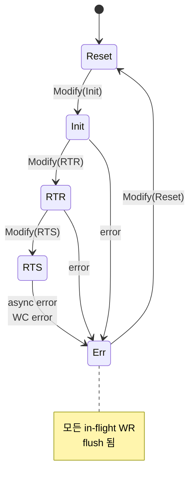
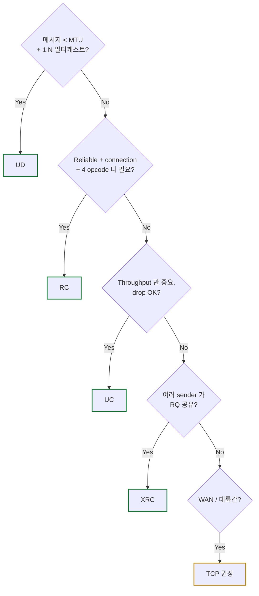
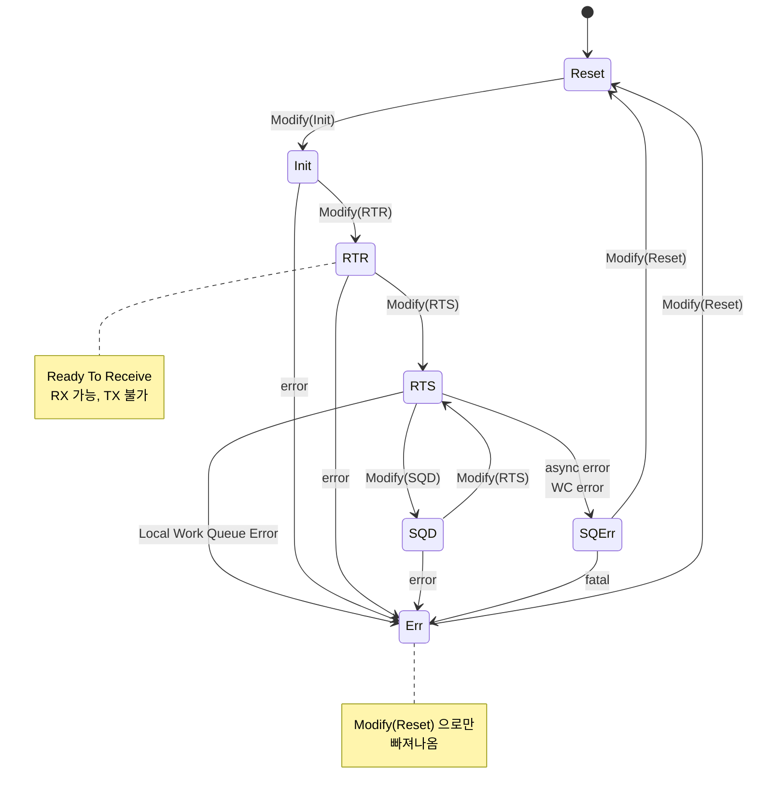
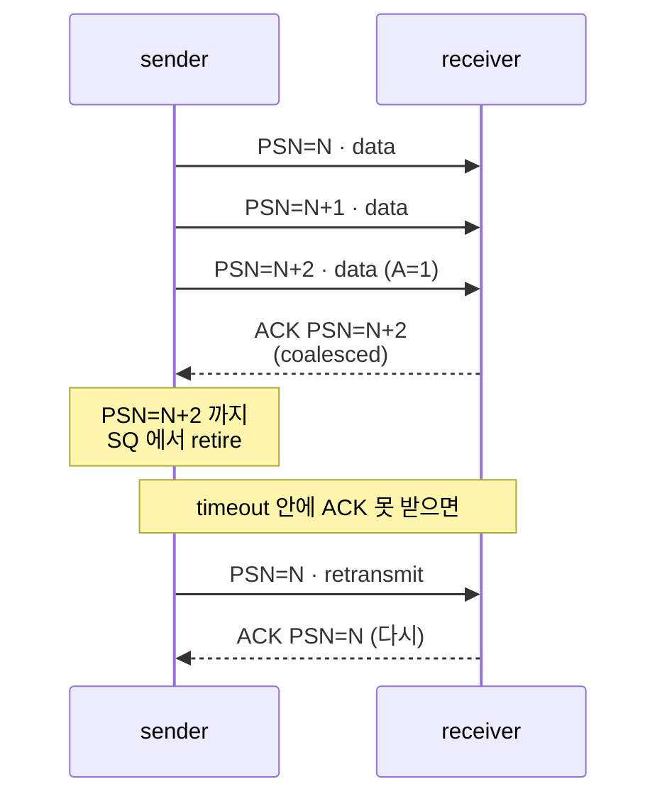

# Module 04 — Service Types & QP FSM

<!-- DV-SKOOL-CH-CTX:start -->
<div class="chapter-context" data-cat="network">
  <a class="chapter-back" href="../">
    <span class="chapter-back-arrow">←</span>
    <span class="chapter-back-icon">⚡</span>
    <span class="chapter-back-text">RDMA</span>
  </a>
  <span class="chapter-divider">›</span>
  <span class="chapter-marker">Module 04</span>
</div>
<!-- DV-SKOOL-CH-CTX:end -->

<!-- DV-SKOOL-CH-TOC:start -->
<div class="page-toc">
  <span class="page-toc-label">목차</span>
  <a class="page-toc-link" href="#1-why-care-이-모듈이-왜-필요한가">1. Why care?</a>
  <a class="page-toc-link" href="#2-intuition-비유와-한-장-그림">2. Intuition</a>
  <a class="page-toc-link" href="#3-작은-예-rc-qp-가-reset-에서-rts-까지-올라가는-bring-up-시퀀스">3. 작은 예 — QP bring-up</a>
  <a class="page-toc-link" href="#4-일반화-service-type-과-fsm-의-구조">4. 일반화</a>
  <a class="page-toc-link" href="#5-디테일-service-별-차이-rc-신뢰성-fragmentation-srq-apm">5. 디테일</a>
  <a class="page-toc-link" href="#6-흔한-오해-와-dv-디버그-체크리스트">6. 흔한 오해 + 디버그 체크리스트</a>
  <a class="page-toc-link" href="#7-핵심-정리-key-takeaways">7. 핵심 정리</a>
</div>
<!-- DV-SKOOL-CH-TOC:end -->

!!! objective "학습 목표"
    이 모듈을 마치면:

    - **Compare** RC / UC / UD / XRC 네 가지 service type 의 신뢰성/연결성/지원 opcode 를 표로 비교한다.
    - **Apply** 워크로드 특성을 보고 적절한 service type 을 선택할 수 있다.
    - **Diagram** QP 의 7-state FSM (Reset/Init/RTR/RTS/SQD/SQErr/Err) 과 transition 트리거를 그릴 수 있다.
    - **Trace** Modify QP attribute 호출 시 어떤 attribute 가 어느 상태 transition 에 필요한지 추적한다.

!!! info "사전 지식"
    - Module 02 (BTH OpCode 의 상위 3-bit 가 service type)
    - Verbs API 의 QP 객체 개념 (Module 01)

---

## 1. Why care? — 이 모듈이 왜 필요한가

### 1.1 시나리오 — "왜 같은 RDMA 인데 service type 이 4 개나?"

당신은 두 종류의 워크로드를 RDMA 로 처리해야 합니다:

- **워크로드 A**: 분산 KV store. 노드 1000 개가 _서로 1:1_ 로 작은 메시지 (~100 B) 를 자주 교환. 1 query/response 당 평균 latency 가 중요.
- **워크로드 B**: Service discovery. 노드 1000 개가 _모두에게_ "내 IP/port" 를 1 회씩 multicast. 작은 메시지, 손실 허용.

워크로드 A 를 **RC** (Reliable Connection) 로 짜면? **1000 × 1000 = 100 만 connection** 의 메타데이터를 _모든 노드_ 가 보관해야 함. QP 1 개당 ~1 KB 메모리 → **노드당 1 GB** 의 connection state 만으로 메모리 폭발.

워크로드 B 를 **RC** 로 짜면? 1000 × 1000 RC 면 위와 같음. 그리고 multicast 가 _안 됨_ — RC 는 1:1 만 가능.

**그래서 service type 이 4 개**:

| 워크로드 | RC | UC | UD | XRC | 채택 |
|---------|----|----|----|----|------|
| A. 1:1 KV (신뢰성↑) | ★★★★ | △ | ✗ | ★★★ | RC 또는 XRC |
| B. 1:N multicast | ✗ | ✗ | ★★★★★ | ✗ | UD |
| C. throughput-only | ★ | ★★★ | ★ | ★★ | UC |
| D. hyperscale fan-in | ★★ | ★ | ✗ | ★★★★★ | XRC |

**Service type 선택이 RDMA 시스템 설계의 가장 큰 결정** 입니다 — RC 는 신뢰성을 hardware 가 책임지지만 connection 비용이 크고, UD 는 connectionless 라 scaling 좋지만 user 가 reliability 를 책임집니다. 검증 관점에서도 service type 마다 "어떤 패킷 유형이 합법인가", "어떤 error 가 가능한가" 가 완전히 달라서, 한 service 의 시나리오를 다른 service 에 그대로 옮기면 거의 다 false fail.

QP FSM 은 시스템 검증의 **bring-up 시퀀스의 뼈대** 입니다. RAL 이 Modify QP 의 attribute 를 단계별로 set 하면서 FSM 을 진행시키는 흐름을 정확히 알아야 sequence/test 작성이 가능.

!!! question "🤔 잠깐 — Reset 에서 RTS 로 _바로 점프_ 할 수 없는 이유"
    Spec 은 Reset → Init → RTR → RTS 를 각각 _별도 Modify 호출_ 로 강제합니다. _한 번에_ 점프하면 안 되는 _race condition_ 한 가지를 떠올려 보세요.

    ??? success "정답"
        **In-flight 패킷이 Modify 도중 도착하는 race**.

        가령 Reset 직후 receiver 의 RNIC 가 우연히 한 패킷을 wire 에서 받았는데, 그 시점 QP state 가 "_RX 가능_" 으로 막 transition 중이면 — 그 패킷을 받아도 되는지/dropping 해야 하는지 ill-defined. 단계적 진입 (Init → 권한 잠금 → RTR → RX 비로소 가능) 로 _각 단계 사이의 race window_ 를 spec 으로 닫아둠.

        이게 검증에서 _bring-up sequence_ 의 각 step 사이에 _wait + read-back_ 을 두는 이유.

---

## 2. Intuition — 비유와 한 장 그림

!!! tip "💡 한 줄 비유"
    **Service type** ≈ **택배 / 등기우편 / 일반우편 / 그룹발송**

    - **RC** = 등기 (배송확인 + 분실 시 재배송) ← TCP 와 가장 비슷
    - **UC** = 일반 택배 (배송, 분실 시 책임 안 짐) ← 신뢰성 미보장 RDMA
    - **UD** = 엽서 (1:N 가능, 작은 메시지)
    - **XRC** = 한 회사 안에서 여러 부서가 같은 수신함 공유

    **QP FSM** ≈ **신용카드 발급 절차**: 신청(Init) → 한도 심사(RTR) → 활성화(RTS) → 정지(SQD/SQErr) → 해지(Err).

### 한 장 그림 — Service type × QP FSM



**Service 별 차이 (단계별 attribute 만 다름)**:

| Service | RTR attribute 핵심 | RTS attribute 핵심 | reliability |
|---|---|---|---|
| **RC** | dest_qp, init PSN, MTU | timeout, retry_cnt | ACK + retry hardware |
| **UC** | (RC 와 유사) | (RC 와 유사) | drop = 메시지 loss |
| **UD** | Q_Key (peer 약한 인증) | — (connectionless) | multicast 가능 |
| **XRC** | SRQ 와 함께 | — | 한 RQ 를 여러 sender QP 가 공유 (hyperscale fan-in) |

### 왜 이렇게 설계했는가 — Design rationale

서비스 타입을 4개로 나눈 이유는 **"신뢰성을 누가 책임지는가" × "연결을 가질 것인가" 의 2×2 매트릭스**. RDMA 가 hardware-offload 라서, "양 끝의 hardware 가 reliability 도 책임지면 좋다 (RC)" 는 결정이 가능했습니다. 그러나 connection 메타데이터 (PSN, dest QP, init PSN, retry_cnt …) 가 endpoint 마다 메모리를 잡아먹으므로, 수십만 connection 이 필요한 hyperscale 에서는 connectionless (UD) 또는 shared receive (XRC) 가 필수가 됩니다.

QP FSM 이 7-state 인 이유는 **bring-up 의 atomicity** 때문 — Reset → Init → RTR → RTS 를 한 번에 점프하면 attribute set 도중에 패킷이 도착하면 어떻게 처리할지 ill-defined. 단계별 진입 + 단계별 attribute 잠금 = race-free.

---

## 3. 작은 예 — RC QP 가 Reset 에서 RTS 까지 올라가는 bring-up 시퀀스

A 노드의 QPN = `0x0123`, B 노드의 QPN = `0x0456`. RC service 로 양방향 통신.

```
   A 노드                                                   B 노드
   ───────                                                  ──────
   ① ibv_create_qp(PD, RC, SRQ?=null) → QPN=0x0123          ① ibv_create_qp(PD, RC) → QPN=0x0456
       state: Reset                                            state: Reset

   ② Modify(Reset → Init)                                   ② Modify(Reset → Init)
       attrs: pkey_index=0, port=1,                            attrs: pkey_index=0, port=1,
              access=R/W/Atomic                                       access=R/W/Atomic
       state: Init                                             state: Init

   ─── RDMA-CM REQ/REP/RTU 핸드셰이크 (TCP 위) ───
       양 단이 (peer QPN, init PSN, peer LID/GID) 교환

   ③ Modify(Init → RTR)                                     ③ Modify(Init → RTR)
       attrs: dest_qp_num=0x0456,                              attrs: dest_qp_num=0x0123,
              rq_psn=0x100000,                                        rq_psn=0x200000,
              path_mtu=1024,                                          path_mtu=1024,
              max_dest_rd_atomic=4,                                   max_dest_rd_atomic=4,
              min_rnr_timer=12,                                       min_rnr_timer=12,
              ah_attr (DLID/SL/...)                                   ah_attr (DLID/SL/...)
       state: RTR (RX 가능)                                    state: RTR

   ④ Modify(RTR → RTS)                                      ④ Modify(RTR → RTS)
       attrs: sq_psn=0x200000,                                 attrs: sq_psn=0x100000,
              timeout=14, retry_cnt=7,                                timeout=14, retry_cnt=7,
              rnr_retry=7, max_rd_atomic=4                            rnr_retry=7, max_rd_atomic=4
       state: RTS (RX + TX 가능) ✓                            state: RTS ✓

   ─── 이제 양방향 데이터 송수신 가능 ───

   ⑤ ibv_post_send(WRITE, ...)
       BTH.PSN = sq_psn = 0x200000
                                  ─ packet ─▶
                                                            ⑥ B 의 expected PSN = rq_psn = 0x200000  ✓
                                                               receiver 검증 통과
                                                               BTH.PSN = sq_psn = 0x100000 (ACK)
                                  ◀─ ACK ───
       SQ retire, CQE generated
```

### 단계별 의미

| Step | 누가 | 무엇을 | 왜 |
|---|---|---|---|
| ① | both | `ibv_create_qp` | QPN 발급, state=Reset |
| ② | both | Modify(Init) — pkey_index, port, access flag 설정 | partition 결정, packet 수신 가능한 port 결정. RX/TX 는 아직 불가. |
| (사이) | host SW | RDMA-CM 으로 메타데이터 교환 | hardware 가 모르는 init PSN, peer QPN 을 양 끝에서 합의 |
| ③ | both | Modify(RTR) — dest_qp_num, rq_psn, path_mtu, max_dest_rd_atomic 등 | **수신** 측 정보 확정. RX 가능. |
| ④ | both | Modify(RTS) — sq_psn, timeout, retry_cnt 등 | **송신** 측 정보 확정. RX + TX 가능. |
| ⑤ | A | `ibv_post_send`, BTH.PSN = sq_psn | 첫 packet 의 PSN 은 RTS 시 설정한 sq_psn |
| ⑥ | B | rq_psn 과 일치 → 수신 통과 → ACK | **양 끝 PSN 일관성** 이 RC 의 reliability 의 근간 |

### 비유 — 신용카드 발급 다시

| FSM | 신용카드 단계 | 의미 |
|---|---|---|
| Reset | 카드 미신청 | 아무것도 없음 |
| Init | 신청서 제출 (이름/주소/직장) | 기본 자격 확인. 카드 발급 안 됨 |
| RTR | 한도 심사 통과 (수령 가능) | 가맹점에서 결제 받기 가능 (RX). 결제 보내기는 아직 |
| RTS | 카드 활성화 + 비밀번호 등록 | 결제 보내기/받기 모두 가능 |
| SQD | 일시 정지 (다음 결제 막음, 현재 진행 중인 건은 처리) | graceful shutdown |
| Err | 분실/도난 신고로 카드 정지 | reset 만이 복구 |

!!! note "여기서 잡아야 할 두 가지"
    **(1) 단계별 필수 attribute 는 한 줄도 누락하면 안 됨** — Modify QP 가 그 자리에서 실패. 검증 환경의 init sequence 에서 한 attribute 만 빠져도 RTR 진입 실패로 모든 후속 시나리오가 죽음. <br>
    **(2) RTR 진입 후에야 RX 가 가능** — A 가 step③ 끝났는데 B 가 아직 step③ 전이면 A 가 보내는 packet 은 B 가 수신 못함. RDMA-CM 의 핸드셰이크가 양 끝의 동시 진입을 보장.

---

## 4. 일반화 — Service type 과 FSM 의 구조

### 4.1 4 service type 의 2×2 매트릭스

```
                         신뢰성 보장?
                    ┌────────────┬────────────┐
                    │    Yes     │    No      │
        ┌───────────┼────────────┼────────────┤
        │  Yes      │    RC      │    UC      │ 1:1
   연결 │           │            │            │
   유무 ├───────────┼────────────┼────────────┤
        │  No       │   (XRC*)   │    UD      │ N:1 / 1:N
        │           │            │            │
        └───────────┴────────────┴────────────┘
   * XRC 는 1:N receive (한 RQ 를 여러 sender 가 공유) 라 표에 정확히 안 맞음
```

### 4.2 FSM 진행의 일반 규칙

- **단계 skip 금지**: Reset → RTR 직접 점프 시도 → 거부.
- **상태마다 필수 attribute 정해져 있음** — Modify 시 missing attribute 면 호출 실패.
- **Err 진입은 자동** — async error (PSN error, retry exhausted, RNR exhausted, MR access violation) 발생 시 자동 진입. in-flight WR 모두 flush + WC error.
- **Err 에서 복구는 Reset 만**.
- **State transition 은 하드웨어가 enforce** — sw 가 우회 못함.

---

## 5. 디테일 — Service 별 차이, RC 신뢰성, Fragmentation, SRQ, APM

### 5.1 4 service type 비교 표

| 항목 | RC | UC | UD | XRC |
|------|----|----|----|-----|
| 연결성 | 1:1 connection | 1:1 connection | Connectionless | 1:N (shared SRQ) |
| 신뢰성 | ✓ ACK + retry | ✗ | ✗ | ✓ |
| 순서 보장 | ✓ | (대체로) | ✗ | ✓ |
| Max msg size | 2 GB (per WQE) | 2 GB | MTU (single packet) | 2 GB |
| Multicast | ✗ | ✗ | ✓ | ✗ |
| 지원 opcode | SEND/WRITE/READ/ATOMIC | SEND/WRITE | SEND only | SEND/WRITE/READ/ATOMIC |
| 사용 예 | NVMe-oF, MPI | (드물음) | DHCP-style discovery, 작은 RPC | 분산 KV 의 다대다 |
| BTH OpCode 상위 3-bit | `000` | `001` | `010` | `101` (XRC) |

!!! quote "Spec 인용"
    "RC service shall provide reliable, in-order delivery of messages between two QPs." — IB Spec 1.7, §9.7<br>
    "UC service does not provide reliable delivery; if a packet is lost, the message is silently dropped." — §9.8<br>
    "UD service is connectionless and unreliable; each message is contained in a single packet of at most MTU bytes." — §9.8

### 5.2 Service type 선택 가이드



### 5.3 QP State Machine 상세



| State | 의미 | RX | TX |
|-------|------|----|----|
| **Reset** | 초기. 모든 attribute 미설정. | ✗ | ✗ |
| **Init** | 기본 attribute (PD, port, P_Key, access flag) 설정됨. | ✗ | ✗ |
| **RTR** (Ready-To-Receive) | Receive 측 attribute (RC: remote QPN, dest LID, PSN; UD: Q_Key) 설정됨. | ✓ | ✗ |
| **RTS** (Ready-To-Send) | Send 측 attribute (timeout, retry count, max read atomic, init PSN) 설정됨. **정상 동작 상태**. | ✓ | ✓ |
| **SQD** (Send Queue Drain) | TX 새로 시작 안 함, 이미 in-flight 만 처리. APM 또는 graceful shutdown 용. | ✓ | (in-flight only) |
| **SQErr** (Send Queue Error) | UD/UC 에서 sender side 에러 발생. RX 는 가능, TX 는 새 WR 못 받음. | ✓ | ✗ |
| **Err** | 어느 상태에서든 fatal error → 모든 in-flight WR flush 됨 (WC error). | ✗ | ✗ |

### 5.4 Modify 시 필수 attribute (RC 기준)

| Transition | 필요한 attribute |
|------------|------------------|
| Reset → Init | `qp_state, pkey_index, port_num, qp_access_flags` |
| Init → RTR | `path_mtu, dest_qp_num, rq_psn, max_dest_rd_atomic, min_rnr_timer, ah_attr (DLID, SL, ...)` |
| RTR → RTS | `sq_psn, timeout, retry_cnt, rnr_retry, max_rd_atomic` |
| Any → Err | (자동 — async error) |
| Any → Reset | `qp_state = Reset` (clean-up) |

!!! quote "Spec 인용"
    "A QP shall progress through its states only as defined by the QP state machine; the verbs interface shall enforce this ordering." — IB Spec 1.7, §10.3 (R-351 ~ R-390)

### 5.5 RC 의 신뢰성 메커니즘 요약



| 항목 | 값/의미 |
|------|--------|
| **PSN** | 24-bit, 2^24 modulo. 한 message 의 첫 패킷에 init PSN, 이후 +1. |
| **A (AckReq) bit** | sender 가 receiver 에 ACK 요청. coalescing 위해 모든 패킷마다는 아님. |
| **AETH** (ACK ETH) | ACK 패킷에 들어가는 4 byte: syndrome (ACK/NAK 구분) + MSN (Message Sequence Number) |
| **Retry timer** | sender 가 ACK 못 받으면 timer 만료 시 동일 PSN 재전송 |
| **Retry count** | `retry_cnt` 횟수 만큼 시도, 초과 시 QP → Err state + WC error (`IBV_WC_RETRY_EXC_ERR`) |

→ 자세한 흐름은 [Module 06 Data Path](06_data_path.md) 와 [Module 07 Error](07_congestion_error.md) 에서.

### 5.6 UC, UD, XRC 추가 사항

#### UC (Unreliable Connection)

- 1:1 connection 이 있으나 ACK 없음.
- SEND, WRITE 만 지원 (READ, ATOMIC 불가 — reliability 필요).
- Packet drop = 메시지 drop, 사용자/상위 layer 가 책임.
- Sequence error 등 일부 에러는 SQErr 상태로 갈 수 있음.

#### UD (Unreliable Datagram)

- Connectionless. QP 하나가 임의의 destination 에 SEND 가능 (목적지 마다 AH = Address Handle).
- SEND only. 한 message = 한 packet (≤ MTU − header).
- BTH 다음에 **DETH (8B)** 가 필수: Q_Key + SrcQP.
- Multicast 가능: DLID = multicast LID, MGID 설정.
- Q_Key 검증 필수 (high bit 1 인 Q_Key 는 privileged).

#### XRC (eXtended Reliable Connection)

- 한 receive side QP 를 여러 sender QP 가 공유 (target 측 메모리 절약).
- Hyperscale 환경에서 N×N QP polynomial blow-up 완화 목적.
- BTH OpCode 상위 3-bit `101`. XRC ETH 별도 정의.
- IB Spec 1.2.1 부터 옵션, 1.7 에 통합. RoCEv2 도 지원.

### 5.7 메시지 ↔ 패킷 매핑 (Fragmentation)

```
   RC SEND of 8 KB, MTU = 4 KB
   ────────────────────────────────────────
   Packet 1: OpCode = SEND_FIRST   (PSN=N)
   Packet 2: OpCode = SEND_LAST    (PSN=N+1) ← 마지막에 ACK 요청

   RC SEND of 1 KB, MTU = 4 KB
   ────────────────────────────────────────
   Packet 1: OpCode = SEND_ONLY    (PSN=N) ← 한 번에 끝

   RC WRITE of 8 KB
   ────────────────────────────────────────
   Packet 1: OpCode = WRITE_FIRST  (PSN=N)   + RETH (remote VA, R_Key, len)
   Packet 2: OpCode = WRITE_MIDDLE (PSN=N+1)
   Packet 3: OpCode = WRITE_LAST   (PSN=N+2)
                                              ← LAST 또는 LAST_with_IMM 에 A=1 가능
```

- `*_FIRST/MIDDLE/LAST/ONLY` 의 4 변형이 OpCode 하위 5-bit 로 인코딩.
- LAST_WITH_IMMEDIATE (`*_LAST_W_IMM`) 는 ImmDt header 추가.

### 5.8 RDMA-TB 에서의 QP / Service 검증 포인트

| 검증 영역 | 시나리오 |
|-----------|----------|
| **State transition 합법성** | Reset → RTR (skip Init) 시도 → 거부되어야 함 |
| **Attribute 일관성** | RTR 진입 시 dest_qp_num 미설정 → Modify 실패 |
| **PSN window 확인** | sender PSN 이 expected window 밖 → NAK or silent drop (spec 의해) |
| **Service type 별 illegal opcode** | UC QP 에 RDMA READ → WC error |
| **UD Q_Key 검증** | UD recv 시 wrong Q_Key → silent drop (spec) |
| **Multi-packet message** | FIRST/MIDDLE/LAST 일관성 (RETH 는 FIRST/ONLY 에만) |
| **RC retry 동작** | ACK 일부러 drop → retry 동작, retry_cnt 초과 → QP Err |
| **QP recovery** | Err 상태에서 Reset → Init → ... 재진입 가능해야 함 |

이 시나리오들은 [Module 08 RDMA-TB DV](08_rdma_tb_dv.md) 에서 vplan 과 매핑됨.

### 5.9 Confluence 보강 — UD QP 의 멀티캐스트와 Q_Key

!!! note "Internal (Confluence: UD QPs, id=102236189)"
    UD QP 는 **하나의 QPN 으로 다수 peer 와 통신**한다. 패킷에는 BTH + DETH 가 실리고, DETH 의 Q_Key 는 일종의 **약한 인증 토큰**이다.

    - Multicast: UD QP 를 multicast group 에 attach (`ibv_attach_mcast`). 같은 group 의 QPN 이 0xFFFFFF 로 패킷에 채워지고, GRH 의 DGID 가 multicast GID.
    - Q_Key: 양 단이 동일 값을 알아야 함. 0x80000000 이상은 *privileged Q_Key* (커널만 발급 가능).
    - 검증: 잘못된 Q_Key → silent drop. RDMA-CM 도 UD 변형 (UD-CM) 으로 setup.

### 5.10 Confluence 보강 — SRQ (Shared Receive Queue)

!!! note "Internal (Confluence: Shared Receive Queue, id=122028489)"
    SRQ 는 **하나의 RQ 를 여러 QP 가 공유**해 RECV WQE pool 을 절약하는 객체. XRC 는 SRQ 를 거의 필수로 동반한다.

    - Pre-post: SRQ 에 RECV WQE 를 미리 충분히 채워둬야 함 — 부족하면 SEND 패킷 drop + RNR.
    - Limit event: SRQ 점유율이 limit 임계치 이하로 내려가면 async event → CPU 가 RECV 채움.
    - 검증: SRQ underrun (RECV 없음) 시 RNR retry, SRQ limit event firing, XRC + SRQ 조합의 fairness.

### 5.11 Confluence 보강 — SEND Inline

!!! note "Internal (Confluence: SEND Inline, id=118981274)"
    `IBV_SEND_INLINE` 플래그는 small payload (보통 ≤ MTU/2 또는 vendor-specific limit) 를 WQE 안에 직접 실어 보내 **DMA fetch 를 생략** 한다. inline 한도를 넘기면 verb 자체가 실패.

    - 장점: latency 단축 (sub-µs 영역).
    - 검증: inline 경로 vs DMA fetch 경로 두 backend 가 동일 의미를 갖는지 cross-check.
    - 사내 IP: inline 한도는 GPUBoost spec 에서 정의 (M11 참조).

### 5.12 Confluence 보강 — APM (Automatic Path Migration)

!!! note "Internal (Confluence: Automatic Path Migration, id=151552238)"
    QP 에 alternate path attribute (`alt_pkey_index`, `alt_port_num`, alternate AH) 를 미리 등록하면 primary 장애 시 hardware 가 자동으로 alternate 로 전환한다.

    - State: `IBV_QP_PATH_MIG_STATE` 가 `MIGRATED` → `REARM` → `ARMED` 사이에서 이동.
    - APM 비활성: 사내 IP default. BTH 의 MigReq 도 0 zero-fill (M02 참조).
    - 검증: 활성화 시 cross-port failover sequence + alt path PSN 연속성.

---

## 6. 흔한 오해 와 DV 디버그 체크리스트

### 흔한 오해

!!! danger "❓ 오해 1 — 'RC 는 packet drop 을 spec 이 보장하므로 검증 시 packet loss 시나리오는 안 만들어도 된다'"
    **실제**: RC 의 reliability 는 **HCA 의 PSN/ACK/retry 메커니즘**으로 보장됩니다 — 즉 packet drop 은 발생할 수 있고, retry 가 처리. 검증 관점에서 packet drop 시나리오는 _"reliability 가 보장된다는 사실을 확인하기 위해 반드시 inject 해야 하는 시나리오"_ 입니다 (RDMA-TB `error_handling/VPLAN_error_handling.md` 의 Local ACK timeout, implied NAK 등).<br>
    **왜 헷갈리는가**: "reliable" 단어를 "packet drop 안 함" 으로 오독.

!!! danger "❓ 오해 2 — 'UD 는 1:1 통신도 못 한다'"
    **실제**: UD 는 connectionless 일 뿐 1:1 도 잘 됩니다. 단지 connection 메타데이터가 없으므로 매 SEND 마다 destination AH (Address Handle) 를 명시. 1:N broadcast/multicast 가 추가로 가능.<br>
    **왜 헷갈리는가**: "datagram = N:N" 로 오해.

!!! danger "❓ 오해 3 — 'RTR 진입하면 즉시 데이터 보낼 수 있다'"
    **실제**: RTR 은 **수신**만 가능. 송신은 RTS 진입 후. 흔히 "RTR" 의 R 을 send-ready 로 오독.<br>
    **왜 헷갈리는가**: 영어 약어가 모호.

!!! danger "❓ 오해 4 — 'Modify(Reset → Init → RTR → RTS) 한 번에 묶어서 호출 가능'"
    **실제**: 각 transition 마다 별도 호출. 하나에서 attribute 누락 시 즉시 실패. atomic batch 같은 건 없음.<br>
    **왜 헷갈리는가**: "verb 한 번이면 빠르겠다" 는 직관.

!!! danger "❓ 오해 5 — 'XRC 는 단순히 receive queue 1개를 여러 QP 가 공유하는 것'"
    **실제**: XRC 는 send-side 도 변형 — XRC INI (initiator) QP 와 XRC TGT (target) QP 가 별도. SRQ 까지 함께 와야 의미. spec 도 XRC ETH 라는 별도 헤더를 정의.<br>
    **왜 헷갈리는가**: 이름이 "shared receive" 같이 들림.

### DV 디버그 체크리스트

| 증상 | 1차 의심 | 어디 보나 |
|---|---|---|
| Modify(Init→RTR) 가 EINVAL 반환 | dest_qp_num, rq_psn, path_mtu, max_dest_rd_atomic, ah_attr 중 missing | Modify 호출 인자 vs §5.4 표 |
| RTR 진입 후 보내는 packet 이 receiver 에서 drop | rq_psn 과 sender 의 sq_psn 불일치 | 양 끝의 init PSN read-back |
| RC 시나리오에서 retry 가 안 나타남 | timeout/retry_cnt = 0 또는 너무 김 | RTR→RTS 시 attribute |
| `IBV_WC_RETRY_EXC_ERR` 발생 후 QP 재사용 시도 실패 | Err 상태 → Reset 거치지 않음 | QP state read |
| UD SEND 가 silent drop | Q_Key mismatch | 양 끝의 Q_Key |
| UC QP 에 RDMA READ post → 즉시 error | service type 의 illegal opcode | WC error code, BTH OpCode 디코드 |
| Multi-packet WRITE 의 중간 packet 이 RETH 들고 옴 | sender 의 fragmentation 로직 결함 | OpCode = WRITE_MIDDLE 인 packet 의 RETH 존재 여부 |
| SRQ underrun → 모든 SEND 가 RNR | SRQ 에 RECV pre-post 부족 | SRQ depth, RECV repost rate |
| APM 활성인데 alt path 로 전환 안 됨 | path_mig_state, alt_ah_attr 누락 | qp attr read |

---

## 7. 핵심 정리 (Key Takeaways)

- 4 service type — RC/UC/UD/XRC — 각각 신뢰성·연결성·지원 opcode 가 다름.
- QP FSM 7 state — Reset/Init/RTR/RTS/SQD/SQErr/Err — 데이터 송수신 가능 상태는 RTR (RX) / RTS (RX+TX) 만.
- Modify QP 시 **상태마다 필수 attribute 가 정해져 있음** — bring-up sequence 의 뼈대.
- RC 의 reliability 는 PSN + ACK + retry + AETH 로 구성, hardware 책임.
- UD 는 datagram + multicast, DETH 와 Q_Key 검증.

!!! warning "실무 주의점"
    - "init PSN" 이 양 끝에서 다를 수 있음 (RC 는 sender PSN ↔ receiver expected PSN 별도). 검증 시 RAL 으로 read-back 으로 확인.
    - UC 에서 packet drop = 메시지 silent loss → scoreboard 가 그것을 정상으로 처리해야 false fail 안 남.
    - UD 의 max payload 는 MTU − (Eth+IP+UDP+BTH+DETH+ICRC) 로 계산해야 함 — 단순 MTU 가 아님.
    - XRC 검증은 SRQ (Shared Receive Queue) 행동까지 함께 봐야 함.

### 7.1 자가 점검

!!! question "🤔 Q1 — Service type 선택 (Bloom: Apply)"
    1024 GPU AI training 잡. 매 step 마다 _all-reduce_ 32 GB. 각 GPU 는 _모든 다른 GPU 와_ 데이터 교환. 어떤 service type 이 가장 적합한가? 그리고 _100 만 connection_ 메모리 문제는 어떻게 푸는가?

    ??? success "정답"
        - **RC** (or XRC) — gradient 무손실 + 순서 보장 필요.
        - 100 만 connection (1024² = 1 백만) 메모리 문제는 두 가지로 완화:
          1. **XRC** — 한 receive QP 를 여러 sender QP 가 공유 → target 메모리 절약.
          2. **NVIDIA Dynamically Connected Transport (DCT)** — 필요할 때만 connection 만들고 idle 시 해제 (Confluence id=961249303).

!!! question "🤔 Q2 — QP FSM 디버그 (Bloom: Analyze)"
    당신의 sequence 에서 Modify(Init → RTR) 이 EINVAL 반환합니다. 어떤 attribute 를 _어떤 순서로_ 체크하시겠습니까?

    ??? success "정답"
        Modify(Init→RTR) 필수 attribute (§5.4 표):
        1. `dest_qp_num` — peer QPN. CM 에서 받았는가?
        2. `rq_psn` — receive 측 expected PSN. CM 에서 받았는가?
        3. `path_mtu` — 양 끝 MTU 합의값. RC 의 경우 4096 까지.
        4. `max_dest_rd_atomic` — outstanding READ/ATOMIC 한계.
        5. `min_rnr_timer` — RNR retry 간격.
        6. `ah_attr` — DLID/GID/SL/...

        디버그 순서: read-back 으로 _어떤 필드가 0_ 인지 먼저 확인 → 누락 attribute 를 sequence 에 추가. EINVAL 은 보통 attribute mask 누락 또는 invalid 값.

!!! question "🤔 Q3 — RTS 진입 후 동작 (Bloom: Evaluate)"
    당신의 RC QP 가 RTS 에 있다. 갑자기 `retry_cnt` 만큼의 retry 가 exhausted 됐다고 합시다. QP 상태는? 어떻게 _복구_ 하나? 단순 Modify(RTS) 재호출이 작동하지 않는 이유는?

    ??? success "정답"
        - QP → **Err** state (auto transition).
        - 복구는 **Reset 거쳐서** (Err → Reset → Init → RTR → RTS) — 단계 skip 불가.
        - Modify(RTS) 재호출이 안 되는 이유: spec 이 Err → 다른 state 로의 직접 transition 을 _금지_ (state machine 의 closing).
        - 검증: WC_RETRY_EXC_ERR 이후 QP state read = Err, Modify(Reset) → Modify(Init) → ... 의 _재진입_ 시퀀스가 성공하는지.

### 7.2 출처

**Internal (Confluence)**
- `[RDMA] EE context vs QP number` (id=985661494) — RC/UC/UD 의 EE context
- `[RDMA] ETH (Extended Transport Header)` (id=993361924) — service 별 xTH
- `Nvidia Dynamically Connected Transport` (id=961249303) — DCT, XRC 의 hyperscale 대안
- 사내 `RDMA-TB/error_handling/VPLAN_error_handling.md` — packet drop / retry 시나리오

**External**
- IBTA Spec 1.7, §9.7 RC service / §9.8 UC, UD service
- IBTA Spec 1.7, §10.3 QP state machine

---

## 다음 모듈

→ [Module 05 — Memory Model: PD/MR/L_Key/R_Key/IOVA](05_memory_model.md): MR 등록과 보호 키, IOVA 변환의 동작 원리.

[퀴즈 풀어보기 →](quiz/04_service_types_qp_quiz.md)


--8<-- "abbreviations.md"
--8<-- "_inc/topic_abbr.md"
