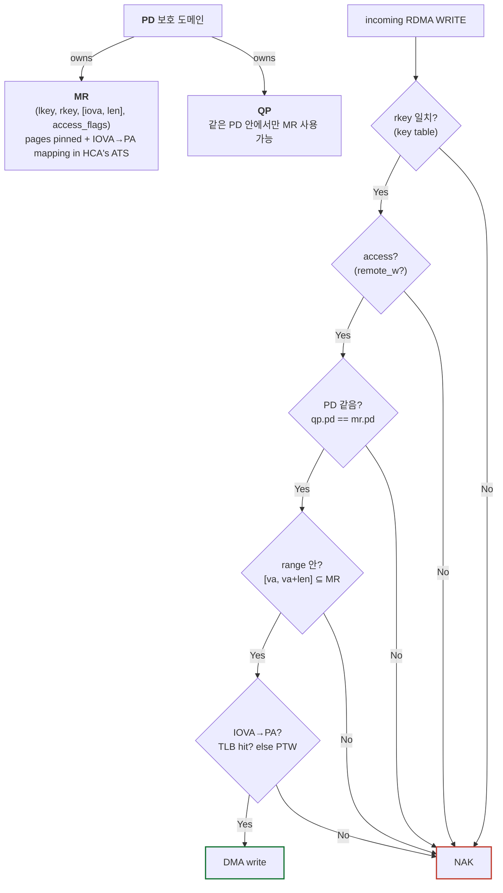
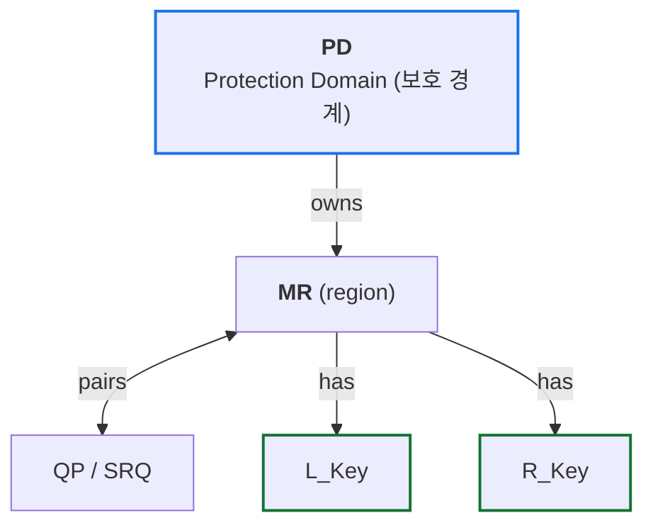
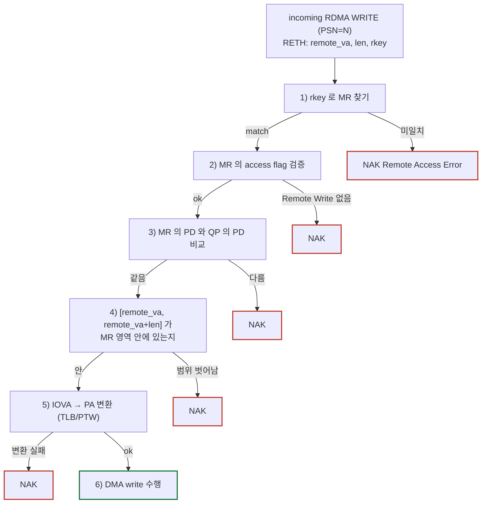
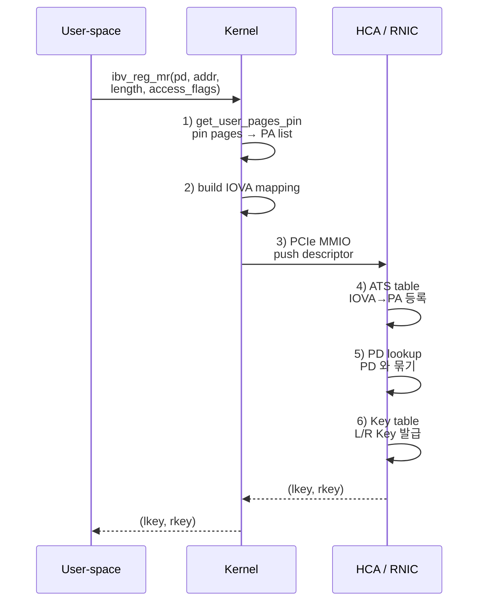
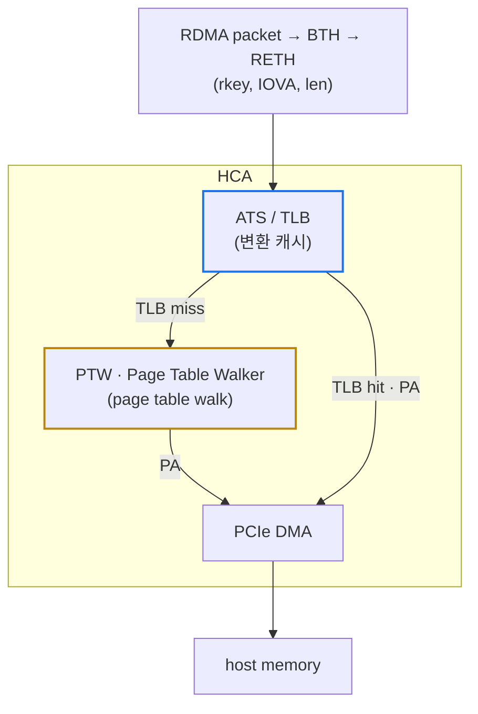

# Module 05 — Memory Model: PD, MR, L_Key/R_Key, IOVA

<!-- DV-SKOOL-CH-CTX:start -->
<div class="chapter-context" data-cat="network">
  <a class="chapter-back" href="../">
    <span class="chapter-back-arrow">←</span>
    <span class="chapter-back-icon">⚡</span>
    <span class="chapter-back-text">RDMA</span>
  </a>
  <span class="chapter-divider">›</span>
  <span class="chapter-marker">Module 05</span>
</div>
<!-- DV-SKOOL-CH-CTX:end -->

<!-- DV-SKOOL-CH-TOC:start -->
<div class="page-toc">
  <span class="page-toc-label">목차</span>
  <a class="page-toc-link" href="#1-why-care-이-모듈이-왜-필요한가">1. Why care?</a>
  <a class="page-toc-link" href="#2-intuition-비유와-한-장-그림">2. Intuition</a>
  <a class="page-toc-link" href="#3-작은-예-한-mr-등록부터-원격-write-수신까지">3. 작은 예 — MR 등록 → 원격 WRITE</a>
  <a class="page-toc-link" href="#4-일반화-객체-계층과-검증-체인">4. 일반화 — 객체 계층 + 검증 체인</a>
  <a class="page-toc-link" href="#5-디테일-registration-flow-access-iova-mw-odp-mpe">5. 디테일</a>
  <a class="page-toc-link" href="#6-흔한-오해-와-dv-디버그-체크리스트">6. 흔한 오해 + 디버그 체크리스트</a>
  <a class="page-toc-link" href="#7-핵심-정리-key-takeaways">7. 핵심 정리</a>
</div>
<!-- DV-SKOOL-CH-TOC:end -->

!!! objective "학습 목표"
    이 모듈을 마치면:

    - **Define** PD, MR, L_Key, R_Key, IOVA 의 정의와 역할을 ISO 11179 형식으로 진술한다.
    - **Trace** Memory Registration 흐름을 단계별로 추적한다 (`ibv_reg_mr` → kernel → HCA pin/PRI → key 발급).
    - **Trace** 한 RDMA WRITE 가 도착했을 때 responder 가 5단계 key/access/range/PD 검증을 어떻게 하는지 따라간다.
    - **Apply** access flag (Local Write, Remote Read/Write, Atomic) 를 시나리오에 매핑한다.
    - **Diagram** RDMA-TB 의 MMU/PTW/TLB 가 IOVA 변환에서 하는 역할을 그릴 수 있다.

!!! info "사전 지식"
    - Module 01 의 Verbs 6 객체
    - PCIe ATS / IOMMU 기본 (선택)

---

## 1. Why care? — 이 모듈이 왜 필요한가

**RDMA 의 모든 데이터 path 는 "주소 + key" 의 쌍으로 표현** 됩니다. local 측 sg_list 는 (`addr`, `length`, `lkey`), remote 측 RDMA WRITE 의 RETH 는 (`remote_va`, `length`, `rkey`). 이 키 검증과 IOVA → PA 변환을 누가 어떻게 하는지가 RDMA 보안과 성능의 핵심.

검증 환경에서 **가장 디버그가 어려운 영역** 도 이쪽입니다 — `WC_LOC_PROT_ERR`, `WC_REM_ACCESS_ERR` 같은 에러는 lkey/rkey/PD/access flag/range 5가지 중 하나라도 틀리면 발생하므로, 정확한 진단을 위해 5가지 모두를 알아야 합니다.

---

## 2. Intuition — 비유와 한 장 그림

!!! tip "💡 한 줄 비유 — Memory Registration ≈ 공항 보안 검색대 통과 + 게이트 번호 발급"
    - **PD** = 항공사 (다른 항공사 게이트로는 못 들어감)
    - **MR** = 보안 검색대 통과한 짐 (이미 X-ray 끝)
    - **L_Key** = 내 짐 표 (나만 사용)
    - **R_Key** = 상대에게 알려주는 픽업 코드 (가지고 와도 됨)
    - **IOVA** = 게이트 번호 (실제 비행기 위치는 ground crew 가 매핑)
    - **Access flag** = 짐 라벨 (RO/RW/ATOMIC 권한)

### 한 장 그림 — 객체 묶음 + 검증 chain



### 왜 이렇게 설계했는가 — Design rationale

RDMA 의 보안 모델은 "**키만 보면 누구든 접근 가능**" — TCP 처럼 connection 자체가 인증 단위가 아닙니다. 그래서 "키가 곧 권한 토큰" 이고, 키 위조/유출 = 보안 사고. 다중 방어층이 필요 → PD (격리) + access flag (기능 제한) + range (영역 제한). 5단계 검증은 모두 hardware 가 패킷 수신 시점에 수행 — sw 가 끼면 latency 가 망가집니다.

L_Key 와 R_Key 를 분리한 이유: 같은 영역이라도 _자기_ 가 쓸 때와 _남_ 이 쓸 때 권한이 달라야 함. 예: GPU memory 를 RDMA 가 자기 buffer (Local Read) 로 쓰는 건 OK, 외부 노드가 임의로 쓰게 하는 건 보안 위험 — 그래서 L_Key 만 발급하고 R_Key 는 발급 안 할 수도 있음.

---

## 3. 작은 예 — 한 MR 등록부터 원격 WRITE 수신까지

A 가 1 MB buffer 를 등록하고, B 가 그 영역에 1 KB RDMA WRITE.

```
   ──── Step 1~6: A 측 등록 ────
   ① user code:
        buf = malloc(1<<20);
        mr = ibv_reg_mr(pd, buf, 1<<20,
                        IBV_ACCESS_LOCAL_WRITE | IBV_ACCESS_REMOTE_WRITE);
   ② kernel:
        get_user_pages_pin(buf, 256 pages)        ← page-pin (swap 방지)
        build IOVA mapping table                  ← IOVA = buf_va (or assigned)
   ③ kernel → HCA via PCIe MMIO:
        push descriptor: (PD=p1, IOVA=0x1000, len=1<<20, access=LW|RW)
   ④ HCA:
        ATS table: IOVA 0x1000..0x101000 → PA list
        PD lookup: p1 가 valid 인지
        Key table 발급:
            lkey = 0x12340001  (24-bit index 0x123400 + 8-bit tag 0x01)
            rkey = 0x12340101  (다른 tag 발급)
   ⑤ HCA → kernel:
        (lkey, rkey) 반환
   ⑥ user code: 받은 (mr->lkey, mr->rkey)

   ──── Step 7~9: A 가 B 에게 (remote_va, rkey) 전달 ────
   ⑦ A → B 로 RDMA-CM 또는 sockets out-of-band 로
        (remote_va = buf_va = 0x1000, rkey = 0x12340101) 전송

   ──── Step 8~12: B 가 RDMA WRITE 1 KB 송신 ────
   ⑧ B 의 ibv_post_send(WRITE, sg_list=(local_buf, 1024, B_lkey),
                          remote_va=0x1000, rkey=0x12340101)
   ⑨ B 의 HCA: local_buf 에서 1024 B DMA read
   ⑩ packet (BTH + RETH(rkey=0x12340101, va=0x1000, dmalen=1024) + payload) → A

   ──── Step 13~17: A 의 HCA 가 5-step 검증 ────
   ⑪ A 의 HCA 가 RETH.rkey = 0x12340101 으로 key table lookup
        → MR p1 찾음 (matched)                   ✓ (1)
   ⑫ MR access flag = LW|RW; incoming = WRITE
        → Remote Write 권한 있음                 ✓ (2)
   ⑬ MR.pd = p1; QP.pd = p1
        → 같은 PD                                ✓ (3)
   ⑭ MR range = [0x1000, 0x101000]; va+len = [0x1000, 0x1400]
        → 범위 내                                ✓ (4)
   ⑮ ATS lookup IOVA 0x1000 → TLB miss → PTW → PA 0x80000000
        → 변환 성공                              ✓ (5)
   ⑯ HCA 가 PA 0x80000000 에 1024 B DMA write
   ⑰ ACK 송신 → B 측 CQE SUCCESS

   ──── 만약 B 가 잘못된 rkey 보냈으면 ────
   ⑪' rkey 0x12340999 (틀림) → key table 미일치 → 즉시 NAK Remote Access Error
   B 측 CQE = IBV_WC_REM_ACCESS_ERR
```

### 단계별 의미

| Step | 위치 | 의미 |
|---|---|---|
| ①~⑥ | A 측 1회 setup | MR 등록 = page pin + IOVA 매핑 + PD 묶기 + key 발급. **datapath 호출 비용 0** |
| ⑦ | out-of-band | RDMA 자체에는 채널이 없음. CM 또는 socket 으로 (rkey, va) 약속 |
| ⑧ | B 측 datapath | post_send = 도어벨 1번 (kernel 안 거침) |
| ⑨~⑩ | wire | RETH 가 첫 packet 에 (rkey, va, len) 운반 |
| ⑪~⑮ | A HCA | **5-step 검증을 hardware 가 packet 수신 시점에 수행** |
| ⑯ | A HCA | DMA write — A 의 CPU 안 깨움 |
| ⑰ | wire + B HCA | RC 의 reliability 마무리 |

!!! note "여기서 잡아야 할 두 가지"
    **(1) 5-step 검증은 모두 hardware** — sw 가 한 단계라도 끼면 RDMA 의 의미가 사라집니다. 검증 시 "각 step 의 NAK 가 정확히 발생하는가" 를 individually inject 해야 합니다.<br>
    **(2) lkey 와 rkey 는 같은 MR 인데 다른 tag** — 같은 영역이라도 자기 vs 남의 사용을 별개 키로. 위 예에서 A_lkey=`0x12340001`, A_rkey=`0x12340101` — index 같지만 tag 다름.

---

## 4. 일반화 — 객체 계층과 검증 체인

### 4.1 객체 계층



| 객체 | 정의 (ISO 11179) |
|------|-----------------|
| **PD (Protection Domain)** | QP 와 MR 등 RDMA 객체들을 그룹으로 묶어 cross-domain 접근을 차단하는 보호 경계 식별자. |
| **MR (Memory Region)** | Memory Registration 으로 NIC 에 등록된 가상-주소 연속 영역과 그에 대한 access 권한, key, PD 의 묶음. |
| **L_Key (Local Key)** | MR 을 같은 노드의 sg_list 등 local reference 에서 검증할 때 사용하는 24+ bit 식별자. |
| **R_Key (Remote Key)** | MR 을 원격 노드의 RDMA WRITE/READ/ATOMIC 가 RETH/AtomicETH 에 넣어 보내, responder side 에서 검증하는 식별자. |
| **IOVA (IO Virtual Address)** | Device 에서 사용하는 가상 주소로, NIC 의 ATS/PTW/TLB 가 PA 로 변환한다. |

### 4.2 5-step 검증 체인 (responder)



→ **모든 단계에서 fail 시 NAK + WC error** (`IBV_WC_REM_ACCESS_ERR` 류).

!!! quote "Spec 인용"
    "When a memory access reference (lkey or rkey) does not validate against the receiver's protection domain, access flags, or address range, the responder shall generate a NAK and the requester shall mark the corresponding WR with completion error." — IB Spec 1.7, §10.6 (R-407 ~ R-500 영역)

---

## 5. 디테일 — Registration flow, Access, IOVA, MW, ODP, MPE

### 5.1 Memory Registration 흐름 상세



각 단계에서 발생할 수 있는 검증 포인트:

| 단계 | 검증 |
|------|------|
| 1. pin pages | OOM 시 reg_mr 실패. RDMA-TB 는 host memory model 이 swap-out 가능성 무시 (모든 페이지 pinned 가정). |
| 2. IOVA mapping | 동일 PD 안에서 IOVA 겹침 → 거부 |
| 3. MMIO descriptor push | Doorbell write 와 descriptor 의 timing 검증 |
| 4. ATS table | TLB miss → PTW (Page Table Walker) 호출 → page table 읽음 |
| 5. PD 묶기 | QP 의 PD 와 MR 의 PD 다르면 access 시 fail |
| 6. Key 발급 | 24-bit key index + 8-bit tag (변형 가능) — 이전에 사용한 key 의 reuse 시 epoch 체크 필요 |

### 5.2 Access Flag

```
   IBV_ACCESS_LOCAL_WRITE      ← 로컬 sender 가 이 영역에 write (예: SEND payload 가 들어옴)
   IBV_ACCESS_REMOTE_READ      ← 원격 노드가 RDMA READ 가능
   IBV_ACCESS_REMOTE_WRITE     ← 원격 노드가 RDMA WRITE 가능
   IBV_ACCESS_REMOTE_ATOMIC    ← 원격 노드가 ATOMIC (CMP_SWAP/FADD) 가능
   IBV_ACCESS_MW_BIND          ← Memory Window bind 가능
   IBV_ACCESS_ZERO_BASED       ← VA = 0 부터 시작하는 zero-based 등록
   IBV_ACCESS_ON_DEMAND        ← ODP (On-Demand Paging) — pin 없이 page fault 처리
```

#### 권한 매트릭스

| Operation | Sender side 검증 | Receiver/Responder side 검증 |
|-----------|------------------|----------------------------|
| RDMA WRITE 발신 | sg_list `lkey` + Local Write/Read on payload buffer | RETH `rkey` + Remote Write |
| RDMA READ 발신 | sg_list `lkey` + Local Write on local buf | RETH `rkey` + Remote Read |
| RDMA ATOMIC 발신 | sg_list `lkey` + Local Write on local buf | AtomicETH `rkey` + Remote Atomic |
| SEND 발신 | sg_list `lkey` + Local Read on payload | (RECV) WR sg_list `lkey` + Local Write |
| SEND with IMM 수신 | — | RECV WR sg_list `lkey` |

→ **주의**: RDMA WRITE 의 sender 자신의 buffer 는 "Local Read" 가 필요 (HCA 가 읽어가야 함). "Local Write" 는 RDMA READ 의 sender 측에서 필요 (HCA 가 받은 데이터를 local 에 쓴다).

### 5.3 IOVA, ATS, PTW, TLB



RDMA-TB 의 sub-IP 검증 환경은 이 변환 chain 을 직접 검증:

| RDMA-TB 위치 | 검증 대상 |
|--------------|----------|
| `lib/submodule/metadata/mmu/` | MMU 전체 |
| `lib/submodule/metadata/mmu/.../ptw/` | Page Table Walker — 다단계 page walk |
| `lib/submodule/metadata/mmu/.../tlb/` | TLB caching, eviction, invalidate |
| `lib/submodule/metadata/mmu/.../reset/` | MMU reset 시퀀스 |
| `lib/submodule/metadata/rq_fetcher/` | Receive Queue fetcher (WQE prefetch) |

→ 자세한 환경 구조는 [Module 08 RDMA-TB DV](08_rdma_tb_dv.md).

!!! note "RDMA-TB MMU 의 5 hierarchy"
    `class_hier.md` 기준 — board → ip_top → plane (metadata) → sub_ip (mmu) → module (ptw/tlb/reset).

    각 module 마다 standalone TB 가 존재해, MMU 전체를 한 번에 검증하지 않고 module 별로 빠르게 쪼개 검증.

### 5.4 Memory Window (MW)

MW 는 **MR 의 부분 영역에 대해 일시적으로 다른 R_Key 를 발급** 하는 메커니즘:

- Type 1 MW: bind 시 verbs 호출, posting overhead 있음
- Type 2 MW: bind 가 send WQE 의 일부 — fast path

용도: 짧은 lifetime 의 권한 위임. 예: "이 한 RPC 동안만 1 KB 영역에 RDMA WRITE 를 허용".

→ 검증 시 **MW 의 R_Key invalidate 시 in-flight RDMA WRITE 가 어떻게 처리되는가** 가 corner case.

### 5.5 ODP (On-Demand Paging)

`IBV_ACCESS_ON_DEMAND` 로 등록된 MR 은 pin 안 함 → page fault 가능 → HCA 가 PCIe PRI (Page Request Interface) 로 OS 에 page-in 요청.

장점: 큰 영역도 메모리 부담 없이 등록.<br>
단점: page fault 시 latency 큼, retry/timeout 가능성.

검증: page fault → PRI → OS handle → ATS update → packet 재시도 의 전체 chain.

### 5.6 자주 보는 메모리 모델 문제

| 문제 | 원인 | 진단 |
|------|------|-----|
| `IBV_WC_LOC_PROT_ERR` | sg_list lkey 잘못 / access flag 부족 / addr 범위 벗어남 | requester side WC, sender 의 책임 |
| `IBV_WC_REM_ACCESS_ERR` | RETH rkey 잘못 / access flag 부족 / 범위 벗어남 | responder NAK, requester WC error |
| `IBV_WC_REM_INV_REQ_ERR` | OpCode 와 service type 불일치 (예: UC 에 READ) | responder NAK |
| Silent corruption | 동일 IOVA 가 두 MR 에 매핑됨 (구현 버그) | scoreboard 가 expected vs actual 불일치 catch |
| TLB stale 변환 | MR dereg 후 TLB invalidate 누락 | 검증: dereg → 새 MR 같은 IOVA 등록 → 첫 packet 의 PA 확인 |

### 5.7 Confluence 보강 — Memory Window (DH 변형)

!!! note "Internal (Confluence: Memory Window (feat. DH), id=155812337)"
    MW 는 기존 MR 의 부분 영역에 **임시 R_Key** 를 부여한다. IBTA 는 두 종류의 MW 를 정의한다.

    | MW Type | Bind | Use case |
    |---|---|---|
    | **Type 1** | verb 호출로 bind / unbind | 표준 MW, Steering Tag 변경 빈도 낮음 |
    | **Type 2 (DH)** | data-path 에서 SEND_BIND_MW / SEND_INVALIDATE 패킷으로 bind | DH (Dynamic Handle) — 동적/단명 R_Key, RPC-style 보안 |

    사내 IP 는 Type 2 (DH) MW 를 우선 지원해 **R_Key lifetime** 을 단일 RPC 단위로 짧게 가져가는 패턴을 유도한다. M01 의 "R_Key 노출은 짧게 + MW 패턴" 권장과 직접 연결된다.

### 5.8 Confluence 보강 — Local / Remote Invalidation

!!! note "Internal (Confluence: Local/Remote Invalidation, id=155844886)"
    R_Key 또는 MW 의 유효성을 즉시 무효화한다.

    - **Local Invalidate**: SQ 에 `IBV_WR_LOCAL_INV` 를 post → 자기 IP 가 해당 R_Key 를 invalid 처리.
    - **Remote Invalidate**: 송신측이 `SEND_WITH_INVALIDATE` 패킷으로 R_Key 를 운반 → 수신측이 SEND 처리 후 즉시 R_Key invalid.
    - 검증: invalidate 후 동일 R_Key 로 들어오는 WRITE/READ → `IBV_WC_REM_ACCESS_ERR` (M07 §3 의 S5).

### 5.9 Confluence 보강 — Memory Placement Extensions (MPE)

!!! note "Internal (Confluence: Memory Placement Extensions (MPE), id=217808945) — IBTA Annex A19"
    MPE 는 RDMA WRITE 시 receiver 측 cache·persistent memory placement 를 송신자가 제어할 수 있게 한다.

    - **FLUSH** opcode: 이전 RDMA WRITE payload 가 PMEM 까지 **durable** 하게 flush 됐음을 ACK 받기 전 보장.
    - **ATOMIC WRITE**: 1, 2, 4, 8 byte naturally aligned write 의 atomicity 보장 (메모리 controller 단위).
    - **RDMA WRITE with Partial Flush**: WRITE 와 FLUSH 시맨틱 결합.
    - 검증: FLUSH ACK 까지 latency, persistent memory model (예: nvdimm-style), 동일 영역의 ATOMIC WRITE + RDMA WRITE 순서.

### 5.10 Confluence 보강 — Large MR 와 In-flight WR 관리

!!! note "Internal (Confluence: Large MR support, id=93814912; In-flight WR management, id=133497307)"
    - **Large MR**: GPU peer-memory (≥수십 GB) 를 단일 MR 로 등록. PTW/TLB 의 sparse range 를 지원해야 하며, dereg 시 in-flight DMA 를 모두 drain 해야 R_Key invalidate 안전.
    - **In-flight WR management**: 사내 IP 는 SWQ 의 read port 다중화 (M11 의 `s_data_port_0/3/4` 참조) 로 **modify / read_init / read** 를 분리. 각 채널은 outstanding 한도가 다르며 retry 시 같은 read port 로 다시 fetch 된다.
    - 검증: outstanding WR 한도까지 채운 상태에서 dereg → drain 동작; large MR 에서 PSN wraparound (24-bit) 까지 갈 수 있는 long-running WRITE.

---

## 6. 흔한 오해 와 DV 디버그 체크리스트

### 흔한 오해

!!! danger "❓ 오해 1 — 'L_Key 와 R_Key 는 같은 MR 의 같은 키'"
    **실제**: 같은 MR 한 번 등록하면 둘 다 발급되지만 **의미와 검증 경로가 다름** — L_Key 는 같은 노드 안에서 sender 자신이 사용 (sg_list 의 lkey), R_Key 는 원격 노드가 RDMA WRITE/READ/ATOMIC 의 RETH/AtomicETH 에 넣어 보내는 보호 키. 또한 access flag 도 다르게 검증됨 — Local Write 권한과 Remote Write 권한은 별도. R_Key 만 노출하고 access 를 Remote Read 로만 제한할 수도 있음.<br>
    **왜 헷갈리는가**: 같은 verb 호출 (`ibv_reg_mr`) 한 번에 둘 다 받는 API 모양 때문.

!!! danger "❓ 오해 2 — 'RDMA WRITE 의 sender 는 access flag 가 필요 없다'"
    **실제**: sender 의 sg_list 도 lkey + Local Read 권한이 필요 (HCA 가 읽어가야 함). RDMA READ sender 는 Local Write 가 필요 (HCA 가 받은 데이터를 local 에 쓴다). 단어 "Local" 이 같아 보여도 **operation 별로 미묘하게 다른 access** 가 요구됨.<br>
    **왜 헷갈리는가**: "remote 가 쓰는 거니까 sender 는 신경 안 써도" 같은 직관.

!!! danger "❓ 오해 3 — 'PD 가 같으면 무조건 access 가 된다'"
    **실제**: PD 는 5-step 의 한 단계일 뿐. 나머지 4개 (rkey 일치, access flag, range, IOVA 변환) 가 다 통과해야 함. PD 만으로는 부족.<br>
    **왜 헷갈리는가**: PD = "Protection Domain" 이 전부의 보호처럼 들림.

!!! danger "❓ 오해 4 — 'ODP MR 도 일반 MR 처럼 즉시 access 된다'"
    **실제**: ODP 는 page fault 가능 → HCA 가 PRI → OS page-in → ATS update 의 chain. latency 가 평소 µs 단위 → ms 단위로 증가 가능. retry timer 와 상호작용 주의.<br>
    **왜 헷갈리는가**: "On-Demand 도 결국 페이지가 채워지면 같은 거 아닌가" 같은 단순화.

!!! danger "❓ 오해 5 — 'MR dereg 만 하면 메모리 즉시 회수 가능'"
    **실제**: in-flight DMA 가 진행 중인 MR 을 dereg 하면 R_Key 는 invalid 되지만 DMA 는 끝나야 안전. RDMA-TB 의 in-flight WR drain (§5.10) 이 이 corner case 를 검증.<br>
    **왜 헷갈리는가**: dereg verb 가 즉시 반환하므로 "끝났다" 고 오인.

### DV 디버그 체크리스트

| 증상 | 1차 의심 | 어디 보나 |
|---|---|---|
| `IBV_WC_LOC_PROT_ERR` | sg_list 의 lkey 가 다른 MR 의 것 또는 dereg 된 것 | sender WC + sg_list 의 lkey vs 생존 MR 들 |
| `IBV_WC_REM_ACCESS_ERR` (모든 WRITE) | rkey 또는 access flag 또는 PD | responder NAK syndrome |
| `IBV_WC_REM_ACCESS_ERR` (특정 offset 부터) | range 벗어남 (large MR 끝부분) | RETH.va + dmalen vs MR.range |
| 의도한 NAK 가 안 발생 | 5-step 검증 중 하나가 silently bypass | individual inject test 로 각 step 검증 |
| Silent corruption | 동일 IOVA 두 MR 에 매핑 | dereg 후 새 MR 의 첫 packet PA 확인 |
| TLB stale (예전 MR 의 PA 로 DMA) | dereg → reg 사이 TLB invalidate 누락 | TLB log + ATS update 시점 |
| ODP MR 에서 RC retry exhausted | page fault latency > retry timeout | retry timer 와 PRI latency 측정 |
| MR dereg 후 응용이 hang | in-flight WR drain 미완료 | outstanding WQE 카운트 |
| RDMA READ 가 `IBV_WC_LOC_PROT_ERR` | sender 의 local buf 가 Local Write 권한 없음 | sender MR access flag |
| MW invalidate 후 in-flight WRITE | corner case — implementation-defined | spec § + 사내 정책 |

---

## 7. 핵심 정리 (Key Takeaways)

- PD/MR/Key 는 RDMA 의 **address space + protection** 을 동시에 표현하는 객체.
- L_Key 와 R_Key 는 같은 등록에서 발급되지만 **검증 경로와 의미가 다름**.
- Access flag 는 작업별로 미세하게 검증됨 — Local Write vs Remote Write 분리.
- IOVA → PA 변환은 ATS/TLB/PTW 가 담당, RDMA-TB 는 이를 module-level TB 로 분해 검증.
- Memory Window 와 ODP 는 corner-case 가 많아 검증 포인트.

!!! warning "실무 주의점"
    - 같은 PD 안 두 MR 의 IOVA 가 겹치는 corner case: spec 은 금지, 구현은 silently 허용 후 corruption 가능 → 검증에서 명시적으로 inject 해 reject 되는지 확인.
    - R_Key 를 외부에 "노출" 하는 것은 보안 책임 — RDMA spec 은 access flag 에서 제한할 뿐, key 자체는 노출 가정. 따라서 **R_Key 는 짧은 lifetime + MW 패턴이 권장**.
    - PCIe ATS 가 비활성화된 환경에서는 IOMMU/SMMU 가 모든 변환을 처리 → host platform 별 검증.
    - ODP 와 RC retry 의 상호작용: page fault 가 길면 sender retry 가 먼저 발동 → packet duplicate 처리 필요.

---

## 다음 모듈

→ [Module 06 — Data Path Operations](06_data_path.md): 등록된 메모리를 SEND/WRITE/READ/ATOMIC opcode 가 어떻게 사용하는지.

[퀴즈 풀어보기 →](quiz/05_memory_model_quiz.md)


--8<-- "abbreviations.md"
--8<-- "_inc/topic_abbr.md"
