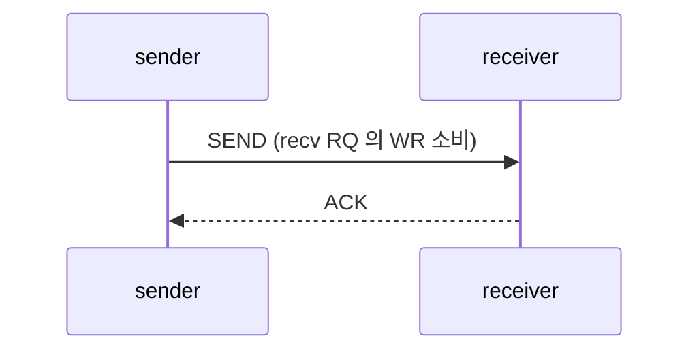
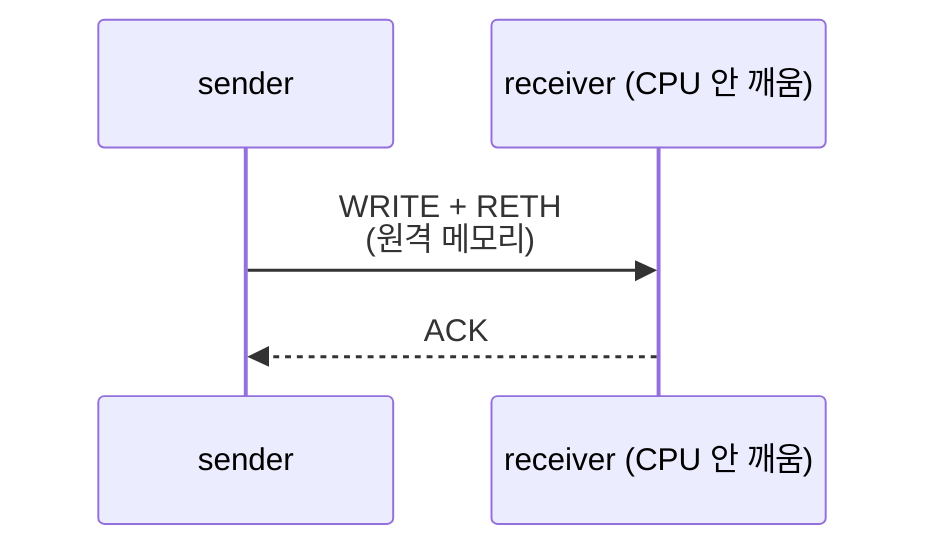
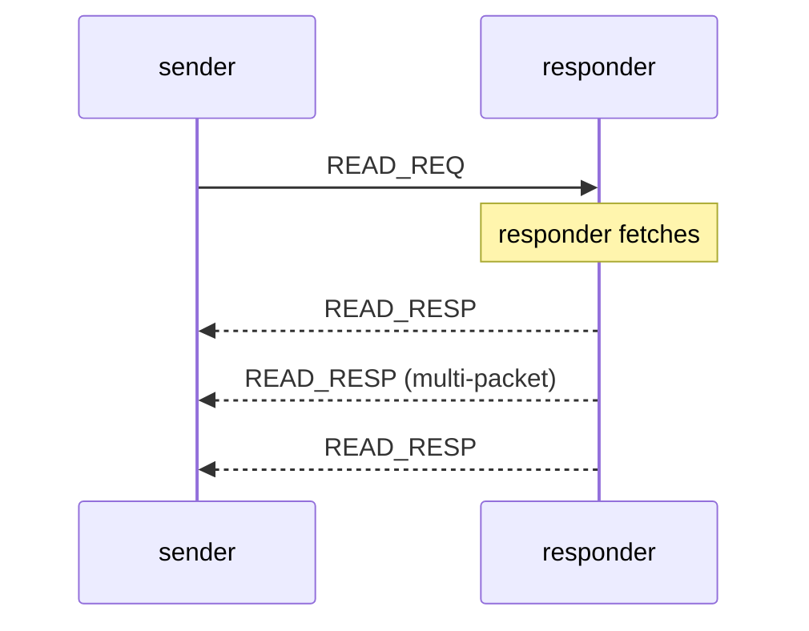
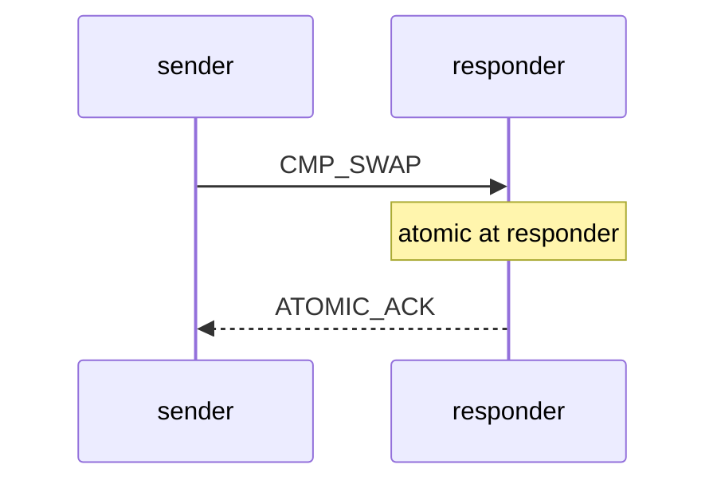
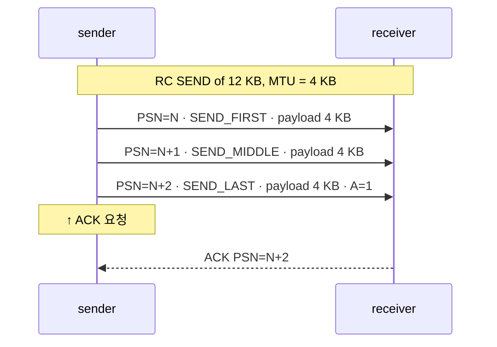
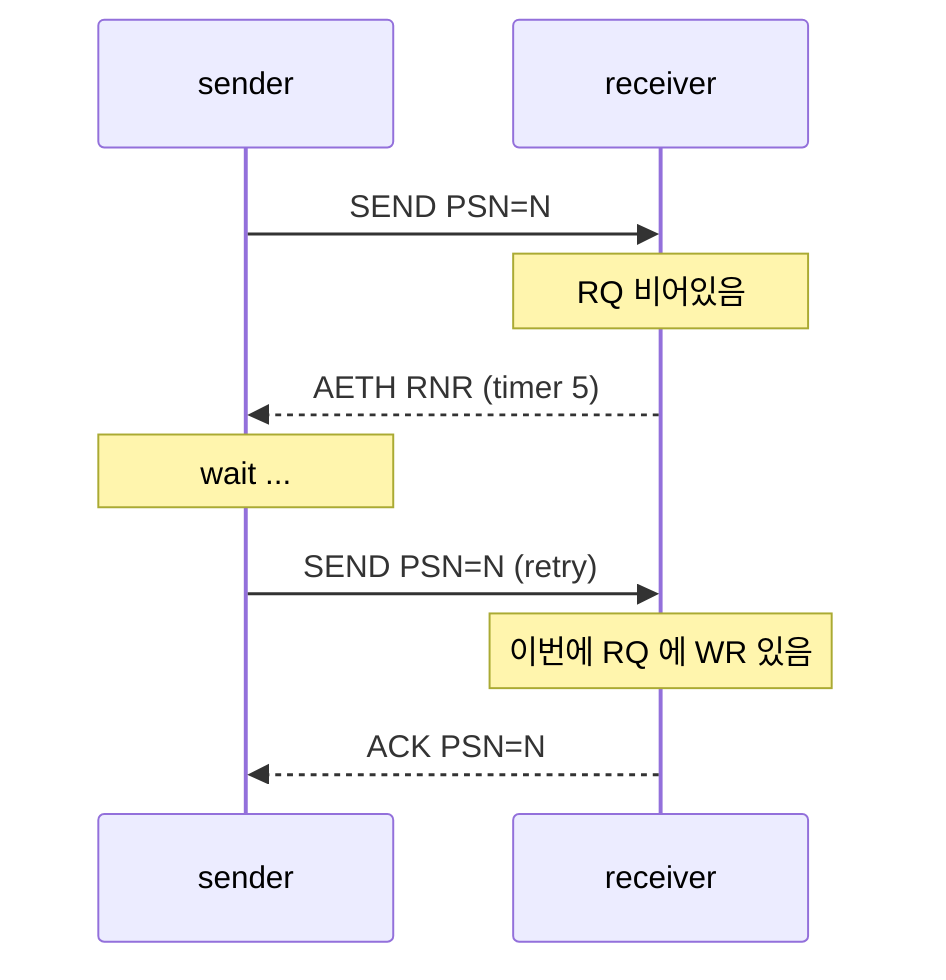
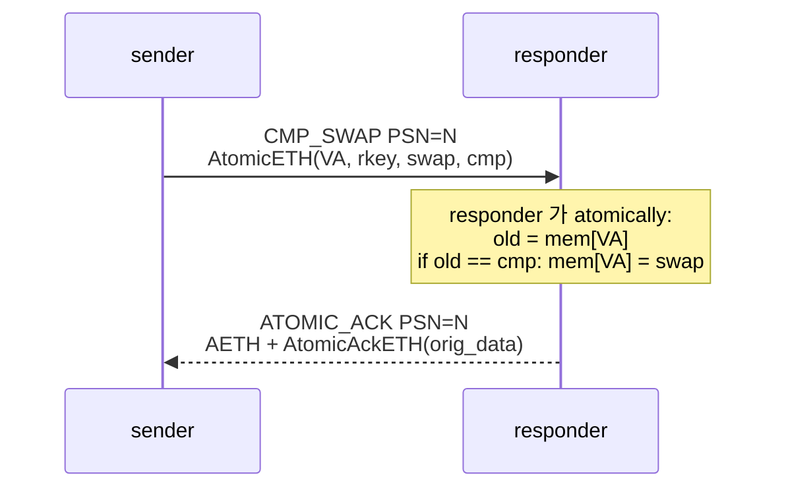

# Module 06 — Data Path Operations

<!-- DV-SKOOL-CH-CTX:start -->
<div class="chapter-context" data-cat="network">
  <a class="chapter-back" href="../">
    <span class="chapter-back-arrow">←</span>
    <span class="chapter-back-icon">⚡</span>
    <span class="chapter-back-text">RDMA</span>
  </a>
  <span class="chapter-divider">›</span>
  <span class="chapter-marker">Module 06</span>
</div>
<!-- DV-SKOOL-CH-CTX:end -->

<!-- DV-SKOOL-CH-TOC:start -->
<div class="page-toc">
  <span class="page-toc-label">목차</span>
  <a class="page-toc-link" href="#1-why-care-이-모듈이-왜-필요한가">1. Why care?</a>
  <a class="page-toc-link" href="#2-intuition-비유와-한-장-그림">2. Intuition</a>
  <a class="page-toc-link" href="#3-작은-예-rc-write-8-kb-mtu-4-kb-시간축-추적">3. 작은 예 — 8 KB WRITE 시간축</a>
  <a class="page-toc-link" href="#4-일반화-opcode-multi-packet-psn-window">4. 일반화</a>
  <a class="page-toc-link" href="#5-디테일-opcode-카탈로그-aeth-rnr-read-atomic-ordering-confluence-보강">5. 디테일</a>
  <a class="page-toc-link" href="#6-흔한-오해-와-dv-디버그-체크리스트">6. 흔한 오해 + 디버그 체크리스트</a>
  <a class="page-toc-link" href="#7-핵심-정리-key-takeaways">7. 핵심 정리</a>
</div>
<!-- DV-SKOOL-CH-TOC:end -->

!!! objective "학습 목표"
    이 모듈을 마치면:

    - **List** RC service 의 주요 OpCode (SEND/WRITE/READ/ATOMIC) 와 multi-packet 변형 (FIRST/MIDDLE/LAST/ONLY).
    - **Trace** RDMA WRITE 8 KB (multi-packet) 의 packet sequence + PSN + ACK 흐름을 시간축으로 추적한다.
    - **Compute** 24-bit PSN 의 wrap-around 와 receiver expected PSN window (2^23) 가정에서 valid/invalid PSN 을 판정한다.
    - **Apply** AETH syndrome (ACK / RNR / Sequence Error / Invalid Request) 을 시나리오에 매핑한다.

!!! info "사전 지식"
    - Module 02 (BTH OpCode 인코딩)
    - Module 04 (RC service, PSN 24-bit)
    - Module 05 (RETH 의 rkey/remote_va)

---

## 1. Why care? — 이 모듈이 왜 필요한가

**Data path 가 RDMA 검증의 비중상 80%** 입니다. Connection setup 은 한 번이지만 data path 는 시뮬레이션 매 cycle 마다 동작 — 모든 PSN 산정, OpCode, ACK 발생, retry 행동을 정확히 모델링해야 scoreboard 가 거짓 보고를 안 합니다.

또한 디버그 시 만나는 거의 모든 fail 의 정확한 진단은 "어떤 PSN 의 어떤 OpCode 패킷이 어떤 syndrome 으로 NAK 됐는가" 의 형식 — 이 모듈이 그 어휘를 잡아줍니다.

---

## 2. Intuition — 비유와 한 장 그림

!!! tip "💡 한 줄 비유 — Multi-packet RDMA WRITE ≈ 여러 페이지로 나눠 보내는 팩스"
    첫 장 (FIRST) 에 표지(=RETH: 어디로 보내라 + 보호 코드) 를 붙이고, 중간 장 (MIDDLE) 은 페이지 번호 (PSN) 만, 마지막 장 (LAST) 에 "확인 응답 부탁" (A=1) 을 표시. 받는 쪽은 PSN 으로 누락 검출, 마지막에 ACK 한 번.

### 한 장 그림 — Data path 의 4 transaction 패턴

**① SEND (two-sided)** — sender → recv WQE 소비, RECV CQE + SEND CQE 둘 다



**② RDMA WRITE (one-sided)** — sender → 원격 메모리 직접 write, SEND CQE 만 (recv 측 CPU 안 깨움)



**③ RDMA READ (one-sided, 양방향)** — sender 가 원격에서 읽어옴



**④ ATOMIC (one-sided, 8B 단위)** — sender 가 원격에서 atomic 연산



### 왜 이렇게 설계했는가 — Design rationale

OpCode 가 25+ 개나 있는 이유는 두 축의 직교 곱: **(SEND / WRITE / READ / ATOMIC) × (ONLY / FIRST / MIDDLE / LAST / + IMM 변형)**. 각 축은 다른 요구를 충족:

- **transaction 종류 (SEND vs WRITE vs READ vs ATOMIC)**: receiver 의 CPU 개입 정도와 양방향 여부.
- **fragmentation 변형 (ONLY/FIRST/MIDDLE/LAST)**: MTU 보다 큰 message 처리. RETH 같은 메타데이터를 첫 패킷에만 두면 대역폭 절약.
- **\_w_IMM/\_w_INV 변형**: 채널 외 신호 (immediate data) 또는 R_Key invalidate 운반.

PSN window 가 2^23 (24-bit 의 절반) 인 이유: modulo 산술에서 "이전/이후" 를 명확히 구분하려면 절반만 써야 함. wrap 후의 PSN 비교가 ambiguous 해지지 않게.

---

## 3. 작은 예 — RC WRITE 8 KB, MTU 4 KB 시간축 추적

A → B 로 8 KB RDMA WRITE. MTU = 4 KB 라 2 packet 으로 나뉨.

```
   t0:  A 의 user code: ibv_post_send(WRITE, 8 KB, lkey=Lk, remote_va=Va, rkey=Rk)
   t1:  A 의 HCA 가 sg_list 의 lkey 검증, MR access flag 검증
   t2:  A 의 HCA 가 첫 4 KB DMA read (from local buf)
   t3:  Wire ──▶  PSN=100  WRITE_FIRST  RETH(va=Va, rkey=Rk, dmalen=8192)  payload[0..4KB]
   t4:  A 의 HCA 가 두 번째 4 KB DMA read
   t5:  Wire ──▶  PSN=101  WRITE_LAST                                       payload[4KB..8KB]  A=1
   t6:  B 의 HCA 가 packet 1 받음:
            - PSN=100, ePSN=100 → 정상
            - RETH 의 rkey/access/PD/range 5-step 검증 통과
            - DMA write payload[0..4KB] to PA(Va..Va+4KB)
            - ePSN += 1 → 101
   t7:  B 의 HCA 가 packet 2 받음:
            - PSN=101 = ePSN → 정상
            - RETH 없음 (LAST) — 이전 RETH 의 base + offset 으로 PA 결정
            - DMA write payload[4KB..8KB] to PA(Va+4KB..Va+8KB)
            - A=1 이므로 ACK 생성
            - ePSN += 1 → 102
   t8:  Wire ◀──  PSN=101  ACKNOWLEDGE  AETH(syndrome=ACK, MSN+=1)
   t9:  A 의 HCA 가 ACK 받음:
            - ACK PSN=101 ≥ outstanding WQE 의 last_psn=101 → 완료
            - SQ 에서 WQE retire
            - CQ 에 WC{status=SUCCESS, opcode=WRITE, byte_len=8192} push
   t10: A 의 user code: ibv_poll_cq() 가 WC 회수 → 사용자에게 완료 통지
```

### 만약 packet 1 이 drop 됐다면 (retry 시나리오)

```
   t6':  B 가 packet 2 (PSN=101) 를 먼저 받음 (out-of-order)
            - PSN=101 ≠ ePSN(=100) → 미래 영역 → drop + NAK Seq Err (또는 silent drop)
   t7':  Wire ◀──  PSN=100  ACKNOWLEDGE  AETH(syndrome=NAK Seq Err)
   t8':  A 가 NAK 받음 → Go-Back-N: PSN=100 부터 재전송
   t9':  Wire ──▶  PSN=100  WRITE_FIRST + RETH ...  (재전송)
   t10': Wire ──▶  PSN=101  WRITE_LAST              (재전송)
   ... 정상 ACK
```

### 단계별 의미

| Step | 의미 |
|---|---|
| t0~t1 | sender side 검증은 lkey 만 — rkey 는 receiver 에서 |
| t2~t5 | RETH 는 FIRST 에만, LAST 는 PSN 만 — 나머지 메타데이터 절약 |
| t6 | receiver 의 5-step 검증 (M05) 이 패킷마다 동작. 통과 후 DMA write |
| t7 | LAST 는 RETH 없지만 base+offset 으로 PA 산출. A=1 → ACK 생성 |
| t8~t9 | ACK 의 PSN 이 sender 의 outstanding WQE 와 매칭되면 retire |
| t10 | poll_cq 으로 user 가 회수. **B 의 CPU 는 한 번도 안 깨워졌음** |

!!! note "여기서 잡아야 할 두 가지"
    **(1) RETH 의 위치 규칙** — FIRST/ONLY 에만, MIDDLE/LAST 에는 없음. base+offset 으로 PA 추적이 작동하려면 receiver 가 첫 packet 의 RETH 를 기억해야 함. 검증 시 "MIDDLE 에 RETH 가 잘못 들어있음" 은 false positive 의 흔한 원인.<br>
    **(2) PSN 의 modulo 비교** — `PSN > ePSN` 같은 단순 비교는 wrap 시 깨짐. 항상 `(PSN - ePSN) mod 2^24` 가 [0, 2^23) 인지 [2^23, 2^24) 인지로 판정.

---

## 4. 일반화 — OpCode + Multi-packet + PSN window

### 4.1 OpCode 인코딩의 일반 규칙

```
   OpCode 8-bit = (service-type 3-bit) | (operation 5-bit)
                          ↑                      ↑
              000=RC, 001=UC, 010=UD,    fragmentation + 종류
              101=XRC                    예: 00000=SEND_FIRST,
                                              00100=SEND_ONLY,
                                              00110=WRITE_FIRST, ...
```

### 4.2 Multi-packet message 의 일관성



| 일관성 | Spec 근거 |
|--------|----------|
| RETH 는 RDMA_WRITE_FIRST / RDMA_WRITE_ONLY 에만 존재 | C9-... |
| 같은 message 내 모든 packet 의 PSN 은 단조 +1 | C9-... |
| 각 packet 의 byte length ≤ MTU | C9-..., R-074 |
| FIRST/MIDDLE/LAST 의 sequencing 위반 시 NAK Inv Req | R-218~ |
| RDMA WRITE LAST 의 length 가 RETH 의 selected total length 와 일치 | C9-... |
| ATOMIC 은 single packet (8 byte payload) 으로만 | spec |

### 4.3 PSN 24-bit 와 Window 모델

```
   PSN 공간 = 0 ~ 2^24-1 = 16777215
   Window = 2^23 = 8388608 (절반)

   sender 측 ePSN (expected next to send)
   receiver 측 ePSN (expected next to receive)

   Receiver 가 packet 받으면:
     - PSN == ePSN          → 정상, ePSN += 1, ACK 가능
     - PSN ∈ [ePSN-2^23, ePSN-1]   → 중복(이미 처리), ACK PSN 다시 보내기
     - PSN ∈ [ePSN+1, ePSN+2^23-1] → 미래(out-of-order), drop or NAK Seq Err
     - 나머지                       → 매우 오래된 / 잘못된 — discard
```

```
                ─────── 2^24 modulo arithmetic ───────
   ePSN-2^23           ePSN (next expected)        ePSN+2^23-1
        │                  │                              │
        ◀── 중복 영역 ─────│────── 미래 영역 ─────────────▶
                            ▲
                       정확히 이 값만 정상
```

- **2^23 가 한쪽에 8 M packet/4 KB MTU = 32 GB 전송분** — 정상 deployment 에서 wrap 까지 도달하기 충분히 김.
- **PSN init** 은 random (보안상). RTR 진입 시 dest_qp 의 init PSN 을 양 끝에서 modify QP 로 합의.

!!! quote "Spec 인용"
    "The PSN window for a given QP shall be 2^23." — IB Spec 1.7, §9.7.2 (R-198)

---

## 5. 디테일 — OpCode 카탈로그, AETH, RNR, READ, ATOMIC, Ordering, Confluence 보강

### 5.1 RC OpCode 카탈로그

BTH OpCode 8-bit = 상위 3-bit (service type) + 하위 5-bit (operation). RC service 의 상위 3-bit = `000`.

| OpCode (RC) | 값 | 설명 | xTH |
|-------------|----|------|-----|
| SEND_FIRST | 0x00 | Multi-packet SEND 첫 패킷 | — |
| SEND_MIDDLE | 0x01 | 중간 패킷 | — |
| SEND_LAST | 0x02 | 마지막 (no IMM) | — |
| SEND_LAST_w_IMM | 0x03 | 마지막 + Immediate Data | ImmDt |
| SEND_ONLY | 0x04 | 단일 패킷 SEND | — |
| SEND_ONLY_w_IMM | 0x05 | 단일 + IMM | ImmDt |
| RDMA_WRITE_FIRST | 0x06 | RDMA WRITE 첫 패킷 (RETH 포함) | RETH |
| RDMA_WRITE_MIDDLE | 0x07 | 중간 | — |
| RDMA_WRITE_LAST | 0x08 | 마지막 | — |
| RDMA_WRITE_LAST_w_IMM | 0x09 | 마지막 + IMM | ImmDt |
| RDMA_WRITE_ONLY | 0x0A | 단일 (RETH 포함) | RETH |
| RDMA_WRITE_ONLY_w_IMM | 0x0B | 단일 + IMM | RETH + ImmDt |
| RDMA_READ_REQUEST | 0x0C | READ 요청 (1 패킷) | RETH |
| RDMA_READ_RESPONSE_FIRST | 0x0D | READ 응답 첫 패킷 | AETH |
| RDMA_READ_RESPONSE_MIDDLE | 0x0E | 중간 응답 | — |
| RDMA_READ_RESPONSE_LAST | 0x0F | 마지막 응답 | AETH |
| RDMA_READ_RESPONSE_ONLY | 0x10 | 단일 응답 | AETH |
| ACKNOWLEDGE | 0x11 | ACK / NAK | AETH |
| ATOMIC_ACKNOWLEDGE | 0x12 | Atomic 응답 | AETH + AtomicAckETH |
| CMP_SWAP | 0x13 | Compare and Swap | AtomicETH |
| FETCH_ADD | 0x14 | Fetch and Add | AtomicETH |
| SEND_LAST_w_INV | 0x16 | Send + Invalidate | IETH |
| SEND_ONLY_w_INV | 0x17 | Single Send + Inv | IETH |

(UC/UD 는 다른 prefix; XRC 는 또 다른 prefix. 여기서는 RC 만 다룸)

!!! note "Why _w_IMM, _w_INV?"
    - **IMM (Immediate Data)** 4-byte: receiver 의 RECV WR 에 함께 전달되어 user payload 외 별도 channel 신호. RECV CQE 에 보임.
    - **INV (Invalidate)** : SEND 가 도착하면 receiver 의 특정 R_Key 를 invalidate. one-side RDMA 후 invalidate 전송 패턴.

### 5.2 ACK / NAK / AETH

#### AETH (4 byte)

```
 Byte 0:  Syndrome (8 bit)
 Byte 1-3: Message Sequence Number (MSN, 24 bit)
```

**Syndrome 인코딩**:

| Syndrome | 의미 |
|---------|------|
| `0_xxxxxxx` (top bit 0) | ACK — credit count 가 하위 5-bit |
| `01100000` (0x60) | RNR NAK — Receiver Not Ready |
| `01100001 ~ 01111111` | (RNR timer values 인코딩) |
| `10000000` (0x80) | NAK PSN Sequence Error |
| `10000001` (0x81) | NAK Invalid Request |
| `10000010` (0x82) | NAK Remote Access Error |
| `10000011` (0x83) | NAK Remote Operational Error |
| `10000100` (0x84) | NAK Invalid R-Key (RNR variant 으로 호환) |

→ 사용자 표현은 보통 `IBV_WC_*` (e.g., `IBV_WC_REM_ACCESS_ERR`) 로 매핑.

#### ACK Coalescing

매 패킷마다 ACK 보내면 비효율 → 일정 packet 마다 한 번 (`A` bit 가 켜진 패킷에서). 마지막 packet (`*_LAST`/`*_ONLY`) 은 보통 A=1.

```
   Pkt N    A=0
   Pkt N+1  A=0
   Pkt N+2  A=0
   Pkt N+3  A=1   ← 여기에 ACK 발생, PSN=N+3 한 번에 ack (coalesced)
```

→ 검증 시 sender 가 A=1 보낸 후 timeout 안에 ACK 못 받으면 retry.

#### Retry Timer

```
   timeout = 4.096 us × 2^retry_timer
   (retry_timer 4-bit, 0..14, 15 reserved)
```

`retry_timer = 14` ≈ 0.5 sec.<br>
`retry_cnt` 는 별도 (몇 번 retry 시도). 초과 시 **`IBV_WC_RETRY_EXC_ERR`** + QP → Err.

!!! quote "Spec 인용"
    "The local ACK timeout value shall be 4.096 × 2^Local ACK Timeout microseconds." — IB Spec 1.7, §9.7.5

### 5.3 RNR — Receiver Not Ready

RC SEND 가 도착했는데 receiver 의 RQ 에 사용가능한 RECV WR 이 없으면:

- responder 가 **RNR NAK** (syndrome 0x60..0x7F) 보냄, syndrome 의 하위 비트가 sender 가 기다려야 할 시간
- sender 는 RNR 만큼 기다린 뒤 retransmit
- `rnr_retry` 횟수 (0..7, 7 = infinite) 초과 시 QP → Err + `IBV_WC_RNR_RETRY_EXC_ERR`



→ **WRITE/READ 는 RNR 안 일어남** (RECV WR 필요 없음).

### 5.4 RDMA READ — 양방향 흐름

```mermaid
sequenceDiagram
    participant Q as requester
    participant P as responder
    Note over Q: Post WR: RDMA_READ_REQUEST
    Q->>P: PSN=N · READ_REQUEST<br/>RETH(remote_va, len, rkey)
    Note over P: rkey 검증, IOVA 변환,<br/>local memory 읽기<br/>len &gt; MTU 면 multi-packet 응답 생성
    P-->>Q: PSN=N · READ_RESP_FIRST<br/>AETH(ACK) + payload
    P-->>Q: PSN=N+1 · READ_RESP_MIDDLE<br/>+ payload
    P-->>Q: PSN=N+2 · READ_RESP_LAST<br/>AETH(ACK) + payload
    Note over Q: 모든 응답 받으면 WC 생성
```

#### 핵심 attribute

- **`max_rd_atomic`** (sender side) : 동시 outstanding READ/ATOMIC 갯수
- **`max_dest_rd_atomic`** (responder side) : 동시 처리 가능한 RDMA READ/ATOMIC depth
- 두 값의 mismatch 가 자주 검증되는 corner.

#### Read 의 PSN 사용 규칙

- READ Request packet: PSN = N
- READ Response packets: 동일하게 PSN = N, N+1, N+2 ... (응답이 PSN 영역을 차지)
- 즉 READ 1번이 response 길이 만큼 PSN 을 소비.

### 5.5 ATOMIC — CMP_SWAP, FETCH_ADD

```
   AtomicETH (28 byte):
     virtual address (8B)  ← 8-byte aligned target
     R_Key             (4B)
     swap_data (or add)(8B)
     compare_data      (8B)
```



#### 일관성

- ATOMIC 은 항상 single packet (payload 8B).
- Multiple ATOMIC 동시 처리는 `max_dest_rd_atomic` 에 포함.
- ATOMIC vs ordinary RDMA WRITE 는 ordering 규칙이 다름 (spec §9.6.5).

### 5.6 Ordering Rules — Transaction Ordering

IB spec §9.6 에는 transaction ordering 의 정밀한 규칙이 있음. 핵심:

| 규칙 | 내용 |
|------|------|
| Same-QP same-stream 의 packet 은 in-order | RC/UC/UD 모두 |
| RDMA WRITE 의 byte order 는 정의됨 (LSB → MSB?) | spec 의 word ordering 그림 |
| ATOMIC 은 별도 ordering category — 다른 ATOMIC, RDMA READ 와의 순서 관계 | §9.6.5 |
| RDMA READ Response 의 도착 순서 | sender 의 send 순서와 같지 않을 수 있음, but PSN 으로 정렬 |
| Fence 옵션 | WR 에 `IBV_SEND_FENCE` 주면 이 WR 이전의 모든 RDMA READ/ATOMIC 가 완료된 후 발신 |

검증 관점: **scoreboard 가 spec 의 ordering 모델을 정확히 알아야 false positive 없음**. RDMA-TB 의 `vrdma_data_scoreboard` 가 이를 처리.

### 5.7 Data Path Timing 상세 (참고)

```
   t0:  sender post WR (8 KB SEND, A=1 on last)
   t1:  sender HCA 가 sg_list lkey 검증
   t2:  sender HCA 가 packet 1 fetch (4KB)
   t3:  Packet on wire: PSN=100 SEND_FIRST
   t4:  Packet on wire: PSN=101 SEND_LAST   A=1
   t5:  Receiver HCA 가 packet 1 받음, RQ 에서 RECV WR fetch
   t6:  IOVA→PA 변환, DMA write 4 KB
   t7:  Receiver HCA 가 packet 2 받음 (PSN=101)
   t8:  나머지 4 KB DMA write
   t9:  Receiver HCA 가 ACK PSN=101 + RECV CQE 생성
   t10: Sender HCA 가 ACK 받음, SQ 에서 WR retire, SEND CQE 생성
```

→ RDMA-TB 의 cycle-accurate sim 에서는 t1~t10 의 순서/지연이 모두 정해진 spec 또는 design 의 promise. scoreboard 는 이 시퀀스가 깨지면 fail.

### 5.8 Confluence 보강 — PSN handling 의 정밀 동작

!!! note "Internal (Confluence: PSN handling & retransmission of RDMA, id=32211061)"
    **Go-Back-N 기반 retransmission**. 각 QP 에는 두 개의 독립 PSN 공간 (sq_psn, rq_psn) 이 있고, requester / responder 의 PSN 은 서로 무관.

    1. **PSN sequence error (NAK)** — responder 가 incoming PSN > ePSN 검출 시 즉시 NAK 발행. requester 는 NAK 의 syndrome 으로 이를 식별 후 missing PSN 부터 재전송 (Go-Back-N).
    2. **Implied NAK** — requester 가 expected PSN 보다 큰 ACK PSN 을 받으면, 그 사이 응답 안 온 PSN 들을 **암시적으로 ACK** 처리. 별도 NAK 없이 진행.
    3. **Duplicate request (timer 만료 시 재전송)** — responder 는 단순히 캐시된 ACK 재전송. **MSN 비증가** (M02 §12 참조). RDMA READ 만 예외 — duplicate read 는 read response cache 를 retain 해두고 재 전송.
    4. **RNR NAK** — responder 의 RECV WQE 가 없을 때. requester 는 `min_rnr_timer` 만큼 대기 후 재전송. RNR retry 도 `rnr_retry` 카운터로 제한.
    5. **Retry timer** — `local_ack_timeout = 4.096 µs × 2^attr.timeout` (IBTA §11.6.2). 만료 시 timer-driven retransmission.
    6. **Retry count exceeded** → **unrecoverable**, QP → Err.

    !!! tip "검증 포인트"
        - PSN wrap (24-bit, 16 M packet) 후에도 정상 동작하는 long-running 시나리오.
        - ACK coalescing 으로 N 패킷이 한 번에 ACK 될 때 implied NAK 와 정상 ACK 의 경계.
        - RNR retry 와 일반 retry 가 별도 카운터를 가짐 — 한쪽 exhaust 시 다른 쪽도 reset 되는지 spec 정확히 확인.

### 5.9 Confluence 보강 — One-sided / Two-sided 의 검증 차이

!!! note "Internal (Confluence: RDMA one-sided / two-sided operation, id=32178286 / 32178307)"
    | 분류 | Verb | Receiver CPU 개입 | Receiver RECV WQE 소모 | Immediate 가능 |
    |---|---|---|---|---|
    | One-sided | RDMA READ | X | X | X |
    | One-sided | RDMA WRITE | X | X | X |
    | One-sided + 2-sided 변형 | **RDMA WRITE with Immediate** | O (CQE 생성) | **O** | O (4 byte) |
    | Two-sided | SEND | O | O | X |
    | Two-sided | SEND with Immediate | O | O | O (4 byte) |
    | Two-sided | SEND with Invalidate | O | O | (R_Key 운반) |

    검증 핵심: **WRITE_WITH_IMM 은 one-sided 의 외형이지만 receiver RECV WQE 를 소모** 한다. RECV 부족 시 RNR. scoreboard 가 이를 단순 WRITE 처럼 처리하면 RNR injection 시 false fail.

### 5.10 Confluence 보강 — CQE 의 PSN-related 필드 (DV spec)

!!! note "Internal (Confluence: About PSN-related fields of CQE (DV spec delivery), id=1330839982)"
    사내 RDMA-IP 의 CQE (`mb_cqe`, 512-bit) 에는 spec 외 **debug-friendly PSN 필드** 가 추가되어 있다.

    - `last_completed_psn` — 이 WQE 가 완료된 시점의 ACK PSN.
    - `error_psn` — 실패 시 NAK / timeout 직전의 PSN.
    - `retry_count_observed` — 이 WQE 처리 중 발생한 retry 횟수 (debug only).

    검증·로그 분석 시 이 필드를 이용해 retry 발생 위치를 PSN 정확도로 특정할 수 있다.

### 5.11 Confluence 보강 — SACK (Selective ACK) 와 Out-of-Order

!!! note "Internal (Confluence: An_Out-of-Order_Packet_Processing_Algorithm_of_RoCE_Based_on_Improved_SACK, id=42599274)"
    표준 RC 는 strict in-order 만 허용 → 한 패킷 손실로 전체 window 재전송이 필요. SACK 확장은 **수신측이 받은 PSN 비트맵** 을 응답 패킷에 실어 송신측이 missing PSN 만 선택적으로 재전송하게 한다.

    - 사내 RDMA-IP 의 `m_sack_info` (152-bit) 는 selective ack vector 를 requester 측 completer 에 전달.
    - 검증: 일부 패킷 drop 후 SACK info 의 비트맵이 정확히 missing PSN 만 표시하는지, requester 가 정확한 패킷만 재발신하는지.

---

## 6. 흔한 오해 와 DV 디버그 체크리스트

### 흔한 오해

!!! danger "❓ 오해 1 — 'RDMA READ 는 1 packet 으로 된다'"
    **실제**: READ Request 는 1 packet (BTH + RETH) 이지만, READ Response 는 길이 > MTU 면 multi-packet — `RD_RESP_FIRST/MIDDLE/LAST/ONLY` 4 변형. 또한 multi-outstanding READ 가 있으므로 (depth) 검증 시 `max_rd_atomic` (sender) ↔ `max_dest_rd_atomic` (responder) 의 일치 여부도 봐야 함.<br>
    **왜 헷갈리는가**: SEND/WRITE 는 sender → receiver 단방향이지만 READ 는 양방향이라 모델링이 두 배.

!!! danger "❓ 오해 2 — 'PSN > ePSN 이면 미래'"
    **실제**: PSN 은 24-bit modulo. 단순 `>` 비교는 wrap 후 깨짐. 정확한 판정은 `(PSN - ePSN) mod 2^24 < 2^23` 인지로.<br>
    **왜 헷갈리는가**: 평소 wrap 가까이 안 가니 단순 비교가 우연히 맞아 보임.

!!! danger "❓ 오해 3 — 'A=1 인 패킷마다 즉시 ACK 가 와야 한다'"
    **실제**: ACK coalescing 으로 N 패킷이 한 번에 ACK. sender 는 그 ACK 의 PSN ≥ outstanding WQE 의 last_psn 이면 retire. 패킷별 1:1 매핑 아님.<br>
    **왜 헷갈리는가**: TCP 의 ACK 모델과 비슷해 보임.

!!! danger "❓ 오해 4 — 'RNR 은 모든 op 에서 발생'"
    **실제**: RNR 은 RECV WR 을 소비하는 op (SEND, SEND_w_IMM, SEND_w_INV, WRITE_w_IMM) 에서만. WRITE/READ 는 RECV WQE 안 씀 → RNR 없음.<br>
    **왜 헷갈리는가**: "Receiver Not Ready" 가 모든 receive 상황에 적용될 것 같음.

!!! danger "❓ 오해 5 — 'ATOMIC 도 multi-packet 가능'"
    **실제**: ATOMIC 은 항상 single packet, payload 8 byte (CMP_SWAP 의 cmp + swap, FETCH_ADD 의 add). 8-byte align 강제, misalign 시 NAK Inv Req.<br>
    **왜 헷갈리는가**: WRITE/READ 의 multi-packet 패턴에서 일반화.

!!! danger "❓ 오해 6 — 'WRITE_WITH_IMM 은 one-sided 라 receiver CPU 안 깨움'"
    **실제**: WRITE_WITH_IMM 은 RECV WQE 를 소비 + RECV CQE 생성 — 사실상 two-sided 시맨틱. 검증 scoreboard 가 단순 WRITE 처럼 다루면 false fail.<br>
    **왜 헷갈리는가**: 이름이 WRITE.

### DV 디버그 체크리스트

| 증상 | 1차 의심 | 어디 보나 |
|---|---|---|
| `IBV_WC_RETRY_EXC_ERR` | retry timer 짧음 / network slow / receiver 가 ACK 안 보냄 | retry_cnt 와 timeout, receiver 의 ACK 발생 시점 |
| `IBV_WC_RNR_RETRY_EXC_ERR` | SEND 인데 RECV pre-post 부족 | RQ 에 pre-post 된 WR 수 |
| Sequence error NAK 가 sender 에 안 옴 | NAK 패킷이 drop 또는 sender NAK 처리 누락 | wire dump |
| MIDDLE 에 RETH 가 들어옴 | sender 의 fragmentation 로직 버그 | OpCode = WRITE_MIDDLE 인 packet 의 RETH |
| WRITE LAST 의 length 가 RETH dmalen 과 불일치 | sender length 산정 오류 | RETH.dmalen vs sum(packet payloads) |
| ATOMIC 에 8-byte misalign | sender alignment 안 함 | AtomicETH.virtual_address mod 8 |
| READ Response 가 잘 안 옴 | max_dest_rd_atomic = 0 | responder QP attr |
| ACK PSN 이 outstanding WQE 보다 작음 | sender 의 PSN 비교 함수가 modulo 무시 | Go-Back-N 시뮬 후 wrap 직후 PSN 비교 |
| WRITE_WITH_IMM 후 RNR 발생 | scoreboard 가 RECV WQE 소비 안 카운트 | scoreboard 코드 |
| Implicit ACK 인식 실패 | implied NAK vs implied ACK 의 경계 처리 | sender 의 ACK PSN > current outstanding 경우 |

---

## 7. 핵심 정리 (Key Takeaways)

- OpCode 가 모든 transaction 을 정의. RC 만 해도 25개 가량.
- Multi-packet message 는 FIRST/MIDDLE/LAST/ONLY + RETH/AETH 위치 규칙을 따라야 함.
- PSN 24-bit + 2^23 window 가 receiver 의 정상/중복/미래 분류의 기준.
- AETH syndrome 이 ACK/RNR/Seq Err/Inv Req/Access Err 등 모든 transport 에러 신호.
- RDMA READ 는 양방향 multi-packet, ATOMIC 은 always single + 별도 ordering.
- Ordering rule (§9.6) 은 scoreboard 의 핵심 — fence/barrier/atomic 별로 차등 적용.

!!! warning "실무 주의점"
    - "PSN 단조 증가" 는 modulo 2^24 — wrap 시 비교 함수가 modulo-aware 여야 함. 단순 `>` 비교는 버그.
    - RNR retry 와 일반 retry 의 counter 가 분리 — 둘 다 spec 상 별도 attribute.
    - RDMA READ Response 의 첫 패킷에 AETH 가 들어감 (ACK 의 역할 겸용). MIDDLE 에는 AETH 없음 — 이걸 헷갈리면 packet decoder 가 깨짐.
    - ATOMIC 은 8-byte align 강제 — spec 에서 misalign 시 NAK Inv Req. 검증에서 일부러 inject 해 거부되는지 확인.

---

## 다음 모듈

→ [Module 07 — Congestion Control & Error Handling](07_congestion_error.md): retry/RNR 보다 한 단계 위 — DCQCN/PFC/ECN 과 fatal error path.

[퀴즈 풀어보기 →](quiz/06_data_path_quiz.md)


--8<-- "abbreviations.md"
--8<-- "_inc/topic_abbr.md"
