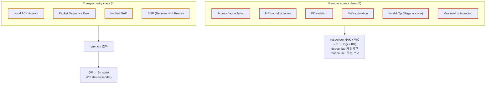
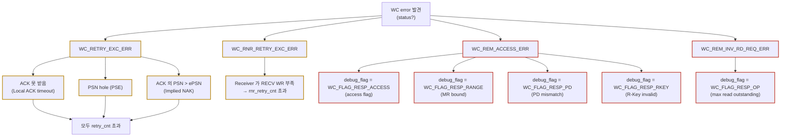
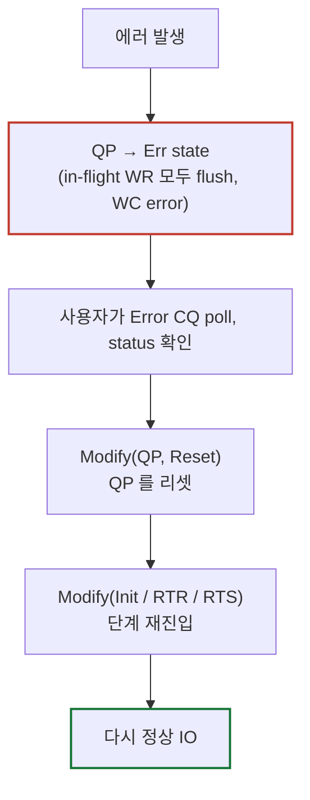

# Module 07 — Congestion Control & Error Handling

<!-- DV-SKOOL-CH-CTX:start -->
<div class="chapter-context" data-cat="network">
  <a class="chapter-back" href="../">
    <span class="chapter-back-arrow">←</span>
    <span class="chapter-back-icon">⚡</span>
    <span class="chapter-back-text">RDMA</span>
  </a>
  <span class="chapter-divider">›</span>
  <span class="chapter-marker">Module 07</span>
</div>
<!-- DV-SKOOL-CH-CTX:end -->

<!-- DV-SKOOL-CH-TOC:start -->
<div class="page-toc">
  <span class="page-toc-label">목차</span>
  <a class="page-toc-link" href="#1-why-care-이-모듈이-왜-필요한가">1. Why care?</a>
  <a class="page-toc-link" href="#2-intuition-비유와-한-장-그림">2. Intuition</a>
  <a class="page-toc-link" href="#3-작은-예-한-rkey-위반이-감지에서-recovery-까지-가는-1-cycle">3. 작은 예 — rkey 위반 1 cycle</a>
  <a class="page-toc-link" href="#4-일반화-cc-3단-구조-error-2-클래스-debug-tree">4. 일반화</a>
  <a class="page-toc-link" href="#5-디테일-pfc-ecn-dcqcn-9-시나리오-coverage-confluence">5. 디테일</a>
  <a class="page-toc-link" href="#6-흔한-오해-와-dv-디버그-체크리스트">6. 흔한 오해 + 디버그 체크리스트</a>
  <a class="page-toc-link" href="#7-핵심-정리-key-takeaways">7. 핵심 정리</a>
</div>
<!-- DV-SKOOL-CH-TOC:end -->

!!! objective "학습 목표"
    이 모듈을 마치면:

    - **Explain** Lossless Ethernet 가 RoCEv2 deployment 에서 왜 필요한지, PFC ↔ ECN ↔ DCQCN 가 어떻게 분담하는지 설명한다.
    - **Trace** Local ACK timeout, Implied NAK, RNR retry, Packet Sequence Error 의 흐름을 sender/receiver 양쪽에서 추적한다.
    - **Trace** R-Key violation 한 건이 검출 → NAK → WC error → Error CQ + IRQ → QP recovery 까지 가는 1 cycle 을 따라간다.
    - **Map** 6 가지 Remote Access Error (Access flag, MR bound, PD, R-Key, Operation, Outstanding read) 를 spec/구현 debug flag 에 매핑한다.
    - **Plan** RDMA-TB `vplan/error_handling/` 의 9 시나리오 (S1~S9) 가 각 error class 를 어떻게 커버하는지 설계 관점에서 평가한다.

!!! info "사전 지식"
    - Module 04 (QP FSM, retry_cnt, rnr_retry)
    - Module 06 (PSN, AETH syndrome, Retry timer)
    - Module 05 (Access flag, R_Key/L_Key, PD)

---

## 1. Why care? — 이 모듈이 왜 필요한가

**RDMA 의 검증 가치는 "행복 경로" 가 아니라 "에러 경로"** 에 있습니다. 정상 packet 만 보내면 어떤 구현이든 어느 정도 동작 — 진짜 차이는 (1) congestion 발생 시 fairness 와 throughput 회복, (2) error 발생 시 정확한 status 보고와 QP recovery 입니다. RDMA-TB 의 `error_handling` vplan 이 9 시나리오로 거의 모든 error path 를 커버하는 이유.

또한 디버그 시: WC status + debug flag 의 조합이 **root cause 를 1 step 으로 식별 가능한 형태** 로 보고되도록 설계됐기 때문에, 이 매핑을 알면 fail 시 진단이 압도적으로 빠릅니다.

---

## 2. Intuition — 비유와 한 장 그림

!!! tip "💡 한 줄 비유 — PFC + ECN + DCQCN ≈ 고속도로 운영 3종 세트"
    - **PFC** = 톨게이트 일시 차단 (당장 막 안 들어오게)
    - **ECN** = "이 구간 막힘" 표지판 (운전자 인식)
    - **DCQCN** = 운전자의 속도 자율 조절 (표지판 보고 점진 감속, 풀리면 점진 가속)

    하나만 쓰면 안 됨 — PFC 만 쓰면 deadlock 위험, ECN 만 쓰면 즉각성 부족, DCQCN 은 ECN 신호가 전제.

### 한 장 그림 — Time scale × 메커니즘 분담

**Time scale × 메커니즘 분담**:

| 메커니즘 | Time scale | 역할 |
|---|---|---|
| **PFC** | Fast (ns) | link-level PAUSE, hop 단위 |
| **ECN** | µs | packet 마킹 (CE bit) |
| **DCQCN** | µs ~ ms | sender rate 점진 감속/회복 |

**Error handling 측면 — 2 클래스**:



### 왜 이렇게 설계했는가 — Design rationale

Congestion 의 3단 layered 이유:

- **PFC 만 쓰면**: deadlock + HOL blocking + PFC storm 위험.
- **ECN 만 쓰면**: 마킹은 hop 마다 가능하지만 전파 늦음 — 잠깐 사이 buffer overflow 가능.
- **DCQCN 만 쓰면**: sender 의 자율 조절은 좋지만 link 가 잠시 정지해야 할 때 즉각성이 부족.

→ 빠른 보호 (PFC) + 정밀 신호 (ECN) + 회복 곡선 (DCQCN) 의 조합으로만 균형.

Error 처리의 두 클래스 분리 이유:

- **Transport retry class** = sender 의 retry 메커니즘으로 _자율 회복 가능_ → spec 이 retry timer + retry_cnt 로 정의.
- **Remote access class** = sender 가 잘못한 게 아니라 _권한 부족_ → retry 해도 의미 없음. 즉시 WC error + Error CQ + IRQ 로 별도 path.

debug flag 가 추가된 이유: spec 의 NAK syndrome 만으로는 root cause 가 모호 (예: "Remote Access Error" 가 access flag 인지 PD 인지 range 인지). debug flag 를 추가해 _구현 친화적인 root cause 신호_ 를 제공.

---

## 3. 작은 예 — 한 R-Key 위반이 감지에서 recovery 까지 가는 1 cycle

QP_A (NODE0) 가 QP_B (NODE1) 의 MR_X 에 RDMA WRITE. 그러나 sender 의 packet 의 RETH.rkey 가 corrupt (TX path 에 inject) 되어 잘못된 값.

```
   t=0    NODE0 user code:
            ibv_post_send(QP_A, WRITE, sg_list, remote_va=Va, rkey=Rk_correct)
   t=1    NODE0 HCA: WQE fetch, lkey 검증 통과, packet 생성
   t=2    NODE0 TX adapter (test injection): RETH.rkey ← Rk_corrupt
   t=3    Wire: BTH(WRITE_ONLY, PSN=N) + RETH(va=Va, rkey=Rk_corrupt, len=L) + payload
   t=4    NODE1 HCA: receive packet, 5-step 검증 시작
            (1) rkey lookup: Rk_corrupt → MR 못 찾음 ✗
            → NAK Remote Access Error
            (Error CQ 에 CQE 생성 + debug_flag = WC_FLAG_RESP_RKEY)
            (IB_EVENT_QP_ACCESS_ERR async event)
            (IRQ raise)
   t=5    Wire: BTH(ACKNOWLEDGE) + AETH(syndrome=NAK Remote Access Error)
   t=6    NODE0 HCA: NAK 받음
            → outstanding WQE 의 status = WC_REM_ACCESS_ERR
            → QP_A → Err state
            → in-flight WR 모두 flush (각각 WC error 생성)
   t=7    NODE0 user code: ibv_poll_cq(send_cq) → WC{status=WC_REM_ACCESS_ERR}
            ── 디버그 시:
            검증 환경의 chkWcErrorStatus(t_seqr, qp_num, REM_ACCESS) 통과 (C1)
   t=8    NODE1 user code: ibv_poll_cq(error_cq) → WC{flag=RESP_RKEY}
            ── 검증의 chkWcErrorDebugFlag, chkIrq 통과 (C3, C4, C5)
   t=9    NODE0 user code: Modify(QP_A, Reset)
   t=10   NODE0 user code: Modify(QP_A, Init → RTR → RTS) — 재진입
   t=11   NODE0 user code: ibv_post_send(QP_A, WRITE, ..., rkey=Rk_correct) 정상 IO
            ── 검증의 C6 (recovery) 통과
```

### 단계별 의미

| Step | 위치 | 의미 |
|---|---|---|
| t=0~1 | NODE0 | sender 측은 lkey 만 검증, rkey 는 원본 그대로 |
| t=2 | inject | TB adapter 가 packet TX path 에서 rkey 한 byte 손상 |
| t=4 | NODE1 HCA | 5-step 검증 (M05) 의 첫 단계 (rkey lookup) 에서 실패. 즉시 NAK + Error CQ + IRQ 의 _3-종 통지_ |
| t=5~6 | sender | NAK 받으면 retry 시도조차 안 함 (retry 해도 의미 없는 access 에러) → 즉시 QP Err |
| t=7~8 | both | C1~C6 의 6 check 가 각 점에서 검증 |
| t=9~11 | NODE0 | recovery: Reset → Init → ... → 정상 IO 재시도. 같은 QP 에서 traffic 가능 |

### 만약 transport retry 클래스 (예: ACK drop) 였다면?

```
   같은 시나리오지만 inject 가 NODE0 RX 에 ACK drop:
   t=4'   NODE1 HCA: 정상 처리, ACK 발신
   t=5'   adapter: ACK drop
   t=6'   NODE0 HCA: retry timer 만료 → 같은 PSN 재전송 (retry 1)
   t=7'   adapter: 또 ACK drop
   ... retry_cnt 까지 반복
   t=N    NODE0 HCA: retry exhausted → WC_RETRY_EXC_ERR + QP Err
   ── 차이: NODE1 의 Error CQ 에는 아무 일도 없음 (정상 처리됨)
```

!!! note "여기서 잡아야 할 두 가지"
    **(1) Remote access class 는 retry 안 함, transport class 는 retry 함** — 같은 "QP Err" 끝맺음이지만 가는 길이 다릅니다. inject 시 어느 path 인지 명확히. <br>
    **(2) debug flag 는 spec 외 사내 확장** — `WC_FLAG_RESP_RKEY/RANGE/PD/ACCESS/OP` 의 5종이 root cause 를 단번에 식별. RDMA-TB 의 이 신호가 디버그 시간을 압도적으로 줄여줍니다.

---

## 4. 일반화 — CC 3단 구조 + Error 2 클래스 + Debug tree

### 4.1 Error 의 두 클래스 (요약)

#### A. Transport / Retry 클래스 — Sender 측 timer 기반

| 에러 | 트리거 | Spec 동작 | WC status |
|------|--------|----------|-----------|
| **Local ACK timeout** | Sender 가 retry timer 안에 ACK/NAK 을 못 받음 | retry_cnt 까지 retransmit | `WC_RETRY_EXC_ERR` |
| **Packet Sequence Error (PSE)** | Responder 가 PSN > ePSN (hole) 봄 → NAK syndrome 0x80 | Sender 가 NAK 의 PSN 부터 retransmit | `WC_RETRY_EXC_ERR` |
| **Implied NAK** | Sender 가 ACK 의 PSN 이 ePSN_send 보다 큼 → 중간 ACK 분실 추정 | Sender 가 누락 부분 retransmit | `WC_RETRY_EXC_ERR` |
| **RNR (Receiver Not Ready)** | RC SEND 시 RQ 에 RECV WR 없음 → RNR NAK | RNR timer 후 retry, rnr_retry 까지 | `WC_RNR_RETRY_EXC_ERR` (별도) |

→ **모두 retry exhaust 시 QP → Err state**, sender 의 send CQ 에 WC error.

#### B. Remote Access 클래스 — Responder 측 검증 fail

| 에러 | 원인 | Sender WC | Responder Error CQ flag |
|------|------|-----------|------------------------|
| **MR Access flag violation** | RDMA WRITE 가 Remote Write 권한 없는 MR 에 도달 | `WC_REM_ACCESS_ERR` | `WC_FLAG_RESP_ACCESS` |
| **MR Bound violation** | (remote_va, len) 가 MR 영역 밖 | `WC_REM_ACCESS_ERR` | `WC_FLAG_RESP_RANGE` |
| **PD violation** | MR 의 PD 와 QP 의 PD 불일치 | `WC_REM_ACCESS_ERR` | `WC_FLAG_RESP_PD` |
| **R-Key violation** | RETH 의 R-Key 가 잘못 / 만료 | `WC_REM_ACCESS_ERR` | `WC_FLAG_RESP_RKEY` |
| **Invalid Request (Op)** | Service type 에 허용 안 된 OpCode (예: UC 에 READ) | `WC_REM_INV_REQ_ERR` | `WC_FLAG_RESP_OP` |
| **Max read outstanding** | Outstanding READ 가 max_dest_rd_atomic 초과 | `WC_REM_INV_RD_REQ_ERR` | `WC_FLAG_RESP_OP` |

→ **Responder 측은 추가로 async event** `IB_EVENT_QP_ACCESS_ERR` 를 Error CQ 에 보고 + IRQ 발생.

(이 분류는 RDMA-TB `vplan/error_handling/VPLAN_error_handling.md` 에 그대로 매핑)

### 4.2 실무 에러 디버그 트리



→ **Debug flag 만 보면 root cause 가 결정** — 검증이 잘 되면 사용자도 single-glance 디버그 가능.

---

## 5. 디테일 — PFC, ECN, DCQCN, 9 시나리오, Coverage, Confluence 보강

### 5.1 PFC (Priority-based Flow Control, IEEE 802.1Qbb)

```
   Switch buffer 가 차오르면 → upstream port 에 PAUSE frame 송신
   PAUSE 는 priority 별 (0..7) 독립
   Pause time 만큼 sender 는 해당 priority 송신 정지
```

- 0..7 priority class (Ethernet PCP / DSCP 매핑).
- RDMA 트래픽은 보통 priority 3 또는 26 (DSCP 26 = AF31).
- "Lossless" priority 만 PFC enable, 나머지는 일반 best-effort.

**위험**: cyclic dependency → PFC storm → deadlock. → **deadlock 회피는 routing 설계 시 deadlock-free path 보장 또는 watchdog** 필요.

### 5.2 ECN (Explicit Congestion Notification, RFC 3168)

```
   IP header 의 ECN field (2 bit):
     00  Non-ECT (Not ECN-Capable)
     01  ECT(1)
     10  ECT(0)
     11  CE  (Congestion Experienced)
```

- Sender 가 ECT 로 표시 → switch 가 buffer 임계 초과 시 CE 로 마킹 (drop 대신).
- Receiver 가 CE 보면 → 그 사실을 sender 에 알려야 함.
- IB 에서는 BTH 의 **FECN bit** 를 receiver 가 다음 packet 에 set 해 sender 가 알게 함.
- 또는 RoCEv2 의 **CNP** (Congestion Notification Packet) 를 receiver 가 sender 에 직접 송신.

### 5.3 DCQCN (Data Center QCN)

CNP/ECN 신호에 따른 **sender 의 rate 조절 알고리즘**:

```
                  RTT
   rate
    ▲                                         _____
    │                                  ____/
    │ initial   ▼CNP                  /
    │ R = R_max  └ rate ÷ 2          / linear increase
    │            ↓                  /
    │          ─────────────________/
    │
    └──────────────────────────────────────────► time
```

- Initial rate = R_max
- CNP 받으면 R *= 0.5 (또는 α 비율)
- CNP 안 받으면 (timer 단위로) R 점진 회복:
  - Fast Recovery → Active Increase → Hyper Increase 단계
- 검증의 핵심은 "fairness" — 두 flow 가 같은 bottleneck 를 share 했을 때 R 분포가 공평한지.

→ 실무에서 DCQCN 의 parameter 튜닝 (α, R_min, recovery time) 이 deployment 별로 다름.

### 5.4 RDMA-TB 의 9 Error Scenarios (S1~S9)

(`/home/jaehyeok.lee/RDMA/RDMA-TB/docs/vplan/error_handling/VPLAN_error_handling.md` 기준)

| ID | 시나리오 | Injection | Expected |
|----|---------|-----------|----------|
| **S1** | Local ACK timeout retry exceed | NODE1 RX 에 packet drop 콜백 | `WC_RETRY_EXC_ERR`, recovery OK |
| **S2** | PSE retry exceed | NODE1 RX 에 PSN 기반 drop | `WC_RETRY_EXC_ERR` |
| **S3** | Implied NAK retry exceed | NODE0 RX 에 ACK drop | `WC_RETRY_EXC_ERR` |
| **S4** | RNR retry exceed | NODE0 RX 에 NAK drop + rnr_retry_exceed_en=1 | `WC_RNR_RETRY_EXC_ERR` (별도 status) |
| **S5** | Remote MR access flag violation | NODE1 의 MR access flag 클리어 | sender `WC_REM_ACCESS_ERR` + responder ErrCQ `WC_FLAG_RESP_ACCESS` |
| **S6** | Remote MR bound violation | NODE0 TX 에 length corrupt | `WC_REM_ACCESS_ERR` + `WC_FLAG_RESP_RANGE` |
| **S7** | Remote PD violation | NODE1 의 MR global key override | `WC_REM_ACCESS_ERR` + `WC_FLAG_RESP_PD` |
| **S8** | Remote R-key violation | NODE0 TX 에 rkey corrupt | `WC_REM_ACCESS_ERR` + `WC_FLAG_RESP_RKEY` |
| **S9** | Max read outstanding violation | NODE1 RX 에 read 중복 inject | `WC_REM_INV_RD_REQ_ERR` + `WC_FLAG_RESP_OP` |

각 시나리오의 검증 흐름:

```
   1) Multi-QP 환경 setup (1 개 QP 가 error inject 대상, 나머지 정상 traffic)
   2) Adapter callback 등록 (drop / corrupt / duplicate)
   3) vrdma_io_err_top_seq 실행
   4) chkWcErrorStatus(t_seqr, qp_num, expected) 검증
   5) (S5~S9) Error CQ poll + chkWcErrorDebugFlag + chkIrq 검증
   6) (S1) QP recovery 검증 — 동일 QP 에 정상 IO 재시도 가능한지
```

→ **검증 항목 (Check ID)** 6 가지 (C1~C6):

| Check | 의미 |
|-------|------|
| C1 | Requester 측 send CQ status 가 expected error |
| C2 | Responder 측 Error CQ 에 IB_EVENT_QP_ACCESS_ERR |
| C3 | Responder 측 debug flag 가 정확히 access/range/PD/rkey/op 중 하나 |
| C4 | Error CQ 에 실제 CQE 가 생성됨 |
| C5 | Error CQ IRQ 가 ERR_IRQ_TIMEOUT_CYCLES 안에 raise |
| C6 | (S1) Error 후 동일 QP 에서 정상 IO 가능 |

### 5.5 Coverage 모델 — 7 항목

(`vrdma_error_handling_cov.svh` 기준)

| Cov | 정의 |
|-----|------|
| COV1 | Send CQ 의 WC status (RETRY_EXC, RNR_RETRY_EXC, REM_ACCESS, REM_INV_RD_REQ, ...) |
| COV2 | Send CQ vs Error CQ 분포 |
| COV3 | Error CQ 의 event type (IB_EVENT_QP_ACCESS_ERR vs other) |
| COV4 | Error 발생 시 outstanding op 의 존재/부재 |
| COV5 | Cross: status × outstanding |
| COV6 | Cross: node × status (요청자 vs 응답자) |
| COV7 | Cross: CQ (send vs err) × status |

→ **모든 시나리오가 hit 해도 cross coverage 가 아직 hole 일 수 있음** — 예: `WC_RNR_RETRY_EXC_ERR × outstanding_exists × NODE1` 이라는 특정 cross. 그래서 **시나리오를 다양한 traffic mix 와 결합해 반복 실행** 하는 것이 closure 전략.

### 5.6 QP Recovery 흐름



`min_rnr_timer`, `retry_cnt`, `timeout` 등 attribute 도 새로 set 가능 — recovery 시 parameter 튜닝의 기회.

### 5.7 Congestion 검증 시나리오

(이 부분은 `error_handling` vplan 외 일반적인 RDMA congestion verification 패턴)

| 시나리오 | 목표 |
|---------|------|
| **Incast** | N → 1 traffic, switch buffer 압박, ECN/CNP 발생 빈도 |
| **All-to-all** | M ↔ M, fairness 검증 |
| **PFC pause time variation** | 짧은/긴 pause 가 throughput 에 미치는 영향 |
| **DCQCN parameter sweep** | α, R_min 변경 후 회복 곡선 분석 |
| **PFC deadlock** | 의도적 cyclic dependency, watchdog 동작 검증 |
| **CNP latency** | 마킹 → CNP → rate adjust 까지 RTT |

이런 시나리오는 시스템 레벨 (board / ip_top) 환경에서 수행, sub-IP 단계에서는 보통 inject-only 모델로 추상화.

### 5.8 Confluence 보강 — PFC 의 정확한 동작과 한계

!!! note "Internal (Confluence: Priority-based Flow Control, id=229998593 + 6 sub-pages)"
    PFC 는 **8 priority class** 마다 독립적인 PAUSE / RESUME 메시지를 link partner 에 보낸다.

    - **Pause Frame (802.1Qbb)**: 64-byte Ethernet control frame. `Pause Quanta` (16-bit) 가 *priority 별 정지 시간* 을 512-bit time 단위로 지정. 0 = resume.
    - **Pause Operation**: 큐 임계치 초과 시 ingress 에서 자동 발생. 큐 길이가 임계치 미만으로 떨어지면 RESUME (=Pause 0).
    - **DiffServ / Traffic Class**: PFC priority 는 **Ethernet PCP** 비트 또는 **DSCP→TC** 매핑으로 결정. RoCEv2 는 보통 DSCP 26 (AF31) → PFC priority 3 같은 deployment-specific mapping.
    - **DELL switch 활성화 (참고)**: `dcb-map`, `priority-flow-control mode on`, `service-policy input <pfc-policy>` 의 3-step. 검증 환경 cabinet 의 운영 가이드에 동일.
    - **Limitation**:
      - PFC storm — cyclic dependency 시 dead-lock.
      - HOL (Head-of-Line) blocking — 같은 priority class 의 다른 flow 전체 정지.
      - Switch-vendor 별 buffer hysteresis 가 다름 → throughput dent 발생 위치가 다름.

### 5.9 Confluence 보강 — Layered CC 의 사내 구성

!!! note "Internal (Confluence: Basic Background, CC in IB Spec, DCQCN in detail, RoCEv2 ECN in detail, Google's CC, HPCC, CORN, Zero-touch RoCE, Programmable CC)"
    사내 RDMA-IP 와 검증 자료에서 다루는 CC 알고리즘 계열:

    | 계열 | 신호 | 대표 알고리즘 | 사내 위치 |
    |---|---|---|---|
    | **L2 immediate** | PFC pause | 802.1Qbb | network env |
    | **L3 implicit** | ECN-CE marking | DCQCN | RDMA-IP CC module |
    | **End-to-end RTT** | RTT 측정 | Swift, RTTCC, ZTR | DCQCN 대안 (programmable) |
    | **In-network telemetry** | INT header | HPCC | research / 비교 |
    | **Cloud-fairness** | per-tenant SLA | CORN | research / 비교 |
    | **Hardware reliable transport** | full offload | Falcon, Nvidia BFD | competitor survey |

    !!! tip "검증 결정 트리"
        1. **PFC 만 활성** → buffer overflow 만 검증. ECN/DCQCN 비활성.
        2. **PFC + ECN** → CNP 발생 빈도 확인. DCQCN α/R_min sweep.
        3. **No-PFC (Lossy mode)** → ZTR 또는 DCQCN-only 로 packet loss 회복 검증 — 사내에서는 향후 UEC 호환 모드.

### 5.10 Confluence 보강 — Error handling 카테고리 매핑

!!! note "Internal (Confluence: Error handling in RDMA, id=152502273)"
    Confluence 페이지의 error class 분류는 RDMA-TB 의 vplan S1~S9 와 다음과 같이 매핑된다.

    | Confluence 분류 | RDMA-TB S/C | 노출 |
    |---|---|---|
    | Local PROT (sg lkey/access) | S1 | requester WC `LOC_PROT_ERR` |
    | Remote ACCESS (rkey/access) | S2 | NAK + requester WC `REM_ACCESS_ERR` |
    | Remote OP (illegal opcode) | S3 | NAK syndrome 0x91, WC `REM_INV_REQ_ERR` |
    | PSN sequence error | S4 | NAK syndrome 0x60 |
    | RNR | S5 | NAK syndrome 0x20 + min_rnr_timer 대기 |
    | Implied NAK | S6 | 별도 NAK 없이 PSN 점프 |
    | Local ACK timeout | S7 | timer 만료 → retry |
    | Retry exceeded | S8 | QP → Err, WC `RETRY_EXC_ERR` |
    | RNR retry exceeded | S9 | QP → Err, WC `RNR_RETRY_EXC_ERR` |

    !!! warning "주의"
        spec 의 syndrome 값은 IB Spec 1.4 vs 1.7 에서 일부 reserved → defined 로 변경됨. M03 §8 참조.

### 5.11 Confluence 보강 — CCMAD 와 Adaptive Routing

!!! note "Internal (Confluence: CCMAD Protocol, id=290127949; How to enable Adaptive Routing for CX, id=397967495)"
    - **CCMAD (Congestion Control MAD)**: SM (Subnet Manager) 가 CC 파라미터 (예: CCT entry, CN_ROUNDS) 를 노드에 분배할 때 사용하는 IB MAD 클래스. RoCEv2 환경에서는 CC controller 가 같은 의미를 NVMe-oF/host SW 로 대체.
    - **Adaptive Routing (CX)**: switch 가 link load 기반으로 **packet 단위 경로 선택**. RC 의 in-order 가정을 깰 수 있어, RDMA-IP 는 SACK + per-path PSN 추적을 같이 켜야 안전. 사내 검증에서는 이를 *AR mode* 라 부르고 별도 시나리오로 둠.

---

## 6. 흔한 오해 와 DV 디버그 체크리스트

### 흔한 오해

!!! danger "❓ 오해 1 — 'Congestion 시 PFC PAUSE 받으면 sender 가 멈추니 packet drop 안 일어난다 → 끝'"
    **실제**: PFC 만 쓰면 **deadlock + head-of-line blocking + PFC storm** 위험. 여러 priority 가 cyclic 의존을 가지면 PAUSE 가 무한 전파 가능. 그래서 PFC 는 fallback, ECN+DCQCN 이 주된 throttle 메커니즘. **검증 시 PFC 만 enabled 한 환경에서 의도적으로 cyclic traffic 을 만들어 deadlock 검출**이 핵심 시나리오.<br>
    **왜 헷갈리는가**: PFC 가 spec 상 "lossless 만든다" 는 표현 때문에 만능으로 보임.

!!! danger "❓ 오해 2 — 'Remote Access Error 는 retry 해서 회복 가능'"
    **실제**: Remote access class 는 retry 없이 **즉시** QP Err. retry 해도 같은 권한 부족이 반복될 뿐. 즉시 recovery 시퀀스 (Reset → Init...) 가 필요.<br>
    **왜 헷갈리는가**: "에러 = retry" 의 일반화.

!!! danger "❓ 오해 3 — 'ACK timeout 과 PSE 와 Implied NAK 는 모두 같은 retry 메커니즘'"
    **실제**: trigger 가 다르고 _누가 먼저 알아채는가_ 가 다릅니다. ACK timeout = sender 의 timer 만료. PSE = responder 의 NAK syndrome. Implied NAK = sender 가 ACK PSN 점프로 추정. 같은 `WC_RETRY_EXC_ERR` 로 끝나지만 _발견 경로_ 검증이 별도.<br>
    **왜 헷갈리는가**: WC status 가 같음.

!!! danger "❓ 오해 4 — 'WRITE/READ 도 RNR 발생 가능'"
    **실제**: RNR 은 RECV WR 을 소비하는 op (SEND, SEND_w_IMM, WRITE_w_IMM) 에서만. WRITE/READ 는 RECV WQE 안 씀.<br>
    **왜 헷갈리는가**: M06 의 같은 오해.

!!! danger "❓ 오해 5 — 'debug flag 도 IB spec 의 일부'"
    **실제**: spec NAK syndrome 만으로는 root cause 가 모호 → **사내 RDMA-IP 의 확장 신호**. 검증 환경에서 매우 유용하지만 spec-portable 코드에서는 가정 금지.<br>
    **왜 헷갈리는가**: 같은 CQE structure 안에 있어 spec 처럼 보임.

!!! danger "❓ 오해 6 — 'DCQCN parameter 는 hard-code 가능'"
    **실제**: vendor 와 deployment 마다 달라서, scoreboard 가 algorithm 가정을 hard-code 하면 다른 algorithm DUT 에 적용 불가. interface 분리 + parameter sweep 으로 검증해야 portable.<br>
    **왜 헷갈리는가**: 한 deployment 에서는 "정답" 처럼 보임.

### DV 디버그 체크리스트

| 증상 | 1차 의심 | 어디 보나 |
|---|---|---|
| `WC_RETRY_EXC_ERR` 후 어떤 path 인지 모름 | ACK drop / PSN hole / Implied NAK 중 하나 | wire dump 의 마지막 ACK PSN, NAK syndrome |
| `WC_REM_ACCESS_ERR` 만 보고 root cause 모름 | debug_flag 미확인 | Error CQ 의 debug_flag 비트 |
| Recovery 시퀀스 후 traffic 안 나감 | QP Reset 안 거친 채 RTR 재진입 시도 | QP state read |
| PFC enable 했는데 deadlock 발생 | cyclic dependency, watchdog 없음 | priority graph + pause duration |
| ECN-CE 마킹했는데 sender rate 변화 없음 | DCQCN 미구현 / CNP 미수신 | CNP 카운터, RTT 측정 |
| Error CQ IRQ 가 안 raise | irq mask / event subscription 누락 | irq_mask register |
| recover 후 첫 traffic 만 silent drop | TLB stale / R_Key epoch 갱신 누락 | TLB log + key_epoch |
| RNR retry 와 일반 retry 카운터 한쪽만 작동 | 둘이 별도임을 모름 | rnr_retry vs retry_cnt attribute |
| Coverage cross hole | scenario × traffic mix 부족 | COV5~7 의 hit map |
| Adaptive Routing mode 에서 PSN out-of-order false fail | scoreboard 의 strict-order 가정 | per-path PSN 추적 + SACK 비트맵 |

---

## 7. 핵심 정리 (Key Takeaways)

- Congestion 은 PFC (즉시) + ECN (신호) + DCQCN (rate control) 의 layered 메커니즘.
- Error 는 transport-retry 클래스 4개 (Local ACK/PSE/Implied/RNR) + remote-access 클래스 6개 (access/range/PD/rkey/op/outstanding-read).
- RDMA-TB `error_handling` vplan 의 S1~S9 가 모두를 커버, C1~C6 check 가 검증 항목.
- WC status + debug flag 의 조합이 **root cause 를 1 step 으로 식별 가능한 형태** 로 보고됨.
- QP recovery 는 Err → Reset → Init → ... 으로 진행, sequence/test 가 이 path 를 명시적으로 trigger.

!!! warning "실무 주의점"
    - "Lossless Ethernet" 가정이 깨지면 (PFC 미지원 switch 가 path 에 끼어들면) RDMA 성능 cliff. 환경 점검이 검증 시작점.
    - PFC storm 을 catch 하려면 **PFC pause duration 의 분포** 를 cov 에 추가해야 함 — 단순 "PFC 발생/안 발생" 으론 부족.
    - DCQCN parameter 는 vendor-specific. RDMA-TB scoreboard 가 algorithm 가정을 hard-code 하면 다른 algorithm DUT 에 적용 불가 — interface 분리 필요.
    - Error CQ 의 IRQ timeout 은 spec 외 deployment-specific. RDMA-TB 의 `ERR_IRQ_TIMEOUT_CYCLES` 가 그 값. 사양 변경 시 같이 조정.
    - Recovery 후 동일 QP 에서 새 traffic 시작 전 cleanup 필요 (in-flight WR 의 잔여 cleanup → 검증).

---

## 다음 모듈

→ [Module 08 — RDMA-TB 검증 환경 & DV 전략](08_rdma_tb_dv.md): 지금까지 본 모든 개념이 RDMA-TB 의 어떤 컴포넌트에서 어떻게 구현되는지.

[퀴즈 풀어보기 →](quiz/07_congestion_error_quiz.md)


--8<-- "abbreviations.md"
--8<-- "_inc/topic_abbr.md"
