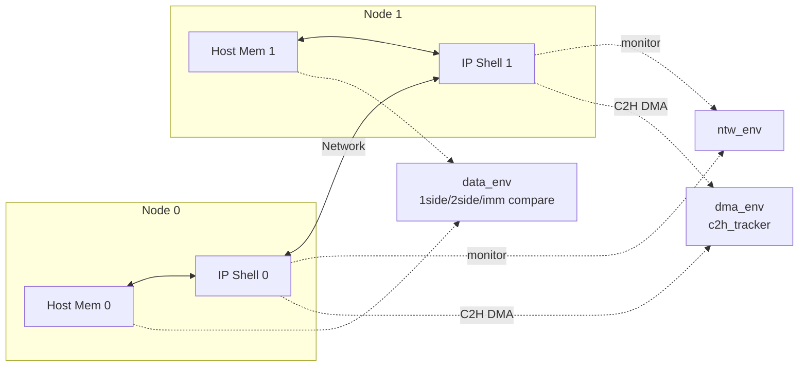

# Module 01 — TB Overview & Multi-Node 구조

<!-- DV-SKOOL-CH-CTX:start -->
<div class="chapter-context" data-cat="network">
  <a class="chapter-back" href="../">
    <span class="chapter-back-arrow">←</span>
    <span class="chapter-back-icon">🧪</span>
    <span class="chapter-back-text">RDMA Verification</span>
  </a>
  <span class="chapter-divider">›</span>
  <span class="chapter-marker">Module 01</span>
</div>
<!-- DV-SKOOL-CH-CTX:end -->

!!! objective "학습 목표"
    이 모듈을 마치면:

    - **Diagram** RDMA-TB 가 두 노드(host) 간 RDMA 트랜잭션을 어떻게 모델링하는지 그릴 수 있다.
    - **Identify** `vrdmatb_top_env` 가 컨테이너로 가지는 sub-env 5종을 식별할 수 있다.
    - **Differentiate** `lib/base` / `lib/ext` / `lib/external` / `lib/submodule` 의 분류 기준을 설명할 수 있다.

## 왜 이 모듈이 중요한가
RDMA 검증은 본질적으로 **두 노드 간 통신**을 검증합니다. 한 노드에서 보낸 데이터가 다른 노드의 메모리에 정확히 도착하는지(1-side write/read, 2-side send/recv) 확인해야 합니다. RDMA-TB 는 이 multi-node 모델을 UVM env 계층으로 구현했고, 모든 컴포넌트가 어느 노드에 속하는지를 명확히 합니다.

## 핵심 개념

### 1. Top env 계층

`lib/base/component/env/` 디렉토리에는 환경 계층의 12개 svh 파일이 있습니다.

```
vrdmatb_top_env.svh        ← 두 노드 + 네트워크 + RAL 통합
├── vrdma_node_env.svh     ← 한 노드의 모든 sub-env (host + ip)
│   ├── vrdma_host_env.svh ← 호스트 측 (메모리, driver 일부)
│   └── vrdma_ipshell_env.svh / vrdma_elc_env.svh ← IP shell / 엣지 logic
├── vrdma_ntw_env.svh      ← 두 노드를 잇는 네트워크
│   └── vrdma_ntw_model_env.svh / vrdma_ntw_sb_env.svh
├── vrdma_data_env.svh     ← 데이터 정합성 검증 (comparator)
├── vrdma_dma_env.svh      ← DMA 트랜잭션 검증 (c2h_tracker)
├── vrdma_lp_env.svh       ← 로컬 패킷 환경
├── vrdma_memory_env.svh   ← 메모리 시뮬레이션
├── vrdma_ral_env.svh / vrdma_mbshell_ral_env.svh ← RAL
```

이 계층의 핵심 원칙은:

- **노드 격리** — `vrdma_node_env` 가 한 노드의 모든 host + ip 컴포넌트를 캡슐화. 노드가 둘이면 `vrdma_node_env` 도 두 인스턴스.
- **횡단 검증 분리** — `data_env` / `dma_env` / `ntw_env` 는 두 노드를 가로지르는 검증으로, 노드와 분리되어 top env 에 직속.

### 2. 노드 간 통신 모델



- **data_env** — 양 노드의 호스트 메모리 영역을 비교(write/read/send/recv 정합성)
- **dma_env** — 각 노드의 IP 가 host 로 발생시키는 C2H DMA 트랜잭션을 추적
- **ntw_env** — 두 노드 사이의 RDMA 패킷(BTH/RETH/AETH/...)을 모니터링

### 3. lib 디렉토리 분류 (Confluence Submodule + 코드 검증)

`/home/jaehyeok.lee/RDMA/RDMA-TB/lib/` 는 4개 layer 로 분리되어 있습니다.

| 디렉토리 | 역할 | 예 |
|---------|------|----|
| `lib/base/` | RDMA IP-top 공통 검증 자산 (config, env, agent, comparator, tracker, sequence) | `lib/base/component/env/` |
| `lib/ext/` | 기능 확장 — congestion control, sva, error_handling 등 옵션 컴포넌트 | `lib/ext/test/error_handling/`, `lib/ext/component/congestion_control/` |
| `lib/external/` | 외부에서 가져온 IP/component (vendor IP, third-party VIP) | `lib/external/vpfc/` |
| `lib/submodule/` | sub-IP 검증 환경 (data_plane, metadata) | `lib/submodule/data_plane/crc/`, `lib/submodule/metadata/mmu/` |

!!! tip "검증 가치 우선순위"
    새 기능을 추가할 때 어느 layer 에 둘지 결정하는 기준:

    1. **모든 RDMA IP 인스턴스에서 공통 필요** → `lib/base/`
    2. **특정 feature flag 가 켜진 경우만** → `lib/ext/`
    3. **외부 IP 의존** → `lib/external/`
    4. **IP 의 한 sub-block 만 검증** → `lib/submodule/`

## 코드 walkthrough

### top env 정의
- `lib/base/component/env/vrdmatb_top_env.svh` — top env 컨테이너
- `lib/base/component/env/vrdma_node_env.svh` — 노드 env
- `lib/base/component/env/vrdma_data_env.svh` (실제 본체는 `data_env/vrdma_data_env.svh`)

### 노드 인스턴스화
TB 는 `cfg.num_nodes` 만큼 `vrdma_node_env` 를 build 단계에서 생성합니다. 두 노드 간 모든 트랜잭션은 노드 ID(`local_node`, `remote_node`)로 태깅되어 흐릅니다. data_env / dma_env 의 comparator/tracker 는 모두 `[node][qp]` 키 형태의 associative array 를 사용합니다.

### 환경 분리의 효과
- 노드 추가가 단순 — `cfg.num_nodes++` 만으로 동일 구조 재인스턴스화
- 횡단 env (`data_env`, `dma_env`) 는 노드 수와 무관하게 항상 1 인스턴스. 모든 노드의 AP 를 구독.

## 실전 예시 — "한 테스트의 컴포넌트 인스턴스 그림"

`rdma_basic_test` 가 `num_nodes=2` 로 실행될 때 인스턴스화되는 컴포넌트 (간략):

```
uvm_test_top (rdma_basic_test)
└── env (vrdmatb_top_env)
    ├── node[0] (vrdma_node_env)
    │   ├── host_env (vrdma_host_env)
    │   ├── ipshell_env (vrdma_ipshell_env)
    │   └── agent (vrdma_agent)
    │       ├── driver (vrdma_driver)
    │       ├── sequencer (vrdma_sequencer)
    │       └── handlers (cq_handler, send/recv/write/read_handler)
    ├── node[1] (vrdma_node_env)
    │   └── ... (동일)
    ├── ntw_env (vrdma_ntw_env)
    │   └── pkt_monitor[0,1] (vrdma_pkt_monitor)
    ├── data_env (vrdma_data_env)
    │   ├── 1side_compare, 2side_compare, imm_compare
    │   └── data_scoreboard, cqe_validation_checker
    ├── dma_env (vrdma_dma_env)
    │   └── c2h_tracker
    └── top_vseqr (vrdma_top_virtual_sequencer)
```

## 핵심 정리 (Key Takeaways)

- RDMA-TB 는 **두 노드 + 네트워크 + 횡단 검증 env(data/dma/ntw)** 의 5-부 구조다.
- 노드 단위 격리(`vrdma_node_env`) + 횡단 검증 단위 분리(`data_env`/`dma_env`)가 핵심 패턴이다.
- `lib/{base,ext,external,submodule}` 4-layer 분류 기준은 "공통 vs 옵션 vs 외부 vs sub-IP"다.
- 모든 횡단 env 는 `[node][qp]` 키로 트랜잭션을 추적한다 — 후속 모듈(M08-M11)에서 이 키가 등장한다.

## 다음 모듈
[Module 02 — Component 계층](02_component_hierarchy.md): `lib/base/component/` 의 11 하위 디렉토리를 분해합니다.

[퀴즈 풀어보기 →](quiz/01_tb_overview_quiz.md)
