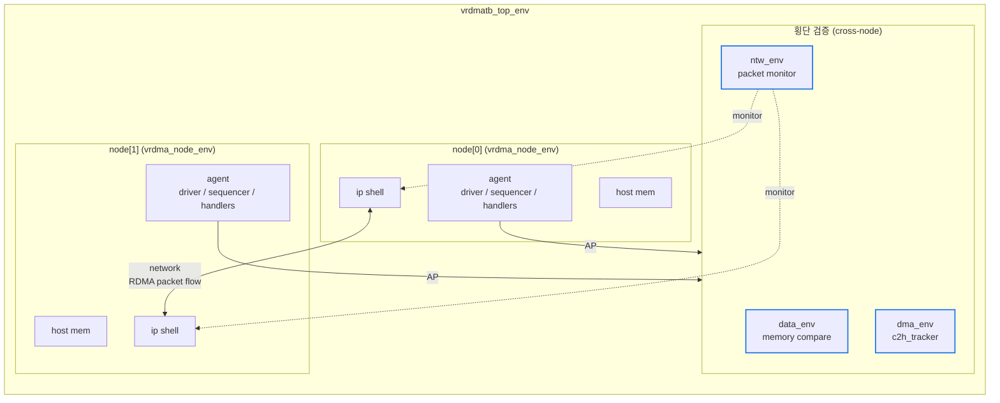
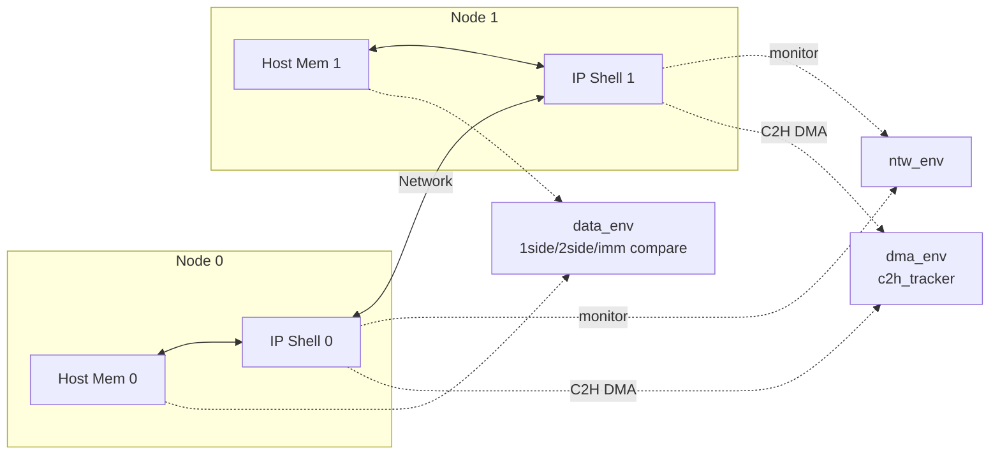

# Module 01 — TB Overview & Multi-Node 구조

<!-- DV-SKOOL-CH-CTX:start -->
<div class="chapter-context" data-cat="network">
  <a class="chapter-back" href="../">
    <span class="chapter-back-arrow">←</span>
    <span class="chapter-back-icon">🧪</span>
    <span class="chapter-back-text">RDMA Verification</span>
  </a>
  <span class="chapter-divider">›</span>
  <span class="chapter-marker">Module 01</span>
</div>
<!-- DV-SKOOL-CH-CTX:end -->

<!-- DV-SKOOL-CH-TOC:start -->
<div class="page-toc">
  <span class="page-toc-label">목차</span>
  <a class="page-toc-link" href="#1-why-care-이-모듈이-왜-필요한가">1. Why care?</a>
  <a class="page-toc-link" href="#2-intuition-두-사무실-한-도로-감시-카메라">2. Intuition</a>
  <a class="page-toc-link" href="#3-작은-예-1-kb-write-가-tb-를-가로지르는-궤적">3. 작은 예 — 1 KB WRITE 궤적</a>
  <a class="page-toc-link" href="#4-일반화-노드-격리--횡단-검증-패턴">4. 일반화 — 노드 격리 + 횡단 검증</a>
  <a class="page-toc-link" href="#5-디테일-env-계층-노드-모델-lib-분류">5. 디테일</a>
  <a class="page-toc-link" href="#6-흔한-오해-와-dv-디버그-체크리스트">6. 흔한 오해 + DV 디버그 체크리스트</a>
  <a class="page-toc-link" href="#7-핵심-정리-key-takeaways">7. 핵심 정리</a>
</div>
<!-- DV-SKOOL-CH-TOC:end -->

!!! objective "학습 목표"
    이 모듈을 마치면:

    - **Diagram** RDMA-TB 가 두 노드(host) 간 RDMA 트랜잭션을 어떻게 모델링하는지 그릴 수 있다.
    - **Identify** `vrdmatb_top_env` 가 컨테이너로 가지는 sub-env 5종을 식별할 수 있다.
    - **Differentiate** `lib/base` / `lib/ext` / `lib/external` / `lib/submodule` 의 분류 기준을 설명할 수 있다.
    - **Trace** 한 RDMA WRITE 가 두 노드 + 횡단 env 를 가로지르는 경로를 추적할 수 있다.

!!! info "사전 지식"
    - [RDMA Module 04 — Service Types & QP FSM](../../rdma/04_service_types_qp/) (RC vs OPS/SR 의 의미)
    - [UVM Topic — Environment / Agent](../../uvm/) (env 계층, agent 패턴)
    - DMA / PCIe 기본 — host memory 모델

---

## 1. Why care? — 이 모듈이 왜 필요한가

### 1.1 시나리오 — RDMA-TB 가 _2 노드_ 인 이유

일반 ASIC DV: DUT 한 개 + agent + scoreboard. 단순.

RDMA-TB: DUT _2 개_ (NODE 0 + NODE 1) + 양쪽 host 메모리 + 가운데 네트워크 + 횡단 scoreboard. _훨씬 복잡_.

왜? **RDMA 의 정의가 "양 끝 node 의 hardware 가 _서로_ 통신"**:
- Send 측만 검증하면 _packet 발신_ 만 OK 인지 확인. _수신_ 의 정확성 누락.
- Recv 측만 검증하면 _packet 수신_ 만 OK. _발신_ 의 정확성 누락.
- _두 NIC 사이의 protocol consistency_ (PSN/ACK/retry/flow control) 는 _양쪽_ 동시 보는 환경에서만 검증.

또한 _interoperability_: 같은 RTL 의 두 instance 가 _서로_ 보낸 패킷을 처리. 한 instance 의 _Tx bug_ 가 다른 instance 의 _Rx_ 에서 catch 가능.

**Trade-off**: dual-node 가 _2 배 시뮬 시간_ — 대신 _system-level bug catch_ 능력 압도적.

RDMA 검증은 본질적으로 **두 노드 간 통신** 의 검증입니다. 한 노드에서 보낸 데이터가 다른 노드의 메모리에 정확히 도착하는지 (1-side write/read, 2-side send/recv) 확인해야 하므로, TB 자체가 multi-node 모델을 그대로 반영해야 합니다.

이 모듈을 건너뛰면 이후 모든 모듈에서 만나는 `node[0]/node[1]`, `data_env`, `dma_env`, `ntw_env` 같은 이름이 그저 "디렉토리 명" 으로 보이고, 디버그 로그의 `[node][qp]` 키가 어디서 왔는지 모르게 됩니다. 반대로 5-부 구조 (두 노드 + 네트워크 + 횡단 검증) 를 잡고 나면, 모든 후속 모듈이 "이 5 영역 중 어느 영역의 디테일" 인지로 정렬됩니다.

---

## 2. Intuition — 두 사무실, 한 도로, 감시 카메라

!!! tip "💡 한 줄 비유"
    RDMA-TB ≈ **두 개의 동일한 사무실 + 가운데 도로 + 상시 감시 카메라**.<br>
    각 사무실(`vrdma_node_env`) 은 host 메모리, IP shell, agent 가 모두 들어 있어 자체적으로 verb 를 발행한다. 가운데 도로(`ntw_env`) 는 두 사무실을 잇는 네트워크 패킷을 본다. 그리고 가운데에 매달린 감시 카메라 3대 (`data_env` / `dma_env` / 검증 scoreboard) 가 두 사무실을 동시에 본다 — "양쪽 메모리가 일치하는가?", "DMA 가 기대된 위치/순서로 갔는가?", "트랜잭션 의미가 보존됐는가?"

### 한 장 그림 — Top env 의 5-부 구조



> 횡단 env 는 `[node][qp]` 키로 모든 트랜잭션을 추적합니다.

### 왜 이 디자인인가 — Design rationale

세 가지가 동시에 풀려야 했습니다.

1. **노드 추가가 단순해야** — `cfg.num_nodes++` 만으로 동일 구조 재인스턴스화 → `vrdma_node_env` 가 한 노드의 모든 host+ip 컴포넌트를 캡슐화.
2. **횡단 검증은 노드 수와 무관해야** — 두 노드 간 데이터 비교, DMA 추적, 패킷 모니터링은 본질적으로 "여러 노드를 한꺼번에 보는" 컴포넌트 → 노드와 별도 sub-env (`data_env`, `dma_env`, `ntw_env`) 로 분리.
3. **모든 디버그/추적은 동일 키 형태로** — 모든 횡단 컴포넌트가 `[node][qp]` associative array 키를 공유 → 디버그 로그가 노드/QP 단위로 자동 정렬.

이 세 요구의 교집합이 5-부 구조 (Node × 2 + 횡단 env × 3) 입니다.

---

## 3. 작은 예 — 1 KB WRITE 가 TB 를 가로지르는 궤적

가장 단순한 시나리오 — `rdma_basic_test` 가 `num_nodes=2` 로 실행되고 `node[0]` 이 `node[1]` 에 1 KB RDMA WRITE 를 합니다.

```d2
shape: sequence_diagram

TS: "top_seq"
DRV0: "node[0].driver"
WH: "write_handler"
C1: "1side_compare"
CT: "c2h_tracker"
DUT0: "DUT IP_0"
PM: "pkt_monitor\n(ntw_env)"
DUT1: "DUT IP_1"
MEM1: "host mem[1]"
CQH: "cq_handler"
SB: "data_scoreboard"

TS -> DRV0: "RDMAWrite(.t_seqr=seqr[0])"
DRV0 -> WH: "issued_wqe_ap.write(cmd)"
WH -> C1: "write 큐에 enqueue"
WH -> CT: "expected PA 계산"
DRV0 -> DUT0: "doorbell"
DUT0 -> PM: "pkt"
PM -> DUT1: "pkt"
DUT1 -> MEM1: "payload DMA"
DUT1 -> CT: "C2H 매칭"
MEM1 -> C1: "mem[0] vs mem[1] 비교"
DUT1 -> CQH: "pkt 도착 / completion" { style.stroke-dash: 4 }
CQH -> DRV0: "cqe_ap" { style.stroke-dash: 4 }
DRV0 -> SB: "completed_wqe_ap.write(cmd)"
```

| Step | 누가 | 무엇을 | 왜 |
|---|---|---|---|
| ① | test → top_vseqr | `RDMAWrite(.t_seqr(seqr[0]))` 발행 | top sequence 가 노드 0 의 seqr 를 명시적으로 지정 |
| ② | `node[0].driver` | WQE post 후 `issued_wqe_ap.write(cmd)` | 발행 정보를 모든 횡단 subscriber 에게 broadcast |
| ② | `write_handler` | opcode 따라 1side_compare / c2h_tracker 로 라우팅 | stateless forwarder — state 없음 |
| ③ | driver | DUT IP shell 로 doorbell MMIO | DUT 가 SQ 에서 WQE fetch (QID 14–17) |
| ④ | DUT IP_1 | host mem[1] 에 payload DMA | C2H QID 8–9 로 가시화 |
| ⑤ | `c2h_tracker` | 받은 C2H 의 (addr, size) 가 expected PA 와 일치하는지 | DMA 정합성 검증 (M10) |
| ⑥ | `1side_compare` | mem[0] 의 source 와 mem[1] 의 dest 를 byte-byte 비교 | 데이터 정합성 검증 (M08) |
| ⑦ | `cq_handler` | CQE 도착 → `cqe_ap.write(cqe)` | comparator 들에게 완료 통지 |
| ⑧ | driver | `completed_wqe_ap.write(cmd)` | scoreboard 에서 outstanding 정리 (단, ErrQP 면 skip) |

!!! note "여기서 잡아야 할 두 가지"
    **(1) 한 verb 가 driver→handler→3개 횡단 env 로 1:N broadcast** — 이게 [Module 04 AP 토폴로지](04_analysis_port_topology.md) 의 핵심 패턴.<br>
    **(2) `[node][qp]` 키가 모든 횡단 env 에 공통** — 디버그 시 한 트랜잭션을 `node 0, qp X` 로 좁히면 1side_compare / c2h_tracker / data_scoreboard 의 로그가 동시에 정렬됩니다.

---

## 4. 일반화 — 노드 격리 + 횡단 검증 패턴

### 4.1 두 가지 격리 원칙

| 원칙 | 적용 대상 | 이유 |
|------|----------|-----|
| **노드 격리** | `vrdma_node_env` 가 한 노드의 모든 host + ip 컴포넌트를 캡슐화 | 노드 수 변경 시 단순 인스턴스화 |
| **횡단 검증 분리** | `data_env` / `dma_env` / `ntw_env` 는 두 노드를 가로지르는 검증 → 노드와 분리되어 top env 직속 | 노드 수와 무관하게 1 인스턴스, 모든 노드 AP 를 구독 |

### 4.2 노드 간 통신 모델



- **data_env** — 양 노드의 호스트 메모리 영역을 비교 (write/read/send/recv 정합성)
- **dma_env** — 각 노드의 IP 가 host 로 발생시키는 C2H DMA 트랜잭션을 추적
- **ntw_env** — 두 노드 사이의 RDMA 패킷 (BTH/RETH/AETH/...) 을 모니터링

이 패턴은 노드를 N 개로 확장해도 동일하게 작동합니다 — 횡단 env 는 모든 노드의 AP 를 한 번에 구독.

---

## 5. 디테일 — env 계층, 노드 모델, lib 분류

### 5.1 Top env 의 12 svh 파일

`lib/base/component/env/` 디렉토리에는 환경 계층의 12개 svh 파일이 있습니다.

```
vrdmatb_top_env.svh        ← 두 노드 + 네트워크 + RAL 통합
├── vrdma_node_env.svh     ← 한 노드의 모든 sub-env (host + ip)
│   ├── vrdma_host_env.svh ← 호스트 측 (메모리, driver 일부)
│   └── vrdma_ipshell_env.svh / vrdma_elc_env.svh ← IP shell / 엣지 logic
├── vrdma_ntw_env.svh      ← 두 노드를 잇는 네트워크
│   └── vrdma_ntw_model_env.svh / vrdma_ntw_sb_env.svh
├── vrdma_data_env.svh     ← 데이터 정합성 검증 (comparator)
├── vrdma_dma_env.svh      ← DMA 트랜잭션 검증 (c2h_tracker)
├── vrdma_lp_env.svh       ← 로컬 패킷 환경
├── vrdma_memory_env.svh   ← 메모리 시뮬레이션
├── vrdma_ral_env.svh / vrdma_mbshell_ral_env.svh ← RAL
```

이 계층의 핵심 원칙은:

- **노드 격리** — `vrdma_node_env` 가 한 노드의 모든 host + ip 컴포넌트를 캡슐화. 노드가 둘이면 `vrdma_node_env` 도 두 인스턴스.
- **횡단 검증 분리** — `data_env` / `dma_env` / `ntw_env` 는 두 노드를 가로지르는 검증으로, 노드와 분리되어 top env 에 직속.

### 5.2 lib 디렉토리 분류 (Confluence Submodule + 코드 검증)

`/home/jaehyeok.lee/RDMA/RDMA-TB/lib/` 는 4개 layer 로 분리되어 있습니다.

| 디렉토리 | 역할 | 예 |
|---------|------|----|
| `lib/base/` | RDMA IP-top 공통 검증 자산 (config, env, agent, comparator, tracker, sequence) | `lib/base/component/env/` |
| `lib/ext/` | 기능 확장 — congestion control, sva, error_handling 등 옵션 컴포넌트 | `lib/ext/test/error_handling/`, `lib/ext/component/congestion_control/` |
| `lib/external/` | 외부에서 가져온 IP/component (vendor IP, third-party VIP) | `lib/external/vpfc/` |
| `lib/submodule/` | sub-IP 검증 환경 (data_plane, metadata) | `lib/submodule/data_plane/crc/`, `lib/submodule/metadata/mmu/` |

!!! tip "검증 가치 우선순위"
    새 기능을 추가할 때 어느 layer 에 둘지 결정하는 기준:

    1. **모든 RDMA IP 인스턴스에서 공통 필요** → `lib/base/`
    2. **특정 feature flag 가 켜진 경우만** → `lib/ext/`
    3. **외부 IP 의존** → `lib/external/`
    4. **IP 의 한 sub-block 만 검증** → `lib/submodule/`

### 5.3 코드 walkthrough — Top env 정의 위치

- `lib/base/component/env/vrdmatb_top_env.svh` — top env 컨테이너
- `lib/base/component/env/vrdma_node_env.svh` — 노드 env
- `lib/base/component/env/vrdma_data_env.svh` (실제 본체는 `data_env/vrdma_data_env.svh`)

#### 노드 인스턴스화

TB 는 `cfg.num_nodes` 만큼 `vrdma_node_env` 를 build 단계에서 생성합니다. 두 노드 간 모든 트랜잭션은 노드 ID (`local_node`, `remote_node`) 로 태깅되어 흐릅니다. data_env / dma_env 의 comparator/tracker 는 모두 `[node][qp]` 키 형태의 associative array 를 사용합니다.

#### 환경 분리의 효과

- 노드 추가가 단순 — `cfg.num_nodes++` 만으로 동일 구조 재인스턴스화
- 횡단 env (`data_env`, `dma_env`) 는 노드 수와 무관하게 항상 1 인스턴스. 모든 노드의 AP 를 구독.

### 5.4 실전 — 한 테스트의 컴포넌트 인스턴스 그림

`rdma_basic_test` 가 `num_nodes=2` 로 실행될 때 인스턴스화되는 컴포넌트 (간략):

```
uvm_test_top (rdma_basic_test)
└── env (vrdmatb_top_env)
    ├── node[0] (vrdma_node_env)
    │   ├── host_env (vrdma_host_env)
    │   ├── ipshell_env (vrdma_ipshell_env)
    │   └── agent (vrdma_agent)
    │       ├── driver (vrdma_driver)
    │       ├── sequencer (vrdma_sequencer)
    │       └── handlers (cq_handler, send/recv/write/read_handler)
    ├── node[1] (vrdma_node_env)
    │   └── ... (동일)
    ├── ntw_env (vrdma_ntw_env)
    │   └── pkt_monitor[0,1] (vrdma_pkt_monitor)
    ├── data_env (vrdma_data_env)
    │   ├── 1side_compare, 2side_compare, imm_compare
    │   └── data_scoreboard, cqe_validation_checker
    ├── dma_env (vrdma_dma_env)
    │   └── c2h_tracker
    └── top_vseqr (vrdma_top_virtual_sequencer)
```

---

## 6. 흔한 오해 와 DV 디버그 체크리스트

### 흔한 오해

!!! danger "❓ 오해 1 — '두 노드는 두 개의 별도 TB 다'"
    **실제**: 두 노드는 **같은** UVM env (`vrdmatb_top_env`) 의 두 인스턴스입니다 (`vrdma_node_env[0]`, `vrdma_node_env[1]`). config_db, factory, top_vseqr 는 모두 공유. 노드 간 라우팅은 sequencer 의 `t_seqr` 파라미터로 결정.<br>
    **왜 헷갈리는가**: "RDMA = network = 두 호스트" 라는 일반 직관이 강해서.

!!! danger "❓ 오해 2 — 'data_env / dma_env 는 한 노드에 속한다'"
    **실제**: 두 env 는 모두 **횡단 검증** — top env 직속 (`vrdmatb_top_env` 의 자식). 양 노드의 host memory 또는 C2H DMA 를 동시에 보는 것이 본질. 한 노드 안에 두면 다른 노드 데이터 비교가 불가능.<br>
    **왜 헷갈리는가**: "한 노드의 메모리를 검증" 이라는 일반적 모델 때문.

!!! danger "❓ 오해 3 — '`lib/ext/` 는 "extra" 의 줄임말로 미사용 코드'"
    **실제**: `lib/ext/` 는 **기능 확장 (extension)** — congestion control, sva, error_handling 같은 **옵션 컴포넌트**. cfg 플래그로 enable/disable. 테스트 시나리오에 따라 자주 사용됩니다.

!!! danger "❓ 오해 4 — '노드를 추가하려면 env 를 새로 만들어야 한다'"
    **실제**: `cfg.num_nodes` 만 늘리면 build_phase 에서 `vrdma_node_env` 가 N 개 자동 생성. 횡단 env 는 그대로 1 인스턴스. 대신 시퀀스가 `seqr[i]` 를 모든 노드에 대해 라우팅하도록 작성돼 있어야 함.

### DV 디버그 체크리스트

| 증상 | 1차 의심 | 어디 보나 |
|---|---|---|
| 시뮬 시작 시 `num_nodes` 관련 build 에러 | cfg 미설정 또는 노드 인덱스 out-of-range | `vrdma_topology_cfg.num_nodes`, build_phase 의 `for(i=0; i<num_nodes; i++)` 루프 |
| `node[1]` 의 verb 만 발행 안 됨 | top_seq 가 `t_seqr` 를 항상 `seqr[0]` 으로 보냄 | top_sequence 의 `t_seqr` 인자 |
| `data_env` 가 한 노드 데이터만 봄 | data_env 가 노드 안에 인스턴스화됨 (잘못된 위치) | env 계층 — top env 직속이어야 함 |
| 1 KB WRITE 의 mem[0] vs mem[1] 비교 실패 | comparator 가 [node][qp] 키 매칭 못 함 | qp_reg_ap 가 양 노드의 QP 모두에 도달했는지 |
| `lib/ext/congestion_control/` 의 컴포넌트가 동작 안 함 | cfg 의 enable flag off | `vrdma_cfg.has_*_chk` / 별도 ext flag |
| `lib/external/vpfc/` 가 not-found | submodule 미체크아웃 | git submodule update |
| 노드 1 추가했더니 ntw_env 가 노드 0 만 모니터 | pkt_monitor 인스턴스가 cfg.num_nodes 따라 안 늘어남 | ntw_env 의 build_phase 루프 |

---

## 7. 핵심 정리 (Key Takeaways)

- RDMA-TB 는 **두 노드 + 네트워크 + 횡단 검증 env (data/dma/ntw)** 의 5-부 구조.
- **노드 격리** (`vrdma_node_env`) + **횡단 검증 분리** (`data_env`/`dma_env`/`ntw_env`) 가 핵심 패턴.
- `lib/{base,ext,external,submodule}` 4-layer 분류 기준은 "공통 vs 옵션 vs 외부 vs sub-IP".
- 모든 횡단 env 는 `[node][qp]` 키로 트랜잭션 추적 — 후속 모듈 (M08-M11) 디버그 키.
- 한 verb 는 driver → handler → 횡단 env 로 1:N broadcast (M04 AP 토폴로지).

!!! warning "실무 주의점"
    - 새 횡단 검증 컴포넌트는 항상 top env 직속에 두기 — 노드 안에 두면 cross-node 비교 불가.
    - 노드를 N 개로 확장 전에 모든 시퀀스가 `t_seqr[i]` 를 정확히 라우팅하는지 점검.

### 7.1 자가 점검

!!! question "🤔 Q1 — Cross-node scoreboard 위치 (Bloom: Apply)"
    "Node 0 가 보낸 메시지가 Node 1 메모리에 정확히 도착" 검증 컴포넌트. 어디에?

    ??? success "정답"
        **Top env 직속**.

        - Node 안에 두면: 한 node 의 view 만 → cross-node 비교 불가.
        - Top env 에 두면: 양 node 의 monitor AP 모두 subscribe → 양쪽 데이터 비교.

!!! question "🤔 Q2 — Dual-node simulation cost (Bloom: Evaluate)"
    Dual-node 가 single-node 의 _2× 비용_. 정당화?

    ??? success "정답"
        Single-node + BFM:
        - BFM 이 _real DUT 응답_ 흉내내야 — protocol 복잡.
        - BFM 의 _버그_ 가 false test pass 가능.

        Dual-node:
        - 두 instance 가 _서로_ 통신 → _real protocol_ check.
        - 한 instance bug 가 _다른 instance_ 에서 catch.

        _2× sim 비용_ vs _10× bug catch 능력_. 정당화.

### 7.2 출처

**Internal (Confluence)**
- 사내 RDMA-TB ARCHITECTURE.md

---

## 다음 모듈

→ [Module 02 — Component 계층](02_component_hierarchy.md): `lib/base/component/` 의 11 하위 디렉토리를 분해.

[퀴즈 풀어보기 →](quiz/01_tb_overview_quiz.md)


--8<-- "abbreviations.md"
