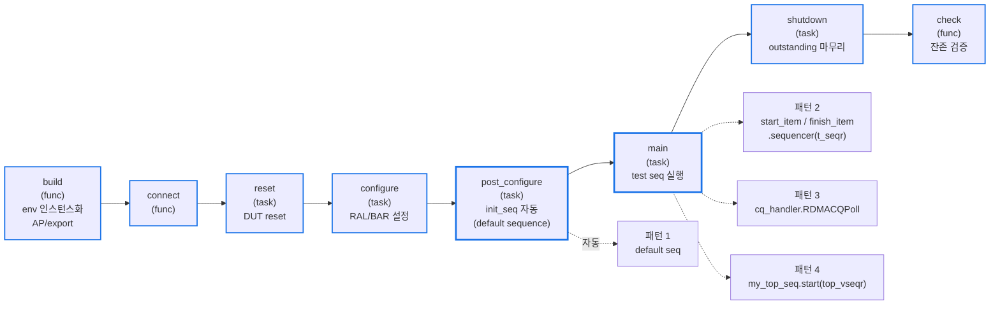
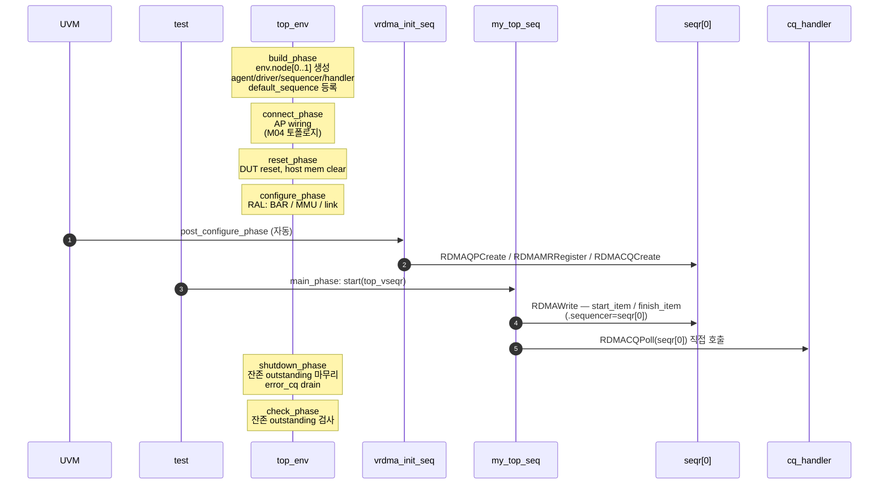
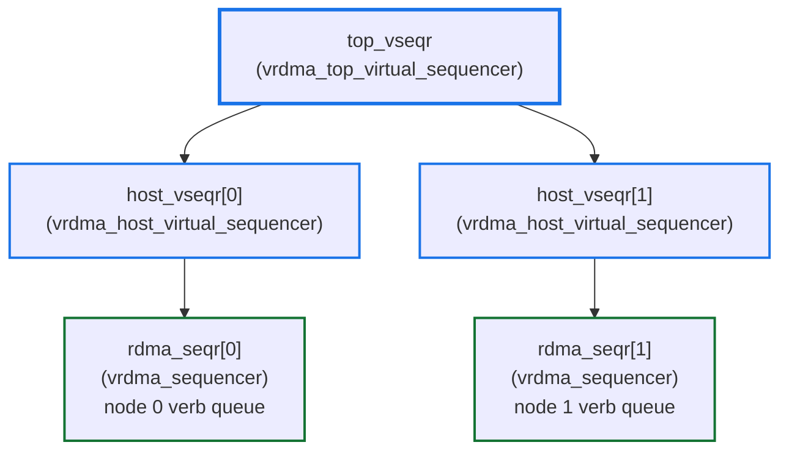

# Module 03 — UVM Phase & Test Flow

<!-- DV-SKOOL-CH-CTX:start -->
<div class="chapter-context" data-cat="network">
  <a class="chapter-back" href="../">
    <span class="chapter-back-arrow">←</span>
    <span class="chapter-back-icon">🧪</span>
    <span class="chapter-back-text">RDMA Verification</span>
  </a>
  <span class="chapter-divider">›</span>
  <span class="chapter-marker">Module 03</span>
</div>
<!-- DV-SKOOL-CH-CTX:end -->

<!-- DV-SKOOL-CH-TOC:start -->
<div class="page-toc">
  <span class="page-toc-label">목차</span>
  <a class="page-toc-link" href="#1-why-care-이-모듈이-왜-필요한가">1. Why care?</a>
  <a class="page-toc-link" href="#2-intuition-매장-운영-시간표">2. Intuition</a>
  <a class="page-toc-link" href="#3-작은-예-한-rdma-write-가-8-phase-를-가로지르는-궤적">3. 작은 예 — 한 WRITE 의 8-phase 궤적</a>
  <a class="page-toc-link" href="#4-일반화-4-시퀀스-패턴--sequencer-계층">4. 일반화 — 4 패턴 + sequencer 계층</a>
  <a class="page-toc-link" href="#5-디테일-phase-매핑-각-패턴-코드-test-class">5. 디테일</a>
  <a class="page-toc-link" href="#6-흔한-오해-와-dv-디버그-체크리스트">6. 흔한 오해 + DV 디버그 체크리스트</a>
  <a class="page-toc-link" href="#7-핵심-정리-key-takeaways">7. 핵심 정리</a>
</div>
<!-- DV-SKOOL-CH-TOC:end -->

!!! objective "학습 목표"
    이 모듈을 마치면:

    - **Sequence** UVM phase 8 단계가 RDMA-TB 에서 어떻게 매핑되는지 차례로 설명할 수 있다.
    - **Differentiate** default sequence / `start_item-finish_item` / cq_handler 직접 호출 / 테스트 레벨 시퀀스 시작 4 가지 시퀀스 패턴을 구분할 수 있다.
    - **Trace** `top_vseqr` 에서 시작한 `vrdma_top_sequence` 가 어떻게 노드별 `rdma_seqr` 로 라우팅되는지 추적할 수 있다.
    - **Justify** state 가 sequence 가 아니라 sequencer 에 있어야 하는 이유를 설명할 수 있다.

!!! info "사전 지식"
    - [Module 02 — Component 계층](02_component_hierarchy.md) (sequencer / driver / handler 분리)
    - UVM phase 모델 — build/connect/reset/configure/main/shutdown/check
    - `start_item / finish_item` 표준 호출 페어

---

## 1. Why care? — 이 모듈이 왜 필요한가

### 1.1 시나리오 — 첫 _verb_ 부터 _fatal_

당신은 새 RDMA test 작성. main_phase 에서 `ibv_post_send` 호출 → **즉시 fatal**: "QP not in RTS state".

원인: QP 가 _아직 Reset_ 상태. Init seq (Modify(Init) → Modify(RTR) → Modify(RTS)) 가 _실행 안 됨_.

해법: **`post_configure_phase` 에서 init seq 자동 실행**.
- build/connect: 자원 생성.
- reset: 청소.
- configure: 설정.
- **post_configure: init seq 실행** ← 모든 QP 가 RTS 진입.
- main: 정상 verb.
- shutdown: outstanding drain.
- check: 결과 검증.

각 phase 의 _책임이 명확_ 해야 race 없음. RDMA-TB 의 핵심 패턴.

RDMA-TB 는 **두 노드 + 다수 sub-env** 가 동시에 돌아가므로 phase 가 잘못 구성되면 race / dead-lock 이 쉽게 생깁니다. 예를 들어 QP/CQ/MR 등록 (init seq) 이 정상 main_phase verb 보다 늦으면 첫 verb 부터 fatal. RDMA-TB 는 이를 해결하기 위해 phase 별 책임을 명확히 나눴고, `post_configure_phase` 에서 default sequence 로 HW 초기화를 자동 수행합니다.

이 모듈을 건너뛰면 새 테스트 작성 시 "왜 init 이 자동 실행되는지", "왜 `t_seqr` 를 명시해야 하는지", "왜 CQ 폴링은 `start_item` 을 안 쓰는지" 같은 질문이 끊임없이 나옵니다. 4 패턴 + sequencer 계층을 잡으면 모든 시퀀스 작성 결정이 자동화됩니다.

---

## 2. Intuition — 매장 운영 시간표

!!! tip "💡 한 줄 비유"
    UVM phase ≈ **매장의 일일 운영 시간표**. build/connect = 오픈 전 준비, reset = 청소, configure = 진열, post_configure = 직원 교육 (init seq), main = 영업 시간 (test seq), shutdown = 마감, check = 일일 정산. 직원 교육 (init seq) 을 영업 시간에 끼워 넣으면 손님 (verb) 응대가 꼬이고, 정산 전에 수금 (outstanding) 이 안 끝나면 잔액이 안 맞음.

### 한 장 그림 — phase 와 시퀀스 패턴



### 왜 이 디자인인가 — Design rationale

세 가지가 동시에 풀려야 했습니다.

1. **HW 초기화 (QP/CQ/MR 등록) 가 모든 테스트에서 공통** → init seq 를 default sequence 로 등록 → post_configure_phase 에서 자동 실행.
2. **멀티노드 verb 라우팅이 명시적이어야** → top_vseqr 에서 시작한 sequence 가 verb 마다 `.sequencer(t_seqr)` 인자로 노드 라우팅.
3. **CQ 폴링은 transaction 발행이 아니라 결과 대기** → driver 의 SQ 큐를 거치지 않고 cq_handler 직접 호출.

이 세 요구의 교집합이 4 패턴 + sequencer 3-계층 구조입니다.

---

## 3. 작은 예 — 한 RDMA WRITE 가 8-phase 를 가로지르는 궤적

`my_test` 가 `RDMAWrite` 한 번을 발행하는 가장 단순한 시나리오.

### 단계별 추적



### 단계별 의미

| Step | 누가 | 무엇을 | 왜 |
|---|---|---|---|
| build | top_env | env / agent 인스턴스화, default_seq 등록 | UVM 자동 phase 로 인스턴스화만 |
| connect | top_env | AP wiring | M04 토폴로지 형성 |
| post_configure | UVM | `vrdma_init_seq` 자동 create + start | QP/CQ/MR 가 main 시작 전 준비됨 |
| main | test | `my_top_seq.start(top_vseqr)` | 패턴 4 — 테스트 진입점 |
| main | top_seq | `RDMAWrite(.t_seqr(seqr[0]))` 의 내부에서 start/finish_item | 패턴 2 — 노드 라우팅 |
| main | top_seq | `cq_handler.RDMACQPoll(seqr[0])` 직접 호출 | 패턴 3 — driver 큐 우회 |
| shutdown | driver | 잔존 outstanding flush, error_cq drain | graceful 종료 |
| check | comparator/tracker | outstanding 잔존 검사 → 0 이어야 정상 | 잔존 = 미완료 verb 의 잔재 |

!!! note "여기서 잡아야 할 두 가지"
    **(1) post_configure 에서 init_seq 가 _자동_ 실행** — test 가 명시적으로 부르지 않음. UVM 의 default_sequence 메커니즘 + agent build 시점의 `uvm_config_db::set` 등록.<br>
    **(2) 한 verb 호출 안에 패턴 2 (start/finish_item) 와 패턴 3 (cq_handler 직접 호출) 이 동시에 등장** — 발행은 sequencer 큐, 폴링은 handler 직접. 헷갈리지 않게 의도가 다르다.

---

## 4. 일반화 — 4 시퀀스 패턴 + sequencer 계층

### 4.1 시퀀스 실행 패턴 4종

| # | 패턴 | 시작 위치 | 용도 |
|---|------|---------|-----|
| 1 | Default Sequence | UVM 자동 (post_configure_phase) | HW 초기화 (QP/CQ/MR 등록) |
| 2 | `start_item / finish_item` (.sequencer=t_seqr) | top_seq 내부 verb 함수 | 멀티노드 verb 라우팅 |
| 3 | `cq_handler.RDMACQPoll` 직접 호출 | top_seq 내부 | CQ 폴링 (driver 큐 우회) |
| 4 | `my_seq.start(env.top_vseqr)` | test 의 main_phase | 테스트 진입점 |

### 4.2 Sequencer 계층



핵심 규칙:

- **`vrdma_top_sequence` 는 stateless function set** — body() 가 없거나 minimal. 실제 verb 함수만 제공.
- 멀티노드 verb 를 동시에 발행하려면 `fork-join_none` 으로 두 시퀀서에 동시에 `start_item / finish_item`.
- per-QP state (예: outstanding count, error status) 는 `vrdma_sequencer` 가 보유. 시퀀스가 보유하면 시퀀스 재사용 시 stale 됨 ([Module 05](05_extension_principles.md) Stateless 원칙 참고).

---

## 5. 디테일 — phase 매핑, 각 패턴 코드, test class

### 5.1 Phase 별 매핑 (Confluence Test Flow)

| # | Phase | 종류 | RDMA-TB 의 역할 |
|---|-------|-----|----------------|
| 1 | `build_phase` | function | env 인스턴스화 (`vrdmatb_top_env` → 노드/data/dma/network) |
| 2 | `connect_phase` | function | AP/export 연결, sequencer↔driver 연결 |
| 3 | `reset_phase` | task | DUT reset, 메모리 초기화 |
| 4 | `configure_phase` | task | RAL 기반 초기 컨피그 (BAR, MMU, link 설정) |
| 5 | `post_configure_phase` | task | **`vrdma_init_seq` 가 default sequence 로 자동 실행** — QP/CQ/MR 등록 등 HW 초기화 |
| 6 | `main_phase` | task | 테스트 시퀀스 실행, agent 백그라운드 task 동작 |
| 7 | `shutdown_phase` | task | outstanding 마무리, error_cq drain |
| 8 | `check_phase` | function | 모든 comparator/tracker 가 잔존 outstanding 검증 |

> Confluence 출처: [Test Flow](https://mangoboost.atlassian.net/wiki/spaces/RDMADV/pages/1224605910/Test+Flow)

### 5.2 패턴 1 — Default Sequence (자동 시작)

post_configure_phase 에 `vrdma_init_seq` 가 default 로 등록되어 있어 UVM 이 phase 진입 시 자동으로 생성·시작합니다.

```systemverilog
// agent build_phase 어딘가에서:
uvm_config_db#(uvm_object_wrapper)::set(this, "*.sequencer.post_configure_phase",
                                         "default_sequence", vrdma_init_seq::get_type());
```

> 정의: `lib/base/object/sequence/vrdma_init_seq.svh`

### 5.3 패턴 2 — `start_item / finish_item` (멀티노드 타겟팅)

`vrdma_top_sequence` 의 verb 함수에서 사용. `.sequencer(t_seqr)` 파라미터로 **특정 노드의 `rdma_seqr`** 를 명시적으로 지정합니다.

```systemverilog
// 호출 예 (개념):
vrdma_send_command cmd = ...;
this.start_item(cmd, .sequencer(t_seqr));
assert(cmd.randomize() with { qp_num == ...; });
this.finish_item(cmd);
```

이 패턴이 멀티노드의 핵심입니다. `vrdma_top_sequence` 자체는 `top_vseqr` 에서 실행되지만 개별 verb 는 노드별 `rdma_seqr` 로 라우팅됩니다.

### 5.4 패턴 3 — CQ Polling (직접 호출)

CQ 폴링은 `start_item` / `finish_item` 을 사용하지 **않고** sequencer 의 `cq_handler` 를 직접 호출합니다.

```systemverilog
// vrdma_top_sequence 어디:
t_seqr.cq_handler.RDMACQPoll(...);
```

> 이유: CQ 폴링은 트랜잭션 발행이 아니라 **결과 대기** 이므로 driver 의 WQE 발행 큐를 거칠 필요가 없습니다. 폴링 주체는 cq_handler 입니다 — `lib/base/component/env/agent/handler/vrdma_cq_handler.svh`

### 5.5 패턴 4 — 테스트 레벨 시퀀스 시작

Concrete 테스트의 `main_phase` 에서:

```systemverilog
my_top_seq = vrdma_my_top_sequence::type_id::create("my_top_seq");
my_top_seq.cfg = this.cfg;
assert(my_top_seq.randomize());
my_top_seq.start(env.top_vseqr);  // ← top_vseqr 에서 시작
```

### 5.6 코드 walkthrough — Init seq 의 default 등록

- 파일: `lib/base/object/sequence/vrdma_init_seq.svh`
- agent 의 build_phase 에서 sequencer 의 default_sequence 로 등록되며, post_configure_phase 진입 시 UVM 이 자동으로 create + start.

### 5.7 코드 walkthrough — Top sequence 의 verb 인터페이스

- 파일: `lib/base/object/sequence/vrdma_top_sequence.svh`
- 주요 함수:
  - `RDMASend / RDMAWrite / RDMARead / RDMARecvPost / RDMAQPCreate / RDMAQPDestroy / RDMAMRRegister / RDMACQCreate / RDMACQPoll`
  - 모두 `t_seqr` 파라미터를 받음 → 호출자가 어느 노드에 verb 를 보낼지 결정

### 5.8 Driver 의 백그라운드 task

`vrdma_driver` 의 `run_phase` 는 다음을 무한 루프로 돌립니다:

- `EntryPoint(cmd)` — 시퀀서에서 받은 cmd 처리
- `chkSQErrQP` — QP 가 ErrQP 면 skip
- WQE 발행 → outstanding 등록 → `issued_wqe_ap.write(cmd)`

자세한 에러 분기는 [Module 06](06_error_handling_path.md).

### 5.9 테스트 클래스 구조 (예)

- `lib/base/component/test/vrdmatb_base_test.svh` — `rdma_base_test`
- `lib/ext/test/sanity/vrdmatb_sanity_tests.svh` — sanity 시나리오
- `lib/ext/test/error_handling/vrdmatb_error_handling_test_lib.svh` — 에러 처리 테스트 base

전형적인 패턴:

```systemverilog
class my_test extends rdma_base_test;
  `uvm_component_utils(my_test)
  task main_phase(uvm_phase phase);
    my_top_seq seq = my_top_seq::type_id::create("seq");
    phase.raise_objection(this);
    seq.cfg = this.cfg;
    assert(seq.randomize());
    seq.start(env.top_vseqr);
    phase.drop_objection(this);
  endtask
endclass
```

---

## 6. 흔한 오해 와 DV 디버그 체크리스트

### 흔한 오해

!!! danger "❓ 오해 1 — 'init seq 도 main_phase 에서 부르자'"
    **실제**: init seq 는 default_sequence 메커니즘으로 **post_configure_phase 에서 자동 실행**. main_phase 에서 다시 부르면 QP 중복 등록 → fatal 또는 stale state. 모든 테스트가 동일한 init 을 공유하기 때문에 자동 실행이 옳음.<br>
    **왜 헷갈리는가**: "내가 부르지 않은 코드는 실행되지 않는다" 라는 일반 직관 때문.

!!! danger "❓ 오해 2 — 'CQ 폴링도 start_item 으로 발행하자'"
    **실제**: CQ 폴링은 driver 의 SQ 발행 큐와 **다른 경로**입니다. driver 큐는 verb 트랜잭션, CQ 폴링은 결과 수신. start_item 으로 시도하면 driver 가 폴링을 verb 로 오인 → dead-lock. `cq_handler.RDMACQPoll(t_seqr)` 직접 호출이 맞음.<br>
    **왜 헷갈리는가**: "모든 sequencer 행위는 start/finish_item" 이라는 UVM 표준 가정.

!!! danger "❓ 오해 3 — 'top_sequence 에 outstanding 카운터를 넣자'"
    **실제**: top_sequence 는 **stateless** — body() 가 없거나 minimal. state (outstanding, 에러 큐) 는 sequencer 가 소유. 시퀀스에 두면 시퀀스 재사용 시 stale state, 멀티노드 cross-talk. — [M05](05_extension_principles.md) #4 Stateless 보존 원칙.

!!! danger "❓ 오해 4 — '`.sequencer(t_seqr)` 안 줘도 알아서 라우팅된다'"
    **실제**: `vrdma_top_sequence` 는 `top_vseqr` 에서 실행되지만, 어느 노드의 verb 인지 **명시 안 하면 결정 불가** — 런타임 에러. 항상 `t_seqr` 파라미터 명시. 멀티노드 동시 발행은 fork-join_none 으로.

!!! danger "❓ 오해 5 — 'main_phase 에서 raise/drop_objection 안 써도 끝까지 돈다'"
    **실제**: objection 안 올리면 phase 가 즉시 종료 → seq.start() 가 실행되기도 전에 main 끝남. raise/drop 페어 필수.

### DV 디버그 체크리스트

| 증상 | 1차 의심 | 어디 보나 |
|---|---|---|
| post_configure 에서 fatal "QP 중복 등록" | test main_phase 가 init_seq 를 또 부름 | main_phase 코드, `vrdma_init_seq` 호출 위치 |
| 첫 verb 부터 fatal "QP not found" | post_configure_phase 의 default_sequence 미등록 | agent build_phase 의 `uvm_config_db::set` |
| `node[1]` verb 만 발행 안 됨 | `t_seqr` 가 항상 `seqr[0]` | 시퀀스 verb 호출의 `.sequencer` 인자 |
| CQ poll dead-lock | start_item 으로 폴링 시도 | `cq_handler.RDMACQPoll` 사용 여부 |
| main 이 즉시 종료 | objection 누락 | `phase.raise_objection`/`drop_objection` |
| 시퀀스 재사용 시 이상한 상태 | sequence 에 state 보유 | sequence 멤버 변수 — sequencer 로 이동 |
| `node[0]/[1]` 동시 verb 가 직렬 실행 | fork-join_none 누락 | fork ... join_none 블록 |
| check_phase 에서 outstanding 잔존 | shutdown 에서 drain 안 됨 | shutdown_phase 의 outstanding flush |

---

## 7. 핵심 정리 (Key Takeaways)

- 8 phase 중 검증의 골격은 `post_configure` (init seq) → `main` (test seq) → `check` (잔존 검증).
- 시퀀스 패턴 4 종은 모두 의도가 다르다 — default (자동), `start_item-finish_item` (노드 타겟팅), `cq_handler` 직접 호출 (폴링), `start(top_vseqr)` (테스트 진입).
- 멀티노드의 핵심은 `top_vseqr` 에서 시작하지만 verb 는 `.sequencer(t_seqr)` 로 노드 라우팅.
- state ownership 은 sequencer 에 있다 — 시퀀스에 두면 안 된다.
- objection raise/drop 은 main_phase 의 필수 패턴.

!!! warning "실무 주의점"
    - 새 verb 함수 추가 시 `t_seqr` 파라미터를 첫 인자로 두기 (RDMA-TB 컨벤션).
    - 멀티노드 동시 발행은 `fork ... join_none` + `wait fork` 또는 `join` 으로 명시적 동기.

### 7.1 자가 점검

!!! question "🤔 Q1 — Phase 적합한 위치 (Bloom: Apply)"
    "Node 0 의 QP RTS 진입" 시퀀스. 어느 phase?

    ??? success "정답"
        **`post_configure_phase`** (init seq).

        - `build_phase`: 자원 생성 (component instance).
        - `connect_phase`: AP connect.
        - `reset_phase`: HW reset.
        - `configure_phase`: register config.
        - **`post_configure_phase`**: HW init seq (QP RTS 전환). main_phase 전.
        - `main_phase`: 정상 verb.

!!! question "🤔 Q2 — Multi-node race (Bloom: Analyze)"
    Node 0, Node 1 _동시_ SEND. `fork ... join_none` 후 _wait 없으면_?

    ??? success "정답"
        Test 가 main_phase 종료 → fork 의 sub-thread _kill_ → 진행 중 verb _abort_.

        대응:
        - `fork ... join`: 둘 다 완료 까지 wait.
        - 또는 `fork ... join_none` + `wait fork` 명시적 sync.

        UVM objection 도 필수 — phase drop 방어.

### 7.2 출처

**Internal (Confluence)**
- 사내 phase / test flow 자료

---

## 다음 모듈

→ [Module 04 — Analysis Port Topology](04_analysis_port_topology.md): driver 가 발행한 WQE/CQE 가 어떤 AP 를 통해 누구에게 도달하는지.

[퀴즈 풀어보기 →](quiz/03_phase_test_flow_quiz.md)


--8<-- "abbreviations.md"
