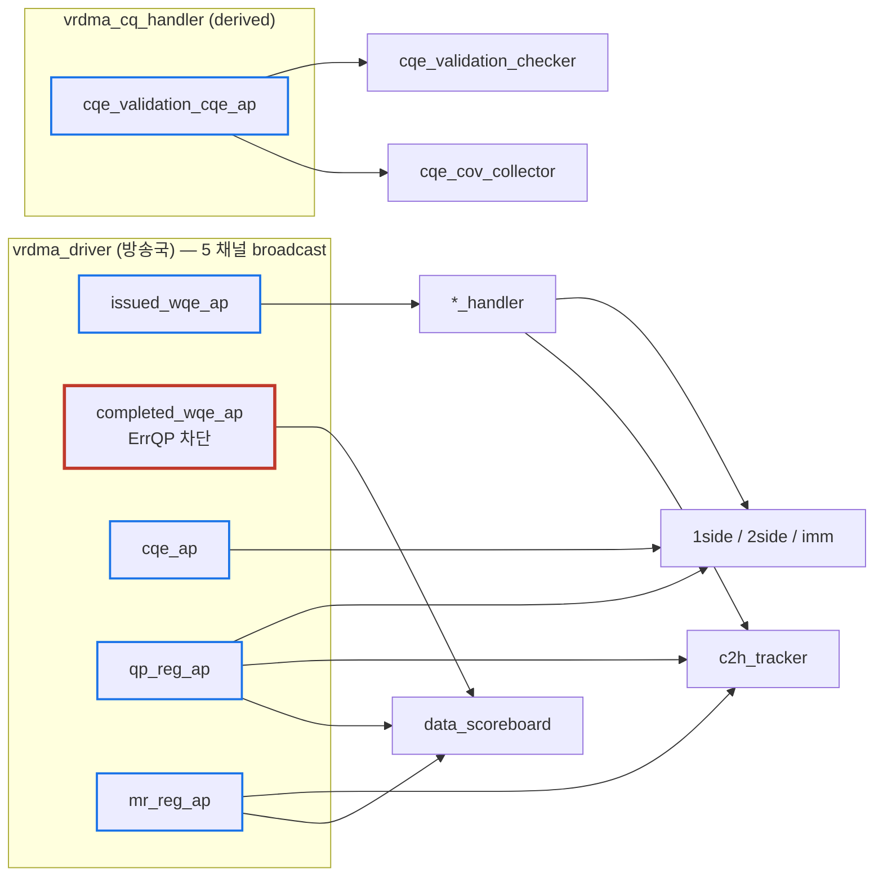
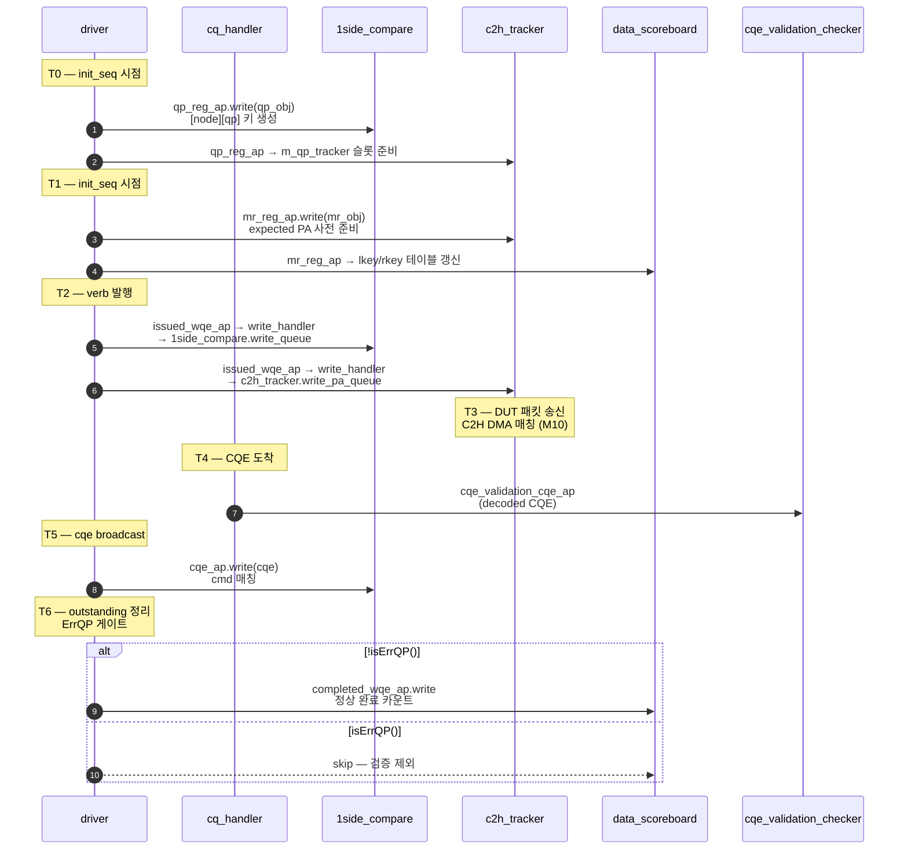
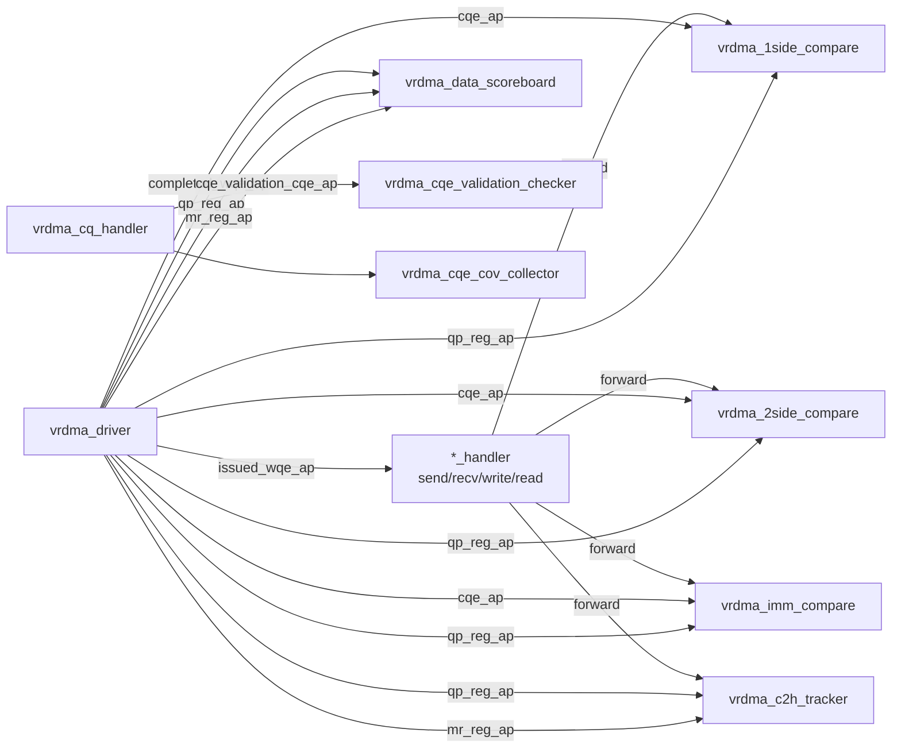

# Module 04 — Analysis Port Topology

<!-- DV-SKOOL-CH-CTX:start -->
<div class="chapter-context" data-cat="network">
  <a class="chapter-back" href="../">
    <span class="chapter-back-arrow">←</span>
    <span class="chapter-back-icon">🧪</span>
    <span class="chapter-back-text">RDMA Verification</span>
  </a>
  <span class="chapter-divider">›</span>
  <span class="chapter-marker">Module 04</span>
</div>
<!-- DV-SKOOL-CH-CTX:end -->

<!-- DV-SKOOL-CH-TOC:start -->
<div class="page-toc">
  <span class="page-toc-label">목차</span>
  <a class="page-toc-link" href="#1-why-care-이-모듈이-왜-필요한가">1. Why care?</a>
  <a class="page-toc-link" href="#2-intuition-방송국--구독자">2. Intuition</a>
  <a class="page-toc-link" href="#3-작은-예-한-wqe-가-driver--handler--3-subscriber-로-퍼지는-궤적">3. 작은 예 — WQE 의 1:N 전파</a>
  <a class="page-toc-link" href="#4-일반화-5-ap--derived-ap--errqp-게이트">4. 일반화 — 5 AP + derived + ErrQP gate</a>
  <a class="page-toc-link" href="#5-디테일-각-ap-의-위치-시점-subscriber-매핑">5. 디테일</a>
  <a class="page-toc-link" href="#6-흔한-오해-와-dv-디버그-체크리스트">6. 흔한 오해 + DV 디버그 체크리스트</a>
  <a class="page-toc-link" href="#7-핵심-정리-key-takeaways">7. 핵심 정리</a>
</div>
<!-- DV-SKOOL-CH-TOC:end -->

!!! objective "학습 목표"
    이 모듈을 마치면:

    - **Identify** `vrdma_driver` 가 발행하는 5개 핵심 AP 와 `vrdma_cq_handler` 의 derived AP 를 식별할 수 있다.
    - **Trace** 한 WQE 가 driver→handler→comparator/scoreboard 로 어떻게 전파되는지 추적할 수 있다.
    - **Apply** "기존 데이터를 다시 쓰지 말고 AP 를 구독하라" 원칙 (Module 05 #3) 을 새 컴포넌트 설계에 적용할 수 있다.
    - **Justify** ErrQP 가 `completed_wqe_ap` 에서 차단되는 이유를 설명할 수 있다.

!!! info "사전 지식"
    - [Module 02 — Component 계층](02_component_hierarchy.md) (driver / cq_handler 위치)
    - UVM TLM analysis port — 1:N broadcast, `analysis_export`, `analysis_imp`

---

## 1. Why care? — 이 모듈이 왜 필요한가

RDMA-TB 의 모든 횡단 검증 (comparator, tracker, scoreboard) 은 **driver/handler 가 broadcasting 하는 AP** 를 구독해서 동작합니다. AP 토폴로지를 알면 새 검증 컴포넌트 추가 시 어디에 tap 할지 결정할 수 있고, 디버깅 시 어느 단계에서 데이터가 끊겼는지 거꾸로 추적할 수 있습니다.

이 모듈을 건너뛰면 새 컴포넌트 작성 시 driver 내부에 hook 을 끼워 넣게 되어 [Module 05 4원칙](05_extension_principles.md) 을 동시 위반합니다. AP 5종 + 1 derived 만 외워두면 모든 후속 검증 컴포넌트의 위치가 자연스럽게 결정됩니다.

---

## 2. Intuition — 방송국 + 구독자

!!! tip "💡 한 줄 비유"
    Driver = **방송국**. WQE 발행 / 완료 / CQE / QP 등록 / MR 등록 — 5 채널을 항상 송출. <br>
    Comparator/Tracker/Scoreboard = **구독자**. 자기가 관심 있는 채널만 골라서 청취. <br>
    Handler = **편집국**. 한 채널 (issued WQE) 을 받아 opcode 별로 sub-구독자에게 분배 (write / read / send / recv). <br>
    핵심: 방송국은 누가 듣는지 모르고, 구독자가 더해져도 방송국 코드는 안 변함.

### 한 장 그림 — 5 AP + derived AP



### 왜 이 디자인인가 — Design rationale

세 가지가 동시에 풀려야 했습니다.

1. **새 검증 컴포넌트 추가가 비침투적이어야** → AP 1:N broadcast → 새 subscriber 만 추가, driver 코드 불변.
2. **데이터 중복 계산 금지** → driver 가 이미 갖고 있는 정보 (cmd, cqe, qp, mr) 를 그대로 broadcast → DRY.
3. **ErrQP 의 WQE 가 정상 검증 대상에서 빠져야** → driver 가 `completed_wqe_ap.write` 를 ErrQP 에 한해 skip → scoreboard 가 자동으로 검증 제외.

이 세 요구의 교집합이 5 AP + ErrQP 게이트입니다.

---

## 3. 작은 예 — 한 WQE 가 driver → handler → 3 subscriber 로 퍼지는 궤적

`RDMAWrite` 한 번이 발행될 때 5 AP 의 어느 채널이 어느 시점에 어디로 가는지.



### 단계별 의미

| Step | 누가 | 무엇을 | 왜 |
|---|---|---|---|
| T0 | driver | qp_reg_ap.write | comparator 가 미리 [node][qp] 슬롯 준비 — verb 도착 전에 |
| T1 | driver | mr_reg_ap.write | c2h_tracker 가 IOVA→PA 사전 변환, scoreboard 가 lkey/rkey 테이블 갱신 |
| T2 | driver | issued_wqe_ap.write | handler 가 opcode 보고 1side_compare / c2h_tracker 로 분기 |
| T4 | cq_handler | cqe_validation_cqe_ap.write | derived AP — decoded CQE 만 별도 broadcast |
| T5 | driver | cqe_ap.write | comparator 가 cqe-cmd 매칭 |
| T6 | driver | completed_wqe_ap.write (게이트 통과 시) | scoreboard 가 정상 완료 카운트 |

!!! note "여기서 잡아야 할 두 가지"
    **(1) 한 verb 가 5 AP 에 _서로 다른 시점에_ 등장** — qp/mr_reg_ap 는 init 시점, issued/cqe/completed_wqe_ap 는 main 시점. 디버그 시 "어느 AP 가 비었나?" 를 시점별로 봐야 함.<br>
    **(2) ErrQP 게이트는 `completed_wqe_ap` 에만 적용** — issued/cqe_ap 는 그대로 broadcast. comparator 는 cqe 받지만 cmd-cqe 매칭이 ErrQP 의 경우 자동 skip.

---

## 4. 일반화 — 5 AP + derived AP + ErrQP 게이트

### 4.1 Driver 의 5 핵심 AP

```systemverilog
// lib/base/component/env/agent/driver/vrdma_driver.svh:56-61
uvm_analysis_export #(vrdma_base_command) issued_wqe_ap;    //Issued WQE
uvm_analysis_export #(vrdma_base_command) completed_wqe_ap; //Completed WQE
uvm_analysis_export #(vrdma_cqe_object)   cqe_ap;           //CQEs
uvm_analysis_export #(vrdma_qp)           qp_reg_ap;        //QP Register
uvm_analysis_export #(vrdma_mr)           mr_reg_ap;        //MR Register
```

| AP | 무엇을 broadcast | 발행 시점 |
|----|------------------|---------|
| `issued_wqe_ap` | 발행된 WQE (cmd 객체) | driver 가 SQ 에 WQE 를 push 한 직후 (`vrdma_driver.svh:1195`) |
| `completed_wqe_ap` | 완료된 WQE | CQE 도착 + outstanding 클리어 시 (`vrdma_driver.svh:1327`) — **단, ErrQP 는 skip** |
| `cqe_ap` | CQE 디코드 결과 | cq_handler 가 CQE 를 분류하면서 |
| `qp_reg_ap` | 등록된 QP 객체 | `RDMAQPCreate` 마지막 단계 (`vrdma_driver.svh:638`) |
| `mr_reg_ap` | 등록/재등록된 MR | `RDMAMRRegister` 시 (`:725`, `:824`) |

### 4.2 CQ Handler 의 derived AP

```systemverilog
// lib/base/component/env/agent/handler/vrdma_cq_handler.svh
// (조건부) cqe_validation_cqe_ap — 디코딩된 CQE 를 cqe_validation_checker 로 전달
```

### 4.3 Subscriber 매핑



이 그림이 디버깅의 지도입니다:

- `E-SB-MATCH-*` (data mismatch) → comparator 가 잘못된 데이터를 봤거나 받지 못함 → driver→handler 단계 확인
- `F-C2H-MATCH-*` (PA 매칭 실패) → c2h_tracker 가 expected PA 큐를 만들지 못함 → `mr_reg_ap` / `qp_reg_ap` 가 도달했는지 확인
- `F-CQHDL-TBERR-0003` (Unexpected error CQE) → cq_handler 단계의 분류 실패 → cqe 의 wc_status 확인

### 4.4 Stateless `*_handler` 의 역할

`*_handler` (send/recv/write/read) 는 **stateless forwarder** 입니다. 즉:

```
issued_wqe_ap → write_handler → 1side_compare(write 큐), c2h_tracker(write 추적)
issued_wqe_ap → send_handler → 2side_compare(send 큐), imm_compare(immdt 큐)
...
```

handler 가 cmd 의 opcode 에 따라 라우팅만 합니다 — 자체 state 는 보유하지 않습니다.

> 이 분리가 중요한 이유: handler 에 state 를 추가하면 시퀀스 재사용·flush 시 stale state 가 누적됩니다. 자세한 이유는 [Module 05](05_extension_principles.md) #4 참고.

---

## 5. 디테일 — 각 AP 의 위치, 시점, subscriber 매핑

### 5.1 Driver 가 WQE 를 broadcast 하는 두 시점

```systemverilog
// (1) Issue 시점 — driver 가 WQE 를 SQ 에 push 한 직후
this.issued_wqe_ap.write(cmd);
// vrdma_driver.svh:1195

// (2) Complete 시점 — CQE 도착으로 outstanding 정리 후
if(!t_qp.isErrQP())
  this.completed_wqe_ap.write(cmd);
// vrdma_driver.svh:1327
```

`isErrQP()` gate 가 핵심입니다. ErrQP 의 WQE 는 `completed_wqe_ap` 로 전달되지 않으므로 scoreboard 가 검증 대상에서 제외합니다. 이 동작이 [Module 06](06_error_handling_path.md) 의 정합성 보장 메커니즘입니다.

### 5.2 CQ Handler 의 분류

```systemverilog
// vrdma_cq_handler.svh:217-223 (개념)
cmd.error_occured = 1;
this.drv.qp[cqe.local_qid].setErrState(1);
```

에러 CQE 가 도착하면 cmd 와 QP 모두에 에러 마킹 → driver 의 모든 후속 처리가 ErrQP 경로로 진입.

### 5.3 Comparator 가 AP 를 구독하는 코드 (개념)

```systemverilog
// vrdma_data_env build_phase 내:
drv.issued_wqe_ap.connect(this.write_subscriber.analysis_export);
drv.completed_wqe_ap.connect(this.write_subscriber.analysis_export);
drv.qp_reg_ap.connect(this.qp_subscriber.analysis_export);
```

### 5.4 새 컴포넌트가 이 토폴로지를 활용하는 패턴

| 새 요구 | 어떤 AP 구독 | 비고 |
|--------|--------------|------|
| 새 protocol 모니터로 WQE 시퀀스 검증 | `issued_wqe_ap` | 발행 순서대로 |
| 성능 카운터로 latency 측정 | `issued_wqe_ap` (start) + `completed_wqe_ap` (end) | timestamp 차이 |
| 새 CQE coverage collector | `cqe_ap` (raw) 또는 `cqe_validation_cqe_ap` (decoded) | 목적에 맞춰 |
| 새 리소스 lifecycle 모니터 | `qp_reg_ap` / `mr_reg_ap` | re-register 추적 시 `gen_id` 함께 |
| 새 에러 분석기 | `cqe_validation_cqe_ap` + sequencer.`wc_error_status` | 에러 분류 후 |

> 이 표는 Confluence "Adding New Components" 의 DRY 원칙 (#3) 을 그라운딩한 것입니다.

---

## 6. 흔한 오해 와 DV 디버그 체크리스트

### 흔한 오해

!!! danger "❓ 오해 1 — '내가 필요한 데이터는 driver 안에 있으니 driver 에 hook 추가하자'"
    **실제**: driver 가 이미 5 AP 로 broadcasting 하고 있음. hook 추가는 (1) Open-Closed 위반 (driver 코드 변경), (2) DRY 위반 (이미 있는 정보 재계산), (3) Interface Stability 위험 (port 시그니처가 흔들림) — 3 원칙 동시 위반. AP 구독으로 해결.<br>
    **왜 헷갈리는가**: "내부 변수 한 줄만 출력하면 빠르다" 는 short-cut 본능.

!!! danger "❓ 오해 2 — '`issued_wqe_ap` = `completed_wqe_ap` 와 같다'"
    **실제**: 발행 시점과 완료 시점이 다르고, **ErrQP 의 경우 issued 는 broadcast 되지만 completed 는 차단**. latency 측정 시 두 시각 차이를 찾는 것은 의도된 사용 — 같은 AP 가 아님.

!!! danger "❓ 오해 3 — 'cqe_ap 와 cqe_validation_cqe_ap 는 동일'"
    **실제**: `cqe_ap` 는 driver 의 raw CQE (validation 전), `cqe_validation_cqe_ap` 는 cq_handler 의 decoded CQE (validation 후). 새 cov collector 는 후자, comparator 는 전자.

!!! danger "❓ 오해 4 — 'qp_reg_ap 는 main_phase 에서 발행된다'"
    **실제**: `RDMAQPCreate` 시점에 발행 — 보통 `vrdma_init_seq` (post_configure_phase) 에서. comparator 는 main verb 도착 전에 [node][qp] 슬롯이 만들어져 있어야 함. 디버그 시 init_seq 가 정상 실행됐는지 먼저 확인.

!!! danger "❓ 오해 5 — 'ErrQP 게이트는 모든 AP 에 적용된다'"
    **실제**: 게이트는 **`completed_wqe_ap` 만**. issued / cqe / qp_reg / mr_reg 는 그대로 broadcast. 이 비대칭이 의도 — comparator 는 issued 와 cqe 로 매칭하지만 scoreboard 의 정상 완료 카운트는 ErrQP 제외.

### DV 디버그 체크리스트

| 증상 | 1차 의심 | 어디 보나 |
|---|---|---|
| `E-SB-MATCH-*` (data mismatch) | comparator 가 잘못된 데이터 또는 못 받음 | driver→handler 단계 확인, `issued_wqe_ap.write` 호출 추적 |
| `F-C2H-MATCH-*` (PA 매칭 실패) | c2h_tracker 가 expected PA 큐 못 만듦 | `mr_reg_ap`/`qp_reg_ap` 가 도달했는지 (init_seq 정상?) |
| `F-CQHDL-TBERR-0003` (Unexpected error CQE) | cq_handler 단계 분류 실패 | cqe 의 wc_status, expected_error 플래그 |
| 새 cov collector 가 샘플링 안 됨 | AP connect 누락 | env 의 connect_phase 에서 `connect()` 호출 |
| comparator 가 [node][qp] 키 만듦 실패 | qp_reg_ap 가 init 시점에 안 도달 | `RDMAQPCreate` 호출 후 driver 의 `qp_reg_ap.write(Q)` 위치 |
| MR 등록인데 c2h_tracker 가 expected PA 비어있음 | mr_reg_ap connect 누락 | c2h_tracker 의 build_phase / connect_phase |
| ErrQP 인데 scoreboard 가 검증 시도 | `isErrQP()` 게이트 우회 | `vrdma_driver.svh:1327` 의 if 분기 |

---

## 7. 핵심 정리 (Key Takeaways)

- driver 가 5 AP (`issued/completed_wqe`, `cqe`, `qp_reg`, `mr_reg`) 를 broadcasting 한다.
- cq_handler 는 디코딩된 CQE 를 별도 AP 로 derived broadcasting 한다.
- comparator/tracker/scoreboard 는 모두 이 AP 의 subscriber.
- 새 검증 컴포넌트는 기존 AP 를 구독해야지 driver/handler 내부에 새 코드를 끼워서는 안 된다.
- ErrQP 는 `completed_wqe_ap` 로 전달되지 않는다 — 이 gate 가 정합성 검증의 정확성을 보장한다.

!!! warning "실무 주의점"
    - AP connect 는 env 의 connect_phase 에서 — build_phase 에서 시도하면 component 미인스턴스화로 fail.
    - `qp_reg_ap` / `mr_reg_ap` 는 **init_seq** 시점에 발행 — main verb 보다 먼저 도달해야 comparator 의 [node][qp] 키 준비됨.

---

## 다음 모듈

→ [Module 05 — Adding New Components 4원칙](05_extension_principles.md): 위 토폴로지를 안전하게 확장하는 4 가지 원칙.

[퀴즈 풀어보기 →](quiz/04_analysis_port_topology_quiz.md)


--8<-- "abbreviations.md"
