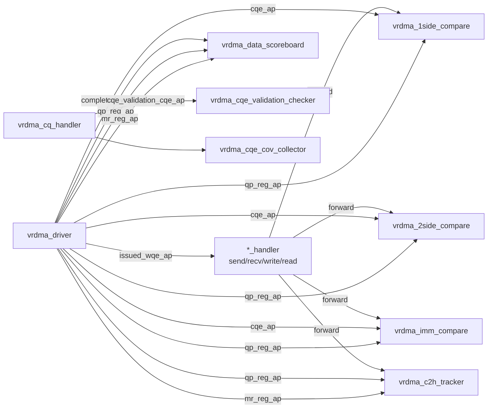

# Module 04 — Analysis Port Topology

<!-- DV-SKOOL-CH-CTX:start -->
<div class="chapter-context" data-cat="network">
  <a class="chapter-back" href="../">
    <span class="chapter-back-arrow">←</span>
    <span class="chapter-back-icon">🧪</span>
    <span class="chapter-back-text">RDMA Verification</span>
  </a>
  <span class="chapter-divider">›</span>
  <span class="chapter-marker">Module 04</span>
</div>
<!-- DV-SKOOL-CH-CTX:end -->

!!! objective "학습 목표"
    이 모듈을 마치면:

    - **Identify** `vrdma_driver` 가 발행하는 5개 핵심 AP 와 `vrdma_cq_handler` 의 derived AP 를 식별할 수 있다.
    - **Trace** 한 WQE 가 driver→handler→comparator/scoreboard 로 어떻게 전파되는지 추적할 수 있다.
    - **Apply** "기존 데이터를 다시 쓰지 말고 AP 를 구독하라" 원칙(Module 05 #3)을 새 컴포넌트 설계에 적용할 수 있다.

## 왜 이 모듈이 중요한가
RDMA-TB 의 모든 횡단 검증(comparator, tracker, scoreboard)은 **driver/handler 가 broadcasting 하는 AP** 를 구독해서 동작합니다. AP 토폴로지를 알면 새 검증 컴포넌트 추가 시 어디에 tap 할지 결정할 수 있고, 디버깅 시 어느 단계에서 데이터가 끊겼는지 거꾸로 추적할 수 있습니다.

## 핵심 개념

### 1. Driver 의 5개 AP

```systemverilog
// lib/base/component/env/agent/driver/vrdma_driver.svh:56-61
uvm_analysis_export #(vrdma_base_command) issued_wqe_ap;    //Issued WQE
uvm_analysis_export #(vrdma_base_command) completed_wqe_ap; //Completed WQE
uvm_analysis_export #(vrdma_cqe_object)   cqe_ap;           //CQEs
uvm_analysis_export #(vrdma_qp)           qp_reg_ap;        //QP Register
uvm_analysis_export #(vrdma_mr)           mr_reg_ap;        //MR Register
```

| AP | 무엇을 broadcast | 발행 시점 |
|----|------------------|---------|
| `issued_wqe_ap` | 발행된 WQE (cmd 객체) | driver 가 SQ 에 WQE 를 push 한 직후 (`vrdma_driver.svh:1195`) |
| `completed_wqe_ap` | 완료된 WQE | CQE 도착 + outstanding 클리어 시 (`vrdma_driver.svh:1327`) — **단, ErrQP 는 skip** |
| `cqe_ap` | CQE 디코드 결과 | cq_handler 가 CQE 를 분류하면서 |
| `qp_reg_ap` | 등록된 QP 객체 | `RDMAQPCreate` 마지막 단계 (`vrdma_driver.svh:638`) |
| `mr_reg_ap` | 등록/재등록된 MR | `RDMAMRRegister` 시 (`:725`, `:824`) |

### 2. CQ Handler 의 derived AP

```systemverilog
// lib/base/component/env/agent/handler/vrdma_cq_handler.svh
// (조건부) cqe_validation_cqe_ap — 디코딩된 CQE 를 cqe_validation_checker 로 전달
```

### 3. Subscriber 매핑



이 그림이 디버깅의 지도입니다:

- `E-SB-MATCH-*` (data mismatch) → comparator 가 잘못된 데이터를 봤거나 받지 못함 → driver→handler 단계 확인
- `F-C2H-MATCH-*` (PA 매칭 실패) → c2h_tracker 가 expected PA 큐를 만들지 못함 → `mr_reg_ap` / `qp_reg_ap` 가 도달했는지 확인
- `F-CQHDL-TBERR-0003` (Unexpected error CQE) → cq_handler 단계의 분류 실패 → cqe 의 wc_status 확인

### 4. Stateless `*_handler` 의 역할

`*_handler` (send/recv/write/read) 는 **stateless forwarder** 입니다. 즉:

```
issued_wqe_ap → write_handler → 1side_compare(write 큐), c2h_tracker(write 추적)
issued_wqe_ap → send_handler → 2side_compare(send 큐), imm_compare(immdt 큐)
...
```

handler 가 cmd 의 opcode 에 따라 라우팅만 합니다 — 자체 state 는 보유하지 않습니다.

> 이 분리가 중요한 이유: handler 에 state 를 추가하면 시퀀스 재사용·flush 시 stale state 가 누적됩니다. 자세한 이유는 [Module 05](05_extension_principles.md) #4 참고.

## 코드 walkthrough

### Driver 가 WQE 를 broadcast 하는 두 시점

```systemverilog
// (1) Issue 시점 — driver 가 WQE 를 SQ 에 push 한 직후
this.issued_wqe_ap.write(cmd);
// vrdma_driver.svh:1195

// (2) Complete 시점 — CQE 도착으로 outstanding 정리 후
if(!t_qp.isErrQP())
  this.completed_wqe_ap.write(cmd);
// vrdma_driver.svh:1327
```

`isErrQP()` gate 가 핵심입니다. ErrQP 의 WQE 는 `completed_wqe_ap` 로 전달되지 않으므로 scoreboard 가 검증 대상에서 제외합니다. 이 동작이 [Module 06](06_error_handling_path.md) 의 정합성 보장 메커니즘입니다.

### CQ Handler 의 분류
```systemverilog
// vrdma_cq_handler.svh:217-223 (개념)
cmd.error_occured = 1;
this.drv.qp[cqe.local_qid].setErrState(1);
```
에러 CQE 가 도착하면 cmd 와 QP 모두에 에러 마킹 → driver 의 모든 후속 처리가 ErrQP 경로로 진입.

### Comparator 가 AP 를 구독하는 코드 (개념)
```systemverilog
// vrdma_data_env build_phase 내:
drv.issued_wqe_ap.connect(this.write_subscriber.analysis_export);
drv.completed_wqe_ap.connect(this.write_subscriber.analysis_export);
drv.qp_reg_ap.connect(this.qp_subscriber.analysis_export);
```

## 새 컴포넌트가 이 토폴로지를 활용하는 패턴

| 새 요구 | 어떤 AP 구독 | 비고 |
|--------|--------------|------|
| 새 protocol 모니터로 WQE 시퀀스 검증 | `issued_wqe_ap` | 발행 순서대로 |
| 성능 카운터로 latency 측정 | `issued_wqe_ap` (start) + `completed_wqe_ap` (end) | timestamp 차이 |
| 새 CQE coverage collector | `cqe_ap` (raw) 또는 `cqe_validation_cqe_ap` (decoded) | 목적에 맞춰 |
| 새 리소스 lifecycle 모니터 | `qp_reg_ap` / `mr_reg_ap` | re-register 추적 시 `gen_id` 함께 |
| 새 에러 분석기 | `cqe_validation_cqe_ap` + sequencer.`wc_error_status` | 에러 분류 후 |

> 이 표는 Confluence "Adding New Components" 의 DRY 원칙(#3)을 그라운딩한 것입니다.

## 핵심 정리

- driver 가 5개 AP (`issued/completed_wqe`, `cqe`, `qp_reg`, `mr_reg`) 를 broadcasting 한다.
- cq_handler 는 디코딩된 CQE 를 별도 AP 로 derived broadcasting 한다.
- comparator/tracker/scoreboard 는 모두 이 AP 의 subscriber.
- 새 검증 컴포넌트는 기존 AP 를 구독해야지 driver/handler 내부에 새 코드를 끼워서는 안 된다.
- ErrQP 는 `completed_wqe_ap` 로 전달되지 않는다 — 이 gate 가 정합성 검증의 정확성을 보장한다.

## 다음 모듈
[Module 05 — Adding New Components 4원칙](05_extension_principles.md): 위 토폴로지를 안전하게 확장하는 4가지 원칙.

[퀴즈 풀어보기 →](quiz/04_analysis_port_topology_quiz.md)
