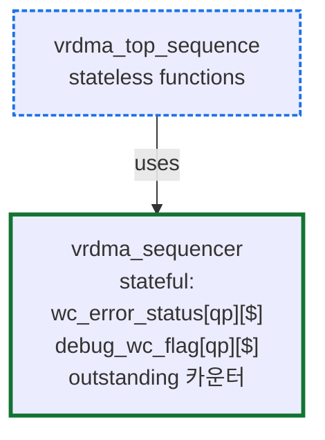

# Module 05 — Adding New Components: 4원칙

<!-- DV-SKOOL-CH-CTX:start -->
<div class="chapter-context" data-cat="network">
  <a class="chapter-back" href="../">
    <span class="chapter-back-arrow">←</span>
    <span class="chapter-back-icon">🧪</span>
    <span class="chapter-back-text">RDMA Verification</span>
  </a>
  <span class="chapter-divider">›</span>
  <span class="chapter-marker">Module 05</span>
</div>
<!-- DV-SKOOL-CH-CTX:end -->

<!-- DV-SKOOL-CH-TOC:start -->
<div class="page-toc">
  <span class="page-toc-label">목차</span>
  <a class="page-toc-link" href="#1-why-care-이-모듈이-왜-필요한가">1. Why care?</a>
  <a class="page-toc-link" href="#2-intuition-건축-증축의-네-규칙">2. Intuition</a>
  <a class="page-toc-link" href="#3-작은-예-congestion-monitor-추가의-올바른-경로-vs-잘못된-경로">3. 작은 예 — CC monitor 추가</a>
  <a class="page-toc-link" href="#4-일반화-4-원칙과-그-인과-관계">4. 일반화 — 4 원칙</a>
  <a class="page-toc-link" href="#5-디테일-각-원칙-자세히-체크리스트-케이스-스터디">5. 디테일</a>
  <a class="page-toc-link" href="#6-흔한-오해-와-dv-디버그-체크리스트">6. 흔한 오해 + DV 디버그 체크리스트</a>
  <a class="page-toc-link" href="#7-핵심-정리-key-takeaways">7. 핵심 정리</a>
</div>
<!-- DV-SKOOL-CH-TOC:end -->

!!! objective "학습 목표"
    이 모듈을 마치면:

    - **Apply** Open-Closed / Interface Stability / DRY via AP / Stateless 보존 원칙을 새 컴포넌트 설계에 적용할 수 있다.
    - **Evaluate** 어떤 변경이 기존 컴포넌트를 침투 (intrusive) 하는지 평가할 수 있다.
    - **Justify** state 가 sequence 가 아니라 sequencer 에 있어야 하는 이유를 설명할 수 있다.
    - **Distinguish** stateless 클래스 (handler, top_sequence) 와 stateful 클래스 (sequencer, driver) 를 구분할 수 있다.

!!! info "사전 지식"
    - [Module 02 — Component 계층](02_component_hierarchy.md) (handler stateless 의 의도)
    - [Module 04 — Analysis Port Topology](04_analysis_port_topology.md) (1:N broadcast)
    - SOLID 원칙 중 Open-Closed 의 일반 개념

---

## 1. Why care? — 이 모듈이 왜 필요한가

RDMA-TB 는 수십 명이 동시에 변경하는 코드베이스입니다. "기존 동작을 바꾸지 않으면서 새 기능을 추가한다" 는 규율이 깨지면 회귀 (regression) 가 폭증합니다. 이 4 원칙은 그 규율을 명문화한 것입니다.

이 모듈을 건너뛰면 "내가 필요한 정보는 driver 안에 있으니 driver 안에 hook 추가하자" 같은 short-cut 이 반복돼 base TB 가 점점 깨집니다. 4 원칙을 잡으면 PR 리뷰가 "이 변경이 4 원칙 중 어느 것을 위반?" 으로 자동화됩니다.

> Confluence 출처: [Adding New Components](https://mangoboost.atlassian.net/wiki/spaces/RDMADV/pages/1333297423/Adding+New+Components)

---

## 2. Intuition — 건축 증축의 네 규칙

!!! tip "💡 한 줄 비유"
    RDMA-TB 확장 ≈ **임대 빌딩에 사무실 한 칸 더 짓기**.<br>
    ① **기존 건물 안 부수기** (Open-Closed) — 새 사무실은 옆에 짓는다.<br>
    ② **공용 통로 변경 금지** (Interface Stability) — 복도 폭이 바뀌면 모든 입주자 영향.<br>
    ③ **기존 방송 청취하기** (DRY via AP) — 빌딩 인터컴이 이미 송출 중이면 새 스피커 달기.<br>
    ④ **공용공간에 짐 두지 않기** (Stateless 보존) — 복도 (handler) 에 가구 두면 모두가 걸려 넘어진다.

### 한 장 그림 — 4 원칙이 막는 것

| 원칙 | ✗ 위반 (안티패턴) | ✓ 준수 (올바른 경로) |
|------|------------------|---------------------|
| 1. Open-Closed | driver 안에 `if(cc_enabled)` hook | `vrdma_cc_monitor` 새 컴포넌트 추가 |
| 2. Interface Stability | AP 시그니처 타입 변경 | object 에 필드 추가, 새 AP 추가 |
| 3. DRY via AP | driver 내부 변수 직접 read | 기존 AP 구독 |
| 4. Stateless 보존 | handler 에 카운터 추가 | sequencer 또는 새 stateful subscriber |

### 왜 이 디자인인가 — Design rationale

세 가지가 동시에 풀려야 했습니다.

1. **PR 영향 범위 최소화** — 한 명의 변경이 다른 검증을 깨면 안 됨 → 기존 코드 불변 + AP 1:N broadcast.
2. **확장 비용 일정** — 새 검증 컴포넌트 추가 비용이 시간이 갈수록 늘면 안 됨 → object 기반 통신, 새 component 만 작성.
3. **State 오염 차단** — 시퀀스 / 멀티노드 / reset 시 stale state 가 발생하면 디버깅 비용 폭증 → stateless 클래스 명시 + state ownership 일원화.

이 세 요구의 교집합이 4 원칙입니다.

---

## 3. 작은 예 — Congestion monitor 추가의 올바른 경로 vs 잘못된 경로

요구사항: "Congestion control 이벤트 (RTT, ECN, NACK) 를 모니터링하는 컴포넌트를 추가하라."

### 잘못된 경로 (4 원칙 위반)

```
   ✗ Step 1 (Open-Closed 위반): vrdma_driver 의 run_phase 에 다음 추가
            if(cc_enabled) cc_log[$].push_back(...);
   ✗ Step 2 (DRY 위반): completion 정보를 driver 내부에서 cc_log 에 다시 기록 — 이미 completed_wqe_ap 가 있는데
   ✗ Step 3 (Interface 위반): cqe_ap 의 시그니처를 #(vrdma_cqe_object) → #(vrdma_cqe_with_cc) 로 변경
   ✗ Step 4 (Stateless 위반): write_handler 에 RTT 누적 변수 추가
```

결과: base TB 의 4 파일 (driver, cqe object, write_handler, env) 변경 → 모든 정상 테스트 회귀 의심.

### 올바른 경로 (4 원칙 준수)

| Step | 원칙 적용 | 행동 |
|---|---|---|
| ① | Open-Closed | `lib/ext/component/congestion_control/` 디렉토리에 새 컴포넌트 `vrdma_cc_monitor` 추가. base TB 한 줄도 안 변함. |
| ② | DRY via AP | `vrdma_cc_monitor` 가 `drv.completed_wqe_ap`, `cq_handler.cqe_validation_cqe_ap` 를 구독 |
| ③ | Interface Stability | 기존 AP 시그니처 불변. 필요한 cc 정보가 cqe object 에 없으면 cqe object 에 _필드 추가_ (시그니처 그대로) |
| ④ | Stateless 보존 | RTT 누적 / ECN 카운트는 `vrdma_cc_monitor` 자체에 보유 — handler 에 절대 추가 안 함 |
| ⑤ | Opt-in | cfg 의 `enable_cc_monitor` 플래그로 enable. 끄면 base TB 와 동일 동작 |

```c
// 잘못된 경로 (driver 침투)                         |  올바른 경로 (AP 구독)
                                                    |
class vrdma_driver extends ...;                     |  class vrdma_cc_monitor extends uvm_component;
   ...                                              |     uvm_analysis_imp_decl(_completed)
   if(cc_enabled)                                   |     uvm_analysis_imp_decl(_cqe_val)
     cc_log[$].push_back(latency_calc(cmd));        |     ...
   ...                                              |     function void connect_phase(uvm_phase phase);
endclass                                            |       drv.completed_wqe_ap.connect(this.completed_imp);
                                                    |       cqh.cqe_validation_cqe_ap.connect(this.cqe_val_imp);
                                                    |     endfunction
                                                    |     // RTT 누적은 이 컴포넌트 안에서만
                                                    |  endclass
```

!!! note "여기서 잡아야 할 두 가지"
    **(1) 4 원칙은 _서로 결합_** — 한 원칙 위반은 보통 다른 원칙도 끌고 들어옴 (driver 침투 = Open-Closed + DRY + 시그니처 위험 동시).<br>
    **(2) "이 컴포넌트를 제거해도 base TB 가 동작하는가?"** 가 가장 강한 검증. 제거 시 base 가 깨지면 침투했다는 증거.

---

## 4. 일반화 — 4 원칙과 그 인과 관계

### 원칙 1 — Open-Closed: 기존 컴포넌트 비침투적 확장

**규칙**: 기존 연결 구조 (topology) 를 수정하지 않고 새 컴포넌트를 추가한다. 새 컴포넌트가 추가된다고 해서 기존 컴포넌트의 동작이 변경되거나 side-effect 가 발생하면 안 된다.

| 상황 | ✅ 올바른 접근 | ❌ 잘못된 접근 |
|------|----------------|----------------|
| 특정 기능에만 필요한 컴포넌트 | 별도의 연결 구조로 독립 추가 | 기존 env 의 connect_phase 에 조건부 분기 |
| 모든 노드에 공통으로 필요 | 기존 계층에 자연스럽게 통합 | — |
| 기존 데이터 흐름 일부가 필요 | Analysis port 구독으로 tap | 기존 컴포넌트 내부에 새 로직 삽입 |

!!! example "예 — Congestion control 모니터 추가"
    잘못된 접근: `vrdma_driver` 에 `if(cc_enabled) ...` 분기 추가
    올바른 접근: `vrdma_cc_monitor` 라는 새 컴포넌트가 `drv.completed_wqe_ap` 와 `cq_handler.cqe_validation_cqe_ap` 를 구독. driver 코드는 한 줄도 안 변함.

### 원칙 2 — Interface Stability: 안정된 인터페이스 + 객체 기반 통신

**규칙**: 컴포넌트 간 인터페이스 (TLM port/export) 는 고정. 데이터 교환은 transaction object 를 통해서만.

| 변경 방법 | 영향 범위 | 권장? |
|----------|----------|-------|
| Object 에 필드 추가 (`vrdma_base_command` 에 새 필드) | object 만 변경, port 불변 | ✅ |
| 새 transaction class 정의 | 새 컴포넌트만 사용 | ✅ |
| 새 analysis port 추가 | 기존 연결 불변, 새 subscriber 만 | ✅ |
| 기존 port 시그니처 변경 (parameter 타입 변경) | 모든 연결 컴포넌트 수정 필요 | ❌ 금지 |

이 원칙의 결과: AP 시그니처가 한 번 정해지면 "새 필드 추가" 로 진화시키지 "타입 변경" 으로 진화시키지 않습니다.

### 원칙 3 — DRY via Analysis Port Reuse

**규칙**: 동일한 데이터를 생성하는 로직을 중복 구현하지 말고, 기존 컴포넌트의 AP 를 구독해서 재사용한다.

UVM analysis port 는 1:N broadcast 이므로, 새 subscriber 추가는 기존 연결에 영향을 주지 않습니다.

| 기존 AP | 활용 예시 |
|---------|----------|
| `drv.issued_wqe_ap` | 새 protocol 모니터가 WQE 추적 |
| `drv.completed_wqe_ap` | 새 성능 카운터가 latency 측정 |
| `drv.cqe_ap` | 새 커버리지 collector 가 CQE 샘플링 |
| `drv.qp_reg_ap` / `mr_reg_ap` | 새 리소스 모니터가 lifecycle 추적 |
| `cq_handler.cqe_validation_cqe_ap` | 새 에러 분석기가 CQE 필드 검사 |

!!! warning "안티패턴"
    "내가 필요한 데이터는 driver 내부에 있으니 driver 에 직접 hook 을 추가하자" — 이는 DRY 위반 (driver 가 이미 broadcasting 하고 있음) 이자 Open-Closed 위반 (driver 코드 변경).

### 원칙 4 — Stateless 클래스에 State 추가 금지

**규칙**: TB 의 일부 클래스는 의도적으로 **stateless** 로 설계되어 있다. 거기에 state 를 추가하면 예측 불가능한 부작용과 테스트 간 오염이 발생한다.

| 클래스 | 설계 의도 | State 추가 시 문제 |
|--------|----------|-------------------|
| `vrdma_send/recv/write/read_handler` | Stateless forwarder — AP 라우팅만 | flush/reset 누락 시 stale state, 기존 forwarding 경로 side-effect |
| `vrdma_top_sequence` | Stateless function set — body() 없는 유틸리티 | 시퀀스 재사용 시 이전 상태 잔존, 멀티노드 state 공유 문제 |
| `vrdma_data_cqe_handler` | Stateless CQE router — 조건부 forwarding | 라우팅 조건이 내부 state 에 의존 → 비결정적 동작 |

---

## 5. 디테일 — 각 원칙 자세히, 체크리스트, 케이스 스터디

### 5.1 State 가 필요할 때의 올바른 접근

`vrdma_top_sequence` 와 `vrdma_sequencer` 의 관계가 정답입니다.



이 설계가 올바른 4 가지 이유:

1. **Sequence 재사용** — `vrdma_top_sequence` 는 state 가 없으므로 여러 테스트에서 자유롭게 상속/재사용. State 는 sequencer 에 바인딩되어 노드별로 격리.
2. **멀티노드 격리** — 각 노드의 `vrdma_sequencer` 가 독립 state. 시퀀스가 `t_seqr` 를 명시적으로 받으므로 노드 간 오염 없음.
3. **Reset / Flush** — sequencer 의 `flush()` / `clearErrorStatus()` 가 모든 inflight 카운터·에러 큐를 초기화. Sequence 는 flush 대상이 아님.
4. **State 소유권 명확** — "누가 이 state 를 관리하는가?" 가 항상 sequencer 로 귀결. 디버깅 시 단일 지점.

> 코드: `lib/base/component/env/agent/sequencer/vrdma_sequencer.svh:19-20, 36, 75-76, 179-181`

### 5.2 새 컴포넌트 추가 체크리스트

새 컴포넌트를 추가할 때 아래를 확인:

- [ ] 기존 컴포넌트의 `build_phase` / `connect_phase` 를 수정하지 않고 추가 가능한가?
- [ ] 기존 컴포넌트의 내부 로직 (`run_phase`, `EntryPoint` 등) 을 수정하지 않는가?
- [ ] 컴포넌트 간 통신이 Object (transaction) 기반인가?
- [ ] 기존 analysis port 를 재사용할 수 있는데 중복 구현하고 있지는 않은가?
- [ ] Stateless 클래스에 state 를 추가하고 있지는 않은가?
- [ ] 새 컴포넌트를 제거해도 기존 TB 가 정상 동작하는가? (opt-in 구조)

> Confluence 출처: [Adding New Components — 체크리스트](https://mangoboost.atlassian.net/wiki/spaces/RDMADV/pages/1333297423/Adding+New+Components)

### 5.3 케이스 스터디 — Congestion Control 추가

`lib/ext/component/congestion_control/` 가 위 4 원칙의 좋은 사례입니다.

- **Opt-in** — `lib/ext/` 아래 별도 폴더로 분리. cfg 플래그로 enable/disable.
- **AP 구독** — `vrdma_rtt_scoreboard` 가 driver 의 AP 를 구독 (`E-SB-MATCH-0001`, `0003` 메시지가 거기서 발행됨).
- **Stateless 보존** — congestion 트래커는 sequencer 가 아닌 새 컴포넌트가 보유.
- **기존 연결 불변** — base TB 는 한 줄도 변경되지 않음.

---

## 6. 흔한 오해 와 DV 디버그 체크리스트

### 흔한 오해

!!! danger "❓ 오해 1 — '내가 필요한 정보는 driver 안에 있으니 driver 안에 hook 추가하자'"
    **실제**: driver 가 이미 5 AP 로 broadcasting 하고 있다 (M04). hook 추가는 (1) Open-Closed 위반 (driver 코드 변경), (2) DRY 위반 (이미 있는 정보 재계산), (3) Interface Stability 위험 (port 시그니처가 흔들림) — 3 원칙 동시 위반. <br>
    **왜 헷갈리는가**: "한 줄만 추가하면 빠른데" 라는 short-cut 본능.

!!! danger "❓ 오해 2 — 'AP 시그니처를 새 필드 받게 바꿔도 된다'"
    **실제**: 시그니처를 변경하면 모든 connect 지점이 수정 대상 → 빌드 깨짐. **object 에 필드 추가** 가 호환성 보존하는 방법. AP 시그니처는 한 번 정해지면 불변.

!!! danger "❓ 오해 3 — 'top_sequence 에 outstanding 카운터를 두자, 시퀀스가 가까워서 편하다'"
    **실제**: `vrdma_top_sequence` 는 stateless. 시퀀스 재사용 시 이전 state 잔존, 멀티노드 시 공유 문제. state 는 **sequencer 가 owner**. 가까움이 아니라 **소유권 일원화** 가 기준.

!!! danger "❓ 오해 4 — '새 컴포넌트는 lib/base 에 두는 게 깔끔'"
    **실제**: 모든 RDMA IP 인스턴스에 공통으로 필요한 게 아니면 **`lib/ext/`** — opt-in 구조. base 에 추가하면 cfg flag 로 끄지 못해서 모든 테스트에 영향. (M01 의 lib 분류 참고)

!!! danger "❓ 오해 5 — '새 컴포넌트 제거 후 base TB 가 깨지면 통합 잘 된 것이다'"
    **실제**: 정반대. base TB 는 새 컴포넌트 없이도 항상 동작해야 함 — 그래야 opt-in. 제거 시 fail = 침투했다는 증거. PR 리뷰 핵심 질문: "이 컴포넌트 제거 시 어떻게 되나?"

### DV 디버그 체크리스트

| 증상 | 1차 의심 | 어디 보나 |
|---|---|---|
| 새 컴포넌트 추가 후 정상 테스트 회귀 | 기존 컴포넌트 침투 | git diff — driver/handler/env 의 base TB 코드 변경 여부 |
| AP connect 시 type mismatch 빌드 에러 | 시그니처 변경 시도 | `uvm_analysis_export #(...)` 의 parameter — 원본과 비교 |
| 시퀀스 재사용 시 stale state | sequence 에 state 보유 | sequence 클래스 멤버 변수 — sequencer 로 이동 |
| handler 에서 비결정적 동작 | handler 에 state 추가 | handler 클래스 멤버 변수 |
| 새 컴포넌트가 driver 내부 변수 read | DRY 위반 — AP 구독으로 대체 | AP 구독 코드 추가 + driver 내부 read 제거 |
| `lib/ext/` 컴포넌트가 cfg flag 없이 항상 동작 | opt-in 누락 | cfg 의 enable flag 추가, 끄면 base 동등 |
| object 에 새 필드 추가했더니 다른 테스트 실패 | 필드 default 미초기화 또는 randomize 영향 | object constructor / constraint |

---

## 7. 핵심 정리 (Key Takeaways)

- 4 원칙: Open-Closed / Interface Stability / DRY via AP / Stateless 보존.
- 핵심 안티패턴: 기존 컴포넌트 내부 수정 / port 시그니처 변경 / driver 데이터 재계산 / handler 에 state 추가.
- State 가 필요하면 sequencer (또는 별도 stateful subscriber) 에 둔다 — sequence/handler 에 두지 않는다.
- 새 컴포넌트가 제거되어도 기존 TB 는 동작해야 한다 — 제거 가능한가? 가 가장 강한 검증.
- 4 원칙은 결합돼 있다 — 한 원칙 위반은 보통 다른 원칙도 끌고 들어옴.

!!! warning "실무 주의점"
    - PR 리뷰 핵심 질문: "이 컴포넌트 제거 시 base TB 가 동작하는가?"
    - object 필드 추가가 시그니처 변경보다 항상 안전 — 새 필드는 default 초기화 잊지 말기.

---

## 다음 모듈

→ [Module 06 — Error Handling Path](06_error_handling_path.md): 위 4 원칙이 에러 처리 경로에서 어떻게 구현되어 있는지.

[퀴즈 풀어보기 →](quiz/05_extension_principles_quiz.md)


--8<-- "abbreviations.md"
