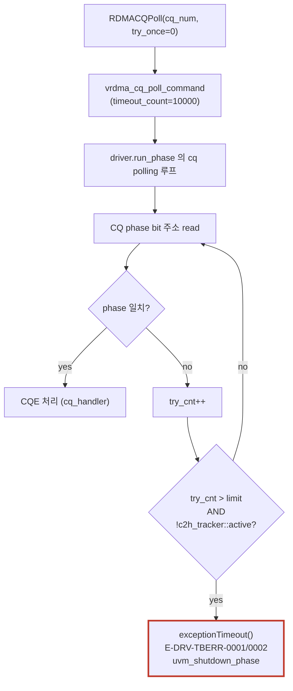

# Module 09 — Debug Case 2: CQ Poll Timeout

<!-- DV-SKOOL-CH-CTX:start -->
<div class="chapter-context" data-cat="network">
  <a class="chapter-back" href="../">
    <span class="chapter-back-arrow">←</span>
    <span class="chapter-back-icon">🧪</span>
    <span class="chapter-back-text">RDMA Verification</span>
  </a>
  <span class="chapter-divider">›</span>
  <span class="chapter-marker">Module 09</span>
</div>
<!-- DV-SKOOL-CH-CTX:end -->

<!-- DV-SKOOL-CH-TOC:start -->
<div class="page-toc">
  <span class="page-toc-label">목차</span>
  <a class="page-toc-link" href="#1-why-care-이-모듈이-왜-필요한가">1. Why care?</a>
  <a class="page-toc-link" href="#2-intuition-답이-안-오는-전화-와-기다림의-두-조건">2. Intuition</a>
  <a class="page-toc-link" href="#3-작은-예-실제-fail-log--qid-3-단계로-원인까지">3. 작은 예 — fail log → 원인</a>
  <a class="page-toc-link" href="#4-일반화-두-조건--5-단계-디버그">4. 일반화 — 두 조건 + 5 단계</a>
  <a class="page-toc-link" href="#5-디테일-에러-id-timeout_count-주기-로그-원인-매트릭스">5. 디테일</a>
  <a class="page-toc-link" href="#6-흔한-오해-와-dv-디버그-체크리스트">6. 흔한 오해 + DV 디버그 체크리스트</a>
  <a class="page-toc-link" href="#7-핵심-정리-key-takeaways">7. 핵심 정리</a>
</div>
<!-- DV-SKOOL-CH-TOC:end -->

!!! objective "학습 목표"
    이 모듈을 마치면:

    - **Recognize** `E-DRV-TBERR-0001/0002` 에러 ID 와 graceful 종료 (`uvm_shutdown_phase`) 흐름을 인식할 수 있다.
    - **Analyze** 타임아웃 두 조건 (`try_cnt > timeout_count` AND `!c2h_tracker::active`) 을 분석할 수 있다.
    - **Apply** Phase bit / Tail pointer / unprocessed wqe 카운트로 5 단계 디버깅을 적용할 수 있다.
    - **Trace** QID 14–17 → 8 → 10/11 → PHASE 순서로 좁혀가는 디버그 경로를 추적할 수 있다.

!!! info "사전 지식"
    - [Module 03 — Phase & Test Flow](03_phase_test_flow.md) (CQ polling 패턴 3 — `cq_handler.RDMACQPoll`)
    - [Module 07 — H2C/C2H QID Reference](07_h2c_c2h_qid_map.md) (QID 14–17 / 8 / 10–11 의 의미)
    - [RDMA Module 06 — Data Path](../../rdma/06_data_path/) (CQ 의 phase bit, tail pointer)

---

## 1. Why care? — 이 모듈이 왜 필요한가

### 1.1 시나리오 — _CQ timeout_ 의 4 갈래

당신의 RDMA test 가 _CQ poll timeout_. DUT 가 _어디서_ 멈춰있나?

4 갈래:
1. **SQ doorbell 미인식**: SW post_send 했는데 _DUT 가 못 봄_.
2. **WQE fetch 안 됨**: doorbell 봤지만 WQE 가져오기 실패 (PCIe DMA 문제).
3. **WQE 처리 시작 안 됨**: WQE fetch OK, 처리 logic 시작 못함.
4. **Completion 안 옴**: 처리 완료, 그런데 CQE 작성 안 됨.

각 분기 _확인 방법_ (QID 기반):
- QID 1 (SQ doorbell): activity 있나?
- QID 4 (WQE fetch C2H): packet 보나?
- QID 5 (WQE result): output 보나?
- QID 6 (CQE write H2C): packet 보나?

각 QID 의 _activity 유무_ 가 _4 갈래 중 어디_ 즉시 결정. _5 분_ 안에 stage 좁힘.

CQ polling 타임아웃은 "DUT 가 내가 보낸 work 를 처리하긴 했나?" 라는 가장 기본적인 질문에 답이 안 오는 상태입니다. 무엇이 멈춘 것인지 (SQ doorbell 미인식 / WQE 처리 시작 안 됨 / completion engine 버그 / phase bit 동기화 실패) 단계적으로 좁혀가야 합니다.

이 모듈을 건너뛰면 timeout 로그를 보고 "DUT 죽었나?" 라는 모호한 가설로 fsdb 를 헤매게 됩니다. 4 가지 QID 분기점만 외우면 5 분 안에 어느 stage 까지 진행됐는지 결정.

> Confluence 출처: [CQ Poll Timeout](https://mangoboost.atlassian.net/wiki/spaces/RDMADV/pages/1335853134/CQ+Poll+Timeout)

---

## 2. Intuition — 답이 안 오는 전화 와 기다림의 두 조건

!!! tip "💡 한 줄 비유"
    CQ Polling ≈ **답이 안 오는 전화**. 한참 기다리지만 (try_cnt 증가) 상대가 _다른 일을 하고 있는지 (c2h_tracker::active)_ 도 함께 봄. 다른 일 하고 있으면 그냥 기다림 — 죽은 게 아님. 다른 일도 안 하면서 답도 안 오면 그제야 타임아웃 선언.

### 한 장 그림 — 두 조건 + 디버그 분기

```d2
direction: down

POLL: "CQ Polling 진행 중"
Q1: "try_cnt > limit?" { shape: diamond }
Q2: "c2h_tracker::active?" { shape: diamond }
WAIT: "기다리기\n(10us 마다 로그)"
HOLD: "무한 지연\n(DUT DMA 살아있음)"
EXC: "exceptionTimeout()\nE-DRV-TBERR-0001/0002\nuvm_shutdown_phase (graceful)"
POLL -> Q1
Q1 -> WAIT: "no"
Q1 -> Q2: "yes"
Q2 -> HOLD: "yes"
Q2 -> EXC: "no"
```

디버그 분기 (4 분기점):

| 관찰 | 가설 |
|------|------|
| H2C 14–17 fetch 0회 | DUT 가 SQ doorbell 못 받음 |
| 14–17 OK, H2C 8 0회 | WQE 처리 시작 안 함 |
| 8 OK, packet 송신 OK, C2H 10/11 0회 | Completion engine 미생성 |
| 10/11 OK, PHASE 불일치 | Phase bit 동기화 실패 |

### 왜 이 디자인인가 — Design rationale

세 가지가 동시에 풀려야 했습니다.

1. **DUT 가 살아있으면 기다림** — c2h_tracker::active 게이트가 false-timeout 차단.
2. **종료가 graceful** — fatal 대신 `uvm_shutdown_phase` 점프 → outstanding 정보 보존.
3. **디버그가 stage 별** — QID 매트릭스로 어느 stage 까지 진행됐는지 1 step 분기.

이 세 요구의 교집합이 두 조건 + 5 단계 디버그입니다.

---

## 3. 작은 예 — 실제 fail log → QID 3 단계로 원인까지

### Fail log

```
[I-DRV-INFO] CQ Polling: CQ=2, Try Count=10, unprocessed wqe=1, address=0x90001000, PHASE=1, TAIL POINTER=0
[I-DRV-INFO] CQ Polling: CQ=2, Try Count=20, unprocessed wqe=1, address=0x90001000, PHASE=1, TAIL POINTER=0
... (10us 간격으로 반복)
[I-DRV-INFO] CQ Polling: CQ=2, Try Count=10000, unprocessed wqe=1, address=0x90001000, PHASE=1, TAIL POINTER=0
[E-DRV-TBERR-0001] CQ POLLING TIMEOUT : Unprocessed CQE  vrdma_driver:1486
```

### Step-by-step root cause

```
   Step 1   에러 ID = E-DRV-TBERR-0001 → CQ poll timeout
            CQ = 2, unprocessed wqe = 1, PHASE = 1, TAIL = 0
              ▶ TB 가 1 개 WQE 발행했는데 CQE 못 받음

   Step 2   c2h_tracker::active 확인
            ─────────────────────────────────────────
            grep "c2h_tracker.*active" run.log | tail
              ▶ 마지막 active = 0 (timeout 가능 상태였음)
              ▶ DUT 가 DMA 끝낸 지 10ms 이상 됨

   Step 3   QID 14 (CMD H2C) — 첫 분기
            ─────────────────────────────────────────
            fsdb: top.dut.qdma_h2c_qid == 14, valid pulse 카운트
              ▶ 1 회 — DUT 가 SQ WQE 받음 OK
              ▶ 다음 분기로

   Step 4   QID 8 (REQ H2C) — 두 번째 분기
            ─────────────────────────────────────────
            fsdb: top.dut.qdma_h2c_qid == 8, valid pulse 카운트
              ▶ 1 회 — DUT 가 source payload fetch OK
              ▶ 다음 분기로

   Step 5   네트워크 패킷 송신 확인
            ─────────────────────────────────────────
            ntw_env 로그: pkt_monitor 가 BTH OpCode=Write_Only 캡처 OK
              ▶ DUT 가 packet 까지 송신함

   Step 6   QID 10/11 (COMP C2H) — 세 번째 분기
            ─────────────────────────────────────────
            fsdb: top.dut.qdma_c2h_qid in {10,11}, valid pulse 카운트
              ▶ 0 회 — Completion engine 이 CQE 안 만듦
              ▶ root cause: DUT completion engine FSM 버그
              ▶ 다음 액션: completion engine 의 trigger 신호 추적
```

### 단계별 의미

| Step | 보는 것 | 발견 | 가설 |
|---|---|---|---|
| 1 | 에러 ID + 로그 | unprocessed wqe=1, PHASE=1, TAIL=0 | TB 발행했지만 CQE 못 받음 |
| 2 | c2h_tracker active | 0 (타임아웃 정당) | DUT DMA 끝남 |
| 3 | QID 14 fetch | 1 회 | SQ doorbell 인식 OK |
| 4 | QID 8 fetch | 1 회 | WQE 처리 시작 OK |
| 5 | packet 송신 | OK | 송신 stage OK |
| 6 | QID 10/11 write | 0 회 | Completion engine 미생성 |

!!! note "여기서 잡아야 할 두 가지"
    **(1) `unprocessed wqe = 1` 인데 timeout** — 만약 0 이면 `signaled` / `sq_sig_type` 카운팅 오류 의심. 1 인데 안 오면 진짜 미생성.<br>
    **(2) c2h_tracker::active 가 1 이면 timeout 자체가 안 발동** — 즉 timeout 로그가 떴다는 건 이미 active=0 이라는 정보. fsdb 시각이 timeout 직전이면 DMA 활동이 멈춘 시각.

---

## 4. 일반화 — 두 조건 + 5 단계 디버그

### 4.1 타임아웃 두 조건 (둘 다 충족해야 발동)

```systemverilog
// vrdma_driver.svh:1484 task exceptionTimeout(); 흐름 (개념)
if((try_cnt > timeout_count) && (!c2h_tracker::active))
  this.exceptionTimeout();
```

| 조건 | 설명 |
|------|-----|
| `try_cnt > timeout_count` | 폴링 반복 횟수 초과 |
| `!c2h_tracker::active` | C2H DMA 활동 없음 (10ms 이상 비활성) |

🔑 **핵심**: c2h_tracker 가 active 인 동안에는 타임아웃이 **무한 지연** 됩니다. DUT 가 DMA 를 계속하고 있으면 타임아웃이 안 납니다.

### 4.2 5 단계 디버깅 절차

| Step | 무엇을 보나 | QID 분기 |
|---|---|---|
| 1 | CQ number, 인스턴스 이름 | 어느 CQ? |
| 2 | DUT WQE 처리 여부 | H2C 14–17 (CMD), H2C 8 (REQ) |
| 3 | CQE 생성 여부 | DUT completion engine FSM |
| 4 | Phase bit 동기 | TB expected PHASE vs DUT actual |
| 5 | c2h_tracker active | 백그라운드 활동 여부 |

QID 분기 순서 — **14–17 → 8 → 10/11 → PHASE**.

---

## 5. 디테일 — 에러 ID, timeout_count, 주기 로그, 원인 매트릭스

### 5.1 대표 에러 메시지

| ID | 심각도 | 메시지 | 코드 위치 |
|----|--------|-------|---------|
| `E-DRV-TBERR-0001` | ERROR | `CQ POLLING TIMEOUT : Unprocessed CQE` | `vrdma_driver.svh:1486` |
| `E-DRV-TBERR-0002` | ERROR | `CQ HANDLER: CQ POLLING TIMEOUT` | `vrdma_driver.svh:1488` |

타임아웃 시 동작: **fatal 이 아니라** `uvm_shutdown_phase` 로 점프하여 graceful 종료 — 그래야 outstanding 진단 정보가 보존됨.

### 5.2 `timeout_count` 기본값

| 호출 위치 | 기본값 | 실효 시간 |
|----------|-------|----------|
| `vrdma_top_sequence::RDMACQPoll` | 50000 | ~50ms |
| `vrdma_sequence::RDMACQPoll` | 10000 | ~10ms |
| `vrdma_cq_poll_command::new()` | 10000 | ~10ms |
| `monitorErrCQ` (try_once=1) | 10000 | 타임아웃 불가 (try_once 면 1회만) |

### 5.3 폴링 중 주기적 로그 (10회마다, 약 10us 간격)

| 필드 | 의미 | 확인 포인트 |
|------|-----|-----------|
| CQ number | 폴링 대상 CQ | 올바른 CQ 인지 |
| Try Count | 폴링 반복 횟수 | timeout_count 와 비교 |
| unprocessed wqe | 미처리 CQE 예상 수 | 0 이면 카운팅 오류 의심 |
| address | CQ phase bit 주소 | DUT 가 쓰는 주소와 일치하는지 |
| PHASE | 기대 phase bit 값 | DUT phase 와 동기 |
| TAIL POINTER | CQ tail pointer 위치 | wrap-around 상태 |

### 5.4 5 단계 디버깅 — 자세히

#### Step 1 — 어떤 CQ 에서 타임아웃인지 확인

- 로그의 `CQ number` 필드, `cq_handler` 인스턴스 이름
- 멀티 CQ 환경이면 어느 CQ 인지 결정

#### Step 2 — DUT 가 WQE 를 처리했는지 확인

- [Module 07 QID](07_h2c_c2h_qid_map.md) 적용:
  - QID 14–17 (`RDMA_CMD_H2C_QID`): WQE descriptor fetch 가 일어났나? — DUT 가 SQ doorbell 인식?
  - QID 8 (`RDMA_REQ_H2C_QID`): Requester payload fetch 가 일어났나? — WQE 처리 시작?
- 둘 다 0 회라면 DUT 가 SQ 자체를 모름

#### Step 3 — CQE 가 생성되었는지 확인

- DUT 내부 completion engine FSM 추적
- 패킷은 나갔지만 CQE 가 안 만들어졌다면 completion 로직 버그 의심

#### Step 4 — Phase bit 동기화 확인

- TB 의 expected `PHASE` vs DUT 가 쓴 phase bit
- CQ depth / wrap-around 후에 phase bit 토글 누락 의심

#### Step 5 — C2H tracker active 상태 확인

- 타임아웃이 fire 했다면 `c2h_tracker::active = 0`
- 그러나 c2h_tracker 가 false-active 상태로 남아 있다면 `monitorErrCQ` (try_once=1) 만 fire 가능

```bash
# 로그 검색 키워드
grep -E "c2h_tracker.*active" run.log | tail -20
```

### 5.5 흔한 원인 매트릭스

| 원인 | 증상 | 확인 방법 |
|------|------|---------|
| DUT WQE 처리 실패 | Outstanding WQE 가 모두 같은 QP | DUT 내부 SQ dequeue 로직 |
| Doorbell 미전달 | WQE 발행 후 첫 CQE 부터 안 옴 | BAR4 SQ_DB 레지스터 쓰기 확인 |
| Completion engine 버그 | 패킷은 나갔는데 CQE 미생성 | DUT completion engine FSM |
| C2H DMA 경로 고장 | CQE 생성됐으나 host memory 미도착 | C2H DMA controller 상태 (QID 10–11) |
| Phase bit 불일치 | 폴링 주소는 맞는데 phase 안 맞음 | CQ depth / wrap 로직 |
| CQ base address 불일치 | 다른 주소에 CQE 기록 | `configure_phase` CQ 설정 vs DUT |
| Error CQE 가 ERR_CQ 로 도착 | 정상 CQ 대신 에러 CQ 에 기록 | `monitorErrCQ` 로그 확인 |
| `unprocessed_cqe_cnt` 불균형 | unsignaled WQE 가 잘못 카운트 | `signaled` / `sq_sig_type` 설정 |

### 5.6 빠른 트리아지 — 한 줄 결정

| 관찰 | 가설 |
|------|------|
| QID 14–17 fetch 없음 | DUT 가 SQ doorbell 인식 못함 — RAL/BAR 추적 |
| QID 14–17 OK, QID 8 없음 | WQE descriptor 는 받았지만 처리 안 함 — DUT WQE parser |
| QID 8 OK, packet 송신 OK, 그러나 CQE QID 10/11 없음 | Completion engine 미생성 |
| QID 10/11 OK, 그러나 PHASE 불일치 | Phase bit 동기화 |
| `unprocessed wqe = 0` 인데 timeout | 카운팅 오류 — `signaled` 설정, sq_sig_type |

### 5.7 폴링 동작 한 줄 흐름



---

## 6. 흔한 오해 와 DV 디버그 체크리스트

### 흔한 오해

!!! danger "❓ 오해 1 — 'try_cnt > timeout_count 만 되면 timeout'"
    **실제**: 두 번째 게이트 `!c2h_tracker::active` 도 충족해야. DUT 가 DMA 활동 중 (active=1) 이면 try_cnt 이 limit 넘어도 timeout 안 발동 — **무한 지연**. 이게 디버그 시 헷갈림.<br>
    **왜 헷갈리는가**: timeout = 시간 초과 라는 일반 직관 때문.

!!! danger "❓ 오해 2 — 'CQ poll timeout 이 fatal 로 끝난다'"
    **실제**: fatal 이 아니라 `uvm_shutdown_phase` 로 graceful 점프. outstanding / unprocessed 정보가 그대로 보존되어 후속 분석 가능. fatal 이면 즉시 종료라 정보 손실.

!!! danger "❓ 오해 3 — '`unprocessed wqe = 0` 인데 timeout 이면 TB 버그'"
    **실제**: 보통 그렇지만 — `signaled=0` (unsignaled WQE) 의 경우 driver 가 CQE 받지 않으니 카운트 안 됨. 이때 `sq_sig_type` 설정에 따라 unprocessed=0 인데 실제로는 미완료 상태일 수 있음.

!!! danger "❓ 오해 4 — 'Phase bit 가 1 이면 CQE 도착'"
    **실제**: TB 의 expected PHASE vs DUT 의 actual PHASE 가 일치해야. wrap-around 시 PHASE 가 토글되어 (0 → 1 → 0 …) DUT 가 토글 누락하면 영영 일치 안 함. CQ depth 와 wrap 로직 점검.

!!! danger "❓ 오해 5 — '에러 CQE 도 정상 CQ 에 도착'"
    **실제**: 에러 CQE 는 보통 별도 ERR_CQ 로 라우팅. `monitorErrCQ` 가 백그라운드로 폴링. 정상 CQ 만 보면 ERR_CQ 의 CQE 누락 — `monitorErrCQ` 로그도 함께 확인.

### DV 디버그 체크리스트

| 증상 | 1차 의심 | 어디 보나 |
|---|---|---|
| `E-DRV-TBERR-0001` 발생 | CQ polling timeout | run.log 의 마지막 주기 로그 (PHASE, TAIL, unprocessed) |
| timeout 이 너무 빨리 / 늦게 발동 | timeout_count 설정 | top_sequence::RDMACQPoll 의 timeout_count vs sequence::RDMACQPoll |
| timeout 안 나는데 CQE 도 안 옴 | c2h_tracker::active 가 계속 1 | `grep c2h_tracker.*active` |
| QID 14–17 fetch 0 회 | SQ doorbell 미전달 | BAR4 SQ_DB write |
| QID 14 OK, QID 8 0 회 | WQE descriptor 처리 안 함 | DUT WQE parser FSM |
| packet 송신 OK, QID 10/11 0 회 | Completion engine 미생성 | DUT completion engine FSM |
| QID 10/11 OK, PHASE 불일치 | Phase bit 토글 누락 | CQ depth / wrap-around |
| `unprocessed wqe = 0` 인데 timeout | signaled 카운팅 오류 | `signaled`, `sq_sig_type` 설정 |
| ERR_CQ 에 CQE 가 도착 | 에러 CQE 잘못 라우팅 | `monitorErrCQ` 로그 + M11 |

---

## 7. 핵심 정리 (Key Takeaways)

- 두 조건이 동시에 만족해야 타임아웃 — `try_cnt > N` AND `c2h_tracker !active`.
- c2h_tracker 가 활동 중이면 타임아웃은 무한 지연 — DUT DMA 가 살아있다는 좋은 신호이지만 timeout 진단을 가린다.
- 디버깅은 `QID 14–17 → 8 → 10/11 → PHASE` 순서대로 좁혀간다.
- 종료는 fatal 이 아니라 graceful (`uvm_shutdown_phase`) — 추가 진단 정보 활용 가능.
- `unprocessed wqe = 0` 인데 timeout = signaled / sq_sig_type 카운팅 오류 의심.

!!! warning "실무 주의점"
    - timeout_count 가 호출 위치마다 다름 (top_seq=50000, sequence=10000) — 의도와 다른 timeout 이면 호출 위치부터 점검.
    - try_once=1 (단발) 은 timeout 자체가 안 발동 — `monitorErrCQ` 백그라운드 패턴 전용.

### 7.1 자가 점검

!!! question "🤔 Q1 — Timeout 원인 분기 (Bloom: Apply)"
    CQ poll timeout. _4 갈래 확인_ 순서?

    ??? success "정답"
        QID activity check (5 분 내):
        1. **H2C qid=1 (SQ doorbell)**: activity 있나? 없으면 SW post_send 실패.
        2. **C2H qid=4 (WQE fetch)**: packet 있나? 없으면 DUT 가 doorbell 미인식.
        3. **C2H qid=5 (WQE result)**: 있나? 없으면 DUT 처리 못 함.
        4. **H2C qid=6 (CQE write)**: 있나? 없으면 completion engine bug.

        Activity 가 멈춘 _첫 stage_ 가 root cause.

!!! question "🤔 Q2 — try_cnt vs c2h_tracker active (Bloom: Analyze)"
    Timeout 직전 _try_cnt=50000_ + _c2h_tracker.active=1_. 의미?

    ??? success "정답"
        - try_cnt 폭주 = poll 많이 시도.
        - active=1 = DUT 가 _아직 다른 cmd 처리 중_.

        → **죽은 게 아님**, _다른 일 하고 있음_. timeout 은 _spurious_ 가능. 보통 `monitorErrCQ` 백그라운드 패턴.

        대응: timeout threshold 늘리거나 _active 까지 wait_ 추가.

### 7.2 출처

**Internal (Confluence)**
- `CQ Poll Timeout` (id=1335853134)

---

## 다음 모듈

→ [Module 10 — C2H Tracker Error](10_debug_c2h_tracker.md): C2H DMA 가 일어났는데 매칭이 실패할 때.

[퀴즈 풀어보기 →](quiz/09_debug_cq_poll_timeout_quiz.md)


--8<-- "abbreviations.md"
