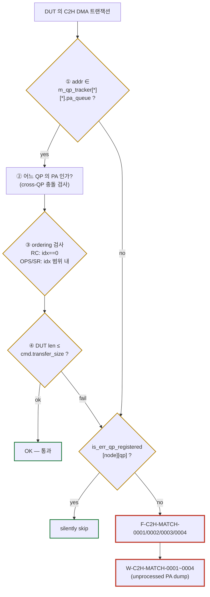
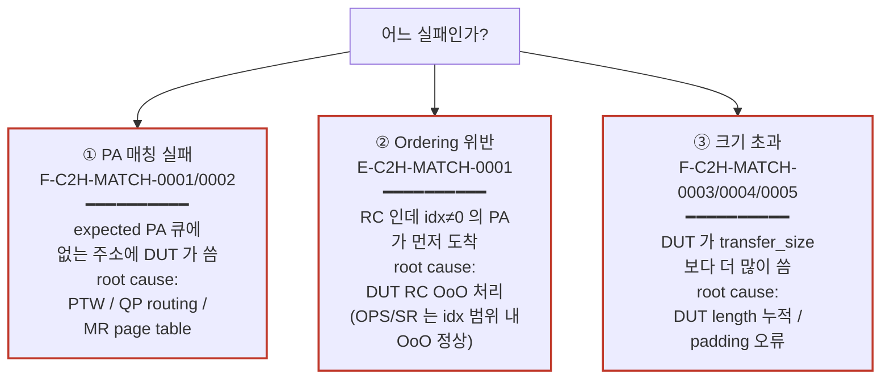

# Module 10 — Debug Case 3: C2H Tracker Error

<!-- DV-SKOOL-CH-CTX:start -->
<div class="chapter-context" data-cat="network">
  <a class="chapter-back" href="../">
    <span class="chapter-back-arrow">←</span>
    <span class="chapter-back-icon">🧪</span>
    <span class="chapter-back-text">RDMA Verification</span>
  </a>
  <span class="chapter-divider">›</span>
  <span class="chapter-marker">Module 10</span>
</div>
<!-- DV-SKOOL-CH-CTX:end -->

<!-- DV-SKOOL-CH-TOC:start -->
<div class="page-toc">
  <span class="page-toc-label">목차</span>
  <a class="page-toc-link" href="#1-why-care-이-모듈이-왜-필요한가">1. Why care?</a>
  <a class="page-toc-link" href="#2-intuition-도착-우편물의-3-가지-검문-기대-주소-기대-순서-기대-크기">2. Intuition</a>
  <a class="page-toc-link" href="#3-작은-예-실제-fail-log--unprocessed-pa-리스트로-root-cause-까지">3. 작은 예 — fail log → root cause</a>
  <a class="page-toc-link" href="#4-일반화-3-실패-유형-과-디버그-5-단계">4. 일반화 — 3 실패 + 5 단계</a>
  <a class="page-toc-link" href="#5-디테일-에러-id-ordering-규칙-원인-매트릭스-errqp-게이트">5. 디테일</a>
  <a class="page-toc-link" href="#6-흔한-오해-와-dv-디버그-체크리스트">6. 흔한 오해 + DV 디버그 체크리스트</a>
  <a class="page-toc-link" href="#7-핵심-정리-key-takeaways">7. 핵심 정리</a>
</div>
<!-- DV-SKOOL-CH-TOC:end -->

!!! objective "학습 목표"
    이 모듈을 마치면:

    - **Distinguish** 3 가지 C2H tracker 실패 — PA 매칭 실패 / ordering 위반 / 크기 초과 — 를 구분할 수 있다.
    - **Apply** RC FIFO 순서 강제 vs OPS/SR out-of-order 허용 규칙을 적용해 ordering 위반을 분류할 수 있다.
    - **Trace** 진단 로그 (`W-C2H-MATCH-0001~0003`) 에서 unprocessed PA 리스트를 추출하고 expected vs actual PA 를 비교할 수 있다.
    - **Justify** ErrQP 정리 직후 도착하는 지연 트랜잭션이 fatal 대신 silently skip 되어야 하는 이유를 설명할 수 있다.

!!! info "사전 지식"
    - [RDMA Module 04 — Service Types & QP FSM](../../rdma/04_service_types_qp/) (RC vs OPS/SR 의 ordering 의미)
    - [RDMA Module 05 — Memory Model](../../rdma/05_memory_model/) (IOVA → PA 변환, page table)
    - [Module 06 — Error Handling Path](06_error_handling_path.md) (`is_err_qp_registered`)
    - [Module 07 — H2C/C2H QID Reference](07_h2c_c2h_qid_map.md) (C2H QID 8/9 의 RESP 의미)

---

## 1. Why care? — 이 모듈이 왜 필요한가

### 1.1 시나리오 — _Wrong PA_ DMA write

당신의 RDMA test 가 `F-C2H-MATCH` fatal. DUT 가 host 의 _wrong PA_ 에 DMA write.

가능 원인:
- **PTW bug**: virtual → physical 변환 잘못.
- **QP routing**: 잘못된 QP 의 MR 사용.
- **MR page table**: page entry corruption.
- **Completion FSM**: PA 계산 logic bug.

C2H tracker 의 진단 로그 `W-C2H-MATCH-*`:
- _Expected_ PA 큐.
- _Actual_ PA (DUT 가 쓴 것).
- _Unprocessed_ expected PA (아직 안 와서 대기).

이 3 가지 비교로 _즉시_ 가설:
- Actual PA 가 _다른 QP 의 expected_ 와 매칭 → **QP routing bug**.
- Actual PA 가 _어디에도 매칭 안 됨_ → **PTW** 또는 **MR page table** bug.
- Actual PA 가 _다음 expected_ 와 매칭 (순서 잘못) → **completion FSM ordering bug**.

C2H tracker 는 DUT 가 host 에 쓴 **모든** DMA 가 "기대된 주소 + 기대된 순서 + 기대된 크기" 인지 검증하는 단일 게이트입니다. 매칭 실패는 곧 **DUT 가 host 메모리의 잘못된 위치에 데이터를 쏟았다** 는 신호이므로, root cause 가 PTW / QP routing / MR page table / completion FSM 중 어디인지 빠르게 좁히지 못하면 fsdb 에서 길을 잃습니다.

이 모듈을 건너뛰면 `F-C2H-MATCH-0002` 로그를 보고 "어느 QP 의 PA 인가? expected 와 왜 다른가? 다른 QP 와 우연히 매칭됐는가?" 같은 질문을 매번 처음부터 푸느라 시간을 낭비합니다. 진단 로그 (`W-C2H-MATCH-*`) 를 정확히 해석할 줄 알면 `fatal` 직전 한 줄에서 unprocessed PA 큐를 추출해 1 step 만에 가설 분기가 가능합니다.

> Confluence 출처: [C2H Tracker Error](https://mangoboost.atlassian.net/wiki/spaces/RDMADV/pages/1335656540/C2H+Tracker+Error)
> 코드: `lib/base/component/env/dma_env/vrdma_c2h_tracker/vrdma_c2h_tracker.svh`

---

## 2. Intuition — 도착 우편물의 3 가지 검문 (기대 주소 / 기대 순서 / 기대 크기)

!!! tip "💡 한 줄 비유"
    C2H tracker = **회사 우편실 검수원**. DUT 라는 배달부가 host 라는 사무실 책상마다 우편물을 가져다 놓을 때마다, 검수원이 (1) 받는 사람 주소가 명단에 있는가 (PA 매칭), (2) 같은 부서 (RC QP) 의 우편이라면 보낸 순서대로 도착했는가 (ordering), (3) 우편물 크기가 송장 크기 이하인가 (size) — 이 세 가지를 _전부_ 통과해야 합인. 한 가지라도 어긋나면 fatal.

### 한 장 그림 — 3 검문 + ErrQP 우회로



### 왜 이 디자인인가 — Design rationale

세 가지가 동시에 풀려야 했습니다.

1. **다중 QP 동시 트래픽** — 한 시뮬에서 수십 QP 가 host 메모리에 동시에 쓰므로, 단순 "다음 expected PA" 비교로는 안 됨 → `m_qp_tracker[node][qp]` per-QP 큐로 분리.
2. **Service type 별 ordering 의미가 다름** — RC 는 reliable connected 라서 strict FIFO, OPS/SR 는 performance 위해 OoO 허용 → §3 의 ordering 검사 분기.
3. **에러 시나리오에서 지연 트랜잭션** — `RDMAQPDestroy(.err)` 직후에도 in-flight DMA 가 도착할 수 있음 → 그때마다 fatal 이 나면 모든 에러 테스트가 깨짐 → `is_err_qp_registered` 우회로.

이 세 요구의 교집합이 3 검문 + ErrQP 게이트입니다.

---

## 3. 작은 예 — 실제 fail log → unprocessed PA 리스트로 root cause 까지

### Fail log

```
[F-C2H-MATCH-0002] C2H transaction not found for QP 0x000005 on node0:
                   addr=0x0000_0000_8800_2040, size=0x40
                   vrdma_c2h_tracker:790
[W-C2H-MATCH-0001] Current WRITE unprocessed PA List:
   QP 0x05: [0x0000_0000_8800_3000, 0x0000_0000_8800_3040, 0x0000_0000_8800_3080]
[W-C2H-MATCH-0002] Current READ unprocessed PA List: '{}
[W-C2H-MATCH-0003] Current RECV unprocessed PA List: '{}
```

### Step-by-step root cause

```
   Step 1   에러 ID = F-C2H-MATCH-0002 → PA 매칭 실패
            QP = 0x05, actual addr = 0x8800_2040, size = 0x40
              ▶ DUT 가 host 의 0x8800_2040 에 64 byte 썼는데
              ▶ TB 가 그 주소를 expected 로 가진 QP 가 없음

   Step 2   W-C2H-MATCH-0001 (WRITE unprocessed) 확인
            ─────────────────────────────────────────
            QP 0x05 의 expected WRITE PA = 0x8800_3000, 3040, 3080
              ▶ actual (0x8800_2040) 가 expected (0x8800_3000 …) 와
                page (4KB) 단위 1 page 차이
              ▶ 가설: PTW miss 결과의 PFN 이 1 page 어긋남

   Step 3   다른 QP 의 PA 리스트와 cross-reference
            ─────────────────────────────────────────
            grep "Current WRITE unprocessed" run.log
              ▶ QP 0x07 의 expected WRITE PA = 0x8800_2000, 2040, 2080
              ▶ 정확히 일치! → DUT 가 QP 0x05 의 데이터를
                                QP 0x07 의 메모리 영역에 씀
              ▶ root cause 후보:
                (a) DUT 가 dest_qp field 디코딩 잘못
                (b) DUT 의 QP routing table 이 두 QP 의 PA 영역 swap

   Step 4   TB IOVA → PA 변환 vs DUT PTW 결과 비교
            ─────────────────────────────────────────
            TB: m_iova_translator.translateIOVA(iova_for_qp5, mr_id5)
                  → 0x8800_3000 (정상)
            DUT: fsdb 의 PTE entry (QID 20 MISS_PA fetch)
                  → 0x8800_3000 fetch 했음 (PTW OK)
              ▶ PTW 자체는 정상 → root cause = (a) dest_qp 디코딩
              ▶ 다음 액션: DUT 의 BTH.DestQP 필드 처리 로직 추적

   Step 5   Fix 후 회귀
            ─────────────────────────────────────────
            DUT 측 dest_qp 디코딩 버그 fix 후
              ▶ QP 0x05 의 데이터가 0x8800_3000 으로 다시 라우팅
              ▶ F-C2H-MATCH-0002 사라짐
```

### 단계별 의미

| Step | 보는 것 | 발견 | 가설 |
|---|---|---|---|
| 1 | fatal log | actual addr 0x8800_2040, QP 0x05 | DUT 가 잘못된 위치에 씀 |
| 2 | `W-C2H-MATCH-0001` | 같은 QP 의 expected 는 0x8800_3000 대 | 1-page 차이 |
| 3 | 다른 QP 의 PA 리스트 | 0x8800_2040 = QP 0x07 의 expected | QP routing 오류 |
| 4 | TB vs DUT PTW | TB / PTW 모두 정상 PA 도출 | dest_qp 디코딩 |
| 5 | DUT fix + 회귀 | 해소 | root cause 확정 |

!!! note "여기서 잡아야 할 두 가지"
    **(1) `W-C2H-MATCH-*` 의 unprocessed PA 리스트는 fatal 직전에만 출력** — 후속 fatal 이 cascade 되면 첫 번째 W-* 만 의미 있음. `head -1` 로 추출.<br>
    **(2) "다른 QP 의 expected PA 와 일치" = QP routing 버그 신호** — PTW / IOVA 가 정상인데도 매칭 실패면 dest_qp 디코딩 또는 QP table swap 의심 (PTW 버그가 아님).

---

## 4. 일반화 — 3 실패 유형 과 디버그 5 단계

### 4.1 3 실패 유형 — 첫 분기



### 4.2 5 단계 디버그 절차

| Step | 무엇을 보나 | 어디 |
|---|---|---|
| 1 | 에러 ID 분류 (위 3 유형) | run.log 의 첫 `F-C2H-MATCH-*` 또는 `E-C2H-MATCH-*` |
| 2 | unprocessed PA 리스트 캡처 | `W-C2H-MATCH-0001~0004` |
| 3 | 다른 QP 의 PA 큐와 cross-reference | `grep "Current WRITE unprocessed"` 전체 |
| 4 | TB `translateIOVA` vs DUT PTW (QID 20) 비교 | M07 의 QID 매트릭스 |
| 5 | `trackCommand` 누락 (Zero-length) / ErrQP 게이트 확인 | M06 의 ErrQP 흐름 |

---

## 5. 디테일 — 에러 ID, ordering 규칙, 원인 매트릭스, ErrQP 게이트

### 5.1 대표 에러 메시지

#### PA 매칭 실패

| ID | 심각도 | 메시지 | 코드 위치 |
|----|--------|-------|---------|
| `F-C2H-MATCH-0001` | FATAL | `C2H transaction not found for node %s` (빈 노드) | `vrdma_c2h_tracker.svh:775` |
| `F-C2H-MATCH-0002` | FATAL | `C2H transaction not found for QP 0x%h on %s: addr=0x%h, size=0x%h` | `vrdma_c2h_tracker.svh:790` |
| `W-C2H-MATCH-0001` | WARNING | `Current WRITE unprocessed PA List: %p` (fatal 직전 진단) | `vrdma_c2h_tracker.svh:783` |
| `W-C2H-MATCH-0002` | WARNING | `Current READ unprocessed PA List: %p` | `vrdma_c2h_tracker.svh:784` |
| `W-C2H-MATCH-0003` | WARNING | `Current RECV unprocessed PA List: %p` | `vrdma_c2h_tracker.svh:785` |
| `W-C2H-MATCH-0004` | WARNING | `Current SRQ RECV unprocessed PA List: %p` | `vrdma_c2h_tracker.svh:788` |

#### Ordering 위반

| ID | 심각도 | 메시지 | 코드 위치 |
|----|--------|-------|---------|
| `E-C2H-MATCH-0001` | ERROR | Ordering violation — QP, op, tag, actual addr, found idx, expected idx, expected addr | `vrdma_c2h_tracker.svh:1037` |

#### 크기 초과

| ID | 심각도 | 메시지 | 코드 위치 |
|----|--------|-------|---------|
| `F-C2H-MATCH-0003` | FATAL | `Data transfer exceed the expected size for QP ... (OPS)` | `vrdma_c2h_tracker.svh:921` |
| `F-C2H-MATCH-0004` | FATAL | `Data transfer exceed the expected size for QP ... (non-OPS)` | `vrdma_c2h_tracker.svh:962` |
| `F-C2H-MATCH-0005` | FATAL | `Can not find the PA in the queue for QP ...` | `vrdma_c2h_tracker.svh:989` |

### 5.2 Ordering 규칙

| QP 타입 | 규칙 | Phase 1 동작 |
|--------|------|-------------|
| RC | **FIFO 순서 강제** | index 0 만 체크 |
| OPS / SR | **Out-of-order 허용** | 전체 인덱스 범위 체크 |

이 규칙은 RC 의 본질 (reliable connected = 순서 보장) 과 OPS/SR (performance / relaxed) 의 트레이드오프에서 나옵니다. RC 는 strict ordering 의 의미가 spec 정의이며, 검증의 첫 invariant. OPS/SR 는 같은 QP 의 다중 outstanding 이 보장 없이 도착할 수 있고, 그 경우 검증은 set 동등성으로 완화.

### 5.3 5 단계 디버깅 — 자세히

#### Step 1 — Ordering 위반: 원본 I/O WQE 확인

`E-C2H-MATCH-0001` 발생 시 에러 로그에 **C2H 가 올라와야 하는 순서** 가 표시됩니다.

추적 절차:

1. 에러 로그의 `expected idx`, `expected addr`, `found idx`, `actual addr` 추출
2. `m_qp_tracker[node][qp].write_pa_queue` (또는 read/recv) 를 시간순 dump
3. 두 원본 I/O WQE 의 발행 시점 + DUT 처리 시점 비교

#### Step 2 — PA 매칭 실패: C2H QID + 메모리 범위 확인

`F-C2H-MATCH-0002` 발생 시 fatal 직전 진단 로그 (`W-C2H-MATCH-0001~0003`) 가 출력됩니다.

C2H QID 로 원인 분류 ([Module 07](07_h2c_c2h_qid_map.md)):

- QID 8–9 (`RESP_C2H_QID`): 데이터 write — 어느 QP 의 write 인가?
- QID 10–11 (`COMP_C2H_QID`): CQE write 가 잘못 매칭되었나? (드물게)

메모리 범위 매핑:

1. `addr=0x%h` 를 `m_qp_tracker[*][*].{write,read,recv}_pa_queue` 전체에 cross-reference
2. 어느 QP 의 expected PA 와 일치하는지 확인 — 다른 QP 의 PA 에 우연히 매칭되면 **DUT QP routing 오류**
3. 어느 PA 에도 없으면 PTW 버그 또는 IOVA 변환 차이 의심

#### Step 3 — TB vs DUT PA 변환 비교

- TB: `m_iova_translator.translateIOVA(iova, mr_id)` → expected PA
- DUT: PTW 결과 (fsdb 에서 PTE entries, QID 20 MISS_PA fetch)
- 두 결과 비교 → 어느 단계에서 갈렸는지 확인

#### Step 4 — `trackCommand` 에서 커맨드 등록 여부

- driver 가 cmd 를 발행할 때 c2h_tracker 의 `trackCommand` 가 호출됨
- Zero-length transfer 는 등록 자체가 skip 될 수 있음 (Zero-length drop)
- `m_qp_tracker[node][qp].write_cmd_length_queue` 에 0 이 있으면 안 됨 — `F-C2H-TBERR-0004` 가 잡음

#### Step 5 — C2H DMA 트랜잭션 자체 확인

- fsdb 에서 QID, addr, size 시퀀스 추적
- `len > expected size` → `F-C2H-MATCH-0003/0004` (OPS / non-OPS 분리)

### 5.4 흔한 원인 매트릭스

| 원인 | 증상 | 확인 방법 |
|------|------|---------|
| DUT PTW 버그 | addr 가 PA 리스트 어디에도 없음 | TB `translateIOVA` vs DUT PTW |
| DUT QP routing 오류 | C2H QID 가 잘못된 QP 가리킴 | C2H QID vs 원본 WQE 의 QP 번호 |
| MR page table 설정 오류 | 특정 MR 의 커맨드만 실패 | `buildPageTable` 로그, PA 범위 |
| DUT out-of-order 처리 (RC) | `E-C2H-MATCH-0001` ordering violation | 원본 WQE 두 개의 DUT 처리 순서 |
| C2H addr 가 다른 QP 의 PA 에 매칭 | 잘못된 QP 의 데이터 | addr 를 전체 QP PA 리스트와 교차 |
| Zero-length drop | 커맨드가 등록 안 됨 | `transfer_size` 확인 |
| QP deregister 타이밍 | 에러 QP 정리 후 지연 C2H 도착 | `err_qp_registered` 상태 (M06) |
| MR re-register race | 구버전 PA 가 사용됨 | `gen_id`, Fast Register 타이밍 |
| C2H 크기 초과 | `F-C2H-MATCH-0003/0004` | DUT C2H size vs WQE transfer_size |

### 5.5 빠른 트리아지 — 한 줄 결정

| 관찰 | 가설 |
|------|------|
| `F-C2H-MATCH-0001` (빈 노드) | 노드가 한 번도 트랜잭션 발행 안 함 — c2h_tracker 가 노드 인식 못함 / `cfg.num_nodes` 오류 |
| `F-C2H-MATCH-0002` + addr 가 다른 QP 의 PA 와 일치 | DUT QP routing — RDMA opcode 의 dest_qp 처리 오류 |
| `F-C2H-MATCH-0002` + addr 가 어느 QP PA 와도 무관 | DUT PTW 또는 IOVA 변환 차이 |
| `E-C2H-MATCH-0001` on RC QP | DUT RC out-of-order 처리 (spec 위반) |
| `E-C2H-MATCH-0001` on OPS/SR QP | 보통은 정상 — index 범위 내 OoO 면 통과해야 함 |
| `F-C2H-MATCH-0003/0004` | DUT 가 expected 보다 더 많이 씀 — 패딩 / 잘못된 length |

### 5.6 ErrQP 와의 상호작용 — Module 06 연결

C2H tracker 는 ErrQP 를 다음과 같이 처리:

```systemverilog
// vrdma_c2h_tracker.svh:346-349
if((outstanding > 0) && !(qp_obj.isErrQP() || err_enabled)) begin
  // 정상 — outstanding 있으면 fatal
end
else if(qp_obj.isErrQP() || err_enabled) begin
  // ErrQP 면 fatal 대신 경고
end
```

또한 `processC2hTransaction` 단계에서 매칭 실패 시 `is_err_qp_registered.size() > 0` 면 fatal 대신 skip — **에러 QP 정리 직후 도착하는 지연 트랜잭션을 silently 처리** 합니다. 이 우회로가 없으면 의도된 에러 시나리오마다 fatal 이 cascade 되어 모든 에러 테스트가 깨집니다.

> [Module 06](06_error_handling_path.md) 의 `vrdma_c2h_tracker::err_enabled` 정의 (line 98) 참고.

### 5.7 c2h_tracker 위치와 데이터 구조 한 줄

```
   vrdma_c2h_tracker (lib/base/component/env/dma_env/...)
      ├── m_qp_tracker [node][qp]       per-QP per-node tracker
      │     ├── write_pa_queue          expected WRITE PA 큐
      │     ├── read_pa_queue           expected READ  PA 큐
      │     ├── recv_pa_queue           expected RECV  PA 큐
      │     ├── write_cmd_length_queue  expected size 큐
      │     └── ...
      ├── m_iova_translator             IOVA → PA 변환기
      ├── is_err_qp_registered[node][qp] ErrQP 게이트
      └── trackCommand() / processC2hTransaction() / check_phase()
```

---

## 6. 흔한 오해 와 DV 디버그 체크리스트

### 흔한 오해

!!! danger "❓ 오해 1 — 'OPS/SR 에서 `E-C2H-MATCH-0001` 나오면 무조건 DUT 버그'"
    **실제**: OPS/SR 는 **out-of-order 허용** 이라, idx 범위 내 OoO 면 통과해야 정상. `E-C2H-MATCH-0001` 이 OPS/SR QP 에서 나면 _그 자체가 TB false-positive_ 일 가능성 높음 — c2h_tracker 의 service-type 분기 로직 또는 `m_qp_tracker` 의 QP type 인식부터 확인.<br>
    **왜 헷갈리는가**: RC 의 strict FIFO 가 기본 직관이라, ordering=violation = bug 로 단순 등치.

!!! danger "❓ 오해 2 — 'PA 매칭 실패면 무조건 PTW 버그'"
    **실제**: PA 가 어느 QP 큐에도 없을 때만 PTW 의심. 다른 QP 의 expected PA 와 일치하면 그건 _QP routing_ 버그 — PTW 자체는 정상. §3 의 worked example 이 이 케이스.<br>
    **왜 헷갈리는가**: PA 미스 = 주소 변환 미스 라는 단순 등치.

!!! danger "❓ 오해 3 — 'ErrQP 면 매칭 실패가 silently skip 되니 안 봐도 됨'"
    **실제**: silently skip 되는 건 **이미 `is_err_qp_registered=1` 인 QP** 의 지연 트랜잭션. 정상 QP 의 매칭 실패는 그대로 fatal. ErrQP 게이트는 의도된 에러 시나리오 보호용이지, 일반 매칭 실패의 면죄부가 아님.

!!! danger "❓ 오해 4 — 'C2H QID 만 보면 어느 QP 인지 알 수 있다'"
    **실제**: QID 는 _서브시스템_ (RESP / COMP / ZERO / CC) 을 식별할 뿐, _QP_ 는 식별 못함. QP 는 트랜잭션의 host address 를 `m_qp_tracker[*][*].pa_queue` 와 비교해야 알 수 있음. QID 와 QP 를 혼동하면 분류가 한 층 어긋남.

!!! danger "❓ 오해 5 — '`W-C2H-MATCH-*` 는 단순 정보 로그라 봐도 안 봐도 됨'"
    **실제**: `W-*` 는 fatal **직전** 의 한 번뿐인 unprocessed PA dump — 후속 fatal 들이 cascade 되면 첫 W-* 외에는 의미 없음. fatal 보고 시 가장 먼저 `head -10 | grep W-C2H-MATCH` 로 캡처해야 함.

### DV 디버그 체크리스트

| 증상 | 1차 의심 | 어디 보나 |
|---|---|---|
| `F-C2H-MATCH-0001` (빈 노드) | 노드 자체가 트랜잭션 발행 안 함 | `cfg.num_nodes`, c2h_tracker per-node init |
| `F-C2H-MATCH-0002` + 다른 QP PA 와 일치 | DUT dest_qp 디코딩 / QP routing | DUT BTH.DestQP 처리 fsdb |
| `F-C2H-MATCH-0002` + 어느 QP PA 와도 무관 | PTW 또는 IOVA 변환 | TB `translateIOVA` vs DUT QID 20 |
| `E-C2H-MATCH-0001` on RC QP | DUT RC OoO 처리 (spec 위반) | DUT 의 RC reorder logic, 원본 WQE 시점 |
| `E-C2H-MATCH-0001` on OPS/SR QP | TB false-positive — c2h_tracker QP type 인식 | `m_qp_tracker[*][*]` 의 service_type 필드 |
| `F-C2H-MATCH-0003/0004` (크기 초과) | DUT length 누적 / padding 오류 | DUT C2H size vs WQE.transfer_size |
| `F-C2H-MATCH-0005` (PA queue empty) | `trackCommand` 가 등록 안 함 | Zero-length drop 또는 race |
| 특정 page 에서만 mismatch | MR page table boundary 오류 | `buildPageTable`, QID 20 MISS_PA |
| ErrQP 정리 직후 fatal cascade | `is_err_qp_registered` 게이트 미작동 | M06 의 ErrQP flow, deregister 시점 |

---

## 7. 핵심 정리 (Key Takeaways)

- 3 분류: PA 매칭 / ordering / 크기 초과 — 첫 분기점.
- RC 는 strict FIFO, OPS/SR 는 OoO 허용 — error 분류 시 두 번째 분기점.
- `W-C2H-MATCH-*` 진단 로그가 unprocessed PA 큐를 보여줌 — fatal 직전에 반드시 캡처.
- "다른 QP 의 expected PA 와 일치" = QP routing 버그 신호 (PTW 버그 아님).
- ErrQP 정리 시 `is_err_qp_registered` 가 후속 매칭 실패를 silently skip — 의도된 동작, 정상 QP 에는 적용 안 됨.

!!! warning "실무 주의점"
    - `W-C2H-MATCH-*` 는 fatal 직전 1 회만 — `head -10` 로 즉시 캡처. cascade 된 fatal 의 W-* 는 의미 없음.
    - OPS/SR QP 의 ordering violation 은 c2h_tracker 의 QP type 인식부터 의심 (TB false-positive 가능).
    - Zero-length transfer 는 `trackCommand` 자체가 skip 될 수 있음 → `F-C2H-MATCH-0005` 의 root cause 가 TB 측일 수도.

### 7.1 자가 점검

!!! question "🤔 Q1 — Match 가설 분기 (Bloom: Analyze)"
    `F-C2H-MATCH-0002`. Actual PA 가 _expected 와 다른 PA_. 어디 의심?

    ??? success "정답"
        Actual PA 와 _다른 QP_ 의 expected 비교:
        - 다른 QP 의 expected 와 match → **QP routing bug**.
        - 어디에도 match 안 됨 → **PTW** 또는 **MR page table** bug.
        - Next expected 와 match (순서 잘못) → **completion FSM ordering bug**.

!!! question "🤔 Q2 — Zero-length corner case (Bloom: Evaluate)"
    Zero-length WRITE. `F-C2H-MATCH-0005` 발생. TB 측 issue?

    ??? success "정답"
        가능. `trackCommand` 가 _zero length_ 일 때 skip 또는 단순 처리 → expected queue 에 안 들어감. DUT 가 정상 처리 (no DMA) → tracker 가 mismatch 보고.

        대응:
        - Zero-length spec 동작 확인 (DUT 가 _no DMA_ 또는 _zero-byte DMA_?).
        - TB 의 `trackCommand` zero-length 처리 일관성 검토.

### 7.2 출처

**Internal (Confluence)**
- `C2H Tracker Error` (id=1335656540)

---

## 다음 모듈

→ [Module 11 — Unexpected Error CQE](11_debug_unexpected_err_cqe.md): DUT 가 에러 CQE 를 발생시킬 때 RETRY 계열 분기와 `expected_error` promote 패턴.

[퀴즈 풀어보기 →](quiz/10_debug_c2h_tracker_quiz.md)


--8<-- "abbreviations.md"
